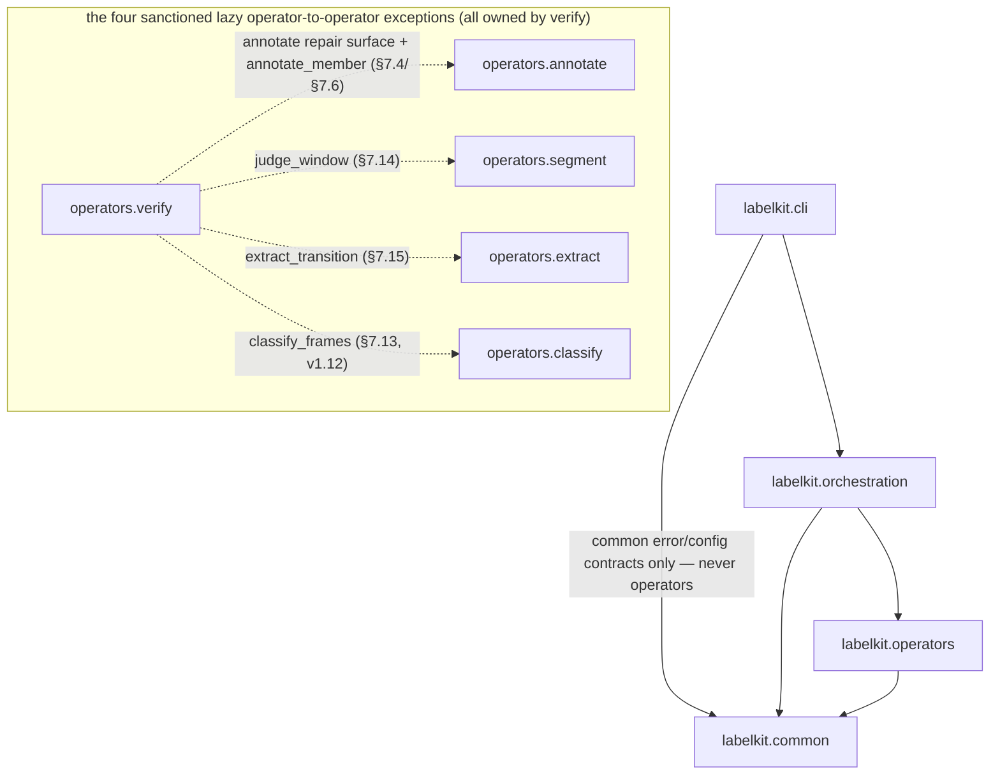
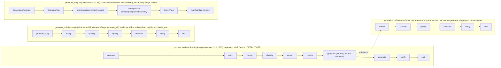

# LabelKit — Cross-Module Interface Contract (CONTRACTS.md)

**Status: FROZEN.** This document is the single interface contract for parallel implementation of
M1–M16 + CLI by independent engineers. It is derived from the design spec v1.4 base through the
v1.18 sequence-generation redesign (`spec/*.md` and
`docs/dev/SPEC-sequence-generation-redesign.md`), which
remains the authority for *algorithms and behavior*; this document is the authority for *names,
signatures, types, defaults, file formats, and prompt text*. Where the spec left a signature or
format implicit, the decision is frozen here and tagged **[FROZEN HERE]** (all such decisions are
also listed in §12). Any deviation requires editing this file first.

The v1.18 source is commit `ce6b1f2`; the frozen specification SHA-256 is
`f9cc60754cdcbdbe92eac37835e7f7db7a7cdd7ea7310a9a26bfe490e1685f97`.

Ground rules for every implementer:

- Python ≥ 3.11. Deps: `httpx`, `jsonschema`, `datasketch`, `Pillow`, `imagehash`, `json_repair`,
  `numpy`, `jsonpatch`, `jsonpointer`, stdlib `tomllib`, and — v1.10 (U4, spec §2.6 whitelist revision) — `rich`, CLI-layer
  only: lazily imported inside `labelkit/cli/console.py`, the sole touchpoint (operators/common
  never import it; M1 probes importability via `find_spec` without importing); v1.18 retains the
  narrow algorithm-library exception `ortools==9.15.6755`, imported only by
  `labelkit/operators/generation/planner.py`. Nothing else. OR-Tools is not an application
  framework, and there is no runtime substitute or version fallback.
- Code identifiers: English. **Comments and docstrings: Chinese** (the 2026-08-14 code-rule
  remediation — see §12 and spec §1.6). **Everything a user or a machine reads — log lines, error
  messages, CLI output, exception text, report/trace payloads: English.** LLM prompt templates are
  the exception in the other direction: the exact Chinese text given in §10 of this document
  (the contract-level completion of the spec's frozen families), together with the spec-frozen output data it produces
  (`thread_seam` step text, defect-table `detail` strings, packaged rubric criteria), stays
  Chinese verbatim.
- Do not rename any field, key, event, or error code defined here. Tests assert exact strings.
- Import discipline (no cycles): production imports use only the layered package paths below;
  the former flat modules and `labelkit.config` package do not exist.
  `labelkit.common.contracts.types` and `labelkit.common.errors` import nothing from `labelkit`;
  `labelkit.common.config.model` imports nothing from `labelkit` except
  shared contract types if needed; `labelkit.common.runtime.llm_client` imports only common-layer
  contracts, errors, config, observability, and — v1.11 — the sibling
  `labelkit.common.runtime.budget` (which itself references llm_client's `PromptBundle` under
  `typing.TYPE_CHECKING` only — the stage.py convention, so no cycle);
  `labelkit.common.runtime.schema_engine` imports the
  common runtime LLM client plus common errors/observability; `labelkit.common.contracts.stage`
  imports runtime/config/observability types under `typing.TYPE_CHECKING` only. Common never imports
  operators or orchestration. `labelkit.operators.generation` imports only common and its own
  sibling generation modules; it never imports orchestration. Operator modules
  import common and declared stdlib/third-party
  dependencies, never orchestration and **never each other** — with the sanctioned lazy-import
  exceptions that `labelkit.operators.verify` calls the public repair surface from
  `labelkit.operators.annotate` (§7.4; used per §7.6), v1.8, the public direct-call surfaces
  `labelkit.operators.segment.judge_window` / `labelkit.operators.extract.extract_transition`
  (§7.14/§7.15; used by the stream repair driver, §7.6) and, v1.12, the public direct-call surface
  `labelkit.operators.classify.classify_frames` (the fourth sanctioned operator-to-operator
  import — verify's member-reclaim frame-product re-run, §7.13/§7.6; the sibling reclaim
  surface `annotate.annotate_member` is NOT a fifth direction — it joins the §7.4 annotate
  repair-face family on the first leg). Orchestration may import common and
  operators. CLI imports orchestration's public entry points plus common error/config contracts,
  and never imports or instantiates operators.

The same discipline as a dependency graph (the bullet above stays the normative wording;
solid = layered production imports, dotted = the sanctioned lazy exceptions):



---

## 1. Package layout and ownership

```text
labelkit/
├── __init__.py                         # __version__ and TOOL_VERSION only
├── cli/
│   ├── __init__.py                     # public exports: main, build_parser, exit_code_for
│   ├── main.py                         # process entry, exception rendering, sole exit-code mapping
│   ├── parser.py                       # argparse definitions and CliOverrides conversion
│   ├── commands.py                     # run / validate / rubric user-facing handlers
│   └── console.py                      # v1.10 ConsoleRenderer — the SOLE rich lazy-import touchpoint: Live canvas, snapshot rendering, cbreak keyboard, log-stream takeover/restore, degradation (§7.12)
├── common/
│   ├── contracts/
│   │   ├── types.py                    # Ch.4 shared data types and frame/tree helpers
│   │   ├── stage.py                    # Stage protocol and RunContext
│   │   └── generation.py               # v1.18 generation program/trace/request/result contracts
│   ├── errors.py                       # cross-layer error vocabulary, exit codes, ErrorKind
│   ├── config/
│   │   ├── __init__.py                 # exports load/default_rubric/ResolvedConfig/parse_generation_config only
│   │   ├── model.py                    # all config dataclasses (M1)
│   │   ├── loader.py                   # M1 public entry: load / default_rubric re-export, console-mode verdict, ResolvedConfig assembly
│   │   ├── _collect.py                 # error/warning aggregator and typed table readers (package-private)
│   │   ├── _sections.py                # per-section TOML parsing into config dataclasses (package-private)
│   │   ├── _schemas.py                 # user/frame JSON Schema meta-validation and few-shot dry runs (package-private)
│   │   ├── _rubrics.py                 # rubric resolution: inline table and packaged default:* selectors (package-private)
│   │   ├── _classviews.py              # [class.*] / [frame.class.*] whitelist merge into class views (package-private)
│   │   ├── _constraints.py             # cross-section constraint driver and parse products (package-private)
│   │   ├── _generation_budget.py       # v1.18 sequence content limits and six-family budget proof
│   │   └── generation.py                # v1.18 sequence-generation parsing and typed config carriers
│   ├── runtime/
│   │   ├── budget.py                   # v1.11 context-budget primitives + ImageCostCalibrator (§7.17)
│   │   ├── generation_prompts.py       # v1.18 六个 sequence family 的共享精确构造器
│   │   ├── llm_client.py               # M9 transport, retry/key pools, concurrency, usage
│   │   ├── schema_engine.py            # M8 L0-L3 guarantee, repair, schema validation/stats
│   │   └── credentials.py              # secret materialization for run / validate --probe
│   ├── observability/
│   │   ├── obslog.py                   # M12 logs, trace, events, metrics, breaker state
│   │   └── console_format.py           # v1.10 plain progress/summary line formats (U21) — pure functions, the single source shared by the M11 emitter and the CLI renderer; byte-frozen (re-frozen 2026-08-14 onto the English strings)
│   └── extensions/
│       └── hooks.py                    # user validator resolution/execution/normalization
├── operators/
│   ├── ingest.py                       # M2
│   ├── segment.py                      # M14
│   ├── stitch.py                       # M16
│   ├── dedup.py                        # M3
│   ├── classify.py                     # M13
│   ├── extract.py                      # M15
│   ├── quality.py                      # M4
│   ├── generate.py                     # M6
│   ├── generation/
│   │   ├── __init__.py
│   │   ├── flat.py                     # v1.12 flat generation implementation
│   │   ├── program.py                  # GenerationProgram compiler
│   │   ├── planner.py                  # deterministic CP-SAT ScenarioPlan compiler
│   │   ├── scenario.py                 # ScenarioSeed and per-event scenario loop
│   │   ├── state.py                    # JSON Patch execution and state evaluation
│   │   ├── render.py                   # frame/noise rendering
│   │   ├── evaluate.py                 # pattern/semantic/noise evaluators
│   │   └── project.py                  # main/stream projection and CrossView reconciliation
│   ├── annotate.py                     # M5
│   ├── verify.py                       # M7
│   └── emitter.py                      # M11
├── orchestration/
│   ├── __init__.py
│   ├── orchestrator.py                 # M10 batch/stage lifecycle and report aggregation
│   ├── factory.py                      # operator construction and frozen pipeline order
│   ├── generation_delivery.py          # v1.18 exact slot delivery and attempt transactions
│   └── runtime.py                      # runtime object-graph assembly and public run/validate entry
└── data/rubrics/
    ├── default_text.toml
    ├── default_ui.toml
    └── default_trajectory.toml
```

`labelkit/common/errors.py`, `labelkit/common/contracts/types.py`,
`labelkit/common/contracts/stage.py`, and `labelkit/common/config/model.py` are the canonical homes
of the verbatim frozen material in sections 3–6. Changes to their frozen content still require
updating this file first.

### 1.1 Canonical paths only

The directories above are the only implementation paths. The package root contains only
`labelkit/__init__.py`; the former flat modules (`labelkit.types`, `labelkit.stage`,
`labelkit.errors`, service/operator modules, and `labelkit.orchestrator`) and the former
`labelkit.config` package are intentionally removed. No re-export shim, module alias, or dynamic
forwarder may recreate them. Consumers must import the layered canonical modules.

`labelkit.cli` remains the public module name as the `labelkit/cli/` package; there is no
coexisting `labelkit/cli.py`. Its `__init__.py` exports the established CLI entry surfaces, and the
console-script target `labelkit.cli:main` remains unchanged. Public direct-call surfaces such as
`annotate_record`, `build_*_prompt`, `judge_window`, `extract_transition`, `classify_frames`
(v1.12 — the fourth sanctioned operator-to-operator import, ground rules above), `RunContext`,
`LLMClient`, and `SchemaEngine` retain their frozen signatures and behavior at their canonical
layered paths only.

### 1.2 Test ownership

Offline tests physically mirror the production owners: contracts under `tests/common/contracts/`,
config under `tests/common/config/`, runtime under `tests/common/runtime/`, observability under
`tests/common/observability/`, extensions under `tests/common/extensions/`, operators under
`tests/operators/`, and orchestration under `tests/orchestration/`. Key-pool unit coverage belongs
in `tests/common/runtime/test_llm_client.py`; stream-ingest coverage belongs in
`tests/operators/test_ingest.py`; v1.9 M16 stitch coverage belongs in
`tests/operators/test_stitch.py` (offline) and `tests/integration/test_stitch_llm.py`
(real-LLM judgments); v1.10 console coverage belongs in `tests/cli/test_console.py`
(renderer snapshots, keyboard, degradation) and
`tests/common/observability/test_console_format.py` (byte-frozen golden snapshots of the
plain line formats — the golden-snapshot layer of the three-layer regression anchor, U24);
v1.18 sequence-generation coverage mirrors its production owners: configuration in
`tests/common/config/test_generation.py`; frozen carriers in
`tests/common/contracts/test_generation_contracts.py`; shared prompt contracts in
`tests/common/runtime/test_generation_prompts.py`; pure compiler/planner/scenario/state/render/evaluate/
project behavior in `tests/operators/generation/`; transactional delivery in
`tests/orchestration/test_generation_delivery.py`; and real endpoint coverage in
`tests/integration/test_sequence_generation_llm.py` plus
`tests/integration/test_sequence_generation_structured_output_llm.py`. The exact pure files are
`test_program.py`, `test_planner.py`, `test_scenario.py`, `test_state.py`, `test_render.py`,
`test_evaluate.py`, and `test_project.py`; the CLI golden is
`tests/cli/goldens/dryrun-sequence-generation.txt`. Integration tests use the
real DeepSeek and z.ai routes prescribed by the repository guidance; no mock LLM transport is
introduced. Existing seam coverage remains with `test_config.py`, `test_paths_hooks.py`,
`test_types.py`, `test_hooks.py`, `test_budget.py`, `test_credentials.py`,
`test_generation_prompts.py`,
`test_schema_engine.py`, `test_dedup.py`, `test_quality.py`, `test_annotate.py`,
`test_verify.py`, `test_emitter.py`, `test_ingest.py`, `test_orchestrator.py`, and the CLI tests.
A separate compatibility-import test,
`test_key_pool.py`, or
`test_stream_ingest.py` is forbidden. The exact file allowlist is normative in
`docs/dev/SPEC-package-layer-reorganization.md` §6.1.

`tests/cli/test_cli.py` owns both exact production- and test-file manifests. They must match the
v1.18 tree and files above: every new generation package/test/golden is listed, every deleted
sequence-generation package/test/golden is absent, and no undeclared compatibility module is
permitted. The completed gate must demonstrate every v1.18 specification use case, interface and
error lane at 100%, production function coverage 100%, line coverage at least 85% and branch
coverage at least 75%; real-LLM tests remain outside the offline mutation/coverage denominator.

---

## 2. Architecture recap (normative)

Four physical layers (spec §2.2 and package-layer reorganization spec):
`labelkit.cli → labelkit.orchestration → labelkit.operators → labelkit.common`. Common contains
cross-layer contracts and shared capabilities, not data-processing business logic: M1 config;
M8/M9 under `common.runtime`; M12 under `common.observability`; user hooks under
`common.extensions`; and the cross-layer error vocabulary at the `common.errors` root. Canonical
files: errors at `labelkit/common/errors.py`; SchemaEngine/LLMClient at
`labelkit/common/runtime/schema_engine.py` and `labelkit/common/runtime/llm_client.py`; hooks at
`labelkit/common/extensions/hooks.py`; v1.18 generation contracts at
`labelkit/common/contracts/generation.py`, algorithms at `labelkit/operators/generation/`, and
exact delivery at `labelkit/orchestration/generation_delivery.py`; obslog at
`labelkit/common/observability/obslog.py`. Operators
(M2 ingest, M14 segment, M16 stitch, M3 dedup, M13 classify, M15 extract, M4 quality, M5 annotate,
M6 generate, M7 verify, M11 emitter) depend only on common, subject solely to the four sanctioned
lazy operator calls (verify→annotate/segment/extract/classify, §7.4/§7.6/§7.14/§7.15/§7.13 —
the classify leg is v1.12's `classify_frames`). Orchestration may
depend on common and operators and owns construction/order/lifecycle; CLI calls orchestration's
public runtime entry points and owns only parsing, user interaction, and the sole exception-to-exit-
code mapping. Common depends on neither operators nor orchestration; operators never depend on
orchestration; CLI never imports operators.

Pipeline order per batch — the three chain forms (process superset / generation re-flow /
`generate_only`):



segment, stitch and extract are DEFAULT OFF; with all three disabled the process chain degrades
byte-identically to the v1.7 chain
`dedup → classify → quality → generate → annotate → verify → emit`. `generate.enabled` and
`segment.enabled` are mutually exclusive (M1, the segment-precondition rule — §6.3 rule 29) and
`stitch.enabled` requires `segment.enabled` (the stitch-requires-segment rule, §6.3 rule 37), so
the generate slot never coexists with the stream stages (stitch included) and stitch never
appears in the generation re-flow chain. Generation sub-batches run the re-flow chain above
(generated records enter carrying an `"inherited"` Classification, which the idempotent
classify stage skips — §7.13). In `generate_only` mode, classify/quality/annotate are
individually optional per switches; segment/stitch/extract never participate — segment requires
process mode and stitch requires segment, §6.3.

Statuses: `active | dropped_dup | dropped_lowq | dropped_verify | failed | absorbed |
dropped_noise | stitched` (EIGHT values; `absorbed`/`dropped_noise` are v1.8: `absorbed` =
member frame absorbed into an episode envelope by M14, `dropped_noise` = noise/below-min-len
frame dropped by M14 or shrunk out by M7 member surgery; `stitched` is v1.9: merged-fragment
episode shell terminal-marked by M16 stitch — the stitch-rebind exception, §5/§7.16). Stages
never delete list elements; they flip `status` and attach evidence.

---

## 3. `labelkit/common/contracts/types.py` — verbatim

```python
"""Shared data types (spec ch.4). Frozen contract — do not edit without updating CONTRACTS.md."""
from __future__ import annotations

import base64
import io
from dataclasses import dataclass, field
from pathlib import Path
from typing import Literal, Mapping

Status = Literal[
    "active",          # alive, keeps flowing
    "dropped_dup",     # M3 judged duplicate
    "dropped_lowq",    # M4 below quality gate
    "dropped_verify",  # M7 verdict fail with policy=drop (or repair budget exhausted)
    "failed",          # processing error (irreparable schema / provider retries exhausted ...)
    "absorbed",        # v1.8 additive: member frame absorbed into a sequence envelope
                       #   (M14 contract ②b, §5/§7.14); THIRD ROUTE — written to neither
                       #   main output nor rejects, counted only (§7.10/§9.3)
    "dropped_noise",   # v1.8 additive: noise/short-segment frame (M14: reason "noise" /
                       #   "below_min_len", §7.14) or verify repair shrink
                       #   (M7: "off_task_member", §7.6) → rejects (§9.2)
    "stitched",        # v1.9 additive: merged-fragment episode shell (M16 contract ②c,
                       #   §5/§7.16; terminal); FOURTH ROUTE — written to neither main
                       #   output nor rejects, counted only (§7.10/§9.3)
]


@dataclass(frozen=True)
class RecordRef:
    source_file: str                       # path relative to run.input ("" for generated records)
    line_no: int | None                    # text modality: 1-based line number
    pair_index: int | None                 # UI modality: file-pair index
    generated_from: tuple[str, ...]        # process-mode generated sample: seed record ids;
                                           # everything else (incl. generate_only samples): ()
                                           # — synthetic-ness is judged by `generator`, not this (v1.4)
    generator: Mapping | None = None       # generated records: {"llm": <profile>, "style": <name>|None}
                                           # non-generated records: None


@dataclass(frozen=True)
class ImageRef:
    path: Path
    format: Literal["png", "jpeg"]         # ".jpg"/".jpeg" both map to "jpeg"
    size_bytes: int

    def load_base64(self, max_px: int) -> tuple[str, str]:
        """Load from disk at call time. If the longer edge exceeds max_px, downscale
        proportionally (Pillow) before encoding. Returns (media_type, b64) where media_type is
        "image/png" | "image/jpeg". Bytes are not cached — used and discarded (spec §2.6)."""
        ...


@dataclass(frozen=True)
class UINode:
    node_id: str
    parent_id: str | None
    depth: int
    role: str                              # widget role normalized from class/type
    text: str
    content_desc: str
    bounds: tuple[int, int, int, int]      # (l, t, r, b) pixels
    visible: bool
    extra: Mapping[str, str]               # non-whitelisted source fields, values stringified


@dataclass(frozen=True)
class UITree:
    nodes: tuple[UINode, ...]              # depth-first order

    def serialize(self, max_chars: int | None = None, quantize_px: int = 0) -> str:
        """Canonical linearization (spec §4.3), shared by M3 dedup (quantize_px =
        dedup.bounds_quantize_px) and M5 prompts (quantize_px = 0, max_chars =
        input.ui_tree_max_chars).

        Rules (exact):
        - Traverse `nodes` in stored (depth-first) order; skip nodes with visible == False.
        - One line per node, joined with "\\n", no trailing newline:
            line = ("  " * depth) + role
                   + (f' "{text}"' if text else "")
                   + (f' desc="{content_desc}"' if content_desc else "")
                   + f" [{l},{t},{r},{b}]"
                   + "".join(f" {k}={v}" for k, v in extra.items() if v)
          (extra in insertion order; indentation is TWO spaces per depth level — matches the
           worked examples in spec 3.2.7/3.9.4 [FROZEN HERE, see §12].)
        - If quantize_px > 0, each coordinate is floor-divided first: c = c // quantize_px.
        - If max_chars is not None and the full output exceeds it: keep the longest prefix of
          whole lines whose joined length (incl. "\\n" separators and the marker line below)
          ≤ max_chars, then append a final line "…(truncated N nodes)" where N = number of
          visible nodes omitted. [FROZEN HERE]
        """
        ...


@dataclass(frozen=True)
class Record:
    id: str                                # sha256 hex prefix [:16]; rule per modality, see below
    modality: Literal["text", "ui"]
    text: str | None                       # text modality: extracted text; UI modality: None
    raw: Mapping | None                    # text modality: original line object; UI: None
    ui_tree: UITree | None
    image: ImageRef | None
    ref: RecordRef
    kind: Literal["single", "sequence"] = "single"
                                           # v1.8 additive (appended with a default — every
                                           # pre-v1.8 construction site stays unchanged):
                                           # "sequence" = an M14-assembled episode record (§7.14)
    members: tuple["Record", ...] = ()     # v1.8 additive: sequence → member frames in order-key
                                           # ascending order; single → always ().
                                           # Sequence-record field convention (S24, spec §4.1):
                                           # text/raw/ui_tree/image = None; modality = the
                                           # members' modality; id = the sequence rule below
                                           # (fixed at formation — M7 member surgery / M16
                                           # thread rebinding never recompute it, v1.9 T22);
                                           # ref = RecordRef(source_file=first
                                           # member's source, line_no=first member's line_no,
                                           # pair_index=first member's pair_index,
                                           # generated_from=(), generator=None) — full member
                                           # provenance travels in _meta.stream.member_sources
                                           # (§9.1), not in ref
```

**Record id rules (M2/M6/M14, normative):**
- text modality: `sha256(canonical_json(raw).encode("utf-8")).hexdigest()[:16]` where
  `canonical_json(x) = json.dumps(x, sort_keys=True, ensure_ascii=False, separators=(",", ":"))`.
- UI modality: `sha256(uitree_file_bytes + image_file_bytes).hexdigest()[:16]`.
- generated records (M6): `raw = {input.text_field: sample_text}`, then the text rule.
- sequence records (M14, v1.8): `sha256("\n".join(member_ids).encode("utf-8")).hexdigest()[:16]`
  over the member ids in order-key ascending order, fixed at episode formation — M7 member
  surgery never recomputes it (spec 3.14.4, the sequence-assembly record-build step), and
  neither does M16's thread rebinding (the record-rebind write of the stitch-rebind exception,
  §5; v1.9): the surviving envelope keeps its id, which doubles as `thread_id` and
  `_meta.stream.episode_id`/`thread_id` (T22 identity chain).

```python
@dataclass(frozen=True)
class Classification:                      # v1.7: M13 classify verdict (spec 3.13, §4.1)
    label: str                             # routing label of THIS envelope
    labels: tuple[str, ...]                # the record's full hit set (declaration order;
                                           # single assignment: always one element)
    source: Literal["llm", "fallback", "inherited"]
    detail: Mapping                        # reason / sc stats / fallback trace (kind, message)


@dataclass(frozen=True)
class DedupInfo:
    kind: Literal["unique", "exact", "near_text", "near_image", "near_both", "near_semantic"]
    cluster_key: str                       # exact-dedup key ([:16] hex) of the cluster head;
                                           # unique records carry their own key
    kept_id: str | None                    # duplicates: id of the retained record; unique: None


@dataclass(frozen=True)
class Transition:                          # v1.8: one M15 extract verdict for an adjacent member
                                           # pair (spec §4.2), carried by PipelineItem.transitions
    index: int                             # rebuilt ordinal — ALWAYS equals the position in the
                                           # transitions tuple; renumbered after member surgery so
                                           # the invariant len(transitions) == len(members) - 1
                                           # stays true (S31)
    action: Mapping                        # object that passed action_schema (§10.7):
                                           # {action_type, target, value, description} —
                                           # field semantics per the §10.10 table
    model: str                             # provider model string of the extracting profile
                                           # ("" on a v1.9 thread-seam placeholder — no call)
    attempts: int                          # 1 + number of L3 repair calls (0 on a seam placeholder)
    detail: Mapping                        # fallback trace: {kind: "extraction_invalid", message}
                                           # (S16); surgery re-seam: {reseamed: True} (S31);
                                           # v1.9 thread-seam placeholder: {"kind": "thread_seam",
                                           # "interrupted_by": [...]} (T10, zero-LLM — §7.15/§7.16);
                                           # {} for a clean extraction


@dataclass(frozen=True)
class QualityScore:
    criterion: str                         # rubric criterion key, or "__aggregate__"
    score: float | None                    # [0,1] normalized; None = unscored (all judgments failed)
    mode: Literal["pairwise_bt", "pointwise"]
    detail: Mapping                        # pairwise: {comparisons, wins, ties, log_theta}
                                           # pointwise: {raw_score (0-5), reason}
                                           # __aggregate__: {}


@dataclass(frozen=True)
class Usage:
    prompt_tokens: int = 0
    completion_tokens: int = 0

    def __add__(self, other: "Usage") -> "Usage":          # [FROZEN HERE]
        return Usage(self.prompt_tokens + other.prompt_tokens,
                     self.completion_tokens + other.completion_tokens)

    def __radd__(self, other: object) -> "Usage":          # [FROZEN HERE]
        # Supports `sum(usage_list)`: sum's implicit start is int 0.
        if other == 0:
            return self
        return NotImplemented


@dataclass(frozen=True)
class Annotation:
    output: Mapping                        # object that PASSED the user schema (L2)
    model: str                             # provider model string of the annotating profile
    attempts: int                          # 1 + number of L3 repair calls
                                           # (self-consistency: sum over the SUCCESSFUL samples)
    usage: Usage                           # tokens of first call + repair calls (successful samples if SC)
    sc: Mapping | None = None              # self-consistency only: {"n": int, "agreement_ratio": float}
                                           # [FROZEN HERE: carried here so M11 can write _meta]


@dataclass(frozen=True)
class VerificationResult:
    verdict: Literal["pass", "fail"]
    rounds: int                            # judged rounds incl. the first (pass on first review = 1)
    critiques: tuple[Mapping, ...]         # accumulated over rounds, in order:
                                           # {"aspect": str, "opinion": str[, "judge": str]}
    defects: tuple[Mapping, ...] = ()      # v1.8 additive (S7): stream defect-table entries
                                           # {"kind", "members", "position", "detail"} — kind is
                                           # the six-value enum of defect_verdict_schema (§10.7;
                                           # five v1.8 values + wrong_stitch appended v1.9, T15);
                                           # non-stream paths: always (); travels to
                                           # _meta.verification.defects (§9.1)


@dataclass(frozen=True)
class StageError:
    stage: str                             # stage name that produced the error
    kind: str                              # error classification code (§7.6 / common.errors.ErrorKind)
    message: str
    retryable: bool


@dataclass
class PipelineItem:                        # the ONLY mutable envelope; lifetime = one batch
    record: Record
    status: Status = "active"
    classification: Classification | None = None   # v1.7: written by M13 classify (or inherited)
    dedup: DedupInfo | None = None
    scores: dict[str, QualityScore] = field(default_factory=dict)
    annotation: Annotation | None = None
    verification: VerificationResult | None = None
    errors: list[StageError] = field(default_factory=list)
    session_id: str | None = None          # v1.8 additive: in-batch carrier of the session
                                           # boundary (S4) — stamped by M10 on frame envelopes at
                                           # batching, by M14 on the appended episode envelopes
                                           # (bookkeeping, not business logic); M7's repair
                                           # neighborhood query = session_id filter + batch list
                                           # position order
    thread_id: str | None = None           # v1.9 additive: stamped by M16 stitch on surviving
                                           # thread envelopes at thread opening (== record.id ==
                                           # episode_id, T22; doubles as the stitch idempotency
                                           # gate); None everywhere else. The three M16 duck
                                           # marks seam_indexes / seam_interrupted_by /
                                           # stitch_fragments travel alongside as duck-typed
                                           # envelope attributes (§7.16; copied by
                                           # classify._fan_out, §7.13)
    transitions: tuple[Transition, ...] | None = None
                                           # v1.8 additive: written by M15 extract (§7.15);
                                           # None = extract disabled / not reached (idempotency
                                           # gate: `transitions is not None` → skip)
    member_classifications: dict[str, Classification] | None = None
                                           # v1.12 additive: written by the M13 classify frame
                                           # pass or inherited from the v1.18 projector;
                                           # key = member record.id; None = no member-class route /
                                           # not reached (sequence generation always supplies it);
                                           # fan-out clones SHARE the dict BY REFERENCE (the
                                           # record/dedup family, copied by classify._fan_out)
    member_annotations: dict[str, Annotation] | None = None
                                           # v1.12 additive: written by the M5 annotate frame
                                           # pass (same execution gate); key = member record.id;
                                           # value None = that member's frame annotation FAILED
                                           # irreparably (failed 占键为 None, skipped 不占键 —
                                           # the dict shape is the single source of truth for
                                           # the members[] status三值); clones share by reference


# ── v1.8 shared frame helpers (spec §4.3, S12/S13) ──────────────────────────
# Module-level functions in labelkit/common/contracts/types.py, next to UITree.serialize — the shared
# rendering layer used by M14 segment, M15 extract, M13 classify (sequence
# branch) and M4 quality (sequence branch). Operator modules never depend on
# each other; shared rendering always sinks to this types layer.

def frame_digest(record: Record, max_chars: int) -> str:
    """Best-effort deterministic frame digest (S12 — UINode is a closed nine-field
    type; package/activity names are reachable only via `extra`):
    - UI modality:
        app      = first non-empty `extra` value among package|package_name|pkg
                   (visible nodes);
        activity = first non-empty `extra` value among
                   activity|activity_name|window_title (may be absent);
        title    = first visible non-empty text in DFS order;
        salient  = visible text/content_desc de-duplicated in encounter order;
                   Button/EditText/CheckBox-class interactive roles get a "*" prefix;
      the whole digest is truncated to max_chars (serialize truncation convention).
    - text modality: record.text truncated to max_chars.
    Poverty judgment: zero visible text nodes, or digest length < 8 ⇒ poor — the
    CALLER counts digest_poor_frames (report.stream, §9.3) and WARNs at most once
    per run; v1.11 (V4): the WARN guidance reads "attach frame screenshots by
    pointing segment.llm at a supports_vision=true profile" (the segment.use_vision
    key it formerly pointed at was removed in v1.11; the wording is the 2026-08-14
    English re-freeze of the same guidance). v1.11 (V9): M14 calls this ONCE per frame at
    SESSION level, BEFORE window packing — the digest vector feeds both the
    packer's per-frame costs and the §10.9 prompts (the pre-v1.11 per-window
    recomputation is gone; the poverty-guard path stays independent)."""
    ...


def tree_diff(a: UITree | None, b: UITree | None, quantize_px: int) -> Mapping:
    """Structural-key MULTISET matching over (role, bounds // quantize_px, depth)
    (S13 — node_id is NOT a cross-frame identity and must not be used as a match
    key); visible nodes only; O(n1 + n2); pure statistics, no semantic attribution
    (attribution belongs to M15). Returns:
    {added: int, removed: int, text_changed: int, change_ratio: float,
     app_changed: bool, title_changed: bool}."""
    ...
```

Notes binding on all implementers:

- `QualityScore.score` is `float | None` — the spec's `on_unscored` path requires representing
  "score = null" (spec 3.4.3 判定失败 row, §6.3 example semantics). **[FROZEN HERE]**
- `Annotation.sc` is an additive v1.2 field needed to carry `{n, agreement_ratio}` from M5 to M11
  (`_meta.annotation.sc`, spec 3.5.2/6.3). **[FROZEN HERE]**
- `Classification` / `PipelineItem.classification` are additive v1.7 fields (M13, spec §4.1).
  Multi-assignment fan-out clones share `record` and `dedup` **by reference** with their
  original envelope; all other containers are fresh defaults (§7.13).
- v1.8 additive fields (spec §4.1/§4.2, all appended with defaults — zero changes at
  pre-v1.8 construction sites): `Record.kind`/`Record.members`, `Transition`,
  `VerificationResult.defects`, `PipelineItem.transitions`/`PipelineItem.session_id`, and the
  two `Status` values `absorbed`/`dropped_noise`. Sequence records hold their members **by
  reference** (frozen objects shared, zero copy) — episode formation does not change the
  batch's memory order of magnitude (spec §2.6).
- v1.9 additive deltas (spec §4.1, same appended-with-defaults construction):
  `PipelineItem.thread_id` and the `Status` value `stitched`. The three thread duck marks
  stamped by M16 on surviving thread envelopes are deliberately NOT dataclass fields
  (duck-typed envelope attributes, the `session_split`/`noise_attribution` family):
  ① `seam_indexes: tuple[int, ...]` — each element is the seam pair's LEFT-member index in
  the rebound member tuple, the SAME coordinate as `Transition.index`/`_meta.stream.steps[].index`,
  range `[0, len(members) − 2]`; it has NO conversion relationship with `order_span`'s
  session-order key space (m-8); ② `seam_interrupted_by: tuple[tuple[str, ...], ...]` —
  positionally aligned with `seam_indexes`; the interrupting threads' `task_name`s in gap
  order (M16 computes these — extract has no cross-thread visibility, T10/T20); never empty
  for a seam; ③ `stitch_fragments` — session-ordered fragment table, elements
  `{order_span, member_count, cause ∈ "origin"|"resumed"|"rescued", source_episode}` (M11
  renders it as `_meta.stream.fragments`, §9.1). A fourth, frame-level audit mark
  `rescued_by = <surviving thread record.id>` is stamped on rescue-flipped frames next to
  their retained `noise_attribution` — trace/audit only, never emitted to any output channel.
- `frame_digest`/`tree_diff` are v1.8 module-level helpers whose docstrings above are the
  behavior contract (spec §4.3 末段); M14/M15/M13/M4 consume them — never re-implement
  digest/diff logic inside an operator module.
- Everything except `PipelineItem` is `frozen=True`. No module mutates a `Record`.

---

## 4. `labelkit/common/errors.py` — verbatim

```python
"""Exception hierarchy (spec §4.3) and error classification codes (spec §7.6)."""
from __future__ import annotations

import enum
from typing import Literal


class LabelKitError(Exception):
    """Base for all tool errors."""


class ConfigError(LabelKitError):
    """M1. Aggregates ALL validation errors (never just the first). CLI exit code 2."""
    def __init__(self, errors: list[str]):
        self.errors = errors
        super().__init__("\n".join(errors))


class InputError(LabelKitError):
    """M2, raised when an input.* policy is 'fail' (or no valid record exists /
    path missing at run start). Process mode only. CLI exit code 3."""
    def __init__(self, message: str):
        super().__init__(message)


class ProviderRetryableError(LabelKitError):
    """M9: retryable provider error with retries exhausted (v1.6: incl. park-budget overrun,
    run.max_park_s). Record-level → status='failed'."""
    def __init__(self, message: str, profile: str, retries: int,
                 key_env: str | None = None):
        self.profile = profile
        self.retries = retries
        self.key_env = key_env                # v1.6: env-var NAME of the last key tried (pools)
        super().__init__(message)


class ProviderFatalError(LabelKitError):
    """M9: non-retryable provider error (401/403/400/404, dims mismatch). Feeds the circuit
    breaker; a streak >= run.fatal_error_threshold ends the run with exit code 4.
    v1.6 pools: an auth failure absorbed by key rotation raises nothing — this exception is
    raised for auth only when the LAST live key gets disabled (spec 3.9.3)."""
    def __init__(self, message: str, profile: str, status_code: int | None = None,
                 key_env: str | None = None):
        self.profile = profile
        self.status_code = status_code
        self.key_env = key_env                # v1.6: env-var NAME of the failing key (pools)
        super().__init__(message)


class ContextOverflowError(LabelKitError):
    """v1.11 (V16/V24): the unified context-overflow signal. Record-level →
    status='failed', kind='context_overflow' (§7.6) → rejects; run continues.
    phase='precheck' — the M9 pre-dispatch invariant check fired (V16, zero provider
    interaction), or a packing layer found even the minimal semantic unit unfittable
    (V10 — recorded directly by the operator, no exception crossing);
    phase='reactive' — a real provider interaction identified overflow: budget-gated
    400 body-sniff hit, or the 200-shaped `model_context_window_exceeded` termination
    (V20/V24). M9 itself NEVER feeds `record_provider_result(fatal=True)` for this
    exception and burns no regular retry — the reactive-400 terminal is fed exactly
    once by the OWNING operator after its bounded degrade-retries exhaust (A7; §7.8
    breaker matrix)."""
    def __init__(self, message: str, phase: Literal["precheck", "reactive"]):
        self.phase = phase
        super().__init__(message)


class OutputTruncatedError(LabelKitError):
    """v1.11 (V11): the response terminated by hitting the output cap —
    finish_reason='length' (openai) / stop_reason='max_tokens' (anthropic): input fit
    the window, the model wrote max_output_tokens full. Record-level →
    status='failed', kind='output_truncated' → rejects (own bucket); the truncated
    text NEVER enters the L1–L3 repair loop, and the breaker is never fed (the HTTP
    interaction succeeded — `llm.call` stays status='ok')."""


class SchemaViolation(LabelKitError):
    """M8: L3 budget exhausted, object still invalid. Record-level → status='failed',
    kind='schema_violation' — or 'callback_violation' when the remaining violations
    all come from the output.validator hook (callback_only=True, spec 3.8.2 L2.5)."""
    def __init__(self, errors: list[str], raw_last_output: str, *,
                 callback_only: bool = False):
        self.errors = errors                  # rendered violations: "<json-pointer>: <message>"
        self.raw_last_output = raw_last_output
        self.callback_only = callback_only
        super().__init__("; ".join(errors))


class InternalError(LabelKitError):
    """Invariant breakage (e.g. M11 final validate_only failure). Record-level → 'failed',
    kind='internal_error'; stack goes to stderr log at debug level."""


class DeliveryError(LabelKitError):
    """v1.18 sequence exact-delivery exhaustion. CLI exit code 1.

    The message contains only ``kind``, ``slot_key`` and ``attempts_used``; generated state,
    payload, prompt and provider text are never embedded.
    """
    def __init__(self, kind: str, slot_key: str, attempts_used: int):
        self.kind = kind
        self.slot_key = slot_key
        self.attempts_used = attempts_used
        super().__init__(
            f"{kind}: slot={slot_key} attempts={attempts_used}"
        )


class CircuitBreakerTripped(LabelKitError):
    """Raised by LLMClient once MetricsSink.circuit_broken is set; Orchestrator converts it
    to a fatal run end (exit 4). [FROZEN HERE]"""


# ── CLI exit codes (spec §2.4) ─────────────────────────────────────────────
EXIT_OK = 0              # run completed (rejects allowed)
EXIT_STRICT = 1          # strict/rejects, report write failure, or v1.18 delivery exhaustion
EXIT_CONFIG = 2          # ConfigError
EXIT_INPUT = 3           # InputError (process mode only; generate_only never returns 3)
EXIT_FATAL = 4           # provider auth failure / circuit breaker / output path unwritable


class ErrorKind(str, enum.Enum):
    """StageError.kind values (spec §7.6). Compare/serialize by .value."""
    BAD_INPUT_LINE = "bad_input_line"                        # M2, record-level
    MISSING_PAIR = "missing_pair"                            # M2, record-level
    INDEX_CONFLICT = "index_conflict"                        # M2, record-level
    IMAGE_TOO_LARGE = "image_too_large"                      # M2, record-level
    IMAGE_DECODE_ERROR = "image_decode_error"                # M3 skip pHash; M5/M7 → failed
    SEGMENTATION_INVALID = "segmentation_invalid"            # v1.8: M14, window-level — M8 repair
                                                             # exhausted; "keep" (default) keeps the
                                                             # session alive as ONE whole episode
                                                             # (evidence in _meta.stream.degraded +
                                                             # error event + segment.failures, NEVER
                                                             # in item.errors — S26); "fail" → all
                                                             # session members failed → rejects
    CLASSIFICATION_INVALID = "classification_invalid"        # v1.7: M13, M8 repair exhausted —
                                                             # fallback keeps record; "fail" → rejects
    EXTRACTION_INVALID = "extraction_invalid"                # v1.8: M15, transition-level — M8 repair
                                                             # exhausted; "fallback" (default) records
                                                             # the step as action_type="other"
                                                             # (evidence in Transition.detail =
                                                             # {kind, message}, episode stays alive,
                                                             # NEVER in item.errors — S16); "fail" →
                                                             # episode failed → rejects
    STITCH_INVALID = "stitch_invalid"                        # v1.9: M16, judgment-level — M8 repair
                                                             # exhausted; "keep" (default) = episode
                                                             # candidate opens its own thread
                                                             # (evidence via error event +
                                                             # stitch.failures, NEVER in item.errors
                                                             # — S26 form); "fail" = episode-
                                                             # candidate envelope failed → rejects
                                                             # (member frames stay absorbed; rescue
                                                             # candidates never take the fail path —
                                                             # a failed rescue judgment is a miss,
                                                             # B-2)
    JUDGMENT_INVALID = "judgment_invalid"                    # M4, comparison-level → counts as tie
    SCHEMA_VIOLATION = "schema_violation"                    # M8 L3 exhausted → failed → rejects
    CALLBACK_VIOLATION = "callback_violation"                # v1.5: L3 exhausted, remaining
                                                             # violations all from output.validator
    PROVIDER_RETRYABLE_EXHAUSTED = "provider_retryable_exhausted"  # M9 → failed, feeds breaker window
    PROVIDER_FATAL = "provider_fatal"                        # M9 run-level, feeds breaker directly
    CONTEXT_OVERFLOW = "context_overflow"                    # v1.11: ContextOverflowError — precheck
                                                             # (V16 throat / V10 minimal unit) or
                                                             # reactive (V20/V24) → failed → rejects;
                                                             # counted in report.budget.
                                                             # overflow_records; breaker matrix §7.8
    OUTPUT_TRUNCATED = "output_truncated"                    # v1.11: OutputTruncatedError (V11) —
                                                             # output hit max_output_tokens →
                                                             # failed → rejects own bucket; never
                                                             # repaired, never feeds the breaker
    GENERATION_CONFIG_INVALID = "generation_config_invalid"  # v1.18 M1/compiler → ConfigError
    GENERATION_PLAN_INFEASIBLE = "generation_plan_infeasible"# v1.18 CP-SAT INFEASIBLE → exit 2
    GENERATION_PLAN_BUDGET = "generation_plan_budget"        # FEASIBLE/UNKNOWN → exit 4
    GENERATION_PLAN_INTERNAL = "generation_plan_internal"    # MODEL_INVALID/invariant → exit 4
    GENERATION_DEDUP_TRANSACTION = "generation_dedup_transaction"
                                                             # invalid/stale group token → exit 4
    GENERATION_DOWNSTREAM_CONTRACT = "generation_downstream_contract"
                                                             # attempt protocol breach → exit 4
    POST_VALIDATOR_INVALID = "post_validator_invalid"        # current slot attempt rejection
    POST_VALIDATOR_EXCEPTION = "post_validator_exception"    # current slot attempt rejection
    SEQUENCE_DELIVERY_EXHAUSTED = "sequence_delivery_exhausted"
                                                             # DeliveryError → exit 1
    SEQUENCE_PROJECTION_MISMATCH = "sequence_projection_mismatch"
                                                             # current attempt; exhaustion → exit 1
    GENERATION_COMMIT_IO = "generation_commit_io"            # success artifact commit → exit 4
    GENERATION_FAILED_REPORT_IO = "generation_failed_report_io"
                                                             # preserves a primary error code
    INTERNAL_ERROR = "internal_error"                        # any unexpected exception
```

v1.18 run-level mapping is exact:

| Kind | Raised/recorded as | Exit |
|---|---|---:|
| `generation_config_invalid` | `ConfigError` | 2 |
| `generation_plan_infeasible` | `ConfigError` | 2 |
| `generation_plan_budget` | `InternalError` | 4 |
| `generation_plan_internal` | `InternalError` | 4 |
| `generation_dedup_transaction` | `InternalError` | 4 |
| `generation_downstream_contract` | `InternalError` | 4 |
| `post_validator_invalid`, `post_validator_exception` | current slot rejection; exhaustion becomes `DeliveryError` | 1 on exhaustion |
| `sequence_delivery_exhausted` | `DeliveryError` | 1 |
| `sequence_projection_mismatch` | current slot rejection; exhaustion becomes `DeliveryError` | 1 on exhaustion |
| provider fatal or circuit trip | existing provider fatal | 4 |
| `generation_commit_io` | `LabelKitError` | 4 |
| `generation_failed_report_io` | preserve primary error; without one, `LabelKitError` | primary exit, otherwise 4 |

Exception → exit-code mapping is implemented **only** in `labelkit/cli/main.py` (§7.12). No module calls
`sys.exit`.

---

## 5. `labelkit/common/contracts/stage.py` — verbatim

```python
"""Stage protocol (spec §4.3) and RunContext (spec §3.10.3). Frozen contract."""
from __future__ import annotations

import random
from dataclasses import dataclass
from typing import TYPE_CHECKING, Protocol

if TYPE_CHECKING:
    from labelkit.common.config.model import ResolvedConfig
    from labelkit.common.runtime.llm_client import LLMClient
    from labelkit.common.runtime.schema_engine import SchemaEngine
    from labelkit.common.observability.obslog import MetricsSink
    from labelkit.common.contracts.types import PipelineItem


@dataclass
class RunContext:
    """Context handed to every stage.run() invocation. Constructed by M10 orchestrator,
    ONE PER (batch, stage) INVOCATION, because rng is derived per batch and stage.
    Exactly the six fields of spec 3.10.3 — spec 3.12.3 explicitly forbids extending this
    signature; run_id/run_started_at travel via the MetricsSink/Emitter/Orchestrator
    constructors instead (§7.9–§7.11)."""
    cfg: ResolvedConfig
    llm: LLMClient
    schema_engine: SchemaEngine
    metrics: MetricsSink
    rng: random.Random            # random.Random(f"{cfg.run.seed}:{batch_no}:{stage_name}")
    batch_no: int                 # 1-based; run-level events use 0


class Stage(Protocol):
    name: str

    async def run(self, batch: list[PipelineItem], ctx: RunContext) -> list[PipelineItem]:
        """契约：① 只处理 status=='active' 的项；② 不删除列表元素（只改 status）；
           ②a classify 例外（仅 assignment="multi"）——可向传入列表尾部追加派生信封；
           追加物视同批内普通元素、同受 ①③④ 约束；不得删除、重排或替换任何既有元素对象
           （既有元素的 status / classification / errors 字段写入属 ①④ 的正常行为）；
           返回值仍须是传入的同一列表对象（调用方依赖列表身份）；
           ②b segment 例外（v1.8，仅 stream 模式）——segment 可将批内既有 active 成员信封的
           status 置为 absorbed 或 dropped_noise（属①④的正常状态写入），并向传入列表
           尾部追加以这些成员拼装的序列信封；追加物视同批内普通元素、同受①③④约束；
           每个成员信封至多被一个序列信封吸收；不得删除、重排或替换任何既有元素对象；
           返回值仍须是传入的同一列表对象。M7 修复路径豁免：verify 的缺陷修复可在本批内
           将成员信封状态在 absorbed 与 dropped_noise 间双向改写（成员回收/收缩），
           此为契约①的唯一反向豁免；禁止将成员信封翻回 active；
           ②c stitch 例外（v1.9，仅 stream 模式）——stitch 获授权恰好三件事（T6）：
           ①将被并入的 episode 序列信封置 status='stitched'（壳终态）；②以成员并集
           重绑幸存信封的 Record（成员按会话序键升序拼接，record.id 不重算——M7 手术
           先例，thread_id == 幸存信封 record.id == episode_id）；③将 below_min_len
           来源帧由 dropped_noise 翻回 absorbed（仅限救援命中——②b 双向豁免的 M16
           延伸）。幸存者规范（m-7）：一遍中幸存信封恒为线索创始信封（开线索者），
           被并候选信封作壳；二遍复评方向相反——单碎片线索候选信封作壳、目标线索信封
           幸存。不追加、不删除、不重排、不替换任何元素对象；返回值仍须是传入的同一
           列表对象；
           ③ generate 例外——返回新增子批（原批元素不修改）；④ 单条失败不得抛出到批层面，
           必须落入 item.errors 并置 status='failed'。"""
        ...
```

Binding rules:

- **RNG ownership.** Only the orchestrator seeds RNGs. Derivation string is exactly
  `f"{cfg.run.seed}:{batch_no}:{stage_name}"` (spec 3.10.3). Stages use `ctx.rng` for ALL
  randomness (pair sampling, A/B order, seed sampling, style/llm draws) and never call
  `random.*` module functions or create their own `Random`. `generate_only` pre-draw uses
  `random.Random(f"{seed}:0:generate")` (batch_no fixed at 0, spec 3.10.3).
- All stages except `generate` return the same list object they received. `generate.run` returns a
  **new** list of new `PipelineItem`s (the sub-batch) and does not touch the input list.
  v1.7 (the multi-label fan-out exception, spec §4.3): classify may grow that list in place
  (tail-append only); identity of the returned list is unchanged.
- v1.8 (the segment-absorption exception, spec §4.3): segment may flip existing active member
  envelopes to
  `absorbed`/`dropped_noise` and tail-append sequence envelopes assembled from them; each member
  envelope is absorbed by AT MOST one sequence envelope. The M7 repair-path exemption is the
  ONLY sanctioned reverse status write in the whole contract: verify's defect repair may rewrite
  member envelopes bidirectionally between `absorbed` and `dropped_noise` (member reclaim /
  shrink) WITHIN the current batch; flipping a member back to `active` is forbidden — a frame
  and its episode must never both reach the main output.
- v1.9 (the stitch-rebind exception, spec §4.3): stitch is authorized to do EXACTLY three
  things (T6) — ① flip merged
  episode sequence envelopes to `stitched` (terminal shell); ② rebind the surviving envelope's
  `record` to the member union (session-order-key ascending concatenation; `record.id` is never
  recomputed — the M7 surgery precedent; `thread_id == surviving record.id == episode_id`, T22);
  ③ flip `below_min_len`-attributed frames `dropped_noise → absorbed` on a rescue hit only (the
  M16 extension of the segment-absorption exception's bidirectional exemption; the frames
  additionally get the `rescued_by` audit duck mark, §3). Survivor rule (m-7): in pass 1 the
  thread-FOUNDING envelope always
  survives and the merged candidate envelope becomes the shell; the pass-2 re-review runs the
  opposite direction — the single-fragment candidate envelope becomes the shell and the target
  thread's envelope survives (fragments re-sorted in session order; episode_id/thread_id follow
  the surviving envelope, T22). Stitch appends, deletes, reorders and replaces NOTHING; the
  returned value is still the same list object.
- Non-generate stages: return value must be the input list (callers may rely on identity).
- A stage must catch every per-record exception, append
  `StageError(stage=self.name, kind=..., message=..., retryable=...)` to `item.errors`, set
  `status="failed"`, emit the `error` trace event, and continue. Only `CircuitBreakerTripped`,
  `KeyboardInterrupt`/`CancelledError` may escape a stage.

---

## 6. `labelkit/common/config/` — M1

### 6.1 `labelkit/common/config/model.py` — verbatim dataclasses

Every field name, type and default below mirrors the spec §5.1/§5.2/§5.3 tables exactly.
`None` means "absent/optional" unless stated. All arrays become tuples (immutability).

```python
"""Typed, frozen mirror of config.toml + project.toml + CLI overrides (spec ch.5)."""
from __future__ import annotations

from dataclasses import dataclass, field
from typing import Literal, Mapping


# ── config.toml side ───────────────────────────────────────────────────────

@dataclass(frozen=True)
class ToolConfig:
    log_level: str = "info"                       # debug|info|warn|error; overridden by --log-level
    log_format: Literal["text", "jsonl"] = "text" # jsonl forces console plain (spec §7.7)


@dataclass(frozen=True)
class ConsoleConfig:                              # v1.10 (spec 5.1 [console]): the three-mode
                                                  # console/progress face (§7.7); tool-level —
                                                  # deployment property, whole section optional
    mode: Literal["auto", "rich", "plain"] = "auto"
                                                  # overridden by CLI --console; auto decision
                                                  # chain in §7.7 (U5/U25)
    refresh_hz: int = 5                           # rich canvas repaint rate, 1–10 inclusive
                                                  # (out of range = CONFIG_ERROR, spec 3.1.4)
    heartbeat_s: int = 0                          # plain ∧ non-TTY only: one data-free summary
                                                  # line every N s; 0 = off (default, U14 —
                                                  # keeps the regression anchor); < 0 = CONFIG_ERROR
    estimate: bool = False                        # text modality only: startup estimate scan
                                                  # buys the batch-total denominator + ETA
                                                  # (one extra input pass, U17)
    interactive: bool = True                      # rich ∧ stdin TTY ∧ termios: keyboard toggles
                                                  # (closed key set ? l e + - p q; h=?, §7.7);
                                                  # false = render-only (U15)
    mode_resolved: Literal["rich", "plain"] = "plain"
                                                  # parse PRODUCT — computed by the loader at
                                                  # load() end (spec 3.1.4 console row, U21):
                                                  # the frozen auto-chain verdict the emitter
                                                  # static-gates on


@dataclass(frozen=True)
class LLMProfile:
    name: str                                     # the [llm.<name>] key            [FROZEN HERE]
    provider: Literal["openai_compatible", "anthropic"]
    base_url: str
    model: str
    api_key_env: str
    max_concurrency: int = 8
    timeout_s: int = 120
    max_retries: int = 5
    retry_base_delay_s: float = 1.0
    supports_structured_output: bool = False
    supports_vision: bool = False
    max_output_tokens: int = 4096
    context_window: int = 0                       # v1.11 (V6/V26): model context window (tokens).
                                                  # 0 = undeclared = context budget OFF for this
                                                  # profile (v1.10 behavior unchanged); referenced
                                                  # by an enabled stage while 0 → ONE M1 WARN.
                                                  # > 0 requires context_window > max_output_tokens
                                                  # + margin, else CONFIG_ERROR (non-positive
                                                  # budget). Declare the DEPLOYMENT-EFFECTIVE
                                                  # window, never the vendor table value (V26 —
                                                  # under-declaring is always safe: more trimming,
                                                  # never overflow)
    temperature: float = 0.0
    thinking: Literal["enabled", "disabled"] | None = None
                                                  # v1.16: optional provider thinking control.
                                                  # None omits the request field; explicit values
                                                  # become top-level {"thinking": {"type": ...}}
                                                  # on both provider request formats.
    max_image_px: int = 2048
    default_image_px: int = 0                     # v1.11 (V18): default image sampling WORKING
                                                  # POINT (long edge px). 0 = use max_image_px
                                                  # (v1.10 behavior byte-identical). > 0 must be
                                                  # <= max_image_px (CONFIG_ERROR); the V21
                                                  # escalation ladder may probe up to max_image_px
    price_per_mtok_in: float | None = None
    price_per_mtok_out: float | None = None
    api_key_envs: tuple[str, ...] = ()            # v1.6 key pool (spec 3.9.3): TOML accepts
                                                  # exactly one of api_key_env/api_key_envs;
                                                  # M1 normalizes BOTH forms into this tuple
                                                  # (scalar → 1-tuple) — always non-empty after
                                                  # load; api_key_env mirrors element 0.
                                                  # Secret values exist only in RuntimeCredentials.


@dataclass(frozen=True)
class EmbeddingProfile:
    name: str                                     # the [embedding.<name>] key      [FROZEN HERE]
    base_url: str
    model: str
    api_key_env: str
    provider: Literal["openai_compatible"] = "openai_compatible"
    max_concurrency: int = 8
    timeout_s: int = 60
    max_retries: int = 5
    retry_base_delay_s: float = 1.0               # same backoff mechanism as llm.* [FROZEN HERE]
    context_window: int = 0                       # v1.11 (V15): 0 = undeclared = embed budget off;
                                                  # > 0 → embed input truncated to
                                                  # budget = context_window − margin (no output
                                                  # reservation; §7.17 embed_budget)
    dims: int | None = None                       # if set, embed() validates returned dims
    api_key_envs: tuple[str, ...] = ()            # v1.6 key pool — same normalization as
                                                  # LLMProfile.api_key_envs; secret values are
                                                  # materialized only into RuntimeCredentials


# ── project.toml side ──────────────────────────────────────────────────────

@dataclass(frozen=True)
class RunConfig:
    output: str
    modality: Literal["text", "ui"]
    input: str | None = None                      # required in process mode (CLI --input may fill);
                                                  # MUST be absent in generate_only
    mode: Literal["process", "generate_only"] = "process"
    batch_size: int = 256                         # = QuRating comparison-pool size
    seed: int = 0
    fatal_error_threshold: int = 20
    max_park_s: int = 3600                        # v1.6 (spec 3.9.3/5.2): park budget per logical
                                                  # LLM call while a profile's whole key pool is
                                                  # cooling; 0 = no parking; overrun → the normal
                                                  # retry-exhaustion path (feeds the breaker)


@dataclass(frozen=True)
class InputConfig:
    text_field: str = "text"                      # dotted path (e.g. "conversation.turns")
    on_bad_line: Literal["skip", "fail"] = "skip"
    on_missing_pair: Literal["skip", "fail"] = "skip"
    on_index_conflict: Literal["skip", "fail"] = "fail"
    max_image_mb: int = 20
    ui_tree_max_chars: int = 30000


@dataclass(frozen=True)
class DedupConfig:
    enabled: bool = True
    scope: Literal["global", "batch"] = "global"
    minhash_threshold: float = 0.85
    minhash_num_perm: int = 128
    ngram: int = 5
    image_phash_max_distance: int = 8
    ui_dup_requires: Literal["both", "tree", "image"] = "both"
    bounds_quantize_px: int = 4
    semantic: bool = False
    semantic_embedding: str | None = None         # required iff semantic=True; [embedding.*] name
    semantic_threshold: float = 0.95


@dataclass(frozen=True)
class QualityConfig:
    enabled: bool = True
    mode: Literal["pairwise", "pointwise"] = "pairwise"
    llm: str = "default"
    rounds: int = 4                               # pairwise k
    criteria_per_call: Literal["all", "single"] = "all"
    threshold: float | None = None                # absent = score only, no filtering
    selection: Literal["threshold", "top_ratio"] = "threshold"
    top_ratio: float | None = None                # (0,1]; required iff selection="top_ratio"
    judges: tuple[str, ...] = ()                  # empty = single judge (quality.llm); else odd count
    both_orders: bool = False
    on_unscored: Literal["keep", "drop"] = "keep"
    rubric: str = ""                              # "default:text"|"default:ui"|
                                                  # "default:trajectory" (v1.8)|"inline";
                                                  # "" = auto by modality (M1 resolves);
                                                  # v1.8 (S29): "" under segment.enabled = true
                                                  # resolves to "default:trajectory" instead
                                                  # (both modalities; an explicit selector always
                                                  # wins; class views inherit via base selector)
    judgment_reasons: bool | str = "auto"         # "auto" | True | False


@dataclass(frozen=True)
class GenerateStyle:
    name: str                                     # unique within the table
    prompt: str                                   # non-empty


@dataclass(frozen=True)
class GenerateConfig:
    """M6 common/flat surface. Sequence-only state lives in SequenceGenerationConfig."""

    enabled: bool = False
    form: Literal["flat", "sequence"] = "flat"
    llms: tuple[str, ...] = ("default",)
    instruction: str = ""
    mixture: Literal["round_robin", "weighted"] = "round_robin"
    weights: tuple[float, ...] = ()
    styles: tuple[GenerateStyle, ...] = ()
    num_per_record: int = 2
    seeds_per_call: int = 3
    num_per_call: int = 4
    seed_min_score: float | None = None
    temperature: float = 0.9
    sample_validator: str | None = None
    seed_examples: tuple[str, ...] = ()
    standalone_count: int | None = None


@dataclass(frozen=True)
class SequenceClassGenerationConfig:
    """一个 declared sequence class 的 v1.18 生成专用配置。"""

    instruction: str
    state_schema: Mapping[str, object]
    initial_state_source: Literal["llm", "catalog"]
    initial_state_catalog_path: str | None
    initial_state_catalog: tuple[Mapping[str, object], ...]


@dataclass(frozen=True)
class PayloadBindingSpec:
    """一个从状态快照到渲染 payload 的机械 binding。"""

    payload_path: str
    state_phase: Literal["before", "after"]
    state_path: str


@dataclass(frozen=True)
class RoleSpec:
    """declared sequence pattern 中恰好出现一次的业务 role。"""

    name: str
    frame_class: str
    actor: str
    read_roots: tuple[str, ...]
    write_roots: tuple[str, ...]
    publish_roots: tuple[str, ...]
    observers: tuple[str, ...]
    state_instruction: str
    pre_state_schema: Mapping[str, object] | None
    payload_bindings: tuple[PayloadBindingSpec, ...]
    calendar_window: str | None


@dataclass(frozen=True)
class GapSpec:
    """两个正向 role 之间的一条闭区间整数微秒约束。"""

    name: str
    before: str
    after: str
    min_gap_us: int
    max_gap_us: int


@dataclass(frozen=True)
class SequencePattern:
    """一个精确 declared role 全集、顺序、gap 集与跨度。"""

    name: str
    sequence_class: str
    description: str
    roles: tuple[RoleSpec, ...]
    order: tuple[str, ...]
    gaps: tuple[GapSpec, ...]
    max_span_us: int


@dataclass(frozen=True)
class VariantSpec:
    """一个派生 positive 或 counterfactual branch。"""

    name: str
    kind: Literal["positive", "missing", "reordered", "interval_exceeded"]
    target: Mapping[str, str | int]
    outcome_schema: Mapping[str, object]
    expected_violation: Mapping[str, str]
    divergence_role: str | None


@dataclass(frozen=True)
class CounterfactualSetSpec:
    """一个共享 ScenarioSeed 的精确数量 declared 交付组。"""

    name: str
    pattern: str
    count: int
    variants: tuple[VariantSpec, ...]


@dataclass(frozen=True)
class InstructionOnlySpec:
    """一条精确数量 instruction-only 交付声明。"""

    name: str
    sequence_class: str
    count: int
    len_range: tuple[int, int]
    instruction: str
    state_schema: Mapping[str, object]


@dataclass(frozen=True)
class TimelineSpec:
    """冻结整数时间线与精确交付基数。"""

    timestamp_start_us: int
    utc_offset_minutes: int
    event_gap_us: tuple[int, int]
    primary_sessions: int
    crossed_primary_sessions: int
    session_max_events: int
    session_max_span_us: int
    session_gap_us: int
    noise_events: int
    duplicate_sequences: int


@dataclass(frozen=True)
class CalendarWindowSpec:
    """一个固定 UTC offset 的命名 calendar window。"""

    name: str
    utc_offset_minutes: int
    days: tuple[Literal["mon", "tue", "wed", "thu", "fri", "sat", "sun"], ...]
    intervals_us: tuple[tuple[int, int], ...]


@dataclass(frozen=True)
class NoiseSpec:
    """可选的精确 noise-slot 渲染声明。"""

    frame_class: str
    instruction: str
    topics: tuple[str, ...]


@dataclass(frozen=True)
class GenerationLimits:
    """不可配置的 v1.18 编译期与 retained-content 上限。"""

    pattern_roles: int = 32
    variants_per_counterfactual_set: int = 8
    instruction_only_events: int = 8
    scenario_seed_bytes: int = 65536
    state_or_outcome_schema_bytes: int = 65536
    frame_schema_bytes: int = 65536
    event_patch_bytes: int = 16384
    rendered_payload_bytes: int = 65536
    prompt_value_bytes: int = 32768
    repair_context_bytes: int = 32768
    prompt_text_bytes: int = 32768
    record_units: int = 500000
    stream_rows: int = 500000
    retained_content_bytes: int = 536870912


@dataclass(frozen=True)
class SequenceGenerationConfig:
    """冻结的 v1.18 sequence-only 解析产物；flat generation 时不存在。"""

    mode: Literal["declared", "instruction_only"]
    semantic_profile: str
    evaluation_profile: str
    max_slot_attempts: int
    state_validator: ResolvedHook | None
    patterns: tuple[SequencePattern, ...]
    counterfactual_sets: tuple[CounterfactualSetSpec, ...]
    instruction_only: tuple[InstructionOnlySpec, ...]
    timeline: TimelineSpec
    calendar_windows: Mapping[str, CalendarWindowSpec]
    noise: NoiseSpec | None
    limits: GenerationLimits


@dataclass(frozen=True)
class FewShotExample:
    input: str
    output: Mapping                               # must pass the user schema (M1 validates)


@dataclass(frozen=True)
class AnnotateConfig:
    enabled: bool = True
    llm: str = "default"
    instruction: str = ""                         # required iff enabled
    examples: tuple[FewShotExample, ...] = ()
    self_consistency: int = 0                     # 0 = off; else odd, >= 3
    sc_temperature: float = 0.7
    sequence_frames: int = 20                     # v1.8: max keyframes per sequence-annotation
                                                  # request, ∈ [2, 100] (M1; outside → CONFIG_
                                                  # ERROR). n members > k → deterministic
                                                  # downsample, zero rng, first/last always kept,
                                                  # strictly increasing; n <= k takes all (S28).
                                                  # Non-stitched sequences: uniform
                                                  # idx_i = ⌊i·(n−1)/(k−1)⌋, i=0..k−1; stitched
                                                  # threads (v1.9, T14): per-fragment quotas —
                                                  # every fragment keeps ≥ 1 keyframe, surplus
                                                  # k−m split largest-remainder by (Lᵢ−1), local
                                                  # uniform inside fragments (§7.4 formula).
                                                  # > 20 while the annotate profile's
                                                  # max_image_px > 2000 → M1 WARN (§6.3);
                                                  # explicitly set while non-stream → no-op
                                                  # warning


@dataclass(frozen=True)
class VerifyConfig:
    enabled: bool = False
    llm: str = "judge"                            # must exist in [llm.*] iff enabled
    judges: tuple[str, ...] = ()                  # empty = single judge (verify.llm); else odd count
    policy: Literal["drop", "repair"] = "drop"
    max_repair_rounds: int = 1
    extra_criteria: str = ""


@dataclass(frozen=True)
class OutputConfig:
    schema_path: str | None = None                # exactly one of schema_path / schema_inline
    schema_inline: str | None = None
    max_repair_attempts: int = 2                  # schema-engine L3 budget
    repair_llm: str | None = None                 # None = same profile as the caller
    meta_mode: Literal["inline", "sidecar", "none"] = "inline"
    passthrough_fields: tuple[str, ...] = ()
    rejects: Literal["none", "refs", "full"] = "refs"
    validator: str | None = None                  # v1.5 plan-A hook: "module:function",
                                                  # fn(obj, record|None) -> list[str];
                                                  # engine L2.5, user schema only (spec 3.8.2)


@dataclass(frozen=True)
class TraceConfig:
    enabled: bool = False
    path: str = ""                                # M1 resolves "" → "{output_stem}.trace.jsonl"
    channels: tuple[str, ...] = ("quality", "verify", "schema")
                                                  # allowed: ingest|dedup|segment|stitch|extract|
                                                  # classify|quality|annotate|verify|schema|llm —
                                                  # ELEVEN values (v1.7 adds "classify"; v1.8 adds
                                                  # "segment"/"extract"; v1.9 adds "stitch":
                                                  # channel = stage name, S1); the default stays
                                                  # unchanged
    content: Literal["none", "refs", "excerpt", "full"] = "refs"


# ── rubric (appendix A structure, spec §5.3) ───────────────────────────────

@dataclass(frozen=True)
class Criterion:
    key: str                                      # [a-z0-9_]+, globally unique
    description: str
    pairwise_prompt: str
    weight: float = 1.0                           # > 0
    pointwise_levels: tuple[str, ...] = ()        # exactly 6 entries (levels 0-5) in pointwise mode


@dataclass(frozen=True)
class Rubric:
    name: str
    criteria: tuple[Criterion, ...]


# ── classify (v1.7, spec §5.2 [classify] + [class.*]) ──────────────────────

@dataclass(frozen=True)
class ClassSpec:
    name: str                                     # [a-z0-9_]+, unique within the table
    description: str                              # non-empty
    examples: tuple[str, ...] = ()                # optional, input-side only

@dataclass(frozen=True)
class ClassifyConfig:
    enabled: bool = False
    llm: str = "default"
    assignment: Literal["single", "multi"] = "single"
    max_labels: int | None = None                 # M1 back-fills to len(classes)
    instruction: str = ""
    fallback_class: str = ""                      # required iff enabled; must be in classes
    self_consistency: int = 0                     # 0 = off; else odd, >= 3
    sc_temperature: float = 0.7                   # effective only when sc >= 3 (R21)
    on_error: Literal["fallback", "fail"] = "fallback"
    classes: tuple[ClassSpec, ...] = ()           # >= 2 entries iff enabled

@dataclass(frozen=True)
class ClassView:                                  # one class's effective config;
                                                  # class_views = {} when classify is disabled,
                                                  # except the v1.18 sequence registry
    name: str
    quality: QualityConfig                        # selection-GROUP merge semantics (R6);
                                                  # rubric selector already back-filled
    rubric: Rubric                                # re-parse product (R7)
    annotate: AnnotateConfig
    generate: GenerateConfig
    verify: VerifyConfig
    extract: ExtractConfig                        # v1.8 (S2) — REQUIRED sixth field, no default:
                                                  # per-class effective extract config (whitelist:
                                                  # only `instruction` may differ from global,
                                                  # §6.3 rule 35); `_merge_class_sections` grows
                                                  # from a four- to a five-section tuple. segment
                                                  # has NO per-class view: it runs BEFORE classify,
                                                  # labels do not exist yet (chain-order causality,
                                                  # spec §5.2)
    schema: Mapping | None = None                 # per-class annotation output schema, parsed from
                                                  # [class.<name>.annotate].schema_path /
                                                  # schema_inline (AT MOST ONE); None = no override
                                                  # ⇒ falls back to the global output.schema
                                                  # (override semantics, mirroring the per-class
                                                  # rubric heavy-asset precedent)
    description: str = ""                         # v1.18 sequence registry description; required
                                                  # and non-empty for every referenced sequence
                                                  # class under generate.form="sequence"
    sequence_generation: SequenceClassGenerationConfig | None = None
                                                  # v1.18 declared class generation surface;
                                                  # None for flat/process and instruction-only


# ── stream (v1.8, spec §5.2 [stream] + [segment] + [extract]; v1.9 + [stitch]) ──

@dataclass(frozen=True)
class StreamConfig:                               # input-side ordering + sessionization
                                                  # declaration, consumed by M2 (§7.1); effective
                                                  # only under segment.enabled (presence while
                                                  # disabled → no-op warning, §6.3)
    order_by: str = "input_order"                 # "input_order" (text: filename lexicographic →
                                                  # line_no; UI: pair_index ascending) |
                                                  # "meta:<field>" (TEXT MODALITY ONLY; timestamp
                                                  # parsing per spec §6.1 / S20 — see §7.1)
    on_disorder: Literal["skip", "fail"] = "skip" # skip: record skipped, counts bad_input +
                                                  # IngestReport.disorder + ingest.disorder event
                                                  # + ONE stderr WARN per run; fail: InputError →
                                                  # exit 3. Monotonicity cursors are maintained
                                                  # PER PARTITION KEY (S19)
    key: tuple[str, ...] = ()                     # partition keys; key change = session break
                                                  # (groupby semantics, NOT keyBy — input must
                                                  # arrive grouped by key); elements:
                                                  # "meta:<field>" (text only) | "source_dir"
                                                  # (= ref.source_file parent dir, UI-capable,
                                                  # S19)
    gap_s: int = 300                              # break when adjacent time delta > gap_s seconds;
                                                  # effective only under order_by="meta:*" (explicit
                                                  # set without meta:* ordering -> M1 warning,
                                                  # non-blocking; key inert).
                                                  # Default is deliberately large: under-splitting
                                                  # is recoverable by LLM refinement,
                                                  # over-splitting is not (spec §5.2)
    gap_steps: int = 0                            # break when adjacent ordinal delta > gap_steps;
                                                  # 0 = off; combinable with gap_s (either fires)
    session_max_len: int = 200                    # hard cap (frames), break at limit;
                                                  # > run.batch_size → M1 static WARN (S21)
    session_max_span_s: int = 0                   # hard time-span cap (seconds; 0 = off); may be
                                                  # SET only under order_by="meta:*" (M1)


@dataclass(frozen=True)
class SegmentConfig:                              # M14 (§7.14) — the stream-mode master switch
    enabled: bool = False                         # false = stage not in chain; output
                                                  # byte-identical to v1.7 except the always-
                                                  # present _meta.stream: null (§9.1). Enabling
                                                  # requires process mode + generate off +
                                                  # annotate on (§6.3 rule 29)
    strategy: Literal["rules", "llm", "hybrid"] = "hybrid"
                                                  # rules: candidate sessions become episodes
                                                  # as-is, ZERO LLM (noise_filter/min_len
                                                  # ineffective); llm/hybrid: sliding-window
                                                  # refinement — identical behavior inside M14
                                                  # (rule-layer sessionization is always on in M2;
                                                  # "hybrid" names the rules+LLM composition)
    llm: str = "default"                          # joins the existence/key/probe reference sets
                                                  # ONLY when strategy ∈ {llm, hybrid} (S30, §6.3
                                                  # rule 33); v1.11 (V3): never the vision set —
                                                  # vision is ADAPTIVE via vision_resolved below
    window: int = 20                              # v1.11 (V9) semantics revision: UPPER CAP on
                                                  # frames per window call; M1: >= 2. Budget
                                                  # declared (segment profile context_window > 0):
                                                  # windows are GREEDY-PACKED by per-frame cost up
                                                  # to this cap, PRESERVING the 1-frame overlap
                                                  # and the seam-frame-owned-by-the-LATER-window
                                                  # semantics (§7.14; M1 guards w_min ≥ floor,
                                                  # §7.17 min_window); budget off: fixed windows,
                                                  # step = window − 1, byte-identical to v1.10
                                                  # (window >= session length degrades to one
                                                  # whole-session call, S32)
    digest_max_chars: int = 400                   # frame_digest truncation cap (§3)
    noise_filter: bool = True                     # llm/hybrid only; rules + explicit true →
                                                  # no-op warning (§6.3)
    min_len: int = 2                              # segment length floor; applies ONLY to LLM-
                                                  # refined segments (S11) — rule-layer lone-frame/
                                                  # short sessions become episodes untouched;
                                                  # dropped frames get reason "below_min_len"
                                                  # (≠ "noise"), counted separately (§9.3)
    context: str = ""                             # optional domain context injected into the
                                                  # §10.9 template — NOT a boundary definition
                                                  # (the criteria are built in; zero-config works)
    on_error: Literal["keep", "fail"] = "keep"    # keep (default): whole session degrades to ONE
                                                  # episode + _meta.stream.degraded evidence
                                                  # (never item.errors — S26); fail: session
                                                  # members failed → rejects (§4
                                                  # segmentation_invalid)
    vision_resolved: bool = False                 # v1.11 (V1) parse PRODUCT — never a user key
                                                  # (the ConsoleConfig.mode_resolved precedent):
                                                  # frozen by M1 at load() end via
                                                  # dataclasses.replace as
                                                  # (modality=="ui") ∧ enabled ∧
                                                  # strategy∈{llm,hybrid} ∧
                                                  # llm_profiles[segment.llm].supports_vision.
                                                  # NOTE: the former user key `use_vision` was
                                                  # REMOVED in v1.11 — an explicit [segment]
                                                  # use_vision key is a DIRECTED CONFIG_ERROR
                                                  # with migration guidance (V2), never the
                                                  # unknown-key forward-compat warning


@dataclass(frozen=True)
class StitchConfig:                               # v1.9 (spec §5.2 [stitch]): M16 (§7.16)
    enabled: bool = False                         # true ⇒ segment.enabled (M1 rule 37, T17);
                                                  # false = stage not in chain, output
                                                  # byte-identical to v1.8 except the dry-run
                                                  # stderr stitch_calls=0 line (m-11, §7.9)
                                                  # and the unconditional wrong_stitch: 0
                                                  # defects row in stream×verify reports
                                                  # (T15 closed vocabulary, §7.6/§9.3)
    llm: str = "default"                          # judgment profile; joins the reference sets
                                                  # whenever enabled (no strategy condition) —
                                                  # pure-text evidence, NEVER in any
                                                  # vision-required set (T16, §6.3 rule 40)
    max_open: int = 4                             # open-thread pool capacity (suspension-window
                                                  # mean 3 + 1 active, T8 anchor); M1: >= 1
    bias: Literal["conservative", "llm"] = "conservative"
                                                  # conservative = LLM resume AND mechanical-prior
                                                  # whitelist hit (T9 conjunction); llm = pure
                                                  # LLM verdict
    rescue_short: bool = True                     # below_min_len short runs join the candidate
                                                  # stream (T11); rescue never opens threads (B-2)
    repass: bool = True                           # bounded second pass over single-fragment
                                                  # threads (T19); false = pure one-pass greedy
    stale_gap_steps: int = 0                      # ordinal-gap decay threshold; 0 = leg off;
                                                  # double duty: T9 prior downgrade (two legs
                                                  # required beyond the gap) + T8 pool-full
                                                  # eviction priority (distinct from
                                                  # stream.gap_steps); M1: >= 0
    digest_max_chars: int = 400                   # per-frame digest cap inside summary cards
                                                  # (segment key-name semantics, m-9); M1: >= 1
    context: str = ""                             # optional domain hint (what "same task" means),
                                                  # injected into the §10.11 system message
    votes: int = 1                                # T18: 1 (default) = single call; >1 = n samples
                                                  # with a strict (verdict, thread_ref) majority
                                                  # (M-4); M1: odd only — even = CONFIG_ERROR
                                                  # (rule 38); samples run at the profile default
                                                  # temperature (NO sc_temperature key — T18)
    on_error: Literal["keep", "fail"] = "keep"    # keep (default): episode candidate opens its
                                                  # own thread, evidence = error event +
                                                  # stitch.failures (never item.errors); fail
                                                  # applies to episode-candidate envelopes ONLY —
                                                  # rescue candidates never take the fail path
                                                  # (B-2, §4 stitch_invalid)


@dataclass(frozen=True)
class ExtractConfig:                              # M15 (§7.15); UI-modality sequences only
    enabled: bool = False                         # requires segment.enabled AND
                                                  # run.modality = "ui" (§6.3 rule 30)
    llm: str = "default"                          # when enabled: ALWAYS in all four reference
                                                  # sets AND always in the vision set — every
                                                  # request carries 2 images, no text-only tier
                                                  # (S30)
    instruction: str = ""                         # optional domain hint appended to the §10.10
                                                  # system message; the ONLY key overridable via
                                                  # [class.<name>.extract] (§6.3 rule 35)
    include_diff: bool = True                     # inject [树变更摘要] (tree_diff rendering) into
                                                  # the extract prompt (S14: structural tree diff,
                                                  # NOT pixel diff); false = A/B ablation
                                                  # (observable via extract.by_type, §9.3)
    on_error: Literal["fallback", "fail"] = "fallback"
                                                  # fallback (default, S16): the step records
                                                  # action_type="other" + Transition.detail =
                                                  # {kind, message} (never item.errors); fail:
                                                  # episode failed → rejects (§4
                                                  # extraction_invalid)


# ── frame granularity (v1.12, spec §3.1 [frame.classify] + [frame.annotate] + [frame.class.*]) ──

@dataclass(frozen=True)
class FrameClassifyConfig:                        # v1.12: M13 frame-level closed-set classify
                                                  # (default off; stream mode only — §6.3 rule 43).
                                                  # Mirrors ClassifyConfig MINUS assignment/
                                                  # max_labels (帧单一归属地基; explicit keys are
                                                  # DIRECTED CONFIG_ERRORs, rule 48)
    enabled: bool = False                         # true ⇒ segment.enabled = true (rule 43)
    llm: str = "default"                          # joins the reference sets iff enabled; NEVER
                                                  # the vision set (vision 语义分列 — adaptive via
                                                  # vision_resolved below; cost-control face =
                                                  # point it at a text-only profile)
    fallback_class: str = ""                      # required iff enabled; must be in the frame
                                                  # class table (rule 47 — 修复穷尽/窗口失败兜底)
    classes: tuple[ClassSpec, ...] = ()           # frame class table, isomorphic with
                                                  # [[classify.classes]]; INDEPENDENT of the
                                                  # sequence-level table (重名合法、互不约束)
    vision_resolved: bool = False                 # v1.12 parse PRODUCT (segment.vision_resolved
                                                  # sibling, never a user key): frozen by M1 at
                                                  # load() end as (modality=="ui") ∧ enabled ∧
                                                  # llm_profiles[frame.classify.llm].supports_vision
                                                  # (no strategy term, unlike segment)


@dataclass(frozen=True)
class FrameAnnotateConfig:                        # v1.12: M5 frame-level per-member annotation
                                                  # (default off; process/flat requires stream;
                                                  # sequence generation is the explicit exception).
                                                  # NO
                                                  # self_consistency (explicit key = DIRECTED
                                                  # CONFIG_ERROR, rule 48)
    enabled: bool = False                         # true ⇒ segment.enabled outside sequence form
                                                  # (rule 43)
    llm: str = "default"                          # UNCONDITIONALLY in the vision set under
                                                  # ui ∧ enabled (screenshots are the primary
                                                  # annotation evidence — sequence-annotate mirror)
    instruction: str = ""                         # global frame-annotation instruction;
                                                  # required iff enabled (rule 45)
    examples: tuple[FewShotExample, ...] = ()     # optional few-shot; M1 dry-runs them against
                                                  # the FRAME schema (rule 45)
    schema_path: str | None = None                # frame-level output JSON Schema: exactly one of
    schema_inline: str | None = None              # schema_path/schema_inline iff enabled
                                                  # (mirror of the output.schema branch set,
                                                  # rule 45)


@dataclass(frozen=True)
class FrameClassView:                             # one frame class's effective annotate/generate
                                                  # config — global [frame.annotate] merged with
                                                  # the [frame.class.<name>.annotate] whitelist
                                                  # trio (keyed by frame class name); frozen by M1;
                                                  # frame_class_views == {} unless frame.classify
                                                  # or v1.18 sequence generation is enabled
    instruction: str                              # effective instruction (class override > global)
    examples: tuple[FewShotExample, ...]          # effective few-shot (class override > global)
    enabled: bool                                 # false ⇒ members of this class skip frame
                                                  # annotation (cost-saving face; rendered
                                                  # status="skipped" in members[])
    description: str = ""                         # v1.18 frame registry description; required and
                                                  # non-empty when sequence generation references it
    gen_instruction: str | None = None            # v1.18 frame-render instruction; required for
                                                  # every referenced or noise frame class
    gen_schema: Mapping | None = None             # v1.18 object payload Schema; sequence generation
                                                  # rejects absent and non-object schemas


# ── CLI overrides and the aggregate ────────────────────────────────────────

@dataclass(frozen=True)
class CliOverrides:
    input: str | None = None
    output: str | None = None
    limit: int | None = None
    dry_run: bool = False
    strict: bool = False
    log_level: str | None = None
    console: str | None = None                    # v1.10: --console auto|rich|plain (spec §7.7;
                                                  # argparse choices pre-validate the value)


@dataclass(frozen=True)
class ResolvedConfig:
    tool: ToolConfig
    console: ConsoleConfig                        # v1.10 (spec 5.1 [console]) — required, no
                                                  # default (R23 convention); mode_resolved
                                                  # frozen by M1 at load() end (3.1.4, U21)
    llm_profiles: Mapping[str, LLMProfile]        # key = profile name
    embedding_profiles: Mapping[str, EmbeddingProfile]
    run: RunConfig
    input: InputConfig
    stream: StreamConfig                          # v1.8 — required, no default (R23 convention;
                                                  # every construction site passes keywords)
    dedup: DedupConfig
    segment: SegmentConfig                        # v1.8 — required, no default
    stitch: StitchConfig                          # v1.9 — required, no default (R23 convention:
                                                  # every construction site passes keywords)
    extract: ExtractConfig                        # v1.8 — required, no default
    classify: ClassifyConfig                      # v1.7 — required, no default (R23)
    quality: QualityConfig
    generate: GenerateConfig
    annotate: AnnotateConfig
    verify: VerifyConfig
    output: OutputConfig
    trace: TraceConfig
    rubric: Rubric                                # resolved (default pkg or inline)
    class_views: Mapping[str, ClassView]          # v1.7 — required, no default (R23);
                                                  # frozen per-class merged views, keyed by
                                                  # class name; sequence generation materializes
                                                  # its registry even with classify disabled
    user_schema: Mapping                          # parsed dict, meta-schema pre-validated
    limit: int | None                             # CLI --limit
    strict: bool
    dry_run: bool
    config_path: str                              # as given on the CLI
    project_path: str
    config_digest: str                            # "sha256:<hex>" of the raw file bytes [FROZEN HERE]
    project_digest: str
    # v1.12 frame-granularity quartet — DEFAULTED, a deliberate deviation from the
    # stream/stitch R23 "required, no default" convention: the all-off defaults are
    # byte-equivalent to v1.11, so every pre-v1.12 construction site stays valid
    # (the loader always passes all four explicitly). Defaults force tail placement.
    frame_classify: FrameClassifyConfig = FrameClassifyConfig()
                                                  # v1.12; vision_resolved frozen by M1 at
                                                  # load() end (segment V1 sibling)
    frame_annotate: FrameAnnotateConfig = FrameAnnotateConfig()
    frame_class_views: Mapping[str, FrameClassView] = field(default_factory=dict)
                                                  # v1.12: key = frame class name; materialized
                                                  # per declared frame class iff frame.classify
                                                  # or v1.18 sequence generation is enabled
    frame_schema: Mapping | None = None           # v1.12: parsed frame-level output schema
                                                  # (user_schema sibling: meta-validated +
                                                  # few-shot dry-run); None while frame.annotate
                                                  # is disabled
    sequence_generation: SequenceGenerationConfig | None = None
                                                  # v1.18: present exactly when
                                                  # generate.form="sequence"; flat/process do not
                                                  # construct sequence-only default carriers
    paths: ResolvedPaths | None = None             # loader-owned normalized path product; sequence
                                                  # requires non-null main/stream/report/manifest/
                                                  # failed-report paths and null rejects/sidecar
    validation_hooks: ValidationHooks | None = None
                                                  # loader-owned resolved output/sample/state hooks;
                                                  # sequence uses only the state member in addition
                                                  # to generic output/sample behavior
```

The v1.18 public export set of `labelkit.common.config` is exact: `load`, `default_rubric`,
`ResolvedConfig`, and `parse_generation_config`. Sequence-only carrier types are imported from
`labelkit.common.config.generation`; the two loader functions retain the existing lazy re-export so
importing the model does not execute loader assembly. No deleted sequence-generation type or helper
is re-exported.

`schema_version` (a required top-level int key in BOTH files, spec §5.1/§5.2 row 1) is validated
by the file-structure-and-version-key rule (§6.3 rule 1) and deliberately **not** mirrored into
any dataclass — it is the constant 1 in
this version and carries no runtime information. This is a conscious, recorded deviation from
spec 3.1.2's "typed mirror of ALL keys" wording. **[FROZEN HERE, see §12]**

Resolution duties of M1 (beyond merging): resolve `quality.rubric` default by modality
(`"default:text"` / `"default:ui"`) — v1.8 (S29): when `segment.enabled = true` the empty
selector resolves to `"default:trajectory"` instead, both modalities, explicit selectors
untouched; resolve `trace.path` default; resolve `run.input`/`run.output`
CLI overrides; parse `output.schema_inline`/`schema_path` into `user_schema`; validate and
normalize each profile's key env-var **names** (`api_key_env`, or each element of
`api_key_envs`) without reading their values (v1.6 key-pool declaration rule — §6.3 rule 12).
Only `run` and `validate --probe` call `resolve_credentials()` after compile and planning;
static `validate` and `run --dry-run` never materialize secret values. `tool.log_level` overridden by
`--log-level`; v1.10: `console.mode` overridden by `--console` (spec §7.7 — the merged mode
then feeds the auto chain M1 freezes into `console.mode_resolved` at load() end, the console
rule — §6.3 rule 42). Precedence: CLI > project.toml > config.toml/built-in defaults.
v1.7: statically merge every `[class.<name>.*]` override family into the frozen
`class_views` mapping (per-key provenance; the per-class selection-group merge and rubric
re-parse semantics of §6.3 rules 26–27) and back-fill `classify.max_labels` to `len(classes)`
when absent. The
per-class merge is project.toml-INTERNAL conditionalization; the three-source precedence
above is unchanged. v1.8: the merge covers the fifth section `extract` (whitelist:
`instruction` only, the per-class extract whitelist — §6.3 rule 35) and every `ClassView`
carries the required `extract` field
(S2); per-class rubric re-resolution inherits the empty-selector resolution rule (S29)
through the base
selector automatically. v1.12: parse `frame.annotate.schema_inline`/`schema_path` into
`frame_schema` (the frame-schema exactly-one rule — rule 45, user_schema sibling), statically
merge every
`[frame.class.<name>.annotate]` override onto the global `[frame.annotate]` into the frozen
`frame_class_views` mapping (the frame-class-override rule, rule 44), and freeze
`FrameClassifyConfig.vision_resolved` at
load() end (the frame-granularity stream-mode rule, rule 43).
v1.18: `parse_generation_config` aggregates the complete sequence namespace, builds the frozen
sequence/frame registries and ClassViews, resolves Schemas/catalog/hooks relative to project root,
and stores only `ResolvedConfig.sequence_generation`. The program compiler and exact planner run
after ordinary config assembly but before credential values are materialized. Validate, dry-run
and run use the same compiler/planner; no runtime RNG is advanced by validation.

### 6.2 `labelkit/common/config/loader.py` — API (spec 3.1.3, verbatim)

```python
def load(config_path: Path, project_path: Path, cli_overrides: CliOverrides) -> ResolvedConfig:
    """Three-source merge + full validation. On failure raises ConfigError(errors: list[str])
    carrying ALL errors (never first-only); CLI exits 2."""

def default_rubric(name: Literal["default:text", "default:ui",
                                 "default:trajectory"]) -> Rubric:
    """Load a packaged default rubric from labelkit/data/rubrics/*.toml
    (importlib.resources). "default:trajectory" is v1.8 (default_trajectory.toml,
    spec Appendix A.3, rubric name "default-trajectory-v1")."""
```

Error message format (spec 3.1.5): `"<file>:[section].key: <expected>, got <actual>"`, e.g.
`config.toml:[llm.default].timeout_s: expected positive integer, got "abc"`; array-table elements
addressed as `[[rubric.criteria]][N]` with N 1-based. Unknown keys → stderr warning only (forward
compat). Error messages themselves are **English** (2026-08-14 code-rule remediation — the
`<file>:[section].key:` prefix stays machine-stable and every spec sample was re-synced to the
English strings; only comments and docstrings are Chinese).

### 6.3 Validation rules M1 must enforce (complete list, spec 3.1.4 + 2.3.1)

Profile × reference-set × vision navigation table (non-normative consolidation of rules
2/4/23/33/34/40/43 below — the numbered rule text stays authoritative):

| Stage profile key | existence / key-resolution (rule 12) / `validate --probe` sets | vision set (rules 4/34) |
|---|---|---|
| `quality.llm`, `quality.judges[*]` | always when referenced (rule 2) | UI modality: required (rule 4) — EXCEPT under `segment.enabled`: sequence scoring is pure text, the single rule-34 relaxation |
| `annotate.llm`, `verify.llm` (only when verify enabled), `verify.judges[*]`, `generate.llms[*]`, `output.repair_llm` (when set) | always when referenced (rule 2) | UI modality: required (rule 4); under stream, annotate/verify stay required per the rule-34 table |
| `classify.llm` | iff `classify.enabled` (rule 23) | UI modality: required (rule 23); stream mode required — first-frame screenshot (rule 34) |
| `segment.llm` | iff `segment.enabled ∧ strategy ∈ {llm, hybrid}` (rule 33) | NEVER a requirement — vision-ADAPTIVE via the parse product `segment.vision_resolved` (rules 33/34, V1/V3) |
| `extract.llm` | iff `extract.enabled` — then always all four sets (rule 33) | ALWAYS required (every request carries 2 images, rules 33/34) |
| `stitch.llm` | iff `stitch.enabled`, no strategy condition (rule 40) | NEVER — pure-text judgment (T16, rule 40) |
| `frame.classify.llm` | iff `frame.classify.enabled` (rule 43) | NEVER — vision-adaptive via the parse product `FrameClassifyConfig.vision_resolved` (rule 43) |
| `frame.annotate.llm` | iff `frame.annotate.enabled` (rule 43) | UNCONDITIONAL under ui ∧ enabled — the sequence-annotate mirror (rule 43) |
| `generate.semantic_llm`, `generate.evaluation_llm` | iff `generate.form="sequence"`; both exist, resolve credentials and declare `context_window > 0`; names differ | NEVER — all v1.18 generation prompts are text plus JSON |

TOML structure:
1. **文件结构与版本键** — Both files contain `schema_version = 1`. Missing required keys →
   error; type mismatches per §5 tables → error; unknown keys → warning.
   `dedup.minhash_threshold` must be in `(0,1]`, and its combination with
   `dedup.minhash_num_perm` must initialize the production `MinHashLSH` index during M1;
   an incompatible combination is an error located at `dedup.minhash_threshold`.

Profile references:
2. **profile 引用存在** — `quality.llm`, `annotate.llm`, each element of `generate.llms`,
   `verify.llm` (only when
   `verify.enabled = true` — spec §5.2 footnote †; the default `"judge"` must NOT be required
   to exist when verify is disabled), `output.repair_llm` (when set), each element of
   `quality.judges` and `verify.judges` must exist in `[llm.*]`.
3. **judges 奇数** — `quality.judges` / `verify.judges`: when non-empty, length must be odd.
4. **UI 模态 vision 要求** — UI modality: every profile used by quality/annotate/verify must
   have `supports_vision = true`.
   v1.8: under `segment.enabled = true` this rule is superseded by the per-stage vision table
   of rule 34 (quality is exempted there; classify/extract join per their own rows;
   v1.11 — segment's row is vision-ADAPTIVE, never a requirement, V1/V3).
5. **语义去重要求 embedding** — `dedup.semantic = true` ⇒ `dedup.semantic_embedding` set,
   exists in `[embedding.*]`, and that
   profile passes rule 12's declaration check (exactly one of
   `api_key_env`/`api_key_envs`, every declared variable name non-empty and distinct; v1.6).

Cross-field constraints (v1.2):
6. **top_ratio 与 threshold 互斥** — `quality.selection = "top_ratio"` ⇒ `quality.top_ratio`
   required, ∈ (0,1], and `quality.threshold` must NOT be set (mutually exclusive).
7. **annotate 自洽奇数** — `annotate.self_consistency` is 0 or an odd integer ≥ 3.
8. **weighted 权重对齐** — `generate.mixture = "weighted"` ⇒ `generate.weights` required,
   every element > 0, and `len(weights) == len(llms)`.
9. **styles 表内唯一** — `[[generate.styles]]`: each `name` unique within the table; each
   `prompt` non-empty.

Run mode (v1.4):
10. **generate_only 前提** — `run.mode = "generate_only"` ⇒ `run.input` absent (also rejecting
    CLI `--input`), `run.modality == "text"`, `generate.enabled == true`. With
    `generate.form="flat"`, exactly one of non-empty `generate.seed_examples` and
    `generate.standalone_count >= 1` is provided. With `generate.form="sequence"`, neither
    flat seed field is legal; exact counts come only from the v1.18 sequence declaration.
11. **process 禁种子形态** — `run.mode = "process"` ⇒ neither `generate.seed_examples` nor
    `generate.standalone_count` may be set.

API keys:
12. **密钥池声明与运行期物化分离** — Every profile provides exactly one of
    `api_key_env` / `api_key_envs` (both or neither → error); `api_key_envs` must be a
    non-empty array of non-empty, distinct env-var names. M1 validates names only and
    normalizes the scalar form to a 1-tuple, so `api_key_envs` is always populated after
    load (§6.1); no profile stores a secret value. After compile and planning, `run` and
    `validate --probe` call `resolve_credentials()` for *referenced* profiles only: EVERY
    declared variable must then exist and be non-empty, with one aggregated error line per
    missing variable. Static `validate` and `run --dry-run` never read values; unreferenced
    profiles are never resolved.

User schema:
13. **user schema 合法** — Valid JSON; passes `Draft202012Validator.check_schema`; top-level
    `"type": "object"`;
    top-level `properties` must not declare the reserved key `_meta`; every `$ref` in a
    schema position must resolve against the schema document itself (the tool never
    retrieves external schema resources at runtime, so an unresolvable ref — remote URI,
    relative path, or dangling local pointer — is a guaranteed runtime failure and is
    rejected at load time; see §12 #23, the local-$ref-resolution ruling).
14. **输出 Schema 恰一** — Exactly one of `output.schema_path` / `output.schema_inline` is
    provided.
15. **示例输出干跑** — Every `annotate.examples[].output` passes the user schema
    (`SchemaEngine.validate_only`
    semantics; M1 may validate with jsonschema directly to avoid constructing M8).

Rubric:
16. **rubric 准则合法** — `criteria` non-empty; keys unique and match `[a-z0-9_]+`; every
    `weight > 0`;
    `quality.mode = "pointwise"` ⇒ every criterion has exactly 6 `pointwise_levels`.
    `quality.rubric = "inline"` ⇒ `[[rubric.criteria]]` must be provided.

Stage combination (the four stage-combination constraints of spec 2.3.1):
17. **标注与打分至少其一** — the first spec 2.3.1 constraint: `annotate.enabled` or
    `quality.enabled` (at least one) — else CONFIG_ERROR.
18. **verify 要求 annotate** — the second spec 2.3.1 constraint: `verify.enabled = true` ⇒
    `annotate.enabled = true`.
19. **generate 要求文本模态** — the third spec 2.3.1 constraint: `generate.enabled = true` ⇒
    `run.modality == "text"`; in process mode additionally
    `quality.enabled = true` (seeds come from the quality gate). In generate_only mode quality
    is optional.
20. **同 generate_only 前提** — the fourth spec 2.3.1 constraint = rule 10 above.

Paths:
21. **输入输出路径** — process mode: `run.input` must be set (CLI `--input` counts);
    `run.output` must not be
    located inside the input directory (best-effort when the input path does not yet exist).
    Both modes: output parent directory exists and is writable.
    NOTE — input EXISTENCE/readability is NOT an M1 check: a missing/unreadable input path
    at run start is M2's job (`Ingestor.scan()`/`records()` raise `InputError` → exit 3,
    spec §2.4), never a `ConfigError` (exit 2).

Classify (v1.7, spec 3.1.4 分类/按类覆盖合并 rows + 5.2 whitelist table; all checks below
apply only when `classify.enabled = true` unless stated):
22. **类别表合法** — `[[classify.classes]]` has ≥ 2 entries; each `name` matches `[a-z0-9_]+`
    and is unique
    within the table; each `description` is non-empty; `examples`, when present, is an array
    of strings (input-side only). `classify.fallback_class` is required and must be one of
    the class names. Sequence generation does not use this table: it requires
    `classify.enabled=false` and obtains its registry from `[class.<name>]` (rule 51).
23. **classify 引用集** — `classify.llm` must exist in `[llm.*]`; UI modality ⇒ that profile
    has
    `supports_vision = true`. The classify profile joins ALL THREE reference sets (R24):
    the loader's referenced set (rule 12 key resolution), the vision-check set (rule 4),
    and `labelkit.common.runtime.credentials.referenced_profiles()` (`validate --probe`).
    Sequence generation disables classify, so this profile has no sequence-form reference.
24. **classify 归属与上限** — `classify.assignment` ∈ {"single", "multi"};
    `classify.max_labels` may be set ONLY when
    `assignment = "multi"` and must be ∈ [2, len(classes)] — when absent M1 back-fills it to
    `len(classes)`. `classify.self_consistency` is 0 or an odd integer ≥ 3;
    `classify.on_error` ∈ {"fallback", "fail"}.
25. **按类覆盖白名单** — `[class.<name>.*]`: `<name>` must be a declared class name. Override
    keys must be inside
    the per-section whitelist — `quality`: mode, rounds, rubric (incl. the `[class.*.rubric]`
    inline table), threshold, selection, top_ratio; `annotate`: instruction, examples,
    **schema_path, schema_inline**; `generate`: flat owns instruction, styles,
    num_per_record and temperature, while sequence owns exactly instruction,
    state_schema_path, initial_state_source and initial_state_catalog_path; `verify`:
    extra_criteria. Any key outside the active form's whitelist → CONFIG_ERROR (R25
    exception to rule 1's unknown-key warning: `[classify]` / `[class.*]` are explicitly
    owned namespaces).
26. **按类选择组合并** — Per-class merge builds the frozen `class_views` (per-key provenance:
    keys the class
    provides override the global section, all others inherit). Selection GROUP (R6): a class
    providing ANY of selection/threshold/top_ratio evicts the global side's mutually-
    exclusive counterpart keys from the merged view; the rule-6 exclusivity check runs on
    each class's MERGED view (never on the raw key union).
27. **按类 rubric 重解析** — Per-class rubric (R7): merge the selector, then RE-PARSE via the
    `_resolve_rubric`
    helper; the rule-16 pointwise 6-level check runs on every (class-effective mode ×
    class-effective rubric) combination; `[class.X.rubric]` present while that class's
    effective selector is not `"inline"` → table ignored + warning (same convention as the
    global rubric).
28. **类内示例干跑** — Every `[[class.<name>.annotate.examples]]` output dry-runs against the
    CLASS-EFFECTIVE
    schema and the global `output.validator` (rule 15 semantics; error locations rendered
    `[[class.<name>.annotate.examples]][N]`, N 1-based). v1.13 correction: the dry-run target
    was the GLOBAL user schema through v1.12 — with a per-class schema (rule 50) that
    misjudges, so the target is now `class_views[name].schema ?? user_schema`. A class owning
    a schema ALSO re-runs its INHERITED global examples against that class schema (runtime
    sends the class schema); a `$ref`-dead class schema stops only that class's dry-run, never
    the global layer's.

Stream (v1.8, spec §5.2 [stream]/[segment]/[extract] rows + spec 2.3.1; all checks below
apply only when the named switch is on unless stated):
29. **segment 启用前提** — `segment.enabled = true` requires ALL of: `run.mode = "process"`,
    `generate.enabled =
    false` (generate_only is excluded transitively — rule 10 requires `generate.enabled =
    true` there, so stream × generate_only can never co-validate), and
    `annotate.enabled = true` (sequence records have no passthrough output form).
30. **extract 要求 segment 与 UI** — `extract.enabled = true` requires
    `segment.enabled = true` AND `run.modality = "ui"`
    (text sequences are out of scope in v1).
31. **stream 排序与分区键** — `[stream]` fields: `stream.order_by` ∈ {`"input_order"`,
    `"meta:<field>"`};
    `order_by = "meta:*"` is TEXT-MODALITY-ONLY; explicitly setting `stream.gap_s` or
    `stream.session_max_span_s` requires `order_by = "meta:*"`; every `stream.key` element
    is `"meta:<field>"` (text modality only) or `"source_dir"` (either modality).
32. **窗口与关键帧数值界** — `segment.window >= 2`; `2 <= annotate.sequence_frames <= 100`
    (outside the range → CONFIG_ERROR).
33. **segment 引用集条件** — Reference sets (S30 — the "three sets" of rule 23 are FOUR for
    v1.8 profiles:
    key resolution (rule 12) / vision (rule 4/34) / `validate --probe`
    (`labelkit.common.runtime.credentials.referenced_profiles()`) / existence): `segment.llm`
    joins the existence/key-resolution/probe sets ONLY when
    `segment.enabled` AND `segment.strategy ∈ {llm, hybrid}` (the rules strategy makes zero
    LLM calls — no key may be demanded; these three sets and their gate are UNCHANGED in
    v1.11), and — v1.11 (V1/V3) — NEVER joins the vision set: segment left the
    "requires vision" validation set and is vision-ADAPTIVE instead (whether window calls
    attach images is the M1-derived parse product `segment.vision_resolved`, §6.1 — the
    vision proposition has no failure mode left to validate, and the rule-4/34
    error-message `stages` set can therefore no longer contain "segment");
    `extract.llm`, when `extract.enabled`, ALWAYS joins all
    four sets and ALWAYS the vision set (every extract request carries 2 images).
34. **vision 逐阶段表** — Stream-mode per-stage vision table (S30; UI modality,
    `segment.enabled = true`):
    classify ✓ (first-frame screenshot, §10.8), annotate ✓ (multi-image, §10.1),
    verify ✓ (first/last-frame screenshots, §10.5), extract ✓ (always), segment —
    ADAPTIVE, never required (v1.11, V1/V3: per-frame screenshots ride the window calls
    iff `segment.vision_resolved` — capability follows the chosen profile's
    `supports_vision`; a pure-text segment verdict is expressed by pointing `segment.llm`
    at a text-only profile), **quality ✗** — sequence scoring is pure text (§10.2/§10.3 sequence
    variants); `quality.llm` is the single vision relaxation of rule 4.
35. **按类 extract 白名单** — `[class.<name>.extract]` whitelist: `instruction` ONLY (extends
    rule 25's table; any
    other key → CONFIG_ERROR). `[class.<name>.segment]` does NOT exist as a section:
    segment runs BEFORE classify, class labels do not exist at segmentation time
    (chain-order causality, spec §5.2 note) — it is outside rule 25's section list, so any
    such table falls to the whitelist CONFIG_ERROR.
36. **rubric 选择器枚举** — Rubric selector enumeration is `"default:text" | "default:ui" |
    "default:trajectory"
    (v1.8, packaged default_trajectory.toml) | "inline"`; empty-selector resolution per the
    stream default-trajectory ruling (S29):
    `segment.enabled = true` ⇒ `""` → `"default:trajectory"` (both modalities; explicit
    selectors always win; class views inherit through the base selector). Rules 16/26/27
    apply to the trajectory rubric unchanged.

Stitch (v1.9, spec §5.2 [stitch] rows + spec 2.3.1; T17):
37. **stitch 要求 segment** — `stitch.enabled = true` requires `segment.enabled = true`
    (thread stitching consumes
    segment products only — chain slot segment → stitch → dedup, T5). Transitively this
    inherits rule 29's demands (process mode, generate off, annotate on) and rule 29's
    generate exclusion — stitch can never co-occupy a chain with generate.
38. **votes 奇数** — `stitch.votes` is an odd integer ≥ 1 (parse floor ≥ 1; an EVEN value →
    CONFIG_ERROR —
    the (verdict, thread_ref) strict-majority aggregation needs an odd sample count, T18/M-4;
    the `judges`/`self_consistency` odd-count family). Checked regardless of the switch
    (rule-32 family).
39. **stitch 数值界** — `[stitch]` numeric/enum bounds (parse layer): `max_open ≥ 1`,
    `stale_gap_steps ≥ 0`,
    `digest_max_chars ≥ 1`, `llm` non-empty; `bias ∈ {"conservative", "llm"}`,
    `on_error ∈ {"keep", "fail"}`.
40. **stitch 引用集纯文本** — Reference sets: `stitch.llm` joins the reference sets (rule 12
    key resolution /
    profile existence / `validate --probe` via
    `labelkit.common.runtime.credentials.referenced_profiles()`) whenever
    `stitch.enabled = true` — with NO strategy condition (unlike `segment.llm`, rule 33) —
    and NEVER joins the rule-4/34 vision set: the stitch judgment is pure text (summary
    cards, no images — T16), so `supports_vision` is never demanded of it. The rule-34
    per-stage vision table is unchanged (stitch has no row; quality stays the single
    relaxation).
41. **按类 stitch 不存在** — `[class.<name>.stitch]` does NOT exist as a section: stitch runs
    BEFORE classify in the
    chain, so class labels do not exist at stitching time (the same chain-order causality
    that excludes `[class.<name>.segment]`, rule 35); it is outside rule 25's section list,
    so any such table falls to the whitelist CONFIG_ERROR.

Console (v1.10, spec §5.1 `[console]` rows + 3.1.4 console row; `[console]` is a tool-level
table, whole section optional — a KNOWN top-level table (never rule 1's unknown-KEY warning
target itself, though unknown keys INSIDE it stay rule-1 forward-compat warnings); checked
regardless of any switch — the rule-32/38 "checked regardless" family):
42. **console 界与冻结** — `console.mode` ∈ {"auto", "rich", "plain"}; `console.refresh_hz` ∈
    [1, 10] (out of range →
    CONFIG_ERROR); `console.heartbeat_s ≥ 0` (< 0 → CONFIG_ERROR); `console.estimate` /
    `console.interactive` are bool — all aggregated with every other error, never first-raise.
    Parse PRODUCT: at load() END (after CLI precedence — `--console` overrides `console.mode`,
    argparse choices pre-validate) M1 freezes the spec §7.7 auto decision chain
    (stderr `isatty()` ∧ `tool.log_format == "text"` ∧ TERM not "dumb"/empty ∧ rich importable
    — probed via `importlib.util.find_spec("rich")` ONLY, never a real import (lazy import
    stays a CLI-layer concern); NO_COLOR does NOT participate, U25) into
    `ConsoleConfig.mode_resolved` ∈ {"rich", "plain"} (spec 3.1.4 console row, U21). Explicit
    `--console rich`/`mode = "rich"` is honored even without a TTY (CI ANSI-recording
    scenario) — only jsonl (below) or rich unimportability demotes it to plain.

Frame granularity (v1.12, SPEC-frame-annotation §3.1 — the seven-row constraint table; all
checks apply only when the named switch is on unless stated):
43. **帧粒度的 segment 边界** — `frame.classify.enabled` ⇒ `segment.enabled = true`；
    `frame.annotate.enabled ∧ generate.form!="sequence"` ⇒ `segment.enabled = true`。
    `generate.form="sequence"` 是 frame annotation 的显式例外：它允许
    `frame.annotate.enabled=true ∧ segment.enabled=false`，但绝不放宽 frame classification。
    process/flat 的错误文本把非流工程指向 `classify + [class.<name>.annotate]`。Reference sets:
    `frame.classify.llm` /
    `frame.annotate.llm` each join the existence/key-resolution/probe sets
    (`labelkit.common.runtime.credentials.referenced_profiles()`) iff their own switch is
    on; the vision set takes ONLY `frame.annotate.llm` (ui ∧ enabled, unconditional — the
    sequence-annotate mirror) and NEVER `frame.classify.llm` — frame classify is
    vision-ADAPTIVE via the parse product `FrameClassifyConfig.vision_resolved` =
    (modality=="ui") ∧ enabled ∧ profile.supports_vision, frozen by M1 at load() end
    (segment V1 sibling, no strategy term).
44. **帧类覆盖要求帧分类或序列生成** — any `[frame.class.<name>]` table present ⇒
    `frame.classify.enabled = true` **∨ `generate.form="sequence"`** (a
    CONFIG_ERROR — deliberately NOT the parked-config warning family, R8); `<name>` must be a
    declared frame class; the per-class section whitelist is TWO sections (v1.13) —
    `annotate` with keys `instruction` / `examples` / `enabled`, and `generate` with keys
    `instruction` / `schema_path` / `schema_inline` — anything else is a CONFIG_ERROR (the
    [frame.class.*] namespace is M1-owned, R25 family). The `generate` section is legal ONLY
    under the sequence form: present while `generate.form!="sequence"` ⇒ a REVERSE
    directed CONFIG_ERROR pointing at `[frame.class.<name>.annotate]` (the whitelist accepts
    the section name, so it must be intercepted by name or it would silently no-op). The
    merge materializes `frame_class_views` per declared frame class (zero-override classes
    included) iff frame.classify **or** sequence generation is enabled; `enabled` defaults true
    per class.
45. **帧 Schema 恰一** — `frame.annotate.enabled` ⇒ exactly one of
    `frame.annotate.schema_path` / `schema_inline`, mirroring the output.schema branch set
    (valid JSON / top-level object / draft 2020-12 meta-schema / top-level `type: "object"` /
    `$ref` resolvability / few-shot dry-run incl. every
    `[[frame.class.<name>.annotate.examples]]` output — no L2.5 hook on the frame side);
    parse product `ResolvedConfig.frame_schema`. The `_meta` reserved-key branch is NOT
    mirrored (frame annotations live INSIDE `_meta.stream.members[].annotation` — no envelope
    collision). `frame.annotate.instruction` is required-iff-enabled (§5.2 † family).
46. **meta_mode 护栏** — frame.classify or frame.annotate enabled ⇒
    `output.meta_mode != "none"`
    (frame products travel ONLY via `_meta.stream.members`; sidecar is legal).
47. **fallback 合法** — `frame.classify.fallback_class` is required iff enabled and must be
    one of
    the frame class table names (an empty table cannot satisfy membership — transitively a
    non-empty table is demanded; there is deliberately NO ≥2-entry rule, unlike rule 22).
    `[[frame.classify.classes]]` parses under rule 22's structural checks (name `[a-z0-9_]+`,
    unique within the table, non-empty description, optional string-array examples). v1.12
    终审补充: any frame class carrying `examples` draws ONE named WARN
    (`<project>:[frame.classify].classes: class examples are not rendered by the batched
    frame-verdict template (§10.12), so this key is ignored`) — the batch-verdict prompt renders
    the class table only, and the static budget precheck (the static-precheck branch of V13)
    deliberately EXCLUDES examples from
    the frame.classify static-part estimate (over-counting would false-trip the precheck).
48. **定向探针** — an explicit `[frame.classify].assignment` or
    `[frame.annotate].self_consistency`
    key is a DIRECTED CONFIG_ERROR (the v1.11 `use_vision` raw-section probe mechanism —
    marked seen so the unknown-key forward-compat warning never double-reports; the guidance
    points at the sequence-level `[classify].assignment` / `[annotate].self_consistency`).
49. **frame 表停放警告** — no-op (non-blocking WARN): the `[frame]` table present ∧ neither
    frame switch on ∧ `segment.enabled = false` ⇒ "[frame]" joins the v1.8 R8 parked-tables
    warning (one line naming the ignored tables). Without segment, enabled frame classification
    or process/flat frame annotation takes rule 43's CONFIG_ERROR path and never adds a parked
    entry. Sequence frame annotation is the explicit valid exception: with
    `generate.form="sequence" ∧ frame.annotate.enabled=true ∧ segment.enabled=false`, `[frame]`
    is live and produces neither rule 43 error nor parked warning. Sequence generation also keeps
    `[frame]` out of the parked list when both frame switches are off because its frame registry is
    live; `[segment]`, `[stitch]` and `[extract]` continue to warn.

Sequence generation (v1.18; every rule in this group is a clean breaking boundary):

50. **Per-class annotation Schema remains generic** — `[class.<name>.annotate]` accepts at most
    one of `schema_path` and `schema_inline`; neither means the global output Schema.
    It keeps the full Draft 2020-12, object-root, reserved-`_meta`, local-`$ref` and
    few-shot validation of rules 13–15. This generic process/flat capability is independent
    of sequence generation.

51. **Form separation is exact** — `generate.form` is exactly `flat|sequence` and defaults
    to `flat`. Flat retains the v1.12 keys and behavior. Sequence requires explicit
    `mode`, `semantic_llm`, `evaluation_llm` and the tables in this group. Any sequence
    key under flat or any explicit `llms`, `styles`, `seed_examples`,
    `standalone_count`, `num_per_record`, `seeds_per_call` or `num_per_call` under
    sequence is `generation_config_invalid`. Deleted keys such as `generate.stream`,
    `quota`, `tiers`, `rules`, `windows` and `time_fields` are directed CONFIG_ERRORs,
    never unknown-key warnings. Deleted internal sequence Schema/helper names are not exported.

52. **Sequence runtime conjunction** — `generate.form="sequence"` requires
    `run.mode="generate_only"`, text modality, `generate.enabled=true`,
    `classify.enabled=false`, `frame.classify.enabled=false`, sequence delivery policy fixed to
    no partial delivery, `dedup.enabled=true`, `dedup.scope="global"`,
    `output.meta_mode="inline"`, `output.rejects="none"` and no CLI `--limit`.
    Segment, stitch and extract are disabled by the existing generate-only exclusions.
    Sequence and frame classifications are mechanically inherited, so both classifier call
    counts are zero.

53. **Profiles and full context** — `semantic_llm` and `evaluation_llm` are non-empty,
    distinct profile names; both profiles exist, resolve through rule 12 and explicitly
    declare `context_window > 0`. Both are text profiles. M1 validates the complete configured
    prompt scaffold plus complete JSON Schema and fixed dynamic-value byte envelopes, together
    with `max_output_tokens` and the frozen margin, for every v1.18 family. This includes every
    parsed VariantSpec outcome Schema; a raw TOML path string is not a substitute. The shared
    builders in `common/runtime/generation_prompts.py` are the sole prompt construction source
    for M1 and runtime. Runtime prechecks first enforce each complete dynamic value and then use
    the complete actual prompt and Schema.
    ScenarioSeed, ActorView, EventDraft semantic history, patch, payload, full state and direct
    SemanticEvaluationRequest fields are never truncated or summarized to pass a budget.
    EventTrace is never a prompt carrier.

54. **Sequence-class registry** — sequence classes come only from `[class.<name>]`, each
    name matches `[a-z0-9_]+` and each description is non-empty. Every class gets one frozen
    ClassView even though classify is disabled. In declared mode every referenced class has
    non-empty `[class.<name>.generate].instruction`, an object-root
    `state_schema_path`, and `initial_state_source = "llm"|"catalog"`. The parsed class
    carrier is `SequenceClassGenerationConfig`.

55. **Catalog source** — `initial_state_source="catalog"` requires exactly one
    `initial_state_catalog_path`; llm source forbids it. The project-root-relative JSONL
    is read and fully validated before credentials are materialized. Each line is a complete
    ScenarioSeed, canonical bytes are bounded, actors match the class-wide actor set, and
    valid row count covers all class slots without replacement after all overrides. A slot
    retry reuses its assigned row. Catalog source makes zero scenario-seed LLM calls.

56. **Frame registry and payload shape** — sequence frame classes come only from
    `[frame.class.<name>]`; each has a non-empty description and every referenced or noise
    class has non-empty `[frame.class.<name>.generate].instruction` plus exactly one of
    `schema_path|schema_inline`. Each Schema is valid Draft 2020-12, local-`$ref`
    resolvable, object-rooted and within the fixed byte limit. Every runtime-generatable frame
    Schema has a non-empty root `examples` array with at least one object passing that complete
    Schema. M1 chooses the unique minimum valid object by canonical byte length then canonical
    bytes and requires it to fit both the prompt-value and payload limits. String payloads and
    deleted `time_fields` are rejected.

57. **Pattern identity and total order** — declared mode requires one or more uniquely named
    `[generate.pattern.<name>]` entries. Each references a sequence class, has 1..32 unique
    roles and a positive `max_span_s` converted losslessly from at most six decimal places
    to integer microseconds. `order` is an exact permutation of all roles. Role names,
    frame classes, actors, instructions, optional calendar windows and pre-state Schemas are
    fully resolved at compile time.

58. **Gap closure** — every adjacent ordered role pair has exactly one forward gap; optional
    non-adjacent gaps are also forward and no before/after pair repeats. `max_gap_s` is
    required, `min_gap_s` defaults to zero, both are closed bounds converted losslessly to
    integer microseconds and `0 <= min <= max`. The compiled gap set and positive
    `max_span_us` must be jointly satisfiable.

59. **Pointer permissions and bindings** — role read/write/publish roots and payload/state
    paths are valid RFC 6901 pointers compared by decoded tokens. A single roots list cannot
    contain redundant ancestor/descendant entries. Binding state phase is exactly
    `before|after`; its state path is covered by both role read and publish roots; its
    payload path cannot be the root, repeat another binding path, or have an ancestor/descendant
    relationship with another binding path. M1 validates only pointer syntax, permissions and
    those conflicts; it does not attempt to prove an instance path through arbitrary `$ref`,
    `allOf`, `if/then`, `dependentSchemas` or `unevaluatedProperties`. FrameRenderer receives the
    unchanged complete Schema and the exact ordered binding values. After L2, code applies each
    binding to the instance with RFC 6902 `add` semantics and revalidates that same complete
    Schema; this runtime result is the only payload-shape criterion. Observers are valid actors.
    Optional pre-state Schemas receive the same validation and byte checks as the base state
    Schema.

60. **Counterfactual sets** — declared mode requires one or more uniquely named
    `[[generate.counterfactual_sets]]` rows, each referencing one pattern, with
    `count >= 1` and 1..8 variants. Variant names and normalized expected-violation
    signatures are unique in the set; every variant has an object-root outcome Schema.
    `positive` has no target and an empty expected violation; `missing` targets a role
    whose frame class is unique in its pattern; `reordered` targets two adjacent roles
    with different frame classes; `interval_exceeded` targets a named gap and has closed
    `0 < min_excess_us <= max_excess_us`. The compiler freezes the exact target,
    expected violation and causal divergence role.

61. **Instruction-only is exclusive** — `mode="instruction_only"` requires one or more
    uniquely named `[[generate.instruction_only]]` rows and forbids patterns,
    counterfactual sets, role permissions, outcome Schemas and expected violations. Every
    row references a sequence class, has exact `count >= 1`, non-empty instruction,
    `len_range` with `1 <= low <= high <= 8`, and an optional object-root state Schema
    whose absent value compiles to the fixed object Schema. It never uses a catalog.
    Declared mode forbids instruction-only rows.

62. **Timeline exactness** — `timestamp_start` includes a fixed UTC offset and is converted
    to integer microseconds; `event_gap_s=[min,max]` is closed and non-negative.
    All cardinalities are integers. If N is the exact primary-sequence total and D is
    `crossed_primary_sessions`, then `primary_sessions == N-D`. Each primary session owns
    one or two different counterfactual sets, variants from the same set never share a
    session, session capacity/span/gap and globally increasing timestamps must be feasible.
    Instruction-only requires D=0 and `primary_sessions=N`.

63. **Calendar windows** — named windows have one fixed `utc_offset`, non-empty unique day
    names and non-empty, non-overlapping same-day half-open wall-clock intervals converted
    to microseconds. Role references exist. The planner proves every declared role time
    lies in its window; a target interval-exceeded branch still satisfies every calendar,
    non-target gap and max-span constraint.

64. **Noise and replay** — `noise_events > 0` iff `[generate.noise]` is present; its frame
    class is not used by any role and has an object generation Schema. Noise instruction is
    non-empty, and `topics` is a non-empty unique string array whose length equals
    `noise_events`; topic at each ordinal is frozen into that `NoiseSlot`. `duplicate_sequences`
    non-replacement sources are positive primary
    sequences chosen by declaration order then scenario index; insufficient sources fails
    at compile time. Each replay owns a tail session. Instruction-only requires zero
    duplicates. Noise, replay and their timestamps are exact planned slots, never best
    effort.

65. **Quality and downstream gates** — if quality is enabled in sequence form it is
    pointwise with an explicitly configured non-null fixed threshold; pairwise, top_ratio and any effective class override
    of mode/selection/threshold/top_ratio are CONFIG_ERRORs. Annotate, frame annotate and
    verify retain their generic switches and ClassView routes. A disabled collaborator is
    exactly zero calls. Output validator/sample validator remain generic; only
    `state_validator` is the v1.18 state-transition hook.

66. **Static size and cardinality limits** — the fixed limits are pattern roles 32, variants
    per set 8, instruction-only events 8, ScenarioSeed 65536 canonical UTF-8 bytes,
    state/outcome Schema 65536 bytes, frame Schema 65536 bytes, patch 16384 canonical bytes,
    payload 65536 canonical bytes, one complete runtime prompt value 32768 UTF-8 bytes,
    one L3 newly appended message-body set 32768 UTF-8 bytes, and one generation prompt text
    32768 UTF-8 bytes. Generation prompt text means each class/frame/pattern description and
    each class/frame/role/instruction-only/noise instruction independently. Non-default LLM
    state Schemas and every outcome Schema also require a non-empty root `examples` array with
    at least one valid object; the fixed default `{"type":"object"}` state Schema uses `{}`.
    Derived
    `record_units = primary_sequences + primary_events + noise_events + replay_events` and
    `stream_rows = primary_events + noise_events + replay_events` each lie in
    `1..500000`; Python integers are range-checked before creating OR-Tools IntVars.

67. **Retained-content limit** — canonical bytes of every final main and stream row, including
    duplicate view content, annotation, generation truth, replay and metadata but excluding
    emitter-only wall-clock fields, must not exceed 536870912. After the real downstream
    collaborators finish and M11 produces the source's final SequenceRows, ReplayProjector
    preprojects every planned replay from those rows and the source transaction precharges all
    resulting ReplayRows before its dedup commit. Exactly the limit passes; one additional UTF-8
    byte rejects the whole source slot with zero dedup, dataset or replay commit. EventProjector
    never constructs replay rows, and content is never truncated to meet this limit.

68. **State validator** — `state_validator` resolves project-root-relative through the
    standard hook loader to `validate_state(StateTransitionInput)->list[str]`. M1 invokes
    it twice on independently deep-copied identical minority-probe input and requires
    byte-identical normalized string-list results. Exception, illegal return and
    nondeterminism are startup errors. Runtime hook input is a deep copy and contains only
    slot, variant, nullable RoleSpec name, before/after state and patch; no credentials.
    Declared mode supplies the real RoleSpec name. Instruction-only has no RoleSpec and supplies
    `role=None`; it must not disguise its `position_NNN` EventTruth label as a declared role.

69. **Program and plan are shared startup truth** — the compiler validates references,
    delivery/catalog cardinality shells and complete budgets, then freezes the canonical program
    digest before API key values are read or an LLM is called. ScenarioPlanner alone expands
    DeliverySlots, assigns `catalog_row_index`, allocates blocks and builds the CP-SAT plan.
    `run.seed` is frozen into `GenerationProgram.planner_seed` before its digest is computed.
    Validate, dry-run and run call the same compiler and the same single
    `compile_scenario_plan(program)` entry. Only OPTIMAL decodes; INFEASIBLE is exit 2,
    FEASIBLE/UNKNOWN/MODEL_INVALID follow the frozen plan-budget/internal exit-4 matrix. There is
    no greedy solver, incumbent use or runtime relaxation.

70. **Sequence paths are conflict-free** — M1 freezes main, stream, report, manifest and
    failed-report paths plus null rejects/sidecar. Fixed paths and every same-directory
    `.part` path are pairwise distinct, parents exist and are writable; any target that already
    exists must be a non-symlink writable regular file. Sequence delivery
    delays opening main/stream/report/manifest until all slots, projections and reconciliation
    pass. Failed-report is the only failure channel and is opened only when a run has begun.

71. **No old surface survives** — no old sequence config type, parser, planner, schema helper,
    validation-hook name, prompt family, report key or wrapper is exported. Unknown-key
    forward compatibility never applies to a deleted owned sequence key; it is rejected with
    `generation_config_invalid` and no migration, alias or fallback.
Warnings (non-blocking): `verify` enabled and `verify.llm`'s `model` equals `annotate.llm`'s
`model` → warn about self-enhancement bias (spec 3.7.2). v1.7 (R8): `classify.enabled = false`
while `[[classify.classes]]` and/or `[class.*]` tables are present → ONE warning naming the
ignored tables, never a CONFIG_ERROR ("keep the config, flip the switch" is legal — same
family as the ineffective-top_ratio warning). v1.8 additions (the same parked-tables warning
family, R8; all
non-blocking): any of `[stream]`/`[segment]`/`[extract]` present while `segment.enabled =
false` → ONE warning naming the ignored tables (v1.9: `[stitch]` joins that parked list when
it carries payload beyond its own `enabled` switch while `stitch.enabled = false`);
`segment.strategy = "rules"` with explicit
`noise_filter = true` → no-op warning; `annotate.sequence_frames` explicitly set while
`segment.enabled = false` → no-op warning; effective trajectory rubric while
`extract.enabled = false` → warning (the rubric is modality-neutral and does not presuppose
steps — "步骤" degrades to "帧间变化", S29); `stream.session_max_len > run.batch_size` →
static WARN (S21: such sessions will be hard-split by M10 + `session_split` mark);
`annotate.sequence_frames > 20` while the annotate profile's `max_image_px > 2000` → WARN
(S28: Anthropic hard-rejects >20-image requests containing any image over 2000 px — HTTP
400, not a resize; the default max_image_px=2048 hits it. Guide: set `max_image_px <= 2000`
or lower `sequence_frames`; the 20-image threshold counts ALL image blocks in the request).
v1.9 additions (T17, same family): ① `stitch.enabled = true` with `segment.strategy =
"rules"` → advisory WARN (rules segmentation has no LLM refinement, so the stitch pool
receives coarse whole-session cuts — legal but usually unintended; switch strategy to
`"llm"`/`"hybrid"` to stitch at task granularity); ② `[stitch]` carrying payload beyond its
own `enabled` switch while `stitch.enabled = false` AND `segment.enabled = true` → its OWN
no-op warning (the `sequence_frames` precedent — the v1.8 parked-tables warning lives in the
segment-OFF branch and cannot fire here; under segment off the table joins that parked list
instead, see above).
v1.10 addition (spec 3.1.4 console row — independent of the parked-tables family, R8):
`tool.log_format =
"jsonl"` ∧ explicit rich (CLI `--console rich` OR the `[console].mode` key literally present
in config.toml with value `"rich"` — the dataclass default "auto" never counts as intent) →
ONE WARN + forced plain (`mode_resolved = "plain"`), NEVER a CONFIG_ERROR (§7.7 iron rule:
every stderr line stays `json.loads`-able; the WARN fires on the `validate` path too, U27).

---

## 7. Module public APIs

Everything in this section is the complete public surface. Anything not listed is private
(`_`-prefixed) and may not be imported across modules.

### 7.1 M2 — `labelkit/operators/ingest.py`

```python
@dataclass(frozen=True)                            # [FROZEN HERE]
class IngestPlan:
    files: tuple[str, ...]                         # text: .jsonl files (lexicographic by name);
                                                   # UI: all matched files, tree then image per
                                                   # pair, pairs ascending. Paths relative to
                                                   # run.input (as RecordRef.source_file)
    pairs: tuple[tuple[int, str, str], ...]        # UI pairing table (spec 3.2.3 配对表):
                                                   # (index, tree_path, image_path), ascending
                                                   # by index; text modality: ()
    estimated_records: int                         # text: total lines (cheap count); UI: len(pairs)
    session_lens: tuple[int, ...] = ()             # v1.8 (S23): session dry-run lengths, filled by
                                                   # scan(estimate=True) only when segment.enabled
                                                   # (single read pass fused with the line count);
                                                   # estimate=False or non-stream: () — feeds the
                                                   # M10 _estimate stream formulas (§7.9)


@dataclass                                         # mutable counters   [FROZEN HERE]
class IngestReport:
    scanned: int = 0                               # lines seen / pair indexes seen
    ingested: int = 0
    bad_input: int = 0                             # bad lines + skipped conflicts + missing pairs
                                                   # (v1.8: + skipped disorder records)
    missing_pair: int = 0                          # UI only
    index_conflict: int = 0                        # UI only
    sessions: int = 0                              # v1.8: candidate sessions closed by the
                                                   # assembler (stream mode only; data source of
                                                   # report.stream.sessions, §9.3)
    disorder: int = 0                              # v1.8: records skipped by the monotonicity
                                                   # check (out-of-order or timestamp parse
                                                   # failure; a SUBSET of bad_input, S20)
    bad_locations: list[dict] = field(default_factory=list)
                                                   # {"file": str, "line_no": int|None,
                                                   #  "index": int|None, "reason": str}


@dataclass(frozen=True)                            # v1.8 [FROZEN HERE]
class Session:
    session_id: str                                # sha256("\n".join(record ids))[:16] over the
                                                   # session's records in session order
                                                   # [FROZEN HERE, see §12]
    records: tuple[Record, ...]                    # session members in session (order-key) order
    cause: Literal["gap", "key", "max_len", "max_span", "eof", "limit"]
                                                   # what closed the session (spec 3.2/S17
                                                   # vocabulary; = segment.session payload cause)


class Ingestor:
    def __init__(self, cfg: ResolvedConfig): ...

    def scan(self) -> IngestPlan:
        """Scan only, no parsing: file list, pairing table, estimated record count.
        Used by --dry-run and `validate`. Raises InputError if run.input is missing/unreadable
        or (UI, on_index_conflict='fail') a conflict is found. v1.8 (S23): in stream mode,
        text-modality estimate=True fuses line counting and the session dry-run into a
        SINGLE pass (no second full read)."""

    def records(self) -> Iterator[Record]:
        """Lazy Record stream. Parse errors follow input.on_bad_line / on_missing_pair /
        on_index_conflict ('skip' → count + trace event; 'fail' → raise InputError).
        Emits trace events ingest.bad_line / ingest.missing_pair / ingest.index_conflict via
        the metrics sink handed to it (see below). Non-stream entry point — unchanged."""

    def sessions(self) -> Iterator[Session]:
        """v1.8 (stream mode): the SESSION-STREAM VIEW consumed by M10 instead of records().
        Pipeline: parse stream (= records() semantics, incl. ordering per stream.order_by
        and the per-partition-key monotonicity check with stream.on_disorder, S19/S20) →
        frame-level --limit islice HERE, between the parse stream and the assembler (S17;
        the limit unit stays FRAMES, never sessions) → rule-layer session assembler
        (stream.key change / gap_s / gap_steps / session_max_len / session_max_span_s —
        any trigger closes the session). Emits one `segment.session` trace event per closed
        session (owner M2; the segment.* prefix routes it to the segment channel, S1) and
        counts IngestReport.sessions. --limit truncation is treated as EOF: the unclosed
        tail session is flushed with cause="limit" + ONE stderr WARN (S17). cause="limit"
        means "closed WHERE the --limit budget ran out" — budget exhaustion exactly
        at EOF is indistinguishable from real truncation without pulling (and
        parsing) one extra record, which would perturb the scanned/bad_input
        ledger; the tool does not disambiguate, and the WARN states budget
        exhaustion rather than claiming truncation (v1.8 D3). A source-FILE
        change under text input_order ALSO closes the session with cause="key"
        (line_no ordering does not extend across files; under meta:* ordering
        file boundaries are transparent — v1.8 D7)."""

    @property
    def report(self) -> IngestReport: ...
```

Wiring note **[FROZEN HERE]**: `Ingestor` is not a `Stage` and has no `ctx`;
`labelkit/orchestration/runtime.py` sets `ingestor.metrics = metrics_sink` (public attribute,
default `None`) before the orchestrator calls `records()` so ingest trace events can be emitted
with `batch_no=0`.

Pairing rules (spec 3.2.4, normative): recursive scan; one shared index namespace across
subdirectories; filename patterns `^uitree_(\d+)\.jsonl$` and `^image_(\d+)\.(png|jpg|jpeg)$`
(extension match case-insensitive **[FROZEN HERE]**); index parsed base-10 (leading zeros OK);
≥2 tree files or ≥2 image files for one index = conflict (a `.png` + `.jpg` for the same index is
also a conflict); single-sided index = missing pair. Tree file: JSONL of node objects with the
**spec §6.2** field mapping (source-field precedence lists for node_id/parent_id/role/text/
content_desc/visible, their per-field defaults, and the two accepted bounds forms — `[l,t,r,b]`
array or `"[l,t][r,b]"` string); first-line probe: object containing a `children` array →
nested style, else flat style. Images: magic-number + size check only (`≤ input.max_image_mb`), no full decode.
Text parsing (3.2.5): non-object JSON line = bad line; `input.text_field` dotted path; string hit
used as-is; array/object hit serialized with canonical JSON; miss = bad line; empty lines skipped
silently (not counted as bad).

v1.18 replay envelope mapping is an additional fail-closed branch of text parsing. Detection scans
all non-empty lines; if any parseable row contains §9.5's `_meta.event` envelope, the entire input
is strictly re-read as generation stream, so an earlier malformed or ordinary row cannot use
`input.on_bad_line="skip"` to bypass provenance checks. Object `payload` becomes canonical
Record.text and Record.raw remains the full row. M2 validates event/owner/replay IDs, primary
group ordering and duplicate provenance from that file before yielding sessions. It recomputes
each formula in §7.18 and rejects the entire input on malformed, duplicate, missing-source or
positionally mismatched evidence. It never consults main output and never uses a legacy ID
fallback. Ordinary JSONL without the v1.18 event envelope keeps the existing parsing behavior.

v1.8 stream ordering & monotonicity (spec §6.1, S19/S20 — active only when `segment.enabled`):

- **Ordering.** `stream.order_by = "input_order"` (default): text = filename lexicographic →
  line number; UI = pair_index ascending. `"meta:<field>"` (text only): `<field>` is a dotted
  path on the raw line object; timestamp parsing — numeric: `v < 0 ∨ v >= 1e14` ⇒ parse
  failure, `v < 1e11` ⇒ epoch SECONDS, `1e11 <= v < 1e14` ⇒ epoch MILLISECONDS (÷1000);
  string: try pure-number → numeric rules, then `datetime.fromisoformat` (Python 3.11 accepts
  the `Z` suffix), both fail = parse failure; timezone-aware values convert to UTC epoch,
  naive values are INTERPRETED AS UTC; the internal sort key is float seconds (S20).
- **Streaming monotonicity check** (no full re-sort): one cursor PER `stream.key` partition
  key (memory = key cardinality, S19) — per-device/per-source concatenated inputs are not
  falsely flagged; key change = session break (groupby semantics: input must arrive grouped
  by key). Out-of-order records and parse failures BOTH follow `stream.on_disorder`:
  `"skip"` (default) = skip + count `bad_input` + `IngestReport.disorder` + one
  `ingest.disorder` event per record (trace-only; M2 itself logs ONE data-free stderr
  WARN per run — the reason carries timestamp values and never reaches stderr, §8.1);
  `"fail"` = InputError → exit 3.

### 7.2 M3 — `labelkit/operators/dedup.py`

```python
class DedupIndex:
    """In-memory dedup index: exact set[bytes] + datasketch.MinHashLSH + list[(id, phash)]
    (+ list[(id, unit_vec)] when dedup.semantic). scope='batch' → reset per batch."""
    def __init__(self, cfg: DedupConfig, modality: Literal["text", "ui"]): ...   # [FROZEN HERE]

    def probe_and_add(self, rec: Record) -> DedupInfo:
        """Levels ①②(③) probe; on unique, adds the record's keys/signature/phash to the index
        (first-writer-wins). Returns the DedupInfo for the record."""

    @property
    def last_similarity(self) -> float | None:
        """Measured metric of the most recent duplicate verdict: estimated Jaccard (near_text),
        Hamming distance (near_image), or None (exact). For the dedup.duplicate trace event.
        [FROZEN HERE]"""

    # semantic level ④ (only used when cfg.semantic) [FROZEN HERE]
    def semantic_probe(self, vec: list[float]) -> tuple[str, str, float] | None:
        """Returns (kept_id, cluster_key, cosine) of the best match with cosine >= threshold,
        else None. vec must be L2-normalized."""
    def add_vector(self, rec_id: str, cluster_key: str, vec: list[float]) -> None: ...

    def reset(self) -> None:
        """Drop all index state. Called by DedupStage at batch start when scope='batch'."""


class DedupStage(Stage):
    name = "dedup"
    def __init__(self, cfg: DedupConfig, index: DedupIndex): ...
    async def run(self, batch: list[PipelineItem], ctx: RunContext) -> list[PipelineItem]: ...
```

Behavior (normative, spec 3.3.3; the four dedup levels in probe order are the exact,
approximate, image and semantic layers): `dedup_text` = text modality: extracted text after NFC
normalization, whitespace-run collapse to single space, strip; UI modality:
`ui_tree.serialize(quantize_px=cfg.bounds_quantize_px)`. Exact layer: exact key =
`sha256(dedup_text)`;
`cluster_key` = first 16 hex of the cluster head's exact key (unique records: own key).
Approximate layer:
character n-grams (n=`ngram`) over the collapsed text, `minhash_num_perm` permutations, LSH at
`minhash_threshold`, verify candidates by signature-estimated Jaccard. M1 initializes an empty
production `MinHashLSH` with the same threshold/permutation pair so `validate` cannot accept a
combination that `run` cannot initialize. Image layer (UI): 64-bit
pHash, Hamming ≤ `image_phash_max_distance`; matched by linear scan over all kept hashes — a
recorded deviation from spec 3.3.3's 16-bit-prefix bucketing (see §12 #24, the pHash
linear-scan ruling). UI composite verdict via
`ui_dup_requires` ("both": tree-hit AND image-hit; an exact-layer hit always wins
unconditionally). Semantic layer: after the exact/approximate/image layers, only for records
not yet judged duplicates (with "both", a lone image-layer hit does
not short-circuit the semantic layer); embed `dedup_text` via
`ctx.llm.embed(cfg.semantic_embedding, [dedup_text])`
— exactly ONE embed() call per participating record (spec 3.3.3 cost row: 每条参检记录 1 次
embedding 调用), each call metered and retried by M9;
counts as a tree-level hit in the composite; kind `near_semantic` (image + semantic hits
together → `near_both`).
Image decode failure → skip pHash for that record, count `report.dedup.image_decode_failures`,
StageError NOT set (record stays active), and the record's composite verdict degrades to
tree-only (`ui_dup_requires` treated as `"tree"` for that record, spec 3.3.4)
**[FROZEN HERE]**; embedding failure after retries →
skip the semantic layer for that record, count `embedding_failures`. Duplicates:
`status="dropped_dup"`,
`item.dedup=DedupInfo(...)`, trace `dedup.duplicate`; survivors get `DedupInfo(kind="unique",...)`.

v1.8 sequence records (S10 — episode-level duplicate = "the same operation flow"; four
adaptation points, all others unchanged):

- **Dedup text.** The dedup-text recipe gains a `kind == "sequence"` branch that takes
  precedence over the modality branch: the MEMBERS' single-record recipes (text rule / tree
  serialization, per modality) concatenated in member order with separator `"\x1e"` (ASCII
  Record Separator — `isspace() == True`, structurally collision-free against
  whitespace-collapsed normalized text) **[FROZEN HERE: the separator]**. The exact and
  approximate layers run on
  that concatenation.
- **The image layer (pHash)** auto-skips sequence records (their `image is None` — the existing
  gate); with `ui_dup_requires = "both"` the composite verdict degrades to tree-only for
  sequence records (the image_decode_failed degradation path, spec 3.3.4).
- **The semantic layer's** participation/verdict-kind logic gains the sequence case ("both"
  walks the tree-only branch); an over-long embedding input that fails after retries takes
  the EXISTING `embedding_failures` skip path (spec 3.3.3 — no new failure route).
- Member frames never reach M3 individually (they are `absorbed`/`dropped_noise` before
  dedup in the chain, §7.9) — frame-level dedup semantics are intentionally void in stream
  mode.

### 7.3 M4 — `labelkit/operators/quality.py`

```python
class QualityStage(Stage):
    name = "quality"
    def __init__(self, cfg: ResolvedConfig): ...                 # [FROZEN HERE]
    async def run(self, batch: list[PipelineItem], ctx: RunContext) -> list[PipelineItem]: ...


def fit_bradley_terry(n_items: int, comparisons: list[tuple[int, int, float]],
                      l2_pseudo: float = 0.1, tol: float = 1e-6, max_iter: int = 200) -> np.ndarray:
    """comparisons: (winner_idx, loser_idx, weight); a tie is split into two entries with
    weight=0.5 each. MM iteration (Hunter 2004) with lambda=l2_pseudo pseudo-matches
    (half-win/half-loss vs a virtual opponent theta=1), renormalized to prod(theta)=1 per
    iteration; stops at max|delta log theta| < tol or max_iter. Returns log-theta array of
    length n_items."""
```

Normative behavior (spec 3.4.3/3.4.4): comparison pool = the per-class pool within the batch —
active items partitioned by `item.classification.label` (v1.7; classify disabled ⇒ ONE anonymous
pool = the whole batch, byte-identical to pre-v1.7 behavior); k = `rounds` independent
random perfect matchings (shuffle via `ctx.rng`, then pair adjacent; odd survivor sits the round
out); A/B presentation order randomized via `ctx.rng`; judging prompt per §10.2; response
validated by M8 against the judgment schema (§10.7); invalid judgment after repair → tie, count
`judgment_failures`, StageError kind `judgment_invalid` (comparison-level, item stays active).
Multi-judge (`judges` odd, same presented order, per-criterion majority of A/B/tie, no majority →
tie); both_orders (per judge: two orders, consistent → winner, else tie; compose per-judge first,
then across judges). Per-criterion normalization: ascending rank of log θ (ties → average rank),
`score = (rank-1)/(N-1)`, N=1 → 0.5. Aggregate = Σwᵢ·scoreᵢ/Σwᵢ over non-null criteria; all-null →
aggregate `None` → record is "unscored", handled by `on_unscored` ("keep" → stays active with
null scores; "drop" → `dropped_lowq`) **[FROZEN HERE: unscored-drop maps to dropped_lowq]**.
Gate: selection="threshold" & threshold set → aggregate < threshold ⇒ `dropped_lowq`;
selection="top_ratio" → keep top `ceil(top_ratio × n_scored)` by (aggregate desc, id asc);
unscored keepers occupy no slots. Batch of 1 (pairwise mode only): no judging calls, every
criterion score fixed 0.5 — the rule follows from pairwise needing pairs and batch-relative
percentile normalization (spec 3.4.3 N=1 → 0.5); pointwise (spec 3.4.4) is an absolute 0–5
scale and scores a single record normally via one real call per criterion.
`item.scores` keys: every criterion key + `"__aggregate__"`. Trace: `quality.judgment` (one per
judgment, per judge, per order), `quality.pointwise`, `quality.bt_fit` (per criterion per batch),
`quality.gate` (per gated record). `judgment_reasons` "auto" = on iff `trace.enabled` and
`"quality" in trace.channels`.

v1.7 per-class pooling (classify enabled; spec 3.4.3 按类分池 row):

- **Two-phase execution (R13).** Phase 1, synchronous: iterate the pools in class-name
  lexicographic order and pre-draw each pool's full pairing plan (this is the only `ctx.rng`
  consumption — the consumption ORDER is therefore pool-order-deterministic); phase 2: merge
  every pool's LLM judging calls into ONE `asyncio.gather` (full cross-pool concurrency).
  Internally `_run_pairwise` splits into plan/dispatch phases.
- **Per-pool effective config.** Each pool reads `class_views[label]`'s (QualityConfig, Rubric):
  mode/rounds/rubric/threshold/selection/top_ratio take the class-effective values;
  judges/both_orders/criteria_per_call/llm/on_unscored always stay global.
- **Pool-level isolation (R15).** The batch-level internal-error fallback wraps EACH pool
  (try/except inside the pool loop): pool A's failure never voids pool B's finished scores.
- The batch-of-1 rule above applies PER POOL (a pairwise pool of 1 scores 0.5 with no calls);
  `top_ratio` quota base = scored survivors WITHIN the pool; normalization ranks within the pool.
- Counters and events gain the pool dimension: tie counters become
  `quality.tie_outcomes.<pool>.<crit>` / `quality.tie_comparisons.<pool>.<crit>` (R12, §9.3);
  `quality.judgment` / `quality.bt_fit` / `quality.gate` payloads gain `pool` (R16, §8.1).

v1.8 sequence scoring (`record.kind == "sequence"`; spec 3.4.3 sequence row):

- **Record rendering** switches to the §10.2/§10.3 sequence variant: `[步骤序列]` (the
  transitions rendered as text; a fallback step — `Transition.detail.kind ==
  "extraction_invalid"` — is listed SEPARATELY from an LLM-confirmed `other` by the
  `（摘取兜底）` line suffix, S16, so fallback noise cannot pollute the coherence anchor;
  v1.9, T14 — a thread-seam placeholder step, `Transition.detail.kind == "thread_seam"`,
  carries the PARALLEL trailing suffix `（线索接缝：被{X}打断）` where X =
  `detail.interrupted_by` joined with `、`, frozen in §10.2: without it the trajectory
  rubric's noise_residue/coherence criteria would score the mechanical seam as noise residue
  or an unexplained jump) +
  `[成员帧摘要]` (bounded per-member `frame_digest`), **NO images** — sequence scoring is
  pure text even in UI modality (the rule-34 vision relaxation, §6.3). transitions and the
  pre-rendered text reach the judging calls via NEW PRIVATE parameters of
  `_judge_once`/`_pointwise_once` (private signatures — not part of the frozen surface);
  the `excerpt` tier payload for sequences = first 200 chars of the member-digest rendering.
  With stitch on the scoring unit is unchanged mechanically but semantically becomes the
  THREAD (a multi-fragment thread scores as one envelope; stitched shells are filtered by
  the existing `status == "active"` gate).
- **Rubric**: the stream default is `default:trajectory` (S29, the rubric-selector
  enumeration rule — §6.3 rule 36); the rubric is
  consumed by the EXISTING machinery with zero changes. With `extract.enabled = false` the
  steps section is absent and "步骤" degrades to "帧间变化" (M1 warns, §6.3).
- **Gate**: stream mode keeps the existing default of "score only, no filtering" when
  `quality.threshold` is absent — deliberately so (TRM ablation + E2E-FINDINGS item 6,
  spec §1.6).

### 7.4 M5 — `labelkit/operators/annotate.py`

```python
@dataclass(frozen=True)                            # [FROZEN HERE]
class RepairContext:
    previous_output: Mapping                       # last annotation object
    critiques_text: str                            # rendered lines "aspect: opinion"
                                                   # (multi-judge: "judge_name/aspect: opinion")


@dataclass(frozen=True)                            # [FROZEN HERE — 2026-08-14]
class AnnotatePromptOptions:
    """Every assembly variant of one annotation call, in ONE parameter object.

    The 2026-08-14 code-rule remediation (≤ 5 parameters per function) collapsed the
    v1.7/v1.8/v1.9/v1.11 additive trailing kwargs of the two public faces below into this
    frozen dataclass. FIELD NAMES AND SEMANTICS ARE UNCHANGED — only the carrier changed;
    the "additive trailing kwarg" narrative is retired, and callers step a variant with
    `dataclasses.replace(opts, ...)` (the V20 halving and the V21 repair ladder both do).
    The default instance reproduces the pre-v1.7 global no-variant assembly byte for byte.
    """
    repair: RepairContext | None = None            # §10.5 repair context; None = first annotation
    temperature: float | None = None               # sampling temperature; None = profile default
    label: str | None = None                       # v1.7 (R2) class label; v1.13 also selects the class schema
    transitions: tuple[Transition, ...] | None = None   # v1.8 (S5) [动作序列] steps; None = section omitted
    fragment_lens: tuple[int, ...] | None = None   # v1.9 (T14) per-fragment member counts; None = uniform downsample
    k_eff: int | None = None                       # v1.11 (V20/V21) externally narrowed keyframe cap
    image_px: int | None = None                    # v1.11 (V23①) escalated image sampling edge


def build_annotate_prompt(record: Record, cfg: ResolvedConfig, schema_text: str,
                          opts: AnnotatePromptOptions = AnnotatePromptOptions(),
                          ) -> PromptBundle:
    """Deterministic template assembly per §10.1. schema_text = the CLASS-EFFECTIVE schema
    text (v1.13: `class_schema_text(ctx, label)` — SchemaEngine.user_schema_text unless the
    record's class overrides output.schema).
    [FROZEN HERE] `opts.repair` != None appends the repair suffix (§10.5).
    `opts.label` (v1.7, R2): non-None → instruction/examples come from
    cfg.class_views[label].annotate; None = global config.
    `opts.transitions` (v1.8, S5): non-None → the §10.1 sequence variant renders the
    [动作序列] section from it; None = section omitted.
    `opts.fragment_lens` (v1.9, T14): non-None → the ② keyframe downsample runs the
    per-fragment quotas below; None = the uniform downsample.
    `opts.k_eff` (v1.11, V20/V21) → EFFECTIVE KEYFRAME CAP: the ② downsample runs with
    k = min(annotate.sequence_frames, k_eff) (carrier of the V20 frame-halving retry and
    the V21 repair-ladder k → max(2, ⌈k/2⌉); per-fragment quotas degrade per the existing
    T14 rule when the quota becomes infeasible).
    `opts.image_px` (v1.11, V23①) → ESCALATED RESOLUTION, carried into PromptBundle.image_px
    (the builder computes effective px = image_px or profile.default_image_px or
    profile.max_image_px, clamped to min(·, max_image_px)).
    Budget packing itself enters through the PRIVATE assembler's `fit` parameter (inside
    annotate_record), never here."""


async def annotate_record(record: Record, ctx: RunContext,
                          opts: AnnotatePromptOptions = AnnotatePromptOptions(),
                          ) -> Annotation:
    """One record's full annotation path incl. self-consistency (skipped when
    `opts.repair` != None: repair re-annotation is always a single call at profile-default
    temperature [FROZEN HERE]).
    Raises SchemaViolation / ProviderRetryableError / ProviderFatalError / ContextOverflowError.
    This is the hook M7 uses for verify.policy='repair'. [FROZEN HERE] Every `opts` field is
    threaded through to build_annotate_prompt on EVERY path (single call, each
    self-consistency sample, repair re-annotation), with the same semantics as above:
    `label` = global config when None; `transitions` = the stage layer's item.transitions,
    and the M7 repair path threads the REBUILT value through after member surgery;
    `fragment_lens` = M16's stitch_fragments quotas; `k_eff`/`image_px` = the M7 V21 ladder
    step on verify-fail re-annotation (keyframe cap halved to max(2, ⌈k/2⌉), one resolution
    rung up at 1.5×/dim ≤ max_image_px, budget re-checked against the calibrated estimate),
    while M5's own V20 overflow degrade sets `k_eff` internally. `opts.temperature` is
    OVERRIDDEN by M5 (single call = profile default, self-consistency samples =
    sc_temperature) — a caller-set value is ignored.
    v1.13 (裁决·按类标注 Schema): `label` ALSO selects the annotation SCHEMA. Prompt text,
    the M8 call, the self-consistency vote and the V9 packing estimate all read
    `class_effective_schema` / `class_schema_text`, and a class-schema call routes
    `complete_validated(schema=<class schema>, scope=CallScope(..., user_treatment=True))` —
    record-level annotation stays in the user-treatment family, so L2.5 and the resolved_at
    accounting are preserved (§7.7). M7's repair re-annotation inherits this by passing the
    same label — no repair-side change. With no per-class schema configured every call shape
    is byte-identical to v1.12]"""


# ── per-sequence-class annotation Schema (generic ClassView surface) ───────
# The SINGLE lookup point for the class-effective annotation schema. Every schema
# consumer inside M5 reads through these three functions so the PRICED schema is
# always the CALLED one; M7's V21 trial packing lazy-imports the same pair (an
# existing sanctioned import edge); M11 may NOT import them (operator isolation,
# spec §2.2) and keeps a minimal in-module mirror whose semantics must match.

def class_annotate_schema(cfg: ResolvedConfig, label: str | None) -> Mapping | None:
    """The per-class annotation schema OVERRIDE, or None [FROZEN HERE].
    label None / unknown class / class without an override → None, which every
    caller reads as "stay on the global output.schema path" (byte-equivalent to
    v1.12)."""


def class_effective_schema(cfg: ResolvedConfig, label: str | None) -> Mapping:
    """`class_annotate_schema(...) ?? cfg.user_schema` — the schema the record is
    actually constrained by (self-consistency voting and budget pricing share
    it) [FROZEN HERE]."""


def class_schema_text(ctx: RunContext, label: str | None) -> str:
    """The schema text embedded in the prompt [FROZEN HERE]. No override → the
    existing `ctx.schema_engine.user_schema_text` property verbatim; with an
    override → computed per call in the SAME shape (json.dumps with
    ensure_ascii=False, separators=(", ", ": ")) — the frame-side precedent."""


# ── v1.12 frame-level per-member annotation (SPEC-frame-annotation §3.3) ────

def build_frame_annotate_prompt(member: Record, cfg: ResolvedConfig,
                                schema_text: str,
                                label: str | None = None) -> PromptBundle:
    """Deterministic assembly of the §10.13 frame-annotation template (v1.12)
    [FROZEN HERE]. schema_text = the canonical single-line dump of
    cfg.frame_schema (the user_schema_text form: ensure_ascii=False,
    separators=(", ", ": ")). label non-None → instruction/examples come from
    cfg.frame_class_views[label] (the frame-class override view); None means the member
    genuinely has no classification and selects the global [frame.annotate] pair. A disabled
    classifier switch alone never clears an inherited v1.18 label. The budget packing enters
    through the private assembler's trailing ``fit`` parameter (annotate_member), never here —
    the build_annotate_prompt construction."""


async def annotate_member(member: Record, ctx: RunContext,
                          label: str | None = None) -> Annotation | None:
    """One member Record's frame-level annotation (v1.12) [FROZEN HERE] —
    PUBLIC DIRECT-CALL SURFACE and the repair-face family's new member: M7's
    member-reclaim backfill lazy-loads and calls it directly (§7.6; same
    contract standing as the annotate_record repair hook — the §1.1 fourth
    sanctioned import direction rides classify_frames, THIS surface rides the
    existing verify→annotate leg). Routes complete_validated(prof, prompt,
    schema=cfg.frame_schema, scope=CallScope(...)) EXPLICITLY — internal-schema
    treatment: L0–L3 all present, NO L2.5 hook, NO resolved_at counting (the §9.3 identity
    "resolved_at sum = records entering M5" stays unpolluted). Failure behavior is execution-
    surface specific. In ordinary process/flat member isolation, recoverable content, Schema and
    provider errors count frame_annotate.failed, emit ONE data-free stderr WARN and return None;
    the envelope may continue. In a sequence attempt, `SchemaViolation`, `ContextOverflowError`,
    `OutputTruncatedError`, `ProviderRetryableError` and other recoverable content/provider errors
    are re-raised to `run_attempt` rather than converted to None, so the controller rejects and
    retries the whole set. `CircuitBreakerTripped`, `ProviderFatalError`, `KeyboardInterrupt` and
    `CancelledError` remain run-level control flow and propagate on both surfaces. Success counts
    frame_annotate.annotated. The frame prompt is the MINIMAL UNIT
    (single member, ≤ 1 image — no window to split, no keyframes to shrink),
    so there is NO degrade ladder: a post-trim overflow is precheck-shaped and
    never feeds the breaker (reactive-400 terminals feed exactly once, A7).
    The view.enabled=false skip determination belongs to the CALLERS (M5 frame
    pass / M7 backfill) — this surface never re-checks it."""


class AnnotateStage(Stage):
    name = "annotate"
    def __init__(self, cfg: ResolvedConfig): ...
    async def run(self, batch: list[PipelineItem], ctx: RunContext) -> list[PipelineItem]: ...
```

Normative behavior: per active item, `item.annotation = await annotate_record(...)`; on
`SchemaViolation` → `status="failed"`, kind `schema_violation`; provider exhausted → `failed`,
kind `provider_retryable_exhausted`; UI image decode error → `failed`, kind `image_decode_error`.
Self-consistency (`self_consistency = n ≥ 3`): n independent samples at `sc_temperature`, each
through the full M8 guarantee; field-level vote: enum/boolean/integer properties → per-field mode;
all other fields (string free text, arrays, numbers, nested objects) taken wholesale from the
first sample matching the modal voted-field combination; no such sample / no modal combination →
take sample #1 entirely and count `report.annotate.sc_disagreements`; a failed sample abstains
(denominator stays n); all n fail → `failed`. `Annotation.attempts` = sum of attempts over the
SUCCESSFUL samples (a failed sample aborts via SchemaViolation, which carries no attempts/usage
through `complete_validated` — its attempts are unrecoverable by design); `Annotation.usage`
likewise sums successful samples only; `Annotation.sc = {"n": n, "agreement_ratio": matches/n}`. Trace: `annotate.done` with
payload `{attempts[, sc]}`. Concurrency: records within the stage run concurrently via
`asyncio.gather` (bounded by the profile semaphore in M9).

v1.7 label semantics (R2): `label = None` ⇒ globally configured instruction/examples (exactly
the pre-v1.7 behavior); `label` non-None ⇒ both are read from `class_views[label].annotate`.
The stage layer passes `item.classification.label if item.classification else None`. The
`annotate.done` payload gains `label` (classify enabled only, §8.1).

v1.8 sequence annotation (S5/S6/S28; `record.kind == "sequence"` only): the user message
follows the §10.1 sequence variant — `[动作序列]` text (omitted entirely when
`transitions is None`) → per kept keyframe `[关键帧 {i}/{k}·成员 {m}]` text + image →
ALWAYS-CLOSING `[成员帧摘要]` text. **Template invariant: the final part of the user message
is ALWAYS text** — the M8 repair loop concatenates onto `parts[-1].text`, an image-final
message would silently produce "None\n…" and drop the last image (S6); the closing digest
section exists to guarantee this with zero repair-code changes. Keyframe selection: n members
> `annotate.sequence_frames` = k → deterministic uniform downsample
`idx_i = ⌊i·(n−1)/(k−1)⌋, i = 0..k−1` (first/last always kept, strictly increasing, zero
rng; n ≤ k takes all members). Self-consistency and the L2.5 hook paths are UNCHANGED (the
L2.5 callback receives `record=None` for sequence records — documented limitation; a richer
payload is a roadmap candidate).

v1.9 per-fragment keyframe quota (T14; stitched threads only — `fragment_lens` non-None):
uniform sampling would drain a small fragment whole (minor-8), so with m fragments of
lengths L₁..Lₘ (member-tuple order — fragments are contiguous session-order blocks;
Σ Lᵢ = n > k ≥ m) the downsample upgrades to quotas: every fragment gets a BASE quota of 1;
the surplus k − m is distributed by largest remainder weighted by (Lᵢ − 1) — base share
`⌊(Lᵢ−1)·(k−m) / (n−m)⌋`, leftover units granted in descending-remainder order with ties
broken toward the LOWER fragment index; inside each fragment the uniform downsample formula
(S28) runs
LOCALLY over its quota (a quota-1 fragment keeps its FIRST member, except the LAST fragment
keeps its LAST member — preserving the global first/last invariant). DEGRADE to the v1.8
uniform formula when `fragment_lens` is absent, single-fragment, inconsistent
(Σ Lᵢ ≠ n), or k < m (the ≥ 1-per-fragment guarantee is infeasible). Threading duty
(穿参义务): the stage layer derives `fragment_lens` from the `stitch_fragments` duck mark's
`member_count` column; the M7 repair re-annotation call site threads it IDENTICALLY —
dropping it there would silently downgrade repair re-annotation to the uniform downsample
(§7.6).

v1.12 frame pass (SPEC-frame-annotation §3.3; the two frozen sequence-level signatures
above are ZERO-CHANGE): sequence and frame annotation have independent switches.
`annotate.enabled=true` runs the envelope annotation first and appends the frame pass only after
that succeeds; a sequence-level failure still never pays for frame annotation. The frame-only
route is frozen as `annotate.enabled=false ⇒ direct frame pass`: it builds no sequence prompt,
performs no sequence Schema call and leaves `item.annotation=None`. In v1.18 sequence form this
route remains valid with `segment.enabled=false`. Both routes place the frame pass after the
quality gate and apply the execution gate `frame_annotate.enabled ∧ status=="active" ∧
record.kind=="sequence" ∧ first-label envelope (clone criterion `classification.label !=
classification.labels[0]` — the first-label test shared with verify's member surgery, S8;
no classification counts as first-label) ∧
no `segment_degraded` duck mark (degraded = noise unfiltered — never pay for junk
frames). Dict semantics (the SINGLE SOURCE OF TRUTH for the §9.1 members[] status
three-value set): the pass initializes `item.member_annotations` to `{}` the moment it
runs (distinct from the never-ran `None`). Per member, label routing always reads
`item.member_classifications[member.id]` when present; `frame.classify.enabled=false` does not
imply `label=None`. The v1.18 projector writes an inherited frame classification for every
generated member, so the attempt-local `frame_class_views[label]` is the corresponding
`GenerationProgram.frame_classes[label]` view and supplies its class-effective instruction,
few-shot examples and enabled flag. Only a genuinely absent member classification in ordinary
process/flat input selects the global frame instruction. A selected view with `enabled=false`
SKIPS the member and leaves NO key (+ `frame_annotate.skipped`); otherwise `annotate_member`
occupies the key in ordinary process/flat — Annotation on success, None on an isolated member
failure (failed 占键为 None，skipped 不占键). In a sequence attempt, a recoverable member error
is propagated instead of occupying the key. Existing
keys are never re-run (idempotent — the M7 backfill fills gaps only, §7.6) and the dict
OBJECT is never replaced (fan-out clones share it by reference, §7.13). Concurrency:
`_frame_pass` submits pending members in declaration order through
`asyncio.gather(return_exceptions=True)`, waits for every started member to settle, then scans the
aligned results in the same member declaration order and raises the first exception. This prevents
siblings from mutating attempt-local annotations or counters after `run_attempt` returns; the
controller then performs whole-set retry. One `annotate.frame` event per member incl. skipped
ones (§8.1).
Counters owned here: `frame_annotate.annotated`/`skipped`/`failed` (§9.3; failed is also
fed by the M11 pre-write backstop, §7.10).

### 7.5 M6 flat generation — `labelkit/operators/generate.py` + `generation/flat.py`

```python
class GenerateStage(Stage):
    """Run only the existing flat/process generation path."""

    name = "generate"

    def __init__(self, cfg: ResolvedConfig): ...

    async def run(
        self,
        batch: list[PipelineItem],
        ctx: RunContext,
    ) -> list[PipelineItem]:
        """Return generated flat sub-batch records without mutating source items."""

    async def generate_all(self, ctx: RunContext) -> list[Record]:
        """Generate the exact flat generate-only call plan before normal batching."""
```

This surface is the v1.12 flat contract and its process-mode per-class conditioning contract.
Seed selection, call formulas, pre-drawn LLM/style/seed order, `SAMPLES_SCHEMA`, sample hook,
record construction, inherited classification for process-generated class segments and existing
bucket keys remain unchanged. `generate_all` still uses seed examples or seedless
`standalone_count`; `--limit` retains its flat prefix semantics.

`GenerateStage` rejects `generate.form="sequence"` as an orchestration contract breach. It
does not import the sequence compiler, planner, delivery controller or emitter. Sequence
generation never enters `GenerateStage.run`, never calls `generate_all`, and never passes
attempt-local products through `Orchestrator._process_batch`. The v1.18 sequence path is the
orchestration-owned `deliver_generation` seam in §7.18. There is no
deleted sequence-generation entry, tier helper, time-field backfill, multi-call expansion,
survivor projection, sequence validator or compatibility wrapper exists.
### 7.6 M7 — `labelkit/operators/verify.py`

```python
class VerifyStage(Stage):
    name = "verify"
    def __init__(self, cfg: ResolvedConfig): ...
    async def run(self, batch: list[PipelineItem], ctx: RunContext) -> list[PipelineItem]: ...
```

Normative behavior (3.7): per active item with an annotation, judge prompt per §10.3, output
validated against `VERDICT_SCHEMA` (§10.7). Multi-judge: independent identical prompts, verdict
by majority, all critiques merged with `"judge"` field added, one `verify.verdict` trace event
per judge per round. Policy drop: fail → `status="dropped_verify"`. Policy repair: on fail and
rounds used < `max_repair_rounds`: build `RepairContext(previous_output=item.annotation.output,
critiques_text=<critiques of the judges that voted fail, one per line, "aspect: opinion",
multi-judge prefixed with judge name>)`, call
`annotate_record(record, ctx, AnnotatePromptOptions(repair=repair))`; new
annotation replaces `item.annotation`; re-verify; still fail at budget → drop as above.
`VerificationResult.rounds` counts review rounds incl. the first; `critiques` accumulate over
rounds in order. Verify errors on a record (provider exhausted etc.) → `failed` per stage
contract.

Prompt-builder options (2026-08-14 code-rule remediation, ≤ 5 parameters per function): the
internal builder's signature is
`build_verify_prompt(record, output, cfg, options: VerifyPromptOptions | None = None)`, with

```python
@dataclasses.dataclass(frozen=True)
class VerifyPromptOptions:
    label: str | None = None                            # class label; None = global instruction + criteria (v1.7 R3)
    transitions: tuple[Transition, ...] | None = None   # sequence step table; None omits [动作序列] (v1.8 S7)
    boundary_margin: str = ""                           # [边界余量] body, pre-rendered by the driver
    fragment_structure: str = ""                        # [片段结构] body; "" omits the section (v1.9 T15)
    fit: _PromptFit | None = None                       # panel-minimum budget packing state; None = budget off (v1.11)
```

The default instance is the pre-v1.7 single-record classic call. The builder is NOT part of the
frozen public surface, but the option object's field names and semantics are frozen here so the
stage driver and the docs agree; `_repair_ladder` steps a variant with
`dataclasses.replace(opts, k_eff=…, image_px=…)` on the ANNOTATE option object (§7.4), never by
positional re-assembly.

v1.7 label threading (R3): `options.label` selects the class-effective values for both the
`[任务指令]` section and `extra_criteria` (`class_views[label].annotate.instruction` /
`class_views[label].verify.extra_criteria`); `_judge_round`/`_reannotate` thread the label
through, and repair re-annotation calls `annotate_record(record, ctx, AnnotatePromptOptions(…,
label=…))` (§7.4). The stage passes `item.classification.label if item.classification else None`;
`verify.verdict` payloads gain `label` (classify enabled only, §8.1).

v1.8 stream branch (sequence envelopes only; spec 3.7 stream branch, S7/S8/S31). The
non-stream path is a REGRESSION ANCHOR — `run_verify_loop` and `VERDICT_SCHEMA` are
byte-unchanged; sequence envelopes are driven by a stage-layer bypass driver:

- **Schema & verdict.** Reviews validate against `defect_verdict_schema()` (§10.7) — three
  top-level keys `{critiques, defects, verdict}`, ALL required (S7). `critiques` flow through
  the existing merge/feed-back chain unchanged; `defects` land in
  `VerificationResult.defects` and `_meta.verification.defects` (§9.1). A `fail` verdict with
  an EMPTY defects array is normalized code-side to one default `label_mismatch` entry (S7).
  Multi-judge: defects = the UNION over judges that voted fail, deterministically
  de-duplicated and sorted by (kind enum order, position, members) (S31). The defect-kind
  vocabulary is SIX values (v1.9, T15): the five v1.8 kinds + `wrong_stitch` appended last —
  `DEFECT_KINDS` in `labelkit/operators/verify.py`, mirrored by `_DEFECT_KINDS` in the
  orchestrator report assembly and the §10.7 schema enum (four-way sync).
- **Evidence** (§10.5 sequence variant): `[任务指令]` + `[动作序列]` + (v1.9, stitch on only)
  `[片段结构]` + `[边界余量]` (the
  frame_digest of the k=2 frames beyond each segment boundary plus each frame's fate:
  noise / adjacent-episode ordinal / none) + `[首帧截图]` + `[末帧截图]` + `[标注结果]` —
  six sections in v1.8 form, SEVEN under stitch (T15: without the fragment-structure section
  `wrong_stitch` is unjudgeable). `[片段结构]` is pre-rendered by the stage driver via the
  public helper `fragment_structure_text(item, cfg.stitch.digest_max_chars)` ONLY when
  `stitch.enabled` (m-11 — stitch off keeps the six-section v1.8 form byte-identical): one
  line per fragment (thread-internal ordinal / member-index span in the rebound-tuple
  coordinate / member count / first-frame digest) plus the seam-position table rendered from
  `seam_indexes`/`seam_interrupted_by` (`步 {idx}（被{X}打断）`, or `接缝位置: 无`); marks
  absent/inconsistent degrade to a single implied fragment. The section body rides
  `VerifyPromptOptions.fragment_structure` (the `boundary_margin` construction) — an empty
  string omits the section.
  `[动作序列]` step lines follow the §10.1 format; review evidence carries NO `（摘取兜底）`
  suffix (that S16 marker is M4's), but v1.9 thread-seam placeholder steps DO carry the
  `（线索接缝：被{X}打断）` suffix (T14/T15 — a deliberate revision of the no-suffix rule:
  without it the reviewer reads the mechanical placeholder as an unexplained jump and calls
  spurious defects).
- **Stitched-shell filtering (v1.9, T15 major-5).** The session-episode ordinal helper
  `_session_episodes` (feeding the `[边界余量]` "第 n 段" fates and the neighbor-episode
  determination) EXCLUDES `status == "stitched"` shells — a shell's stale member set would
  otherwise pollute the segment ordinals and the margin fates.
- **`wrong_stitch` routing (v1.9, T15).** An INDEPENDENT branch in `_route_defects`:
  mark-only — the defect stays in the table (→ `_meta.verification.defects`), triggers NO
  repair action (no member surgery, no unstitch — §4 non-goal), and the fail verdict stands
  under the existing policy/budget semantics. It must NEVER enter the `missing_*` reclaim
  scan (`_MISSING_KINDS` deliberately excludes it) and counts no boundary_flags.
- **Two-phase batch-level repair round (S8** — determinism under concurrent gather;
  `policy="repair"` only): ① concurrent review of ALL pending episodes; ② SYNCHRONOUS
  member surgery executed in batch position order (first-come becomes
  deterministic-position-come): shrink — frames named by `defect.members` flip
  `absorbed → dropped_noise` + the `off_task_member` duck mark (→ §9.2 rejects); reclaim
  (missing_head/tail/members) — three-level determination: same-`session_id`
  `dropped_noise` frames in the batch noise pool are RE-JUDGED via a direct
  `segment.judge_window` call (§7.14; relation ∈ {continues, advances} ⇒ reclaim,
  `dropped_noise → absorbed`, inserted into `members` by order key) → frames held by an
  ADJACENT episode: mark only, no cross-episode theft → nowhere to be found: the defect
  entry gains a code-side SIBLING key `suspected = "capture_gap"` (`detail` is
  string-typed in the schema, so the annotation cannot nest under it; frames of a
  batch_size-split session get `"session_split"` instead); ③ concurrent seam re-extraction via direct
  `extract.extract_transition` calls (§7.15; 1–2 per surgery, `detail.reseamed = true`);
  ④ synchronous record rebuild (`dataclasses.replace(record, members=...)`; the record
  **id is NOT recomputed**) and transitions rebuild (renumbered so
  `len(transitions) == len(members) − 1` holds); ⑤ concurrent re-annotation via
  `annotate_record(record, ctx, AnnotatePromptOptions(transitions=<rebuilt>,
  fragment_lens=<from the stitch_fragments duck mark — the v1.9 per-fragment-quota
  threading duty (T14), §7.4>, …))`; → next-round
  re-review. Repair
  rounds count against `max_repair_rounds` INCLUDING the first review.
- **Frame-product sync (v1.12; SPEC-frame-annotation §3.4).** Slotted BETWEEN the surgery
  round's synchronous record rebuild and its concurrent re-annotation
  (`_rebuild_episode` 之后、重标注之前),
  surgical episodes only: ⓐ SHRINK — synchronously delete removed members' keys from
  BOTH `member_classifications` and `member_annotations` (None-valued keys included; no
  ownerless entries survive a shrink); ⓑ RECLAIM BACKFILL — for reclaimed members whose
  key is MISSING, lazy-load and re-run the frame products: `classify.classify_frames`
  single-element calls first (frame.classify on; window failures land `fallback_class`
  inside the surface, §7.13), THEN `annotate_member(member, ctx, label)` with the FRESH
  frame label × `frame_class_views` gate (frame.annotate on; a skipped class leaves no
  key, an irreparable member occupies the key as None — §7.4 semantics shared verbatim).
  Backfill is IDEMPOTENT — it fills gaps ONLY, never re-runs occupied keys; a dict that
  is None is NEVER touched (None = the frame pass never ran: switch off / degraded /
  non-first-label — the sync never conjures products), and the dict object is never
  replaced (clones share it by reference). Clone envelopes are never surgical (the
  existing first-label surgery rule, S8), so the sync has NO clone branch — it runs on
  first-label envelopes
  only and the shared dict updates siblings for free. Concurrency and record-level
  isolation mirror `_reseam_episodes` (gather + dead-set).
- **Multi fan-out interplay (S8).** Membership-class surgery may execute ONLY on the
  original envelope (first label); cloned siblings downgrade to mark-only. After a repair
  the sibling envelopes' `record` may diverge (shared-by-reference no longer holds for the
  repaired one); same-id output rows are disambiguated by `_meta.stream.repaired` (§7.13).
- **No re-scoring.** Post-repair episodes keep their pre-repair quality scores;
  `_meta.stream.repaired = true` is the marker.
- **Counters (owner M7, §9.3):** `verify.membership_repairs` (surgeries executed),
  `verify.boundary_flags` (mark-only boundary determinations), `verify.defects.<kind>`
  (per defect kind — six kinds incl. `wrong_stitch`, v1.9) → `report.stream.verify`.
  Defect summaries ride the `verify.verdict` event payload (content-tiered, §8.1).

v1.18 sequence attempts invoke VerifyStage through the `run_attempt` protocol in §7.18.
They reuse the existing sequence-record verify core and class-effective criteria, but fatal
provider/circuit/cancellation exceptions pass through unchanged and no attempt result is emitted
to main or rejects. The old direct-assembly verdict prompt and its selection flag do not exist.
### 7.7 M8 — `labelkit/common/runtime/schema_engine.py`

The existing flat/process L0 → L1 → L2 → optional L2.5 → bounded L3 contract and
`complete_validated` return tuple remain unchanged. Deterministic repair, ordinary user output
validator routing, user-treatment statistics and every pre-v1.18 internal Schema builder remain
unchanged.

```python
@dataclass(frozen=True)
class CallScope:
    """一次 SchemaEngine 逻辑调用的计数与 trace 作用域。"""

    record_ids: tuple[str, ...] = ()
    batch_no: int = 0
    record: Mapping | None = None
    user_treatment: bool | None = None
    repair_context_bytes: int | None = None


@dataclass(frozen=True)
class PostValidationResult:
    """对一个候选恰好执行一次可执行后置验证的结果。"""

    violations: tuple[str, ...]
    event_execution: EventExecution | None


CallPostValidator = Callable[[Mapping[str, object]], PostValidationResult]


@dataclass(frozen=True)
class PostValidatedCallRequest:
    """一次要求在 L2 后执行可执行后置验证的内部调用。"""

    profile: str
    prompt: PromptBundle
    schema: Mapping[str, object]
    scope: CallScope
    post_validator: CallPostValidator


@dataclass(frozen=True)
class ValidatedGenerationCall:
    """已验证对象及为该同一对象产生的执行证明。"""

    object: Mapping[str, object]
    event_execution: EventExecution
    resolved_at: Literal["l0_or_clean", "l1", "l3_1", "l3_2"]
    usage: Usage
    attempts: int
    model: str


class SchemaEngine:
    """验证不可信 LLM JSON 并执行有界修复。"""

    async def complete_validated(
        self,
        profile: str,
        prompt: PromptBundle,
        schema: dict | None = None,
        *,
        scope: CallScope = CallScope(),
    ) -> tuple[dict, Usage, int, str]:
        """执行既有通用 L0 至 L3 验证契约。

        @param profile LLM profile 名称。
        @param prompt 完整 prompt bundle。
        @param schema 可选的完整 Draft 2020-12 Schema。
        @param scope 调用计数与 trace 作用域。
        @return 已验证对象、usage、尝试次数与模型名称。
        """

    async def complete_post_validated(
        self,
        request: PostValidatedCallRequest,
    ) -> ValidatedGenerationCall:
        """对每个 L2 候选恰验证一次并返回匹配的执行证明。

        @param request 含 request-local 后置验证器的完整调用请求。
        @return 已验证对象及该同一候选的执行证明。
        """
```

For every first response or L3 candidate that passes L2, `complete_post_validated` calls the
request's validator exactly once. Non-empty string violations with
`event_execution is None` enter the same bounded L3 list with `(post-validator)` prefixes.
Empty violations plus a non-null EventExecution are the only success shape. Any other shape,
non-string violation or non-`PostValidationResult` return is `post_validator_invalid`;
callback exceptions are `post_validator_exception`. Those two terminal candidate errors do
not enter L3 and never include exception text or user content. EventPlan L3 replays the original
prompt-safe request messages, appends the previous candidate as an assistant message, then
appends one user repair message containing only controlled violations. It never adds state beyond
the ActorView/visible state already present in the original prompt, nor does it add EventExecution
or hook exceptions. The accepted EventExecution is returned and the caller must not execute the
patch or state hook again.

The configured state validator follows that same closed classification: a runtime invalid
`list[str]` return becomes `post_validator_invalid`, an exception becomes
`post_validator_exception`, and a valid non-empty list enters L3 as controlled post-validator
violations; exhaustion is reported as `state_transition`. There are no
`state_validator_invalid`, `state_validator_exception` or `state_validator_violation` buckets.

StateExecutor renders every pre-state/base-state/final-outcome Draft 2020-12 violation as
`<kind>:<json-pointer>:<validator-keyword>`, sorted by safe instance pointer then keyword and
deduplicated. The pointer is derived only from explicit `properties` names encountered while
walking the error's `absolute_schema_path`; raw `absolute_path` is never serialized. Dynamic keys
or indexes from `patternProperties`, `additionalProperties`, `propertyNames`, `items` or
`prefixItems` are truncated to the deepest explicit-properties parent. The RFC 6901 root pointer
is the empty string, for example
`state_schema::required`. The only kinds are `pre_state_schema`, `state_schema` and
`outcome_schema`. These controlled post-validator strings never include actual/expected values,
the full state or a jsonschema message, and all violations—not only the first—enter the same
bounded repair list. On a declared branch's final event, the hidden baseline selects the positive
variant outcome Schema when that optional variant exists; without one it performs only the base
state check. A delivery branch selects the `context.variant_name` outcome Schema. The final-event
EventPlanRequest renders that complete Schema as an existing branch postcondition, but never the
variant name, expected violation or target. Instruction-only and non-final events render `null`
and skip this second outcome check. StateEvaluator still replays and verifies the outcome
independently.

Post-validators are request-local and are never stored on SchemaEngine. Scenario seed, frame
render, semantic evaluation and noise use `complete_validated`; only event planning uses
`complete_post_validated`. Existing `output.validator` L2.5 semantics do not apply to these
internal generation Schemas. `ValidatedGenerationCall.resolved_at` records the successful
candidate's exact internal path and never increments the global user-Schema
`report.schema_engine.resolved_at` ledger.

The v1.18 internal builders are exact and their JSON is frozen in §10.7:

```python
def scenario_seed_schema(
    actor_names: Sequence[str] | None,
    state_schema: Mapping[str, object],
) -> dict: ...

def event_plan_schema(
    frame_names: Sequence[str],
    actor_names: Sequence[str],
) -> dict: ...

def semantic_evaluation_schema() -> dict: ...
def noise_semantic_evaluation_schema() -> dict: ...
```

Frame render and noise render pass the selected user-authored object frame Schema directly.
The event planner Schema allows only `test|add|remove|replace`; executable ordering,
permissions, Schema and hook checks belong to the post-validator. The schema engine does not
define or recognize any deleted sequence-specific schema name.
### 7.8 M9 — `labelkit/common/runtime/llm_client.py`

Dataclass-mirror language note (2026-08-14): the shapes below stay frozen field for field, but the
inline comments here are the CONTRACT's English gloss — the production mirrors in
`llm_client.py` carry the same information as **Chinese** comments, per the code rule "comments and
docstrings Chinese, code/logs/errors/CLI output English". Reviewers must diff FIELDS, not comment
text. The same reading applies to every other dataclass block in this document.

```python
@dataclass(frozen=True)
class Part:
    kind: Literal["text", "image"]
    text: str | None = None
    image: ImageRef | None = None


@dataclass(frozen=True)
class Message:
    role: Literal["system", "user", "assistant"]
    parts: tuple[Part, ...]


@dataclass(frozen=True)
class PromptBundle:
    messages: tuple[Message, ...]
    temperature: float | None = None               # None = profile default
    image_px: int | None = None                    # v1.11 additive (V23①): per-call EFFECTIVE
                                                   # image px carrier — the V21 escalation
                                                   # ladder's ONLY vehicle. Builders compute
                                                   # effective px = image_px or
                                                   # profile.default_image_px or
                                                   # profile.max_image_px, then clamp
                                                   # min(·, max_image_px). px MUST ride the
                                                   # bundle, never operator state: build_body()
                                                   # re-encodes images on every attempt, so only
                                                   # a bundle-borne value keeps retries
                                                   # deterministic


@dataclass(frozen=True)
class LLMResponse:
    text: str                                      # raw text payload (openai_compatible)
    structured: dict | None                        # anthropic tool_choice native payload, else None
    usage: Usage
    model: str
    latency_ms: int
    finish: str | None = None                      # v1.11 additive (V23③): NORMALIZED termination
                                                   # reason — the openai finish_reason / anthropic
                                                   # stop_reason RAW value (None when the provider
                                                   # sent none); feeds the V11/V24 disposition.
                                                   # _result_usage's len==4 dispatch adjusts with
                                                   # the tuple shape (F9)


@dataclass                                          # v1.6, per-key accumulator [FROZEN HERE]
class KeyUsage:
    calls: int = 0
    rate_limited: int = 0                          # 429s observed on this key
    disabled: bool = False                         # auth-disabled during this run


@dataclass                                          # mutable per-profile accumulator [FROZEN HERE]
class ProfileUsage:
    calls: int = 0
    prompt_tokens: int = 0
    completion_tokens: int = 0
    retries: int = 0
    est_cost_usd: float | None = None              # only when prices configured
    keys: dict[str, KeyUsage] = field(default_factory=dict)
                                                   # v1.6: by env-var name; stays empty for
                                                   # single-key profiles (report omits it then)
    parked_calls: int = 0                          # v1.6: logical calls that parked ≥ once
    parked_ms: int = 0                             # v1.6: total parked wall-clock


@dataclass(frozen=True)                             # [FROZEN HERE]
class ProbeResult:
    profile: str
    ok: bool
    model: str
    latency_ms: int
    error: str | None = None
    key_env: str | None = None                     # v1.6: set by probe_all() on pooled
                                                   # profiles; None on single-key profiles


@dataclass(frozen=True)
class KeySnapshot:                                 # v1.10 (spec 3.9.2): console-panel key row
    env: str                                       # env-var NAME — the only displayable identity
                                                   # (key VALUES never surface anywhere, spec 7.4)
    state: Literal["ok", "cooldown", "disabled"]
    cooldown_remaining_s: int = 0                  # ceil seconds left; 0 unless state="cooldown"
    calls: int = 0                                 # per-key KeyUsage mirror — the panel's 'l'
    rate_limited: int = 0                          # expanded view (§7.7); 0 when unmaterialized


@dataclass(frozen=True)
class ProfileSnapshot:                             # v1.10 (spec 3.9.2): one console LLM-block row
    name: str
    kind: Literal["llm", "embedding"]              # _usage buckets by NAME (existing quirk) —
                                                   # kind disambiguates the snapshot identity
    in_flight: int                                 # Σ _KeyState.in_flight — on-the-wire HTTP
                                                   # requests, excludes parked/backing-off calls
    max_concurrency: int
    calls: int
    retries: int
    prompt_tokens: int
    completion_tokens: int
    est_cost_usd: float | None                     # None when prices unconfigured (panel "—")
    p50_latency_ms: int | None                     # bounded-window (deque 256) median, successful
                                                   # calls only (spec 3.9.3 快照行); None when empty
    keys: tuple[KeySnapshot, ...]                  # 1-element for pools of 1; built from
                                                   # _pool_members WITHOUT materializing _pools


class LLMClient:
    calibrator: ImageCostCalibrator                # v1.11 public attribute (V23②): the per-profile
                                                   # per-image online cost calibrator (§7.17),
                                                   # SELF-CONSTRUCTED in __init__ — zero factory/
                                                   # runtime assembly changes, and RunContext's
                                                   # frozen six fields stay untouched. Read paths:
                                                   # M9 feeds observe() per response (usage
                                                   # missing → no sample + ONE WARN per profile);
                                                   # operators read ctx.llm.calibrator.cost(
                                                   # profile) for packing; M10 calls
                                                   # freeze_batch() at batch boundaries

    def __init__(self, llm_profiles: Mapping[str, LLMProfile],
                 embedding_profiles: Mapping[str, EmbeddingProfile],
                 metrics: MetricsSink | None = None): ...        # [FROZEN HERE: split dicts + metrics]

    async def complete(self, profile: str, prompt: PromptBundle,
                       response_schema: dict | None = None) -> LLMResponse:
        """response_schema becomes L0 params only if the profile declares
        supports_structured_output, else ignored. Raises ProviderRetryableError (retries
        exhausted) / ProviderFatalError / CircuitBreakerTripped (fail-fast once the breaker
        is open).
        v1.11 FINAL CHECK (V16 precheck, F13): BEFORE provider dispatch, budget-declared
        profiles (context_window > 0) verify the invariant
        est_prompt(prompt, profile, response_schema, image_cost) + max_output_tokens +
        margin(context_window) ≤ context_window — violation raises
        ContextOverflowError(phase="precheck") (§4; zero provider interaction: never fed
        to the breaker, no retry burned). Budget-off profiles (cw == 0) SKIP the check
        entirely; probe() flows through this same throat and passes TRIVIALLY
        (max_output_tokens=1 + the V6 positive-budget validation — no exemption
        engineering, F13). complete() is the SINGLE throat — M8 L3 repair calls and
        probes included; when the packing layer is correct the check never fires (it is
        a defensive invariant, not a second packing logic). image_cost is read from
        self.calibrator — the same source the packing layers use (batch-frozen snapshot).
        v1.11 TERMINATION-REASON NORMALIZATION (V11/V24): LLMResponse.finish is inspected
        on every 200 — finish_reason="length" (openai) / stop_reason="max_tokens"
        (anthropic) → raise OutputTruncatedError (§4; the truncated text never enters the
        L1–L3 repair loop); "model_context_window_exceeded" (BOTH protocols: anthropic
        4.5+ stop_reason, z.ai openai-protocol finish_reason) → raise
        ContextOverflowError(phase="reactive") — the 200-shaped overflow oracle. Other/
        unknown finish values flow on unchanged (V11③).
        v1.11 OVERFLOW-BODY SNIFF (V20, budget-gated): on an HTTP 400 with the profile's
        budget ON (context_window > 0), the FULL resp.text (before any truncation, F5) is
        matched against the frozen pattern set — OpenAI/Azure
        code == "context_length_exceeded" ∨ message contains "maximum context length";
        vLLM: the same message family (type=BadRequestError, NO code — matching code
        alone would miss it); anthropic protocol: invalid_request_error ∧ message
        contains "prompt is too long"; z.ai business code "1261" / message contains
        "Prompt too long"; OpenRouter: error_type == "context_length_exceeded" — a hit
        raises ContextOverflowError(phase="reactive") WITHOUT feeding
        _record_provider_result(fatal=True) (the owning operator settles the terminal —
        breaker matrix below); an unmatched 400, or any 400 under a budget-off profile,
        walks the EXISTING ProviderFatalError path unchanged (zero regression)."""

    async def embed(self, profile: str, texts: list[str]) -> list[list[float]]:
        """v1.2. profile must be an [embedding.*] name — [llm.*] names rejected (ValueError).
        openai_compatible only: POST {base_url}/embeddings, body {"model", "input"}; response
        data[*].embedding aligned with input order. dims configured → per-vector check,
        mismatch raises ProviderFatalError. Usage metered under the embedding profile name;
        one llm.call trace event per call with payload operation="embedding". Retry/limit
        rules identical to complete()."""

    async def probe(self, profile: str) -> ProbeResult:
        """validate --probe: minimal 1-token live call (llm profiles) or 1-text embed
        (embedding profiles). Never raises; failures land in ProbeResult.error.
        Pooled profiles: probes the first key."""

    async def probe_all(self, profile: str) -> list[ProbeResult]:
        """v1.6: one probe per pool key, declaration order, for llm AND embedding profiles
        (each result carries key_env). Single-key profiles → 1-element list equal to
        [await probe(profile)] with key_env=None. Used by `validate --probe` (§7.12);
        cost = pool size probes per referenced profile. Never raises."""

    @property
    def usage_by_profile(self) -> dict[str, ProfileUsage]: ...

    def snapshot(self, now: float | None = None) -> tuple[ProfileSnapshot, ...]:
        """v1.10 (spec 3.9.2 / 3.9.3 快照行): the console panel's read-only pull
        face (§7.7, one call per render tick, U19/U26). Pure read — no await, no
        lock, and NEVER mutates state (in particular it does not materialize
        self._pools); called from the render tick only (event-loop thread), so
        there is no cross-thread contention under U26. Enumerates ALL [llm.*]
        profiles, then [embedding.*] profiles, in declaration order. Per profile:
        usage mirrored from self._usage (zero values when absent — the by-NAME
        bucket quirk is disambiguated by kind); key states from the materialized
        pool (disabled → cooldown with ceil remaining seconds → ok), or zero-value
        "ok" KeySnapshots derived from the declared env names when the pool is
        unmaterialized; in_flight = Σ key in_flight (0 when unmaterialized); p50
        latency = the bounded window's median (None when empty). `now` is
        injectable for offline tests (_KeyPool style); defaults to
        time.monotonic(). p50 feed: _post_with_retries appends latency_ms to a
        per-(kind, name) deque right before the success return — successful
        logical calls only, the ONLY v1.10 collection point.
        [FROZEN HERE: p50 window = deque(maxlen=256); never enters report.json
        or any event]"""
```

Provider adaptation (normative, 3.9.3): `openai_compatible` POST `{base_url}/chat/completions`;
images `{"type":"image_url","image_url":{"url":"data:<media>;base64,<b64>"}}`; structured output
`response_format={"type":"json_schema","json_schema":{"name":"user_schema","strict":true,
"schema":<schema>}}`. `anthropic` POST `{base_url}/v1/messages` with `x-api-key` +
`anthropic-version: 2023-06-01` **[FROZEN HERE]**; images `{"type":"image","source":
{"type":"base64","media_type":...,"data":...}}`; structured output = single tool with the schema
as `input_schema`, `tool_choice={"type":"tool","name":"emit"}`, and description
`Use this tool to return the final JSON object requested by the user. Populate every required field
according to input_schema. Do not answer with prose or Markdown. Call the tool exactly once.`
**[FROZEN HERE: tool name and description]**, result surfaced in `LLMResponse.structured`.
Retries: retryable = network error,
timeout, HTTP 408/409/429/5xx; wait for attempt i = `random.uniform(0, retry_base_delay_s * 2**i)`
capped at 60 s (this jitter RNG is NOT seed-derived — timing only **[FROZEN HERE]**) — v1.6:
this inter-attempt backoff applies to network errors/timeouts/408/409/5xx ONLY; ALL 429 waiting
(with or without `Retry-After`) is expressed as per-key cooldown per the key-pool paragraph
below, which is the single normative statement of 429 timing. At most
`max_retries`; 400/404 → ProviderFatalError immediately, no rotation (request-shape errors are
key-independent) — v1.11 (V20): a 400 whose FULL body matches the overflow pattern set under
an enabled budget raises `ContextOverflowError(phase="reactive")` instead (see the complete()
sniff clause above); unmatched 400s and budget-off profiles keep this path byte-identically.

Key pool (v1.6, spec 3.9.3 密钥池行; single-key profiles are pools of size 1 and keep v1.5
retry accounting, data output and breaker/exit semantics — the 429 WAIT PATH is a v1.6 behavior
revision: `run.max_park_s` bounds Retry-After waits, no-Retry-After cooldown is 300s-capped and
key-scoped, and parking emits WARN + events): request headers are built PER ATTEMPT from the key
selected by least-in-flight, ties broken by declaration order (deterministic, no RNG —
seed-exempt like the retry jitter). A 429 sets a cooldown on the KEY — `Retry-After` honored in
full when present, else full-jitter `random.uniform(0, retry_base_delay_s * 2**c)` capped at
300 s where c = that key's consecutive-429 count (accumulated ACROSS logical calls, reset by a
success ON THAT KEY) — consumes one retry unit, and the next
attempt re-selects immediately: zero wait while another key is live (`llm.key_cooldown` event).
401/403 permanently disables the key for the run (one stderr WARN + `llm.key_disabled`, env-var
NAME only); with live keys remaining, the SAME attempt re-dispatches on the next key consuming
NO retry budget and feeding NOTHING to the breaker (auth failure is deterministic per key, at
most once each); disabling the LAST live key → ProviderFatalError +
`record_provider_result(fatal=True, hard=True)` (immediate open — pools of 1 reproduce the v1.5
first-401 behavior exactly). Quota signaled as 403 is treated as auth (no body sniffing —
spec 1.6 decision). When ALL live keys are cooling, the call PARKS until the earliest cooldown
end (sleeping in ≤ 60 s slices, re-checking the breaker each slice — preserving the v1.5
post-semaphore re-check; emits `llm.pool_parked` + stderr WARN); parking consumes no retry
budget but is capped per logical call by `run.max_park_s` (default 3600; 0 = no parking —
NOTE: 0 on a single-key profile makes every 429 an immediate retry-exhaustion failure) —
overrun → the normal retry-exhaustion path; when the earliest cooldown end provably exceeds the
remaining park budget, fail immediately via the same path (no dead wall-clock). Parking happens
INSIDE the acquired semaphore slot and holds it (throughput is zero anyway while a whole pool
cools); `run.max_park_s` counts park time only, never semaphore queueing. Retry exhaustion
feeds the breaker window (`record_provider_result(fatal=True)`), unchanged (the
retry-exhaustion breaker feed of E2E-FINDINGS item 1).

One `asyncio.Semaphore(max_concurrency)` per profile shared by ALL calls (incl. repairs,
verify, probe) — for pools this is the AGGREGATE in-flight cap across all keys of the profile
(v1.6). Image bytes loaded/scaled/encoded per call and released. Metering: accumulate
usage from response; cost = `prompt_tokens/1e6*price_in + completion_tokens/1e6*price_out` when
both prices set; v1.6 adds per-key `KeyUsage` and `parked_calls`/`parked_ms` to `ProfileUsage`
(report emits them only for pools > 1). Breaker interplay: every ProviderFatalError →
`metrics.record_provider_result(fatal=True)` — with `hard=True` for auth only when the failing
key was the profile's last live key (v1.6; absorbed per-key auth failures raise nothing and feed
nothing); retry exhaustion also records `fatal=True`; any success →
`record_provider_result(fatal=False)`. **`hard` is ALWAYS passed** (2026-08-14): M9's internal
forwarder hands the sink `record(fatal=…, hard=…)` unconditionally — the old call-form sniffing
branch that omitted the keyword for sinks without it is deleted, so any `MetricsSink` substitute
must accept the keyword-only `hard` parameter. When `metrics.circuit_broken`, `complete`/`embed` raise
`CircuitBreakerTripped` at entry. Trace: `llm.call` after every call (incl. failures) with the
§8.2 payload (+ `key_env` for pools > 1, v1.6); API keys never enter any log path — key
identity is always the env-var NAME.

v1.11 breaker matrix (V16/V24/A7 — the closed who-feeds-what table for the two new
exceptions; normative):

| Signal | Breaker feed | Retry budget / notes |
|---|---|---|
| **precheck** — `ContextOverflowError(phase="precheck")` | NEVER feeds the breaker | burns no retry — it precedes any provider interaction (client-side decision, unrelated to provider health) |
| **reactive-400** — budget-gated sniff hit | M9 raises WITHOUT feeding `_record_provider_result(fatal=True)` (F5 responsibility split); when the OWNING OPERATOR's bounded overflow degrade-retries (V20) exhaust, that operator feeds the terminal EXACTLY ONCE via `ctx.metrics.record_provider_result(fatal=True)` | A7 ruling: the reactive-400 terminal joins the fatal streak; a successful degrade — or any successful call — still clears the streak |
| **reactive-200** — `model_context_window_exceeded` | NEVER fed, by M9 or the operator | the HTTP interaction succeeded and already cleared the streak as ok; the `llm.call` event KEEPS `status="ok"` and implementers must not "correct" it to fatal (F9) |
| **`OutputTruncatedError`** | never feeds the breaker | burns no retry (interaction succeeded; `llm.call` stays `status="ok"`) |

Overflow degrade-retries (V20) are independently counted (`budget.degrade_retries`, §9.3) and
bounded (≤ 2 per call) — they never consume the regular retry budget.

v1.11 calibration feed (V19; the calibrator branch of the client-carrier ruling V23): after
EVERY response carrying ≥ 1 image, M9 feeds
`self.calibrator.observe(profile, usage.prompt_tokens, est_text(request text), n_images)`;
a response with missing/unusable usage records NO sample and WARNs ONCE per profile
("image-cost calibration inactive" — the prior × PRIOR_INFLATION stays in effect, the
missing-usage gateway fallback [C-64]). Image encoding: the effective long-edge px for
`ImageRef.load_base64` =
`bundle.image_px or profile.default_image_px or profile.max_image_px`, clamped to
`min(·, max_image_px)` (V18/V21 and the image_px-carrier branch of V23 — `load_base64`'s own
signature is unchanged; the
builder passes the effective value in).

### 7.9 M10 — `labelkit/orchestration/orchestrator.py`

```python
@dataclass(frozen=True)                            # [FROZEN HERE]
class RunSummary:
    counts: Mapping                                # same keys as report.json "counts" (§9.3)
    interrupted: bool
    exit_code: int                                 # 4 (circuit break) | 1 (cfg.strict and
                                                   # rejects > 0) | 0 — computed by M10 so
                                                   # report.run.exit_code records the actual
                                                   # exit code (spec §6.4); report-write
                                                   # failure (also exit 1) is decided later
                                                   # by the CLI and is the only exit-1 cause
                                                   # not representable in the report
    wall_s: float
    output_lines: int
    rejects_lines: int


@dataclass(frozen=True)                            # [FROZEN HERE — 2026-08-14]
class RunServices:
    """The orchestrator's shared runtime services and run identity, as ONE parameter object.

    The 2026-08-14 code-rule remediation (≤ 5 parameters per function) collapsed the five
    trailing constructor parameters into this dataclass. It is EXPORTED from
    `labelkit.orchestration` (alongside `Orchestrator` / `RunSummary` / `build_stages` / the
    runtime entry points), so callers construct it by name.
    """
    llm: LLMClient                                 # M9 client (usage / calibrator read face)
    schema_engine: SchemaEngine                    # M8 engine (resolved_at stats face)
    metrics: MetricsSink                           # M12 counter/event sink (incl. the console bypass)
    run_id: str                                    # this run's identifier
    run_started_at: datetime                       # run start (timezone-aware)


class Orchestrator:
    def __init__(self, cfg: ResolvedConfig, stages: list[Stage],
                 ingestor: Ingestor | None, emitter: Emitter,
                 services: RunServices): ...
        # spec 3.10.3 lists (cfg, stages, ingestor, emitter, llm); the rest ride `services` and
        # are [FROZEN HERE] — schema_engine/metrics are needed to build RunContext; run_id/
        # run_started_at feed report assembly and run-level events (NOT RunContext, spec 3.12.3).

    async def run(self) -> RunSummary: ...
```

Normative behavior: split `ingestor.records()` into batches of `run.batch_size` (`--limit`
truncates the stream to the first N records); wrap into `PipelineItem`s; per batch, per enabled
stage in chain order — the SINGLE SUPERSET TUPLE (v1.9)
`_CHAIN_ORDER = ("segment", "stitch", "dedup", "classify", "extract", "quality", "generate",
"annotate", "verify")` **[FROZEN HERE: the nine-name tuple — v1.9 slots stitch between
segment and dedup, T5]** — with segment/stitch/extract DEFAULT
OFF, so the effective v1.7 chain dedup → classify → quality → generate → annotate → verify is
a byte-identical degradation (`generate` and `segment` are mutually exclusive per §6.3 rule
29 and stitch requires segment per rule 37, so generate never co-occupies the chain with any
stream stage; `_compose_chain`'s enabled map carries the matching `"stitch":
cfg.stitch.enabled` entry — inserting the tuple name alone is necessary but not sufficient;
it includes classify in the main,
re-flow AND generate_only chains — items already classified rely on M13's idempotent skip):
build a fresh `RunContext`
(rng derived per §5) and `await stage.run(batch, ctx)`; `generate.run`'s return value is enqueued as
new batch(es) (split at `batch_size`, consecutive `batch_no`, no generate stage); after stages,
`emitter.emit_batch(batch, batch_no)`, then `metrics.flush()` (trace flush follows output flush),
then drop the batch. Emit events `batch.start`/`batch.end` (stage="run"). generate_only: no
ingestor; call `GenerateStage.generate_all(ctx0)` first, batch the records, run the reduced
chain. Stage timing: wall-clock per stage accumulated into `metrics` for `report.timing`
(`metrics.add_stage_time(stage_name, seconds)` **[FROZEN HERE]**). Circuit breaker: catch
`CircuitBreakerTripped` escaping a stage → cancel remaining work, finalize WITH delivery
(v1.6 revision of the frozen rule, spec 3.10.3 熔断交付: `.part` IS fsync'd and renamed —
completed batches are delivered; report gains `run.partial_delivery=true` and the balancing
`counts.unprocessed`, §9.3), `RunSummary.exit_code=4`. Unwritable output (exit 4 at `open()`)
still delivers nothing. SIGINT/SIGTERM: stop taking new
batches, wait current batch ≤ 30 s then cancel, finalize normally (rename happens; report
`interrupted=true` **[FROZEN HERE]**). Tail batch processed as-is. Report assembly is owned by
the orchestrator: it builds the §9.3 dict from `ingestor.report`, `metrics`, `schema_engine.stats`,
`llm.usage_by_profile` and timing, then calls `emitter.finalize(report)`; `report.run.exit_code`
= `RunSummary.exit_code` incl. the `--strict` escalation (4 on circuit break, else 1 when
`cfg.strict` and total rejects > 0, else 0) **[FROZEN HERE]**. Dry-run: after M1/M2
scan (or generate_only static call-count formula), print cost/call estimate to stderr and exit 0
without constructing LLM calls. Dry-run writes NO main output/rejects (`Emitter.open` is never
called; `finalize(report, deliver=False)`), but `report.json` is still written and, when
`trace.enabled`, the trace channel still records its `run.start`/`run.end` lifecycle events —
trace is a first-class opt-in output channel (spec 2.6) and carries no data content. The dry-run
stderr summary line reflects this: `(report and trace only)` when `trace.enabled`, else
`(report only)`.

v1.7 classify orchestration (spec 3.10.3 分类与扇出 row):

- **Fan-out metering (R9).** `counts.fanout` is measured by M10 in the `_process_batch` chain
  loop as the `len(batch)` delta across the classify stage invocation (same construction as
  deriving `counts.generated` from generate's return value) — M13 never touches `counts.*`
  (§9.3 ownership). `batch.start.size` stays "envelope count at batch ENTRY" (pre-fan-out);
  `batch.end` payload gains `fanout` (R20, §8.1).
- **Breaker residual (R10).** The `counts.unprocessed` balancing residual adds `+ fanout` to
  its source side (scanned + generated + fanout, minus the terminal counts); the `fanout`
  counts key itself appears only when `classify.assignment = "multi"` (§9.3).
- **Dry-run estimate (R11/R28).** `_estimate` gains `classify_calls` — process mode:
  `ingested × max(1, classify.self_consistency)`; generate_only: `<generated records> ×
  max(1, sc)`. quality/annotate/verify estimates use the globally-inherited config; when
  `[class.*]` overrides exist or assignment is "multi", stderr notes "estimated on the global
  config / multi reported as a lower bound (label multiplier 1)".

v1.8 stream orchestration (spec 3.10.3 stream rows; active only when `segment.enabled`):

- **Whole-session batching — next-fit (S21).** M10 consumes `ingestor.sessions()` (§7.1)
  instead of `records()` and packs WHOLE sessions into batches by next-fit (sequential
  packing, exactly ONE open bin): sessions ship in arrival order, a session that no longer
  fits closes the current batch and opens the next. Batch capacity = `run.batch_size`
  FRAMES. A single session longer than `batch_size` is HARD-SPLIT by M10 + ONE stderr WARN
  + a `session_split` duck mark on the split session's frame envelopes (M7's
  missing-frame downgrade evidence and `_meta.stream.session_split`, §9.1). The one pending
  overflow session is the ONLY new cross-batch survivor (released as soon as it is packed —
  it joins the closed cross-batch-survivor list of §11's no-data-persistence convention).
- **session_id stamping (S4).** M10 stamps `PipelineItem.session_id` on frame envelopes at
  envelope construction (bookkeeping, not business logic); M14 stamps the episode envelopes
  it appends.
- **Episode metering (fan-out-isomorphic, R9 construction).** `counts.episodes` = the
  `len(batch)` delta across the SEGMENT stage invocation, metered by M10 — M14 never touches
  `counts.*`.
- **Status tally.** The post-emit tally gains `absorbed`/`dropped_noise` (v1.8) and
  `stitched` (v1.9, T7 blocker-1); the `failed`
  fallback formula extends to
  `failed = max(len(batch) − emitted − dropped_dup − dropped_lowq − dropped_verify −
  absorbed − dropped_noise − stitched, 0)` — without the new terms, absorbed members (or
  v1.9 shells, which are terminal, not failed) would be
  miscounted as failed. `batch.end` payload gains `episodes`/`absorbed`/`dropped_noise`
  (carried only when segment is enabled, R20 form, §8.1); the stderr progress/summary line
  gains NO new keys (fan-out precedent — the report carries them).
- **Conservation & interrupted residual (S18).** The full expanded invariant is §9.3's
  `emitted + dropped_dup + dropped_lowq + dropped_verify + dropped_noise + failed +
  bad_input + absorbed + stitched = scanned + generated + fanout + episodes` (the
  `stitched` term is v1.9, present only under `stitch.enabled`). In stream mode the
  `counts.unprocessed` residual appears on "breaker trip **OR** interrupted" (SIGINT over a
  session buffer strands in-flight records); the residual computation extends both sides
  (`+ episodes` on the source side, `+ absorbed + dropped_noise` — and `+ stitched`,
  v1.9 T7 — among the terminal counts).
  Non-stream interrupted runs keep a zero residual and NO `unprocessed` key (regression
  anchor).
- **Dry-run (S22/S23; v1.11 V12 revision).** `_estimate` gains, unconditionally printed
  (classify precedent; 0 when disabled): `segment_calls = Σ ceil((L−1)/(w_eff−1))` with
  `w_eff = min(segment.window, budget.min_window(cfg))` over sessions of length
  L ≥ 2 (L = 1 or `strategy="rules"` counts 0) — an UPPER bound under a declared budget
  (actual packing fits ≥ w_min frames per window); budget undeclared ⇒ w_eff == window and
  the formula is the v1.8 original, values byte-identical — and `extract_calls = Σ (L−1)`
  reported as an
  UPPER bound; quality/annotate/verify estimates use episodes ≈ sessions as a LOWER bound +
  a stderr note (which gains the appended sentence 「segment 按预算最坏装填报上界」 iff
  w_eff < window, V12); the batch count is computed EXACTLY by dry-run next-fit packing of
  the session sizes; text-modality line counting and the session dry-run fuse into a single
  read pass (S23, §7.1).

v1.9 stitch orchestration (spec 3.10.3 v1.9 rows; active only when `stitch.enabled`):

- **`counts.stitched` tally & the derived `counts.threads` (T7).** `stitched` joins the
  post-emit status tally (M10-owned, like absorbed/dropped_noise — M16 never touches
  `counts.*`); `counts.threads` is NOT a counter: it is DERIVED once, at report assembly,
  as **`threads = episodes − stitched`** — the single reporting point (the T16
  double-landing guard; the same identity is the acceptance-table redundancy column).
- **`batch.end` payload** gains `stitched`/`threads` (carried only when stitch is enabled —
  the off-mode byte-equivalence condition, m-11; same R20 form, §8.1); the per-batch
  `threads` value is the batch-local `episodes − stitched` delta. The stderr
  progress/summary line still gains NO new keys (stitched is deliberately not displayed —
  the fixed-key discipline of R20; v1.10's bounded revision of the fixed key set (U18): the
  constraint narrows to the
  PLAIN face — the rich panel's status account displays stitched/threads, spec §7.7).
- **Dry-run (T16 estimate, S22 culture).** `_estimate` gains
  `stitch_calls = len(session_lens) × stitch.votes × (2 if stitch.repass else 1)` — one
  judgment per episode candidate over the episodes ≈ sessions lower-bound base, × votes
  SAMPLES (call-count accounting — votes multiplies CALLS; the §9.3 judgments counters count
  logical judgments and are votes-invariant), doubled when the
  repass is on; 0 when disabled and the `stitch_calls=` field prints UNCONDITIONALLY on the
  estimate line (the v1.8 segment_calls precedent — the sole observable difference of a
  stitch-off run vs v1.8, m-11).

v1.10 console bypass (spec 3.10.3 console 旁路 row; ALL of it is a no-op when the
MetricsSink carries no listener — byte-identical to v1.9):

- **Stage signal (U11/U19).** In the batch chain loop, BEFORE every `stage.run()` M10 calls
  `metrics.stage_begin(stage.name, batch_no)` — a listener-bypass forward ONLY: it produces
  NO TraceEvent, never enters the §8.1 catalog, and is invisible to trace.channels.
  `_request_stop` additionally calls `metrics.stop_requested()` (the graceful-interrupt
  banner path, forwarded to `on_stop_requested`).
- **Estimate export (U20).** The static estimate formula is exported as the PURE function
  `estimate_run(cfg: ResolvedConfig, plan: IngestPlan | None) -> dict` (module level,
  `labelkit/orchestration/orchestrator.py`); `_estimate()` becomes a thin wrapper. It is
  shared by dry-run AND the renderer's RUN-LEVEL stage-board denominators (the `*_calls`
  keys of the one `run_estimate` emission, displayed as「估算」— U20 explicitly rejected
  per-batch recomputation).
- **Live estimate emission (U17).** After `run.start`, the live path sends the estimate via
  `metrics.run_estimate(...)` off the input rehearsal pre-scan (introduced by the
  E2E-FINDINGS item-4 fix) — process mode REUSES that single
  scan: UI modality flips it to `scan(estimate=True)` (the pairing table makes the totals
  free, zero extra I/O; stream batch count = exact next-fit simulation); text modality runs
  the line-count estimate ONLY when `console.estimate = true` (one extra input pass the user
  explicitly buys — otherwise no `on_estimate` is emitted and the panel shows `批 i` with no
  denominator). NEVER scan twice. generate_only uses the 3.6.2 static call-count formula, no
  scan.
- **Dry-run presentation (U13).** Under `mode_resolved == "rich"` the dry-run estimate print
  lines yield to the renderer's table (values identical item by item); the plain-mode line
  output is the byte-for-byte regression anchor (the dry-run golden layer of the
  three-layer regression anchor, U24) — including the v1.8/v1.9
  unconditionally printed `segment_calls`/`stitch_calls` lines (v1.11: `segment_calls`
  becomes the w_min upper bound (V12) under a declared budget — budget undeclared keeps the
  v1.9 meaning and bytes; `stitch_calls` unchanged).

v1.12 frame-granularity estimate (SPEC-frame-annotation 裁决·估算上界与 golden 家族):

- **Two new `estimate_run` keys.** `frame_classify_calls` / `frame_annotate_calls` —
  COARSE UPPER BOUNDS = the pre-scan frame total `Σ session_lens`, the SAME data source
  as `segment_calls` (the actual frame classify batches members per window and the
  actual frame annotate skips noise-dropped members, so both real counts are ≤ the frame
  total); the owning switch off ⇒ 0, and the non-stream branch is ALWAYS 0 (frame
  granularity requires stream mode, §6.3 rule 43). KEY ORDER FROZEN in the returned
  dict: `frame_classify_calls` immediately follows `classify_calls`,
  `frame_annotate_calls` immediately follows `annotate_calls`; `total_calls` expands by
  exactly these two terms.
- **Dry-run line & goldens.** Both keys print UNCONDITIONALLY on the estimate line in
  the frozen key order (the v1.9 `stitch_calls` precedent — non-stream projects print
  `=0`); this is a REVISION OF THE EXISTING second stderr line, not a new line: the five
  pre-existing `tests/cli/goldens/dryrun-*.txt` files were re-sampled and the mix pair
  `dryrun-mix.txt` (UI primary) / `dryrun-mix-text.txt` (text sibling) joins the
  pytest-enforced set — seven goldens total (examples/mix). The rich
  console's estimate table stays item-identical by construction (`_ESTIMATE_CALL_KEYS`
  gains the two keys; the stage-board denominators become multi-key sums — classify ↦
  `classify_calls + frame_classify_calls`, annotate ↦ `annotate_calls +
  frame_annotate_calls`; the panel gains no new rows — §7.12 territory).

v1.18 sequence-delivery orchestration:

- **Separate driver.** `Orchestrator.run` branches on
  `cfg.generate.form == "sequence"` before the flat `_run_generate` path. It calls
  `compile_generation_program(cfg)`, then `compile_scenario_plan(program)`,
  derives `run_attempt_id` and self-reference-free `run_id`, materializes
  `RuntimeCredentials` only after compile succeeds, and invokes
  `deliver_generation(DeliveryRequest(...), DeliveryServices(...))`. The sequence branch
  never calls `GenerateStage`, `_process_batch` or `Emitter.emit_batch`.
- **Layer direction.** `orchestrator.py` and
  `orchestration/generation_delivery.py` may import common and operators. No generation
  operator imports Orchestrator or orchestration. All complex arguments cross the seam as the
  frozen request/service carriers in §7.18.
- **Terminal ownership.** DeliveryError is exit 1. Provider fatal, breaker trip,
  KeyboardInterrupt and CancelledError escape attempt collaborators unchanged and end the run
  at exit 4 without consuming a slot attempt. Sequence SIGINT never delivers an accepted prefix.
  Plan infeasible is exit 2; plan budget/internal, collaborator contract failure and commit I/O
  are exit 4. Flat/process partial-delivery and graceful-interrupt behavior remain unchanged.
- **Estimate.** `estimate_run(cfg, plan)` keeps the existing top-level key order and
  `total_calls` formula. For sequence, `generate_calls` is the sum of the seven ordered
  generation keys `scenario_seed_calls`, `baseline_event_plan_calls`,
  `variant_event_plan_calls`, `frame_render_calls`,
  `semantic_evaluation_calls`, `noise_render_calls`,
  `noise_evaluation_calls`. These appear once under `sequence_calls`; they are not
  separately added to `total_calls`. Existing top-level quality, annotate,
  frame-annotate and verify keys are attempt upper bounds. Dry-run additionally exposes exact
  planned sets, primary sequences/events, noise events, replay sequences and stream rows,
  plus `successful_attempt_lower_bound` and the max-slot-attempt upper bound. The lower bound is
  one successful attempt for every planned delivery slot plus every noise slot and enabled
  downstream call across the full run; the upper bound lets each delivery slot consume
  `max_slot_attempts`. Catalog seed calls are zero; protected prefixes add no plan/render call.
- **Report assembly.** The delivery controller supplies the frozen sequence report node and
  usage accumulated across every attempt. M10 does not infer counters from terminal
  PipelineItems and does not add old stream/quota/tier/brief/realize/shortfall keys.
### 7.10 M11 — `labelkit/operators/emitter.py`

```python
@dataclass(frozen=True)                            # [FROZEN HERE]
class EmitResult:
    emitted: int
    rejected: int


class Emitter:                                     # signatures [FROZEN HERE]
    def __init__(self, cfg: ResolvedConfig, engine: SchemaEngine,
                 run_id: str, run_started_at: datetime): ...

    def open(self) -> None:
        """Create/truncate {output}.part (and {stem}.meta.jsonl.part when meta_mode='sidecar',
        {stem}.rejects.jsonl when rejects != 'none'). Unwritable → raise LabelKitError → exit 4."""

    def emit_batch(self, batch: list[PipelineItem], batch_no: int) -> EmitResult:
        """Distribute by status: active (and annotation present when annotate enabled) → main
        output; dropped_* / failed → rejects. Pre-write final check per line — ONLY when
        annotate.enabled (§9.1; raw data emitted by annotate-disabled runs is not expected to
        pass the user schema): engine.validate_only(user_object) — non-empty violations =
        internal bug → the item is
        diverted to rejects with kind='internal_error' (fail loudly, run continues). Appends +
        flush(). Updates stderr progress (TTY \r progress line; non-TTY: nothing — batch.end
        info line comes from M12/M10). v1.10 让位 (U21): the progress line is rendered by
        console_format.format_progress_line (the common-layer single source shared with the
        CLI renderer — the plain byte-anchor, re-frozen 2026-08-14 onto
        `\rlabelkit: batch {batch_no}  emitted={emitted_total}  dropped_dup=N  dropped_lowq=N
        dropped_verify=N  failed=N`: key set, line structure and information set unchanged,
        only the language)
        and _progress is STATICALLY gated on cfg.console.mode_resolved: "rich" → return
        immediately (the CLI panel owns the display; mid-run degradation and `q` detach are
        the RENDERER's job — it keeps printing plain lines from the same console_format)."""

    def finalize(self, report: Mapping, deliver: bool = True) -> None:
        """fsync + atomic os.rename {output}.part → {output} (and sidecar) when deliver=True;
        always writes {output_stem}.report.json (cfg.dry_run diverts to {output_stem}.dryrun.report.json,
        v1.5 P2-4); prints the final stderr summary table matching
        report['counts'] — v1.10 让位 (U21): the text lines come from
        console_format.format_summary_lines (plain byte-anchor, golden-snapshot frozen;
        re-frozen 2026-08-14 onto the English header
        `   ── final summary (matches report.counts item by item) ──`) and
        _print_summary is STATICALLY gated on cfg.console.mode_resolved: "rich" → return
        immediately, the text summary is superseded by the CLI panel's final frozen table
        (same numbers, same report['counts'] source — §7.7 rich 档).
        deliver=False is used by dry-run only (no .part was opened);
        v1.6: a circuit-break finalize passes deliver=True — completed batches are renamed
        and delivered, the report marking run.partial_delivery=true (spec 3.10.3 熔断交付).
        Report write failure → CLI exit 1 (raise LabelKitError('report write failed')).
        [FROZEN HERE]"""
```

File names: main `run.output`; temp `run.output + ".part"` (same directory); sidecar
`{output_stem}.meta.jsonl` (temp `+ ".part"`); rejects `{output_stem}.rejects.jsonl` (streamed,
no .part — it is an append log like trace **[FROZEN HERE]**); report `{output_stem}.report.json`;
`output_stem` = output path minus final suffix. Line formats: §9.

v1.7: `_assemble_meta` gains the ALWAYS-PRESENT `classification` key (`null` when classify is
disabled, else `{label, labels, source}` — §9.1); the `_meta.scores` block gains `pool`
(classify enabled only); rejects refs lines gain the `label` key (classify enabled only —
the §9.2 closed five-key enumeration becomes six keys, R5). The rejects attribution rule
(`stage`/`reason` from `item.errors[0]`) is UNCHANGED — guaranteed safe because fallback
classification writes no `item.errors` entry (R4, §7.13).

v1.8 (spec 3.11.2 stream rows):

- **Third route.** `status == "absorbed"` goes to NEITHER the main output NOR rejects —
  counted only (the member content lives inside its episode's sequence record).
- **Fourth route (v1.9, T21).** `status == "stitched"` likewise goes to NEITHER channel —
  counted only (the merged-fragment shell's content lives inside its thread's rebound
  record). A shell must NEVER fall through to the rejects fallback: it would pollute rejects
  as `internal_error` and trip `--strict` to exit 1. `emit_batch`
  distribution becomes: active → main; absorbed → counted; stitched → counted; every other
  non-active status → rejects.
- **Rejects attribution for `dropped_noise`.** `_reject_stage_reason` gains a
  `dropped_noise` branch that reads the reason duck mark left by the flipping stage:
  `("segment", "noise")` | `("segment", "below_min_len")` | `("verify", "off_task_member")`
  (§9.2 — these frames carry no `item.errors` entry, so the `errors[0]` rule cannot serve
  them).
- **`_assemble_meta`** gains the ALWAYS-PRESENT `stream` key (`null` whenever segment is
  disabled), positioned after `source` and before `scores` (chain-order mirror, §9.1); in
  stream mode `_meta.verification` additionally carries the always-present `defects` key
  (`[]` when none — §9.1); non-stream verification blocks do NOT carry the key.
- **`_raw_payload`** (rejects `full` tier) gains a `kind == "sequence"` branch emitting
  `{"kind": "sequence", "member_ids": [...], "member_sources": [...]}` (S25, §9.2) instead
  of the single-record payload shape.

v1.9 (spec 3.11.2 v1.9 rows; all three deltas present ONLY when `stitch.enabled` — the
off-mode byte-equivalence condition, m-11):

- **`_meta.stream` additions** (§9.1 key positions frozen): `thread_id` immediately AFTER
  `episode_id` (`== item.thread_id == episode_id`, T22); `fragments` AFTER `degraded` and
  BEFORE `steps` (rendered from the `stitch_fragments` duck mark; `null` when the mark is
  absent); each `steps[]` row gains `resumed` — derived from
  `Transition.detail.kind == "thread_seam"` (T10), never from `action_type`.
- **Envelope `order_span` (包络 rule).** The TOP-LEVEL `order_span` stays the envelope span
  [first member key, last member key] — for a multi-fragment thread it may CONTAIN other
  threads' frames; downstream slicing must use `fragments[].order_span` (§9.1).
- Stitched shells and rescue-flipped frames never produce output lines (fourth/third route);
  `--strict` semantics note in §9.2.

v1.18 sequence delivery adds a separate delayed emitter and leaves the ordinary Emitter
contract above unchanged:

```python
class SequenceDeliveryEmitter:
    """装配最终序列行并把完整内存产物提交到固定工件路径。"""

    def __init__(self, paths: ResolvedPaths):
        """绑定 M1 已冻结的 sequence 输出路径。

        @param paths 含 main、stream、report、manifest 与 failed-report 的冻结路径。
        """

    def assemble_sequence(
        self,
        request: SequenceAssemblyRequest,
    ) -> SequenceRows:
        """从闭包请求装配最终内存行并执行 program-bound Schema 终检。

        @param request 冻结 program、M8、最终 item、投影与交付批序号。
        @return 最终 main/primary stream rows 与 retained-content 费用。
        """

    def prepare_product(
        self,
        main_rows: Sequence[Mapping[str, object]],
        stream_rows: Sequence[Mapping[str, object]],
        report: Mapping[str, object],
    ) -> GenerationProduct:
        """计算唯一 delivery digest，并冻结一个不可变产物。

        @param main_rows 最终 main rows。
        @param stream_rows 最终 primary、noise 与 replay rows。
        @param report 尚未写入 delivery digest 的最终报告。
        @return 含唯一 delivery digest 的不可变产物。
        """

    def commit(self, product: GenerationProduct) -> Mapping[str, object]:
        """原子替换 main、stream 与 report，最后替换 manifest。

        @param product 已冻结且带合法 delivery digest 的产物。
        @return 已提交 manifest 对象。
        """

    def write_failed_report(self, report: Mapping[str, object]) -> None:
        """原子替换不含数据的 failed report，且不触碰 success paths。

        @param report 冻结失败报告对象。
        @return None。
        """
```

Construction and attempts open no main, stream, report, manifest, rejects or sidecar channel.
`assemble_sequence` and `prepare_product` are pure-memory, zero-I/O methods with the exact
§7.18.2 signatures. The request carries the only program-bound class/frame Schema views and M8
instance; assembly never falls back to same-named source `ResolvedConfig` fields. Any final
annotation Schema failure rejects the whole current set before retained-content accounting,
replay projection, dedup commit or dataset commit. After every slot, noise, replay projection,
retained-content check and CrossView reconciliation succeeds, `prepare_product` computes the sole
delivery digest and deep-freezes the final report/rows. `commit` rejects an absent or malformed
report digest before opening a `.part`; it never recalculates that digest. It writes main,
stream and report with their frozen contract key order to same-directory `.part` files, flushes
and fsyncs each, then
performs `os.replace` in the fixed order main → stream → report. It then computes the exact
artifact SHA-256 values, writes/fsyncs the manifest `.part`, and replaces manifest last. The
returned manifest has `artifacts_committed=true`. The only emitter-added wall-clock field is
`manifest.committed_at`; it is excluded from IDs and delivery digest.

The user-visible serializer preserves insertion order and is deliberately separate from
`canonical_delivery_row`, which keeps `sort_keys=true` solely for identity, retained-content and
delivery-digest material. Reusing canonical serialization for output would violate the frozen
stream, report and manifest key order.

A pre-commit DeliveryError, provider fatal, circuit trip, SIGINT or cancellation calls no
`commit`; old fixed artifacts remain untouched. A rename failure after the first rename may
leave mixed fixed paths, but the old manifest is never replaced, so its digests fail and
consumers reject the set. No directory transaction or rollback is claimed. Failed report uses
its own same-directory `.part`, flush, fsync and replace; it contains no data and never deletes
or invalidates a valid prior manifest. Failure to write it preserves the primary exit code and
logs only `generation_failed_report_io`, except when no primary error exists, where it is exit
4.
### 7.11 M12 — `labelkit/common/observability/obslog.py`

```python
@dataclass(frozen=True)
class TraceEvent:
    ts: str                        # ISO8601 milliseconds with timezone offset
    run_id: str                    # secrets.token_hex(6) — 12 hex chars per run
    batch_no: int                  # 0 for run-level events
    stage: str                     # emitting stage name; run.*/batch.* use "run"
    ev: str                        # event name (§8.1)
    record_ids: tuple[str, ...]    # 0/1/2 record ids
    payload: Mapping               # per-event fields (§8.1), redacted per trace.content (§8.3)


class ProgressListener(Protocol):
    """v1.10 (spec 3.12.3 / §7.7, U19) — 进程内进度旁路: the console panel's ONLY
    data path. Protocol owned by common (here); implementation owned by the CLI
    layer (labelkit/cli/console.py lazy shell, §7.12). Four disciplines
    (spec 3.12.3): ① the bypass is NOT a trace face — no callback produces a
    TraceEvent or passes trace.channels filtering (the sufficient condition for
    zero §8.1 catalog changes); on_event payloads are PRE-REDACTED via
    redact_payload(payload, "none") before forwarding (U22 — no LLM free text,
    no input content; the U6 red line becomes a mechanism; record_ids stay,
    structural); ② every callback must be O(1), no I/O, no lock waits —
    repainting is driven by the implementer's own throttled tick; ③ sink-side
    guard (U23): every MetricsSink forward is wrapped in try/except Exception —
    the first exception logs ONE WARN and sets the listener to None for the rest
    of the run (the EventLog write-failure "warn once + close channel"
    discipline, 3.12.4); a listener bug never enters the record-/batch-level
    failure paths; ④ listener=None (validate / every pre-existing call path) is
    byte-identical to v1.9."""

    def on_run_context(self, cfg: ResolvedConfig,
                       snapshot: "Callable[[], tuple[ProfileSnapshot, ...]]",
                       counters: "Callable[[], Mapping[str, int]]",
                       fatal_streak: "Callable[[], int]") -> None:
        """Called ONCE by execute_run after assembly, before asyncio.run (U19):
        snapshot = LLMClient.snapshot (§7.8); counters / fatal_streak =
        MetricsSink read-only closures. The lazy-shell renderer (CLI has no cfg
        before load) activates here."""

    def on_estimate(self, est: Mapping) -> None:
        """The estimate_run() static estimate, forwarded via
        MetricsSink.run_estimate after M10's rehearsal scan (§7.9); NOT emitted
        for text modality unless console.estimate (U17)."""

    def on_event(self, ev: TraceEvent) -> None:
        """MetricsSink.event() bypass forward; payload already pre-redacted at
        tier "none" (U22)."""

    def on_stage(self, stage: str, batch_no: int) -> None:
        """M10 chain loop via MetricsSink.stage_begin — once before every
        stage.run() (U11)."""

    def on_stop_requested(self) -> None:
        """SIGINT/SIGTERM via MetricsSink.stop_requested (graceful-interrupt
        banner, §7.9)."""


class EventLog:
    def __init__(self, cfg: TraceConfig, run_id: str): ...       # [FROZEN HERE]
    def emit(self, ev: TraceEvent) -> None:
        """Line-buffered JSONL write. No-op when the channel is disabled, filtered out, or
        closed after a write failure (callers never check). Channel = ev name prefix before
        the first '.', EXCEPT ev == "error", whose channel is the TraceEvent.stage field
        (spec 7.2: error 事件按产生它的 stage 归属通道); 'run'/'batch' prefixes bypass the
        trace.channels filter. First OSError:
        warn once on stderr, close the channel, count every subsequent event as dropped."""
    def flush(self) -> None: ...
    def close(self) -> None: ...
    dropped_events: int
    events_written: int
    closed: bool                   # read-only: channel shut by a write failure; M10 reads it
                                   # to pre-count the terminal run.end in report.trace (§9.3)


class MetricsSink:
    """Holds the EventLog + run counters. All stages emit through RunContext.metrics.
    v1.10 (spec 3.12.3, U19/U22/U23): optionally carries a ProgressListener — the console
    panel's in-process bypass. Forwarding produces NO TraceEvent (§8.1 catalog untouched);
    on_event payloads are pre-redacted at tier "none"; every forward is exception-guarded
    (first failure warns once and permanently disables the bypass); listener=None is
    byte-identical to v1.9."""
    def __init__(self, cfg: ResolvedConfig, run_id: str, event_log: EventLog,
                 listener: ProgressListener | None = None): ...
        # v1.10: trailing optional param ONLY — every pre-existing construction site is valid

    def event(self, ev: str, *, stage: str, batch_no: int,
              record_ids: tuple[str, ...] = (), payload: Mapping | None = None) -> None:
        """Builds the TraceEvent (ts=now local ISO8601 ms, run_id) and forwards to EventLog;
        also mirrors to the stderr logger at the §8.1 level when one is defined. [FROZEN HERE]
        v1.10: additionally forwards to the ProgressListener bypass — with a SECOND TraceEvent
        whose payload is pre-redacted at tier "none" (U22); the event handed to EventLog stays
        unredacted (EventLog applies its own trace.content tier at write time)."""

    def stage_begin(self, stage: str, batch_no: int) -> None
        # v1.10 forward-only (spec 3.12.3, U11/U19): M10 calls this before every stage.run();
        # forwards on_stage — produces NO TraceEvent, never enters the §8.1 catalog. No-op
        # when listener is None.
    def run_estimate(self, est: Mapping) -> None
        # v1.10 forward-only (spec 3.12.3, U19/U20): forwards the estimate_run() static
        # estimate to on_estimate. No-op when listener is None.
    def stop_requested(self) -> None
        # v1.10 forward-only (spec 3.12.3, U19): graceful-stop signal → on_stop_requested
        # (中断横幅, §7.9). No-op when listener is None.
    @property
    def fatal_streak(self) -> int: ...                 # v1.10 (spec 3.12.3, U19): read-only
                                                       # breaker-streak view — the console
                                                       # panel's 熔断行 data source (§7.7)
    @property
    def has_listener(self) -> bool: ...                # v1.10 (spec 3.12.3, U13): read-only
                                                       # bypass-attachment probe — M10's dry-run
                                                       # rich-yield gate reads it; flips False
                                                       # permanently after the U23 forward trip
    def count(self, key: str, n: int = 1) -> None      # counter keys listed in §9.3
    def add_stage_time(self, stage: str, seconds: float) -> None
    def record_provider_result(self, fatal: bool, *, hard: bool = False) -> None
        # hard=True (auth-class 401/403 fatals) opens the breaker IMMEDIATELY (v1.5)
    @property
    def circuit_broken(self) -> bool: ...              # fatal streak >= run.fatal_error_threshold
    def flush(self) -> None                            # forwards to EventLog.flush
    counters: dict[str, int]


def setup_logging(cfg: ResolvedConfig) -> None:
    """Installs the stderr handler on logger 'labelkit' per tool.log_format/log_level.
    text format: '{ts} {level:<5} {stage:<7} batch={batch} {msg}' (stage/batch from
    record extras, '-' when absent). jsonl format: {"ts","level","stage","batch","msg"}.
    Modules log via logging.getLogger('labelkit.<module>') with extra={'stage':..., 'batch':...}.
    [FROZEN HERE: extras mechanism]"""
```

Behavior (3.12.4): trace file first line is always the `run.start` header event carrying
`trace_schema_version: 1` (only there); existing `trace.path` truncated with one stderr warn; no
atomic rename for trace (flushed prefix is valid); flush coupled to M11 batch flush via
orchestrator calling `metrics.flush()` after `emit_batch`. API keys never reach either channel.

Event-name constants (module level, exact strings): `EV_RUN_START = "run.start"`,
`EV_RUN_END = "run.end"`, `EV_BATCH_START = "batch.start"`, `EV_BATCH_END = "batch.end"`,
`EV_INGEST_BAD_LINE = "ingest.bad_line"`, `EV_INGEST_MISSING_PAIR = "ingest.missing_pair"`,
`EV_INGEST_INDEX_CONFLICT = "ingest.index_conflict"`, `EV_DEDUP_DUPLICATE = "dedup.duplicate"`,
`EV_QUALITY_JUDGMENT = "quality.judgment"`, `EV_QUALITY_POINTWISE = "quality.pointwise"`,
`EV_QUALITY_BT_FIT = "quality.bt_fit"`, `EV_QUALITY_GATE = "quality.gate"`,
`EV_ANNOTATE_DONE = "annotate.done"`, `EV_VERIFY_VERDICT = "verify.verdict"`,
`EV_SCHEMA_REPAIR = "schema.repair"`, `EV_LLM_CALL = "llm.call"`, `EV_ERROR = "error"`,
and (v1.6) `EV_LLM_KEY_COOLDOWN = "llm.key_cooldown"`, `EV_LLM_KEY_DISABLED = "llm.key_disabled"`,
`EV_LLM_POOL_PARKED = "llm.pool_parked"`, and (v1.7)
`EV_CLASSIFY_DECISION = "classify.decision"`, and (v1.8)
`EV_INGEST_DISORDER = "ingest.disorder"`, `EV_SEGMENT_SESSION = "segment.session"`,
`EV_SEGMENT_BOUNDARY = "segment.boundary"`, `EV_EXTRACT_STEP = "extract.step"`, and (v1.9)
`EV_STITCH_JUDGE = "stitch.judge"`, `EV_STITCH_THREAD = "stitch.thread"` (T16 — the
EV_SEGMENT_BOUNDARY mirror pair; both trace-only, §8.1).

v1.8 redaction constants (S27, §8.3): `_FREE_TEXT_KEYS` gains `"description"` (LLM-produced
free text — stripped at `none`, carried from `refs`); NEW module constant
`_DATA_KEYS = {"target", "value"}` — INPUT-DATA-DERIVED payload fields (widget text
references, typed-in text), stripped at BOTH `none` and `refs` (the refs tier's
"no input data content" red line), carried from `excerpt`. v1.9 (T16): `_FREE_TEXT_KEYS`
additionally gains `"task_name"` (the stitch.judge/stitch.thread rolling thread task name is
LLM-produced free text — same tier as `reason`). The channel enumeration
`_TRACE_CHANNELS` (owned by `labelkit/common/config/loader.py`) grows 8 → 10 with
`"segment"`/`"extract"`
(S1: channel = stage name; the `error` event auto-routes by its `stage` field — zero routing
code changes), and v1.9 grows it 10 → 11 with `"stitch"` (same S1 rule: the
`stitch.judge`/`stitch.thread` prefix routes automatically and stitch-stage `error` events
follow their `stage` field — again zero routing changes).

### 7.12 CLI — `labelkit/cli/` package

```
labelkit run      --config <config.toml> --project <project.toml>
                  [--input PATH] [--output PATH] [--limit N] [--dry-run] [--strict]
                  [--log-level debug|info|warn|error] [--console auto|rich|plain]
labelkit validate --config <config.toml> --project <project.toml> [--probe]
                  [--console auto|rich|plain]
labelkit rubric   [--show default:text|default:ui|default:trajectory]
```

```python
def main(argv: list[str] | None = None) -> int:    # entry point (pyproject console script)
```

Physical ownership is split without changing the CLI surface: `labelkit/cli/parser.py` owns
argparse definitions and `CliOverrides` conversion; `labelkit/cli/commands.py` owns the `run`,
`validate`, and `rubric` user-facing handlers; `labelkit/cli/main.py` owns the process entry,
exception rendering, and the sole exception-to-exit-code mapping; `labelkit/cli/__init__.py`
preserves the established public imports and `labelkit.cli:main` console-script target.

Wiring order for `run`: CLI parses arguments and calls
`labelkit.orchestration.runtime.execute_run` — v1.10 signature (trailing param only, U19):
`execute_run(config_path, project_path, overrides, listener: ProgressListener | None = None)
-> int`; `labelkit/cli/commands.py` constructs the LAZY-SHELL `ConsoleRenderer`
(`labelkit/cli/console.py` — the SOLE rich import point in the codebase, imported lazily at
activation; operators/common keep zero rich touchpoints, M1 probes importability via
find_spec only, §6.3 rule 42) and passes it as `listener`. That orchestration runtime owns
`labelkit.common.config.load()` →
`setup_logging` → `run_id = secrets.token_hex(6)`,
`run_started_at = datetime.now().astimezone()` → `EventLog` + `MetricsSink` (v1.10: the
listener rides its trailing param, §7.11 — the Orchestrator constructor stays frozen,
untouched) → `LLMClient` →
`SchemaEngine` → `labelkit.orchestration.factory.build_stages()` → `Ingestor` (process mode) →
`Emitter` → `Orchestrator` → v1.10: `listener.on_run_context(cfg, snapshot, counters,
fatal_streak)` once — `LLMClient.snapshot` plus the MetricsSink read-only closures — after
assembly and before
`asyncio.run` (U19 — the lazy shell activates here) → `asyncio.run(orch.run())`. The factory
owns operator instantiation,
including `DedupIndex`, and the frozen stage order; CLI never imports or constructs those objects.
Renderer construction or rendering failure self-swallows, warns once, and degrades to plain —
it NEVER alters exit codes or data output (U7; the sink-side forward guard (U23) is §7.11's).
`labelkit/cli/main.py` then maps the unchanged outcomes: `ConfigError`→2, `InputError`→3, fatal
(`RunSummary.exit_code==4` / unwritable output / auth failure)→4, `--strict` and rejects>0 → 1
(already folded into `RunSummary.exit_code` by M10, §7.9), report write failure → 1, else 0.

`validate`: the command handler calls `labelkit.orchestration.runtime.validate_project` —
v1.10 signature (trailing param only, U27): `validate_project(config_path, project_path,
overrides: CliOverrides = CliOverrides()) -> ResolvedConfig`; `_cmd_validate` passes its
parsed overrides through, so `--console` reaches M1 and the jsonl × explicit-rich WARN
(§6.3 Warnings) fires on the validate path too. With
`--probe`, it calls `probe_referenced_profiles`, which uses
`labelkit.common.runtime.credentials.referenced_profiles` and `LLMClient.probe_all` on every
referenced profile (v1.6 — one line per key for pooled profiles; single-key output format
unchanged); v1.10 (U13/U27): under `mode_resolved == "rich"` the probe result table is
rendered as a table ONLY when stdout is a TTY — script consumers keep the current line
format (stdout channel duty unchanged). Any probe failure does not change the exit code
unless config itself is invalid
**[FROZEN HERE]**. `rubric`: `labelkit/cli/commands.py` lists available names when no flag is
given; `--show <name>` prints the packaged TOML verbatim (`_RUBRIC_FILES` / argparse choices
include `default:trajectory` → `default_trajectory.toml`, v1.8); v1.10: `rubric` stays plain
ALWAYS — its stdout is machine-consumed and never touched by console.mode (U13).

v1.8: `labelkit.orchestration.factory.build_stages` constructs `SegmentStage` and `ExtractStage`
per their switches at their `_CHAIN_ORDER` slots (§7.9).
`labelkit.common.runtime.credentials.referenced_profiles()` (the `validate --probe` set) gains
`segment.llm` ONLY when `segment.enabled` and `segment.strategy ∈ {llm, hybrid}`, and
`extract.llm` whenever `extract.enabled` (S30, §6.3 rule 33 — the same conditions govern the
existence/key-resolution/probe sets; v1.11 V3: `segment.llm` never joins the vision set —
whether window calls attach images is the `segment.vision_resolved` parse product, not a
validation demand).

v1.9: `build_stages` constructs `StitchStage` (lazy import of `labelkit.operators.stitch`,
the SegmentStage/ExtractStage convention) at its `_CHAIN_ORDER` slot — between the
SegmentStage and DedupStage constructions — when `stitch.enabled`;
`referenced_profiles()` gains `stitch.llm` whenever `stitch.enabled` (NO strategy condition,
unlike segment; §6.3 rule 40 — same condition as the loader's key-resolution/existence sets),
so `validate --probe` probes the stitch judgment profile. `stitch.llm` never joins the
vision set (pure-text judgment, T16).

### 7.13 M13 — `labelkit/operators/classify.py` (v1.7)

(New module, spec 3.13. Numbered AFTER the pre-existing 7.12 CLI section so every
frozen §7.x anchor in code and docs stays valid; chain position is dedup → **classify** →
quality, §2.)

Responsibilities: closed-set LLM classification of batch items with `status == "active"` and
`classification is None` against the user's class table (single/multi assignment, optional
self-consistency voting); result written to `item.classification`; multi assignment fans
sibling envelopes out to the batch tail per label. Boundaries: never drops records; does not
define class semantics; does not annotate; does not change the chain structure (fan-out only
changes envelope cardinality within the batch). Depends on M1, M8, M9 only.

```python
class ClassifyStage(Stage):
    name = "classify"
    def __init__(self, cfg: ResolvedConfig): ...
    async def run(self, batch: list[PipelineItem], ctx: RunContext) -> list[PipelineItem]: ...
        # returns the SAME list object it received (multi may tail-append, contract ②a §5)


def build_classify_prompt(record: Record, cfg: ResolvedConfig,
                          with_reason: bool) -> PromptBundle:
    """Deterministic assembly of the §10.8 template (class table in declaration order;
    per-class examples; text/UI record parts)."""


async def classify_record(record: Record, ctx: RunContext) -> Classification:
    """One record's full classification path incl. self-consistency voting and
    normalization; the on_error policy is applied by the stage layer."""


# ── v1.12 frame-level batch verdict (SPEC-frame-annotation §3.2) ────────────

def build_frame_classify_prompt(members: Sequence[Record], cfg: ResolvedConfig,
                                digests: Sequence[str]) -> PromptBundle:
    """Deterministic assembly of the §10.12 frame-verdict template (v1.12)
    [FROZEN HERE]. ``digests`` is ALIGNED with ``members`` — the per-member
    frame_digest strings at segment.digest_max_chars, precomputed ONCE per
    episode by the caller (the segment V9 construction: the builder never
    computes digests itself). frame_classify.vision_resolved appends a
    "[成员 {i} 截图]" text label + image part per member (working point = the
    profile's image working point, encoded by M9 at call time). The budget
    path enters through the private assembler's trailing ``fit`` parameter
    (the build_classify_prompt construction), never here."""


async def classify_frames(members: Sequence[Record],
                          ctx: RunContext) -> dict[str, Classification]:
    """Frame-level closed-set batch verdict over the given member Records —
    returns {member record.id: Classification} with source ∈ {"llm",
    "fallback"} (v1.12) [FROZEN HERE]. PUBLIC DIRECT-CALL SURFACE: M7's
    member-reclaim backfill calls it directly (single-element calls) — the
    FOURTH sanctioned operator-to-operator import (§1.1 ground rules; the
    judge_window/extract_transition contract standing). Budget declared ⇒
    members are windowed via budget.pack_windows in the ZERO-OVERLAP
    invocation form (§7.17); budget off ⇒ one window = all members. A
    window's repair exhaustion / unrecoverable error lands EVERY member of
    that window on frame_classify.fallback_class INSIDE this surface — it
    never raises a record-level exception (the run-level big three
    propagate)."""
```

Normative behavior:

- **Call & validation.** One call per record (× n under self-consistency), through
  `SchemaEngine.complete_validated(schema=classification_schema(...))` (§10.7) — an INTERNAL
  schema: no `resolved_at` bucket counting, no L2.5 hook. Temperature 0; sc samples use
  `classify.sc_temperature`. `reason` is requested iff `trace.enabled` and `"classify"` in
  `trace.channels` (R29). Record-level concurrency via `asyncio.gather` bounded by the
  profile semaphore (skeleton mirrors M5 — own voting code, NOT `annotate._majority_vote`,
  R26).
- **Normalization (after M8, deterministic, fixed order).** ① map labels onto class-table
  declaration order and DE-DUPLICATE; ② the fallback class co-occurring with concrete
  classes ⇒ drop the fallback class (a pure-fallback result is kept). Normalization only
  narrows an already-validated set (schema-side `uniqueItems` deliberately absent, R1/§10.7).
- **sc voting.** `self_consistency = n` (0 = off; ≥ 3 odd): n independent samples; a
  SchemaViolation sample abstains, the denominator stays n. single: majority vote, no
  majority ⇒ fallback class; multi: keep each label appearing in > n/2 sample sets, none
  survive ⇒ fallback class. `detail.sc = {"n", "agreement_ratio"}` (single = winning-class
  vote share; multi = lowest vote share among kept labels).
- **Failure & fallback — two paths (R4).** M8 repair exhausted: `on_error="fallback"`
  (default) ⇒ fallback class with `source="fallback"`, evidence recorded in
  `Classification.detail` (kind + message) — **never in `item.errors`** (keeps §9.2 rejects
  attribution via `errors[0]` unpolluted) — plus an `error` trace event
  (kind=`classification_invalid`) and the `classify.fallback` counter;
  `on_error="fail"` ⇒ `status="failed"`, StageError appended to `item.errors` → rejects.
- **Multi fan-out.** Normalized hit set of k ≥ 2: the original envelope takes the FIRST
  label (declaration order); each remaining label clones one sibling `PipelineItem`
  appended IN PLACE to the tail of the passed-in batch list. Clones share `record` and
  `dedup` BY REFERENCE (sibling rows' `_meta.dedup` stay consistent) and inherit
  `session_id` (v1.8: sibling episodes stay addressable for the M7
  boundary-margin/neighborhood queries) and `thread_id` (v1.9, T14 — a real field, cloned
  in the constructor: thread identity belongs to the record, not the envelope);
  `classification`
  swaps `label` (`labels` = the same full set); `status="active"`;
  scores/annotation/verification/errors are fresh default containers. The duck-mark copy
  loop (D6 — v1.8 copies `session_split`/`segment_degraded`, which describe the EPISODE's
  session and segmentation, so sibling rows never contradict the original's `_meta.stream`)
  grows in v1.9 (T14) by the three M16 marks `seam_indexes` / `seam_interrupted_by` /
  `stitch_fragments`: seam_indexes drives the sibling's own extract pass (§7.15),
  seam_interrupted_by its seam-placeholder text, stitch_fragments its
  `_meta.stream.fragments` and annotate keyframe quota (§7.4). Append order =
  (original element's batch position → label declaration order), byte-reproducible. Return
  value = the same list object passed in.
- **Idempotency.** Items with `classification is not None` are skipped (covers generated
  records' `"inherited"` Classification on re-flow, §7.5, and any re-entry).
- **Events & counters (ownership).** One `classify.decision` per record (payload: `label`,
  `labels` — multi carries the full set, `source`[, `reason`][, `sc`], §8.1; trace-only,
  R29). Counters OWNED BY M13: `classify.classes.<name>` (counted per label),
  `classify.fallback`, `classify.failures`, `classify.multi_label_records`. `counts.fanout`
  is counted by M10 (len-delta metering, R9/§7.9) — M13 never increments `counts.*`.
- **v1.8 sequence branch** (`record.kind == "sequence"`; spec 3.13.3 sequence row —
  zero-crash guarantee for episodes): the current-record user message follows the §10.8
  sequence variant — `[待分类数据·序列]` episode digest (per-member `frame_digest` in member
  order, TOTAL capped at `input.ui_tree_max_chars` with first/last members always kept and
  whole middle entries truncated + an `…(truncated N members)` marker) + the FIRST member's
  screenshot (UI modality; classify stays in the rule-34 vision set).
- **v1.8 multi × episode semantics (S9).** Fan-out clones always carry
  `transitions = None` (extract runs AFTER classify in the chain — each sibling extracts
  independently under its own label's effective `[class.<label>.extract]` instruction;
  ×k extract cost is accepted, per-label whitelist promise honored). SHARED-RECORD BOUNDARY:
  the v1.7 "clones share `record` by reference" invariant holds only until M7 member
  surgery — a repaired sibling's `record` diverges (same `_meta.id` output rows may then
  carry different `member_ids`), disambiguated by `_meta.stream.repaired` (§7.6/§9.1).
- **v1.12 frame pass** (SPEC-frame-annotation §3.2; first-label sequence envelopes only):
  - **Composition or-gate.** The factory composes ClassifyStage into the chain when
    `classify.enabled ∨ frame_classify.enabled` (slot unchanged); INSIDE the stage the
    sequence-level verdict is gated on `classify.enabled` alone — a frame-only project
    produces no sequence Classification while the frame pass runs normally.
  - **Execution gate.** `status=="active"` ∧ `record.kind=="sequence"` ∧ first-label
    envelope (clone criterion `classification.label != classification.labels[0]` — the
    verify S8 test; None classification counts as first-label) ∧ no `segment_degraded`
    duck mark (skip + `frame_classify.skipped_degraded` — degraded = noise unfiltered,
    never pay for junk frames) ∧ idempotency `member_classifications is None`. The pass
    runs AFTER the sequence verdicts land and BEFORE multi fan-out, so clones are
    constructed with the finished dict shared by reference (§3) and never re-run it.
  - **Call form & internal schema.** One episode per pass; each window is one
    `complete_validated(schema=frame_classify_schema(names, n))` call — the EXACT
    internal-schema JSON (no resolved_at, no L2.5; the segment_window_schema precedent;
    NO `uniqueItems`, R1 — frame labels may legitimately repeat):
    `{"type": "object", "properties": {"labels": {"type": "array", "items": {"type":
    "string", "enum": [<frame class names>]}, "minItems": n, "maxItems": n}},
    "required": ["labels"], "additionalProperties": false}`. Post-validation alignment
    is code-side and FIRST-WINS: `labels` aligns positionally with the window's member
    order, overlong arrays keep the first n items, missing positions take
    `fallback_class`.
  - **Failure & degrade.** Window repair exhaustion / unrecoverable ⇒ ALL that window's
    members take `fallback_class` (`source="fallback"`, kind/message evidence in
    `Classification.detail` — the v1.7 fallback-evidence-outside-errors philosophy (R4)
    pushed down; NEVER episode-failed,
    no `item.errors`, no error event) + `frame_classify.window_failures` +
    `frame_classify.fallback` per member. Overflow: a precheck minimal-unit overflow
    never feeds the breaker; a reactive overflow splits the window in half and retries
    ≤ 2 (the V20 segment mirror, `budget.degrade_retries` counted; zero-overlap
    halving), exhaustion falls back per the window-failure rule; the reactive-400
    terminal feeds the breaker exactly once at the swallow point (A7).
  - **Product & observability.** `item.member_classifications = {member_id:
    Classification(label, (label,), source, detail)}`. One `classify.frame` event per
    episode (`record_ids=(episode_id,)`, payload = `members`/`windows`/`fallback`
    counts only — §8.1). Counters owned by M13:
    `frame_classify.calls`/`fallback`/`window_failures`/`skipped_degraded` (§9.3) —
    the `frame_classify.*` namespace is strictly separate from the sequence-level
    `classify.*` family, and frame class names are independent of (may repeat) the
    sequence class table.

### 7.14 M14 — `labelkit/operators/segment.py` (v1.8)

(New module, spec 3.14 / `spec/314-m14-segment.md`. Numbered AFTER §7.13 so every frozen
§7.x anchor stays valid; chain position is the HEAD of the chain — before dedup, §7.9/§2.)

Responsibilities: refine the batch's candidate sessions into episodes — regroup active
frame envelopes (`kind == "single"`) by `session_id` (batch position order = session order,
guaranteed by M10's whole-session packing, §7.9); optional LLM sliding-window boundary
verdicts + per-frame noise marking (§10.9); flip members to `absorbed` / noise frames to
`dropped_noise`, assemble sequence Records (member order-key ascending) and tail-append
episode envelopes per the segment-absorption exception (§5). Boundaries: no
ordering/sessionization (M2, §7.1);
no dedup (M3); no action inference (M15); no task labels (M5); no chain-structure changes.
Depends on M1, M8, M9 only. Envelopes with `kind == "sequence"` never enter its processing
face — naturally idempotent.

```python
class SegmentStage(Stage):
    name = "segment"
    def __init__(self, cfg: ResolvedConfig): ...
    async def run(self, batch: list[PipelineItem], ctx: RunContext) -> list[PipelineItem]: ...
        # returns the SAME list object it received (contract ②b tail-append, §5)


def build_segment_prompt(frames: Sequence[Record], diffs: Sequence[Mapping | None],
                         cfg: ResolvedConfig, with_reason: bool,
                         digests: Sequence[str]) -> PromptBundle:
    """Deterministic assembly of the §10.9 template — TEMPLATE BYTES UNCHANGED; frame
    digests and adjacent-frame diffs are pre-assembled code-side (frame_digest/tree_diff,
    §3). `digests` is the v1.11 (V9) signature revision: the per-frame digest strings
    ALIGNED with `frames`, precomputed ONCE per session BEFORE window packing (the packer
    prices frames off the same vector — seam frames are no longer digested twice; the
    poverty-guard path stays independent, §7.14); the builder no longer computes digests
    itself. The image-part conditionality keys on `cfg.segment.vision_resolved` (V1 —
    was `use_vision`, removed v1.11). NOTE: `judge_window`'s PUBLIC signature below does
    NOT change — it computes its own ≤3-frame digest table internally and passes it
    through, so M7's re-judgment surface is untouched (V9)."""


async def judge_window(frames: Sequence[Record], ctx: RunContext) -> list[str]:
    """One window, one call — through complete_validated(schema=
    segment_window_schema(len(frames), with_reason), §10.7). Post-validation is INSIDE this
    function: build the index table FIRST-WINS (duplicate index keeps the first occurrence),
    absent frames default to "continues" (conservative-neutral — the quality
    "absent criterion → tie" precedent); returns the per-frame relation list ALIGNED with
    `frames`. Emits one segment.boundary event per window (§8.1). PUBLIC DIRECT-CALL
    SURFACE: M7's member-reclaim re-judgment calls this function directly (§7.6) — the
    sanctioned import exception registered in the ground rules."""
```

Normative behavior (spec 3.14.4):

- **Strategy** (`segment.strategy`): `"rules"` — candidate sessions become episodes as-is,
  zero LLM (noise_filter/min_len ineffective); `"llm"`/`"hybrid"` (default hybrid) —
  sliding-window refinement, identical behavior inside M14 (rule-layer sessionization is
  always on in M2; "hybrid" names the composition). v1.11 (V9) window semantics:
  `segment.window` (≥ 2) is the per-window UPPER CAP, no longer a fixed length. Budget
  declared (the segment profile's `context_window > 0`): windows are GREEDY-PACKED per
  session — digests precomputed once per session (§3), then windows cut by the packing
  condition `est_static_system + Σ c_i ≤ input_budget ∧ window-frame count ≤ window`
  (`c_i = est_text(digest_i) + DIFF_MAX_TOKENS + image cost when vision_resolved`;
  overflow closes the window; the packer `_pack_windows(costs, budget, cap)` is M14-OWNED
  operator logic — budget.py supplies only the estimation/budget primitives, §7.17). The
  1-frame overlap is PRESERVED: each subsequent window starts at the previous window's
  last frame, and the seam frame's WHOLE verdict still belongs to the LATER window —
  unconditional overwrite during stitching. Budget off (`context_window == 0`): fixed
  windows, step = window − 1, byte-identical to v1.10. `len(session) == 1` degrades to
  rules (zero LLM).
- **Calls & stitching.** One call per window; ALL windows across ALL sessions of the batch
  join ONE `asyncio.gather` (profile semaphore bound); stitching is a synchronous pass after
  all verdicts arrive, positioned by window index — schedule-independent; zero rng.
- **Deductive mapping (code-side lookup — the LLM never answers the boundary question):**
  `continues`/`advances` → non-boundary; `returns_to_entry`/`context_switch` → boundary
  (THAT frame is the first frame of a new segment); `interruption` → noise. The session's
  FIRST frame is always a segment head (rel[0]'s boundary value is ignored; noise[0] still
  applies).
- **Segment assembly (deterministic, per session):** ① noise removal (`noise_filter=true`:
  `interruption` frames → `dropped_noise`, duck-mark reason `"noise"`, incl. frame 0);
  ② split remaining frames at boundary frames; ③ `min_len` check — applies ONLY to the
  segments cut in step ② (S11): a segment shorter than `segment.min_len` flips ALL its
  frames to `dropped_noise` with reason `"below_min_len"` (≠ "noise"; independent counter,
  §9.3); rule-layer lone-frame/short sessions never pass through min_len; ④ per segment:
  members order-key ascending → members `absorbed` → build the sequence Record (§3 id rule;
  ref inherits the first member, S24) → tail-append the episode envelope (`active`,
  `kind="sequence"`) + stamp `session_id`.
- **Failure (`segmentation_invalid`, §4):** a window whose M8 repair budget is exhausted —
  `on_error="keep"` (default): the session abandons ALL window verdicts and becomes ONE
  whole episode (zero noise removal, zero splitting); evidence triple =
  `_meta.stream.degraded = {kind: "segmentation_invalid", windows_failed: k}` + `error`
  event + `segment.failures` counter, **never `item.errors`** (S26 — rejects attribution
  reads `errors[0]`, §9.2); `on_error="fail"`: all session members `failed` → rejects.
- **Digest-poverty guard (S12; v1.11 V4 wording revision).** A frame whose `frame_digest`
  judges poor (zero visible text nodes / digest < 8 chars) counts `digest_poor_frames`
  (§9.3) + at most ONE stderr WARN per run whose guidance reads 「为 segment.llm 配置
  supports_vision=true 的 profile」 (the removed `segment.use_vision` key is no longer
  referenced — choosing the profile IS choosing the capability, V1). v1.11 (V9): digest
  precompute moves BEFORE windowing — session-level, once per frame, shared by the
  packing costs and the prompts; the poverty-guard computation path itself stays
  independent and unchanged.
- **Events:** `segment.boundary` per window (§8.1). `segment.session` is emitted by M2's
  assembler (§7.1), not by this module. Counter owned by M14: `segment.failures`;
  `below_min_len`/`digest_poor_frames` report fields are M14-owned (§9.3) — and, v1.11
  (the actual-window-count branch of the budget-observability ruling V13), so is `windows`
  (the ACTUAL window count → `report.stream.windows`, §9.3);
  `counts.episodes`/`absorbed`/`dropped_noise` are M10's (§7.9).

v1.9 carrier note (T11 — `segment.py` itself is ZERO-CHANGE for v1.9): the
`noise_attribution == ("segment", "below_min_len")` duck mark stamped by the min_len
assembly step is ALSO
M16's rescue-candidate determination carrier. Stitch re-forms CONTIGUOUS session-order runs
of such frames (no other frame in between) into rescue candidates — the run re-forming
deliberately ignores the original segment cuts, so adjacent short segments fuse into ONE
candidate (the two-element attribution tuple carries no original-segment identity, and none
is needed); a rescue hit flips the frames back to `absorbed` per the stitch-rebind
exception's rescue-flip write (§5/§7.16),
while `segment.below_min_len` stays an occurrence count (frame unit) and is never rolled
back. `reason == "noise"` frames never enter the candidate stream.

### 7.15 M15 — `labelkit/operators/extract.py` (v1.8)

(New module, spec 3.15 / `spec/315-m15-extract.md`. Chain position: after classify, before
quality, §7.9 — labels are in place so `[class.<label>.extract]` per-class instructions
apply.)

Responsibilities: for every active sequence envelope (episode), infer one structured action
per adjacent member pair ⟨s_i, s_{i+1}⟩ via LLM (internal schema §10.7) and write
`item.transitions`; **transition count = member count − 1**. UI-modality sequences only
(the extract-requires-segment-and-UI rule, §6.3 rule 30). Boundaries: no re-segmentation
(M14 upstream — the member set is given
input); no user-schema fields (the step sequence is tool-internal structure — it reaches
`_meta.stream.steps` and downstream prompts; user-schema output belongs to M5); no record
elimination (the default failure path is fallback evidence, not dropping); no scoring, no
review. Depends on M1, M8, M9 only.

```python
class ExtractStage(Stage):
    name = "extract"
    def __init__(self, cfg: ResolvedConfig): ...
    async def run(self, batch: list[PipelineItem], ctx: RunContext) -> list[PipelineItem]: ...
        # returns the SAME list object (no additions, no removals; §5 contract ②)


def build_extract_prompt(prev: Record, curr: Record, cfg: ResolvedConfig,
                         label: str | None) -> PromptBundle:
    """Deterministic assembly of the §10.10 template; label non-None → instruction takes
    class_views[label].extract's effective value (§6.3 rule 35)."""


async def extract_transition(prev: Record, curr: Record, index: int,
                             ctx: RunContext, label: str | None = None) -> Transition:
    """One transition, one call — through complete_validated(schema=action_schema(),
    §10.7); repair exhaustion follows extract.on_error (fallback Transition / raise).
    PUBLIC DIRECT-CALL SURFACE: M7's post-surgery seam re-extraction calls this function
    directly (1–2 calls per surgery; rebuilt Transitions carry detail.reseamed=true and
    renumbered index so len(transitions) == len(members) − 1 stays true, §7.6) — the
    sanctioned import exception registered in the ground rules."""
```

Normative behavior (spec 3.15.4):

- **Selection & idempotency.** Processes envelopes with `status == "active"`,
  `record.kind == "sequence"` AND `transitions is None`; `transitions is not None` skips
  (any re-entry costs zero calls). The M7 repair path never re-runs this stage — it uses
  the `extract_transition` direct call.
- **Output invariant.** `item.transitions` length == `len(record.members) − 1`, ascending
  by pair ordinal; a single failed transition never breaks the invariant (fallback
  placeholder, §4 extraction_invalid). Batch cardinality unchanged.
- **Concurrency.** ALL transitions across ALL episodes of the batch join ONE
  `asyncio.gather` (M4 pairwise phase-2 skeleton); results written back by (episode batch
  position, pair ordinal) — schedule-independent, zero rng. Temperature 0. One request
  carries exactly 2 images.
- **Multi fan-out (S9).** Each sibling extracts independently under its own label
  (per-label `instruction`); `transitions` is per-envelope self-contained; dry-run reports
  the ×1 lower bound + stderr note (R28 convention, §7.9).
- **Fallback semantics (S16).** On repair exhaustion with `on_error="fallback"` (default):
  the step records the code-side fallback
  `action = {"action_type": "other", "target": None, "value": None, "description": ""}` +
  `detail = {kind: "extraction_invalid", message}`; the episode stays alive, later
  transitions extract normally; **never `item.errors`**; the evidence keeps fallback steps
  distinguishable from LLM-confirmed `other` downstream (detail.kind presence).
  `on_error="fail"`: episode `failed` → rejects (+ `extract.failures`).
- **Events & counters (owner M15, §9.3):** one `extract.step` per transition incl. fallback
  steps (§8.1); `extract.transitions` (total incl. fallback), `extract.fallback_steps`,
  `extract.failures`, `extract.by_type.<action_type>` (per-type distribution — systematic
  degradation observable, S14; feeds `include_diff` A/B). v1.9 (T20 counter accounting):
  thread-seam placeholders are EXCLUDED from `extract.transitions`/`extract.by_type.*` AND
  from the `extract.step` event alike — they are not extraction products, their zero-LLM
  `app_switch` must not pollute `by_type`, and a synthetic record-pair payload would be
  fabrication; the seam's single metering point is `stream.stitch.seams` (§9.3).

v1.9 thread-seam handling (T10/T20; active only under stitch — marks absent ⇒ pre-v1.9
behavior byte-identical):

- **Seam pairs never reach the LLM.** Adjacent-pair ordinals named by the envelope's
  `seam_indexes` duck mark (validated to `[0, pairs)`) are SKIPPED by the gather — zero
  calls — and take the mechanical seam placeholder (T10), spliced in at their pinned
  indexes during
  the synchronous finalize: `action = {"action_type": "app_switch", "target": null,
  "value": null, "description": "线索接缝：被{X}打断后恢复"}` (X = the seam's
  `seam_interrupted_by` entry joined with `、`), `detail = {"kind": "thread_seam",
  "interrupted_by": [...]}`, `model = ""`, `attempts = 0`. The placeholder `action_type`
  promises NO semantics (M-1 note: same-app interleavings land here too) — downstream
  discriminates by `detail.kind`.
- **Invariants unchanged.** The `transitions is None` idempotency gate and the
  `len(transitions) == len(members) − 1` invariant hold exactly as before; adjacent-rescue
  splices (a splice pair whose gap holds no other-thread frame — NOT a seam per the
  seam-determination criterion, M-1; §7.16) are REAL transitions and extract normally.
- **Gather bookkeeping rework (T20 implementation note).** The pre-v1.9 flat-gather slicing
  assumed one coroutine per adjacent pair; skipping seam ordinals replaces it with
  per-episode JUDGED-pair accounting (episode spans record `(pairs, seam set)`; results
  slice by judged count) — write-back stays (episode batch position, pair ordinal), still
  schedule-independent, zero rng.

### 7.16 M16 — `labelkit/operators/stitch.py` (v1.9)

(New module, spec 3.16 / `spec/316-m16-stitch.md`. Numbered AFTER §7.15 so every frozen
§7.x anchor stays valid — the v1.7/v1.8 convention; chain position: segment → **stitch** →
dedup, §7.9/§2 — before dedup because stitching changes member sets, so the dedup-text/id
face must see final threads; never in the generation re-flow chain, §2.)

Responsibilities: conservatively stitch same-session fragments back into THREADS — per
session (batch position order = session order, M10 whole-session packing), walk the segment
products (active episode envelopes + rescue candidates re-formed from contiguous
`below_min_len` runs, §7.14 carrier note) through a MONOTONIC selection pool in session
order; one LLM judgment per candidate (§10.11 prompt, `stitch_schema()` §10.7), gated under
`bias = "conservative"` by the mechanical-prior conjunction (T9); merge per the
stitch-rebind exception
(§5); a bounded second pass (T19) re-judges pass-1 single-fragment threads; finally stamp
multi-fragment threads with `seam_indexes`/`seam_interrupted_by`/`stitch_fragments`
(§3 duck marks) and emit one `stitch.thread` event each. Boundaries: never crosses a
session or a batch (T12 — hard-split sessions stay unstitchable across the split; the
`session_split` mark is M10's); appends/deletes/reorders NO envelopes (the stitch-rebind
exception is status +
rebind + rescue-flip only); no task labels beyond the internal rolling `task_name` card
state (M13 owns classification); segment-degraded (`on_error="keep"`) episodes join the
pool as normal candidates (T12). Depends on M1, M8, M9 only; consumes the shared
`types.frame_digest`/`types.tree_diff` helpers but carries its OWN copies of the
app/activity/title/entity extraction loops and the diff textualization (T9 feasibility
ruling — the `extract._diff_text` precedent: operator modules never depend on each other,
and rendered digest strings are never re-parsed).

```python
class StitchStage:
    name = "stitch"
    def __init__(self, cfg: ResolvedConfig): ...
    async def run(self, batch: list[PipelineItem], ctx: RunContext) -> list[PipelineItem]: ...
        # returns the SAME list object it received (contract ②c: no additions, §5)


@dataclasses.dataclass(frozen=True)                # [FROZEN HERE — 2026-08-14]
class ThreadCard:
    """The THREAD-side values of one open-thread summary card — `render_thread_card`'s
    parameter object (the 2026-08-14 ≤ 5-parameter code rule; the rendered card text is
    unchanged)."""
    index: int                 # the card's 1-based pool number (= the thread number in the prompt)
    task_name: str             # the thread's current task name; empty renders the placeholder
    members: Sequence[Record]  # all current member frames, in session order
    span: tuple[int, int]      # the thread's session-order span [head, tail]
    fragment_count: int        # the thread's current fragment count


def render_thread_card(card: ThreadCard, candidate_head: Record | None,
                       cfg: ResolvedConfig) -> str:
    """Render ONE open-thread summary card (the T8 evidence face): app set, session-order
    span + frame/fragment counts, head and tail frame digests, and — when the caller passes
    a candidate head frame — the E5 resumption pair (thread tail × candidate head) with its
    deterministic `tree_diff` change evidence. Digests are truncated at
    `stitch.digest_max_chars`."""


def build_stitch_prompt(thread_cards: Sequence[str], candidate_card: str,
                        cfg: ResolvedConfig) -> PromptBundle:
    """Deterministic assembly of the §10.11 template. system: the frozen conservative-bias
    instruction with the pool card count substituted for {P}, the optional stitch.context
    line (omitted when empty), the structure sentence and shape. user: ONE message — one
    text part per thread card (already ordered most-recently-active first by the caller,
    T8 position-bias mitigation; an empty pool renders the fixed line 「（当前无开放线索）」
    as its single part) and the candidate card as the final text part. PURE TEXT — stitch
    never attaches images. PromptBundle.temperature = None (profile default), votes
    samples included (T18 — [stitch] deliberately has no sc_temperature key)."""


async def judge_stitch(thread_cards: Sequence[str], candidate_card: str, ctx: RunContext,
                       record_ids: tuple[str, ...] = ()) -> Mapping | None:
    """One candidate judgment through complete_validated(schema=stitch_schema(), §10.7).
    votes == 1 (default): a single call. votes > 1 (T18): n concurrent samples of the SAME
    prompt, aggregated by aggregate_votes below; a SchemaViolation sample abstains while
    provider/internal errors escalate (the classify sc discipline); zero surviving samples
    re-raise the last violation so the stage's on_error disposition applies. Returns the
    winning judgment object, or None when votes split short of a strict majority."""


def aggregate_votes(samples: Sequence[Mapping]) -> Mapping | None:
    """T18/M-4 pure aggregation: strict majority (> n/2) over the COMPLETE
    (verdict, thread_ref) judgment key; the FIRST sample of the winning cluster is returned
    whole (task_name/reason travel with it). Any split short of a strict majority —
    including a verdict majority whose thread_ref splits — returns None (the caller falls
    back to the conservative outcome: episode → new, rescue → miss)."""


def prior_hits(thread_members: Sequence[Record], fragment_tails: Sequence[Record],
               candidate_members: Sequence[Record]) -> list[str]:
    """The T9 mechanical-prior whitelist — which of the three DISJUNCTIVE legs hit
    (deterministic, zero LLM); returns ⊆ ["app_overlap", "entity_overlap", "same_page"]
    (the trace-payload vocabulary): ① app_overlap — thread app set ∩ candidate app set ≠ ∅;
    ② entity_overlap — thread TAIL-frame entities ∩ candidate HEAD-frame entities ≠ ∅ (the
    E5 挂起尾 × 恢复首 resumption pair); ③ same_page — the candidate head frame's page
    identity (app + activity (+ DFS-first visible title)) equals SOME fragment-tail frame's
    (E6 cue-guided resumption; requires BOTH app and activity — activity is often absent in
    capture-side dumps, in which case the leg silently fails: an acceptable disjunction
    downgrade, T9). Text-modality frames carry no tree → empty sets, legs never fire."""


def compute_seams(members: Sequence[Record], position_of: Mapping[str, int],
                  owner_task: Mapping[str, str], own_ids: frozenset[str],
                  frame_ids_by_pos: Sequence[str],
) -> tuple[tuple[int, ...], tuple[tuple[str, ...], ...]]:
    """Seam determination (T20/M-1): an adjacent member pair ⟨i, i+1⟩ is a seam iff the
    session-order gap between the two members contains ≥ 1 frame absorbed by a DIFFERENT
    thread. Noise-only gaps (and gaps of frames owned by no thread) are NOT seams — extract
    judges those pairs normally, matching the v1.8 剔噪 convention (same physical situation,
    single handling). Returns (seam_indexes, interrupted_by): LEFT-member indexes in the
    rebound member tuple (m-8 coordinate, §3) and, positionally aligned, the distinct
    interrupting threads' task_names in gap order (never empty for a seam)."""


def select_eviction(pool: Sequence[_Thread], candidate_pos: int,
                    stale_gap_steps: int) -> _Thread:
    """Pool-full eviction priority (T8/M-3): ① threads whose suspension span (candidate
    position − thread tail position) exceeds stale_gap_steps first (0 = leg off), LRU among
    the stale ones; ② plain LRU fallback. Deterministic over pool insertion order (ties
    keep the earlier thread)."""
```

(`render_thread_card`/`render_candidate_card` assemble the §10.11 summary cards —
public, pure; `span_distance` is the pass-2 pool-truncation metric (T19): 0 on overlap,
else the
nearer-edge gap. The `_Thread`/`_Fragment`/`_Candidate` session-local state types are
private.)

Normative behavior (spec 3.16):

- **Selection & idempotency.** Sessions are processed STRICTLY in batch position order
  (= session order) and SEQUENTIALLY — the pool is a serial decision process, giving a
  deterministic event/judgment order with zero rng (concurrency exists only inside a
  votes > 1 sample gather). Episode candidates = active sequence envelopes with
  `thread_id is None` (`thread_id` is stamped at thread opening, so re-entry costs zero
  calls); sessions with zero episode candidates are skipped whole — rescue candidates alone
  can never merge into an empty pool (B-2).
- **Candidate stream (T11).** One candidate per episode envelope, plus — when
  `rescue_short` — one rescue candidate per CONTIGUOUS session-order run of
  `below_min_len`-attributed frames (§7.14 carrier note); `reason="noise"` frames never
  enter; candidates sort by first session position.
- **Pass 1 (monotonic greedy pool).** Pool cards render most-recently-active first. An
  episode candidate with an EMPTY pool is still judged (zero thread cards — the §10.11
  template pins the verdict to `new`; its `task_name` self-bootstraps thread naming, the
  ONLY naming source, M-6); a rescue candidate with an empty pool is SKIPPED (zero calls,
  stays dropped_noise, B-2). Merge gate: LLM `resume` verdict ∧ a VALID 1-based
  `thread_ref` pool ordinal (invalid/missing ref = conservative `new`) ∧ — under
  `bias="conservative"` — ≥ 1 prior-whitelist hit, upgraded to ≥ 2 hits when the candidate
  sits beyond `stale_gap_steps` of the thread tail (E7 time decay; `bias="llm"` skips the
  prior gate but still records the hits for trace). Merge: founder envelope survives,
  candidate envelope shells, rolling card state updates (task_name from the hit judgment,
  span, recency). A rescue hit flips its frames per the stitch-rebind exception's
  rescue-flip write, stamps `rescued_by`, and counts
  `stitch.rescued_short` PER FRAME (m-10) — no shell is produced (rescue candidates have no
  envelope form; `stitched` counts episode shells only, T7). Pool-full at thread opening →
  `select_eviction` closes ONE open thread (M-3: closure happens ONLY here; an evicted
  thread leaves the pass-1 card set but remains a pass-2 target and a normal product).
- **Pass 2 (T19/M-2, `repass = true`).** Candidates = the single-fragment threads AT THE
  END of pass 1, in their fragment's session order (a snapshot; only candidates merged AWAY
  during pass 2 drop out — one that GAINED fragments is still judged); pool = all other
  alive session threads, most-recently-active first, truncated to the `max_open`
  nearest-by-span (ties → lower head position) when over — NOT interval intersection (M-2).
  The target set is a LIVE VIEW (a merge immediately updates spans and cards). Merge
  direction is REVERSED (the stitch-rebind exception's survivor rule, §5): the candidate
  envelope shells, the target
  thread survives; transferred `origin` fragments re-cause to `"resumed"`, `rescued`
  fragments keep `"rescued"`; fragments re-sort in session order. No other threads → skip
  (zero calls).
- **Failure semantics (`stitch_invalid`, §4).** A judgment whose M8 repair budget is
  exhausted: `on_error="keep"` (default) — an EPISODE candidate opens its own thread with
  `task_name = ""` (card renders 「（未命名）」), evidence pair = `error` event +
  `stitch.failures` counter, NEVER `item.errors` (S26 form; no `_meta` mark — the closed
  `_meta` key list (m-11) has no stitch-degraded key); a RESCUE candidate stays dropped_noise
  with
  the same evidence. `on_error="fail"` — ONLY the episode-candidate envelope flips to
  `failed` (kind `stitch_invalid`) → rejects; member frames STAY absorbed (the stitch-rebind
  exception grants no
  absorbed/dropped_noise → failed migration, the M7 fail precedent); rescue candidates
  never take the fail path (a failed rescue judgment is a miss, B-2). PASS-2 judgment
  failures are keep-equivalent REGARDLESS of on_error (an already-opened thread cannot be
  failed) — counter + error event still fire.
- **Finalization (T20/T22).** Per surviving thread: sort fragments in session order; stamp
  `stitch_fragments` (elements `{order_span, member_count, cause, source_episode}`;
  `order_span` elements use the member order-key presentation `"{source_file}:{line_no}"` |
  `pair_index` — M16's own copy of M11's rendering; `source_episode` = the fragment's
  original episode record id, `null` for rescue fragments — which have no episode of
  origin; a pass-2-transferred origin fragment keeps its source_episode under its new
  `"resumed"` cause); compute + stamp `seam_indexes`/`seam_interrupted_by`
  (`compute_seams`); count `stitch.seams` (+= seam count) and emit ONE `stitch.thread`
  event per thread (§8.1).
- **Events & counters (owner M16, §9.3):** one `stitch.judge` per judgment (§8.1 payload;
  a votes split records the conservative fallback verdict + `votes_split: true`);
  `stitch.judgments` / `stitch.repass_judgments` count LOGICAL judgments — one per
  candidate whose judgment completes (a votes-split fallback still counts; FAILED judgments
  do not), and votes > 1 multiplies CALLS but
  never judgments (the dry-run estimate is call-accounted ×votes, §7.9);
  `stitch.rescued_short` (unit = FRAMES flipped, m-10); `stitch.seams` (splice pairs
  satisfying the seam-determination criterion, M-1); `stitch.failures` (failed judgments,
  both passes).
  `counts.stitched` (post-emit shell tally) and the derived `counts.threads` are M10's
  (§7.9) — M16 never touches `counts.*`.

### 7.17 Budget — `labelkit/common/runtime/budget.py` (v1.11)

(New common-runtime module, spec 3.9.x context-budget revision / dev spec
`docs/dev/SPEC-context-budget.md` §3.2. Numbered AFTER the pre-existing §7.16 so every
frozen §7.x anchor stays valid — the v1.7/v1.8/v1.9 convention; physically it sits beside
`llm_client.py`/`schema_engine.py` under `labelkit/common/runtime/` (§1).)

Responsibilities: the context-budget primitives — margin/budget arithmetic, the
zero-dependency text/image token estimators, deterministic text fitting, the static
minimum-window guarantee, the stage-error classification helper (the error-classification
branch of the miscellany-audit ruling V27), and the
`ImageCostCalibrator` (V19 online per-image cost calibration). Pure functions + one
in-memory class; zero third-party dependencies; zero persistence. The contract block
below is copied VERBATIM from the dev spec §3.2 (the single source of truth — constants
are FROZEN, V7/V8/V22: changing any value is a spec revision first):

```
# 全部纯函数、零第三方依赖；常数冻结（V7/V8/V22），修改即 spec 修订
MARGIN_FLOOR = 256            # token
MARGIN_RATIO = 0.10           # [C-15] 量级锚定
ASCII_PER_TOKEN = 3.0         # /4 的 JSON 保守化 [C-24][C-26]
CJK_TOKEN_PER_CHAR = 1.0      # 覆盖 GLM/o200k/Qwen [C-25][C-73]；cl100k 局限见 spec
OTHER_PER_TOKEN = 2.0
MSG_OVERHEAD_TOKENS = 4       # [C-7][C-76] 3+1 保守化
DIFF_MAX_TOKENS = 128         # segment 窗内单帧 diff 行最坏常数（输出结构有界，V9）
CALIBRATION_SAFETY = 0.85     # V19 装填折扣 [C-32][C-37][C-33]
CALIBRATION_MIN_SAMPLES = 8   # 样本不足不升档 [C-32]
CALIBRATION_WINDOW_BATCHES = 8  # 批最大值窗口深度（F8：窗口单位=批，序无关）
PRIOR_INFLATION = 1.2         # 首批先验保守放大（V17）
TEMPLATE_HEAD_TOKENS: dict[str, int]                  # V22：per-stage 冻结模板头 est 常数
                                                      #   （= est_text(CONTRACTS §10 冻结文本)，
                                                      #   离线测试跨层断言与算子常数一致；
                                                      #   segment 例外 = §10.9 全部最坏静态骨架
                                                      #   （头+结构句+with_reason 行拼接，V22 修订））
                                                      #   v1.12 增 "frame_classify" = 81 /
                                                      #   "frame_annotate" = 35 两键——跨层等式
                                                      #   测试钉住 = est_text(classify.
                                                      #   _FRAME_SYSTEM_HEAD) / est_text(
                                                      #   annotate._FRAME_SYSTEM_STATIC)
                                                      #   （§10.12/§10.13 冻结模板头；
                                                      #   M1 V13③ 两新段消费）。v1.18 sequence
                                                      #   不在此表增加整数 head，见下方共享构造器约束

def margin(context_window: int) -> int
def input_budget(profile: LLMProfile) -> int          # cw − max_output_tokens − margin；cw==0 → 0（预算关）
def embed_budget(profile: EmbeddingProfile) -> int    # cw − margin
def est_text(s: str) -> int                           # ceil(ascii/3 + cjk×1.0 + other/2)
def est_image_prior(profile: LLMProfile, px: int) -> int
                                                      # provider 公式先验 @ 生效 px（V8 v3）：
                                                      #   anthropic = min(⌈px/28⌉², 1568)
                                                      #   openai_compatible = tile 制最坏纵横比
                                                      #     （2048→短边768 归一化；@2048 竖屏 = 1445 [C-60]）
                                                      #   （校准器先验种子 = 本值 × PRIOR_INFLATION）
def est_prompt(bundle: PromptBundle, profile: LLMProfile,
               schema: dict | None,
               image_cost: int) -> int                # Σ est_text + n_images×image_cost
                                                      #   + MSG_OVERHEAD×消息数 + est_text(schema JSON)；
                                                      #   image_cost 由调用方读校准器传入（M9 终检同源）
def fit_text(s: str, budget_tokens: int,
             keep: Literal["head", "edges"]) -> str   # 行边界截断：head=头部保留（embed）；
                                                      # edges=首末恒保留丢中段（既有家族语义，V9）
def pack_windows(costs: list[int], budget: int,
                 cap: int) -> list[tuple[int, int]]   # v1.12 下沉（原 segment._pack_windows，公开面，
                                                      #   行为字节等价）：贪心预算装箱，1 帧重叠 +
                                                      #   接缝归后窗 + 强制 ≥2 帧语义下限；M14 窗口
                                                      #   切分与 M13 帧级批量判决共用（帧级为零重叠
                                                      #   调用形——调用方对返回跨度去重叠）
def min_window(cfg: ResolvedConfig) -> int            # 最坏保证装填量 w_min（V9 护栏 + V12 estimate 上界
                                                      # 共用；未声明窗口 → cfg.segment.window 原值；基于先验）
def classify_stage_error(exc: BaseException) -> str | None
                                                      # V27①共享 helper：ContextOverflowError →
                                                      #   "context_overflow"；OutputTruncatedError →
                                                      #   "output_truncated"；其余 None（算子分类器前置调用）
def feed_reactive_terminal(exc: BaseException,
                           metrics) -> None           # A7/§3.5 共享恰一次熔断补喂：仅 reactive-400
                                                      #   （_breaker_fed duck 标防重喂；precheck 与
                                                      #   finish 形态永不喂；metrics 容 None）——落
                                                      #   common 因 M8 吞点也须补喂而 common 禁
                                                      #   import operators（v1.11 审计修订）

class ImageCostCalibrator:                            # V19：每 profile 每图成本在线校准（运行内存，零持久化；
                                                      #   实例由 LLMClient 自持，公开面 llm.calibrator——V23②）
    def observe(self, profile: str, prompt_tokens: int,
                text_est: int, n_images: int) -> None # M9 每响应喂样本（含图调用才计；usage 缺失 → 不记样本，
                                                      #   WARN 一次/profile，先验长期生效——[C-64] 兜底）
    def freeze_batch(self) -> None                    # M10 批边界冻结：聚合本批样本 max（序无关）压入
                                                      #   deque(maxlen=CALIBRATION_WINDOW_BATCHES)，
                                                      #   刷新可读快照（第 N 批装填只读 <N 批聚合值）
    def cost(self, profile: str) -> int               # 装填读数 = max(批最大值窗口) ÷ 0.85 取整；
                                                      #   累计样本 < 8 → 先验 × 1.2
```

Binding notes (from dev spec §3.2, normative):

- The data-adaptive greedy window packer `pack_windows(costs, budget, cap)` is, since
  v1.12（装箱器下沉裁决）, a PUBLIC face of budget.py — sunk VERBATIM from the former
  segment-private `_pack_windows`, byte-equivalent behavior (the pre-existing packing
  tests hold it): M14 imports it for the greedy budget-packed window cut (V9; 1-frame
  overlap, seam owned by
  the later window, forced ≥2-frame semantic minimum), and M13's v1.12 frame-classify
  batching reuses it in the zero-overlap invocation form (the caller strips the
  overlapping head frame of every later span — the span-chaining convention itself stays
  frozen). Apart from the packer, budget.py still supplies ONLY the estimation/budget
  primitives + the calibrator.
- `est_text` is monotone over prefixes ⇒ `fit_text` bisects on line boundaries —
  deterministic, O(n log n) upper bound. CJK determination = the Unicode block CJK
  Unified Ideographs and its extensions + fullwidth punctuation (the implementation
  enumerates the ranges; tests pin exact samples).
- `ImageCostCalibrator` determinism guard (V19/F8): the calibration snapshot is FROZEN
  PER BATCH — batch N's packing reads only the < N batches' aggregate (batches are
  serial ⇒ same input + same config reproduces byte-identically); samples arrive in
  asyncio completion order, so `freeze_batch()` aggregates the batch max over the
  UNORDERED sample set (order-free) into the `deque(maxlen=8)` batch-max window;
  per-response `observe()` during batch N never affects batch N's own `cost()` reads.
  Below `CALIBRATION_MIN_SAMPLES` cumulative samples, `cost()` returns the prior
  (`est_image_prior` at the effective working point) × `PRIOR_INFLATION`; a
  usage-missing response is a NO-OP sample-wise (WARN once per profile, prior stays in
  effect indefinitely — the missing-usage gateway fallback, [C-64]).
- `TEMPLATE_HEAD_TOKENS` (V22, the cross-layer dependency waiver): common may not
  import operators, so the per-stage frozen prompt-template heads enter the M1 static
  precheck and the minimum-window guard (V9) as FROZEN INTEGER CONSTANTS here
  (= `est_text` evaluated on
  the §10 frozen template texts); an offline test asserts
  `est_text(operator template constant) == budget constant` cross-layer (the test layer
  may import both directions) — revising a §10 template turns the test red and the
  constant follows the CONTRACTS revision. SEGMENT EXCEPTION (v1.11 audit revision):
  the "segment" entry covers the §10.9 prompt's FULL worst-case static scaffolding —
  `est_text` of the newline-joined system head + structure sentence + with_reason
  structure line (= 484), not the head alone — because `min_window`'s static term
  anchors the runtime greedy-packing guarantee (V9) and must be ≥ the operator's runtime
  `_static_prompt_est` for every config (`segment.context` enters the guard as
  `est_text(context) + 1` covering its joining newline); the cross-layer test asserts
  against the same worst-case composition.
- v1.18 removes every former sequence-generation budget key and does not add six integer
  `generation_*` head constants. The six families share their exact system text, complete user
  scaffold and interpolation order through `common/runtime/generation_prompts.py`; M1 and the
  operators call those same builders. `common/config/_generation_budget.py` owns the content-limit
  checks and static proof; it is not a second prompt builder. M1 checks each actual configured
  minimum PromptBundle with
  `est_prompt`, including message overhead, and includes the entire active Schema only when the
  call profile supports structured output. It then adds conservative token envelopes for complete
  runtime dynamic values: declared EventPlan `2D`, instruction-only EventPlan `5D`, declared
  FrameRenderer `5D+P`, instruction-only FrameRenderer `6D+P`, SemanticEvaluator `S+2D`, and
  NoiseEvaluator `Y`; `D=32768`, `P=16384`, `S=65536`, `Y=65536` UTF-8 bytes and byte cost is
  `ceil(bytes/3)`. ScenarioSeed and NoiseRenderer dynamic content is already configuration-bound
  in the complete minimum bundle. Cases on one profile take a maximum, never a sum.
  When `output.max_repair_attempts > 0`, the selected repair profile is checked separately: five
  generic families use an empty one-user-message scaffold plus the complete `R=32768` newly
  appended repair body, while EventPlan uses the complete original prompt/dynamic envelopes plus
  the assistant/user pair, two message overheads and the same R shared across assistant raw and
  repair user text. The repair Schema is counted only when the repair profile supports structured
  output. Runtime accepts exactly D/P/S/Y/R and rejects one extra UTF-8 byte before provider
  dispatch; it never truncates a value or repair source. Runtime also uses the actual prompt and
  Schema. ScenarioSeed, ActorView, EventDraft semantic history, state, patch, payload and direct
  semantic-review fields are indivisible; EventTrace is never a prompt carrier. No trimming,
  summarization or halving is a sequence-generation fallback.
- `feed_reactive_terminal` (v1.11 audit revision, A7): the shared exactly-once
  reactive-400 breaker feed — the `_breaker_fed` duck mark makes it idempotent per
  exception object; precheck and the 200-shaped finish oracle never feed. It lives in
  common because the M8 L3-repair short-circuit swallow point must feed it too
  (schema_engine may not import operators); the M7 reclaim mark-only swallow point and
  the operators' overflow reject sites are the other feed points (§9.3 breaker matrix).

### 7.18 v1.18 sequence kernel and delivery seam

Physical ownership is fixed:

- `common/config/generation.py` parses and validates the v1.18 sequence namespace.
- `common/config/_generation_budget.py` owns root examples, fixed content limits and the shared
  six-family context proof.
- `common/contracts/generation.py` owns the new v1.18 generation carriers in this section.
- `common/runtime/generation_prompts.py` owns all six exact sequence system/user builders shared
  by M1 budget checks and generation operators.
- Existing generic carriers keep their single canonical owners: RuntimeCredentials in
  `common/runtime/credentials.py`, ResolvedHook and ValidationHooks in
  `common/extensions/hooks.py`, and ResolvedPaths in `common/config/model.py`. Their mirrors
  below define the seam and never authorize duplicate declarations.
- `operators/generation/program.py` compiles ResolvedConfig into GenerationProgram.
- `operators/generation/planner.py` owns CP-SAT planning.
- `operators/generation/scenario.py`, `state.py`, `render.py`, `evaluate.py` and
  `project.py` own generation-side algorithms.
- `orchestration/generation_delivery.py` owns slot attempts, downstream transactions,
  terminal handling and delivery.
- `operators/emitter.py` owns fixed-path commit and failed-report emission.

The dependency direction remains CLI → orchestration → operators → common. Generation modules
may import common and their own sibling generation modules, but never orchestration. No module
exports a deleted v1.13–v1.17 name.

#### 7.18.1 Exact shared carrier types

All dataclasses are frozen. Mapping inputs are deep-copied to JSON-compatible values and exposed
through `MappingProxyType`; tuple elements are immutable. Every production declaration carries
a doxygen-style Chinese docstring and every production field a Chinese semantic comment.

```python
from collections.abc import Callable, Mapping, Sequence
from dataclasses import dataclass, field
from pathlib import Path
from typing import Literal, Protocol, TypeAlias


JsonObject: TypeAlias = Mapping[str, object]
Violation: TypeAlias = Mapping[str, str]
StateValidator: TypeAlias = Callable[["StateTransitionInput"], list[str]]
ScenarioBlock: TypeAlias = Mapping[
    tuple[str, str | None], tuple["PlannedEvent", ...]
]  # 键为 (slot_key, variant_name)；hidden baseline 与 instruction-only 使用 None


@dataclass(frozen=True)
class GenerationProgram:
    mode: Literal["declared", "instruction_only"]
    semantic_profile: str
    evaluation_profile: str
    max_slot_attempts: int
    planner_seed: int
    class_views: Mapping[str, ClassView]
    frame_classes: Mapping[str, FrameClassView]
    frame_schema: Mapping[str, object] | None
    patterns: Mapping[str, SequencePattern]
    counterfactual_sets: tuple[CounterfactualSetSpec, ...]
    instruction_only: tuple[InstructionOnlySpec, ...]
    timeline: TimelineSpec
    calendar_windows: Mapping[str, CalendarWindowSpec]
    noise: NoiseSpec | None
    limits: GenerationLimits
    state_validator: ResolvedHook | None
    digest: str


@dataclass(frozen=True)
class DeliverySlot:
    slot_key: str
    source_name: str
    scenario_index: int
    sequence_class: str
    pattern_name: str | None
    variant_names: tuple[str, ...]
    catalog_row_index: int | None


@dataclass(frozen=True)
class PlannedEvent:
    event_key: str
    role: str
    position: int
    logical_time_us: int
    timestamp_us: int
    session_id: str


@dataclass(frozen=True)
class NoiseSlot:
    event_key: str
    ordinal: int
    frame_class: str
    topic: str
    timestamp_us: int
    session_id: str


@dataclass(frozen=True)
class ReplayLayout:
    source_slot_key: str
    source_variant_name: str
    replay_ordinal: int
    session_id: str
    timestamps_us: tuple[int, ...]


@dataclass(frozen=True)
class ScenarioPlan:
    blocks: tuple[ScenarioBlock, ...]
    delivery_slots: tuple[DeliverySlot, ...]
    noise_slots: tuple[NoiseSlot, ...]
    replay_layouts: tuple[ReplayLayout, ...]
    primary_sessions: int
    digest: str


@dataclass(frozen=True)
class ScenarioSeed:
    initial_state: JsonObject
    actors: Mapping[str, JsonObject]
    shared_facts: JsonObject
    style: JsonObject
    time_context: JsonObject


@dataclass(frozen=True)
class ActorView:
    actor: str
    goal: JsonObject
    read_state: JsonObject
    observations: tuple[JsonObject, ...]
    logical_time_us: int
    wait_since_previous_us: int


@dataclass(frozen=True)
class EventPlan:
    frame_class: str
    actor: str
    intent: str
    patch: tuple[JsonObject, ...]


@dataclass(frozen=True)
class EventExecution:
    state_before: JsonObject
    state_after: JsonObject
    state_before_hash: str
    state_after_hash: str
    publish_snapshot: JsonObject
    normalized_patch: tuple[JsonObject, ...]


@dataclass(frozen=True)
class EventDraft:
    event_key: str
    event_id: str
    frame_class: str
    actor: str
    logical_time_us: int
    timestamp_us: int
    actor_view: ActorView
    intent: str
    patch: tuple[JsonObject, ...]
    state_before_hash: str
    state_after_hash: str
    publish_snapshot: JsonObject
    payload: JsonObject


@dataclass(frozen=True)
class EventTruth:
    event_key: str
    event_id: str
    role: str
    frame_class: str
    actor: str
    logical_time_us: int
    timestamp_us: int
    actor_view: ActorView
    intent: str
    patch: tuple[JsonObject, ...]
    state_before_hash: str
    state_after_hash: str
    publish_snapshot: JsonObject
    payload: JsonObject


@dataclass(frozen=True)
class ObservedEvent:
    event_id: str
    frame_class: str
    timestamp_us: int


@dataclass(frozen=True)
class SemanticReviewEvent:
    frame_class: str
    actor: str
    logical_time_us: int
    wait_since_previous_us: int
    actor_view: ActorView
    intent: str
    patch: tuple[JsonObject, ...]
    state_before_hash: str
    state_after_hash: str
    publish_snapshot: JsonObject
    payload: JsonObject


@dataclass(frozen=True)
class PatternEvaluation:
    actual_bindings: Mapping[str, str]
    actual_violations: tuple[Violation, ...]


@dataclass(frozen=True)
class StateEvaluation:
    replay_hash: str
    final_state_hash: str
    bindings_valid: bool
    outcome_valid: bool
    protected_prefix_valid: bool


_SEMANTIC_REASON_CODES = (
    "causal_inconsistency",
    "actor_knowledge_violation",
    "goal_inconsistency",
    "temporal_implausibility",
    "cross_frame_inconsistency",
    "unrealistic",
)


@dataclass(frozen=True)
class SemanticEvaluation:
    causal_consistency: bool
    actor_knowledge: bool
    goal_consistency: bool
    temporal_plausibility: bool
    cross_frame_consistency: bool
    realism: bool
    reason_codes: tuple[Literal[
        "causal_inconsistency",
        "actor_knowledge_violation",
        "goal_inconsistency",
        "temporal_implausibility",
        "cross_frame_inconsistency",
        "unrealistic",
    ], ...]


_NOISE_REASON_CODES = (
    "related_to_declared_task",
    "executable_task_present",
    "unrealistic",
    "planned_noise_topic_mismatch",
)


@dataclass(frozen=True)
class NoiseSemanticEvaluation:
    unrelated_to_declared_tasks: bool
    no_executable_task: bool
    realism: bool
    matches_planned_topic: bool
    reason_codes: tuple[Literal[
        "related_to_declared_task",
        "executable_task_present",
        "unrealistic",
        "planned_noise_topic_mismatch",
    ], ...]


@dataclass(frozen=True)
class EventTrace:
    scenario_id: str
    world_branch_id: str
    sequence_class: str
    pattern_name: str | None
    variant_name: str | None
    scenario_seed: ScenarioSeed
    events: tuple[EventTruth, ...]
    final_state: JsonObject
    pattern_evaluation: PatternEvaluation | None
    state_evaluation: StateEvaluation
    semantic_evaluation: SemanticEvaluation


@dataclass(frozen=True)
class GenerationParseContext:
    project_root: Path
    class_views: Mapping[str, ClassView]
    frame_classes: Mapping[str, FrameClassView]
    llm_profiles: Mapping[str, LLMProfile]
    max_repair_attempts: int
    repair_profile: str | None
    hook_loader: Callable[[str, Path], ResolvedHook]
    collector: _Collector


@dataclass(frozen=True)
class ScenarioSeedRequest:
    program: GenerationProgram
    slot: DeliverySlot
    attempt_index: int
    random_seed: int


@dataclass(frozen=True)
class EventPlanRequest:
    mode: Literal["declared", "instruction_only"]
    semantic_profile: str
    slot_key: str
    planned_event: PlannedEvent
    role: RoleSpec | None
    generation_instruction: str
    sequence_length: int
    eligible_frame_classes: Mapping[str, FrameClassView]
    eligible_actors: tuple[str, ...]
    actor_view: ActorView | None
    visible_state: JsonObject | None
    state_schema: Mapping[str, object] | None
    outcome_schema: Mapping[str, object] | None
    history: tuple[EventDraft, ...] | None
    actor_profiles: Mapping[str, JsonObject] | None
    public_facts: JsonObject
    attempt_index: int
    variation_nonce: str


@dataclass(frozen=True)
class EventExecutionContext:
    program: GenerationProgram
    plan: ScenarioPlan
    slot: DeliverySlot
    variant_name: str | None
    event_index: int
    scenario_seed: ScenarioSeed
    current_state: JsonObject
    history: tuple[EventDraft, ...]


@dataclass(frozen=True)
class StateTransitionInput:
    slot_key: str
    variant: str | None
    role: str | None
    state_before: JsonObject
    state_after: JsonObject
    patch: tuple[JsonObject, ...]


@dataclass(frozen=True)
class PostValidationResult:
    violations: tuple[str, ...]
    event_execution: EventExecution | None


CallPostValidator: TypeAlias = Callable[
    [Mapping[str, object]], PostValidationResult
]


@dataclass(frozen=True)
class PostValidatedCallRequest:
    profile: str
    prompt: PromptBundle
    schema: JsonObject
    scope: CallScope
    post_validator: CallPostValidator


@dataclass(frozen=True)
class ValidatedGenerationCall:
    object: JsonObject
    event_execution: EventExecution
    resolved_at: Literal["l0_or_clean", "l1", "l3_1", "l3_2"]
    usage: Usage
    attempts: int
    model: str


@dataclass(frozen=True)
class RenderEventRequest:
    semantic_profile: str
    slot_key: str
    planned_event: PlannedEvent
    event_plan: EventPlan
    actor_view: ActorView
    publish_snapshot: JsonObject
    state_before_hash: str
    state_after_hash: str
    binding_values: Mapping[str, object]
    frame_spec: FrameClassView
    role: RoleSpec | None
    public_facts: JsonObject
    attempt_index: int
    limits: GenerationLimits


@dataclass(frozen=True)
class StateEvaluationRequest:
    program: GenerationProgram
    slot: DeliverySlot
    pattern: SequencePattern | None
    variant: VariantSpec | None
    scenario_seed: ScenarioSeed
    events: tuple[EventTruth, ...]
    baseline_events: tuple[EventTruth, ...]
    final_state: JsonObject


@dataclass(frozen=True)
class CouplingEvaluationRequest:
    variant: VariantSpec
    baseline_events: tuple[EventTruth, ...]
    events: tuple[EventTruth, ...]


@dataclass(frozen=True)
class SemanticEvaluationRequest:
    evaluation_profile: str
    mode: Literal["declared", "instruction_only"]
    sequence_class: str
    class_description: str
    pattern_description: str
    scenario_seed: ScenarioSeed
    review_events: tuple[SemanticReviewEvent, ...]
    final_state: JsonObject
    attempt_index: int
    limits: GenerationLimits


@dataclass(frozen=True)
class NoiseRenderRequest:
    semantic_profile: str
    noise_slot: NoiseSlot
    noise_spec: NoiseSpec
    frame_spec: FrameClassView
    class_descriptions: Mapping[str, str]
    frame_descriptions: Mapping[str, str]
    attempt_index: int
    limits: GenerationLimits


@dataclass(frozen=True)
class NoiseEvaluationRequest:
    evaluation_profile: str
    payload: JsonObject
    planned_topic: str
    class_descriptions: Mapping[str, str]
    frame_descriptions: Mapping[str, str]
    attempt_index: int
    limits: GenerationLimits


@dataclass(frozen=True)
class ProjectionRequest:
    program: GenerationProgram
    plan: ScenarioPlan
    slot: DeliverySlot
    trace: EventTrace


@dataclass(frozen=True)
class NoiseProjectionRequest:
    program: GenerationProgram
    run_id: str
    noise_slot: NoiseSlot
    payload: JsonObject


@dataclass(frozen=True)
class ReplayProjectionRequest:
    program: GenerationProgram
    plan: ScenarioPlan
    layout: ReplayLayout
    source: "SequenceRows"


@dataclass(frozen=True)
class ProjectedSequence:
    main_record: Record
    primary_stream_rows: tuple[JsonObject, ...]


@dataclass(frozen=True)
class SequenceRows:
    main_row: JsonObject
    primary_stream_rows: tuple[JsonObject, ...]
    retained_content_bytes: int


@dataclass(frozen=True)
class SequenceAssemblyRequest:
    program: GenerationProgram
    schema_engine: SchemaEngine
    item: PipelineItem
    projection: ProjectedSequence
    batch_no: int


@dataclass(frozen=True)
class ReplayRows:
    rows: tuple[JsonObject, ...]
    retained_content_bytes: int


@dataclass(frozen=True)
class ProjectionWitness:
    main_record_id: str
    generation_digest: str
    member_sources_digest: str
    primary_base_digests: tuple[str, ...]


@dataclass(frozen=True)
class ReconcileRequest:
    program: GenerationProgram
    plan: ScenarioPlan
    run_id: str
    projection_witnesses: tuple[ProjectionWitness, ...]
    sequences: tuple[SequenceRows, ...]
    noise_payload_digests: tuple[str, ...]
    noise_rows: tuple[JsonObject, ...]
    replays: tuple[ReplayRows, ...]
    retained_content_bytes: int


@dataclass(frozen=True)
class GenerationServices:
    config: ResolvedConfig
    schema_engine: SchemaEngine
    llm: LLMClient
    metrics: MetricsSink


@dataclass(frozen=True, repr=False)
class RuntimeCredentials:
    llm: Mapping[str, tuple[str, ...]] = field(repr=False, compare=False)
    embedding: Mapping[str, tuple[str, ...]] = field(repr=False, compare=False)


@dataclass(frozen=True)
class ResolvedHook:
    reference: str
    target: Callable[..., list[str]] = field(repr=False, compare=False)


@dataclass(frozen=True)
class ValidationHooks:
    output: ResolvedHook | None = None
    sample: ResolvedHook | None = None
    state: ResolvedHook | None = None


@dataclass(frozen=True)
class ResolvedPaths:
    project: str
    project_root: str
    input: str | None
    output: str
    report: str
    rejects: str | None
    sidecar: str | None
    trace: str | None
    stream: str | None
    manifest: str | None
    failed_report: str | None


@dataclass(frozen=True)
class DeliveryRequest:
    program: GenerationProgram
    plan: ScenarioPlan
    paths: ResolvedPaths
    run_attempt_id: str
    run_id: str


@dataclass(frozen=True)
class DeliveryServices:
    generation: GenerationServices
    dedup: DedupIndex
    quality: DownstreamAttemptCollaborator | None
    annotate: DownstreamAttemptCollaborator | None
    verify: DownstreamAttemptCollaborator | None
    emitter: SequenceDeliveryEmitter


@dataclass(frozen=True)
class AttemptTransaction:
    items: tuple[PipelineItem, ...]
    class_views: Mapping[str, ClassView]
    projected_sequences: tuple[ProjectedSequence, ...]


@dataclass(frozen=True)
class DownstreamAttemptRequest:
    transaction: AttemptTransaction
    run_context: RunContext


@dataclass(frozen=True)
class DownstreamAttemptResult:
    accepted: bool
    rejected_stage: Literal["quality", "annotate", "verify"] | None
    dataset_counters: Mapping[str, int]


@dataclass(frozen=True)
class DedupGroupRequest:
    records: tuple[Record, ...]
    exempt_pairs: frozenset[tuple[str, str]]
    embedding_profile: str | None


@dataclass(frozen=True)
class DedupProbeToken:
    capability_id: str
    index_generation: int
    record_digests: tuple[str, ...]
    exact_features: tuple[str, ...]
    minhash_features: tuple[object, ...]
    embedding_features: tuple[tuple[float, ...], ...]


@dataclass(frozen=True)
class GenerationProduct:
    main_rows: tuple[JsonObject, ...]
    stream_rows: tuple[JsonObject, ...]
    report: JsonObject
```

The declaration order, annotations, nullable unions, tuple/Mapping containers, defaults,
default factories and frozen property of every field above are normative. With the exception
of public configuration defaults and the existing `CallScope` defaults, every nullable internal
generation request/result field is explicitly supplied as `None`; no implicit default creates a
second constructor surface. Tests compare `dataclasses.fields`, `typing.get_type_hints`, defaults
and frozen parameters against a hand-written manifest rather than deriving expectations from the
production class.

`EventExecutionContext.history` is exactly `tuple[EventDraft, ...]` and
`EventPlanRequest.state_schema` and `.outcome_schema` are exactly
`Mapping[str, object] | None`; `.history` is exactly `tuple[EventDraft, ...] | None`.
`state_schema` and `history` are non-null only for instruction-only mode. `outcome_schema` is
non-null only for a declared final event with a mechanically selected branch postcondition.
EventDraft deliberately has no `role`; EventTruth is not a generation-time history carrier and
cannot be constructed for a declared branch before independent pattern binding succeeds.

`PostValidationResult`, `PostValidatedCallRequest` and `ValidatedGenerationCall` are declared
once in `common/contracts/generation.py` and imported by M8; their repetition in §7.7 documents
M8 ownership, not a second runtime class. RuntimeCredentials, ResolvedHook, ValidationHooks and
ResolvedPaths remain declared only in the canonical generic modules named in §7.18; their shapes
are mirrored here only because generation crosses those existing interfaces. `ScenarioBlock` keys are exactly
`(slot_key, variant_name)`: hidden baseline and instruction-only use `None`; declared delivery
branches use their configured variant name. `NoiseSlot` and `ReplayLayout` never enter a block
and never impersonate `PlannedEvent`. A replay resolves its source only through
`source_slot_key` plus `source_variant_name`; that variant must be positive, and the number of
`timestamps_us` must equal the source event count.

`SequenceAssemblyRequest` closes one M11 call over the frozen `GenerationProgram`, the shared M8
instance, the final attempt-local item, its corresponding projection and the fixed batch number.
The emitter remains constructible from paths alone so planner failure can still write an
independent failed report before runtime services exist.

`ReconcileRequest.projection_witnesses` and `.sequences` preserve the same
delivery-slot/variant declaration order and have equal length; the former contains compact
full-SHA-256 source witnesses, while the latter contains final rows. `noise_payload_digests`
contains the corresponding full-SHA-256 objects accepted by the noise semantic gate before
projection, and it aligns exactly with `noise_rows` in NoiseSlot order. `replays` preserves one
`ReplayRows` group per available `ReplayLayout`, in layout order; it is never flattened in the
carrier. `retained_content_bytes` is the controller's prospective or final total across sequence
main/primary rows, noise rows and replay rows. CrossView independently canonicalizes the actual
rows and requires both every nested byte count and this total to match. `program` and `run_id` are
mandatory independent ID inputs.

ValidationHooks contains only output, sample and state. There is no sequence/scenario validator.
RuntimeCredentials is the only secret-bearing carrier; its dataclass repr is disabled and both
fields are `repr=False, compare=False`. It is built after compile/plan and never enters report,
prompt, trace, exception or ID material.

#### 7.18.2 Exact interfaces

```python
def parse_generation_config(
    raw_project: Mapping[str, object],
    context: GenerationParseContext,
) -> SequenceGenerationConfig:
    """解析 v1.18 序列配置并聚合全部配置错误。

    @param raw_project 原始项目配置。
    @param context 配置解析所需的冻结上下文。
    @return 完整校验后的序列生成配置。
    """


def compile_generation_program(config: ResolvedConfig) -> GenerationProgram:
    """校验交付基数与 catalog 外壳，并冻结引用、预算和摘要。

    @param config 完整解析配置。
    @return 不含随机规划结果的冻结生成程序。
    """


def generation_program_digest(program: GenerationProgram) -> str:
    """计算排除 digest 自身且覆盖全部语义字段的程序摘要。

    @param program 待校验或尚未写入 digest 的冻结程序。
    @return 64 位小写十六进制摘要。
    """


def compile_scenario_plan(program: GenerationProgram) -> ScenarioPlan:
    """求解并返回唯一可接受的 OPTIMAL 确定性 CP-SAT 计划。

    @param program 冻结生成程序。
    @return 完整冻结的场景计划。
    """


def referenced_profiles(
    config: ResolvedConfig,
) -> tuple[list[str], list[str]]:
    """收集活动路径按首次出现去重的 LLM 与 embedding profile 名称。

    @param config 完整解析配置。
    @return LLM profile 名称列表与 embedding profile 名称列表。
    """


def resolve_credentials(config: ResolvedConfig) -> RuntimeCredentials:
    """仅在编译和规划成功后物化运行所需的 secret value。

    @param config 完整解析配置。
    @return repr 已脱敏的运行凭据。
    """


async def generate_scenario_seed(
    request: ScenarioSeedRequest,
    services: GenerationServices,
) -> ScenarioSeed:
    """生成或选择一个事件发生前的完整世界快照。

    @param request 场景种子请求。
    @param services 生成服务根。
    @return 已通过 Schema 校验的场景种子。
    """


def build_event_plan_request(
    context: EventExecutionContext,
    attempt_index: int,
    variation_nonce: str,
) -> EventPlanRequest:
    """从唯一执行上下文投影一个 prompt-safe 事件规划请求。

    @param context 唯一事件执行上下文。
    @param attempt_index 当前交付槽尝试序号。
    @param variation_nonce 当前事件变化 nonce。
    @return 不含隐藏或重复真值的事件规划请求。
    """


def project_instruction_draft(draft: EventDraft) -> dict[str, object]:
    """投影无递归 ActorView、工件 ID、timestamp 与 role 的 draft 语义。

    @param draft 已完成的 EventDraft。
    @return prompt 与 ActorView 共用的扁平语义 witness。
    """


async def plan_event(
    context: EventExecutionContext,
    attempt_index: int,
    variation_nonce: str,
    services: GenerationServices,
) -> tuple[EventPlan, EventExecution]:
    """规划一个冻结事件并返回其唯一缓存执行证明。

    @param context 唯一事件执行上下文。
    @param attempt_index 当前交付槽尝试序号。
    @param variation_nonce 当前事件变化 nonce。
    @param services 生成服务根。
    @return 事件计划与同一候选的执行证明。
    """


async def generate_slot_traces(
    program: GenerationProgram,
    plan: ScenarioPlan,
    slot: DeliverySlot,
    attempt_index: int,
    services: GenerationServices,
) -> tuple[EventTrace, ...]:
    """完整生成并判定一个交付槽的全部分支。

    @param program 冻结生成程序。
    @param plan 唯一冻结场景计划。
    @param slot 当前交付槽。
    @param attempt_index 零基交付尝试序号。
    @param services 生成服务根。
    @return 与槽内声明分支顺序精确一致的事件真值。
    """


def outcome_schema_for(
    context: EventExecutionContext,
) -> Mapping[str, object] | None:
    """为 declared branch 的末事件选择唯一可选 outcome Schema。

    @param context 唯一事件执行上下文。
    @return 当前末事件的 outcome Schema；无需额外检查时为 None。
    """


def execute_event(
    context: EventExecutionContext,
    event_plan: EventPlan,
) -> EventExecution:
    """在深拷贝状态上原子执行并校验一个事件。

    @param context 唯一事件执行上下文。
    @param event_plan 待执行的事件计划。
    @return 规范化 patch 及执行前后证明。
    """


def post_validate_event_plan(
    candidate: Mapping[str, object],
    context: EventExecutionContext,
) -> PostValidationResult:
    """恰好一次后置校验一个 L2 候选并保留其执行证明。

    @param candidate 已通过 L2 的候选对象。
    @param context 唯一事件执行上下文。
    @return 可修复违规或唯一成功执行证明。
    """


async def render_event(
    request: RenderEventRequest,
    services: GenerationServices,
) -> Mapping[str, object]:
    """渲染一个对象 payload，并按声明序机械覆盖 payload binding。

    @param request 帧渲染请求。
    @param services 生成服务根。
    @return 通过完整帧 Schema 复验的 payload。
    """


def evaluate_pattern(
    pattern: SequencePattern,
    events: Sequence[ObservedEvent],
) -> PatternEvaluation:
    """在不读取 planner witness 的前提下绑定实际角色与违规。

    @param pattern 待独立判定的序列模式。
    @param events 按发生顺序排列的观察事件。
    @return 实际角色绑定与实际违规闭集。
    """


def evaluate_state(request: StateEvaluationRequest) -> StateEvaluation:
    """独立重放全部 patch，并校验状态、binding 与受保护前缀证明。

    @param request 状态判定请求。
    @return 独立状态判定结果。
    """


def evaluate_coupling(request: CouplingEvaluationRequest) -> bool:
    """逐字节比较变体与基线的全部受保护前缀字段。

    @param request 基线与变体耦合判定请求。
    @return 全部受保护字段一致时为 true。
    """


async def evaluate_semantics(
    request: SemanticEvaluationRequest,
    services: GenerationServices,
) -> SemanticEvaluation:
    """使用 evaluation profile 判定完整且未裁剪的盲审语义输入。

    @param request 不含结构目标与既有判定的语义审查请求。
    @param services 生成服务根。
    @return 六项布尔语义判定与闭集 reason code。
    """


async def render_noise(
    request: NoiseRenderRequest,
    services: GenerationServices,
) -> Mapping[str, object]:
    """使用 semantic profile 渲染一个独立 noise 对象。

    @param request noise 渲染请求。
    @param services 生成服务根。
    @return 通过完整 noise 帧 Schema 的 payload。
    """


async def evaluate_noise(
    request: NoiseEvaluationRequest,
    services: GenerationServices,
) -> NoiseSemanticEvaluation:
    """独立于全部 primary 内容判定一个 noise payload。

    @param request noise 语义判定请求。
    @param services 生成服务根。
    @return 四项布尔判定与闭集 reason code。
    """


def project_trace(request: ProjectionRequest) -> ProjectedSequence:
    """把一个已接受 primary 分支投影为 main 与 primary stream 视图。

    @param request primary 分支投影请求。
    @return 尚未经过下游协作者装配的两个视图。
    """


def project_noise(request: NoiseProjectionRequest) -> Mapping[str, object]:
    """把一个已接受 NoiseSlot payload 投影为最终 stream row。

    @param request noise 投影请求。
    @return 可直接交付的完整 noise stream row。
    """


def project_replay(request: ReplayProjectionRequest) -> ReplayRows:
    """从最终装配的 source sequence rows 投影一次完整 replay。

    @param request replay 投影请求。
    @return 完整 replay rows 与其 retained-content 费用。
    """


def projection_witness(projection: ProjectedSequence) -> ProjectionWitness:
    """把 attempt-local projector 内容压缩为 CrossView 源证明。

    @param projection 尚未释放的不可变 ProjectedSequence。
    @return 不含 payload、Record 或 row 的 full-SHA-256 witness。
    """


def noise_payload_digest(payload: Mapping[str, object]) -> str:
    """计算 post-gate noise payload 的 compact source witness。

    @param payload 已通过完整 Schema 与独立语义 gate 的 noise object。
    @return 不含源内容的完整 SHA-256。
    """


def scenario_plan_digest(plan: ScenarioPlan) -> str:
    """计算排除 digest 自身的完整 ScenarioPlan 摘要。

    @param plan 待校验或尚未写入 digest 的冻结计划。
    @return 64 位小写十六进制摘要。
    """


def validate_planned_events(
    program: GenerationProgram,
    slot: DeliverySlot,
    variant_name: str | None,
    events: Sequence[PlannedEvent],
) -> None:
    """把一个 branch 的位置、role 与 event key 重新绑定到程序。"""


def validate_plan_identity(program: GenerationProgram, plan: ScenarioPlan) -> None:
    """完整复验 ScenarioPlan 的程序归属与内容摘要。"""


def reconcile_views(request: ReconcileRequest) -> None:
    """对 primary 双射、replay provenance 或 timeline 不一致 fail closed。

    @param request 最终全量交付视图对账请求。
    @return None。
    """


def reconcile_prospective_views(request: ReconcileRequest) -> None:
    """对当前连续交付前缀执行非最终 CrossView 对账。

    @param request 尚未提交的 prospective 前缀。
    @return None。
    """


async def deliver_generation(
    request: DeliveryRequest,
    services: DeliveryServices,
) -> GenerationProduct:
    """以整次尝试的下游事务交付全部精确序列槽。

    @param request 冻结计划、路径与运行身份。
    @param services 唯一生成服务根及下游协作者。
    @return 已成功提交的不可变生成产物。
    """


class DownstreamAttemptCollaborator(Protocol):
    """不采用 Stage 记录隔离语义的 attempt-local 下游 gate。"""

    async def run_attempt(
        self,
        request: DownstreamAttemptRequest,
    ) -> DownstreamAttemptResult:
        """执行一次事务 gate，并保持 run-terminal 异常原样穿透。

        @param request 当前 attempt 唯一事务与运行上下文。
        @return 接受状态、拒绝阶段与局部 dataset counter delta。
        """


class DedupIndex:
    """支持 sequence-group 原子准入的全局 dedup index。"""

    async def group_probe(
        self,
        request: DedupGroupRequest,
        context: RunContext,
    ) -> DedupProbeToken:
        """无突变地计算 exact、MinHash 与可选 embedding 特征。

        @param request 整组记录、豁免对与 embedding profile。
        @param context 与 GenerationServices 共享对象身份的运行上下文。
        @return 仅可被当前 index generation 消费一次的 probe token。
        """

    def group_commit(self, token: DedupProbeToken) -> None:
        """无 await 地消费一个当前 token 并原子加入全部特征。

        @param token 当前 index generation 的未消费 token。
        @return None。
        """


class SequenceDeliveryEmitter:
    """延迟打开输出的序列装配器与 manifest-last 固定路径提交器。"""

    def assemble_sequence(
        self,
        request: SequenceAssemblyRequest,
    ) -> SequenceRows:
        """从闭包请求装配最终内存行并执行 program-bound Schema 终检。

        @param request 冻结 program、M8、最终 item、投影与交付批序号。
        @return 最终 main/primary stream rows 与 retained-content 费用。
        """

    def prepare_product(
        self,
        main_rows: Sequence[Mapping[str, object]],
        stream_rows: Sequence[Mapping[str, object]],
        report: Mapping[str, object],
    ) -> GenerationProduct:
        """计算唯一 delivery digest，并冻结一个不可变产物。

        @param main_rows 最终 main rows。
        @param stream_rows 最终 primary、noise 与 replay rows。
        @param report 尚未写入 delivery digest 的最终报告。
        @return 含唯一 delivery digest 的不可变产物。
        """

    def commit(self, product: GenerationProduct) -> Mapping[str, object]:
        """原子替换 main、stream 与 report，最后替换 manifest。

        @param product 已冻结且带合法 delivery digest 的产物。
        @return 已提交 manifest 对象。
        """

    def write_failed_report(self, report: Mapping[str, object]) -> None:
        """尽力原子写入不含数据内容的 failed report。

        @param report 冻结失败报告对象。
        @return None。
        """


def derive_generation_id(
    domain: str,
    components: Sequence[object],
) -> str:
    """从冻结 canonical framed material 派生一个 v1.18 32-hex ID。

    @param domain ID 域标签。
    @param components 按声明顺序排列的 ID 组成值。
    @return 32 位小写十六进制 ID。
    """


def canonical_delivery_row(row: Mapping[str, object]) -> bytes:
    """移除 emitter-only wall-clock 字段后返回 canonical row bytes。

    @param row 待参与 delivery digest 的输出行。
    @return 固定 JSON 编码后的行字节。
    """


def validate_state(value: StateTransitionInput) -> list[str]:
    """实现可选的用户状态转换校验 hook。

    @param value 当前候选转换的只读深拷贝。
    @return 空列表表示通过；非空 string 列表表示可修复违规。
    """
```

`validate_state` is the user hook signature, not a production export from generation modules.
No legacy function, parameter adapter or forwarding wrapper exists.

For sequence mode, `referenced_profiles` returns semantic then evaluation profile, followed by
enabled pointwise-quality, sequence/frame-annotation, verify/repair and semantic-dedup profiles in
their existing deterministic stage order, de-duplicated first-wins. Class-effective downstream
profiles are included even though classifier stages are disabled. `resolve_credentials` reads
only those environment-variable names, returns the redacted RuntimeCredentials carrier, and is
never called by validate or dry-run.

#### 7.18.3 Program, plan and identity invariants

The compiler runs before credential materialization and LLM calls. It resolves every class,
frame, pattern, role, gap, counterfactual set, instruction-only row, hook and catalog; validates
the exact delivery cardinality, catalog cardinality, timeline identities and complete prompt
budgets; freezes `ResolvedConfig.run.seed` as `GenerationProgram.planner_seed`; and hashes one
canonical GenerationProgram. The digest covers every semantic field including `planner_seed`,
excludes itself and hook callables, and includes only each `ResolvedHook.reference`. The compiler
performs no random draw, solver call, credential read, LLM call or downstream stage.
For every sequence ClassView it materializes the effective annotation Schema: the class override
when present, otherwise a frozen copy of the global user Schema. Generation limits, effective
sequence ClassViews, frame ClassViews and the global frame-annotation Schema are frozen in that
same program and covered by its digest. After compilation, slot attempts, IDs, random seeds, run
identities, prompt budgets, downstream class routing and M11 Schema validation read only the
program; same-named source fields in ResolvedConfig are not runtime truth.

`compile_scenario_plan(program)` is the only planner entry. Before solving, it freezes
DeliverySlots, `catalog_row_index` and block membership in declaration order; catalog allocation
is a deterministic integer mapping and does not enter CP-SAT. The solver freezes declared
baseline/variant presence, total order, closed integer gaps, max-span, calendar feasibility,
instruction-only length and position times, primary sessions, crossing, globally increasing
artifact timestamps, exact NoiseSlots and exact positive ReplayLayouts. `PlannedEvent` freezes
only position, role, logical/artifact time and session; declared frame/actor come from RoleSpec,
while instruction-only frame/actor are selected later by EventPlan. Session blocks contain at
most 4096 primary events. The locked OR-Tools version runs with one worker, a deterministic seed
derived from `program.planner_seed`/block identity, and `max_deterministic_time=10.0` per
optimization layer.
Only OPTIMAL decodes. INFEASIBLE is `generation_plan_infeasible`; FEASIBLE/UNKNOWN are
`generation_plan_budget`; MODEL_INVALID is `generation_plan_internal`. There is no incumbent,
relaxation, greedy fallback or re-solve after content failure. Program equality implies
byte-identical program digest, DeliverySlots, ScenarioBlocks and plan digest across validate,
dry-run and run.

Every reordered mechanical role/time swap is constrained inside the baseline CP-SAT model so all
non-target order and gap constraints still hold; an impossible isolated reordering is
`generation_plan_infeasible` before content calls. When positive is absent, the hidden baseline
independently takes its earliest calendar-feasible projection at or after `timestamp_start`; it
never borrows the first visible counterfactual branch start.

Canonical objectives are frozen: instruction length is minimized and therefore equals
`len_range[0]`, with positions spaced by `event_gap_s[0]`; baseline role-time sum and the
interval-exceeded suffix shift are minimized; crossing minimizes the one-based declaration-order
boundary weight sum; a crossed pair minimizes its two absolute starts; non-crossed placement uses
the earliest calendar intersection. A remaining tie is resolved only by the locked OR-Tools
version, one worker and the program-bound solver seed. `validate_plan_identity` first checks the
program digest, then checks that the supplied plan digest equals the digest of every semantic
field in that supplied plan, rebuilds the canonical plan from the program, and requires full
dataclass equality. Insertion-order changes inside a block, a coordinated rehash or a locally
valid alternative plan are not accepted.

Artifact time uses integer epoch microseconds throughout. Calendar expansion, fixed-offset
ISO8601 projection and CrossView parsing never pass through floating-point timestamps. A plan or
21-day calendar horizon outside Python datetime range fails as `generation_plan_infeasible`
before any content call.

Except for `delivery_digest`, every ID is exactly
`sha256(canonical_json(["labelkit:v1.18", domain, components]).encode("utf-8"))`
lowercase hex truncated to 32 characters. Canonical JSON uses `sort_keys=True`, compact
separators and `ensure_ascii=False`; components are a JSON array, never a caller-concatenated
string.

| ID | domain | ordered components |
|---|---|---|
| declared scenario ID | `declared_scenario_id` | program digest, counterfactual-set name, scenario index |
| declared world branch ID | `declared_world_branch_id` | scenario ID, variant name |
| declared hidden baseline world branch ID | `declared_hidden_baseline_world_branch_id` | scenario ID |
| instruction scenario ID | `instruction_scenario_id` | program digest, instruction-slot name, scenario index |
| instruction world branch ID | `instruction_world_branch_id` | scenario ID, literal `instruction_only` |
| declared event key | `declared_event_key` | scenario ID, baseline role name |
| instruction event key | `instruction_event_key` | scenario ID, instruction-slot name, scenario index, position |
| primary event ID | `primary_event_id` | world branch ID, event key, integer artifact timestamp, payload object |
| sequence ID | `sequence_id` | world branch ID, ordered event-ID array |
| replay sequence ID | `replay_sequence_id` | source sequence ID, replay ordinal |
| replay event ID | `replay_event_id` | replay sequence ID, source event ID, integer replay timestamp |
| noise event key | `noise_event_key` | program digest, literal `noise`, noise ordinal |
| noise event ID | `noise_event_id` | run ID, noise event key, integer timestamp, payload object |
| run attempt ID | `run_attempt_id` | program digest, seed |
| run ID | `run_id` | run attempt ID, ScenarioPlan digest |

`canonical_delivery_row` removes only emitter-added `_meta.run.started_at`,
`_meta.run.finished_at` and `_meta.run.duration_ms`, when present, then returns canonical row
bytes. It removes no user, stage or generation field. `manifest.committed_at` is not a product
row and never enters this helper. Retained content charges `len(row_bytes) + 1` per JSONL row. The delivery digest is a
full 64-hex SHA-256: M11 first hashes ASCII `labelkit:v1.18:delivery\n`, then every ordered main
row followed by every ordered stream row as decimal byte length, a colon and the canonical row
bytes. `SequenceDeliveryEmitter.prepare_product` is the only digest owner; it writes the digest
into a deep-frozen report and returns GenerationProduct. `commit` reads that value to construct
the manifest and never calculates a second digest. The digest appears only in report/manifest,
never main/stream or ID material, so there is no self-reference.

#### 7.18.4 Event generation and independent gates

Every event has one root, `EventExecutionContext`. It carries the program, plan, slot, variant,
event index, ScenarioSeed, current state and `tuple[EventDraft, ...]` history.
The public `build_event_plan_request` and `plan_event` first validate the program digest and the
supplied plan's self-digest, rebuild the complete canonical plan from that program, and then prove
the slot, block key and event index.
Only then may they mechanically project or dispatch an EventPlanRequest. A mismatch is
`generation_downstream_contract`, exit 4, with zero LLM call and zero attempt consumption.
The already-validated slot loop calls only private validated helpers, so CP-SAT is not rerun for
each event; those helpers are not a second public precondition or entry. Callers cannot separately
construct or pass a second request.

Declared EventPlanner input contains the semantic profile, fixed RoleSpec, eligible frame views
and actor names, non-null ActorView and public facts; complete state, state Schema, history and
actor profiles are `None`. Its final event alone carries the mechanically selected complete
outcome Schema; a hidden baseline without an optional positive variant carries `None`.
Instruction-only input contains the full instruction, frozen sequence length, complete visible
state, the selected InstructionOnlySpec's complete state Schema, complete ordered EventDraft
history, ordered actor goal/identity/style profiles and ordered eligible frame views; ActorView,
RoleSpec and outcome Schema are `None` until EventPlan chooses its actor. Schemas are constraints,
not a second state or new world fact. No planner prompt contains variant, expected violation,
target or evaluator output.

`plan_event(context, attempt_index, variation_nonce, services)` uses M8 executable
post-validation. Each L2 candidate creates exactly one EventPlan and executes it against the same
context. `test` paths are within declared read roots; mutations are `add|remove|replace` within
write roots; at least one test precedes all mutations; instruction-only skips nonexistent root
permissions. `jsonpatch` applies the complete patch with `in_place=false`. Pre-state Schema, base
state Schema, final declared outcome Schema and state hook must pass before M8 returns one frozen
EventExecution. `plan_event` returns that EventPlan and the same proof object; formal state commit
must not rerun patch, Schema or hook. Pre-state/base-state/final-outcome Schema errors use the
exact value-free form `<kind>:<json-pointer>:<validator-keyword>`, with every error sorted and
deduplicated. Only explicit `properties` names from `absolute_schema_path` enter the pointer;
dynamic instance keys/indexes never do, and a root error has an empty pointer. Publish roots must
exist and are sent only to declared observers.

Before every StateExecutor or independent StateEvaluator Draft 2020-12 check, the frozen Schema is
canonical-thawed to ordinary `dict`/`list` JSON containers. Passing `MappingProxyType` directly to
jsonschema is forbidden because mapping-valued keywords such as `additionalProperties` can be
silently treated differently from a plain JSON object.

Before freezing a successful EventExecution, StateExecutor resolves every payload-binding
`state_path` against its declared before/after snapshot. A missing leaf is the controlled
`payload_binding` post-validator violation and enters the same bounded L3 repair; it must not be
deferred until FrameRenderer or converted into an internal error. Once EventExecution succeeds,
the renderer only re-reads those same immutable snapshots.

FrameRenderer receives EventPlan, ActorView, public facts, publish snapshot, state hashes, full
frame Schema and the ordered exact `payload_path -> authoritative value` bindings. It never
receives state_before, state_after, EventExecution or the state hook. The model returns a complete
object against the unchanged Draft 2020-12 Schema. Code then applies every binding in declaration
order to a deep copy with RFC 6902 `add` semantics and validates the same complete Schema again.
Schema rewriting, writable-schema deletion, root bindings, duplicate or ancestor/descendant
binding paths, missing parents, silent overwrite failure and L3 repair of authoritative binding
values are forbidden. Each successful plan/execute/render cycle constructs one EventDraft with no
role field; this draft is the only event form admitted to subsequent generation-time history.
RenderEventRequest, SemanticEvaluationRequest, NoiseRenderRequest and NoiseEvaluationRequest each
carry `GenerationProgram.limits`. Those request limits are the sole runtime source for prompt,
repair-context and payload bounds; `GenerationServices.config.sequence_generation.limits` is not
consulted after program compilation.

Even when positive is not delivered, the baseline completes Pattern, State and Semantic
evaluation. Positive reuses it. Every counterfactual reuses the protected EventDraft semantic
fields before the frozen divergence role, re-executes its patch and verifies matching
before/after hashes; branch event ID and artifact timestamp are re-derived rather than copied.
Target and causal suffix are replanned. PatternEvaluator receives only ObservedEvent and
independently rebinds actual roles. Its `actual_bindings` must cover every draft event ID exactly
once with no missing, duplicate or extra binding before each EventDraft is converted to
EventTruth; this binding is the sole source of declared `EventTruth.role`. Instruction-only skips
PatternEvaluator and mechanically adds only its `position_NNN` truth role. EventTrace accepts
only EventTruth and never EventDraft. Coupling evaluation then byte-compares the protected actor,
view, intent, patch, payload, frame, derived role and logical-time fields, while excluding the
re-derived branch ID and artifact timestamp. The normalized violation set must exactly equal the
variant's frozen expected violation. StateEvaluator receives the DeliverySlot and baseline
events, independently replays from initial state and validates bindings/outcome/prefix using
`program.state_validator`.
SemanticEvaluator receives direct blind fields—ScenarioSeed, ordered SemanticReviewEvents and
final state—not EventTrace, variant/target, expected/actual violations, PatternEvaluation,
StateEvaluation or a prior semantic verdict. Declared `pattern_description` is exactly
SequencePattern.description; instruction-only uses InstructionOnlySpec.instruction. All six
booleans must be true with closed, data-free reason codes before EventTrace is assembled.

`project_trace` does not trust that assembled carrier merely because its fields are internally
well typed. Before constructing any Record it rechecks that StateEvaluation has equal replay and
final hashes plus all three booleans true, and SemanticEvaluation has all six booleans true with
empty reason codes. Instruction-only must carry no PatternEvaluation. Declared mode independently
derives the exact variant role word from the program, rechecks every EventTruth frame/actor against
its RoleSpec, requires unique event IDs, requires
`actual_bindings == {event_id: role}`, and requires `actual_violations` to exactly equal the
variant's sole expected violation. Any forged gate carrier is `generation_downstream_contract`
before projection, not a recoverable self-consistency repair.
Public `project_trace` and `project_replay` requests carry both GenerationProgram and the complete
ScenarioPlan. Each first calls `validate_plan_identity`, then requires its complete DeliverySlot or
ReplayLayout dataclass to occur exactly once in the canonical plan and rechecks canonical event,
layout and source relationships. Coordinated digest, event-ID or row changes cannot establish a
new root. DeliveryController validates the plan once at the delivery boundary and then calls only
package-private validated helpers; content retries do not rerun CP-SAT.

Instruction-only freezes length and times before LLM calls; its planner chooses only eligible
frame/actor/intent/patch values for fixed positions and may see complete current state/EventDraft
history.
Its truth says `actor_knowledge_validation="semantic"`; declared says
`"mechanical_and_semantic"`. It is a separate mode, never a fallback.

#### 7.18.5 Dedup and downstream attempt transaction

A generated counterfactual set is first projected to attempt-local ProjectedSequences, then
reaches downstream as one AttemptTransaction in variant declaration order:

```text
group_probe
→ pointwise quality
→ sequence and frame annotation
→ verify
→ M11 assemble_sequence(SequenceAssemblyRequest)
→ replay preprojection
→ CrossViewReconciler
→ retained-content prospective check
→ group_commit
→ merge attempt-local dataset counters
```

The DedupGroupRequest exempts pairs inside the current set and compares every record with already
committed sets. `group_probe(request, run_context)` may perform a real embedding request but
writes no exact set, LSH, embedding store or other process-persistent dedup state. Its token
contains the index generation, ordered record digests and every precomputed feature, never raw
prompts or credentials. `group_commit` validates capability unconsumed, generation unchanged
and record digests unchanged, then commits all three index families in one no-await critical
section and invalidates the capability. Any validation failure is
`generation_dedup_transaction`, exit 4, with zero partial insertion.

`GenerationServices` is the sole source config/SchemaEngine/LLMClient/MetricsSink root.
DeliveryServices does not duplicate RunContext or credentials. Dedup uses a context whose four
shared objects are identity-equal to GenerationServices. For Quality, Annotate and Verify,
DeliveryController derives an attempt-local cfg from the same source config but replaces
`class_views`, `frame_class_views` and `frame_schema` with `GenerationProgram.class_views`,
`GenerationProgram.frame_classes` and `GenerationProgram.frame_schema`; SchemaEngine, LLMClient
and MetricsSink remain identity-equal, and only rng and batch number are otherwise new. Every
normal, frame and verify-repair path reads that attempt-local cfg; the source config's same-named
views and Schema are not consulted or mutated.
RuntimeCredentials exists only while the factory builds the LLMClient.

QualityStage, AnnotateStage and VerifyStage implement `run_attempt`; AnnotateStage handles frame
annotation in the same attempt entry. Their attempt entry shares pure production cores with
ordinary `Stage.run` but does not first convert exceptions into item.errors.
`AttemptTransaction.items` is the only PipelineItem truth; collaborators mutate those items in
place. DownstreamAttemptResult returns only accepted, rejected_stage and that stage's dataset
counter delta. DeliveryController accumulates deltas in a local integer table and merges them
only after group commit. Rejection discards the items, projections and all local deltas. Schema
resolved-at statistics, trace, LLM usage, latency, retries, tokens and cost are run facts and are
never rolled back.

`ProviderFatalError`, `CircuitBreakerTripped`, `KeyboardInterrupt` and
`asyncio.CancelledError` pass through every collaborator and group_probe unchanged; they
terminate the run immediately and consume no attempt. A new item ErrorKind.PROVIDER_FATAL on an
attempt path proves accidental Stage isolation and becomes `generation_downstream_contract`,
exit 4. ProviderRetryableError from group_probe becomes the current attempt's
`provider_retryable_exhausted`. SchemaViolation, recoverable ContextOverflowError,
OutputTruncatedError and ordinary quality/annotation/verification rejections return an
unaccepted result and consume the attempt.

`SequenceDeliveryEmitter.assemble_sequence(SequenceAssemblyRequest)` is pure memory and zero I/O.
It assembles final SequenceRows from the downstream-mutated PipelineItem, so inherited
classification, quality, sequence/frame annotation and verification are present in the exact
bytes used by CrossView, retained-content accounting, delivery digest and final output. Before it
calculates bytes, it validates the final main user object against the selected program ClassView's
materialized Schema and validates both the main-member and primary-row copies of every frame
annotation against `GenerationProgram.frame_schema`. `FrameClassView.gen_schema` is only a payload
generation Schema and is never an annotation fallback. A final annotation violation raises
`sequence_projection_mismatch`, consumes the current whole-set attempt and leaves dedup, dataset,
rows and replay state unchanged. A replay-source positive is projected only after this assembly,
from the final primary stream rows. Prospective retained content is the previously accepted total
plus every current SequenceRows and ReplayRows byte count. If it would exceed 536870912 bytes, the
entire source slot is rejected as `sequence_memory_budget` with zero dedup, dataset and replay
commit. Source and replay rows enter the same in-memory critical section after group commit; no
uncharged replay is constructed later.

CrossView never accepts final rows merely because their IDs are mutually self-consistent.
`ReconcileRequest` carries the GenerationProgram, run ID, immutable ProjectionWitness values
aligned with final SequenceRows, post-gate noise-payload digests aligned with final noise rows,
ReplayRows grouped in ReplayLayout order, and the controller's prospective or final retained-byte
total. It compares full-SHA-256 digests of every final primary payload/base
event/generation tuple and every final noise payload with its source witness, while allowing only
downstream classification and annotation additions on primary rows. It independently re-derives
scenario, world-branch, primary event, sequence, noise event-key and noise event IDs from the
program/run identity, planned coordinates and source payload. It also recomputes every
SequenceRows count, every ReplayRows count and the complete retained total directly from the
actual canonical rows; summing trusted carrier counters is insufficient. Declared
role/frame/actor values must also match the RoleSpec. A synchronized payload-plus-ID rewrite,
arbitrary valid-looking noise ID or forged byte total is therefore a reconcile rejection.

`projection_witness(projection)` is called while the attempt-local ProjectedSequence still
exists. ProjectionWitness contains only `main_record_id`, `generation_digest`,
`member_sources_digest` and ordered `primary_base_digests`; no payload, Record or row survives in
it. Each digest is full SHA-256 over canonical
`["labelkit:v1.18", domain, value]`, with domains `projection_main_generation`,
`projection_member_sources`, `projection_primary_base` and `noise_payload`. After slot commit,
ProjectedSequence, PipelineItem and AttemptTransaction are released. The 500000-unit RSS gate
includes all compact witnesses.

#### 7.18.6 Delivery, replay and run terminal behavior

Slots are serially admitted in declaration order; variants within a slot use declaration order.
Each attempt seed is the full integer digest of canonical
`["labelkit:v1.18", "attempt_random", [seed, slot_identity, attempt_index, purpose]]`; Python
`hash()` and caller-concatenated strings are forbidden.
Retry restarts from ScenarioSeed; catalog retries keep the assigned row. Frozen pattern,
variant, role, logical time, artifact time, session, noise slot and replay source never change.

Noise runs only after all primary slots accept. Each slot carries the unique topic declared at
the same ordinal. It sees only noise instruction/schema, that topic, class/frame name-description
registries, timestamp and attempt identity. It passes its object Schema, four-boolean independent
semantic evaluation and an attempt-local SimilarityFilter preloaded with all
primary member text plus accepted noise. It never runs quality, annotate, verify or main group
dedup. Noise retained-byte overflow is `noise_memory_budget`.

Attempt exhaustion raises `DeliveryError(kind="sequence_delivery_exhausted", slot_key=...,
attempts_used=...)` and exit 1. The exception contains no content. Before formal commit,
DeliveryError, provider fatal, circuit trip, SIGINT and cancellation replace none of main,
stream, success report or manifest. Sequence mode never delivers a partial prefix and never
opens rejects. It best-effort atomically writes only the data-free failed report after run
identity/path initialization.

M1 freezes main, stream, report, manifest and failed-report paths while rejects and sidecar are
`None`. SequenceDeliveryEmitter opens no success channel until all slots, CrossView checks and
retained-byte checks pass. `prepare_product` freezes the final rows/report before I/O; commit
writes same-directory parts, flushes and fsyncs, replaces main then stream then report, and writes
and replaces manifest last. A commit-I/O failure may leave mixed fixed paths but leaves the old
manifest unchanged, so consumers fail closed on artifact hashes. The separate failed report is
best-effort atomic and never invalidates an already valid success manifest.

M2 replay reads the v1.18 stream envelope with `input.text_field="payload"` and
`stream.order_by="meta:_meta.event.timestamp"`. Object payload becomes canonical Record.text
while Record.raw retains the complete row. M2 recomputes primary event IDs, each owner's ordered
sequence ID, replay sequence/event IDs and duplicate-of provenance using only that stream file;
IDs must be well-formed and globally unique. It verifies every duplicate source exists and every
replay position exactly matches source payload/frame/role/order. Any mismatch fails closed; it
does not read main or use an old ID formula. Sequence dedup joins member text in order, so new
replay IDs do not prevent exact duplicate detection.
## 8. Observability contract (M12 + ch.7)

### 8.1 Event catalog (stable contract, `trace_schema_version = 1`, additive-only)

| Event `ev` | Channel / stderr level | Emitted by / when | `record_ids` | payload fields |
|---|---|---|---|---|
| `run.start` | always / info | M10, after M1 passes, before first batch; trace header line | () | `tool_version`, `config_digest`, `project_digest`, `trace_schema_version` (=1, only here) |
| `run.end` | always / info | M10 after finalize; last trace line | () | `counts` (report-shaped summary), `exit_code` |
| `batch.start` | always / debug | M10 when PipelineItem[] ready | () | `size` |
| `batch.end` | always / info | M10 after batch emit + release | () | `active`, `dropped_dup`, `dropped_lowq`, `dropped_verify`, `failed`, `duration_ms`[, `fanout` — v1.7, classify enabled only (R20)][, `episodes`, `absorbed`, `dropped_noise` — v1.8, segment enabled only (same R20 form)][, `stitched`, `threads` — v1.9, stitch enabled only (same R20 form; per-batch `threads` = batch-local episodes − stitched, §7.9)] |
| `ingest.bad_line` | ingest / warn | M2 bad line skipped | () | `file`, `line_no`, `reason` |
| `ingest.missing_pair` | ingest / warn | M2 missing pair skipped | () | `index`, `present` ("tree"\|"image"), `file` |
| `ingest.index_conflict` | ingest / warn (error if policy=fail) | M2 index conflict | () | `index`, `files` (list) |
| `ingest.disorder` | ingest / — (trace-only, no per-event stderr mirror) (v1.8) | M2 when the streaming monotonicity check rejects a record (out-of-order or timestamp parse failure, `stream.on_disorder`, §7.1); skip policy: one event PER RECORD, plus ONE data-free stderr WARN per run logged by M2 itself (the reason embeds timestamp/cursor values and never reaches stderr — spec §7.1 ①); fail policy terminates via InputError (exit 3) | () | `file`, `line_no` (text) \| `index` (UI), `reason` (`out of order: …` \| `timestamp parse failure: …`-class wording, carries the offending values — trace channel only) |
| `segment.session` | segment / — (trace-only, no stderr mirror) (v1.8) | M2's session assembler closing a candidate session (§7.1; `--limit` truncation treated as EOF flushes the tail session, S17) — emitted by M2 but prefix-routed to the segment channel (S1) | () | `session_id`, `first` / `last` (first/last order keys), `len`, `cause` ("gap"\|"key"\|"max_len"\|"max_span"\|"eof"\|"limit") |
| `segment.boundary` | segment / — (trace-only, no stderr mirror) (v1.8) | M14 per sliding window once the verdict passes M8 (§7.14); member provenance lives in the payload | () | `session_id`, `window` (= [s, e] frame-ordinal span), `member_ids`, `relations`[]{`index`, `relation` (five-value closed vocabulary, §10.9)}, `model`[, `reason`†] |
| `stitch.judge` | stitch / — (trace-only, no stderr mirror) (v1.9) | M16 per candidate judgment reaching a disposition — pass-1 episode/rescue candidates and pass-2 re-reviews alike, incl. the M-4 votes-split conservative fallback; a FAILED judgment emits `error` instead (§7.16) | (candidate fragment's first member id,) | `session_id`, `candidate` ("episode"\|"rescue"), `repass` (bool), `verdict` ("resume"\|"new"; the fallback records "new"), `thread_ref`, `confidence` (trace observation only, never a gate — T9), `priors` (hit whitelist legs ⊆ {"app_overlap", "entity_overlap", "same_page"}), `merged` (bool)[, `task_name`¶, `reason`¶ — present whenever a judgment object exists][, `votes_split`=true — M-4 split fallback only][, `target_thread_id` — on merge] |
| `stitch.thread` | stitch / — (trace-only, no stderr mirror) (v1.9) | M16 per surviving thread envelope at session finalization (§7.16) | (thread record id,) | `session_id`, `thread_id` (== record id == episode_id, T22), `task_name`¶, `fragments` (the `{order_span, member_count, cause, source_episode}` table = `_meta.stream.fragments`, §9.1), `seam_indexes` |
| `dedup.duplicate` | dedup / — | M3 duplicate verdict | (dup id,) | `kind`, `cluster_key`, `kept_id`, plus exactly one of `jaccard` (near_text) / `hamming` (near_image) / `cosine` (near_semantic); exact dups carry none |
| `classify.decision` | classify / — (trace-only, R29) | M13 per record once the classification is final (v1.7) | (id,) | `label`, `labels` (multi: full hit set), `source` ("llm"\|"fallback"\|"inherited")[, `reason`][, `sc` {n, agreement_ratio}] |
| `classify.frame` | classify / — (trace-only, no stderr mirror) (v1.12) | M13 once per episode when the frame pass completes (§7.13; degraded/clone-skipped episodes emit nothing) | (episode_id,) | `members`, `windows`, `fallback` — counts only (the v1.12 trace-payload discipline: no data-content keys ever) |
| `extract.step` | extract / — (trace-only, no stderr mirror) (v1.8) | M15 per adjacent-pair transition finalized, incl. fallback steps (§7.15) | (s_i id, s_{i+1} id) | `episode_id`, `index`, `action_type`, `description`‡, `target`§, `value`§ |
| `quality.judgment` | quality / — | M4 per pairwise judgment after M8 pass | (first-sampled record, second-sampled record) — SAMPLING order, NOT the presented A/B order; the A/B mapping lives in `payload.order` (spec 7.2/7.3) | `order` ({"A": id, "B": id} presented), `model`, `judgments`[]{`criterion`, `winner` "A"\|"B"\|"tie"[, `reason`]}[, `judge`][, `pool` — v1.7, classify enabled only (R16)] |
| `quality.pointwise` | quality / — | M4 per record per criterion | (id,) | `criterion`, `score` (raw 0–5), `reason` |
| `quality.bt_fit` | quality / — | M4 per batch per criterion (v1.7: per pool per criterion) | () | `criterion`, `iterations`, `converged`, `comparisons`[, `pool` — v1.7, classify enabled only (R16)] |
| `quality.gate` | quality / — | M4 gate decision per record (threshold set or top_ratio) | (id,) | `aggregate`, `decision` ("keep"\|"drop")[, `threshold`][, `selection`, `top_ratio`, `rank`][, `pool` — v1.7, classify enabled only (R16)] |
| `annotate.done` | annotate / — | M5 after M8 pass | (id,) | `attempts`[, `sc` {n, agreement_ratio}][, `label` — v1.7, classify enabled only (R5)] |
| `annotate.frame` | annotate / — (trace-only, no stderr mirror) (v1.12) | M5 per member of a sequence envelope's frame pass, skipped members included (§7.4) | (episode_id,) | `member_id`, `status` ("annotated"\|"skipped"\|"failed"), `attempts` (0 for skipped/failed)[, `excerpt` — content tiers "excerpt"/"full" only: {member_id: first 200 chars of the annotation JSON} — annotation content travels ONLY through this existing tiered key] |
| `verify.verdict` | verify / — | M7 per round (per judge when judges set) | (id,) | `verdict`, `round`, `critiques`[]{`aspect`, `opinion`}[, `judge`][, `label` — v1.7, classify enabled only (R5)] |
| `schema.repair` | schema / — | M8 any non-clean resolution | (record ids if known) | `resolved_at` ("l1"\|"l3_1"\|"l3_2"\|"rejected"), `violations` (JSON-Pointer + violated keyword summary, NO data values)[, `l1_lossy`=true — v1.5, only on a suspected content-dropping L1 repair] |
| `llm.call` | llm / debug (summary always) | M9 after every call incl. failures | () | `profile`, `gen_ai.request.model`, `latency_ms`, `gen_ai.usage.input_tokens`, `gen_ai.usage.output_tokens`, `retries`, `status` ("ok"\|"retryable_exhausted"\|"fatal")[, `operation`="embedding"][, `key_env` — env-var name of the key used by the LAST attempt (success or failure); absent on zero-attempt calls; pooled profiles (>1 key) only, v1.6][, `gen_ai.input.messages`, `gen_ai.output.messages` — content="full" + llm channel only] |
| `llm.key_cooldown` | llm / — | M9 when a key enters 429 cooldown (v1.6, spec 3.9.3); fires for ANY pool size incl. 1 | () | `profile`, `key_env`, `cooldown_s`, `retry_after` (bool: duration came from the Retry-After header) |
| `llm.key_disabled` | llm / warn | M9 when a key is auth-disabled — at most once per key per run; any pool size incl. 1 (single-key: precedes the hard trip) (v1.6) | () | `profile`, `key_env`, `status_code` |
| `llm.pool_parked` | llm / warn | M9 when a call starts parking — all live keys cooling; any pool size incl. 1 (v1.6) | () | `profile`, `wait_s`, `live_keys` |
| `error` | channel of producing stage / warn (record-level) · error (run-level) | On StageError construction | per case | `stage`, `kind` (§7.6 codes), `message`, `retryable`[, `label` — v1.7, classify enabled only (R5)] |

`reason` present only when `quality.judgment_reasons` is effective (`classify.decision`: only
when requested per the reason-request discipline (R29), §7.13; † `segment.boundary`: the same
construction — requested iff
`trace.enabled` and `"segment"` in `trace.channels`, = the schema's `with_reason`, §7.14).
‡/§ are `extract.step` content-tier marks (S27, §8.3): `description` carried from `"refs"`,
`target`/`value` carried from `"excerpt"`. ¶ marks the v1.9 stitch free-text fields:
`stitch_schema` (§10.7) always requires `task_name`/`reason`/`confidence` — no `with_reason`
gating — so `stitch.judge` carries them whenever a judgment object exists (they are absent
only on the votes-split fallback); both are `_FREE_TEXT_KEYS` members (task_name joins in
v1.9, §8.3) and are stripped at tier `"none"`. `run.*`/`batch.*` bypass the
`trace.channels` filter and use `stage="run"`, `batch_no` = current batch (0 for run.*).
Channel enumeration (v1.8): 8 → 10 — `trace.channels` accepts
ingest|segment|dedup|classify|extract|quality|annotate|verify|schema|llm (channel = stage
name, S1); the `error` event keeps routing by its `stage` field, so segment/extract stage
errors reach their channels with zero routing changes. v1.9: 10 → 11 — `"stitch"` joins the
enumeration (same S1 rule; `stitch.judge`/`stitch.thread` prefix-route to the stitch
channel, and stitch-stage `error` events follow their `stage` field — zero routing changes
again). v1.12: the enumeration stays ELEVEN values — the two frame events
`classify.frame`/`annotate.frame` PREFIX-ROUTE automatically to the existing
classify/annotate channels (the S1 channel = event-name-prefix rule), zero enumeration and
zero routing changes.

v1.18 adds no row to the event catalog, no trace channel and no `trace_schema_version` change.
Program compilation, ScenarioPlanner and projection emit no TraceEvent; failures use value-free
ordinary logging and the frozen error kinds. Sequence generation logs only slot key, attempt,
stage, kind, counts, profile and duration. Prompt, ScenarioSeed, state, patch, payload, ActorView,
EventTrace and hook/exception text never enter ordinary logs or report; existing `llm.call`
content is available only under trace full and the llm channel. API keys appear at no tier.

### 8.2 Trace line format

One JSON object per line, UTF-8, exactly the seven fields
`ts, run_id, batch_no, stage, ev, record_ids, payload` (test-asserted). `ts` ISO8601 with
milliseconds and timezone offset, e.g. `2026-07-02T09:31:04.482+08:00`.

### 8.3 `trace.content` redaction tiers

| Tier | Payload content |
|---|---|
| `"none"` | ids, enums, numbers only; NO LLM-produced free text (`reason`/`critiques`/`violations`/`description`/`task_name` omitted) |
| `"refs"` (default) | + LLM-produced text (reason / critiques / violations / description / task_name), NO input data content |
| `"excerpt"` | + `excerpt` field on `quality.judgment` / `quality.pointwise` / `annotate.done` / `verify.verdict`: `{record_id: first 200 chars}` (text: `Record.text`; UI: `UITree.serialize()` output; never images); + the `_DATA_KEYS` fields (v1.8, below) |
| `"full"` | + `gen_ai.input.messages` / `gen_ai.output.messages` on `llm.call` (requires "llm" in channels) |

v1.8 (S27): two redaction key sets in `labelkit/common/observability/obslog.py` (§7.11) —
`_FREE_TEXT_KEYS` gains
`"defects"` (the verify.verdict stream defect table carries LLM free text in `detail`;
dropped whole-key at tier "none", same level as critiques) and
`"description"` (LLM-produced text: stripped at `none`, carried from `refs`, same tier as
reason/critiques); NEW `_DATA_KEYS = {"target", "value"}` — these `extract.step` payload
fields are INPUT-DATA-DERIVED (widget text references, typed-in text) and are stripped at
BOTH `none` and `refs` (preserving the refs tier's "no input data content" red line),
carried from `excerpt`. v1.9 (T16): `_FREE_TEXT_KEYS` additionally gains `"task_name"` —
the stitch rolling thread task name is LLM-produced free text (stripped at `none`, carried
from `refs`, same tier as reason). Per-event tier quick reference: `extract.step` none =
{episode_id, index, action_type}, refs = + description, excerpt = + target/value;
`segment.boundary` none = structural fields (session_id/window/member_ids/per-frame
relations/model), refs = + reason (the key is already in `_FREE_TEXT_KEYS`);
`stitch.judge` none = structural fields (session_id/candidate/repass/verdict/thread_ref/
confidence/priors/merged[/votes_split][/target_thread_id]), refs = + task_name/reason;
`stitch.thread` none = {session_id, thread_id, fragments, seam_indexes}, refs =
+ task_name. The three
v1.8 events (`segment.session`/`segment.boundary`/`extract.step`) and the two v1.9 events
(`stitch.judge`/`stitch.thread`) have NO stderr mirror
(trace-only, §8.1).

API keys appear at no tier, in no channel.

### 8.4 stderr run-log formats (spec 7.3)

```
# text (default):  {ts} {LEVEL:<5} {stage:<7} batch={n|-} {msg}
2026-07-02T09:31:04+08:00 INFO  quality batch=3 pairwise done items=128 comparisons=256 judgment_failures=1
# jsonl:
{"ts":"...","level":"info","stage":"quality","batch":3,"msg":"..."}
```

stderr NEVER contains data content, prompts, or API keys. `log_format="jsonl"` forces console
plain (every stderr line must be `json.loads`-able; explicit rich — CLI `--console rich` or
config `console.mode="rich"` — is refused with one M1 WARN, §6.3 Warnings). Progress display
is the v1.10 three-mode console (spec §7.7), not logging: plain is written directly to stderr
by M11 (TTY `\r` progress line + final text summary, formats owned by
`labelkit/common/observability/console_format.py`; non-TTY per-batch line = the `batch.end`
INFO mirror from M12); rich is rendered by the CLI-layer ConsoleRenderer
(`labelkit/cli/console.py`, §7.12) fed by the M12 ProgressListener bypass (§7.11) +
`LLMClient.snapshot()` (§7.8). No console mode passes through the logging module, emits
TraceEvents, or adds report.json keys.

---

## 9. Output contracts (ch.6)

### 9.1 Main output + `_meta` (spec §6.3)

`meta_mode="inline"`: each line = user-schema fields at top level + reserved `_meta` key;
stripping `_meta` must yield an object passing the user schema. `"sidecar"`: main line = pure
user object; `_meta` objects (wrapped as `{"_meta": {...}}` — same shape as inline value
**[FROZEN HERE]**) written line-aligned to `{output_stem}.meta.jsonl`. `"none"`: user object
only. Lines are `json.dumps(obj, ensure_ascii=False)` compact **[FROZEN HERE]**.

**Annotate disabled** (`annotate.enabled = false` — a spec-legal combination, spec 2.3.1 row 2:
"dedup + quality only, output = filtered raw data + scores") **[FROZEN HERE, see §12]**: the
emitted user object is `Record.raw` (text modality) or
`{"ui_tree": record.ui_tree.serialize(), "image_path": str(record.image.path)}` (UI modality —
same shape as the rejects `full`-tier record payload, §9.2); the pre-write `validate_only`
check is skipped (§7.10); `_meta` attaches per `meta_mode` as usual with `annotation: null`.

`_meta` structure (all keys always present; unused stage keys are `null`):

```jsonc
"_meta": {
  "id": "<record id>",
  "run": {"tool": "labelkit/1.0.0", "started_at": "<ISO8601>",
          "project_file": "<project.toml path as given>", "rubric": "<rubric name selector,
          e.g. 'default:ui' or the inline rubric's name>", "seed": <run.seed>},
  "source": {"file": "<ref.source_file>",
             // exactly one of the following two: "line_no" when ref.line_no is non-null,
             // otherwise "pair_index" with its value — generated records (both refs null)
             // therefore emit "pair_index": null, matching the spec 3.6.4 worked example
             // [FROZEN HERE, see §12]:
             "line_no": <int>, "pair_index": <int|null>,
             "generated_from": [<seed ids>],          // [] unless process-mode generated
             "fields": {<output.passthrough_fields from Record.raw>},   // {} when none
             "generator": null | {"llm": "<profile>", "style": "<name>"|null}},

  // v1.8 — ALWAYS-PRESENT key (null whenever segment is disabled); key position AFTER
  // "source" and BEFORE "scores" — chain-order mirror (spec §6.3):
  "stream": null | {
      "episode_id": "<sequence record id>",
      // v1.9 — the next key is present ONLY when stitch.enabled (m-11), frozen in this
      // position: IMMEDIATELY after episode_id (T16 implementation ruling ③):
      "thread_id": "<thread id>",  // == item.thread_id == episode_id (T22 identity chain)
      "session_id": "<session id>",
      "order_span": [<first order key>, <last order key>],
                                   // v1.9 包络 rule: ALWAYS the ENVELOPE span — a
                                   // multi-fragment thread's span may CONTAIN other
                                   // threads' frames; downstream slicing must use
                                   // fragments[].order_span, never this key
      "member_count": <int>,
      "member_ids": ["<member record id>", ...],
      "member_sources": [{"file": ..., "pair_index"|"line_no": ...}, ...],
      // v1.12 — the members array is present ONLY when frame.classify.enabled ∨
      // frame.annotate.enabled, frozen in this position: AFTER
      // member_sources, BEFORE session_split (SPEC-frame-annotation §3.6). One entry per member in
      // rec.members order, index 0-based; ENTRY FIELD ORDER FROZEN:
      // index, id[, label][, annotation, status] —
      //   "label"      present iff frame.classify.enabled: the frame class, or null
      //                (null covers the degraded-episode skip);
      //   "annotation" + "status" present iff frame.annotate.enabled; "status" is the
      //                THREE-VALUE CLOSED SET "annotated" | "skipped" | "failed",
      //                derived from the member_annotations dict shape (§7.4 single
      //                source of truth): missing key ⇒ ("skipped", annotation null);
      //                value None ⇒ ("failed", null); object ⇒ pre-write
      //                validate_only(obj, schema=frame_schema) — pass ⇒ ("annotated",
      //                the object), fail ⇒ ("failed", null) + frame_annotate.failed
      //                (the M11 backstop: no invalid frame object ever lands, §7.10):
      "members": [{"index": 0, "id": "<member record id>", "label": "<frame class>"|null,
                   "annotation": {<frame-schema object>}|null,
                   "status": "annotated"|"skipped"|"failed"}, ...],
      "session_split": false,      // the owning session was hard-split at batch_size
                                   // (S21; M7's missing-frame downgrade evidence)
      "repaired": false,           // verify defect repair rewrote the member set
                                   // (§7.6; disambiguates same-id sibling rows under
                                   // multi fan-out, §7.13)
      "degraded": null | {"kind": "segmentation_invalid", "windows_failed": <int>},
                                   // segment.on_error="keep" evidence (S26)
      // v1.9 — present ONLY when stitch.enabled (m-11), frozen in this position: AFTER
      // degraded, BEFORE steps (T16 ruling ③); null when the M16 mark is absent:
      "fragments": null | [{"order_span": [<first key>, <last key>],
                            "member_count": <int>,
                            "cause": "origin"|"resumed"|"rescued",
                            "source_episode": "<original episode id>"|null}, ...],
                                   // session-ordered fragment table rendered from the
                                   // stitch_fragments duck mark (§3/§7.16); rescue
                                   // fragments carry source_episode = null
      "steps": null | [{"index": <int>, "action_type": "<enum>", "target": <str|null>,
                        "value": <str|null>, "description": "<str>"
                        [, "resumed": <bool>]}, ...]
                                   // extract disabled → always null; enabled = the
                                   // transitions rendered verbatim, step by step (§7.15);
                                   // "resumed" is v1.9, present per row ONLY when
                                   // stitch.enabled — true iff the step is a thread-seam
                                   // placeholder, derived from Transition.detail.kind ==
                                   // "thread_seam" (T10), NEVER from action_type
  },
  "scores": null | {"<criterion>": <float|null>, ..., "__aggregate__": <float|null>,
                    "mode": "pairwise_bt"|"pointwise", "batch_no": <int>
                    [, "pool": "<label>"]},        // v1.7: pool key ONLY when classify enabled
  "dedup": null | {"kind": "unique"},
  // v1.7 — ALWAYS-PRESENT key (null when classify is disabled, like other disabled stages);
  // key position between "dedup" and "annotation" per the spec §6.3 example (chain order):
  "classification": null | {"label": "<class>", "labels": ["<class>", ...],
                            "source": "llm"|"fallback"|"inherited"},
  "annotation": null | {"model": "<model>", "attempts": <int>
                        [, "sc": {"n": <int>, "agreement_ratio": <float>}]},
  "verification": null | {"verdict": "pass"|"fail", "rounds": <int>
                          [, "defects": [{"kind": ..., "members": ..., "position": ...,
                                          "detail": ...}, ...]]}
                          // v1.8: "defects" is carried in STREAM MODE ONLY and is then
                          // ALWAYS present ([] when no defects, spec §6.3); non-stream
                          // verification blocks never carry the key
}
```

`_meta.run.rubric` = the configured selector (`"default:text"`/`"default:ui"`/
`"default:trajectory"` — v1.8, incl. as the resolved product of an empty selector under
stream, S29) or, for inline, the rubric's `name` **[FROZEN HERE]**. A disabled stage →
`null` for its key. v1.7: under
multi fan-out the main-output line key is (`_meta.id`, `classification.label`) — sibling rows
share the record id (spec §6.3). v1.8: `stream` is the SOLE new always-present key — with
segment disabled every v1.7-era line differs from v1.7 output ONLY by `"stream": null`
(spec §6.3; the four pre-existing example projects re-verify this byte-diff). v1.9: the
three stream additions (`thread_id`, `fragments`, per-step `resumed`) are present ONLY when
`stitch.enabled` (m-11) — with stitch disabled the main output is byte-identical to v1.8.
v1.12: the `members` array is the SOLE addition and is present ONLY when
`frame.classify.enabled ∨ frame.annotate.enabled` — with frame granularity fully off the
main output is byte-identical to v1.11.
v1.18 sequence generation uses the distinct primary-sequence and member-event envelopes in
§9.5. It does not widen this generic process/flat stream block and does not add a tier or
time-field generator face.

### 9.2 Rejects channel (spec 3.11.2)

`{output_stem}.rejects.jsonl`. `rejects="refs"` (default) — one line per rejected item, no data
content whatsoever (no passthrough fields either). Per spec 3.11.2 the refs line carries
**exactly** the five `_meta` keys `{id, source, stage, reason, errors}` (a closed enumeration:
每行仅 …) — v1.7 revision (R5): **six** keys when classify is enabled, adding `label` (the
envelope's routing label; disambiguates fanned-out siblings that share a record id; classify
disabled keeps the five-key form byte-identical) — no status-specific evidence keys.
Duplicate-cluster / quality-gate / verdict
evidence is auditable via the trace events instead (`dedup.duplicate`, `quality.gate`,
`verify.verdict`, §8.1):

```jsonc
{"_meta": {
  "id": "<record id>",
  "source": {"file": ..., "line_no"/"pair_index": ... (same convention as §9.1),
             "generated_from": [...] [, "generator": {...}]},   // NO "fields"
  "stage": "<stage that rejected>",         // dedup | quality | verify | annotate | emitter ...
  "reason": "<see table>",
  "errors": [ "<pointer>: <violation>", ... ],  // always present; [] when item.errors is empty
                                                // [FROZEN HERE: [] rather than omission]
  "label": "<class>"                        // v1.7: ONLY when classify enabled (R5);
                                            // null when the item was never classified
}}
```

`reason` values **[FROZEN HERE]** — the closed (status → `stage`, `reason`) attribution
table:

| Status | `stage` | `reason` | Notes |
|---|---|---|---|
| `dropped_dup` | `dedup` | the DedupInfo kind: `"exact"` / `"near_text"` / `"near_image"` / `"near_both"` / `"near_semantic"` | |
| `dropped_lowq` | `quality` | `"below_threshold"` or `"top_ratio"` | |
| `dropped_verify` | `verify` | `"verify_fail"` | |
| `failed` | stage of `item.errors[0]` | the first `StageError.kind` | v1.9 adds exactly ONE combination via this rule: (`"stitch"`, `"stitch_invalid"`) — `stitch.on_error = "fail"` episode candidates only (§7.16) |
| `dropped_noise` (v1.8) | `segment` | `"noise"` | LLM-judged noise frame; attribution by duck mark (§7.10) — these frames carry no `item.errors` entry |
| `dropped_noise` (v1.8) | `segment` | `"below_min_len"` | short-segment frame (independent of noise, S11); duck-mark attribution |
| `dropped_noise` (v1.8) | `verify` | `"off_task_member"` | repair-shrunk member frame (S31); duck-mark attribution — v1.8 adds exactly these THREE `dropped_noise` combinations |
| `failed` (v1.11) | any of `segment` / `stitch` / `dedup` / `classify` / `extract` / `quality` / `generate` / `annotate` / `verify` (chain order) | `"context_overflow"` | via the same `failed`/`errors[0]` rule; see the v1.11 notes below |
| `failed` (v1.11) | the same set minus `dedup` (any LLM-calling stage) | `"output_truncated"` | V11: embedding responses carry no termination reason |
| `absorbed` | — | — | never reaches this file (third route, §7.10) |
| `stitched` (v1.9) | — | — | never reaches this file (fourth route, §7.10/T21); rescue-flipped frames leave it (they become `absorbed`) |

v1.11 notes: the two overflow/truncation reasons join via the per-operator error classifiers
(the error-classification branch of the miscellany-audit ruling V27). `context_overflow` can
arise at every packing/final-check point of the dev-spec trim list (SPEC-context-budget §3.3)
— dedup's is the semantic-embed budget path (V15); extract and stitch reach it only under
their `"fail"`-class `on_error` dispositions, their defaults degrading per their own
trim-point entries in the same list. An L3-repair-INTERNAL overflow deliberately never
surfaces here — it keeps the `schema_violation`/`callback_violation` attribution (the
L3-repair branch of the packing-rules ruling V25).
`--strict` note: stream-mode noise frames are EXPECTED
engineering rejects — `--strict` will exit 1 on them (spec 3.11.2/manual). v1.9 `--strict`
semantics note (T21): stitched shells and rescued frames do NOT constitute rejects, so
enabling stitch on the same input can flip a strict run's exit code 1 → 0 (rescued
below_min_len frames vacate the rejects file) — this is EXPECTED, not a regression.
`rejects="full"`
adds `"record"` — text: `Record.raw`; UI:
`{"ui_tree": serialize(), "image_path": str}`; v1.8 sequence records:
`{"kind": "sequence", "member_ids": [...], "member_sources": [...]}` (S25 — the frozen
single-record payload shapes stay for `kind="single"`) **[FROZEN HERE, v1.8-revised]** —
and `"raw_last_output"` (for schema_violation ONLY: classification_invalid /
segmentation_invalid / extraction_invalid failure lines carry no raw output — a known,
accepted gap since v1.7, spec §7 已知锐边). `rejects="none"`: no file.

### 9.3 `report.json` (spec §6.4)

```jsonc
{
  "run": {"tool_version": "1.0.0", "started_at": "...", "finished_at": "...",
          "interrupted": false, "exit_code": 0, "modality": "ui", "seed": 42,
          "config_digest": "sha256:...", "project_digest": "sha256:..."},
  "counts": {"scanned": 0, "ingested": 0, "bad_input": 0,
             "dropped_dup": 0, "dropped_lowq": 0, "dropped_verify": 0,
             "failed": 0, "generated": 0, "emitted": 0},
  "dedup": {"exact": 0, "near_text": 0, "near_image": 0, "near_both": 0,
            "clusters": 0, "image_decode_failures": 0
            /* + when dedup.semantic: "near_semantic": 0, "embedding_failures": 0 */},
  "quality": {"mode": "pairwise_bt", "rounds": 4, "judgment_failures": 0,
              "aggregate_histogram": {"0.0-0.1": 0, "0.1-0.2": 0, ..., "0.9-1.0": 0},  // 10 buckets
              "per_criterion_mean": {"<criterion>": 0.0, ...}},
  // run block also carries "circuit_broken": false (v1.5, always present);
  // run block: + "partial_delivery": true (v1.6, present ONLY on a breaker-trip delivery,
  //            always alongside circuit_broken=true);
  // counts: + "unprocessed" (v1.6, present ONLY on a breaker-trip run — the balancing residual,
  //         see the invariant note below);
// pairwise quality additionally carries "per_criterion_tie_rate" (v1.5, judged comparisons only)
  "schema_engine": {"resolved_at": {"l0_or_clean": 0, "l1": 0, "l3_1": 0, "l3_2": 0,
                                    "rejected": 0}},
  // optional blocks:
  // "annotate": {"sc_disagreements": 0}                       (self-consistency enabled)
  // "generate": {"buckets": {"<llm>×<style|null>": {"calls": 0, "produced": 0,
  //                                                 "survived_dedup": 0}}} (generate enabled)
  // v1.7, ONLY when classify.enabled:
  // "classify": {"assignment": "single"|"multi", "classes": {"<name>": 0, ...},
  //              "fallback_count": 0, "failures": 0
  //              [, "multi_label_records": 0]}                (multi only)
  // counts: + "fanout" (multi only — feeds the invariant below, R9/R10/R20);
  // quality: + "by_class": {"<pool>": {"mode": ..., "rounds": ..., "aggregate_histogram":
  //              {...}, "per_criterion_mean": {...}, "per_criterion_tie_rate": {...}}}
  //   — top-level quality.mode/rounds keep the globally-inherited base values; by_class
  //     carries each pool's EFFECTIVE mode/rounds; tie_rate emission is gated on "at least
  //     one pairwise pool exists" instead of the global mode (R12/R14);
  // generate.buckets keys gain the class prefix "<class>×<llm>×<style|null>" (§7.5)
  // v1.8, ONLY when segment.enabled:
  // counts: + "episodes" (segment-stage len delta, M10-metered — fanout-isomorphic, §7.9),
  //         + "absorbed", + "dropped_noise" (post-emit status tallies, §7.9);
  //         "unprocessed" appearance condition widens in stream mode to
  //         "breaker trip OR interrupted" (S18 — see the invariant note below);
  // v1.9, ONLY when stitch.enabled (m-11 — off keeps report.json byte-identical to v1.8):
  // counts: + "stitched" (post-emit shell tally, M10-owned, §7.9),
  //         + "threads" (DERIVED at report assembly: threads = episodes − stitched —
  //           the single reporting point, never a counter; T7/T16);
  // "stream" block (placed after "counts", spec §6.4):
  // "stream": {"sessions": 0, "episodes": 0, "mean_episode_len": 0.0, "absorbed": 0,
  //            "dropped_noise": 0, "below_min_len": 0, "digest_poor_frames": 0,
  //            "segment_failures": 0
  //   [, "windows": 0]                            (v1.11, V13④ — ACTUAL sliding-window count,
  //                                                M14-owned; the user-side reconciliation face
  //                                                for the V12 upper-bound segment_calls estimate.
  //                                                BUDGET-GATED presence per spec §6.4: the key
  //                                                appears only when the segment stage's profile
  //                                                declares context_window > 0 — an all-undeclared
  //                                                report stays byte-identical to v1.10)
  //   [, "stitch": {"stitched": 0, "rescued_short": 0, "seams": 0, "judgments": 0,
  //                 "repass_judgments": 0, "failures": 0}]       (v1.9, stitch enabled only)
  //   [, "frame_classify": {"calls": 0, "fallback": 0, "window_failures": 0,
  //                         "skipped_degraded": 0}]              (v1.12, frame.classify
  //                                                              enabled only — chain-order
  //                                                              slot AFTER stitch, BEFORE
  //                                                              extract)
  //   [, "extract": {"transitions": 0, "fallback_steps": 0, "failures": 0,
  //                  "by_type": {"<action_type>": 0, ...}}]      (extract enabled only)
  //   [, "frame_annotate": {"annotated": 0, "skipped": 0, "failed": 0,
  //                         "discarded": 0}]                     (v1.12, frame.annotate
  //                                                              enabled only — chain-order
  //                                                              slot AFTER extract, BEFORE
  //                                                              verify)
  //   [, "verify": {"membership_repairs": 0, "boundary_flags": 0,
  //                 "defects": {"<kind>": 0, ...}}]}             (verify enabled only)
  //   — stream.sessions data source = IngestReport.sessions (M2 owner, §7.1);
  //     IngestReport.disorder is a SUB-COUNT of counts.bad_input (audited via the
  //     ingest.disorder events; NO separate report key — spec §6.4); below_min_len is
  //     counted independently of noise (S11); digest_poor_frames per the §3 poverty
  //     judgment; stream.stitch (v1.9, chain-order slot before extract): "stitched"
  //     mirrors counts.stitched, the other five surface the M16 counters (§7.16) —
  //     "judgments"/"repass_judgments" count LOGICAL judgments (one per candidate,
  //     failures excluded; votes > 1 multiplies CALLS, never judgments),
  //     "rescued_short" counts FRAMES flipped (m-10), "seams" counts splice pairs
  //     satisfying the T20/M-1 criterion (the seam's ONLY metering point — seam
  //     placeholders are excluded from extract.transitions/by_type, §7.15);
  //     threads deliberately has NO stream.* mirror (single point above, T16);
  //     extract.by_type = per-action-type distribution (S14);
  //     verify sub-block per §7.6 (S31; defects histogram over SIX kinds, v1.9)
  // v1.11, ONLY when ≥ 1 declared profile carries context_window > 0 (all-undeclared keeps
  // report.json byte-identical to v1.10 — the context-budget byte-equivalence declaration);
  // counts/stats ONLY, never data content (§2.6); key names [FROZEN HERE] (V13②/④/⑤):
  // "budget": {"profiles": {"<profile>": {"context_window": 0, "input_budget": 0}},
  //            "w_min": {"segment.window": [<cap>, <w_min>]},
  //            "truncations": {"<stage>": 0, ...},
  //            "overflow_records": 0,
  //            "image_cost": {"<profile>": 0},
  //            "degrade_retries": 0,
  //            "escalations": 0}
  //   — profiles = the budget-declared profiles with their derived input_budget (V13②);
  //     w_min pairs [cap, w_min] under the frozen sub-key "segment.window" (V9/V12,
  //     budget.min_window as the single fact source); truncations = per-stage §3.3
  //     content-trim counts; overflow_records = context_overflow rejects, all phases
  //     (L3-repair-internal overflows excluded, V25①); image_cost = each profile's
  //     calibration END value (V19 — reconciles against usage); degrade_retries = V20
  //     overflow degrade retries; escalations = V21 ladder escalations
  "trace": {"enabled": true, "path": "...", "events": 0, "dropped_events": 0},
  "llm_usage": {"<profile>": {"calls": 0, "prompt_tokens": 0, "completion_tokens": 0,
                              "est_cost_usd": 0.0, "retries": 0
                              /* v1.6: + "keys": {"<api_key_env name>": {"calls": 0,
                                            "rate_limited": 0, "disabled": false}}
                                 (pools >1 only; ONE entry per pool member — unused
                                 keys appear zeroed); + "parked_calls": 0, "parked_ms": 0
                                 (pools >1, or whenever nonzero — single-key parking
                                 must leave report evidence) */}, ...},
  "timing": {"wall_s": 0, "per_stage_s": {"dedup": 0, "quality": 0, "annotate": 0,
                                          "verify": 0 /* enabled stages only */}}
}
```

**Counts invariant (test-asserted):**
`emitted + dropped_dup + dropped_lowq + dropped_verify + failed + bad_input = scanned + generated
[+ fanout]` (the `fanout` term is v1.7: present only under `classify.assignment = "multi"`).
generate_only degenerates to `emitted + dropped_* + failed = generated [+ fanout]`
(scanned = bad_input = 0).
v1.8 — with segment enabled — and v1.9, with stitch enabled — the FULLY EXPANDED form
(spec §6.4) is:

`emitted + dropped_dup + dropped_lowq + dropped_verify + dropped_noise + failed + bad_input
+ absorbed + stitched = scanned + generated + fanout + episodes`

(new on the left: `dropped_noise`, `absorbed` — v1.8 — and `stitched` — v1.9, T7; new on
the right: `episodes`; disabled
features contribute 0 and the form degrades to the previous line byte-identically; the
redundancy check `threads = episodes − stitched` holds alongside, T7).
Breaker-trip runs (v1.6 partial delivery) extend it with `+ unprocessed` on the left side;
`counts.unprocessed` is computed by M10 at finalize as the balancing residual — records scanned
or generated that reached no terminal count (emitted/dropped_*/failed/bad_input) when the run
tripped, which includes generated-but-never-batched records in generate_only — it is NOT a
MetricsSink counter and appears only on tripped runs. v1.8 (S18): in STREAM MODE the
`unprocessed` key appears on "breaker trip **OR** `interrupted = true`" (SIGINT over the
session buffer strands in-flight records); the residual computation carries the expanded
sides (`+ episodes` on the source side; `+ absorbed + dropped_noise` — and `+ stitched`,
v1.9 T7: shells are terminal — among the terminal
counts). Non-stream interrupted runs keep a PROVABLY ZERO residual and never emit the key
(regression anchor).
`schema_engine.resolved_at` counts ONLY user-schema annotate calls; its sum = records entering M5.
`est_cost_usd` present only for profiles with both prices configured. Histogram bucket labels are
exactly `"0.0-0.1"` … `"0.9-1.0"` (upper bound inclusive on the last) **[FROZEN HERE]**. The
report contains no data content anywhere. `quality.mode` in the report is `"pairwise_bt"` or
`"pointwise"` (the QualityScore mode string) **[FROZEN HERE]**.

`trace.events` / `trace.dropped_events` describe the FINAL trace file, including the terminal
`run.end` event, even though `run.end` is emitted only after the report is assembled (§8.1:
run.end is the trace's last line, written after finalize, its payload carrying the report
counts). M10 accounts for the pending `run.end` at report-assembly time when `trace.enabled`:
`events` += 1 while the channel is open, `dropped_events` += 1 when a write failure already
closed it (`EventLog.closed`). Invariant: `report.trace.events` == number of lines in the trace
file (barring a write failure on the `run.end` line itself).

MetricsSink counter keys **[FROZEN HERE]**, mapped 1:1 onto the above: `counts.*`
(`scanned/ingested/bad_input/dropped_dup/dropped_lowq/dropped_verify/failed/generated/emitted`),
`dedup.exact/near_text/near_image/near_both/near_semantic/clusters/image_decode_failures/
embedding_failures`, `quality.judgment_failures`, `annotate.sc_disagreements`,
`generate.buckets.<key>.calls/produced/survived_dedup` (+ `.rejected_by_validator` when
`generate.sample_validator` is set, v1.5). v1.7 additions: `counts.fanout` (owner M10, R9);
`classify.classes.<name>` / `classify.fallback` / `classify.failures` /
`classify.multi_label_records` (owner M13, §7.13; `classify.fallback` surfaces as the report
key `classify.fallback_count`); tie-rate inputs
`quality.tie_outcomes.<crit>` / `quality.tie_comparisons.<crit>` (v1.5 report drivers) become
pool-dimensioned `quality.tie_outcomes.<pool>.<crit>` / `quality.tie_comparisons.<pool>.<crit>`
when classify is enabled (R12; classify disabled keeps the flat `<crit>` key form unchanged).
v1.8 additions: `counts.episodes` / `counts.absorbed` / `counts.dropped_noise` (owner M10,
§7.9); `segment.failures` and the report-only M14 fields `segment.below_min_len` /
`segment.digest_poor_frames` (surfacing as `report.stream.below_min_len` /
`.digest_poor_frames` / `.segment_failures` — counter key names **[FROZEN HERE]**);
`extract.transitions` / `extract.fallback_steps` / `extract.failures` /
`extract.by_type.<action_type>` (owner M15, §7.15); `verify.membership_repairs` /
`verify.boundary_flags` / `verify.defects.<kind>` (owner M7, §7.6 — surfacing as the
`report.stream.verify` sub-block); `report.stream.sessions` maps from `IngestReport.sessions`
(owner M2, §7.1 — not a MetricsSink counter), `report.stream.episodes`/`mean_episode_len`/
`absorbed`/`dropped_noise` derive from the M10 tallies.
v1.9 additions: `counts.stitched` (owner M10 — post-emit shell tally, §7.9);
`stitch.judgments` / `stitch.repass_judgments` / `stitch.rescued_short` / `stitch.seams` /
`stitch.failures` (owner M16, §7.16 — counter key names **[FROZEN HERE]**; surfacing as the
`report.stream.stitch` sub-block with `stitched` mirrored from `counts.stitched`).
`counts.threads` is deliberately NOT a counter — it is derived once at report assembly as
`episodes − stitched` (T7/T16 single reporting point).
v1.11 additions (counter key names **[FROZEN HERE]**): `budget.truncations.<stage>`
(owner = each trimming stage at its content-trim point in the SPEC-context-budget §3.3
list — quality/classify/verify/
annotate/dedup/generate, the last for the generate seed tail-drop entry of that list);
`budget.degrade_retries`
(owner = the operator performing the bounded overflow degrade (V20)
— segment window re-split / annotate frame-halving / quality text-tightening);
`budget.escalations` (owner M7 — the trigger of the verify-repair escalation ladder, V21);
`budget.overflow_records` (owner = the stage recording the `context_overflow` reject,
all phases); `segment.windows` (owner M14 — the counter itself is emitted
unconditionally whenever segment dispatches windows (process-internal), but its report
surface `report.stream.windows` is BUDGET-GATED per spec §6.4: present only when the
segment stage's profile declares `context_window > 0`, keeping the all-undeclared
report byte-identical to v1.10 — unlike the unconditional
`below_min_len`/`digest_poor_frames` report fields).
`report.budget.profiles` / `w_min` / `image_cost` are NOT MetricsSink counters — M10
assembles them at report time from ResolvedConfig, `budget.min_window(cfg)` and
`llm.calibrator` (the profiles and image-cost branches of the budget-observability
ruling V13).
v1.12 additions (counter key names **[FROZEN HERE]**):
`frame_classify.calls` / `frame_classify.fallback` / `frame_classify.window_failures` /
`frame_classify.skipped_degraded` (owner M13, §7.13) and `frame_annotate.annotated` /
`frame_annotate.skipped` / `frame_annotate.failed` / `frame_annotate.discarded` —
`annotated` is owned by the M5 frame pass; `skipped` is fed by BOTH the M5 frame pass
and the M7 reclaim backfill's skip-class branch (v1.12 终审修复 — report and the
members[] status histogram reconcile); `failed` is fed by BOTH the `annotate_member`
failure path (§7.4 — wherever it is called: M5 pass or M7 backfill) and the M11
pre-write `validate_only` backstop; `discarded` is owned by M11 (sunk-cost accounting:
a terminal non-active sequence envelope carrying `member_annotations` adds its non-None
entry count — produced but never delivered, §7.10; counted from the FIRST-LABEL
envelope's viewpoint only — fan-out clones share the dict and never re-count it). They surface as the two
CONDITIONAL `report.stream` sub-blocks above. `counts.*` gains NOTHING: frame products
never change an envelope status, so the conservation identity carries no new term (the
v1.12 zero-change anchor).
Counter OWNERSHIP (normative): `counts.*` keys are incremented ONLY by M10 (orchestrator),
derived from batch tallies / EmitResult — stages must never touch them (double-count).
v1.7: this includes `counts.fanout` — M10 meters it as the len-delta around the classify
stage (§7.9); M13 never increments any `counts.*` key.
v1.8: likewise `counts.episodes` (len-delta around the segment stage) and
`counts.absorbed`/`counts.dropped_noise` (post-emit tallies) belong to M10 — M14 never
increments any `counts.*` key.
v1.9: likewise `counts.stitched` (post-emit tally) belongs to M10, and `counts.threads` is
derived by M10 at report assembly — M16 never increments any `counts.*` key.
Stage-scoped keys are incremented only by their stage: `dedup.*` by M3, `quality.judgment_failures`
by M4, `annotate.sc_disagreements` by M5, `generate.buckets.*` by M6 (`survived_dedup` = records
surviving M6's own MinHash novelty filter against seeds + siblings; M3 still dedups generated
records on re-flow), `classify.*` by M13 (v1.7), `quality.tie_*` by M4, `segment.*` by M14,
`extract.*` by M15, `verify.membership_repairs`/`verify.boundary_flags`/`verify.defects.<kind>`
by M7 (v1.8), `stitch.*` by M16 (v1.9), `frame_classify.*` by M13 and `frame_annotate.*` by
M5/M11 per the v1.12 split above.

v1.18 sequence mode does not feed this generic process/flat conservation ledger. Its accepted
attempt counters are merged exactly once by the delivery controller; LLM usage and latency from
all attempts remain in the generic run usage ledger. The frozen sequence report follows.

```jsonc
"generate": {
  "sequence": {
    "mode": "declared",
    "run_attempt_id": "<32 lowercase hex>",
    "run_id": "<32 lowercase hex>",
    "delivery_digest": "<64 lowercase hex>",
    "artifacts_committed": true,
    "program_digest": "<64 lowercase hex>",
    "planned_sets": 2,
    "delivered_sets": 2,
    "planned_sequences": 8,
    "delivered_sequences": 8,
    "primary_events": 22,
    "primary_sessions": 8,
    "crossed_primary_sessions": 0,
    "noise_events": 2,
    "replay_sequences": 1,
    "replay_events": 3,
    "replay_tail_sessions": 1,
    "stream_rows": 27,
    "sequence_slot_attempts": 2,
    "noise_slot_attempts": 2,
    "sequence_calls": {
      "scenario_seed_calls": 0,
      "baseline_event_plan_calls": 6,
      "variant_event_plan_calls": 8,
      "frame_render_calls": 14,
      "semantic_evaluation_calls": 8,
      "noise_render_calls": 2,
      "noise_evaluation_calls": 2
    },
    "by_pattern": {
      "<pattern>": {
        "<variant>": {"planned": 2, "delivered": 2}
      }
    },
    "rejected_attempts": {
      "scenario_schema": 0,
      "event_schema": 0,
      "post_validator_invalid": 0,
      "post_validator_exception": 0,
      "state_transition": 0,
      "frame_schema": 0,
      "coupling_evaluation": 0,
      "pattern_evaluation": 0,
      "state_evaluation": 0,
      "semantic_evaluation": 0,
      "sequence_memory_budget": 0,
      "context_overflow": 0,
      "output_truncated": 0,
      "provider_retryable_exhausted": 0,
      "dedup": 0,
      "quality": 0,
      "annotate": 0,
      "verify": 0,
      "reconcile": 0,
      "noise_schema": 0,
      "noise_semantic": 0,
      "noise_similarity": 0,
      "noise_memory_budget": 0,
      "noise_context_overflow": 0,
      "noise_output_truncated": 0,
      "noise_provider_retryable_exhausted": 0,
      "noise_reconcile": 0
    }
  }
}
```

Key order is exactly as shown. Success satisfies planned sets/sequences and every variant's
planned count equal delivered. `sequence_calls` counts logical family entries, including failed
attempts; L3 and provider retries stay in the existing Schema/usage ledgers. One failed attempt
enters exactly its final boundary bucket. The closed rejected-attempt key set cannot grow at
runtime. Provider fatal, planner and commit I/O are run terminals represented by
`terminal_error_kind`, never a rejection bucket.

The sequence estimate carries the same ordered seven-key `sequence_calls`, the existing top-level
quality/annotate/frame-annotate/verify keys, exact planned sets/sequences/events/noise/replay/rows,
`successful_attempt_lower_bound`, and the `max_slot_attempts` upper bound. Existing top-level
estimate key order and total formula remain unchanged; the seven nested generation keys sum to
`generate_calls` and are not double-counted. Both bounds describe the complete planned run, not
one delivery slot; neither includes L3 or provider retries.

The failed report always contains `run_attempt_id`, nullable `run_id`,
`artifacts_committed=false`, nullable `failed_slot`, integer `attempts_used`,
`terminal_error_kind`, the same usage object and the same closed `rejected_attempts` object. It
contains no delivered prefix, by-pattern delivery, state, payload, patch, prompt or exception
text. Before a plan exists, `run_id` is null.

### 9.4 Atomic delivery

Ordinary process/flat output keeps the existing `.part`, per-batch flush, fsync/final rename,
partial-delivery and graceful-interrupt behavior documented in §7.10. v1.18 does not change it.

Sequence mode uses the stricter manifest-last contract. M1 freezes:
`output`, `stream`, `report`, `manifest`, `failed_report`, with rejects and sidecar
null. Delivery does not open the first four until all primary/noise slots, replay projection,
retained-byte checks and CrossView reconciliation succeed. Before any I/O,
`SequenceDeliveryEmitter.prepare_product` canonicalizes the exact final rows, calculates the sole
delivery digest, writes it into a deep-frozen report copy and returns GenerationProduct. Commit
rejects a missing or malformed report digest before opening a `.part`, and never recalculates it.
Commit then writes, flushes and fsyncs same-directory parts; replaces main → stream → report;
computes their final artifact hashes; and replaces manifest last. A consumer accepts a run only
when the manifest is valid and all three named artifact hashes match. A post-first-rename I/O
failure may leave a mixed set, but cannot produce a manifest claiming that set is committed. No
rollback, directory transaction or prior-file preservation after commit I/O begins is promised.

Before commit, slot exhaustion, provider fatal, circuit trip, SIGINT and cancellation replace no
success path. The data-free failed report is a separate best-effort atomic diagnostic channel and
never participates in a successful manifest.
### 9.5 v1.18 main, stream, replay and manifest

Main contains primary sequences only. With annotate enabled, its user object is the accepted
sequence annotation under the class-effective Schema; with annotate disabled it follows §9.1's
existing filtered-raw output rule. Inline `_meta` carries generic scores, annotation and
verification plus the following exact generation truth.

Declared:

```json
{
  "validation_mode": "declared",
  "actor_knowledge_validation": "mechanical_and_semantic",
  "scenario_set": "booking_success_training",
  "scenario_index": 0,
  "scenario_id": "0123456789abcdef0123456789abcdef",
  "world_branch_id": "456789abcdef0123456789abcdef0123",
  "sequence_class": "ticket_booking",
  "pattern": "booking_success",
  "variant": "confirmation_timeout",
  "expected_violation": {
    "kind": "gap_above_max",
    "target": "acknowledge_to_confirm"
  },
  "actual_violations": [
    {"kind": "gap_above_max", "target": "acknowledge_to_confirm"}
  ]
}
```

Instruction-only omits scenario_set, pattern, variant and expected/actual violations:

```json
{
  "validation_mode": "instruction_only",
  "actor_knowledge_validation": "semantic",
  "instruction_slot": "open_booking",
  "scenario_index": 0,
  "scenario_id": "0123456789abcdef0123456789abcdef",
  "world_branch_id": "456789abcdef0123456789abcdef0123",
  "sequence_class": "ticket_booking"
}
```

Every primary stream line has exactly two top-level keys in this order, `payload` then
`_meta`. Payload is the complete accepted frame object. Primary event metadata is:

```json
{
  "payload": {"request_id": "R-100", "ticket_id": "T-100"},
  "_meta": {
    "event": {
      "event_id": "abcdabcdabcdabcdabcdabcdabcdabcd",
      "event_key": "ef01ef01ef01ef01ef01ef01ef01ef01",
      "owner_sequence_id": "23452345234523452345234523452345",
      "role": "confirm",
      "frame_class": "confirmation",
      "actor": "system",
      "logical_time_us": 960000000,
      "timestamp": "2026-01-05T09:16:00.000000+08:00"
    },
    "generation": {
      "validation_mode": "declared",
      "actor_knowledge_validation": "mechanical_and_semantic",
      "scenario_set": "booking_success_training",
      "scenario_index": 0,
      "scenario_id": "0123456789abcdef0123456789abcdef",
      "world_branch_id": "456789abcdef0123456789abcdef0123",
      "sequence_class": "ticket_booking",
      "pattern": "booking_success",
      "variant": "confirmation_timeout"
    }
  }
}
```

Member `raw` is this complete row, `text=canonical_json(payload)` and `id=event_id`.
A main sequence Record has `id=sequence_id` and ordered members. PatternEvaluator's
`actual_bindings` is the only source of declared role truth. Instruction-only roles are
`position_000`, `position_001`, and so on.

`ProjectedSequence` is only the pre-downstream Record plus primary rows. After the real attempt
collaborators mutate its PipelineItem, `SequenceDeliveryEmitter.assemble_sequence` produces the
only final `SequenceRows`: `main_row`, `primary_stream_rows`, `retained_content_bytes`. Main,
CrossView, replay projection, memory accounting, delivery digest and files all consume these same
rows; none may reconstruct output from `ProjectedSequence.main_record`.

A replay deep-copies the final source `SequenceRows.primary_stream_rows`, preserving payload,
frame annotation and every other downstream metadata field. It replaces only replay identity and
artifact time. Its exact event and generation objects are:

```json
{
  "event": {
    "event_id": "abcdabcdabcdabcdabcdabcdabcdabcd",
    "event_key": "ef01ef01ef01ef01ef01ef01ef01ef01",
    "owner_sequence_id": null,
    "role": "confirm",
    "frame_class": "confirmation",
    "actor": "system",
    "logical_time_us": 960000000,
    "timestamp": "2026-01-05T12:16:00.000000+08:00",
    "replay_sequence_id": "34563456345634563456345634563456",
    "replay_ordinal": 0,
    "duplicate_of_sequence_id": "23452345234523452345234523452345",
    "duplicate_of_event_id": "01230123012301230123012301230123"
  },
  "generation": {
    "validation_mode": "replay",
    "source_validation_mode": "declared",
    "sequence_class": "ticket_booking",
    "scenario_id": "0123456789abcdef0123456789abcdef",
    "source_pattern": "booking_success",
    "source_variant": "positive",
    "duplicate_of_sequence_id": "23452345234523452345234523452345"
  }
}
```

The shown objects replace `_meta.event` and `_meta.generation` inside the copied row; top-level
key order remains `payload`, `_meta`. `event_key`, role, frame_class, actor and logical time are
copied byte-for-byte. `event_id`, timestamp and replay sequence identity are newly derived from
ReplayLayout. `owner_sequence_id` is always null; only `replay_sequence_id` groups replay rows.
No `replay=true`, new world_branch_id, primary `pattern`/`variant`, expected/actual violation or
new scenario truth is emitted. `replay_sequence_id` never appears in main. Every replay owns one
tail session.

A noise line has the same two top-level keys. Its event object has event_id/event_key,
`owner_sequence_id=null`, `role=null`, the configured frame_class, `actor=null`,
`logical_time_us=null`, its timestamp and `noise=true`. Its generation value is null. Noise
has no scenario, world branch, owner, pattern, variant or state patch.

Primary stream timestamps exactly equal ScenarioPlan projection timestamps and are globally
strictly increasing across primary, noise and replay rows. Timestamp/gap/elapsed truth exists
only under `_meta.event`; no deleted `time_fields` are injected into payload.

Replay ingest is self-contained. With `input.text_field="payload"` an object payload becomes
canonical Record.text and raw remains the full row. M2 validates 32-lowercase-hex IDs, global
event-ID uniqueness, primary owner grouping, ordered source sequence ID, replay sequence/event
ID formulas and every duplicate-of positional reference from this stream alone. Any missing,
extra or mismatched source fails closed. It does not read main and does not fall back to a
content-derived legacy ID.

Successful manifest path is `output_stem.manifest.json`; key order and nested key order are:

```json
{
  "schema_version": 1,
  "run_id": "0123456789abcdef0123456789abcdef",
  "delivery_digest": "456789abcdef0123456789abcdef0123456789abcdef0123456789abcdef0123",
  "artifacts_committed": true,
  "main": {
    "path": "/abs/out/labels.jsonl",
    "sha256": "0123456789abcdef0123456789abcdef0123456789abcdef0123456789abcdef",
    "rows": 8
  },
  "stream": {
    "path": "/abs/out/labels.stream.jsonl",
    "sha256": "0123456789abcdef0123456789abcdef0123456789abcdef0123456789abcdef",
    "rows": 27
  },
  "report": {
    "path": "/abs/out/labels.report.json",
    "sha256": "0123456789abcdef0123456789abcdef0123456789abcdef0123456789abcdef"
  },
  "committed_at": "2026-08-21T00:00:00.000000Z"
}
```

`committed_at` is manifest's only new wall-clock field. Existing report run timestamps retain
observational meaning. Wall-clock observations participate in no program/plan/run/record/delivery
digest. Manifest is replaced only after the named final files have been fsynced, renamed and
hashed.
## 10. Prompt templates (verbatim, normative)

Placeholders in `{...}` are substituted; everything else is emitted byte-for-byte. All templates
are deterministic string assembly — no "smart" rewriting. JSON objects injected into prompts use
`json.dumps(obj, ensure_ascii=False)` **[FROZEN HERE]**.

### 10.1 M5 annotation prompt (spec 3.5.2)

```
system:
  {annotate.instruction}
  输出必须是符合以下 JSON Schema 的单个 JSON 对象，不输出任何其他内容：
  {user_schema_json}                       ← SchemaEngine.user_schema_text
user (one message per few-shot example, in order):
  [示例输入] {example.input}
  [示例输出] {json.dumps(example.output, ensure_ascii=False)}
user (current record):
  text modality — single text part:
      [待标注数据] {record.text}
  UI modality — three parts in one user message:
      text part:  [屏幕截图]
      image part: record.image  (encoded by M9 at call time)
      text part:  [UI 控件树]
                  {record.ui_tree.serialize(max_chars=input.ui_tree_max_chars)}
```

v1.8 sequence variant (`record.kind == "sequence"`, S5/S6 — segment ORDER and the step-line
format are frozen verbatim; system message unchanged):

```
user (current record, sequence form — one user message, parts in this exact order):
  ① text part:  [动作序列]                    ← section omitted ENTIRELY when
                                                item.transitions is None
                {index}. {action_type}（对象: {target|—}；值: {value|—}）{description}
                                              ← one line per Transition, index ascending;
                                                null target/value render as the char "—"
  ② per kept keyframe (keyframe ordinal i of k, member ordinal m; selection per §7.4):
     text part:  [关键帧 {i}/{k}·成员 {m}]
     image part: member.image                 (encoded by M9 at call time)
  ③ text part:  [成员帧摘要]                  ← ALWAYS-PRESENT closing section
                {frame_digest of EVERY member, one per line, member order, total bounded}
```

**Template invariant (S6): the final part is ALWAYS the closing `[成员帧摘要]` text
section** — the M7 repair
suffix (§10.5) concatenates onto `parts[-1].text`; an image-final message would silently
render "None\n…" and drop the last frame. The `[动作序列]` line format
`{index}. {action_type}（对象: {target|—}；值: {value|—}）{description}` is **[FROZEN HERE]**.

### 10.2 M4 pairwise judging prompt (spec 3.4.3 / the third worked example in spec 3.4.6)

```
system:
  你将对两条记录进行成对质量比较。准则如下：
  - {criterion.key}: {criterion.description}
    {criterion.pairwise_prompt}
  （↑ one two-line block per criterion, in rubric order; criteria_per_call="single" → exactly
     one block and one call per criterion）
  对每条准则给出裁决。输出必须是符合以下结构的单个 JSON 对象，不输出任何其他内容：
  {"judgments": [{"criterion": <准则 key>, "winner": "A"|"B"|"tie", "reason": <一句话理由>}]}
user:
  [记录 A] {content of the record presented as A}
  [记录 B] {content of the record presented as B}
```

When `judgment_reasons` is not effective, the structure line is instead exactly:
`{"judgments": [{"criterion": <准则 key>, "winner": "A"|"B"|"tie"}]}` **[FROZEN HERE]**.
UI modality: the user message replaces each `[记录 X] ...` line with three parts —
text `[记录 A 屏幕截图]`, the image part, text `[记录 A UI 控件树]\n{serialize(max_chars=
input.ui_tree_max_chars)}` (same for B) **[FROZEN HERE labels]**. Record content for text
modality = `record.text`.

v1.8 sequence records (spec 3.4.3 sequence row — applies to the record-content section of
BOTH this template and §10.3): a `kind == "sequence"` record renders as TEXT ONLY (no image
parts even in UI modality — the §6.3 rule-34 quality relaxation), two subsections in order
**[FROZEN HERE]**:

```
[步骤序列]                                    ← omitted entirely when transitions is None
{index}. {action_type}（对象: {target|—}；值: {value|—}）{description}（摘取兜底）
                                              ← same line format as §10.1; the trailing
                                                「（摘取兜底）」 suffix appears ONLY on
                                                fallback steps (Transition.detail.kind ==
                                                "extraction_invalid", S16) so fallback
                                                steps stay distinguishable from
                                                LLM-confirmed "other"
{index}. {action_type}（对象: {target|—}；值: {value|—}）{description}（线索接缝：被{X}打断）
                                              ← v1.9 (T14): the PARALLEL trailing suffix
                                                appears ONLY on thread-seam placeholder
                                                steps (Transition.detail.kind ==
                                                "thread_seam"); X = detail.interrupted_by
                                                joined with 「、」 — without it the
                                                trajectory rubric's noise_residue/coherence
                                                criteria would read the mechanical seam as
                                                noise residue / an unexplained jump
[成员帧摘要]
{frame_digest of every member, one per line, member order, total bounded}
```

In pairwise judging the two subsections sit inside the `[记录 X]` content slot (labels
unchanged); in §10.3 pointwise they replace `{record content}`. The `excerpt` trace tier for
sequences carries the first 200 chars of the member-digest rendering (§7.3).

### 10.3 M4 pointwise prompt (spec 3.4.4 / the seventh worked example in spec 3.4.6) — one call per record per criterion

```
system:
  按以下 0–5 加性量表为记录的 {criterion.key}（{label}）打分，先给两句理由再给整数分：
  {pointwise_levels[0]}
  {pointwise_levels[1]}
  {pointwise_levels[2]}
  {pointwise_levels[3]}
  {pointwise_levels[4]}
  {pointwise_levels[5]}
  输出 JSON：{"scores": [{"criterion": <准则 key>, "reason": <两句理由>, "score": 0..5}]}
user:
  [记录内容] {record content — text: record.text; UI: image + tree parts as in 10.2}
```

`{label}` = `criterion.description` up to (excluding) its first `：`, or the whole description if
it contains no `：` **[FROZEN HERE]** (matches the spec's worked example
`educational_value（教育/训练价值）`).

### 10.4 M6 generation prompt (spec 3.6.2; structure fixed, wording frozen here)

```
system:
  {generate.instruction}
  [风格要求] {style.prompt}                 ← only when a style was drawn for this call
  输出必须是符合以下结构的单个 JSON 对象，不输出任何其他内容：
  {"samples": [<新样本文本>, ...]}（恰 {num_per_call} 条）
user:
  [种子示例 1] {seed_1_text}
  [种子示例 2] {seed_2_text}
  ...                                       ← omitted entirely in the seedless form
  请生成 {num_per_call} 条全新样本。
```

Seed text = `record.text` (process mode) / the seed string (seed-pool form). The system schema
sentence, `[种子示例 N]` labels and the final user line are **[FROZEN HERE]** (spec fixes only
the `[风格要求]` prefix and the `{"samples": [...]}` shape).

### 10.5 M7 verify prompt + repair feedback (spec 3.7.2 / 3.7.3, verbatim)

```
system:
  你是标注质量审核员。给定任务指令、原始数据与标注结果，独立判断标注是否合格。
  评审维度: ① 是否遵循任务指令 ② 与原始数据的事实一致性 ③ 字段语义是否正确填写
  {verify.extra_criteria}                   ← line omitted when empty
  先逐维度给出简短意见，再给结论。
user:
  [任务指令] {annotate.instruction}
  [原始数据] {record content — text: record.text; UI: image + tree parts as in 10.2}
  [标注结果] {json.dumps(annotation.output, ensure_ascii=False)}
```

Repair suffix appended (as additional text at the end of the final user message) to the §10.1
annotation prompt when re-annotating (`RepairContext`):

```
[上一版标注] {json.dumps(previous_output, ensure_ascii=False)}
[审核意见] {critiques_text}                 ← one per line: "aspect: opinion";
                                              multi-judge: "judge_name/aspect: opinion" [FROZEN HERE]
请修正后重新输出
```

v1.8 stream variant (sequence envelopes only, spec 3.7 stream branch — structure per SPEC
§3.5: the defect explanation in system — five kinds in v1.8, SIX in v1.9 (`wrong_stitch`
appended, T15) — and the six-section user order, SEVEN under stitch (v1.9: `[片段结构]`
slots between the action sequence and the boundary margin); wording
**[FROZEN HERE]**; validated against `defect_verdict_schema()` §10.7, NOT `VERDICT_SCHEMA`):

```
system:
  你是标注质量审核员。给定任务指令、动作序列、边界余量与首末帧截图，独立判断该序列
  （episode）的标注是否合格。
  评审维度: ① 是否遵循任务指令 ② 与动作序列及首末帧证据的事实一致性 ③ 字段语义是否正确填写
  ④ 段边界与成员构成是否成立（对照下列缺陷类型）
  {verify.extra_criteria}                   ← line omitted when empty
  缺陷类型（发现即列入 defects，可为空数组）:
  - label_mismatch: 标注的任务标签与序列证据不符
  - off_task_members: 段内混入与任务无关的成员帧（members 列出这些成员帧 id）
  - missing_head: 段首缺少任务起点帧（结合边界余量判断）
  - missing_tail: 段尾缺少任务终点帧（结合边界余量判断）
  - missing_members: 段中缺失成员帧（members 列出可指认的帧 id，无从指认则为 null）
  - wrong_stitch: 线索缝合错误——各碎片并非同一任务的延续（结合片段结构判断）
                                            ← v1.9 (T15): sixth bullet, appended last;
                                              present in ALL stream reviews (the schema enum
                                              carries six kinds unconditionally)
  先逐维度给出简短意见，再列缺陷表，最后给结论。
  输出必须是符合以下结构的单个 JSON 对象，不输出任何其他内容：
  {"critiques": [{"aspect": <维度>, "opinion": <一句话意见>}, ...],
   "defects": [{"kind": <缺陷类型>, "members": <帧 id 数组|null>,
                "position": <位置说明|null>, "detail": <一句话>}, ...],
   "verdict": "pass"|"fail"}
user (one message, six sections — SEVEN when stitch is on (v1.9) — IN THIS ORDER):
  text part:  [任务指令] {annotate.instruction — class-effective value under classify}
  text part:  [动作序列] {item.transitions rendered per the §10.1 line format;
                          section omitted when transitions is None; v1.9: thread-seam
                          placeholder steps carry the 「（线索接缝：被{X}打断）」 suffix
                          (T14/T15 — §7.6; the 「（摘取兜底）」 suffix stays M4-only)}
  text part:  [片段结构] {v1.9 (T15) — SECTION PRESENT ONLY when stitch.enabled (m-11;
                          stitch off keeps the six-section v1.8 form byte-identical):
                          one line per fragment —
                          碎片 {k}/{m}: 成员 {start}–{end}（{count} 帧）｜首帧摘要: {digest}
                          (member-index span in the rebound-tuple coordinate; digest cap =
                          stitch.digest_max_chars) — then the seam-position table:
                          接缝位置: 步 {idx}（被{X}打断）；… or 接缝位置: 无}
  text part:  [边界余量] {frame_digest of the k=2 frames beyond EACH segment boundary,
                          each annotated with its fate: noise / 相邻段序数 / 无}
  text part:  [首帧截图]
  image part: first member's image
  text part:  [末帧截图]
  image part: last member's image
  text part:  [标注结果] {json.dumps(annotation.output, ensure_ascii=False)}
```

A `fail` verdict with an empty defects array is normalized code-side to one default
`label_mismatch` entry (S7, §7.6). The non-stream template above is byte-unchanged
(regression anchor).

### 10.6 M8 L3 repair prompt (spec 3.8.2 / 3.8.4, verbatim) — single user message

```
[原始输出]
{raw LLM output, unmodified, in full}

[违规清单]
{numbered violations, 1-based, one per line:
 "N. {json_pointer}: {violation description incl. expected vs actual}"}

只输出修正后的 JSON。
```

### 10.6.1 M8 EventPlan post-validator repair dialogue (v1.18, verbatim)

`complete_post_validated` replays every message from the original
`PostValidatedCallRequest.prompt` unchanged, then appends exactly two messages:

```text
assistant message:
{raw LLM output, unmodified, in full}

user message:
[违规清单]
{numbered controlled L2 or post-validator violations, 1-based, one per line}

只输出修正后的 JSON。
```

The replay adds no state beyond the prompt-safe ActorView/visible state that the original call
already contained. It never serializes EventExecution, hidden state, hook exceptions or new facts.
The generic `complete_validated` repair dialogue remains the single-user-message form in §10.6.

### 10.7 Internal schemas (M8 module constants; exact JSON)

```python
def judgment_schema(criteria_keys, with_reason):
    item_props = {"criterion": {"type": "string", "enum": list(criteria_keys)},
                  "winner": {"type": "string", "enum": ["A", "B", "tie"]}}
    required = ["criterion", "winner"]
    if with_reason:
        item_props["reason"] = {"type": "string"}
        required = ["criterion", "winner", "reason"]
    return {"type": "object",
            "properties": {"judgments": {"type": "array",
                "items": {"type": "object", "properties": item_props,
                          "required": required, "additionalProperties": False},
                "minItems": len(criteria_keys), "maxItems": len(criteria_keys)}},
            "required": ["judgments"], "additionalProperties": False}

def pointwise_schema(criterion_key):
    return {"type": "object",
            "properties": {"scores": {"type": "array",
                "items": {"type": "object",
                          "properties": {"criterion": {"type": "string", "enum": [criterion_key]},
                                         "reason": {"type": "string"},
                                         "score": {"type": "integer", "minimum": 0, "maximum": 5}},
                          "required": ["criterion", "reason", "score"],
                          "additionalProperties": False},
                "minItems": 1, "maxItems": 1}},
            "required": ["scores"], "additionalProperties": False}

VERDICT_SCHEMA = {          # critiques BEFORE verdict: reason-then-conclusion (spec 3.8.3 note)
    "type": "object",
    "properties": {"critiques": {"type": "array",
                       "items": {"type": "object",
                                 "properties": {"aspect": {"type": "string"},
                                                "opinion": {"type": "string"}},
                                 "required": ["aspect", "opinion"],
                                 "additionalProperties": False}},
                   "verdict": {"type": "string", "enum": ["pass", "fail"]}},
    "required": ["critiques", "verdict"], "additionalProperties": False}

def samples_schema(num_per_call):
    return {"type": "object",
            "properties": {"samples": {"type": "array", "items": {"type": "string"},
                                       "minItems": num_per_call, "maxItems": num_per_call}},
            "required": ["samples"], "additionalProperties": False}
```

All four are **[FROZEN HERE]** (spec fixes the shapes, not the exact schema JSON).

v1.7 adds a fifth internal schema (M13; verbatim from spec 3.13.3):

```python
def classification_schema(class_names: list[str], assignment: str,
                          max_labels: int, with_reason: bool) -> dict:
    if assignment == "single":
        props: dict = {"class": {"type": "string", "enum": list(class_names)}}
        required = ["class"]
    else:
        props = {"classes": {"type": "array",
                             "items": {"type": "string", "enum": list(class_names)},
                             "minItems": 1, "maxItems": max_labels}}
        required = ["classes"]
    if with_reason:
        props["reason"] = {"type": "string"}
        required += ["reason"]
    return {"type": "object", "properties": props,
            "required": required, "additionalProperties": False}
```

NOTE (R1, normative): the multi form deliberately carries **NO `uniqueItems`** — OpenAI strict
structured output and some constrained-decoding gateways hard-reject it, and L0 passes the
schema through unconditionally. Duplicate labels are removed by M13's code-side normalization
AFTER M8 validation (a narrowing of an already-validated set, §7.13); the internal-schema
keyword set stays at zero growth.

v1.8 adds three internal schemas (M14/M15/M7-stream; the first two verbatim from spec
3.14.3 / 3.15.3, the third per the v1.8 dev spec §3.5/S7):

```python
def segment_window_schema(frame_count: int, with_reason: bool) -> dict:
    relations = ["continues", "advances", "returns_to_entry", "context_switch", "interruption"]
    item_props = {"index": {"type": "integer", "minimum": 0, "maximum": frame_count - 1},
                  "relation": {"type": "string", "enum": relations}}
    required = ["index", "relation"]
    if with_reason:
        item_props["reason"] = {"type": "string"}
        required = ["index", "relation", "reason"]
    return {"type": "object",
            "properties": {"frames": {"type": "array",
                "items": {"type": "object", "properties": item_props,
                          "required": required, "additionalProperties": False},
                "minItems": frame_count, "maxItems": frame_count}},
            "required": ["frames"], "additionalProperties": False}


def action_schema() -> dict:
    actions = ["click", "long_press", "input_text", "scroll", "drag", "open_app",
               "app_switch", "navigate_back", "navigate_home", "wait", "other"]   # 11 值（S15）
    return {"type": "object",
            "properties": {"action_type": {"type": "string", "enum": actions},
                           "target": {"type": ["string", "null"]},
                           "value": {"type": ["string", "null"]},
                           "description": {"type": "string"}},
            "required": ["action_type", "target", "value", "description"],
            "additionalProperties": False}


def defect_verdict_schema() -> dict:
    kinds = ["label_mismatch", "off_task_members", "missing_head", "missing_tail",
             "missing_members", "wrong_stitch"]   # v1.9 (T15): wrong_stitch appended LAST
                                                  # (six values; enum order = the S31 sort key
                                                  # and the §9.3 histogram order)
    return {"type": "object",
            "properties": {
                "critiques": {"type": "array",
                    "items": {"type": "object",
                              "properties": {"aspect": {"type": "string"},
                                             "opinion": {"type": "string"}},
                              "required": ["aspect", "opinion"],
                              "additionalProperties": False}},
                "defects": {"type": "array",
                    "items": {"type": "object",
                              "properties": {"kind": {"type": "string", "enum": kinds},
                                             "members": {"type": ["array", "null"],
                                                         "items": {"type": "string"}},
                                             "position": {"type": ["string", "null"]},
                                             "detail": {"type": "string"}},
                              "required": ["kind", "members", "position", "detail"],
                              "additionalProperties": False}},
                "verdict": {"type": "string", "enum": ["pass", "fail"]}},
            "required": ["critiques", "defects", "verdict"],
            "additionalProperties": False}
```

Notes binding on the three (S7 / R1 family): ALL top-level keys and ALL defect sub-keys are
`required` — optionality is expressed ONLY via the nullable unions `["array","null"]` /
`["string","null"]` (OpenAI strict mode hard-rejects optional properties; L0 passes schemas
through unconditionally); **no `uniqueItems` anywhere** (index/label de-duplication is
code-side post-validation — first-wins in §7.14, set-narrowing in §7.13); `minItems ==
maxItems == frame_count` pins the window array length (judgment_schema construction). All
three are INTERNAL schemas: never counted in `schema_engine.resolved_at`, never passed
through the L2.5 `output.validator` hook. `defect_verdict_schema`'s critiques shape is
byte-identical to `VERDICT_SCHEMA`'s (the feed-back/merge chain consumes them unchanged);
critiques/defects precede verdict — reason-then-conclusion, same rationale as
`VERDICT_SCHEMA`. The non-stream verify path keeps `VERDICT_SCHEMA`; the two verdict
schemas co-exist (S7).

v1.9 adds a ninth internal schema (M16; verbatim from spec 3.16):

```python
def stitch_schema() -> dict:
    # v1.9 M16 (spec 3.16): one thread-stitch verdict per candidate. All keys required
    # with a nullable thread_ref (strict-safe, S7 lesson); thread_ref is the 1-based
    # ordinal of a presented pool card (range-checked code-side — schemas cannot see the
    # pool size); confidence is trace observation ONLY, never a gate (T9).
    return {"type": "object",
            "properties": {"verdict": {"type": "string", "enum": ["resume", "new"]},
                           "thread_ref": {"type": ["integer", "null"]},
                           "task_name": {"type": "string"},
                           "reason": {"type": "string"},
                           "confidence": {"type": "string",
                                          "enum": ["high", "medium", "low"]}},
            "required": ["verdict", "thread_ref", "task_name", "reason", "confidence"],
            "additionalProperties": False}
```

The S7/R1 binding notes above apply unchanged (all keys required, nullable union for
`thread_ref`, no `uniqueItems`, INTERNAL schema — no `resolved_at` counting, no L2.5 hook).
`task_name`/`reason`/`confidence` are ALWAYS required — there is no `with_reason` variant
(the §8.1 ¶ note); an out-of-range or non-integer `thread_ref` is resolved code-side to the
conservative `new` outcome (§7.16), never a schema failure.

v1.18 adds four generation builders; these are the exact JSON constructors:

```python
_ACTOR_SCHEMA = {
    "type": "object",
    "properties": {
        "goal": {"type": "object"},
        "identity": {"type": "object"},
        "style": {"type": "object"},
    },
    "required": ["goal", "identity", "style"],
    "additionalProperties": False,
}


def scenario_seed_schema(actor_names, state_schema):
    # 用户 Schema 被递归复制；没有绝对 $id 时，以 canonical SHA-256 派生
    # urn:labelkit:state-schema:<digest> 作为 $id，保留嵌套本地引用作用域。
    state_resource, _ = _scenario_state_resource(state_schema)
    if actor_names is None:
        actors = {
            "type": "object",
            "additionalProperties": _ACTOR_SCHEMA,
            "minProperties": 1,
            "maxProperties": 8,
        }
    else:
        actors = {
            "type": "object",
            "properties": {name: _ACTOR_SCHEMA for name in actor_names},
            "required": list(actor_names),
            "additionalProperties": False,
        }
    return {
        "type": "object",
        "properties": {
            "initial_state": state_resource,
            "actors": actors,
            "shared_facts": {
                "type": "object",
                "properties": {
                    "public": {"type": "object"},
                    "hidden": {"type": "object"},
                },
                "required": ["public", "hidden"],
                "additionalProperties": False,
            },
            "style": {"type": "object"},
            "time_context": {"type": "object"},
        },
        "required": [
            "initial_state", "actors", "shared_facts", "style", "time_context",
        ],
        "additionalProperties": False,
    }


def event_plan_schema(frame_names, actor_names):
    mutation_with_value = {
        "type": "object",
        "properties": {
            "op": {"type": "string", "enum": ["test", "add", "replace"]},
            "path": {"type": "string"},
            "value": {},
        },
        "required": ["op", "path", "value"],
        "additionalProperties": False,
    }
    remove = {
        "type": "object",
        "properties": {
            "op": {"type": "string", "const": "remove"},
            "path": {"type": "string"},
        },
        "required": ["op", "path"],
        "additionalProperties": False,
    }
    return {
        "type": "object",
        "properties": {
            "frame_class": {"type": "string", "enum": list(frame_names)},
            "actor": {"type": "string", "enum": list(actor_names)},
            "intent": {"type": "string"},
            "patch": {
                "type": "array",
                "items": {"oneOf": [mutation_with_value, remove]},
                "minItems": 2,
            },
        },
        "required": ["frame_class", "actor", "intent", "patch"],
        "additionalProperties": False,
    }


def semantic_evaluation_schema():
    return {
        "type": "object",
        "properties": {
            "causal_consistency": {"type": "boolean"},
            "actor_knowledge": {"type": "boolean"},
            "goal_consistency": {"type": "boolean"},
            "temporal_plausibility": {"type": "boolean"},
            "cross_frame_consistency": {"type": "boolean"},
            "realism": {"type": "boolean"},
            "reason_codes": {
                "type": "array",
                "items": {"type": "string", "enum": [
                    "causal_inconsistency",
                    "actor_knowledge_violation",
                    "goal_inconsistency",
                    "temporal_implausibility",
                    "cross_frame_inconsistency",
                    "unrealistic",
                ]},
            },
        },
        "required": [
            "causal_consistency", "actor_knowledge", "goal_consistency",
            "temporal_plausibility", "cross_frame_consistency", "realism",
            "reason_codes",
        ],
        "additionalProperties": False,
    }


def noise_semantic_evaluation_schema():
    return {
        "type": "object",
        "properties": {
            "unrelated_to_declared_tasks": {"type": "boolean"},
            "no_executable_task": {"type": "boolean"},
            "realism": {"type": "boolean"},
            "reason_codes": {
                "type": "array",
                "items": {"type": "string", "enum": [
                    "related_to_declared_task",
                    "executable_task_present",
                    "unrealistic",
                ]},
            },
        },
        "required": [
            "unrelated_to_declared_tasks", "no_executable_task", "realism",
            "reason_codes",
        ],
        "additionalProperties": False,
    }
```

These are internal-treatment Schemas: no output-validator L2.5 and no user-treatment
`resolved_at` counting. ScenarioSeed additionally receives code-side canonical-size,
class-actor-closure and user state-Schema checks. EventPlan receives code-side test-before-
mutation, JSON Pointer permission and StateExecutor post-validation. Frame and noise render use
the complete selected user frame Schema unchanged. Frame binding never rewrites Draft 2020-12:
after the LLM returns a full Schema-valid object, code applies the ordered exact binding values
to a deep copy with RFC 6902 `add` semantics and validates the same complete Schema again. No
deleted sequence-specific Schema-builder symbol exists.
### 10.8 M13 classification prompt (spec 3.13.3, verbatim)

```
system:
  single: 你是数据分类员。阅读待分类数据，判断它属于以下类别中的哪一类。类别表：
  multi:  你是数据分类员。阅读待分类数据，判断它适用于以下哪些类别（至少 1 类，至多 {max_labels} 类）。类别表：
  - {name}: {description}                       ← 按 [[classify.classes]] 声明序逐类一行
  {classify.instruction}                        ← 可选补充说明；缺省省略此行
  输出必须是符合以下结构的单个 JSON 对象，不输出任何其他内容：
  single: {"class": <类名>[, "reason": <一句话理由>]}
  multi:  {"classes": [<类名>, ...][, "reason": <一句话理由>]}   ← reason 仅请求时出现于两式
user (对每条配置了 examples 的类，按声明序；类内按数组序):
  [类别示例·{name}] {example}
user (当前记录):
  文本模态: [待分类数据] {record.text}
  UI 模态:  [屏幕截图] <image: base64>
           [UI 控件树] {record.ui_tree.serialize(max_chars=input.ui_tree_max_chars)}
```

`single:` / `multi:` prefixes select the `classify.assignment` variant of that line — exactly
one is emitted. `reason` is requested iff `trace.enabled` and `"classify"` in `trace.channels`
(R29, §7.13); when not requested, the structure line carries no reason fragment in either
variant. UI modality: the current-record user message is THREE parts — text `[屏幕截图]`, the
image part (encoded by M9 at call time), text `[UI 控件树]\n{serialize(...)}` — the same
single-record assembly shape as §10.1 (R27). Deterministic string concatenation throughout;
class table and per-class examples follow `[[classify.classes]]` declaration order.

v1.8 sequence variant (`record.kind == "sequence"`, spec 3.13.3 sequence row — system and
few-shot messages unchanged; the current-record user message becomes):

```
user (current record, sequence form):
  text part:  [待分类数据·序列]
              {frame_digest of the members, one per line, member order — TOTAL capped at
               input.ui_tree_max_chars: first/last members always kept, middle entries
               truncated WHOLE, capped output ends with the marker line
               "…(truncated N members)"}
  (UI modality only — classify stays in the §6.3 rule-34 vision set:)
  text part:  [首帧截图]
  image part: first member's image             (encoded by M9 at call time)
```

Section label `[待分类数据·序列]`, the `[首帧截图]` label and the truncation-marker line
are **[FROZEN HERE]**. Text-modality sequences carry the digest part only.

### 10.9 M14 segment window-verdict prompt (spec 3.14.4, verbatim)

```
system:
  你是屏幕操作流的分段审核员。下面给出同一会话中按时间顺序排列的 {N} 帧状态摘要
  （含相邻帧的确定性变更提示）。按三步作业：
  一、双向上下文概括：通读全窗，把握每帧之前若干帧正在进行的活动与之后若干帧的走向，再判断该帧。
  二、逐帧关系分类：对每一帧，判断它相对进行中活动的功能角色，只能从以下封闭词表中取恰一值：
  - continues: 同一流程的推进。
  - advances: 屏幕或 App 变了，但可见的任务实体延续（验证码、订单号、餐厅名等跨屏出现）——
    跨 App 的同一任务属此值，不是边界。
  - returns_to_entry: 回到入口/搜索/桌面后开启新流程（同 App 背靠背任务的断点）。
  - context_switch: 交互对象与环境不连续且无实体延续——相关但无实体延续的新流程也取此值。
  - interruption: 与前后活动均无关的短暂插入（通知、弹窗、误触）。
  三、只输出逐帧关系，不判断边界（边界由既定规则从关系推导）。
  锚定约定：分段粒度取「完整任务」层级（整段录屏之下一层）；只看前台 App/前台窗口，
  忽略状态栏、后台通知等背景变化。
  {segment.context}                              ← 可选域上下文；缺省省略此行
  输出必须是符合以下结构的单个 JSON 对象，不输出任何其他内容：
  {"frames": [{"index": <窗内帧序号>, "relation": <词表值>[, "reason": <一句话理由>]}, ...]}（恰 {N} 项）
user（窗内逐帧，一帧一段）:
  [帧 {i}] {frame_digest(frame_i, segment.digest_max_chars)}
  [帧 {i} 变更] {tree_diff(frame_{i-1}, frame_i) 的文字化摘要}      ← i ≥ 1；窗首帧无此行
  （seg.vision_resolved = true 时：每帧摘要 text Part 前附该帧 kind="image" 的 Part，3.9.2
    ——v1.11/V1：判据为 M1 派生的 parse product，取代 v1.11 已移除的 segment.use_vision 键；
    模板正文字节不变）
```

Both anchors are hard-coded in the template text and never vary with configuration:
granularity = the "complete task" level (GEBD "1 level deeper"), attention = foreground
App/window only (GEBD dominant subject). The five-value relation vocabulary is fixed and
domain-independent; the `advances`/`context_switch` divide is pinned to VISIBLE-ENTITY
CONTINUITY — a related new flow without entity continuity is `context_switch` (a boundary,
S32). The LLM never answers the boundary question directly; boundary/noise are code-side
lookups (deductive mapping table, §7.14; the `reason` fragment appears in the structure line
only under `with_reason`, §8.1 †). Response validated against
`segment_window_schema(N, with_reason)` (§10.7).

### 10.10 M15 extract prompt (spec 3.15.4, verbatim)

```
system:
  你是屏幕操作流的动作摘取员。给定同一操作流中相邻的前后两帧屏幕状态，推断用户在两帧之间
  执行的动作。action_type 只能取以下值：
  - click / long_press / drag: 点击 / 长按 / 拖拽某控件
  - input_text: 在输入框键入文本
  - scroll: 滚动屏幕或列表
  - open_app: 打开一个应用；app_switch: 切换到另一已打开的应用
  - navigate_back / navigate_home: 系统返回 / 回到桌面
  - wait: 无用户交互，仅等待界面加载或变化
  - other: 无法归入以上任何一类（把语义写进 description）
  锚定约定：前一帧是动作发生前最后一个稳定状态，后一帧是动作完成后的首个稳定状态；推断
  二者之间发生的单个语义动作；若变化由多个低层事件构成（连续滚动、连续键入），归并为一个
  语义动作。
  {instruction}                                 ← 可选补充说明（per-label 有效值）；缺省省略此行
  输出必须是符合以下结构的单个 JSON 对象，不输出任何其他内容：
  {"action_type": <词表值>, "target": <目标控件文本引用或 null>,
   "value": <动作参数或 null>, "description": <一句话动作描述>}
user（单条消息多 Part——「text 标签 + image」组装惯例同 3.5.2/3.13.3；一请求 2 图）:
  text part:  [前一帧截图]
  image part: s_i.image                          （M9 调用时编码，3.9.2）
  text part:  [后一帧截图]
  image part: s_{i+1}.image
  text part:  [树变更摘要] {tree_diff(s_i.ui_tree, s_{i+1}.ui_tree) 的文字化}
                                                 ← include_diff = true 时；false 整段省略
              [前后帧树摘要] {frame_digest(s_i)} → {frame_digest(s_{i+1})}
```

Field semantics (verbatim-frozen table; vocabulary legality is enforced by the schema enum,
field semantics are anchored by the template wording):

| action_type | `target` semantics | `value` semantics |
|---|---|---|
| `click` / `long_press` / `drag` | the target widget's **text reference**, precedence text → content_desc → 类名+序号; null when unidentifiable | null |
| `input_text` | text reference of the input box being typed into (same precedence) | the typed text — **aggregation semantics**: a "focus click + typing" within one adjacent pair merges into ONE input_text step; the focus click is never a separate step |
| `scroll` | scroll-container reference; null when unidentifiable | direction, limited to `up` / `down` / `left` / `right` (template-anchored four values; code-side lowercase normalization) |
| `open_app` / `app_switch` | null | the application name |
| `navigate_back` / `navigate_home` / `wait` | null | null |
| `other` | best-effort object reference or null | null (all semantics go into description) |

Two binding design notes (spec 3.15.4): ① `target` uses TEXT REFERENCES, never coordinates —
extract is post-hoc annotation, not an executor; text references and center coordinates are
equivalent to an LLM, and `max_image_px` downscaling would break the coordinate
correspondence with the original screenshot; ② the `[树变更摘要]` section injects the
STRUCTURAL tree diff (never a pixel diff — pixel-diff injection is a reported negative
result): deterministic evidence that shortens the visual inference distance
(`extract.include_diff`, default on, ablatable — S14). The final part is the always-present
text section (S6 invariant holds here too). Response validated against `action_schema()`
(§10.7); the closing `[前后帧树摘要]` line is ALWAYS present.

### 10.11 M16 stitch judgment prompt (spec 3.16, verbatim; v1.9)

```
system:
  你是屏幕操作流的线索缝合审核员。下面给出当前会话中 {P} 条开放线索的摘要卡（按最近活跃降序排列）与一张候选碎片摘要卡。
  判断该候选碎片是恢复其中某条线索（用户切回了之前挂起的同一任务），还是开启一个新任务：
  - resume: 候选与某条线索是同一任务的延续——任务实体跨碎片延续（订单号、地点、商品、联系人等再次出现）、返回同一页面继续操作、或 App 与操作语境明确承接；给出该线索编号。
  - new: 候选是一个新任务。
  保守偏置：仅在证据明确指向同一任务时判 resume；证据不足、模糊或仅有表面相似（同 App 不同任务、同类页面不同对象）时一律判 new——错缝的代价高于漏缝。
  若当前无开放线索，恒判 new。
  task_name 用一句话概括任务：resume 时给出该线索合并候选后的任务名（滚动更新），new 时给出新任务名。
  {stitch.context}                              ← 可选域上下文；缺省省略此行
  输出必须是符合以下结构的单个 JSON 对象，不输出任何其他内容：
  {"verdict": "resume"|"new", "thread_ref": <线索编号|null>,
   "task_name": <一句话任务名>, "reason": <一句话理由>,
   "confidence": "high"|"medium"|"low"}
user（一条消息——每张线索卡一个 text Part，按最近活跃降序（调用方已排好）；候选卡恒为末尾
     text Part；纯文本，恒不携图）:
  [线索 {i}] 任务名: {thread.task_name，空名渲染为「（未命名）」}
  App 集合: {成员 app 集合，排序后以「、」连接；空集渲染为「（未知）」}
  序号跨度: [{首会话序号}, {尾会话序号}]｜帧数 {成员数}｜碎片数 {碎片数}
  首帧摘要: {frame_digest(首成员, stitch.digest_max_chars)}
  尾帧摘要: {frame_digest(尾成员, stitch.digest_max_chars)}
  接续对（线索尾帧 → 候选首帧）变更: {tree_diff(线索尾帧, 候选首帧) 的文字化摘要}
  （↑ one text part per open thread, most-recently-active first; POOL EMPTY → the thread
     cards are replaced by ONE fixed text part, exactly:）
  （当前无开放线索）
  [候选碎片] 类型: {分段产出 | 短段救援}
  App 集合: {…同上…}
  序号跨度: [{首会话序号}, {尾会话序号}]｜帧数 {成员数}
  首帧摘要: {frame_digest(首成员, stitch.digest_max_chars)}
  末帧摘要: {frame_digest(末成员, stitch.digest_max_chars)}
```

Binding notes (T8/T9/T16/T18; wording **[FROZEN HERE]** where the spec fixed only
structure):

- `{P}` in the system head is substituted with the presented pool-card count (`0` with an
  empty pool — the head text itself then pins the verdict to `new`, the M-6 task_name
  bootstrap). The system message is the head + optional `stitch.context` line + the
  structure sentence + the three-line structure shape, joined by newlines.
- Card assembly is deterministic string concatenation; each frame digest inside a card is
  truncated to `stitch.digest_max_chars` (the segment key-name semantics, m-9). The thread
  card's fifth line is `尾帧摘要`, the candidate card's is `末帧摘要` (distinct labels,
  frozen); the candidate card carries NO fragment count and NO 接续对 line.
- The `接续对` line textualizes `tree_diff(thread tail frame, candidate head frame)` in the
  fixed form `新增 {added} 节点，移除 {removed} 节点，文本变化 {text_changed} 处，变更比例
  {change_ratio:.0%}`, appending `，应用切换` when `app_changed` and `，标题变化` when
  `title_changed` — M16's own copy of the §10.9 rendering (operator modules never depend on
  each other, spec §2.2). It appears on every thread card of a judgment call (both passes
  supply the candidate head).
- Thread cards are presented MOST-RECENTLY-ACTIVE FIRST (T8 position-bias mitigation);
  `thread_ref` in the answer is the 1-based ordinal of a presented card, range-checked
  code-side (§7.16 — an invalid ref resolves to the conservative `new`, never a schema
  failure). `类型` renders `分段产出` for episode candidates and `短段救援` for rescue
  candidates.
- `PromptBundle.temperature = None` — the profile default — INCLUDING `votes > 1` samples
  (T18: `[stitch]` deliberately carries no `sc_temperature` key; samples are the same
  prompt drawn n times). The prompt is PURE TEXT: stitch never attaches images (T16;
  `stitch.llm` is exempt from every vision requirement, §6.3 rule 40).
- Response validated against `stitch_schema()` (§10.7); `confidence` is trace observation
  only, never a gate (T9 — the verbal-confidence leg was removed by design).

### 10.12 M13 frame classification prompt (spec 3.13.7, verbatim; v1.12)

```
system:
  [任务]
  你是数据流的逐帧分类员。下面给出同一会话中按时间顺序排列的 {N} 帧成员摘要，对每一帧独立判断它属于以下类别中的哪一类，只能从以下封闭类别表中取恰一值。类别表：
  - {name}: {description}                       ← 按 [[frame.classify.classes]] 声明序逐类一行
  输出必须是符合以下结构的单个 JSON 对象，不输出任何其他内容：
  {"labels": [<第 1 帧类名>, <第 2 帧类名>, ...]}（恰 {N} 项，按帧序与成员摘要行对齐）
user（单条消息；一窗一调用）:
  text part:  [会话成员帧]
              {m}. {digest}
              （↑ 1-based 成员摘要行，一成员一行——digests 与 members 对齐，按
                frame_digest @ segment.digest_max_chars 每 episode 预计算一次，
                装配器永不自行计算摘要，§7.13）
  （frame_classify.vision_resolved = true 时，每成员追加两部件：）
  text part:  [成员 {i} 截图]
  image part: member.image                      （M9 调用时编码，3.9.2；工作点 =
                                                  profile 图像工作点，帧调用不设独立尺寸）
```

Module constants in `labelkit/operators/classify.py`, transcribed VERBATIM above and
**[FROZEN HERE]**: `_FRAME_SYSTEM_HEAD` (the two-line head — the `[任务]` label line plus
the instruction/vocabulary sentence), `_FRAME_STRUCTURE` (the structure line incl. the
alignment parenthesis), `_LABEL_FRAME_MEMBERS`, `_LABEL_MEMBER_SCREENSHOT`,
`_FRAME_MEMBER_LINE`; the structure sentence 「输出必须是…」 is the SHARED §10.8
`_STRUCTURE_SENTENCE`. Binding notes:

- Section order (deterministic newline join): head → per-class `- {name}: {description}`
  lines in `[[frame.classify.classes]]` declaration order → structure sentence →
  `_FRAME_STRUCTURE`. There is NO instruction line (`[frame.classify]` deliberately
  carries no instruction key — the verdict wording is template-built-in), NO per-class
  example messages (frame-class `examples` parse under §6.3 rule 47 but the batch-verdict
  prompt renders the class table only), and NO reason fragment ever (`with_reason` does
  not apply to the frame pass — the reason-request discipline (R29) belongs to
  `classify.decision`).
- `{N}` is substituted via `str.replace` at assembly time with the window's member count;
  budget estimation prices the UN-substituted constant form — the 1–2-char substitution
  delta is absorbed by the margin (the segment §10.9 precedent, V7).
  `TEMPLATE_HEAD_TOKENS["frame_classify"] = 81 = est_text(_FRAME_SYSTEM_HEAD)` is pinned
  by the cross-layer equality test (`tests/common/runtime/test_budget.py`, §7.17).
- One call per WINDOW (`budget.pack_windows` zero-overlap invocation form under a
  declared budget; budget off ⇒ one window = all members, §7.13/§7.17). Response
  validated against `frame_classify_schema(names, n)` — exact JSON in §7.13; positional
  alignment/first-wins/missing ⇒ fallback are code-side, never the LLM's problem.

### 10.13 M5 frame annotation prompt (spec 3.5.5, verbatim; v1.12)

```
system:
  [任务]
  {生效指令}                                    ← label 非 None ⇒ frame_class_views[label]
                                                  .instruction；None ⇒ frame.annotate
                                                  .instruction（全局形态）
  输出必须是符合以下 JSON Schema 的单个 JSON 对象，不输出任何其他内容：
  {frame_schema_text}                           ← cfg.frame_schema 的 canonical 单行 dump
                                                  （ensure_ascii=False +
                                                  separators=(", ", ": ")——
                                                  user_schema_text 同形，§7.4）
user (对每条生效 few-shot，配置序——§10.1 同形；来源随 label 取类覆盖或全局):
  [示例输入] {example.input}
  [示例输出] {example.output 的 JSON}
user（成员内容）:
  文本模态: [成员帧] {member.text}
  UI 模态:  [屏幕截图] <image: base64>
           [UI 控件树] {member.ui_tree.serialize(max_chars=input.ui_tree_max_chars)}
```

Module constants in `labelkit/operators/annotate.py`, transcribed VERBATIM above and
**[FROZEN HERE]**: `_FRAME_LABEL_TASK` (`[任务]`), `_FRAME_LABEL_MEMBER` (`[成员帧]`),
and the composed `_FRAME_SYSTEM_STATIC` = `_FRAME_LABEL_TASK` + `"\n"` + the §10.1
`_SCHEMA_SENTENCE` — the frame template's FULL static system scaffolding (the effective
instruction and the frame-schema text are config quantities, metered separately by M1's
static budget precheck — the static-precheck branch of V13, §6.2/§7.17); the
example/screenshot/tree labels are the §10.1
constants REUSED (`_LABEL_EXAMPLE_IN`/`_LABEL_EXAMPLE_OUT`/`_LABEL_SCREENSHOT`/
`_LABEL_UI_TREE` — same bytes, same section shapes). Binding notes:

- System section order frozen: `[任务]` label line → effective instruction → schema
  sentence → frame-schema text. The UI member message is the §10.1 three-part
  single-record shape (label text, image part, tree text; tree render absolutely capped
  at `input.ui_tree_max_chars`, and under a declared budget the dynamic tree cap (the
  tree-render entry of the SPEC-context-budget §3.3 trim list)
  is the ONE trimmable slot — the text-modality member line is not a trim class).
  `TEMPLATE_HEAD_TOKENS["frame_annotate"] = 35 = est_text(_FRAME_SYSTEM_STATIC)` is
  pinned by the same cross-layer equality test (§7.17).
- NO repair suffix ever (frame calls never enter the M7 critique loop), NO
  self-consistency (§6.3 rule 48), NO `_meta` reserved-key branch (frame annotations
  live INSIDE `_meta.stream.members[].annotation` — §6.3 rule 45). The prompt is the
  minimal unit — no degrade ladder: a post-trim overflow raises precheck-shaped and the
  member fails (`annotate_member` → None, §7.4).
- Response validated against `cfg.frame_schema` through `complete_validated(schema=…)` —
  internal-schema treatment: no L2.5, no resolved_at (§7.4/§7.7).

### 10.14 `generation.scenario_seed` prompt

For `initial_state_source="llm"`, exactly two messages are sent, system then user, through
`request.program.semantic_profile`. Catalog source sends no prompt and performs no LLM call.
Every dynamic object and Schema in the six v1.18 prompt families uses canonical JSON
(`ensure_ascii=False`, `sort_keys=True`, compact separators). No variant, pattern, role order,
expected violation or outcome is rendered.

**System message:**

```text
你是场景世界初始化器。创建一个在任何目标事件发生之前就已经存在、内部一致的世界快照。
只依据给定的序列类别、类别指令、参与者闭集和状态 Schema 工作。
initial_state 必须满足状态 Schema；actors 必须描述每个参与者的目标、身份和表达风格；
shared_facts.public 是后续事件可公开使用的事实，shared_facts.hidden 只供独立判定使用；
style 与 time_context 必须在同一次尝试的全部分支中保持稳定。
不得写入模式名、变体名、角色顺序、目标违规、最终结果或尚未发生的事件。
只返回一个 JSON 对象，不要 Markdown、代码围栏、解释或额外字段。
```

**User message, interpolation order is exact:**

```text
[交付槽]
mode={mode}
slot_key={slot_key}
source_name={source_name}
scenario_index={scenario_index}
attempt_index={attempt_index}

[序列类别]
name={sequence_class}
description={class_description}

[生成指令]
{generation_instruction}

[参与者约束]
{actor_contract_json}

[状态 Schema]
{state_schema_json}

[输出契约]
严格返回：
{"initial_state":{},"actors":{"<actor_name>":{"goal":{},"identity":{},"style":{}}},"shared_facts":{"public":{},"hidden":{}},"style":{},"time_context":{}}
字段形状必须通过随请求提供的 JSON Schema。
```

`mode`, the class description, generation instruction, actor contract and state Schema are
mechanically projected from `ScenarioSeedRequest.program` plus `.slot`; callers do not supply a
second prompt carrier. In declared mode `generation_instruction` is the selected
`SequenceClassGenerationConfig.instruction`, `state_schema_json` is its state Schema and
`actor_contract_json` is
`{"actor_names":[...],"actor_profile":{"each_value":"object","required":["goal","identity","style"]}}`;
returned actor names must equal the ordered `actor_names`. In instruction-only mode the
instruction and state Schema come from the selected `InstructionOnlySpec`, and
`actor_contract_json` is
`{"actor_name":"non-empty string","actor_profile":{"each_value":"object","required":["goal","identity","style"]},"maximum_actor_count":8,"minimum_actor_count":1}`.
L0-off receives the textual output contract above; a structured profile also receives
`scenario_seed_schema(...)` unchanged. The request's `random_seed` controls attempt randomness
but is never rendered into prompt text or ID material.

### 10.15 `generation.event_plan` prompt

Exactly two messages are sent through `EventPlanRequest.semantic_profile`. The request is built
only by `build_event_plan_request(context, attempt_index, variation_nonce)`. Declared mode never
renders complete state, state Schema, hidden facts or another actor's goal; instruction-only
renders complete current state, the selected InstructionOnlySpec's complete state Schema, the
complete semantic projection of EventDraft history and all actor profiles in explicitly labeled
blocks.

**System message:**

```text
你是逐事件状态规划器。为一个已经冻结逻辑位置的事件规划 frame_class、actor、intent 和 JSON Patch。
不得增删事件、改变位置或逻辑时间；不得生成或推断工件 timestamp、session 或其他投影坐标。
declared 模式只能读取 ActorView 和 public facts：test 操作必须位于 read_roots，
add、remove、replace 操作必须位于 write_roots；至少一个 test，且全部 test 连续位于变更操作之前。
patch 只允许 test、add、remove、replace，不允许 move 或 copy。
instruction_only 模式可以读取明确提供的完整当前状态、状态 Schema、历史和参与者档案，
但 frame_class 和 actor 仍必须来自闭集。
test 的 value 必须逐字取自当前可见状态；只修改完成本事件所需的最少叶子 path。
必须保持未修改字段以及所有 object、array、string、number、boolean、null 的既有类型与容器形状。
instruction_only 模式的 patch 后完整状态必须满足所提供的状态 Schema。
若提供末事件 Outcome Schema，patch 后完整状态必须同时满足它。
不要生成 payload，不要声称状态已经提交。只返回一个 JSON 对象，不要 Markdown、代码围栏、解释或额外字段。
```

**User message, interpolation order is exact:**

```text
[尝试身份]
mode={mode}
slot_key={slot_key}
attempt_index={attempt_index}
variation_nonce={variation_nonce}

[冻结事件]
event_key={event_key}
role={role}
position={position}
sequence_length={sequence_length}
logical_time_us={logical_time_us}
wait_since_previous_us={wait_since_previous_us}

[生成指令]
{generation_instruction}

[角色契约]
{role_contract_json_or_null}

[可选帧类别]
{eligible_frame_classes_json}

[可选参与者]
{eligible_actors_json}

[ActorView]
{actor_view_json_or_null}

[完整可见状态]
{visible_state_json_or_null}

[完整状态 Schema]
{state_schema_json_or_null}

[末事件 Outcome Schema]
{outcome_schema_json_or_null}

[既有事件历史]
{history_json_or_null}

[参与者档案]
{actor_profiles_json_or_null}

[公开事实]
{public_facts_json}

[输出契约]
严格返回：
{"frame_class":"...","actor":"...","intent":"...","patch":[{"op":"test","path":"/...","value":null},{"op":"replace","path":"/...","value":null}]}
结果必须通过随请求提供的 JSON Schema，并能在当前状态副本上原子执行。
```

`role_contract_json_or_null` is either literal `null` or an object with exactly these keys:
`name`, `frame_class`, `actor`, `read_roots`, `write_roots`, `publish_roots`, `observers`,
`state_instruction`, `pre_state_schema`. It deliberately excludes `payload_bindings` and
`calendar_window`, which are not planner inputs. `eligible_frame_classes_json` is an array in the
request Mapping order; each element is exactly
`{"name":...,"description":...,"generation_instruction":...}` and is derived from one
`FrameClassView`. `eligible_actors_json` is the request tuple as a JSON array.

The line `role={role}` is exactly `request.planned_event.role`. It is distinct from
`request.role`, the nullable RoleSpec serialized only as `role_contract_json_or_null`. In
instruction-only mode the former is the positional prompt/truth label while the latter remains
null; StateTransitionInput.role also remains null because there is no declared RoleSpec.

For instruction-only, the `EventPlanRequest.history` carrier preserves complete EventDraft objects
in order. `history_json_or_null` and renderer `ActorView.observations` both use the same flat,
non-recursive semantic witness with exactly `event_key`, `logical_time_us`, `frame_class`, `actor`,
`intent`, `patch`, `state_before_hash`, `state_after_hash`, `publish_snapshot` and `payload`. It
deliberately omits EventDraft `event_id`, `timestamp_us`, nested `actor_view` and role; EventDraft has
no role field. Prompt snapshot tests assert that no historical or current event ID, artifact
timestamp, session ID, recursive ActorView or other projection coordinate is present.

`wait_since_previous_us` is not a second carrier field: declared mode reads the exact value from
the non-null ActorView; instruction-only derives it from `planned_event.logical_time_us` minus
the last EventDraft's logical time, or zero for the first event. Although PlannedEvent retains
`timestamp_us` and `session_id` for projection, neither value nor any other artifact coordinate is
rendered into this prompt.

Declared mode renders a non-null role contract and ActorView; `visible_state`, `state_schema`,
`history` and `actor_profiles` are literal `null`. Its eligible frame/actor arrays each contain
only the role-fixed value, and `event_plan_schema` uses the same one-element enums. A final
declared event renders the complete mechanically selected `outcome_schema`; non-final events and
a hidden baseline without a positive variant render `null`.
Instruction-only renders literal `null` for the RoleSpec and ActorView, uses `position_NNN` only
for the prompt's `role` and later EventTruth label, and renders the complete `visible_state`, the
selected InstructionOnlySpec's complete `state_schema`, complete semantic projection of ordered
EventDraft `history`, and ordered actor goal/identity/style profiles; its eligible frame array is
exactly the non-noise frames with non-empty description, generation instruction and object-root
generation Schema, while its actor array contains one to eight non-empty ScenarioSeed actor names;
`outcome_schema` is literal `null`. `generation_instruction` is respectively the declared class instruction or
instruction-only slot instruction. The state Schema is a constraint and never carries a second
state value. Public facts never include `shared_facts.hidden`.

No field named variant, target, expected violation, actual violation, PatternEvaluation,
StateEvaluation or semantic verdict enters the request or prompt. L0-off uses the full textual
contract; structured output receives `event_plan_schema(...)` unchanged. Every L2 candidate then
goes through the request-local executable post-validator exactly once; the returned
`EventExecution` is the proof later committed for that same candidate.

### 10.16 `generation.frame_render` prompt

Exactly two messages are sent through `RenderEventRequest.semantic_profile`. The selected
`FrameClassView.gen_schema` is supplied structurally unchanged as the complete Draft 2020-12
instance Schema; no path or keyword is removed, rewritten or translated.

**System message:**

```text
你是单事件载荷渲染器。把已经通过状态执行的一个事件写成自然、真实且与当前 actor 已知信息一致的 JSON object。
只能表达给定 intent、ActorView、公开事实和 publish snapshot 中可见的内容。
不得改变 frame_class、actor、role、intent、patch、状态哈希、逻辑时间或事件数量。
不得生成或推断工件 timestamp、session 或其他投影坐标。
不得猜测 hidden facts。机械绑定值必须出现在返回对象的指定 path，且等于给定值。
payload 中面向人的自然语言必须把内部状态翻译成业务表达，
不得照抄状态枚举、内部指标或实现术语，不得用两个同义短语机械复述一个结果。
同一面向用户的句子不得重复同一业务终态关键词来再次声明结果。
时间相关叙述必须用真正经历等待的动作、阶段或参与方作主语。“请求 R-1 等待已超过可用时间”把请求误作等待主体，属于错误搭配；“从受理到确认的等待已超过可用时间”以过程作主语，属于自然表达。
当前可见状态已经是失败或结束状态时，除非 intent 与 ActorView
明确给出重开事实，否则不得声称正在、继续或重新处理。
后续消息需说明先前结果不变时，引用先前通知即可，不得再用新的近义短语复述该终态。
每句话的动作发出者与接收对象必须符合 actor 身份；不得把当前 actor 正在发出的消息写成它收到的对象。
只返回满足给定完整帧 Schema 的一个完整 JSON 对象，不要 Markdown、代码围栏、解释或额外字段。
```

**User message, interpolation order is exact:**

```text
[尝试身份]
slot_key={slot_key}
attempt_index={attempt_index}

[冻结事件]
event_key={event_key}
role={role}
position={position}
frame_class={frame_class}
actor={actor}
logical_time_us={logical_time_us}
wait_since_previous_us={wait_since_previous_us}
intent={intent}
patch={patch_json}

[ActorView]
{actor_view_json}

[公开事实]
{public_facts_json}

[本事件发布快照]
{publish_snapshot_json}

[状态哈希]
before={state_before_hash}
after={state_after_hash}

[帧生成指令]
{frame_instruction}

[帧类别描述]
{frame_description}

[机械绑定值]
{binding_values_json}

[完整帧 Schema]
{frame_schema_json}

[输出契约]
只返回一个通过完整帧 Schema 的完整 JSON object；机械绑定 path 的值必须与上方给定值完全相同。
```

`patch_json` is the exact `EventPlan.patch`. `binding_values_json` is an array in
`RoleSpec.payload_bindings` declaration order whose elements are exactly
`{"payload_path":...,"value":...}`. Each value is a deep copy read from the selected before/after
state snapshot before the request is built. `RenderEventRequest.binding_values` must have exactly
the RoleSpec payload-path key set, with no missing or extra key; instruction-only has no RoleSpec,
requires an empty Mapping and renders `[]`.
The RoleSpec itself, state_before, state_after, EventExecution, state validator, hidden facts,
variant and target are never serialized.

The frame's `role={role}` line is exactly `request.planned_event.role`; the nullable
`request.role` RoleSpec is used only to validate the declared fixed frame/actor and to order
mechanical bindings. Instruction-only therefore renders its positional event label while still
having no RoleSpec or state-hook role.

`wait_since_previous_us` is exactly `RenderEventRequest.actor_view.wait_since_previous_us`.
Although `planned_event` retains `timestamp_us` and `session_id` for later projection, neither
field nor any other artifact coordinate is rendered into this prompt. Event semantics use only
logical time and relative wait in this prompt; ScenarioSeed time context remains separate frozen
world truth, and artifact placement never replaces or changes it.

The model returns a complete object and M8 first validates it against the unchanged full Schema.
Code then deep-copies that object, applies every ordered binding with RFC 6902 `add` instance
semantics and validates the resulting complete object against the same full Schema. The target
member may be added or replaced, but every non-root parent must already exist. Missing parents,
mechanical patch failure or final full-Schema failure is `frame_schema` for the current slot
attempt; it does not enter L3 and no authoritative state value is added to a repair violation.
L0-off sees the complete Schema text; structured output receives exactly the same complete
Schema. Payload, ActorView, ScenarioSeed-derived facts and full prompt are never truncated.

### 10.17 `generation.semantic_evaluate` prompt

Exactly two messages are sent through `SemanticEvaluationRequest.evaluation_profile`. The review
is built directly from the request's blind fields and never from an `EventTrace`. It deliberately
excludes expected/actual violation, planner witness, PatternEvaluation, StateEvaluation, target
identity and any prior semantic verdict.

**System message:**

```text
你是独立序列语义判定器，不参与生成。根据完整、未裁剪的场景种子、逐事件 ActorView、事件意图、
patch、状态哈希、发布快照、逻辑等待、最终载荷和最终状态，独立判断六项语义性质。
causal_consistency：因果与状态变化一致；actor_knowledge：每个 actor 只使用其当时可知的信息；
goal_consistency：行为与 actor goal 一致；temporal_plausibility：等待与时间语义合理；
cross_frame_consistency：跨帧实体、请求与结果一致；realism：整体像真实交互。
作答前必须按时间顺序做反例优先审查，不得用未提供的隐藏理由替候选补故事：
失败或结束结果之后又声称正在、继续或重新处理，
而可见事件没有明确重开或迟到通知语义时，causal_consistency 与 realism 都必须为 false；
面向人的文本照抄状态枚举、内部指标或实现术语，
机械复述同一个结果，同一句重复终态关键词来再次声明结果，
后续消息引用已有终态又用近义短语重述它，
或跨场景呈现明显模板拼接时，realism 必须为 false。
只有在语法主语直接是请求、消息或业务实体时，“请求 R-1 等待已超过可用时间”这类搭配才使 temporal_plausibility 与 realism 都为 false；
“从受理到确认的等待已超过可用时间”以过程作主语，不属于该缺陷。
消息的主语、宾语或收发关系与 actor 身份相反，例如发件者把自己正在发出的消息当成收到的对象时，
goal_consistency 与 realism 必须为 false。
缺步骤、顺序异常或长等待本身不自动失败；
它仍必须形成可由可见状态解释、actor 不提前知情、表达自然的交互。
只有审查证据足以支持时才返回 true。
每一项只能返回 boolean。任一 false 必须加入对应闭集 reason code；全部 true 时 reason_codes 必须为空。
reason_codes 不得包含用户数据、实体值或自由文本。只返回 JSON，不要 Markdown、代码围栏、解释或额外字段。
```

**User message, interpolation order is exact:**

```text
[审查身份]
mode={mode}
sequence_class={sequence_class}
attempt_index={attempt_index}

[类别描述]
{class_description}

[模式或生成指令描述]
{pattern_description}

[完整场景种子]
{scenario_seed_json}

[顺序语义事件]
{semantic_review_events_json}

[最终状态]
{final_state_json}

[输出契约]
严格返回：
{"causal_consistency":true,"actor_knowledge":true,"goal_consistency":true,"temporal_plausibility":true,"cross_frame_consistency":true,"realism":true,"reason_codes":[]}
reason_codes 只能取：
["causal_inconsistency","actor_knowledge_violation","goal_inconsistency","temporal_implausibility","cross_frame_inconsistency","unrealistic"]
```

`semantic_review_events_json` is the request tuple serialized as an array, preserving event
order. Each element contains exactly these `SemanticReviewEvent` fields: `frame_class`, `actor`, `logical_time_us`,
`wait_since_previous_us`, `actor_view`, `intent`, `patch`, `state_before_hash`,
`state_after_hash`, `publish_snapshot`, `payload`. It contains no event ID, role, artifact
timestamp, scenario-set name, variant, target, expected/actual violation, planner binding or
evaluator result. The projection comes directly from ordered EventDraft semantic fields, not from
EventTruth or EventTrace. `scenario_seed_json` and `final_state_json` are separate complete objects; no
wrapper resembling EventTrace is constructed. Declared `pattern_description` is exactly
`SequencePattern.description`; instruction-only uses exactly `InstructionOnlySpec.instruction`.

All six booleans must be true. Only after this independent verdict succeeds may code compare the
separately computed structural truth and assemble EventTrace. Structured output receives
`semantic_evaluation_schema()` unchanged; L0-off relies on the full textual contract.

### 10.18 `generation.noise_render` prompt

Exactly two messages are sent through `NoiseRenderRequest.semantic_profile`. The request uses a
real `NoiseSlot`; it never accepts or constructs a PlannedEvent sentinel.

**System message:**

```text
你是独立噪声事件渲染器。生成一条自然、真实，但与所有已声明任务无关且不包含可执行诉求的输入。
不得复用任何主序列的实体、请求、票号、设备、目标、状态或措辞；不得生成任务的起点、进展或结果。
计划噪声话题是当前 ordinal 的唯一话题；不得改换、混合或泛化为其他话题。
生成前必须在内部列出 attempt_index + 2 个符合该话题的自然表达角度，再选择下标 attempt_index 对应的角度。
不同 attempt 必须使用明显不同的措辞；不得输出候选表或复述内部标识。
Schema 中的 examples 只描述形状，禁止复制或改写其内容。
只能返回满足给定噪声帧 Schema 的一个 JSON 对象，不要 Markdown、代码围栏、解释或额外字段。
```

**User message, interpolation order is exact:**

```text
[尝试身份]
event_key={event_key}
noise_ordinal={noise_ordinal}
attempt_index={attempt_index}
frame_class={frame_class}
timestamp_us={timestamp_us}
session_id={session_id}

[已声明序列类别]
{class_descriptions_json}

[已声明帧类别]
{frame_descriptions_json}

[计划噪声话题]
{planned_topic}

[噪声指令]
{noise_instruction}

[帧生成指令]
{frame_instruction}

[噪声帧 Schema]
{noise_frame_schema_json}

[输出契约]
只返回一个通过噪声帧 Schema 的 JSON object。
```

The attempt identity fields and planned topic are projected exactly from
`NoiseRenderRequest.noise_slot` and
`.attempt_index`; `noise_instruction` comes from `.noise_spec`, while frame instruction and the
complete frame Schema come from `.frame_spec`. `class_descriptions_json` and
`frame_descriptions_json` are the request mappings rendered as complete canonical JSON objects.
The prompt receives no PlannedEvent, ScenarioSeed, EventTrace, primary payload, actor profile,
state or variant truth. L0-off sees the full frame Schema; structured output receives that same
Schema unchanged. Returned payload and the complete prompt are never truncated.

### 10.19 `generation.noise_evaluate` prompt

Exactly two messages are sent through `NoiseEvaluationRequest.evaluation_profile`.

**System message:**

```text
你是独立噪声语义判定器，不参与生成。判断候选是否与全部已声明任务无关、是否不含可执行任务、以及是否自然真实。
候选没有忠实表达计划噪声话题，或混入其他主题时，matches_planned_topic 必须为 false，
reason_codes 必须包含 planned_noise_topic_mismatch。
四项只能返回 boolean；任一 false 必须加入对应闭集 reason code，
全部 true 时 reason_codes 必须为空。reason_codes 不得包含候选内容或自由文本。
只返回 JSON，不要 Markdown、代码围栏、解释或额外字段。
```

**User message, interpolation order is exact:**

```text
[审查身份]
attempt_index={attempt_index}

[已声明序列类别]
{class_descriptions_json}

[已声明帧类别]
{frame_descriptions_json}

[计划噪声话题]
{planned_topic}

[候选 payload]
{payload_json}

[输出契约]
严格返回：
{"unrelated_to_declared_tasks":true,"no_executable_task":true,"realism":true,"matches_planned_topic":true,"reason_codes":[]}
reason_codes 只能取：
["related_to_declared_task","executable_task_present","unrealistic","planned_noise_topic_mismatch"]
```

The descriptions, planned topic and candidate payload are the direct request fields; mappings and
payload use complete canonical JSON. The prompt receives no NoiseSlot, PlannedEvent, ScenarioSeed,
EventTrace, primary payload set, state or variant truth. All four booleans must be true. Structured output receives
`noise_semantic_evaluation_schema()` unchanged; L0-off relies on the complete text contract.

Across all six families, profile choice comes only from the request/program fields named above.
ScenarioSeed, FrameRenderer, SemanticEvaluator, NoiseRenderer and NoiseEvaluator use the unchanged
§10.6 single-user-message L3 repair after L1/L2 failure. EventPlanner uses the §10.6.1
post-validated replay dialogue. Repair receives the same complete Schema and only normalized,
data-minimized violations. Event-plan post-validation never
injects state, EventExecution or hook exception text into repair. Frame binding application and
its final full-Schema revalidation occur after M8 success and never enter L3.

## 11. Cross-cutting conventions (binding)

1. **Async everywhere LLM is involved.** `Stage.run`, `complete_validated`, `complete`, `embed`,
   `probe`, `Orchestrator.run` are `async def`. Record-level concurrency inside a stage via
   `asyncio.gather`; stages are serial within a batch (barrier); batches are serial.
2. **Stages never remove items** — status flips only; `generate` returns a new list instead
   (the v1.7 multi-label fan-out exception: classify multi may tail-append; the v1.8
   segment-absorption exception: segment may tail-append sequence
   envelopes and absorb members, with the M7 bidirectional repair exemption; the v1.9
   stitch-rebind exception:
   stitch may shell merged episode envelopes as `stitched`, rebind the surviving envelope's
   Record without recomputing its id, and flip rescued `below_min_len` frames
   `dropped_noise → absorbed` — appending, deleting, reordering and replacing nothing — §5).
3. **Single-record failures never escape**: `item.errors.append(StageError(...))` +
   `status="failed"` + `error` trace event; the run continues. Record-level isolation is absolute.
4. **Determinism.** All sampling RNGs derive from `run.seed` exactly as §5; temperature default
   0.0; generate pre-draws its (llm, style, seeds) plan in call-index order before dispatch;
   top_ratio ties broken by record id ascending; same input + same seed ⇒ byte-identical pairing
   plan and selection decisions. Retry jitter and key-pool selection are exempt (timing only;
   key selection is deterministic least-in-flight and never changes what data is produced, v1.6).
5. **No data persistence**: no temp files beyond the declared output channels (`.part` files are
   part of output delivery); no caches, checkpoints, or cross-run state; the closed list of
   cross-batch survivors is: DedupIndex, MetricsSink counters, M9 usage — all content-free —
   plus, v1.8 stream mode only, M2's unclosed-session buffer (≤ `session_max_len` Record
   metadata entries, images still lazy) and M10's single pending overflow session (next-fit's
   open bin, §7.9) — both process-memory only, released as soon as they are packed/consumed;
   neither is a new disk surface (spec §2.6).
6. **Atomic delivery**: main output/sidecar via `.part` + fsync + rename (§9.4).
7. **Privacy**: data goes only to configured endpoints; API keys only via env → memory
   (`repr=False` fields), never in logs, traces, reports, or exceptions; stderr never carries
   data content or prompts; trace content is tiered per §8.3; reports contain counts only.
8. **LLM output is untrusted**: every LLM-produced object (annotations, judgments, verdicts,
   samples, repairs) passes M8 L2 validation before use; M11 re-validates before writing.
9. **Memory**: image bytes loaded per request and released; batch intermediates dropped after
   emit; ≤500k records design target.
10. **Log-write failures never interrupt the run** (warn once, close channel, count drops).

---

## 12. Registry of decisions frozen by this document

Spec-silent or spec-ambiguous points, resolved here (do not re-litigate in code review):

1. **控件树两空格缩进** — `UITree.serialize` indentation = **two spaces per depth** (ch.4
   formula says `" "*depth`, but
   all worked examples show two; examples win). Truncation marker line `…(truncated N nodes)`;
   quantization = floor division, quantized values serialized directly.
2. **未打分表示与去向** — `QualityScore.score` is `float | None` to represent the unscored
   (`on_unscored`) state; an
   unscored record dropped via `on_unscored="drop"` gets `status="dropped_lowq"`.
3. **sc 统计随标注** — `Annotation.sc` field added to carry self-consistency stats to
   `_meta`; repair re-annotation
   (M7 loop) skips self-consistency and uses profile-default temperature.
4. **Usage 可求和** — `Usage.__add__` plus `Usage.__radd__` (returns `self` when the left
   operand is `0`, else
   `NotImplemented`) so plain `sum(usage_list)` works; per-profile accumulator
   `ProfileUsage{calls, prompt_tokens, completion_tokens, retries, est_cost_usd}`.
5. **RunContext 六字段** — `RunContext` is exactly the spec's six fields (cfg, llm,
   schema_engine, rng, batch_no,
   metrics — spec 3.10.3); spec 3.12.3 forbids changing its signature, so `run_id` /
   `run_started_at` travel via the Orchestrator/Emitter/MetricsSink constructors instead
   (2026-08-14: on the Orchestrator side they ride the `RunServices` parameter object, §7.9).
   One RunContext per (batch, stage) invocation.
6. **profile 名与配置摘要** — `LLMProfile`/`EmbeddingProfile` carry `name` and normalized
   environment-variable names only; secret values live exclusively in the non-repr,
   non-serializable `RuntimeCredentials` on `run` and `validate --probe` paths.
   `EmbeddingProfile.retry_base_delay_s` defaults 1.0 (spec §5.1 lists it; same full-jitter
   retry mechanism as llm profiles). Config digests = sha256 of raw file bytes, rendered `"sha256:<hex>"`.
7. **complete_validated 四元返回** — `SchemaEngine.complete_validated` returns
   `(dict, Usage, attempts, model)` and takes the keyword-only `scope: CallScope` parameter
   object (2026-08-14; `record_ids`/`batch_no`/`record`/`user_treatment` are its fields —
   §7.7); constructor takes optional `metrics`;
   `user_schema_text` = single-line `json.dumps(..., ensure_ascii=False, separators=(", ", ": "))`;
   L1 exposed as module-level `deterministic_repair()`; internal schema JSONs of §10.7.
8. **LLMClient 构造与 emit 工具** — `LLMClient.__init__` takes split
   `llm_profiles`/`embedding_profiles` dicts + `metrics`;
   Anthropic structured output uses a tool named `"emit"` and header
   `anthropic-version: 2023-06-01`; retry jitter RNG is not seed-derived;
   `CircuitBreakerTripped` exception + fail-fast at call entry once the breaker is open.
9. **DedupIndex 公开面** — `DedupIndex(cfg, modality)` constructor, `reset()`,
   `last_similarity`, `semantic_probe`/
   `add_vector` (semantic embedding is one `embed()` call per participating record — that part
   is spec 3.3.3, not frozen here); image decode
   failure leaves the record active (no StageError) and only counts `image_decode_failures`.
10. **Ingestor 接线与配对** — `Ingestor.metrics` public attribute for trace wiring; pairing
    regexes with case-insensitive
    extensions; `IngestPlan`/`IngestReport` shapes.
11. **修复钩子与审核意见** — M5/M7 repair hook: `annotate.build_annotate_prompt` /
    `annotate_record` / `RepairContext`, with every assembly variant riding the
    `AnnotatePromptOptions` parameter object (2026-08-14, §7.4);
    critiques rendered `"aspect: opinion"` (multi-judge `"judge/aspect: opinion"`).
12. **生成提示词与桶键** — Generation prompt wording beyond spec-fixed fragments
    (`[种子示例 N]`,
    `请生成 {n} 条全新样本。`, schema sentence); `generate_all()` as the generate_only entry;
    `--limit` truncation of pre-drawn calls; bucket key `"<llm>×<style|null>"`.
13. **判定结构行与标签** — Pairwise judging structure line without `reason` when reasons are
    off; UI part labels
    `[记录 A 屏幕截图]` / `[记录 A UI 控件树]`; pointwise `{label}` = description up to the
    first `：`.
14. **Emitter 面与 rejects 五键** — Emitter API (`open`/`emit_batch`/`finalize(report,
    deliver)`); rejects file streamed without
    `.part`; rejects `reason` vocabulary; refs lines carry exactly the five spec keys
    {id, source, stage, reason, errors} (spec 3.11.2 closed enumeration; `errors` always
    present, `[]` when none); `full`-tier record
    payload shape for UI; sidecar lines wrapped as `{"_meta": {...}}`; compact
    `ensure_ascii=False` JSON everywhere in outputs.
15. **中断收尾改名** — Finalize semantics: SIGINT → rename + `interrupted=true`; circuit
    break (exit 4) → report
    written and — v1.6 revision (stakeholder decision, the breaker-trip delivery entry of
    spec §1.6) — `.part` IS renamed:
    completed batches are delivered with `run.partial_delivery=true` + `counts.unprocessed`
    (pre-v1.6 rule was ".part NOT renamed").
16. **_meta 与计数键词表** — `_meta.run.rubric` = configured selector string (inline → rubric
    name); disabled stages →
    `null` in `_meta`; histogram bucket labels `"0.0-0.1"`…`"0.9-1.0"`; report `quality.mode`
    uses the `pairwise_bt`/`pointwise` strings; MetricsSink counter-key vocabulary.
17. **Orchestrator 构造与退出码** — Orchestrator extra constructor params (`schema_engine`,
    `metrics`, `run_id`, `run_started_at`) — carried since 2026-08-14 by the exported
    `RunServices` parameter object (§7.9), `RunSummary` shape, report assembly owned by M10 —
    `RunSummary.exit_code` / `report.run.exit_code` fold in the `--strict` escalation
    (1 when cfg.strict and rejects > 0; report-write failure is the only exit-1 cause not
    representable in the report),
    `add_stage_time` for `timing.per_stage_s`, sub-batches enqueued with consecutive batch
    numbers after the parent batch.
18. **事件构造与常量表** — `MetricsSink.event(...)` builder signature; `EventLog(cfg,
    run_id)`; stderr formatter via
    logging `extra={'stage','batch'}`; event-name constants list.
19. **探针不改退出码** — CLI: `validate --probe` failures print results without changing the
    exit code; `rubric`
    without `--show` lists names; exception→exit-code mapping lives only in
    `labelkit/cli/main.py`.
20. **生成记录 source 约定** — Generated records' `_meta.source` emits `"pair_index": null`
    (never `line_no`), matching
    the spec 3.6.4 worked example; ingested records emit whichever of line_no/pair_index is
    non-null (§9.1 rule reproduces both spec examples).
21. **标注关闭输出形态** — Annotate-disabled runs (spec 2.3.1 row 2): main-output user object
    = `Record.raw` (text) /
    `{"ui_tree": serialize(), "image_path": str}` (UI); emitter pre-write `validate_only`
    check skipped in that configuration (§9.1/§7.10).
22. **schema_version 不镜像** — `schema_version` is validated (= 1 in both files, §6.3
    rule 1) but deliberately not
    mirrored into the config dataclasses — a recorded deviation from spec 3.1.2's
    "typed mirror of ALL keys" wording (§6.1).
23. **$ref 本地解析** — §6.3 rule 13 additionally requires every user-schema `$ref` to
    resolve locally
    against the schema document (walk of schema positions, skipping data positions
    `const`/`enum`/`default`/`examples`, with `$id` base-URI tracking; resolution via
    `referencing` with subresource crawl). Spec 3.1.5's rule list stops at
    `check_schema`, but the tool never retrieves external schema resources at runtime,
    so an unresolvable `$ref` (remote URI, relative path, or dangling local pointer)
    would otherwise fail every record inside M8 — violating M1's contract
    不存在运行期配置错误 (spec 3.1). The rule-15 few-shot validation keeps a defensive
    try/except as backstop for resolution failures the walk cannot see (e.g.
    `$dynamicRef`), aggregating them into the same ConfigError instead of crashing.
24. **pHash 线性扫描** — the image-layer (dedup's third level) pHash matching is a
    **linear scan** over all kept hashes, NOT the
    16-bit-prefix bucketing spec 3.3.3 mentions as an acceleration: exact-prefix
    bucketing is unsound for Hamming ≤ 8 (two hashes within distance 8 can differ
    inside the prefix), and the same spec row declares linear-scan latency acceptable
    at the ≤ 500k scale target. Correctness wins over the suggested optimization.
25. **密钥池与轮换** — v1.6 key pool (spec 3.9.3, decisions spec 1.6 2026-07-03):
    profile `api_key_envs` is a normalized tuple of environment-variable names (scalar form
    → 1-tuple; `api_key_env` mirrors element 0); `RuntimeCredentials` holds the corresponding
    secret-value tuples only after `resolve_credentials()` on `run` / `validate --probe`;
    per-attempt least-in-flight key selection, declaration-order tie-break (deterministic,
    seed-exempt); per-key 429 cooldown (Retry-After in full, else jittered exponential capped
    at 300 s); auth failure disables the key and is absorbed silently by rotation (no retry
    consumed, nothing fed to the breaker) unless it is the LAST live key — then hard-trip,
    preserving the v1.5 first-401 semantics (E2E-FINDINGS item 3) for pools of 1;
    quota-as-403 treated as auth (no body
    sniffing); parking bounded by `run.max_park_s`, overrun → retry-exhaustion path (the
    E2E-FINDINGS item-1 breaker feed preserved); `probe_all()` additive beside the frozen
    `probe()`; `ProbeResult.key_env`,
    `KeyUsage`, `ProfileUsage.keys/parked_calls/parked_ms`, exception `key_env` fields all
    additive; per-key observability (events, report) carries env-var NAMES only, never values.
26. **熔断交付与残差** — v1.6 breaker-trip delivery (spec 3.10.3/3.11.2; the breaker-trip
    delivery decision of spec §1.6): `Emitter.finalize`
    delivers on circuit break (`deliver=True`); `deliver=False` remains dry-run-only;
    `run.partial_delivery` present only when true; `counts.unprocessed` = balancing residual
    computed by M10 at finalize, only on tripped runs; the consumer signal for "run processed
    all input" moves from "final filename exists" to "report.run.interrupted=false AND
    circuit_broken=false" (exit code alone is insufficient: graceful SIGINT delivers and
    exits 0).
27. **分类按类冻结点** — v1.7 classify (feature spec `docs/dev/SPEC-classify-operator.md`,
    rulings R1–R30;
    2026-07-07). Key frozen points: `build_annotate_prompt` / `annotate_record` gain an
    optional `label: str | None = None` whose `None` default reproduces pre-v1.7 behavior
    (R2) — since 2026-08-14 it is the `AnnotatePromptOptions.label` FIELD rather than a
    trailing kwarg (§7.4; semantics unchanged); `counts.fanout` is OWNED BY M10, metered as the `len(batch)` delta
    around the classify stage — M13 never touches `counts.*` (R9); `on_error="fallback"`
    writes NO entry into `item.errors` — evidence goes to `Classification.detail` + the
    `error` trace event + `classify.fallback`, keeping the §9.2 rejects attribution
    (`errors[0]`) unpolluted (R4); `classification_schema` carries NO `uniqueItems`
    (L0 strict-mode pass-through compatibility) — duplicate-label dedupe is code-side
    normalization after M8 validation (R1). Additive-only surface elsewhere: rejects refs
    lines grow to six keys (`label`), bucket keys gain the `<class>×` prefix, and events
    gain `pool`/`label`/`fanout` payload fields ONLY when classify is enabled — classify
    disabled is byte-identical to v1.6 output except `_meta.classification: null`. The new
    module section is numbered §7.13 AFTER the pre-existing §7.12 CLI section so frozen
    §7.x anchors in code and docs stay valid.
28. **流分段冻结点** — v1.8 stream segmentation & action extraction (feature spec
    `docs/dev/SPEC-stream-segmentation.md`, rulings S1–S32; 2026-07-13). Key frozen points,
    in ruling order:
    - the segment-absorption exception (S3): segment absorbs members / tail-appends sequence
      envelopes; the M7
      repair path may rewrite member status BIDIRECTIONALLY between `absorbed` and
      `dropped_noise` — the contract's only reverse exemption; flipping back to `active` is
      forbidden; each member is absorbed by at most one sequence envelope (§5);
    - trace channels grow 8 → 10 (`"segment"`, `"extract"`; channel = stage name, S1);
      event names stay `segment.session`/`segment.boundary`/`extract.step`; the
      `ingest.disorder` event (S19/S20 monotonicity rejects) joins the catalog with
      constant `EV_INGEST_DISORDER` (§7.11/§8.1);
    - `judge_window` / `extract_transition` are PUBLIC direct-call surfaces for M7's stream
      repair driver — the second and third sanctioned operator-to-operator imports after
      the verify→annotate hook (§7.14/§7.15, ground rules);
    - PER-LABEL extraction under multi fan-out (S9): every sibling envelope extracts
      independently under its own label's effective `[class.<label>.extract]` instruction
      (×k cost accepted — the whitelist promise is honored; `transitions` is per-envelope;
      clones start with `transitions = None`); dry-run reports the ×1 lower bound;
    - two-phase batch-level member surgery (S8): concurrent review → SYNCHRONOUS surgery in
      batch position order → concurrent seam re-extraction → synchronous rebuild →
      concurrent re-annotation; multi siblings get mark-only membership handling; no
      re-scoring after repair (`_meta.stream.repaired`);
    - whole-session NEXT-FIT batching (S21; one open bin; oversized sessions hard-split
      with the `session_split` duck mark); `Session.session_id =
      sha256("\n".join(record ids))[:16]` and the `Session` dataclass shape are frozen in
      §7.1 [FROZEN HERE];
    - sequence records inherit `ref` from their FIRST member (S24; line_no/pair_index
      convention preserved; full provenance in `_meta.stream.member_sources`); sequence id
      = sha256 over member ids, fixed at formation (§3);
    - redaction: `_DATA_KEYS = {"target","value"}` stripped at none/refs;
      `_FREE_TEXT_KEYS += "description"` (S27, §8.3); the three segment/extract events are
      trace-only (no stderr mirror);
    - trajectory rubric (S29): empty `quality.rubric` under `segment.enabled` resolves to
      `"default:trajectory"` (packaged `default_trajectory.toml`, rubric name
      `default-trajectory-v1`); trajectory + `extract.enabled=false` → warning
      ("步骤" degrades to "帧间变化");
    - `annotate.sequence_frames` ∈ [2, 100] with the `> 20 ∧ max_image_px > 2000` WARN
      linkage (S28: Anthropic 400 hard-reject, not a resize) and the zero-rng downsample
      formula `idx_i = ⌊i·(n−1)/(k−1)⌋` (§6.1/§6.3);
    - action vocabulary fixed at ELEVEN values (S15: AndroidControl full set ∪
      UI-TARS-mobile increment + `other`); `extract.include_diff` toggle defaults ON
      (structural tree diff, never pixel diff — S14); `extract.on_error =
      "fallback"|"fail"` (S16 — never "unknown"); fallback steps carry `Transition.detail`
      evidence and render with the 「（摘取兜底）」 suffix in quality prompts (§10.2);
    - `segment.min_len` applies ONLY to LLM-refined segments (S11); its casualties get
      reason `"below_min_len"` ≠ `"noise"` and an independent counter;
    - timestamp parsing thresholds (S20): numeric `v < 0 ∨ v ≥ 1e14` = failure, `v < 1e11`
      = seconds, `[1e11, 1e14)` = milliseconds; ISO strings via `fromisoformat`; naive =
      UTC; failures walk `stream.on_disorder`;
    - `counts.unprocessed` appearance widens to "breaker ∨ interrupted" in STREAM MODE ONLY
      (S18); the conservation identity gains `absorbed`/`dropped_noise`/`episodes` terms
      (§9.3); non-stream interrupted runs keep zero residual (regression anchor);
    - sequence dedup separator `"\x1e"` (ASCII RS, S10, §7.2); sequence quality scoring is
      pure text — the single rule-4 vision relaxation (S30, §6.3 rule 34);
    - prompt wording frozen here where the spec fixed only structure: the §10.1 sequence
      segment order and step-line format (S6 — text-final invariant), the §10.2/§10.3
      sequence record sections, the §10.5 stream verify system/user wording (five-kind
      defect explanation + six-section order), the §10.8 `[待分类数据·序列]`/`[首帧截图]`
      labels and member-truncation marker;
    - the new module sections are numbered §7.14/§7.15 AFTER the pre-existing §7.13 (same
      anchor-stability rationale as v1.7). Segment/extract disabled is byte-identical to
      v1.7 output except `_meta.stream: null`.
29. **线索缝合冻结点** — v1.9 M16 thread stitching (feature spec
    `docs/dev/SPEC-activity-structure.md`, rulings
    T1–T22; 2026-07-16). Key frozen points, in ruling order:
    - the stitch-rebind exception (T6): stitch's exactly-three authorized writes (shell
      `stitched` / Record
      rebind without id recomputation / rescue flip `dropped_noise → absorbed`) plus the
      survivor rule — pass-1 founder survives, pass-2 target survives, candidate shells
      (m-7); `thread_id == surviving record.id == episode_id` (T22 identity chain, §5/§3);
    - `Status` grows to EIGHT values with `stitched` (terminal shell; M11 FOURTH route —
      neither channel, counted only, T21; a shell in the rejects fallback would pollute
      rejects as internal_error and trip `--strict`); enabling stitch may flip a strict run
      1 → 0 (rescued frames vacate rejects) — EXPECTED (§9.2);
    - `PipelineItem.thread_id` is a real field; the three M16 duck marks
      `seam_indexes` (left-member indexes, the `Transition.index` coordinate, range
      `[0, len(members)−2]`, no order_span conversion — m-8) / `seam_interrupted_by`
      (aligned interrupter task_names — extract cannot compute these) / `stitch_fragments`
      (`{order_span, member_count, cause ∈ origin|resumed|rescued, source_episode}`) ride
      the envelope; frame-level `rescued_by` is audit-only, never emitted (§3);
      `classify._fan_out` copies thread_id in the constructor + the three marks in the D6
      loop (§7.13);
    - `_CHAIN_ORDER` is the NINE-name tuple with stitch between segment and dedup (T5,
      §7.9); `_compose_chain` carries the matching enabled entry; stitch never enters the
      generation re-flow chain (stitch ⇒ segment ⊥ generate);
    - `ErrorKind.STITCH_INVALID = "stitch_invalid"` (§4): "keep" opens an unnamed thread
      with error event + `stitch.failures` (never item.errors, S26 form); "fail" fails the
      episode-candidate envelope ONLY (members stay absorbed); rescue candidates never take
      the fail path (B-2); pass-2 failures are keep-equivalent regardless of on_error;
    - defect kinds grow to SIX with `wrong_stitch` appended last (schema enum /
      `verify.DEFECT_KINDS` / orchestrator `_DEFECT_KINDS` / report histogram four-way
      sync); `wrong_stitch` routes MARK-ONLY via an independent branch — never the
      missing_* reclaim scan, no member surgery (T15, §7.6);
    - `[stitch]` is an ELEVEN-key table (§6.1 defaults frozen: enabled=false, llm="default",
      max_open=4, bias="conservative", rescue_short=true, repass=true, stale_gap_steps=0,
      digest_max_chars=400, context="", votes=1, on_error="keep"); validation rules 37–41 +
      two v1.9 warning entries (§6.3); `stitch.llm` joins the reference sets whenever
      enabled and NEVER the vision set; `[class.<name>.stitch]` does not exist;
    - votes (T18/M-4): odd only; n samples of the same prompt at the PROFILE-DEFAULT
      temperature (no sc_temperature key); strict majority over the complete
      (verdict, thread_ref) pair; splits fall back conservatively (episode → new, rescue →
      miss) with `votes_split: true` on the stitch.judge payload; votes multiplies CALLS,
      never the logical-judgment counters;
    - conservation: the full equation, the failed-fallback formula and the unprocessed
      residual ALL gain the `stitched` term (T7 blocker-1, §7.9/§9.3); `counts.threads` is
      DERIVED once at report assembly as `episodes − stitched` (single reporting point,
      never a counter); `report.stream.stitch = {stitched, rescued_short, seams, judgments,
      repass_judgments, failures}` with `rescued_short` counting FRAMES (m-10); all v1.9
      report/batch.end/_meta keys are present ONLY when `stitch.enabled` (m-11) — a
      stitch-off run is byte-identical to v1.8 on main output/rejects/report.json, the sole
      exception being the unconditionally printed dry-run stderr `stitch_calls` field
      (`= len(session_lens) × votes × (2 if repass else 1)`, §7.9);
    - `_meta.stream` key positions frozen (the key-position branch of the
      stitch-observability ruling T16): `thread_id` immediately after
      `episode_id`; `fragments` after `degraded`, before `steps`; per-step `resumed`
      derived from `detail.kind == "thread_seam"`; the TOP-LEVEL `order_span` stays the
      envelope span (包络 rule) — downstream slicing must use `fragments[].order_span`
      (§9.1);
    - the mechanical seam placeholder (T10) is four keys pinned — `{"action_type": "app_switch",
      "target": null, "value": null, "description": "线索接缝：被{X}打断后恢复"}` with
      `detail = {"kind": "thread_seam", "interrupted_by": [...]}`, model=""/attempts=0 —
      excluded from the extract counters AND the extract.step event (single metering point
      = `stream.stitch.seams`, T20); seam criterion: the splice pair's session-order gap
      holds ≥ 1 other-thread frame (M-1) — noise-only/own-rescue gaps extract normally;
    - annotate keyframe selection upgrades to PER-FRAGMENT QUOTAS for stitched threads
      (T14: base 1 per fragment + largest-remainder share of k−m weighted by Lᵢ−1, ties →
      lower index; the local uniform downsample (S28) inside fragments; degrade to uniform on
      absent/inconsistent marks or k < m); `fragment_lens` joins the §7.4 assembly variants
      (since 2026-08-14 an `AnnotatePromptOptions` field), threaded at BOTH call sites
      (M5 main + M7 repair re-annotation, §7.4/§7.6);
    - observability: events `stitch.judge`/`stitch.thread` with constants
      `EV_STITCH_JUDGE`/`EV_STITCH_THREAD` (trace-only, §8.1); trace channels grow 10 → 11
      with `"stitch"`; `task_name` joins `_FREE_TEXT_KEYS` (§8.3);
    - prompt wording frozen here where the spec fixed only structure: the §10.11 judgment
      template (system head with conservative bias, thread/candidate card line formats,
      the empty-pool line 「（当前无开放线索）」, most-recently-active-first card order,
      temperature None), the §10.2/§10.3 and §10.5 thread-seam step suffix
      「（线索接缝：被{X}打断）」, and the §10.5 seventh section `[片段结构]` +
      `wrong_stitch` system bullet; `stitch_schema()` exact JSON in §10.7;
    - the new module section is numbered §7.16 AFTER the pre-existing §7.15 and the new
      template section §10.11 after §10.10 (same anchor-stability rationale as v1.7/v1.8).
30. **控制台面板冻结点** — v1.10 console panel (feature spec `docs/dev/SPEC-tui-console.md`,
    rulings U1–U27;
    2026-07-17). Key frozen points:
    - `ConsoleConfig` field ORDER and defaults (§6.1): `mode="auto"`, `refresh_hz=5`,
      `heartbeat_s=0`, `estimate=false`, `interactive=true`, plus the parse-PRODUCT sixth
      field `mode_resolved` (dataclass default `"plain"`; overwritten with the frozen
      auto-chain verdict by M1 at load() end — never a user key, §6.3 rule 42);
    - the `ProgressListener` FIVE-callback name set (§7.11): `on_run_context` /
      `on_estimate` / `on_event` / `on_stage` / `on_stop_requested` — with the none-tier
      pre-redaction of `on_event` payloads (U22) and the sink-side forward guard (U23;
      first listener
      exception → ONE WARN, listener permanently set to None);
    - the p50 latency window = `deque(maxlen=256)` per (kind, profile), successful logical
      calls only, fed at the single `_post_with_retries` success point; the window and its
      median never enter report.json or any event (§7.8);
    - the plain heartbeat line's fixed key set `heartbeat batch= stage= llm_calls= elapsed=`
      (spec §7.7; plain ∧ non-TTY ∧ `heartbeat_s > 0` only — default 0 = off, U14, keeping
      the regression anchor);
    - the plain progress-line and text final-summary formats are OWNED by
      `labelkit/common/observability/console_format.py` (`format_progress_line` /
      `format_summary_lines`) — byte-frozen by golden
      snapshots (the golden-snapshot layer of the three-layer regression anchor, U24), and
      RE-FROZEN 2026-08-14 onto the English strings (same key set, same line structure,
      same information — only the language changed); the M11 emitter and the CLI
      ConsoleRenderer both import from there (U21), so the mid-run rich → plain handover
      stays byte-identical;
    - the keyboard CLOSED key set `? h l e + - p q` (`h` = `?` synonym; unlisted keys
      ignored; Ctrl-C is never consumed by the panel — cbreak keeps ISIG, U15/spec §7.7).
31. **上下文预算冻结点** — v1.11 context budget & vision auto-derivation (feature spec
    `docs/dev/SPEC-context-budget.md`, rulings V1–V27; 2026-07-22). Key frozen points:
    - config mirrors (§6.1): `LLMProfile.context_window = 0` (0 = undeclared = budget off;
      declare the DEPLOYMENT-EFFECTIVE window, V6/V26) and `default_image_px = 0` (working
      point, ≤ max_image_px, V18); `EmbeddingProfile.context_window = 0` (embed budget =
      cw − margin, V15); `SegmentConfig.use_vision` REMOVED — replaced by the parse
      product `vision_resolved` (V1; an explicit `use_vision` key in `[segment]` is a
      DIRECTED CONFIG_ERROR with migration guidance, never the unknown-key warning, V2);
    - rules 33/34 (V3): segment leaves the "requires vision" validation set — the
      existence/key-resolution/probe sets keep their `enabled ∧ strategy` gate; the
      rule-4/34 error-message stage set can no longer contain "segment";
    - the §7.17 budget.py section mirrors dev-spec §3.2 VERBATIM (constants frozen —
      V7/V8/V22: MARGIN_FLOOR/MARGIN_RATIO/ASCII_PER_TOKEN/CJK_TOKEN_PER_CHAR/
      OTHER_PER_TOKEN/MSG_OVERHEAD_TOKENS/DIFF_MAX_TOKENS/CALIBRATION_*/PRIOR_INFLATION/
      TEMPLATE_HEAD_TOKENS); the greedy packer `_pack_windows` stays M14-owned operator
      logic (operators → common direction unchanged);
    - errors (§4): `ContextOverflowError(phase ∈ {"precheck", "reactive"})` (V16/V24) and
      `OutputTruncatedError` (V11); ErrorKind gains `context_overflow`/`output_truncated`;
      the §7.8 breaker matrix — precheck never feeds; the reactive-400 terminal is fed
      EXACTLY ONCE at its terminal swallow point via the shared
      `budget.feed_reactive_terminal` (`_breaker_fed` duck-mark idempotent): the owning
      operator's reject site, the M8 L3-repair short-circuit, or the M7 reclaim
      mark-only swallow (A7; the latter two are v1.11 audit blind-spot fixes);
      reactive-200 is never fed and `llm.call` keeps status="ok" (F9);
    - M9 (§7.8): the complete() pre-dispatch final check (V16; budget-off skips; probe
      passes trivially — F13); V11/V24 termination-reason normalization; the budget-gated
      FULL-body overflow sniff (V20) with the frozen five-family pattern set;
      additive surfaces `PromptBundle.image_px` / `LLMResponse.finish` /
      `LLMClient.calibrator` (V23; calibrator self-constructed — zero factory changes);
    - frozen-signature revisions: `build_segment_prompt` gains `digests` (V9 — session-
      level precompute, template bytes unchanged; `judge_window`'s public signature does
      NOT change); `build_annotate_prompt`/`annotate_record` gain
      `k_eff: int | None = None` / `image_px: int | None = None` (V21 ladder, F3 — since
      2026-08-14 `AnnotatePromptOptions` fields, §7.4);
    - window semantics (V9): `segment.window` = UPPER CAP; budget declared → greedy
      packing preserving the 1-frame overlap and later-window seam ownership; budget off
      → fixed windows byte-identical to v1.10; digest precompute moves BEFORE windowing
      (session-level, once); the digest-poverty WARN (S12) re-worded per the
      profile-guidance revision V4 ("attach frame screenshots by pointing segment.llm at a
      supports_vision=true profile" — English since the 2026-08-14 re-freeze);
    - outputs: §9.2 gains (stage, "context_overflow") for the nine §3.3 stages and
      (stage, "output_truncated") for the LLM-calling stages; §9.3 gains `report.budget`
      {profiles, w_min, truncations, overflow_records, image_cost, degrade_retries,
      escalations} (key names [FROZEN HERE]; profiles spans BOTH referenced legs — LLM
      profiles at input_budget, embedding profiles at embed_budget, spec §6.4) and
      `report.stream.windows` (M14-owned; presence budget-gated on the segment
      profile's declared window, spec §6.4);
      all-undeclared budget keeps report.json byte-identical to v1.10.
32. **帧粒度冻结点** — v1.12 stream-mode frame-level classification & annotation (feature
    spec `docs/dev/SPEC-frame-annotation.md`, adjudications recorded by NAME — 承载形态 /
    成员失败不入 rejects / 帧 Schema 显式路由 / 装箱器下沉 / 修复面第四向 /
    扇出共享与首标签执行 / 降格会话跳过 / members 块冻结位 / 估算上界与 golden 家族 /
    trace 载荷纪律 / 链位与成本 / 沉没成本记账 et al.; 2026-08-12). Key frozen points:
    - carrier shape: the two PipelineItem dict fields
      `member_classifications`/`member_annotations` (§3 — keyed by member record.id,
      shared BY REFERENCE across fan-out clones like record/dedup; both frame passes
      execute on FIRST-LABEL envelopes only); member frames stay `absorbed` — status
      machine, chain order, the three Stage-contract exceptions (multi-label fan-out /
      segment-absorption / stitch-rebind) and the conservation identity are ZERO
      CHANGE, and frame granularity fully off is byte-identical to v1.11 everywhere;
    - 终审修复三则 (2026-08-12): fan-out pins `member_annotations = {}` on the
      first-label envelope BEFORE cloning (M5 fills in place, never rebinds — clones
      would otherwise share a forever-None; degraded envelopes stay None = pass never
      ran); duplicate member ids (content-hash collisions, ingest D2) are FIRST-WINS
      in both frame passes (one call per unique id, counts follow unique ids, all
      positional rows render the shared product); `frame_annotate.discarded` counts
      from the first-label envelope's viewpoint only (shared dicts never re-counted)
      except the two unconditionally printed dry-run estimate keys;
    - repair-face fourth direction: `classify.classify_frames` is the fourth sanctioned
      operator-to-operator import (verify member-reclaim, single-element calls);
      `annotate.annotate_member` joins the EXISTING verify→annotate repair-face family
      (not a fifth direction); both surfaces never raise record-level — window failures
      land `fallback_class` inside `classify_frames`, member failures return None
      (§7.4/§7.13);
    - member failure never reaches rejects nor trips `--strict`: members[] renders
      `status:"failed"` + `annotation:null` + the `frame_annotate.failed` count only —
      no `item.errors` entry, no envelope status change; M11 additionally runs the
      pre-write `validate_only(obj, schema=frame_schema)` backstop (invalid frame
      objects never land) and the `frame_annotate.discarded` sunk-cost tally (§7.10/§9.1);
    - frame-schema explicit routing: frame annotate calls ride
      `complete_validated(..., schema=cfg.frame_schema, scope=CallScope(...))` — L0–L3 all present, NO L2.5,
      NO resolved_at counting (the §9.3 resolved_at identity is preserved);
      `ResolvedConfig.frame_schema` is the user_schema sibling parse product (§6.1);
    - the greedy window packer is SUNK VERBATIM from segment-private `_pack_windows` to
      the PUBLIC `budget.pack_windows` (byte-equivalent behavior, §7.17); M13's frame
      batching reuses it in the zero-overlap invocation form (later spans strip the
      overlapping head frame);
    - `_meta.stream.members` position frozen AFTER `member_sources`, BEFORE
      `session_split`; entry field order `index, id[, label][, annotation, status]`;
      key-presence rules per switch; `status` three-value closed set derived from the
      dict shape — missing key ⇒ skipped, None ⇒ failed, validated object ⇒ annotated
      (§9.1);
    - estimate: `frame_classify_calls`/`frame_annotate_calls` = pre-scan frame-total
      upper bounds (Σ session_lens, the segment_calls data source; switch off ⇒ 0), key
      order frozen immediately after `classify_calls`/`annotate_calls`, `total_calls`
      expands, unconditional dry-run printing — the five dry-run goldens re-sampled and
      the mix pair `dryrun-mix.txt`/`dryrun-mix-text.txt` joins the pytest-enforced
      set, seven goldens total (§7.9);
    - events `classify.frame` (per episode; payload members/windows/fallback counts
      only) and `annotate.frame` (per member; payload member_id/status/attempts,
      annotation content ONLY via the tiered `excerpt` key) — both trace-only,
      prefix-routed to the existing classify/annotate channels; the channel enumeration
      stays ELEVEN values with zero routing changes (§8.1);
    - `TEMPLATE_HEAD_TOKENS` gains `"frame_classify" = 81` / `"frame_annotate" = 35`,
      test-pinned to `est_text` of the §10.12/§10.13 frozen template heads (§7.17);
      `report.stream` gains the two CONDITIONAL sub-blocks
      `frame_classify{calls, fallback, window_failures, skipped_degraded}` (after
      stitch, before extract) and `frame_annotate{annotated, skipped, failed,
      discarded}` (after extract, before verify) (§9.3); config surface = §6.3 rules
      43–49 with the vision split — `frame.annotate.llm` unconditionally in the vision
      set under ui ∧ enabled, `frame.classify.llm` NEVER (vision-adaptive via the
      `vision_resolved` parse product);
    - the new template sections are numbered §10.12/§10.13 AFTER the pre-existing
      §10.11 (same anchor-stability rationale as v1.7/v1.8/v1.9).
33. **v1.18 序列生成内核冻结点** — `generate.form="sequence"` is a clean breaking
    boundary replacing every v1.13–v1.17 sequence-generation surface. It freezes named exact
    patterns, continuing state, actor-scoped views, JSON Patch execution, independently bound
    structural/state/semantic gates, shared-seed counterfactual sets, exact noise/replay planning,
    whole-set downstream transactions, retained-content admission, manifest-last delivery and a
    self-contained replay artifact. Instruction-only is an independent declared mode, not a
    fallback. The complete carriers and interfaces are §6.1/§7.18; exact prompts and Schemas are
    §10.7/§10.14–§10.19; output/report/failure contracts are §9.3–§9.5. No alias, compatibility
    parser, migration, fallback, old report key or old exported symbol survives.
34. **代码规则整改冻结点** — the 2026-08-14 code-rule remediation (spec §1.6, same date).
    Behavior, field names, keys, event names, error kinds, report shapes, chain order and the
    prompt templates of §10 are ALL unchanged; what moved is the carrier and the language:
    - **language split**: comments and docstrings are Chinese; identifiers, log lines, error
      messages, exception text and CLI output are English (Ground rules, §6.2). The §10 prompt
      templates and the spec-frozen output DATA they produce (`thread_seam` step text, the
      defect-table `detail` strings, the packaged rubric criteria) stay Chinese verbatim;
    - **parameter objects** (≤ 5 parameters per function): `CallScope` (§7.7),
      `AnnotatePromptOptions` (§7.4), `VerifyPromptOptions` (§7.6), `ThreadCard` (§7.16) and
      `RunServices` (§7.9, exported from `labelkit.orchestration`). Each field keeps its
      pre-existing name and meaning; the "additive trailing kwarg" narrative of v1.7–v1.13 is
      retired in favor of `dataclasses.replace` on the option object;
    - **M1 split** (§1): `loader.py` keeps only the public entry, the console-mode verdict and
      the `ResolvedConfig` assembly; parsing/validation moves into the six package-private
      modules `_collect` / `_sections` / `_schemas` / `_rubrics` / `_classviews` /
      `_constraints`. `labelkit.common.config.load` / `default_rubric` / `ResolvedConfig` are
      the unchanged public face;
    - **M9 breaker feed** (§7.8): `_record_provider_result` always forwards the keyword-only
      `hard` — the call-form sniffing branch is deleted;
    - **re-frozen byte anchors**: the eight `tests/cli/goldens/dryrun-*.txt` files and the two
      `console_format` plain lines (progress line + final-summary header) are re-frozen onto
      the English strings; key sets, line structure and information content are unchanged.
— End of contract. —
