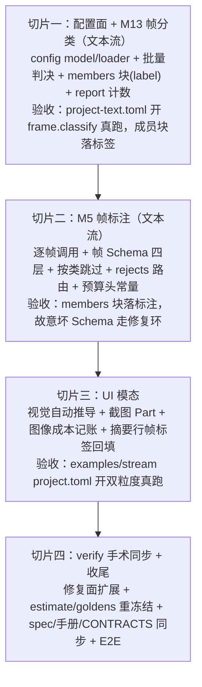

# 计划书：流模式帧级分类与标注（frame-level classify & annotate）

> 2026-08-12。需求（用户反馈原文）：「在对数据流进行意图序列标注时，无法针对每个原子数据（文本/UI控件树）单独配置分类和对应分类下的标注规则，导致用户需要先对原子数据制定分类和标注配置做一轮标注，然后再用序列意图的配置文件对同一组数据再做一轮标注，然后在外部结合两次标注的结果。目标：一个配置文件，一次流水线同时完成以上目标。」
> **状态：已实现（2026-08-12，v1.12）。**本文保留为方案论证与决策溯源材料；三方预实现审计对本文的修正（成员失败不入 rejects、修复面第四向、装箱器下沉、摘要行回填砍掉等）以 `SPEC-frame-annotation.md` 为准。
> 问题验证：五路独立代码/文档侦察于 2026-08-12 完成，结论一致——该能力当前不存在，且从未被讨论/否决/排期（见 §2.2）。

---

## 1. 结论先行

**问题确认存在，推荐以「帧粒度条件化于既有算子」补齐。**推荐方案三句话：

1. **不动状态机、不动链序、不动契约 ②b**：成员帧保持 `absorbed`，帧级产物作为**序列信封上的成员级内容**承载——`PipelineItem` 新增 `member_classifications` / `member_annotations`（按成员 id 键控），由 M13 / M5 在处理序列记录时顺带产出，随序列行落盘于 `_meta.stream.members[]`（与 v1.8 `_meta.stream.steps` 同一先例：LLM 产物挂 `_meta.stream`）。
2. **配置面镜像既有形态**：`[frame.classify]`（帧类表 `[[frame.classify.classes]]`，闭集 + fallback_class，词表经 M8 enum 硬校验）＋ `[frame.annotate]`（帧级输出 JSON Schema，独立于 `output.schema`）＋ `[frame.class.<name>.annotate]`（按帧类覆盖指令/few-shot/enabled 跳过开关）。默认全关；`[frame.*]` 要求 `segment.enabled`（仅流模式——非流模式下记录本身就是原子数据，classify + `[class.<name>.annotate]` 已覆盖该需求）。
3. **一次运行同时产出两粒度**：帧级分类批量判决（一序列一调用、预算驱动分窗，同 M14 滑窗判决形态），帧级标注逐帧调用（按帧类取指令、帧 Schema 走 M8 四层保证、UI 模态附该帧截图）；序列级 classify/quality/annotate/verify 原样不动。帧标签回填成员摘要行，序列级提示词免费获得帧级证据——这是两遍流水线外部合并做不到的协同。

数据流变化一图概括（新增部分加粗）：

```mermaid
flowchart LR
    A[ingest<br/>会话化] --> B[segment<br/>成员帧→absorbed<br/>episode 尾部追加]
    B --> C[stitch]
    C --> D[dedup<br/>单元=线索]
    D --> E[classify<br/>序列级闭集分类]
    E --> E2["<b>classify·帧粒度</b><br/><b>成员帧批量闭集分类</b><br/><b>→ member_classifications</b>"]
    E2 --> F[extract<br/>相邻帧对动作]
    F --> G[quality<br/>轨迹打分]
    G --> H[annotate<br/>序列级标注]
    H --> H2["<b>annotate·帧粒度</b><br/><b>逐成员帧按类标注</b><br/><b>→ member_annotations</b>"]
    H2 --> I[verify<br/>成员手术时同步帧产物]
    I --> J["emitter<br/>_meta.stream.members[]"]
    style E2 fill:#e8f5e9,stroke:#2e7d32
    style H2 fill:#e8f5e9,stroke:#2e7d32
```



## 2. 需求拆解与现状

### 2.1 问题确认（五路侦察结论）

| 侦察角度 | 结论 | 关键证据 |
|---|---|---|
| 数据流向 | 流模式下成员帧在 segment 后只会处于 absorbed / dropped_noise / failed，绝无 active；全链算子首道过滤 `status == "active"`，帧永远进不了 classify/annotate；全仓无任何把信封翻回 active 的赋值 | `labelkit/operators/segment.py:631-632`、`labelkit/common/contracts/stage.py:35,44-46`、`labelkit/operators/classify.py:459-460` |
| 算子粒度 | classify 一序列一个 Classification（摘要块+首帧图入提示词）；annotate 一序列一次调用一个 Annotation，关键帧仅是输入上下文选帧；`[class.<name>.*]` 条件化按序列的类生效 | `labelkit/operators/classify.py:289-309,508`、`labelkit/operators/annotate.py:319-331,727-729` |
| 配置表达 | `[classify]`/`[annotate]` 单实例（array-of-tables 直接 CONFIG_ERROR）；配置模型无任何粒度维度；无两阶段/子流水线机制；generate 回流与 segment 互斥且装的是新生成记录，不可复用 | `labelkit/common/config/loader.py:292-300,1768-1793`、`labelkit/common/config/model.py:423-431` |
| 输出结构 | 真实产物中成员层只有 `member_ids`/`member_sources` 溯源，无任何帧级标签/标注；extract 的 steps 是相邻帧对的动作推断（11 值闭集），非帧标注；手册从未给出双粒度工作流，对帧级加工的唯一表态是否定式（"逐帧的碎片标注"） | `examples/stream/out/stream-labels.jsonl`、`spec/60-ch6-io-formats.md:62-85`、`docs/manual/25-stream.md:13,155` |
| 决策史 | 该形态从未被讨论——非否决、非排期，属 Stage 契约 ②b 的结构性派生后果；相邻决策（帧多标签否决、帧级区间树不做、粒度旋钮不做）均非本需求 | `docs/dev/SPEC-stream-segmentation.md:197-226`、`spec/80-ch8-nongoals-roadmap.md:7`、`docs/dev/SPEC-activity-structure.md:153-155` |

用户所述 workaround（两份 project.toml 跑两遍 + 外部合并）是当前唯一路径，其痛点：

- **id 对齐无保证**：帧级那遍产出的记录 id 与流模式那遍的 `member_ids` 来自两条摄取路径，外部 join 只能靠 `source.file + line_no/pair_index` 手工对齐；
- **成员集不一致**：流模式会剔噪声帧、verify 手术会增删成员，帧级那遍不知道哪些帧最终成为序列成员——白标注垃圾帧、漏标回收帧；
- **成本翻倍**：摄取、判重、按帧标注全量跑两遍；
- **协同缺失**：帧级类标签无法进入序列级标注的提示词证据。

### 2.2 与既有决策的关系（为什么这不是翻案）

| 既有决策 | 内容 | 与本提案的关系 |
|---|---|---|
| 帧多标签否决（v1.9 非目标①） | 帧单一归属是手术/归因/守恒的公共地基 | **保持**：帧级产物挂在帧所属的唯一 episode 信封内，`frame.classify` 仅 single 语义、无扇出 |
| 帧级区间树不做（T3）、子任务跨度不做引擎特性（T4，需求方 2026-07-16） | episode 内子任务结构由用户 Schema 自声明 `subtasks`，工具不校验 | **不冲突**：T4 是序列内部结构的一次调用自声明；本需求是原子数据的引擎保证加工（闭集分类 + 按类规则 + 逐帧 Schema 校验），T4 模式满足不了（见 §4.1 候选丙）。当时 refute 线是"无消费方"——本次用户反馈即真实消费方出现 |
| 分段粒度旋钮不做（v1.8 裁决⑪） | `segment.granularity` 是"段切多粗" | **无关**：本需求是"输出几个层级的标注"，不动分段 |
| 输出 Schema 全局唯一（§5.2 白名单表尾行） | 按类不可换 Schema | **修订为按粒度各唯一**：序列级 `output.schema` + 帧级 `frame.annotate.schema` 各一份全局唯一；"按类输出 Schema"维持不做（8.4 演进候选原样保留） |
| AndroidControl 两级结构已采纳（PROPOSAL-stream-segmentation §2.1） | step 级 = extract 固定内部 Schema 的动作摘取 | **补齐**：extract 回答"这步发生了什么动作"（词表冻结、用户不可配）；本提案回答"这帧是什么、按其类别标注什么"（用户类表 + 用户 Schema），二者并存于 `_meta.stream` |

### 2.3 需求的精确边界

帧粒度只做 **classify + annotate** 两算子，不做 quality/dedup/verify/generate 的帧级变体：

- 帧级判重在连续 UI 帧上大面积误伤（`docs/CONTRACTS.md` 明注刻意置空）、单帧质量分无意义（`docs/manual/25-stream.md:13`）——这正是流模式取代逐帧加工的立论，不得回退；
- verify 的六值缺陷词表是序列级判据，帧级产物的质量由 M8 四层保证 + fallback 兜底；
- generate 与 segment 互斥（2.3.1），无帧级生成可言。

## 3. 业界方案调研（2026-08-12 检索核实）

1. **Label Studio（标注工具形态先例，最强同构）**：官方模板明确支持在**同一份 labeling config** 里组合 `TimelineLabels`（帧/区间级标签）与 `Choices`（整段视频级分类）两个控制标签，一次标注任务同时产出两粒度结果——"一个配置文件、一次流程、双粒度"是标注工具的标准形态（labelstud.io/templates/video_frame_classification、video_classification）。
2. **GUIOdyssey（数据集输出形态先例）**：episode 级 `task_info` + step 级逐帧语义标注（`low_level_instruction` / `description` / `intention` / `context` + 动作），且逐步语义字段远超动作摘取的固定词表——佐证帧级需要**用户可配 Schema** 而非扩充 extract 的冻结结构（huggingface.co/datasets/dad3131/GUIOdyssey）。
3. **WildGUI / GUI-360°（同上）**：task 级 `instruction`/`plan`/`dense_caption` + 逐动作 `grounding_instruction`/`action_reason`/`core_change` 语义注释；GUI 轨迹语料的两级标注是行业默认产物结构。
4. **仓库既有先例**：AndroidControl 两级结构在 v1.8 提案中已被定为目标产物形态（`docs/dev/PROPOSAL-stream-segmentation.md:37`）；分类信号落记录级属性、按属性条件化参数而不拆管线是 v1.7 classify 的调研共性（Dolma tagger→mixer、NeMo Curator `bucketed_results`，`docs/dev/PROPOSAL-classify-operator.md:77-79`）——本提案把同一范式下推一个粒度。

## 4. 方案设计

### 4.1 候选与取舍

| 候选 | 结构 | 裁决 |
|---|---|---|
| **甲：帧粒度条件化于既有算子（推荐）** | 帧保持 absorbed；M13/M5 处理序列记录时对其成员集顺带产出帧级分类/标注，挂序列信封、随序列行落盘 | **采纳**：零状态机改动、零链序改动、契约 ②b 原文不动；复用 M8/M9/预算/按类视图全套管道；verify 冻结修复面（annotate repair）天然覆盖成员重标 |
| 乙：双轨管线（帧保持 active 与序列并行流转） | 改契约 ②b 允许帧不被吸收，主输出双写帧行+序列行 | **否决**：正面违反三条冻结约束——"禁止将成员信封翻回 active"（`stage.py:44-46`）、"帧与其 episode 不得双写主输出"（`spec/307-m7-verify.md:58`）、守恒恒等式；且帧级 dedup/quality 在流数据上已被论证无效（§2.3），双轨会把它们重新拖回链上 |
| 丙：序列级一次调用自声明每帧数组（T4 现状模式） | 用户在 `output.schema` 里放 per-step 数组，一次标注调用整体生成 | **否决（作为本需求的解）**：无闭集帧分类、无按帧类规则、无逐帧 Schema 校验、数组长度与成员数无对齐保证、长 episode 一次调用生成全部帧标注挤爆上下文且质量不可控。T4 模式对"序列内部轻量结构自声明"仍然有效，维持不动 |
| 甲′：新增算子 M17 承载帧粒度 | 同甲，但独立算子 | **否决**：帧分类/帧标注与 M13/M5 是同一关注点的不同粒度，独立算子要复制两套提示词装配、Schema 引擎接线、按类视图与预算适配；且 verify 冻结的三个修复面之一就是 annotate repair，帧标注住在 M5 内修复路径零新增面 |

### 4.2 数据流与承载结构

**信封承载**（`labelkit/common/contracts/types.py`，PipelineItem 新增两个字段，仍是唯一可变类型）：

```python
member_classifications: dict[str, Classification] | None = None  # v1.12: 帧级分类，键=成员 record.id
member_annotations: dict[str, Annotation] | None = None          # v1.12: 帧级标注，键=成员 record.id
```

成员 Record 冻结不动；帧级产物的生命周期与序列信封一致（一批）。

**帧级分类（M13 内，序列级分类之后）**：

- 调用形态 = M14 滑窗判决的同款批量形（一序列一调用；预算声明时按 `budget.fit` 贪心分窗，同 v1.11 segment 窗口装箱机制）；输入 = 成员摘要行（`frame_digest`，与 segment/classify 复用同一摘要函数）；UI 模态且 profile 支持视觉时附成员缩略图（`default_image_px` 工作点），视觉参与按 v1.11 V2 同款自动推导（显式开关不设；成本控制面 = 把 `frame.classify.llm` 指向纯文本 profile）。
- 输出 = 内部 Schema `{"labels": [enum×N]}`，enum 硬校验 + 长度对齐校验，走 M8 四层；修复穷尽 → 该窗口全部成员落 `fallback_class` 并留痕计数（v1.7 R4 fallback 留痕同款哲学）。
- 帧标签回填成员摘要行（格式：摘要行尾追加 `⟨类:label⟩`），quality/annotate/verify 的序列级提示词免费获得帧级证据（见 §4.8 开放问题乙）。

**帧级标注（M5 内，序列级标注之后）**：

- 逐成员帧一次调用：指令 = `[frame.class.<该帧类>.annotate].instruction` ?? `[frame.annotate].instruction`；输出约束 = `frame.annotate.schema`（M8 四层，vendor 结构化输出 + 确定性修复 + jsonschema + 有界 LLM 修复环）；UI 模态附该帧截图。
- 帧类的 `[frame.class.<name>.annotate].enabled = false` ⇒ 该类成员跳过标注（典型用法：过渡屏/桌面屏只分类不标注，控制成本）。
- 单帧修复穷尽 ⇒ 该成员 `member_annotations` 缺位 + rejects 一行（`stage="annotate"`，携带 `member_of=<episode_id>` 与 M8 错误 kind）+ 计数；**序列记录照常发射**（与 dropped_noise 成员"episode 发射、成员落 rejects"同款并存路由）。`--strict` 语义经 rejects 自然覆盖。
- 记录级隔离下推到成员级：单帧失败不影响同序列其他帧，更不影响序列级标注。

**verify 手术同步（M7 修复面扩展）**：成员收缩（absorbed→dropped_noise）时其帧产物随行剔除；成员回收（dropped_noise→absorbed）时经既有 annotate 懒加载修复面补跑帧分类+帧标注（按成员 id 幂等，只补缺位者，不重跑已有产物）。`docs/CONTRACTS.md` 的"verify 三个冻结修复面"之 annotate repair 面随之扩展签名（additive trailing kwargs，v1.11 V21 同款手法）。

### 4.3 配置面（project.toml 新增，默认全关）

```toml
[frame.classify]                  # 帧级闭集分类（默认 false；要求 segment.enabled）
enabled = true
llm = "default"                   # 缺省继承 classify.llm
fallback_class = "other"          # 语义同 classify.fallback_class；无 assignment 键——帧恒单标签

[[frame.classify.classes]]        # 帧类表，与 [[classify.classes]] 同构
name = "order-page"
description = "订单/结算/支付类屏幕：购物车、订单确认、收银台"

[[frame.classify.classes]]
name = "transition"
description = "过渡屏：启动页、加载页、桌面、锁屏"

[frame.annotate]                  # 帧级标注（默认 false；要求 segment.enabled）
enabled = true
llm = "default"
instruction = "标注该屏幕的界面要素。"
schema_inline = """{ "type": "object", "properties": { ... } }"""   # 帧级输出 Schema，独立于 output.schema

[frame.class.order-page.annotate] # 按帧类覆盖：instruction / examples / enabled
instruction = "该屏幕为订单类：标注商品、金额、按钮及其 bounds。"

[frame.class.transition.annotate]
enabled = false                   # 过渡屏只分类不标注
```

M1 组合约束（新增，全部 CONFIG_ERROR）：

- `frame.classify.enabled ∨ frame.annotate.enabled` ⇒ `segment.enabled = true`（帧粒度仅流模式；非流模式请直接用 classify + `[class.<name>.annotate]`，报错文案给出这个指引）；
- `[frame.class.*]` 出现 ⇒ `frame.classify.enabled = true`（镜像 `[class.*]` ⇒ `classify.enabled` 既有约束）；
- `frame.annotate.enabled` ⇒ `schema_path/schema_inline` 恰一（镜像 `output.schema` 校验，含 draft 2020-12 元校验与 few-shot 干跑）；
- `[frame.classify]` 不设 `assignment`——显式书写是定向 CONFIG_ERROR（帧单一归属地基，v1.9 非目标①）。

两粒度独立开关：只开 `frame.classify` = 纯打标（成员块只带 label）；只开 `frame.annotate` = 全帧统一指令标注（镜像序列级 annotate 可无 classify 运行的既有语义）。

### 4.4 输出与观测

**主输出**：帧粒度任一开关开启时，`_meta.stream` 新增 `members` 数组（与 `member_ids` 等长对齐，成员序）：

```json
"members": [
  {"index": 0, "id": "873a4039…", "label": "order-page",
   "annotation": {"goods": "招牌麻辣烫×1", "amount": "¥32", "buttons": ["提交订单"]}},
  {"index": 1, "id": "98a8e083…", "label": "transition", "annotation": null}
]
```

`member_ids`/`member_sources` 原样保留（无条件、守恒与溯源职责不变）；`label` 仅 frame.classify 开启时在场，`annotation` 仅 frame.annotate 开启时在场（跳过类/失败帧为 null，失败帧另有 rejects 行）。帧粒度全关 ⇒ 输出与 v1.11 字节等价。

**观测**（counts-only，零新 trace 通道）：

- report.stream 新增 `frame_classify`（calls/fallback）与 `frame_annotate`（annotated/skipped_by_class/failed）计数块；report.budget 的 per-profile 计数自然覆盖新调用类；
- trace：classify 通道新增 `classify.frame` 事件、annotate 通道新增 `annotate.frame` 事件（redaction 分级沿用，label 按闭集值、annotation 按 tiered content）；
- `estimate_run` 新增 `frame_classify_calls`（窗口上界，预算驱动）与 `frame_annotate_calls`（≤ 帧总数上界，复用 P2-4 预扫描帧计数）；五个 dry-run golden 增加两行无条件输出后重新冻结（v1.9 `stitch_calls` 行同款先例）；
- 控制台面板：新调用计入 classify/annotate 既有括号归因，无新行；
- v1.11 预算：两类新调用注册 `TEMPLATE_HEAD_TOKENS` 冻结常量并 test-pin；帧分类窗口预算装箱复用 segment 机制；帧标注超限降级 = 树渲染收紧一档 → 图像降一档（≤2 次，AIMD 同款）；precheck 失败按最小单元规则不喂熔断（A7 矩阵不变）。

**复现性**：成员迭代序 = 成员序；温度默认 0；无新增采样点（帧分类窗口切分是确定性装箱）。

### 4.5 实施切片（每片可运行、可验收）



### 4.6 影响面清单

| 文件/文档 | 变更 |
|---|---|
| M1 `labelkit/common/config/`、M13 classify、M5 annotate、M7 verify、M11 emitter、M12 obslog、`types.py`、`budget.py`、`estimate_run` | §4.2–4.4 所述 |
| 链序、状态机、契约 ②a/②b/②c、守恒恒等式、M14/M15/M16 | **零改动** |
| `docs/CONTRACTS.md` | PipelineItem 两字段、annotate repair 面 additive kwargs、`[frame.*]` 配置 dataclass |
| spec | 313/305/307/311/312 各 v1.12 小节；§5 config 新节；§6 members 块；§7 计数与事件；§8 非目标改写（Schema 唯一性按粒度陈述）；§1.6 决策日志 |
| `docs/manual/` | 流模式章、配置参考章、报告章按真跑重采样 |
| `examples/stream` | 双工程加开 `[frame.*]` 示范（或加姊妹工程，避免既有 golden 语料成本膨胀——待裁决丁） |

### 4.7 站立假设（实现前须逐条验证）

1. glm-5.2 对成员摘要行的批量闭集分类可靠（M14 滑窗判决已依赖同款能力，风险低；切片一真跑验证）；
2. 帧级标注逐帧调用的成本可接受：调用数 ≤ 成员帧数，opt-in + 按类跳过 + 会话长度受 `session_max_len` 约束（examples/stream 全开约新增 40 次标注调用量级；切片三实测记账）；
3. members 块使输出行体积线性增长（每成员一个用户 Schema 对象），500k 规模下行体积仍在流式写出承受内（无整批驻留，风险低）。

### 4.8 开放问题（待需求方裁决）

- **甲｜帧类表是否按序列类分叉**：v1 取全局单帧类表（推荐——按序列类分叉是配置组合爆炸，等真实工程出现再议，同"按类输出 Schema"的触发式哲学）。
- **乙｜帧标签回填序列级摘要行**：推荐 v1 即做（一次运行协同的核心卖点；仅帧分类开启时改变提示词字节，确定性不受影响）；保守替代 = 列为演进候选。
- **丙｜帧标注的 L2.5 用户回调**：v1 不设（`frame.annotate.validator` 留作演进候选，镜像 `output.validator` 形态零悬念）。
- **丁｜examples/stream 示范方式**：改既有双工程（手册重采样面大）vs 加姊妹工程 `project-frame.toml`（隔离但多一份 fixture 运行成本）。
- **戊｜同内容帧的标注去重**：批内按 (帧内容指纹, 帧类) 备忘录复用标注结果——确定性且省成本，但引入"帧标注非独立调用"的语义弯折；v1 不做，列演进候选。
