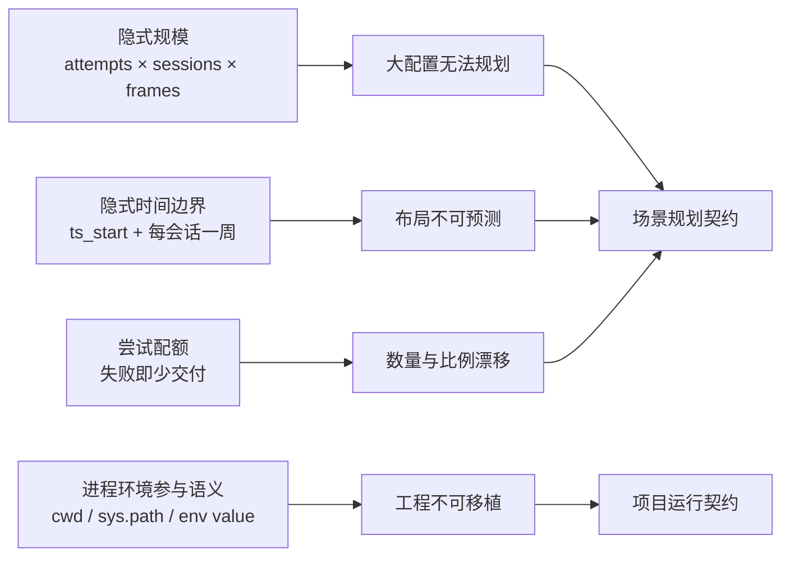
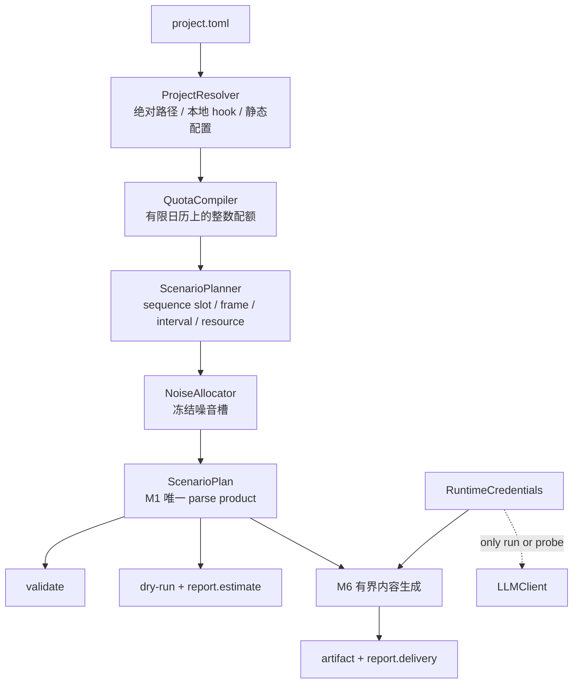

# LabelKit v1.17 场景规划与精确交付提案

> 状态：**superseded（v1.17 Wave 8 已收口）**。
>
> 范围：`docs/dev/E2E-FINDINGS.md` 的 E2E-42 至 E2E-60。
>
> 本文保留 v1.17 实现前的事实、业界依据、备选方案与取舍历史；决策正文与当前行为以主规格及
> `docs/CONTRACTS.md` 为准。旧的“等待实现 / 当前 v1.16”表述是历史快照，不代表当前 shipped 状态。

## 1. 问题不是十九个补丁

E2E-42 至 E2E-60 表面上横跨规划器、路径、密钥、报告、日历、噪音、跨序列关系、区间与补足循环，
实际只有四个共同根因：

因此不接受逐条打补丁。v1.17 要把以下边界一次收紧：

- 有限日历区间先于时间规划，任何周期规则都必须落在这个区间内。
- 配额表达“必须成功交付的序列 occurrence”，不再表达“尝试多少次”。
- 会话数由交付槽位与交叉会话数推导，不再由用户反向猜测。
- M1 只规划一次，validate、dry-run、估算与 M6 消费同一份冻结场景计划。
- project TOML 内的相对路径只相对 project 根目录；运行目录不参与工程语义。
- 静态校验不读取密钥值；只有真实 run 与 `validate --probe` 物化凭据。

## 2. 当前实现证据

### 2.1 模型规模

当前 HEAD 的 `sequence_planner.py` 为每个 attempt 建立 `sessions` 个 owner 布尔量，再为每个 session
展开全部 active frame，并构造帧对跨度、跨 session 帧对顺序和全部 attempt 对的交叉模式。

本轮直接运行当前 `_new_context`，固定每条四帧、零规则、零窗口、零噪音、一序列一会话，得到：

| 序列数 | 当前 proto 条目 | 结果 |
|---:|---:|---|
| 8 | 57,651 | 可建模 |
| 12 | 197,619 | 可建模 |
| 13 | 251,891 | 超过 250,000 硬上限 |

本表使用一个 frame class；E2E 原工程类表下的对应 13-sequence 值为 252,047。两者都在相同拐点
越过 capacity，差值不影响根因判断。

为验证替代结构，只对白盒搭建了 owner permutation、帧时间唯一、session 起止和 session 顺序的
最小 CP-SAT 原型。它没有包含规则、窗口、配额和资源约束，因此不是最终规模承诺；它用于验证 session
结构无需三次增长：

| 序列数 | 原型 session 层 proto 条目 |
|---:|---:|
| 13 | 274 |
| 32 | 673 |
| 167 | 3,508 |

在仓库锁定的 OR-Tools 9.15 上再加入 secondary-session permutation 与真实交错 witness：16 条序列、
4 个 crossed session 的原型为 606 entries 且求到 OPTIMAL；167 条序列、40 个 crossed session 的
session-layer 原型为 6,357 entries。两组同样不含业务规则与窗口，只证明 owner-slot/crossing 结构
可以落在当前依赖 API 上，最终门仍以完整 167-sequence acceptance test 为准。

### 2.2 目标与时间边界

当前 `_minimize_timeline_end` 只在没有 noise 变量时生效；真正生成入口又清除该目标，改为长度偏好与
noise 数量目标。与此同时，`_horizon` 按每个 session 再放宽一周。半日配置铺到五个周一不是偶然，
而是模型允许且目标函数不惩罚的合法解。

### 2.3 运行环境渗入配置

- `resolve_hook` 直接 `import_module`，同目录 hook 能否加载取决于 editable install 或 `PYTHONPATH`。
- `run.input`、`run.output`、各类 `schema_path` 与 `trace.path` 没有统一 project 根目录解析。
- M1 在所有命令上物化 API key，纯静态 validate 因此不能在无密钥 CI 运行。
- dry-run 的估算对象只发往 stderr 或 console listener，报告仍输出实际计数的全零值。

### 2.4 表达能力边界

当前窗口只有重复 weekday/of-day，没有有限结束日期；配额只有逐类 attempts；noise payload 固定为
字符串；帧是时间点；规则只看一条序列内部；失败序列不补足。这些都不是实现漏接，而是 v1.16 明确
边界，所以必须先修订规格。

## 3. 成熟方案参考

| 成熟项目或标准 | 已验证做法 | v1.17 吸收的边界 |
|---|---|---|
| Google OR-Tools CP-SAT | `AddInverse` 表达排列，`AddElement` 由索引选择变量；interval + `AddNoOverlap` 表达资源占用；assumptions 可返回不可满足核心；`ModelStats` 提供模型统计 | owner slot 用 permutation，不铺 N×S frame membership；资源互斥走原生 interval；用户约束带 assumption 名称 |
| OR-Tools Job Shop 示例 | 工序 precedence 与机器 `AddNoOverlap` 是两个正交约束族，目标最小化 makespan | 帧内包含关系、跨序列先后与资源互斥分开建模，不写一个万能 pairwise 层 |
| Timefold Solver score levels | 硬约束与软目标按层级字典序比较；文档明确反对用巨大权重折叠不同优先级 | CP-SAT 采用多阶段精确优化，每阶段冻结上阶段最优值，不拼魔法权重 |
| Terraform `validate` | 静态检查配置语法与内部一致性，不访问远端服务；运行上下文检查由 plan 承担 | 无 `--probe` 的 validate 与 dry-run 不读取 key value，run/probe 才解析凭据 |
| Ruff project root | 配置内相对路径相对配置所在 project root，避免调用 cwd 改变结果 | project TOML 路径统一 project-root-relative；CLI 路径仍按 shell 的 cwd 语义后立即绝对化 |
| RFC 5545 recurrence | recurrence 若没有 `UNTIL` 或 `COUNT` 会无限重复；`DTSTART` 与边界必须使用一致时间类型 | 不引入完整 RRULE，只吸收“任何周期必须有有限边界”；schedule 使用同 offset 的半开 start/end |
| Hypothesis generation health checks | 把满足条件的样本目标与被过滤的 draw 区分，并显式报告过滤过多；`max_examples` 是满足条件的结果数 | quota 是成功交付目标；每槽有界 retry；尝试、拒绝原因、交付和耗尽分别报告 |
| Synthea | 合成数据由模块化规则与状态构成，结构化记录直接走领域 Schema，不退化为说明字符串 | structured noise 复用 frame class instruction/schema，不再为噪音另造字符串通道 |
| Simod | 配置文件驱动业务过程模拟，项目路径相对配置文件或绝对路径 | 生成工程可整体搬移；输出、Schema、trace 与 hook 都使用同一根目录规则 |

资料源：

- [OR-Tools CP-SAT Python API](https://or-tools.github.io/docs/pdoc/ortools/sat/python/cp_model.html)
- [OR-Tools Job Shop](https://developers.google.com/optimization/scheduling/job_shop)
- [Timefold score levels](https://docs.timefold.ai/timefold-solver/1.x/constraints-and-score/overview)
- [Terraform validate](https://developer.hashicorp.com/terraform/cli/commands/validate)
- [Ruff configuration](https://docs.astral.sh/ruff/configuration/)
- [RFC 5545](https://www.rfc-editor.org/rfc/rfc5545.html)
- [Hypothesis settings and health checks](https://hypothesis.readthedocs.io/en/latest/reference/api.html)
- [Synthea](https://github.com/synthetichealth/synthea)
- [Simod](https://github.com/AutomatedProcessImprovement/Simod)

## 4. 选定架构

有两个有界 CP-SAT 模型，但只有一个公开编译入口：

- QuotaCompiler 的变量是 `sequence class × local date` 整数计数。它展开 day、week、schedule
  bucket，允许逐日覆盖与长期比例约束同一批 occurrence，先最小化所需 occurrence 总数，再冻结逐类
  target；它不生成 content、不消费 RNG，也不把某个 occurrence 提前钉死到具体日期。
- ScenarioPlanner 的实体是已经确定数量的 sequence slot。它重新执行 quota bucket 约束，并同时处理
  帧类词、时间、session、crossing、frame rule、sequence rule 与 interval resource，因此可以在完整
  时间语义下选择具体日期。

不把 sequence 数量与完整时间布局塞进一个可变基数巨型模型。配额先确定有限 slot 数，时间模型才能
保持稳定规模，也才能在错误消息里区分“配额整数冲突”和“时间布局不可行”。validate、dry-run 与 run
都调用同一个 `compile_scenario`，run 不再二次求解。

## 5. 模型结构

### 5.1 owner slot permutation

设成功交付 sequence slot 数为 `N`，配置的 `crossed_sessions` 为 `D`，则 session 数恒为 `N - D`。
每个 session 有一个 primary owner slot，另有 `D` 个 secondary owner slot。全部 `N` 个 owner slot
与 `N` 条 sequence slot 通过 `AddInverse` 形成排列。

secondary owner slot 再通过一组 session permutation 映射到互异 session。这样：

- `D = 0` 时不创建 secondary、pair 或 alternation 变量，交叉约束族条目必须为零。
- session 只选择一个 primary 和至多一个 secondary，不再展开所有 attempt 的所有 frame。
- session start/end 通过 `AddElement` 选择 owner start/end，再做 min/max。
- session 顺序只需相邻 session 的一条 `next.start > previous.end + gap`。
- crossing 只对被 secondary 映射实际选中的 owner 对建立 A-B-A 或 B-A-B witness。

不能把整条 attempt 建成 `AddNoOverlap` interval：合法 crossing 正是两条 attempt 的 frame 在墙钟上
交错，整段 NoOverlap 会把正确解一并禁止。

### 5.2 时间唯一与 interval resource

每个 active frame 的 start 创建一微秒 optional interval，全部交给 `AddNoOverlap`，等价于 active
timestamp 全局唯一，且不需要 variable-length 路径的帧对不等式。

声明 duration 的 frame occurrence 另建真实 interval。相同 resource 名下的 interval 进入同一个
`AddNoOverlap`。frame rule 的 `contains` 用 start/end 严格不等式表达，不借用 resource 语义。

### 5.3 noise 不进帧级 CP 笛卡尔积

ScenarioPlanner 只为每个 session 建一个整数 `noise_count`，约束总数、`session_max_len` 与可用微秒
空位。求解后 NoiseAllocator 在已冻结 session 内确定性选择空时间点，再按 noise class 权重分配类型。
因此不再有 `noise × session × attempt × frame` 变量，同时仍保证精确 noise 数量与可重放会话边界。

### 5.4 字典序目标

所有入口共享同一目标层级：

- 最小化 seeded length/duration preference deviation。
- 最小化本地日历跨度。
- 最小化 timeline end。

CP-SAT 每层单独求到 OPTIMAL，随后把该层最优值固化为等式再求下一层。任一层只得到 UNKNOWN 或
FEASIBLE 都不伪装成已冻结计划，而是返回 planner budget 错误。局部候选矩阵与它的偶然目标被删除。

## 6. 配置语言方向

v1.17 是干净断点，不保留别名、兼容层或 migration：

| 删除的 v1.16 字段 | v1.17 唯一表达 |
|---|---|
| `generate.sequences`、`class.*.generate.sequences` | `[[generate.stream.quotas]]` 成功交付配额 |
| `generate.stream.sessions` | `generate.stream.crossed_sessions`；session 数由计划推导 |
| `generate.stream.ts_start` | `[generate.stream.schedule].start/end` |
| `generate.stream.noise_instruction` | `[[generate.stream.noise]]` + frame class generate face |
| `generate.stream.rules` | `generate.stream.frame_rules` |
| `generate.stream.windows` | `generate.stream.frame_windows` |
| `module:function` hook reference | `path.py:function`，相对 project root |

主要新增面：

- schedule 是固定 offset 的有限半开区间。
- quota 支持 day、week、schedule 三个周期，支持 exact counts 或 integer weights。
- sequence rules 使用 DECLARE 的 precedence、response、succession、not_co_existence。
- frame class 可声明 duration 和 resources；frame rule 增 `contains`。
- scenario validator 对已接受前缀与当前 candidate 做跨序列语义校验。
- `max_attempts_per_slot` 给 sequence 与 noise delivery slot 统一有界重试。

完整字段与错误语义只在开发规格中冻结，本文不复制第二份准规范。

## 7. 被拒绝的方案

| 方案 | 拒绝原因 |
|---|---|
| 只给零 crossing 加 if 短路 | 能缓解 E2E-43，但 N×S session membership 和帧对仍三次增长，167 条仍不可用 |
| 依据 `_hint_session_assignments` 收窄 pair | hint 不是约束；日历可要求反向 owner 顺序，用 hint 剪枝会删掉合法解 |
| 每条 attempt 一个整段 optional interval + 全局 NoOverlap | 会禁止合法 crossed session 的 frame 交错 |
| 把长度、noise、日历跨度和结束时间塞进一个大权重整数 | 权重边界难证明，新增目标会改变既有优先级；属于 Timefold 明确反对的 score folding |
| 保留无限 horizon，只让目标选最早日期 | “一天数据”仍是偏好而不是契约；目标变化或 solver budget 都会重新暴露问题 |
| 只回显绝对路径，不改变 cwd 解析 | 能看见写错位置，但工程仍不可搬移、同一配置仍随启动目录变义 |
| 静态 validate 对缺 key 发 WARN | 静态命令根本不需要 secret；读 env 再降级只会给 CI 制造环境噪音 |
| noise Schema 另建一套 | frame class 已有 instruction、Schema、时间字段裁剪和真实值输出，复制会产生第二套生成契约 |
| 区间与资源继续留给导出后脚本 | artifact 会先写出违反包含或资源互斥的 truth，失败关闭发生得太晚 |
| 失败后重新规划整条时间轴 | 幸存序列 timestamp 会漂移，重试无法局部归因，也破坏同 seed 的可解释性 |
| 引入完整 iCalendar RRULE | 当前需求只有固定 offset 的 day/week/schedule；完整 RRULE 会引入不需要的 DST、月历与解析面 |

## 8. 风险与控制

| 风险 | 控制 |
|---|---|
| v1.17 配置破坏性较大 | 同一 revision 删除旧字段并更新五个 example、手册与所有 golden；不提供双读期 |
| 多阶段最优求解放大 validate 时间 | 先消除三次模型；每层独立 deterministic budget；预算耗尽单独报错，绝不写 INFEASIBLE |
| assumption core 不是最小 core | 文案明确为“足以导致不可行的约束集合”，并同时输出静态整数诊断 |
| quota 与时间模型分离后出现跨层不可行 | `compile_scenario` 顺序执行，两层都成功才产生 `ScenarioPlan`；run 只能消费完整计划 |
| exact delivery 在坏模型下消耗调用 | 每槽硬预算、失败原因计数、耗尽 exit 1；不无限重试、不跨运行存状态 |
| project hook 能执行任意代码 | 信任边界不变；加载绝对路径进入日志/report，但不修改 `sys.path`，不自动发现代码 |

## 9. 交付边界

本提案完成的是设计收敛，不是代码修复。进入实现前还必须：

- 把开发规格的字段、错误种类、数据结构与报告键同步进 `spec/*.md` 和 `docs/CONTRACTS.md`。
- 更新 `CLAUDE.md` 与 `AGENTS.md` 的版本状态并保持字节一致。
- 以 bug-exposing tests 先复现 E2E-42 至 E2E-60，再按开发规格分层实现。
- 更新 examples 与手册的真实运行输出，最后重建 HTML/PDF 设计文档。

在这些门完成以前，E2E findings 只能标记为“v1.17 方案已冻结，待实现”，不能标记为已修复。
