# LabelKit 序列生成内核重建设计方案

> 状态：设计提案，尚未成为实现规格<br>
> 日期：2026-08-21<br>
> 目标版本：v1.18<br>
> 概念基线：v1.12 已具备的序列记录、帧分类、帧标注、JSON Schema、LLM 与上下文预算能力<br>
> 实施基线：完成 v1.17 后的主线，但 v1.17 的序列生成实现不进入新内核<br>
> 兼容策略：不兼容 v1.13–v1.17 的任何序列生成配置、内部接口、随机数消费、提示词、报表或工件格式

## 1. 结论

现有方向不应继续通过给 v1.13 的“蓝图 → 帧实现 → 机械编织”链路增加规则。v1.18 应把
v1.13–v1.17 的序列生成实现整体替换为一个以**序列模式、世界状态、事件轨迹和精确交付**为核心的
新内核。

新内核只有一条生成路径：

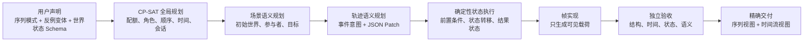

各层边界如下：

- CP-SAT 继续使用，但只负责有限、可判定的结构与时间问题，不承担世界语义。
- LLM 负责提出具体场景、参与者目标、事件意图与自然语言，不拥有帧角色、顺序、时间和配额真值。
- 世界状态通过 JSON Schema 定义，通过标准 JSON Patch 顺序执行；后续事件必须建立在前序事件实际产生的状态上。
- 正例、缺帧、错序和超时是同一个序列模式的显式变体，不是噪音，也不是生成后再贴标签。
- 验收器从最终事件重新识别模式，不读取 CP-SAT 的 witness；它必须证明正例无违规，反例只有目标违规。
- 精确交付的单位是完整的反事实集合。任一变体在生成、标注或验证阶段失败，整组重试；重试耗尽则整次运行失败，不交付缩水数据。
- 没有显式序列模式时，系统进入独立的 instruction-only 模式，由 LLM 自行决定序列；该模式不伪装成规则已证明的数据。
- 不引入复杂事件处理引擎。LabelKit 生成的是有界有限轨迹，CP-SAT、状态执行器和离线验收器已经覆盖问题边界。

## 2. 为什么必须重建

### 2.1 v1.12 是更干净的概念边界

v1.12 已经具备重建所需的通用底座：

- `Record(kind="sequence")` 及其成员帧；
- 序列级与帧级分类、标注和验证；
- 用户 JSON Schema 与 M8 四层结构保证；
- M9 LLM 客户端、上下文预算、日志和编排；
- 输入时间流的会话化、分段与重放。

v1.13 才把“从零生成时间流”作为一条专用路径加入 M6。此后版本不断在该路径上叠加档位、时间回填、
按类覆盖、DECLARE 规则、窗口和联合规划。各版本分别解决了局部问题，却没有建立序列生成所需的统一语义模型。

因此，“从 v1.12 重新构建”表示重新选择序列生成的抽象边界，而不是把仓库回退到旧提交。实施应保留主线中已经成熟的
通用能力，再一次性删除 v1.13–v1.17 的序列生成专用面。

### 2.2 当前链路的根因不是 CP-SAT 能力不足

| 现有层 | 已能保证 | 不能保证 |
|---|---|---|
| 蓝图调用 | 帧数、逐位帧类提示 | 角色目标、前置条件、状态变化、后续因果 |
| 帧实现调用 | 每个位置符合载荷 Schema | 各帧共同描述同一个持续变化的世界 |
| CP-SAT | v1.16 声明式关系、时间、窗口、会话与布局 | 业务动作为什么发生、动作后世界发生了什么 |
| 逐帧与序列 hook | 生成后的局部违规 | 一个可复演、可供后续帧读取的世界状态 |
| verify | 输出是否符合任务说明 | 反例是否只破坏了指定条件、是否仍像真实业务轨迹 |

仓库实测也显示，蓝图可以全部成功，而失败集中在帧实现；即使所有 Schema、hook 和规则检查都通过，
每一帧仍可能像独立写作题，缺少跨帧共享的实体、目标、知识和状态变化。继续增加后置检查只会让数据更容易通过检查，
不会自动让序列更像真实世界。

### 2.3 v1.13–v1.17 的抽象无法表达目标需求

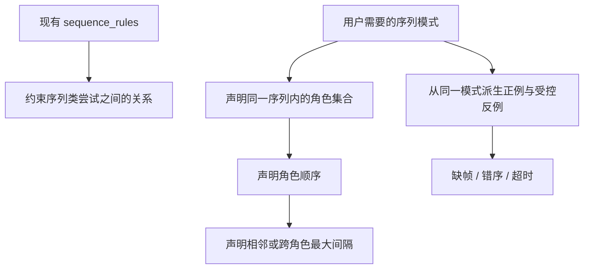

二者不是同一层级。现有规则即使扩展更多模板，也缺少以下一等对象：

- 帧在业务序列中的角色，而不只是帧类；
- 一个可命名、可复用、可生成反例的完整序列模式；
- 反例种类、目标角色或目标间隔及其精确配额；
- 跨帧世界状态、参与者知识与状态转移；
- 从最终数据重新识别模式并判定唯一目标违规的独立验收；
- dedup、quality、标注或验证失败后仍补足目标配额的交付闭环。

## 3. 业界方案给出的共同原则

本设计不复制某个产品，而是采用几类成熟系统共有的边界。

| 来源 | 成熟做法 | 对 LabelKit 的约束 |
|---|---|---|
| [Synthea](https://github.com/synthetichealth/synthea) | 用模块化规则和持续生命周期生成合成记录，而不是逐条独立写记录 | 先运行世界状态，再投影出可见数据 |
| [WebArena](https://webarena.dev/og/) | 在可交互环境中执行任务，并程序化检查中间状态是否具备预期属性 | 生成和验收之间必须有可执行状态，不只检查文本形状 |
| [τ-bench](https://arxiv.org/abs/2406.12045) | 用最终数据库状态与目标状态比较任务是否完成 | 每种变体都声明可机械验证的结果状态 |
| [Generative Agents](https://arxiv.org/abs/2304.03442) | 观察、规划和反思共同影响行为可信度 | 帧实现必须看到参与者当时可见的世界和历史，而不是只看局部 brief |
| [RFC 6902 JSON Patch](https://datatracker.ietf.org/doc/rfc6902/) | 用顺序操作表达对 JSON 文档的测试与变更 | 使用标准状态转移格式，不自造动作语言 |

Python 实现采用维护中的 [python-json-patch](https://github.com/stefankoegl/python-json-patch) 执行 RFC 6902，
不在 LabelKit 内重写 JSON Pointer、操作顺序、失败原子性或相等语义。

共同原则可归纳为：

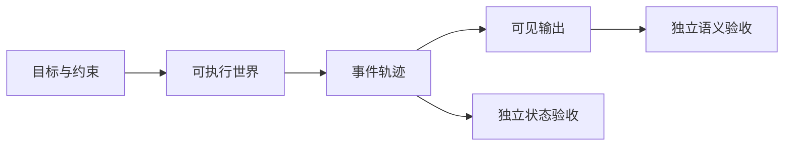

“真实感”不能只由提示词要求；它来自持续世界、因果轨迹和与生成器分离的验收。

## 4. 新的统一心智模型

### 4.1 核心对象

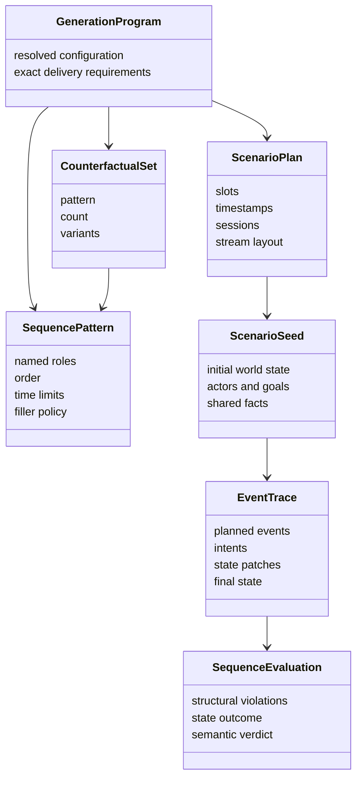

| 概念 | 唯一含义 |
|---|---|
| 序列类 | 训练任务的闭集类别，例如 `ticket_booking` |
| 序列模式 | 一个序列类内可识别的角色集合、角色顺序和时间约束 |
| 角色 | 某个帧在序列模式中的业务职责；角色映射到帧类，角色名必须唯一 |
| 反事实集合 | 共享同一初始世界、参与者与目标的一组正例和反例 |
| 变体 | 序列模式的一个预期判定结果，例如正例、缺帧、错序或超时 |
| 世界状态 | 由用户 JSON Schema 定义、随事件执行而变化的 JSON 文档 |
| 事件轨迹 | 初始世界、按时序排列的事件、状态补丁与最终世界组成的唯一内部真值 |
| 序列视图 | 从事件轨迹投影出的一条序列记录 |
| 时间流视图 | 将多条事件轨迹按全局时间排序、交织后得到的逐帧记录 |
| 精确交付槽位 | 一个必须最终交付成功的反事实集合实例 |

### 4.2 唯一真值原则

事件轨迹是序列生成的唯一内部真值。其余对象只能由事件轨迹确定性投影：

- 序列记录不是先生成再拼成员，而是事件轨迹的序列视图；
- 时间流工件不是第二次生成，而是多条事件轨迹的时间排序视图；
- 会话交叉只改变全局展示顺序，不改变任一事件轨迹的世界状态；
- 噪音是没有 owner 的独立事件，不属于任何正例或反例；
- 重发引用既有事件，不重新生成内容或状态转移；
- 缺帧不是 `dropped_noise`，而是目标角色从变体计划中明确缺席；
- 错序不是随机打乱，而是明确反转一个相邻角色顺序约束；
- 超时不是随机拉长时间，而是明确违反一个命名间隔的上限。

### 4.3 两种明确模式

序列生成只支持两种互斥模式：

| 模式 | 用户声明 | 系统能够声称的真值 |
|---|---|---|
| `declared` | 序列模式、世界状态 Schema、反事实集合和结果状态 Schema | 结构、时间、状态和目标变体均已机械证明 |
| `instruction_only` | 序列类、数量、长度范围和 instruction | LLM 自主生成，只有 Schema、状态可执行性和语义验收通过；没有显式模式证明 |

系统不会在声明不完整时从 `declared` 静默降级到 `instruction_only`。两种模式使用不同配置形状、不同真值字段和不同报表。

## 5. 总体架构

### 5.1 运行链路

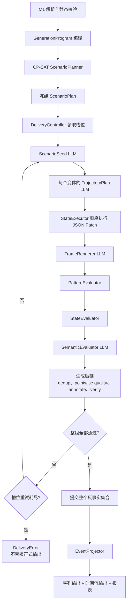

### 5.2 组件责任

| 组件 | 输入 | 输出 | 明确不负责 |
|---|---|---|---|
| `GenerationProgramCompiler` | 已解析配置 | 不可变生成程序 | LLM、随机内容、全局求解 |
| `ScenarioPlanner` | 生成程序、运行 seed | 槽位、角色、时间、会话和布局 | 文本、业务状态、语义合理性 |
| `ScenarioSeedGenerator` | 序列类 instruction、状态 Schema | 初始世界、参与者、目标与共享事实 | 选择变体、改变结构计划 |
| `TrajectoryPlanner` | 场景种子、某个变体的冻结计划 | 每个事件的意图、观察路径和 JSON Patch | 改帧类、改角色、改时间 |
| `StateExecutor` | 初始状态、顺序补丁 | 可复演事件轨迹和最终状态 | 猜测或修复业务语义 |
| `FrameRenderer` | 已执行轨迹、参与者视图、帧 Schema | 可见帧载荷 | 选择事件、补事件、改状态 |
| `PatternEvaluator` | 最终帧及时间 | 实际模式违规集合 | 读取 planner witness |
| `StateEvaluator` | 初始状态、补丁、最终状态、结果 Schema | 状态执行与结果判定 | LLM 主观打分 |
| `SemanticEvaluator` | 轨迹真值、参与者视图、最终帧 | 因果与真实感判定 | 修改数据、掩盖机械违规 |
| `DeliveryController` | 精确槽位、所有生成后结果 | 已提交反事实集合 | 换类别、换变体、减少配额 |
| `EventProjector` | 已验收事件轨迹 | 序列视图和时间流视图 | 重新生成内容 |

### 5.3 分层归属

继续遵守 `cli → orchestration → operators → common`：

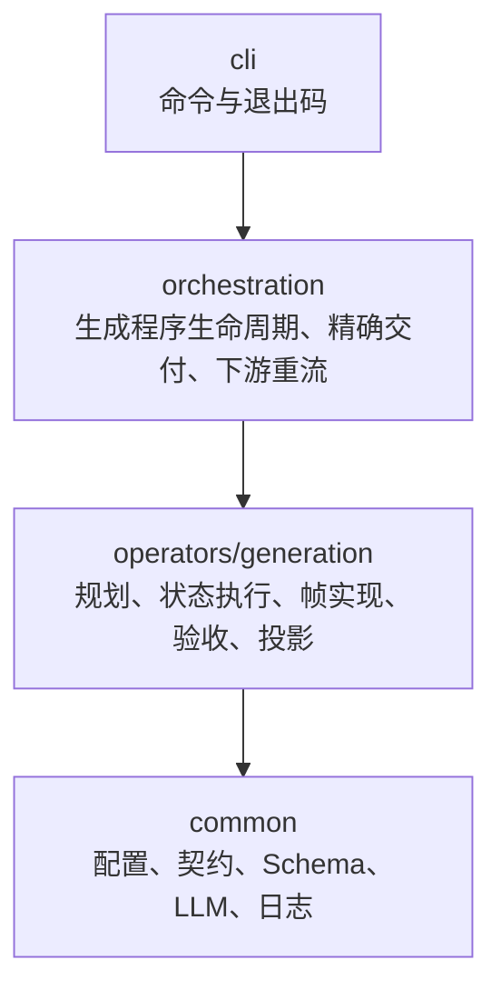

`validate`、`dry-run` 和真实运行均通过 orchestration 调用同一个 `ScenarioPlanner`。M1 只做可聚合的静态配置校验；
CP-SAT 不可满足在 `validate` 和 `run` 的规划阶段使用同一错误与同一模型报告，不把生成业务算法塞进 common。

## 6. 配置模型

### 6.1 声明式模式示例

以下示例冻结配置的概念形状。字段名在转为正式 SPEC 时保持不变；实现不接受旧 `[generate.stream]` 键。

```toml
[run]
mode = "generate_only"
seed = 20260821

[generate]
enabled = true
form = "sequence"
mode = "declared"
semantic_llm = "default"
evaluation_llm = "judge"
max_slot_attempts = 4

[class.ticket_booking]
description = "用户提交订票任务，系统处理并给出明确结果"

[class.ticket_booking.generate]
instruction = "保持城市、日期、乘客、订单和参与者知识前后一致。"
state_schema_path = "schemas/ticket-booking-state.json"
initial_state_source = "llm"

[frame.class.task_request.generate]
instruction = "用户提出尚未完成的订票请求。"
schema_path = "schemas/task-request.json"

[frame.class.acknowledgement.generate]
instruction = "系统确认已经接收同一请求，但不能声称已经出票。"
schema_path = "schemas/acknowledgement.json"

[frame.class.confirmation.generate]
instruction = "系统只在世界状态已出票后给出确认。"
schema_path = "schemas/confirmation.json"

[generate.pattern.booking_success]
sequence_class = "ticket_booking"
match = "exact"
order = ["request", "acknowledge", "confirm"]
max_span_s = 3600

[[generate.pattern.booking_success.roles]]
name = "request"
frame_class = "task_request"
actor = "requester"
observation_roots = ["/public", "/actors/requester/knowledge"]
state_instruction = "创建待处理请求，并让系统知道该请求。"
payload_bindings = [{ payload_path = "/subject_id", state_phase = "after", state_path = "/requests/current/subject_id" }]

[[generate.pattern.booking_success.roles]]
name = "acknowledge"
frame_class = "acknowledgement"
actor = "system"
observation_roots = ["/requests", "/actors/system/knowledge"]
state_instruction = "确认已接收请求，但不得创建票号。"
payload_bindings = [{ payload_path = "/subject_id", state_phase = "after", state_path = "/requests/current/subject_id" }]

[[generate.pattern.booking_success.roles]]
name = "confirm"
frame_class = "confirmation"
actor = "system"
observation_roots = ["/requests", "/actors/system/knowledge"]
state_instruction = "完成出票，写入票号，并让请求者知道结果。"
payload_bindings = [{ payload_path = "/subject_id", state_phase = "after", state_path = "/requests/current/subject_id" }]

[[generate.pattern.booking_success.gaps]]
name = "request_to_acknowledge"
before = "request"
after = "acknowledge"
min_gap_s = 0
max_gap_s = 120

[[generate.pattern.booking_success.gaps]]
name = "acknowledge_to_confirm"
before = "acknowledge"
after = "confirm"
min_gap_s = 30
max_gap_s = 1200

[[generate.counterfactual_sets]]
name = "booking_success_training"
pattern = "booking_success"
count = 100

[[generate.counterfactual_sets.variants]]
name = "positive"
kind = "positive"
outcome_schema_path = "schemas/outcome-ticketed.json"

[[generate.counterfactual_sets.variants]]
name = "missing_acknowledgement"
kind = "missing"
target_role = "acknowledge"
outcome_schema_path = "schemas/outcome-ticketed-without-ack.json"

[[generate.counterfactual_sets.variants]]
name = "confirmation_before_acknowledgement"
kind = "reordered"
target_before = "acknowledge"
target_after = "confirm"
outcome_schema_path = "schemas/outcome-reordered.json"

[[generate.counterfactual_sets.variants]]
name = "confirmation_timeout"
kind = "interval_exceeded"
target_gap = "acknowledge_to_confirm"
min_excess_s = 1
max_excess_s = 600
outcome_schema_path = "schemas/outcome-timeout.json"
```

一个 `counterfactual_sets` 条目表示 `count` 个反事实集合实例。上例最终必须交付四百条序列，且每个序号下的四条序列
共享初始世界、参与者、业务目标和风格，只改变事件结构与由此产生的轨迹结果。

`declared` 模式下，每个非零槽位引用的序列类都必须声明 `instruction`、`state_schema_path` 和
`initial_state_source`；每个角色都必须引用已声明且带生成 Schema 的帧类。不存在无世界状态的 declared 子形态。

### 6.2 序列模式语义

`roles` 声明完整帧组。每个角色只能出现一次，角色名唯一，一个帧类可以被多个角色复用。
每个角色的 `observation_roots` 是该参与者在该事件发生前可以读取的 JSON Pointer 根路径闭集；
轨迹规划器声明的观察路径必须落在其中一个根路径下。

`order` 必须恰好排列全部角色，不允许遗漏、重复或额外角色。它声明相邻角色对的顺序约束，并由传递性形成完整顺序。

`match` 只有两个值：

| 值 | 含义 |
|---|---|
| `exact` | owner 轨迹中除变体明确删除的角色外，不允许其他任务帧 |
| `subsequence` | 必需角色按序出现，且只允许 `filler_frame_classes` 中的额外帧穿插 |

当 `match = "subsequence"` 时，`filler_frame_classes` 必须显式非空，并且不得与任何角色使用的帧类重叠。
该限制确保最终帧可以独立绑定到角色，不依赖 planner 私有标记。全局时间流中其他 owner 的帧和 noise 不受该字段影响。

`gaps` 使用命名约束，每一行连接两个在 `order` 中前后有序的角色。秒数允许不超过六位小数，加载时精确转换为整数微秒；
上下限均为闭区间。`max_span_s` 是首个在场角色到末个在场角色的闭区间上限。

### 6.3 反例变体语义

反例不是任意损坏。每种变体只改变一个明确目标，并保持其他可适用约束成立。

| `kind` | 计划期变换 | 目标违规 | 仍须成立 |
|---|---|---|---|
| `positive` | 不改变角色和约束 | 无 | 所有角色、顺序、间隔、跨度和结果状态 |
| `missing` | 删除 `target_role` | 该角色缺失 | 其他角色的相对顺序、非关联间隔、跨度和结果状态 |
| `reordered` | 交换 `target_before` 与紧邻的 `target_after` | 该相邻顺序反转 | 其他相邻顺序、仍可适用的间隔、跨度和结果状态 |
| `interval_exceeded` | 保持角色与顺序，扩大 `target_gap` | 该间隔超过上限 | 所有其他间隔、跨度和结果状态 |

`reordered` 只允许选择 `order` 中相邻且帧类不同的角色。这样一次变换只产生一个可观察的顺序违规，
不会把任意洗牌产生的多个违规混成一个标签。

`missing` 的目标角色必须使用模式内唯一的帧类。若同一帧类对应多个角色，最终数据无法在不读取 planner witness 的前提下
判定究竟缺了哪个角色，因此编译器直接拒绝这种目标；后续若确有需求，应引入用户可验证的角色 selector，而不是猜测。

`interval_exceeded` 的实际间隔必须满足：

```text
target.max_gap_s + min_excess_s
<= actual_gap_s
<= target.max_gap_s + max_excess_s
```

编译器必须证明该范围与所有非目标间隔、日历窗口和 `max_span_s` 同时可满足；不可满足是配置错误，不能运行时放宽跨度。

`missing` 删除目标角色后，与该角色相连的间隔不再适用。验收器先判角色基数，再判依赖该角色的边，
因此不会把一个缺帧样本重复记成“缺帧 + 间隔缺失”。

每个变体必须声明 `outcome_schema_path`。基础 `state_schema_path` 描述任意合法世界，结果 Schema 描述该变体结束时
应达到的世界子集。反例可以拥有合理但不同的业务结果；系统不要求所有反例都失败，只要求结果与声明一致。

### 6.4 反事实耦合

每个反事实集合先规划一条满足正例模式的潜在基准时间线，即使该集合没有交付 `positive` 变体也照常存在。
各变体只能在这条基准时间线上做目标变换：

| 变体 | 与基准时间线的耦合 |
|---|---|
| `positive` | 完全使用基准角色和相对时间 |
| `missing` | 删除目标角色，所有其余角色的相对时间保持不变 |
| `reordered` | 交换两个目标角色的相对时间，其他角色保持不变 |
| `interval_exceeded` | 保持目标 `before` 及其前缀不动，把 `after` 及其后缀整体后移；后缀内部间隔保持不变 |

CP-SAT 必须同时证明变换后所有非目标约束仍成立。不同变体可以拥有不同的绝对会话起点，但其相对时间按上表耦合。
这样正例与反例不会在实体、风格之外又随机改变全部等待时间，避免把目标差异与无关差异混在一起。

同一反事实集合内每种变体的数量天然相等。若需要一百条正例和二十条配对反例，应声明一个八十条的正例单变体集合，
再声明一个二十条的正例加反例集合；不引入难以解释的部分配对规则。

### 6.5 instruction-only 模式

没有显式判定标准时使用独立配置：

```toml
[generate]
enabled = true
form = "sequence"
mode = "instruction_only"
semantic_llm = "default"
evaluation_llm = "judge"
max_slot_attempts = 4

[generate.instruction_only]
sequence_class = "ticket_booking"
count = 100
len_range = [3, 6]
instruction = "生成一次完整且自然的订票交互，包含必要的等待和状态变化。"
```

该模式中 LLM 同时提出角色、顺序、时间、初始状态和状态补丁；系统仍机械执行补丁、验证载荷 Schema 并进行语义验收，
但输出真值明确写 `validation_mode = "instruction_only"`，且不允许配置 `counterfactual_sets`。

`generate.instruction_only.state_schema_path` 可以显式提供；缺省时使用固定的内部 Schema，要求世界状态是 JSON object，
但不声明领域字段或结果目标。这个缺省是 instruction-only 模式的公开语义，不是 declared 模式失败后的 fallback。

`declared` 与 `instruction_only` 的配置字段互斥。缺字段、混用字段或旧字段均按未知或非法配置报错，不存在自动迁移或降级。

### 6.6 全局时间流

声明式和 instruction-only 模式共用新的全局时间流配置：

```toml
[generate.timeline]
timestamp_start = "2026-08-21T08:00:00+08:00"
primary_sessions = 360
crossed_primary_sessions = 40
session_max_events = 20
session_max_span_s = 7200
session_gap_s = 3600
noise_events = 80
duplicate_events = 20

[generate.calendar_window.service_hours]
utc_offset = "+08:00"
days = ["mon", "tue", "wed", "thu", "fri"]
intervals = [["08:00:00", "12:00:00"], ["13:00:00", "18:00:00"]]
```

角色可用 `calendar_window = "service_hours"` 引用命名窗口。窗口使用固定 UTC offset 和同日半开墙钟区间，
不引入受外部时区数据库版本影响的夏令时行为。`primary_sessions`、`crossed_primary_sessions`、`noise_events` 和
`duplicate_events` 都是精确数量，不再使用“目标比例”或幸存者派生值。每个 primary session 有一或两个 owner，
所以编译器校验 `primary_sessions = delivered_sequences - crossed_primary_sessions`；每个 duplicate 独占一个尾部 replay session。

noise 是独立、无 owner、无状态补丁的事件，由专用 instruction 和帧 Schema 生成；duplicate 引用已验收事件，
复制载荷和角色真值，只改变 replay event id 与时间。两者都不计入任何序列模式或反例违规。
每个 noise 也是必须填满的精确事件槽位，按 `max_slot_attempts` 重试；任一 noise 槽位耗尽同样使运行失败。
duplicate 只从已提交事件中按冻结计划选择，候选源不足在启动期即为配置不可满足，不到运行期减少数量。

## 7. 生成程序编译与 CP-SAT 规划

### 7.1 编译阶段

`GenerationProgramCompiler` 在任何 LLM 请求前完成：

- 解析所有序列类、帧类、序列模式和反事实集合引用；
- 验证角色全集、完整顺序、命名间隔、变体目标和结果 Schema；
- 验证 observation roots、状态到载荷 binding 及其 JSON Pointer；
- 对每种变体构造唯一的预期违规签名；
- 检查状态 Schema、结果 Schema、帧生成 Schema 和用户 hook；
- 展开精确交付槽位；
- 估算 CP-SAT 模型规模与 LLM 调用上界；
- 生成稳定的配置摘要，供 `validate`、`dry-run`、运行和报表共同使用。

这里不做随机抽样，不产生内容，不调用 LLM。

### 7.2 CP-SAT 的新边界

CP-SAT 负责以下离散变量和约束：

- 每个槽位包含的变体和角色 presence；
- 每个在场角色的帧类和 owner；
- 角色位置及其顺序；
- 每个事件的整数微秒时间；
- 正例间隔、超时间隔、总跨度和日历窗口；
- 会话归属、全局严格递增、跨序列交织；
- 可选 noise、重发和全局会话容量；
- 每个反事实集合及变体的精确数量。
- 同一反事实集合的不同变体不得进入同一会话或互相交织。

CP-SAT 不生成以下内容：

- 城市、订单、设备、人物或其他实体值；
- 参与者的目标和知识；
- 前置条件、状态补丁和最终业务结果；
- 自然语言、结构化帧载荷或标注；
- 语义真实性分数。

### 7.3 一次计划，贯穿全流程

`validate`、`dry-run` 和真实运行使用相同模型构造器。真实运行对一次求解结果冻结以下信息：

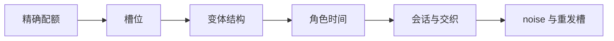

内容重试不得改变这些信息。失败槽位不能换成更容易生成的模式、变体、角色长度或时间窗口。

solver 固定 OR-Tools 版本、单 worker、确定性时间预算和由运行 seed 派生的 solver seed。
相同版本、配置与 seed 的结构计划必须一致；外部 LLM 服务的非确定性不被错误描述为全输出逐字节可复演。

### 7.4 有界规划块

`ScenarioPlan` 是一次运行的单一逻辑计划，但不要求把五十万条记录塞进一个 CP-SAT model。序列世界彼此独立，
跨序列约束只发生在同一个 primary session，因此可以在不损失全局精确性的前提下按 session 边界分块：

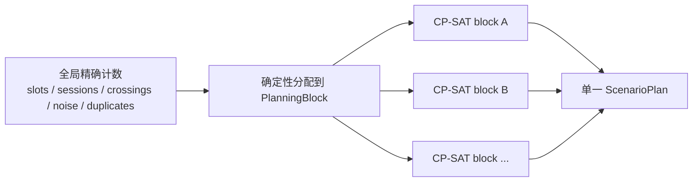

全局分配使用整数算术一次完成，保证各 block 加总恰等于配置；最后一个 block 接收余数。block 大小由实现根据模型 proto
变量与约束上限自动确定，不增加用户调参。相邻 block 只传递上一个 session 的结束时间，确保全局单调和 session gap；
不同 block 之间禁止 crossing，因此每个 crossed primary session 完整落在同一 block。

`validate` 使用同一分块器，求解每个实际 block，而不是只检查一种代表形状。任一 block 不可满足就报告其模式、变体和 session
范围并终止；不能改 block 分配、放宽约束或转为逐条贪心。这样物理求解有界，而对用户仍是一份精确全局计划。

### 7.5 不引入复杂事件处理引擎

复杂事件处理适合持续接收无界事件，并在线识别已经发生的模式。LabelKit 此处是在生成前同时掌握完整的有限槽位、角色和时间范围，
需要的是有界约束求解与生成后判定。引入复杂事件处理引擎不会构造内容、世界状态或反事实轨迹，还会增加第二套模式语言。

因此 v1.18 的边界是：

- CP-SAT 在生成前构造可满足轨迹；
- `PatternEvaluator` 在生成后识别有限轨迹；
- 未来若新增在线摄取判定，再单独评估复杂事件处理产品，不预埋兼容层。

## 8. 世界状态与事件轨迹

### 8.1 场景种子

同一精确交付槽位先调用一次 `ScenarioSeedGenerator`，产生所有变体共享的：

- 符合 `state_schema_path` 的初始世界状态；
- 参与者、参与者角色和持久身份；
- 每个参与者的目标、已知事实和不可见事实；
- 业务实体及稳定标识；
- 语言、语气、地域和渠道等风格事实。

场景种子不能包含某个变体独有的事件结果，也不能决定角色是否缺失、错序或超时。

`initial_state_source` 只有 `llm` 和 `catalog`。`llm` 由场景种子调用生成完整初始状态；`catalog` 要求同时声明
`initial_state_catalog_path`，其中每行都是一个已经满足基础状态 Schema 的完整 JSON object，按运行 seed 确定性抽取且不得被 LLM 修改。
两种来源显式互斥，不在 catalog 行无效或耗尽时改走 LLM。catalog 让高真实性项目可以把真实分布、边界案例和实体组合固定在
harness 中，而不必让通用模型猜测全部世界事实。catalog 按槽位无放回抽取；有效行数少于该序列类的槽位数是启动期配置错误。

### 8.2 每个变体重新规划语义轨迹

结构反例由 CP-SAT 机械派生，但不能简单删除或交换正例的已写文本。缺少确认、顺序颠倒或等待超时后，
后续参与者的判断和世界结果往往不同。

因此每个变体在共享场景种子上独立调用 `TrajectoryPlanner`。它看到完整的冻结角色与时间计划，
一次性输出整条轨迹的事件意图、观察路径和状态补丁。该调用必须覆盖整个序列，不能拆成彼此失忆的逐帧调用。

### 8.3 JSON Patch 状态转移

每个事件携带一个 RFC 6902 patch 数组。v1.18 允许 `test`、`add`、`remove` 和 `replace`；
不开放 `move` 与 `copy`，避免用间接搬运隐藏业务效果。

补丁必须满足：

- 所有 `test` 操作连续位于变更操作之前，表示事件前置条件；
- 补丁至少包含一个 `test`；纯观察事件可以只有 `test`；
- patch 路径必须是合法 JSON Pointer，变更后的对象结构由状态 Schema 裁定；
- 在状态副本上完整应用成功后才能提交，任何操作失败都不改变当前状态；
- 每个事件执行后再次用基础状态 Schema 验证；
- 最后一个事件执行后用该变体的结果 Schema 验证；
- 配置了 `generate.state_validator` 时，每次转移后调用同一个确定性 hook 检查 JSON Schema 无法表达的领域不变量。

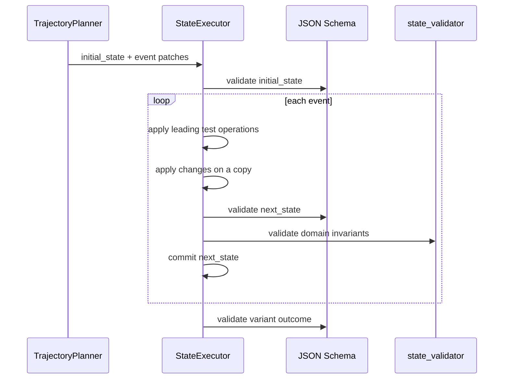

`state_validator` 是可选的领域扩展，不负责执行状态转移，也不能修改输入。它与现有用户 hook 一样是受信任代码；
实现不增加 sandbox、网络隔离或兼容包装。

### 8.4 参与者视图

事件规划为每个事件声明 `observation_paths`。`StateExecutor` 先验证每条路径属于该角色配置的
`observation_roots`，再在事件发生前按 JSON Pointer 解析这些路径，生成该参与者当时可见的 `ActorView`。
越界路径、缺失路径和非法 Pointer 都使当前槽位尝试失败。帧实现只接收：

- 当前事件的参与者目标与可见状态；
- 该参与者此前已经观察到的事件摘要；
- 当前事件执行后的公开结果；
- 当前角色的帧生成 Schema 与 instruction。

帧实现不接收其他参与者的隐藏知识。语义验收器则同时看到完整世界和各参与者视图，专门检查泄漏、未获知事实和不合理响应。

### 8.5 状态到载荷绑定

结构化帧可以在角色上声明 `payload_bindings`。每个 binding 使用 JSON Pointer 指定：

- 最终载荷中的 `payload_path`；
- 读取事件执行前还是执行后的 `state_phase`；
- 世界状态中的 `state_path`。

绑定字段从 LLM 可写的帧 Schema 中移除。帧实现完成后，系统从已执行状态机械读取并注入，再用完整帧 Schema 验证。
同一个世界字段可以绑定到多个角色，因此订单号、实体标识、金额和状态等关联事实不再依赖提示词复述。
路径缺失、类型不符或注入后 Schema 失败都使槽位尝试失败。

这不是 v1.14 `time_fields` 的兼容替代：timestamp 永远属于 `_meta.event`，`payload_bindings` 只投影用户明确声明的业务状态。

### 8.6 事件轨迹的最小真值

事件轨迹在内存中保存：

```text
scenario_set + scenario_index
sequence_class + pattern + variant
initial_state
ordered events {
  role + frame_class + owner + timestamp
  actor + intent + observation_paths
  state_patch + state_before_hash + state_after_hash
  rendered payload
}
final_state
evaluation
```

为控制内存，轨迹不复制每一步完整状态。`initial_state + ordered patches` 是可复演真值，状态哈希用于快速对账；
一次帧实现或验收期间的完整快照是短生命周期对象，完成该槽位后释放。

## 9. 帧实现与独立验收

### 9.1 帧实现

`FrameRenderer` 一次处理一条已经成功执行的完整事件轨迹。它的输出 Schema 按冻结角色位置组合每个帧类的生成 Schema。

它只能填充载荷，不得：

- 增删角色或 filler；
- 改变帧类、角色、actor 或 timestamp；
- 提议新的状态补丁；
- 把缺帧补回反例；
- 为超时样本改写时间；
- 把错序样本按自然顺序重新排列。

M8 继续负责供应商结构化输出、确定性修复、JSON Schema 验证和有界修复环。修复失败回到当前精确槽位，
不把缩水结果继续交给编织器。

### 9.2 模式验收器必须独立

`PatternEvaluator` 只读取最终帧类、owner 和 timestamp，不读取 planner 为角色分配的内部 witness。
它按帧类、owner 和出现顺序重新绑定角色；同一帧类对应多个角色时按模式角色顺序与一对一出现次序绑定。

验收按以下依赖顺序归一化违规：


角色缺失时，与其相连的顺序和间隔不重复报错；顺序反转时，该反转边的间隔不重复报错。每条变体都有编译期冻结的
预期违规签名：

| 变体 | 最终违规集合必须恰等于 |
|---|---|
| `positive` | 空集 |
| `missing` | `missing_role(target_role)` |
| `reordered` | `reordered(target_before, target_after)` |
| `interval_exceeded` | `gap_above_max(target_gap)` |

“包含目标违规”不够；任何额外角色、第二处错序、其他间隔超限或总跨度超限都使样本失败。

### 9.3 状态验收器

`StateEvaluator` 不相信运行期缓存。它从 `initial_state` 重新顺序执行全部 patch，并证明：

- 每个前置条件成立；
- 每个中间状态满足基础状态 Schema；
- 重放得到的状态哈希与事件轨迹一致；
- 每个 payload binding 的最终值等于对应状态快照值；
- 最终状态满足该变体的结果 Schema；
- 重放结果与 `final_state` 完全相等。

### 9.4 语义验收器

机械通过仍不等于人类觉得真实。`SemanticEvaluator` 使用与生成提示分离的固定判定 Schema，逐项给出布尔结果：

- `causal_consistency`：话语与已执行状态变化一致；
- `actor_knowledge`：参与者没有使用其当时未知的信息；
- `goal_consistency`：行为能由参与者目标解释；
- `temporal_plausibility`：内容对等待时长和事件时点的反应合理；
- `cross_frame_consistency`：实体、数量、状态和语气跨帧一致；
- `realism`：不存在明显模板拼接、机械复述或不符合常见业务流程的跃迁。

六项必须全部为真。判定失败只记录维度与计数，不在普通日志和 report 中写入原文。该验收器可以与生成使用同一供应商，
但必须使用独立 profile 配置项、独立提示模板和独立 Schema；不能让生成调用自报通过。

## 10. 精确交付

### 10.1 槽位单位

一个精确交付槽位对应一个 `counterfactual_set × scenario_index`，槽位内包含该集合声明的全部变体。
槽位是最小提交和重试单位。

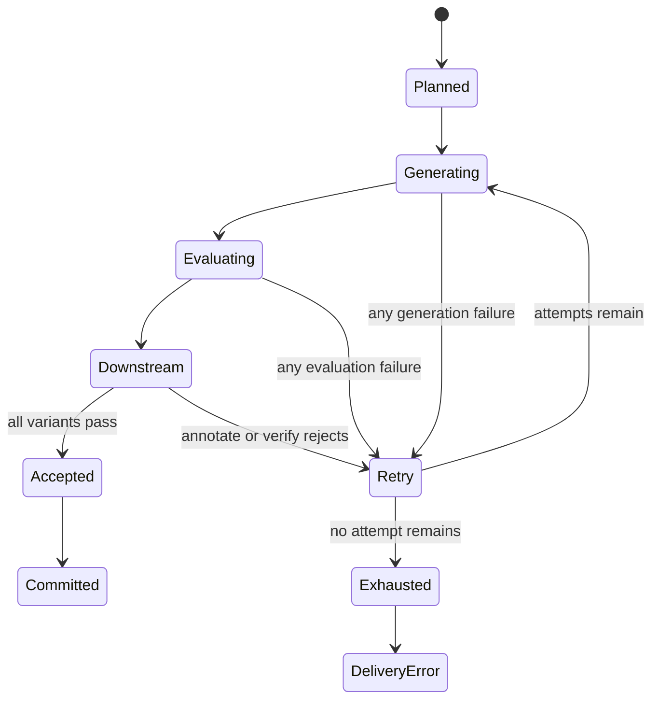

任一变体失败时整组丢弃，原因是只有这样才能保证同序号正例与反例仍共享同一个初始世界。不能只重试失败变体，
也不能把别的场景拼进这一组。

### 10.2 重试与失败语义

- 每个槽位最多尝试 `max_slot_attempts` 次；必须是正整数。
- 每次尝试使用 `run.seed + slot identity + attempt index` 派生的独立随机源。
- 重试可以更换具体实体、措辞和状态补丁，但不能改变模式、变体、目标违规、角色计划、timestamp 或会话布局。
- 相似度过滤发现与已接收槽位重复时，整组重试。
- dedup、pointwise quality、annotate 或 verify 最终拒绝任一变体时，整组从场景种子重新生成。
- 尝试耗尽抛出 `DeliveryError`，CLI 退出码为 1；正式主输出和时间流输出均不做原子替换。
- 失败运行仍写只含计数与失败种类的 report，不写数据内容。
- 不提供“允许部分交付”开关，也不把精确配额重新解释为尝试次数。

序列生成与 `run.partial_delivery = true` 互斥；provider 熔断也不能把已接收前缀发布为成功数据。
`--limit N` 在序列生成中表示只运行配置展开后的前 N 个精确交付槽位，永不拆开一个反事实集合；dry-run 必须同时显示
槽位数和最终序列数。

相似度在反事实集合之间比较场景种子与最终帧；同一集合内有意相似的变体互相豁免。显式 duplicate 也不进入相似度拒绝，
否则受控配对和重发会被误判为普通重复。

### 10.3 下游边界

精确交付必须覆盖完整 generate-only 链路，而不是只覆盖 M6：

```text
scenario generation
→ deterministic evaluation
→ semantic evaluation
→ prospective dedup
→ pointwise quality
→ annotate
→ verify
→ accepted slot
```

只有进入 `accepted slot` 的数据才计入 delivered。这样 report 中的目标配额与最终主输出可以逐项相等，
不会出现 `planned = 100`、生成幸存 92、验证后只剩 87 却仍声称精确交付。

生成后链采用槽位级事务语义：dedup 在试算阶段只查询已提交索引，整组通过后才一次性写入索引；
annotation、verification 和 pointwise quality 都只保存在当前尝试对象中，整组失败即丢弃。正式 metrics 只在提交时增加，
失败尝试只进入 `rejected_attempts`，避免重试污染主链守恒。

序列生成的序列类和帧类来自冻结计划，不再调用 classify。启用 quality 时只允许逐条可判定的 pointwise 模式；
pairwise 排名和 `top_ratio` 会让一个槽位的命运依赖尚未完成的其他槽位，与精确交付事务冲突，因此在该形态下是配置错误。

## 11. 输出与观测

### 11.1 投影视图

新内核输出两个同步视图：

| 视图 | 一行含义 | 来源 |
|---|---|---|
| 主输出 | 一条已验收序列及其成员 | 单条 `EventTrace` 的序列投影 |
| 时间流输出 | 一个按全局时间排序的可重放帧 | 所有 `EventTrace`、noise 与重发的合并投影 |

主输出与时间流输出共享稳定的 `event_id`。时间流重放得到的 owner 成员集合必须与主输出逐字节一致。
每个变体拥有独立 `world_branch_id`；同一反事实集合的变体共享 `scenario_id`，但绝不被表示成同一个现实世界里先后发生的事件。

用户载荷不再做 v1.14 `time_fields` 回填。timestamp、前后间隔和 elapsed 是事件真值，固定存放在 `_meta.event`；
不把系统元数据复制进用户 Schema，以免同一事实有两份可漂移表示。

### 11.2 真值字段

声明式模式的每条序列至少携带：

```json
{
  "validation_mode": "declared",
  "scenario_set": "booking_success_training",
  "scenario_index": 0,
  "scenario_id": "...",
  "world_branch_id": "...",
  "sequence_class": "ticket_booking",
  "pattern": "booking_success",
  "variant": "confirmation_timeout",
  "expected_violation": {
    "kind": "gap_above_max",
    "target": "acknowledge_to_confirm"
  }
}
```

每个成员帧至少携带 `event_id`、`owner_sequence_id`、`role`、`frame_class` 和 `timestamp`。
世界状态正文和 patch 默认不写入训练主输出；启用现有 full trace 内容级别时，写入单独的生成审计通道，供问题定位与状态重放。
普通日志、report 和默认 trace 只记录摘要、哈希、违规类型和数量。

### 11.3 报表

`report.generate.sequence` 使用按声明顺序稳定装配的全新结构：

```json
{
  "mode": "declared",
  "planned_sets": 100,
  "delivered_sets": 100,
  "planned_sequences": 400,
  "delivered_sequences": 400,
  "slot_attempts": 123,
  "by_pattern": {
    "booking_success": {
      "positive": {"planned": 100, "delivered": 100},
      "missing_acknowledgement": {"planned": 100, "delivered": 100},
      "confirmation_before_acknowledgement": {"planned": 100, "delivered": 100},
      "confirmation_timeout": {"planned": 100, "delivered": 100}
    }
  },
  "rejected_attempts": {
    "scenario_schema": 0,
    "state_transition": 2,
    "frame_schema": 3,
    "pattern_evaluation": 1,
    "state_evaluation": 0,
    "semantic_evaluation": 12,
    "dedup": 5,
    "quality": 0,
    "annotate": 0,
    "verify": 0
  }
}
```

成功运行必须满足 `planned_sets == delivered_sets` 和每个变体的 `planned == delivered`。
旧 `report.generate.stream`、tier、plan/realize failure 和 survivor 投影字段全部删除。

## 12. 代码结构与删除范围

### 12.1 保留的通用能力

以下能力不是旧序列生成兼容面，应在新实现中直接复用：

- M8 JSON Schema 引擎与结构化输出保证；
- M9 LLM 客户端、profile、重试、熔断和上下文预算；
- OR-Tools CP-SAT 依赖及其确定性设置；
- `Record(kind="sequence")`、成员帧、帧类与逐帧 Schema；
- 现有日志、指标、原子输出和隐私边界；
- v1.12 已有的 classify、annotate、verify 与 stream replay 通用能力；
- 用户 hook 的解析、签名校验和 value-free 错误记录方式。

### 12.2 必须删除的旧序列生成面

实施时按当前主线实际内容搜索并整段删除，不保留别名、适配器、双运行时或 parked 配置：

| 删除面 | v1.13–v1.17 旧概念 |
|---|---|
| 配置 | `[generate.stream]`、tiers、按类 tier 覆盖、旧 rules/windows、time_fields、旧 sequence validator |
| Schema | `plan_schema`、`brief_schema`、旧 `realize_schema` 及其兼容分支 |
| 提示词 | blueprint、sampled brief、旧 frame realization、noise 提示模板 |
| 规划 | 旧 `StreamPlan`、旧 `SequencePlan`、DECLARE 编译、旧 sequence planner 和 survivor 投影 |
| 机械编织 | 旧 session pack、cross weave、noise slot、duplicate shift、time-field backfill |
| 运行语义 | 尝试配额、作废后不补齐、按幸存者重算交叉、旧 RNG draw-order 承诺 |
| 输出 | 旧 stream artifact truth 键、旧 id 公式、旧 report.generate.stream |
| 教学面 | 旧 synth-stream 配置、golden、手册章节与 E2E 对账数字 |
| v1.17 | 所有建立在上述对象上的序列生成调度、全局规划或精确交付代码 |

旧键由严格 TOML 白名单自然报错，不增加“检测旧版并建议转换”的 migration 逻辑。旧输出不提供读取、转换或重放适配器。

### 12.3 新的物理模块

| 文件 | 责任 |
|---|---|
| `labelkit/common/contracts/generation.py` | 不可变生成程序、模式、变体、场景、事件轨迹和验收结果类型 |
| `labelkit/common/config/generation.py` | 新配置读取与静态校验，不包含 solver |
| `labelkit/operators/generation/program.py` | 已解析配置到 `GenerationProgram` 的编译 |
| `labelkit/operators/generation/planner.py` | 唯一 CP-SAT 问题构造与求解 |
| `labelkit/operators/generation/scenario.py` | 场景种子与完整轨迹语义规划调用 |
| `labelkit/operators/generation/state.py` | JSON Patch 执行、状态重放、状态 Schema 与 hook |
| `labelkit/operators/generation/render.py` | 参与者视图和逐位帧 Schema 驱动的帧实现 |
| `labelkit/operators/generation/evaluate.py` | 独立模式、状态和语义验收 |
| `labelkit/operators/generation/project.py` | 序列视图、时间流视图、noise 和重发投影 |
| `labelkit/orchestration/generation_delivery.py` | 槽位重试、下游重流、精确提交和失败语义 |

现有 `labelkit/operators/generate.py` 中 v1.12 的独立样本生成能力移入职责单一的模块；旧时间流代码删除。
新目录不导出旧函数名，也不保留参数转换包装。

### 12.4 依赖

保留精确锁定的 OR-Tools。新增维护中的 `jsonpatch` 并写入 `pyproject.toml` 与 `uv.lock`；
实现只调用库，不复制其解析或 patch 应用代码。现有 `jsonschema` 继续验证状态和结果。

不增加复杂事件处理、工作流框架、数据库、消息队列、缓存或状态持久化依赖。

## 13. 最小端到端实施顺序

架构按最终边界设计，但实施先跑通一个最小正例，再沿同一条路径补齐，不能另建临时生成器。

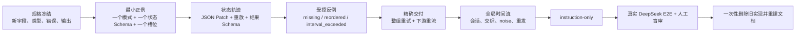

最小正例从第一天就使用最终的 `GenerationProgram → ScenarioPlan → EventTrace → Evaluation → Projection` 路径。
后续波次只增加变体和投影能力，不拆掉已跑通链路。

正式实施前先把本提案转为权威 spec 和 `docs/CONTRACTS.md`：所有配置字段、dataclass、函数签名、错误种类、
提示词、真值字段、report 键序和退出码均在写生产代码前冻结。

## 14. 测试与验收

### 14.1 离线机械验收

| 能力 | 验收方法 |
|---|---|
| 配置编译 | 所有字段、引用、互斥、旧键拒绝、状态与结果 Schema、变体目标的正反例 |
| 模式变体 | 小长度与小词表穷举，验证正例空违规、每种反例恰好一个目标违规 |
| CP-SAT | 与独立枚举 oracle 对比角色、顺序、间隔、跨度、会话与精确配额 |
| 角色绑定 | 重复帧类、subsequence filler、跨 owner 交织和噪音下不读取 planner witness |
| JSON Patch | RFC 操作、test 前置、原子失败、逐步 Schema、状态 hook、重放哈希与最终状态 |
| 参与者视图 | 隐藏事实不进入 renderer 输入，观察历史按事件积累 |
| 投影一致性 | sequence 与 stream 通过 `event_id` 双向对账，重放成员和字节一致 |
| 精确交付 | 每个失败阶段、整组重试、尝试耗尽、无部分输出、报表恒等式 |
| 确定性 | 同 seed 下计划、槽位身份、时间、投影和重试随机源稳定 |
| 预算 | 场景、轨迹、帧实现和语义验收的最小窗口、裁剪与 overflow 终止 |

模式编译器和验收器必须是两份独立实现，并通过穷举 oracle 交叉验证。测试不能把 planner 产出的角色 witness 喂给验收器。

### 14.2 真实 LLM 验收

遵守仓库既有要求，不使用 mock LLM server 或 transport。DeepSeek 用例至少覆盖：

- 同一场景的正例、缺帧、错序和超时四变体全部交付；
- 四条轨迹共享初始实体与参与者，但因变体形成不同合理结果；
- 每条 patch 可重放，结果状态 Schema 全部成立；
- 每条最终违规集合恰等于预期；
- 帧载荷不泄漏参与者未知事实；
- 生成中故意触发一次可恢复失败后，最终配额仍精确；
- 时间流重放得到与主输出相同的成员、角色、variant 和 event id；
- report 的每个 planned 与 delivered 相等。

结构化输出 profile 继续保留一例真实透传，用于证明组合后的逐位帧 Schema 能被供应商接收；DeepSeek L0-off 路径必须证明
文本提示、确定性解析和修复环实际工作，不能用空幸存集通过。

### 14.3 人工真实感门

自动验收不能替代“人一看是否很假”。每次版本验收从真实生成结果随机抽取至少五十条序列，隐藏版本与变体真值，
由两名评审分别判定：

- 是否存在无法由前序状态解释的跃迁；
- 是否有参与者提前知道未知事实；
- 是否有明显模板拼接或机械复述；
- 时间等待与内容反应是否匹配；
- 正例与反例除目标差异外是否保持同一场景。

任一系统性因果缺陷直接阻断发布。非系统性“明显不真实”比例必须不高于 10%；评审分歧由第三人裁决。
结果记录在 E2E-FINDINGS，只记录问题类别和机械摘要，不提交含敏感内容的完整提示与数据。

### 14.4 质量门

继续满足仓库门禁：spec 功能用例覆盖率 100%、函数覆盖率 100%、生产代码行覆盖率至少 85%、分支覆盖率至少 75%。
每次真实 LLM 后发生任何代码或配置修改，都必须重新执行完整离线门、真实集成、主示例和 replay。

## 15. 关键决策与未采用方案

| 决策 | 采用原因 | 未采用方案的问题 |
|---|---|---|
| 保留 CP-SAT，缩小其职责 | 擅长精确配额、顺序、时间与全局布局 | 用 LLM 排时间无法证明精确；用 CP-SAT 造语义会把世界压成不可维护变量 |
| 使用 JSON Patch + JSON Schema | 标准格式、可顺序执行、可重放、可验证 | 自造 action DSL 会重复实现路径、操作和失败语义 |
| 每个变体重新规划轨迹 | 结构变化会改变后续行为与结果 | 对正例文本机械删帧或换序会制造最明显的假序列 |
| 整个反事实集合一起重试 | 保持共享场景和可比较性 | 单变体重试会把不同世界拼成假配对 |
| 独立重识别模式 | 防止生成器用自己的 witness 给自己打分 | 只校验 planner 真值无法发现投影或实现偏差 |
| 结果状态 Schema | 把业务完成状态变成机械判定 | 只让 LLM judge 判断成功会重复世界模型与 harness 的摩擦 |
| 单独的语义验收 | 机械规则覆盖不了可信度与知识泄漏 | 只增加更多 JSON Schema 无法判定自然语言因果 |
| instruction-only 独立模式 | 保留用户不声明规则时的开放生成 | 静默补默认规则会伪造强保证；静默降级会掩盖配置错误 |
| 不引入复杂事件处理 | 当前问题是有限轨迹生成和离线判定 | 在线引擎不能补世界状态、内容生成或反事实交付 |
| 一次性替换旧路径 | 消除两套真值、提示词和报表长期漂移 | 适配器、migration 和双运行时会继续固化 v1.13 的错误边界 |

## 16. 非目标

- 不支持 v1.13–v1.17 序列生成配置、输出、随机数序列或重放工件。
- 不做跨运行状态持久化、断点续跑、缓存或数据库。
- 不模拟多个自主智能体长期自由互动；参与者视图服务于一条有限事件轨迹。
- 不让多条交织序列共享可变世界；交织是时间流投影，不是跨序列事务。
- 不实现在线复杂事件检测、无界窗口、水位线或迟到事件处理。
- 不自造通用业务动作语言；领域特有不变量交给 JSON Schema 和可选 state validator。
- 不给用户代码做 sandbox。
- 不把 noise、duplicate、缺帧、错序和超时混成同一个“干扰”概念。
- 不为实现中尚未存在的未来变体预留抽象层；新增变体时按其机械违规语义扩展闭集。

## 17. 完成定义

本设计的实现只有在以下事实同时成立时才算完成：

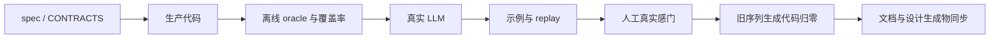

代码搜索必须证明旧配置类型、旧 planner、旧 blueprint/brief/realize 提示、旧 weaver、旧 report 键和旧 artifact 真值均不存在；
不能用“默认不走”代替删除。本次新增或保留的序列生成 diff 不含 compatibility、migration、fallback、deprecated
或旧接口转发代码。

## 18. 一手参考

- [RFC 6902: JavaScript Object Notation Patch](https://datatracker.ietf.org/doc/rfc6902/)
- [python-json-patch 官方仓库](https://github.com/stefankoegl/python-json-patch)
- [OR-Tools CP-SAT 官方文档](https://developers.google.com/optimization/cp/cp_solver)
- [Synthea 官方仓库](https://github.com/synthetichealth/synthea)
- [WebArena 官方项目页](https://webarena.dev/og/)
- [τ-bench 论文](https://arxiv.org/abs/2406.12045)
- [Generative Agents 论文](https://arxiv.org/abs/2304.03442)
