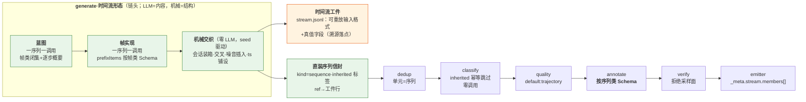
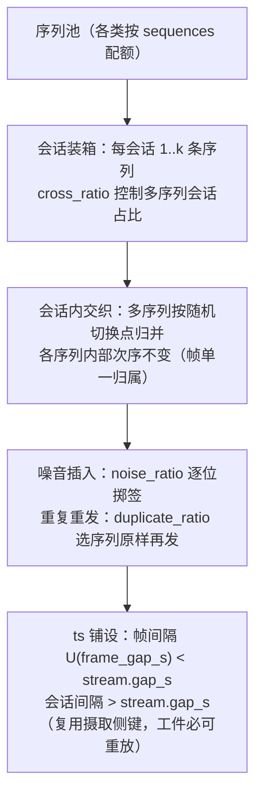
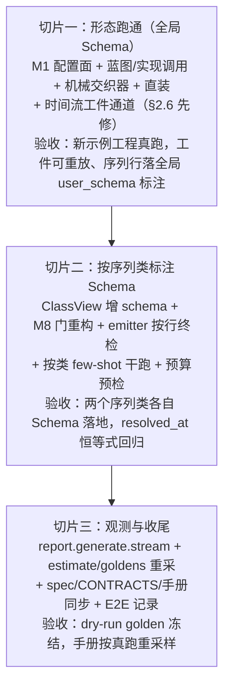

# 提案：时间流生成（文本原子时间流合成与序列级标注）

> **状态：superseded by v1.18 sequence generation。** 当前行为事实源为
> `docs/dev/SPEC-sequence-generation-redesign.md`、`spec/*.md` 与 `docs/CONTRACTS.md`；
> 本文其余内容仅保留历史方案论证，旧 SPEC 链接不代表当前行为。


---

## 1. 结论先行

**推荐「方案·蓝图直装」：蓝图先行、机械交织、直装序列、真值保留。**三句话：

1. **LLM 只写内容，结构全部机械**：每条序列先由 LLM 按序列类生成蓝图（帧类闭集 + 逐步概要，内部 Schema 硬校验），再按蓝图逐帧实现内容（帧类各自的生成 Schema 走 `prefixItems` 逐位约束，无 Schema 的帧类退化为纯文本）；会话装箱、多序列交叉、噪音帧插入、时间戳铺设全部由 `run.seed` 驱动的机械交织器完成——这是业界二十年定式（M2M/SGD 的 outline→realize、PLG2 的按时间归并交织、过程挖掘「噪音在计划层注入以保住真值链接」的教训），也与本工具「seed 驱动 PRNG、温度 0」的复现主义天然契合。
2. **真值随生成保留，不经 segment/stitch 重放**：序列信封由生成侧直接组装（`kind="sequence"`，id 公式与 M14 组装约定同款），序列类标签以 `source="inherited"` 随生成落地（v1.7 按类生成的既有范式），帧类标签填入 `member_classifications`；segment×generate 互斥**维持不动**——O3 要求裁决的「互斥放开或串接」二选一，本提案的回答是第三形态：**直装**（既不放开也不串接）。重放已被侦察证伪：文本流上 stitch 保守档恒不并入、噪音与段边界无真值通道、双倍 LLM 成本、两套批驱动器互不相容。
3. **两级 Schema 各走各的门**：帧类生成 Schema 走内部 Schema 显式路由（M8 四层保证原样承载，零门改动——v1.12 帧 Schema 显式路由同款）；序列类标注 Schema 兑现 v1.7 预留的「按类输出 Schema」演进候选（触发条件 = 出现单 Schema `oneOf` 无法表达的真实工程，是否成立列为首个待裁决点），实现路径抄 rubric 的 `ClassView` 按类重资产先例，并把 M8 的 `is_user_schema` 二分门重构为显式待遇参数。主输出之外新增**时间流工件**通道（可重放的输入格式 JSONL + 真值字段）——首个新增输出通道，须先修订 §2.6 红线。

数据流一图概括（新增部分加粗）：



## 2. 需求拆解与现状

### 2.1 用户语言 → 仓内概念映射

| 用户语言 | 仓内概念 | 现状 |
|---|---|---|
| 文本原子 | 帧（文本流的一行：`input.text_field` + `meta:ts`，`spec/60-ch6-io-formats.md:5-18`） | 输入侧已有；生成侧无 |
| 原子的类别与场景 | 帧类（`[[frame.classify.classes]]` 帧类表，v1.12） | 类表已有；无生成面 |
| 帧级完备 JSON Schema / 简单生成 prompt | 按帧类生成约束 | 生成样本恒纯 string（`samples_schema`，`labelkit/common/runtime/schema_engine.py:240-244`）；per-sample Schema 当年明文「等『样本本身必须是 JSON』的真实场景再立项」（`docs/dev/ANALYSIS-generation-batching-and-validation-hooks.md:37`）——**本需求即该触发场景** |
| 多种序列 | 序列类（`[[classify.classes]]`，v1.7） | 类表已有；generate_only 仅全局种子池、无按类形态（按类配比划归 O6，`spec/80-ch8-nongoals-roadmap.md:31`） |
| 每种序列独立标注 Schema | 按类输出 Schema | 记录在案的演进候选，触发 = 「出现单 Schema `oneOf` 条件子模式无法表达的真实工程」（`docs/dev/PROPOSAL-classify-operator.md:162`、`spec/80-ch8-nongoals-roadmap.md:47`） |
| 插入噪音帧 | 噪音帧（`dropped_noise`） | 识别侧仅有 LLM `interruption` 判据、无真值通道（`spec/314-m14-segment.md:108`）；生成侧无 |
| 交叉的不同序列（原子时间流） | 会话内多序列交织 + `meta:ts` 编织 | 被三条 CONFIG_ERROR 封锁（见 2.2）；合成记录的 `raw` 无时间戳挂载点（`labelkit/operators/generate.py:72-91`） |

### 2.2 现状封锁与侦察结论

| 侦察角度 | 结论 | 关键证据 |
|---|---|---|
| M1 约束 | 特性被三重封锁：segment 要求 process 模式；segment × generate 互斥；frame.* 要求 segment | `labelkit/common/config/loader.py:1940,1943,2073` |
| 决策史 | 封锁是**范围控制而非技术阻断**：「v1 与 stream 模式互斥……避免本提案范围膨胀」；O3 预留「序列/轨迹合成另行立项，届时须先裁决与 stream 模式的组合语义（互斥放开或串接）」 | `docs/dev/PROPOSAL-stream-segmentation.md:218,353`、`spec/80-ch8-nongoals-roadmap.md:28` |
| M6 产物形态 | generate 只会产出 `kind="single"`、纯文本、`modality="text"` 的原子记录；`raw` 仅 `{text_field: sample}`，无 ts/会话元数据挂载点；按类生成记录自带 `source="inherited"` 类标签、回流经 M13 幂等跳过零调用 | `labelkit/operators/generate.py:72-91,534-540`、`docs/CONTRACTS.md:2390-2395` |
| 重放保真 | 「生成流→真实链重放」无法还原植入真值：文本流上 stitch 保守档恒不并入（机械先验三腿依赖控件树证据，`bias="conservative"` 要求至少一腿命中）；噪音与段边界全是 LLM 判决产物、无真值声明通道；`strategy="rules"` 档会话≡episode、表达不了同会话交叉 | `labelkit/operators/stitch.py:122-165,621-643`、`labelkit/operators/segment.py:404,450-455`、`spec/314-m14-segment.md:92` |
| 机械先例 | 仓内无文本流生成器（两份 `data-text/events.jsonl` 均手写）；两个 UI 夹具生成器已示范「实体延续/隔离 + 四种交叉布局 + 噪音植入 + 零随机」的机械编织手法 | `examples/stream/tools/gen_fixtures.py:8-36,129-135`、`examples/mix/tools/gen_fixtures.py:184-190` |
| Schema 面 | Schema 本就按调用显式传参（15 个 `complete_validated` 调用点里仅 M5 序列标注 2 处走 `schema=None`）；真正的墙是 M8 `is_user_schema` 二分门（L2.5 与 `resolved_at` 记账绑死在「schema 身份」上）；rubric 的 `ClassView` 是「按类重资产」完整先例 | `labelkit/common/runtime/schema_engine.py:463-466`、`labelkit/operators/annotate.py:525,545`、`labelkit/common/config/loader.py:1144-1192` |
| 编排 | generate_only 是「全量生成→切批」驱动（可直接沿用）；stream 的整会话装箱是另一套驱动、直装形态不需要它 | `labelkit/orchestration/orchestrator.py:523-563,467-521` |
| 输出通道 | 落「合成时间流」将是**首个新增输出工件通道**，直撞 §2.6「唯一写盘对象」红线，须先修 spec；generate 无 trace 通道；`report.stream` 整节被 `cfg.segment.enabled` 单点门控 | `spec/20-ch2-overall-design.md:147`、`spec/70-ch7-logging.md:19`、`orchestrator.py:943` |

### 2.3 与既有决策的关系（为什么这不是翻案）

| 既有决策 | 内容 | 与本提案的关系 |
|---|---|---|
| O3 序列合成预留（`spec/80:28`） | 序列/轨迹合成另行立项；先裁决 stream × generate 组合语义 | **兑现**：本文即该裁决材料；答案 = 维持互斥、新辟直装形态（4.1） |
| per-sample Schema 预留（`ANALYSIS-generation-batching:37`） | 生成样本无结构约束是设计优点，「等真实场景再立项」 | **触发**：帧原子要求按类完备 Schema，即当年预留的真实场景 |
| 按类输出 Schema 演进候选（`PROPOSAL-classify-operator:162`） | 单 Schema `oneOf` 可表达按类变体；触发 = oneOf 无法表达的真实工程 | **触发条件待裁决**：用户原文「每种序列的 Schema 各自独立」；oneOf 替代的代价见 4.4（裁决·按类标注 Schema） |
| O6 量目标辖区（`spec/80:31`） | generate_only 按类生成配比划归 O6（全局精确定量 + 补齐回路） | **窄化处理待裁决**：本特性的按类 `sequences` 是**尝试配额**（同 `standalone_count` 语义：无输出条数保证、无补齐回路）；输出精确定量仍归 O6（裁决·量目标辖区） |
| 交错 episode 演进候选（`spec/80:48`） | 帧属并行任务的**识别**需全局归属模型 | **不冲突**：那是识别问题（segment 无法归属）；本提案是生成问题——归属真值随蓝图自带，segment 零改动 |
| 帧单一归属地基（v1.9 非目标首条） | 帧多标签否决，手术/归因/守恒的公共地基 | **保持**：交叉只发生在时间轴上，每帧归属唯一序列（或噪音），无双重归属 |
| segment×generate 互斥（`loader.py:1943`） | stream 模式不做生成扩增 | **字面维持**：直装形态不启用 segment；互斥条文仅需补一句指向本形态的注记 |
| v1.12 帧粒度（`SPEC-frame-annotation`） | 帧类表、`[frame.class.*]` 命名空间、members[] 呈现面 | **复用类表与呈现面**：帧类标签从生成真值来（非 LLM 判决）；`frame.classify` 与本形态互斥（真值已知，分类是浪费——定向 CONFIG_ERROR 指引） |

### 2.4 需求精确边界

- **仅文本模态、仅 generate_only**：UI 模态生成（截图无法合成）维持 O3 另行立项；process 模式下的流扩增（往真实流里掺合成帧）是非目标。
- **不做重放评测回路**：时间流工件是合法输入格式，用户可自行将其作为普通输入流跑 process 模式（segment/stitch 的能力评测数据由此免费获得），但「跑完与真值自动对照」的评测回路是演进候选，不进本版。
- **噪音模型 v1 只做插入与重复**：过程挖掘的四类噪音（插入/缺失/乱序/重复，PLG2）中，乱序流会被 M2 `on_disorder` 丢弃（自相矛盾）、缺失对合成数据无意义；插入（噪音帧）与重复（原样重发序列，episode 级判重演示位）机械可控。
- **帧级标注/帧级分类不随行**：帧内容在生成时已按帧类 Schema 结构化，再标注是重复劳动；`[frame.annotate]` 对合成序列的开放列演进候选。

## 3. 业界方案调研（2026-08-13 检索核实，28 个引用）

### 3.1 多轮对话与智能体轨迹合成谱系

| 名称 | 年份 | 做法 | 可迁移实践 |
|---|---|---|---|
| [Self-Instruct](https://arxiv.org/abs/2212.10560) | 2022 | 种子池自举 + ROUGE-L 相似度门禁 + 合格回灌 | 分类任务用 output-first（先定标签再条件生成输入）——「按类条件生成」先例；M6 现行机制即其后裔 |
| [Baize](https://arxiv.org/abs/2304.01196) / [UltraChat](https://arxiv.org/abs/2305.14233) | 2023 | self-chat / 双模拟器互演生成多轮对话；元主题树保覆盖 | 一次调用生成整段序列的低成本路线；主题分层保多样性 |
| [CAMEL](https://arxiv.org/abs/2303.17760) | 2023 | task specifier 先具体化任务再角色扮演 | 任务具体化器 = 轻量蓝图阶段 |
| [AgentTuning](https://arxiv.org/abs/2310.12823) / [ToolLLM](https://arxiv.org/abs/2307.16789) | 2023 | 环境 reward 过滤轨迹 / DFSDT 搜索式标注 | 优先机械可判定信号过滤，LLM 评审作补充 |
| [Magpie](https://arxiv.org/abs/2406.08464) | 2024 | 超采样 400 万 → 多维过滤到 30 万 | 「生成便宜、过滤狠」的预算结构 |
| [AgentInstruct（Orca-3）](https://arxiv.org/abs/2407.03502) | 2024 | 一种技能一条变换流的算子化管线 | 与本仓 operator 文化同构 |
| [APIGen](https://arxiv.org/abs/2406.18518) | 2024 | 格式校验→真实执行→LLM 语义校验三级漏斗 | 分级校验让坏样本在便宜层先死 |
| [APIGen-MT](https://arxiv.org/abs/2504.03601) | 2025 | **两阶段：真值动作蓝图（评审委员会把关）→ 互演实现成多轮轨迹**（NeurIPS 2025） | 「先序列计划后逐轮实现」的现代完整模板：正确性在蓝图层、自然度在实现层 |
| [TOUCAN](https://arxiv.org/abs/2510.01179) / [Kimi K2](https://arxiv.org/abs/2507.20534) | 2025 | 出题/作答模型分离；每任务配 rubric 拒绝采样 | rubric = 「每序列类型一份验收标准」 |
| [AReaL-SEA](https://arxiv.org/abs/2601.22607) / [EigenData](https://arxiv.org/abs/2603.05553) / [WRIT](https://arxiv.org/abs/2606.02908) | 2026 | 实例级可执行 checker；终态正确性评估；复杂度显式拨盘 | 验收细化到实例级；复杂度做成可拨参数而非靠采样撞运气 |

### 3.2 「先计划后实现」两阶段合成（收益有对照证据）

| 名称 | 年份 | 做法 | 可迁移实践 |
|---|---|---|---|
| [M2M](https://arxiv.org/abs/1801.04871) | 2018 | 自博弈穷举对话大纲（逐轮语义帧），第二阶段只做话术改写 | **大纲层持有全部真值，实现层只管自然度**；同一大纲可实现多次、标注零成本复用 |
| [Schema-Guided Dialogue](https://arxiv.org/abs/1909.05855) | 2020 | 模拟器对 45 个合成服务的 schema 生成 outline 再改写；**采集后零再标注** | 「每服务一份 schema」同构于「每帧类/每序列类一份 Schema」；真值保留的经典可行性证明 |
| [Plan-and-Write](https://arxiv.org/abs/1811.05701) | 2019 | 静态整版计划优于边计划边写，两者均优于无计划（自动与人工评测一致） | **收益证据本尊**：全局计划先行更连贯、更扣题、更多样 |
| [LoCoMo](https://arxiv.org/abs/2402.17753) | 2024 | 先生成带日期的因果时间事件图，内容挂节点后填 | 时间轴真值骨架先行——事件图即「序列蓝图」的时间化形态 |

### 3.3 Schema 约束生成、噪音注入、时间戳与交织

| 名称 | 年份 | 做法 | 可迁移实践 |
|---|---|---|---|
| [Outlines](https://arxiv.org/abs/2307.09702) / [OpenAI Structured Outputs](https://openai.com/index/introducing-structured-outputs-in-the-api/) | 2023/24 | 约束解码 / API 级 json_schema 严格模式 | 供应商结构化输出 + 代码侧校验兜底——M8 四层保证原样承载，帧生成直接复用 |
| [ToolACE](https://arxiv.org/abs/2409.00920) | 2024 | 规则层查结构、模型层查一致性的双层校验（ICLR 2025） | 规则/模型校验分层分工是标准配置 |
| [PLG2](https://arxiv.org/abs/1506.08415) | 2016 | 事件日志噪音三层模型：**插入（alien event）/缺失/乱序/重复逐类独立概率**；多流程实例按各自时间戳自然交织成流 | 噪音配置面直接照抄「逐类一个概率」；**交织不是显式算法，是逐序列铺时间戳后按时间归并的涌现结果** |
| [SNIP 噪音数据集](https://ieee-dataport.org/documents/event-logs-and-process-models-evaluating-discovery-algorithm-robustness-under-noise) / [Repairing Outlier Behaviour](https://sebastiaanvanzelst.com/wp-content/uploads/2019/06/2018_fani_repair.pdf) | 2025/18 | 噪音档位 0.5%–2% 细粒度网格；常规评测 5–20%，50% 压测 | 比例惯例的证据 |
| [过程挖掘真值方法](https://pmc.ncbi.nlm.nih.gov/articles/PMC11934509/) | 2025 | **批评「往最终日志注噪切断真值链接」，改为在模型层注入并保留初始模型作 ground truth** | 设计告诫：噪音在蓝图层注入并记录，真值链接可保留 |
| [LongMemEval](https://arxiv.org/abs/2410.10813) / [MT-Eval](https://aclanthology.org/2024.emnlp-main.1124/) | 2024 | 无关会话/干扰轮注入 + 统一赋时间戳；插入位置是显式变量 | 对话侧「整段噪音织入时间流」样板 |
| [Simod](https://arxiv.org/abs/1910.05404) | 2020 | 案例到达间隔拟合分布族（指数/正态/Gamma/LogNormal/均匀/三角/定值）择优 | 指数间隔（Poisson 到达）是行业默认起点 |
| [Conversation Chronicles](https://aclanthology.org/2023.emnlp-main.838/) | 2023 | 会话间隔用粗档位枚举并作为生成条件 | 文本侧时间间隔不必精确到秒 |
| [LLM Task Interference](https://arxiv.org/abs/2402.18216) | 2024 | 系统构造任务切换会话历史并量化退化 | 交叉密度/切换点是可控参数，本身即评测维度 |

### 3.4 真值保留 vs 事后重标、序列去重

| 名称 | 年份 | 做法 | 可迁移实践 |
|---|---|---|---|
| [MT-Bench / LLM-as-a-Judge](https://arxiv.org/abs/2306.05685) | 2023 | GPT-4 评审与人类一致率 > 80%；定位是**过滤器而非重标器** | 拒绝采样：淘汰而非改标 |
| [AlpaGasus](https://arxiv.org/abs/2307.08701) / [Nemotron-4 340B](https://arxiv.org/abs/2406.11704) | 2023/24 | 过滤后 9k 胜全量 52k；判定与生成分离（专职 reward model） | 「过滤优于全量」收益证据；verify 独立于 annotate 正是同构 |
| [Deduplicating Training Data](https://arxiv.org/abs/2107.06499) / [SemDeDup](https://arxiv.org/abs/2303.09540) | 2022/23 | MinHash 近重删除 / embedding 聚类语义去重 | 序列去重单元 = episode 帧文本拼接——M3 现行配方（`\x1e` 拼接）已就位 |

反面教材：Self-Instruct 官方抽检 46% 缺陷率 = 纯生成不验证的下限。

### 3.5 业界主导模式小结（四条，本提案的设计骨架直接来自它们）

- **蓝图先行、实现随后**——序列计划是可校验的一等数据结构，不是生成 prompt 里的隐式意图（M2M/SGD/Plan-and-Write/APIGen-MT，八年连续脉络）。
- **机械骨架、语言血肉**——时间戳、交织、噪音从不交给 LLM 即兴：到达用分布采样、交织靠按时间归并、噪音逐类独立概率且**在蓝图层注入以保住真值链接**（Simod/PLG2/过程挖掘 2025 教训）。
- **构造保真、校验兜底**——构造时既知的标签直接保留为 ground truth（SGD 零再标注），生成物过独立校验面做拒绝采样，淘汰而非重标（APIGen-MT/MT-Bench/AlpaGasus）。
- **Schema 双面**——每类一份 Schema 既是生成约束又是验收门禁（SGD 每服务一 schema、APIGen 每 API 一契约）；M8 四层保证可原样承载，无需新造机制。

## 4. 方案设计

### 4.1 候选与取舍

| 候选 | 结构 | 裁决 |
|---|---|---|
| **方案·蓝图直装（推荐）** | LLM 蓝图 + 帧实现；机械交织器铺 ts/会话/交叉/噪音；生成侧直装序列信封（真值 inherited）；链路 dedup→classify（幂等跳过）→quality→annotate→verify | **采纳**：真值零损耗（SGD 范式）、零 segment/stitch 成本、交织与噪音 seed 可复现、互斥条文字面不动；组装约定与 id 公式复用 M14 形态 |
| 方案·真实链重放 | generate 产原始流 → 放开互斥 → segment/stitch/classify 重新发现结构 | **否决**：侦察证伪——文本流 stitch 保守档恒不并入（先验三腿依赖树证据，`stitch.py:621-643`）、噪音/边界无真值通道（LLM 判决产物）、`rules` 档会话≡episode 表达不了交叉（`segment.py:450-455`）、蓝图+实现+滑窗+缝合+分类的多倍 LLM 成本、「全量生成→切批」与「整会话装箱」两套批驱动器互不相容（`orchestrator.py:523/467`）。植入真值经重放**不可保证还原**——正是过程挖掘 2025 教训里被批评的「往最终日志注噪切断真值链接」形态 |
| 方案·外部编织（现状 workaround 的工具化） | generate 产平面样本，外部脚本铺 ts 织流，再跑一遍 process 流模式 | **否决**：ts/会话/交叉/噪音全部落在工具外的脚本里（无 seed 纪律、无观测、无真值进 `_meta`），两遍摄取判重成本，且第二遍仍是方案·真实链重放的保真缺陷——这正是需求要消除的外部合并形态（v1.12 需求原文的同款痛点） |
| 方案·单 Schema oneOf（标注面的替代形态） | 不开按类 Schema：用户把各序列类的标注结构写进一个 `oneOf` 大 Schema | **列为待裁决替代**（见 4.4 与 5. 裁决·按类标注 Schema）：零 M8 改动是其全部优点；代价 = 每次标注调用都携带全部类的 Schema 文本（上下文成本 × 类数）、self-consistency 逐字段投票在 `oneOf` 顶层退化（`_majority_vote` 读顶层 properties，`annotate.py:718`）、按类 few-shot 干跑失配（类示例过的是全局大 Schema）、供应商结构化输出对深层 `oneOf` 的服从性折损 |

### 4.2 数据流与两阶段结构

**蓝图（plan，一序列一调用）**：机械先行——序列类按 `[class.<name>.generate].sequences` 配额展开，长度 L 由 `len_range` seed 采样定死；LLM 只填内容骨架。内部 Schema（`schema_engine` 新构造器，`samples_schema` 同族）：

```json
{"steps": [{"frame_class": "<帧类表 enum>", "brief": "<该帧内容概要>"}]}
```

`minItems = maxItems = L` 钉死步数、`frame_class` enum 硬校验（帧类闭集），走 M8 四层；修复穷尽 ⇒ 该序列作废并计数（现行「调用作废」语义，`generate.py:603-620` 同款，不产 failed 记录）。

**帧实现（realize，一序列一调用）**：输出 Schema 按蓝图**逐位组装**——draft 2020-12 `prefixItems`，第 i 位 = 该步帧类的生成 Schema（`[frame.class.<name>.generate].schema_*`，无则 `{"type":"string"}`）：

```json
{"frames": {"prefixItems": [<步1帧类Schema>, <步2帧类Schema>, ...], "minItems": L, "maxItems": L}}
```

结构化帧对象按 canonical JSON 序列化落 `text`（与 M2「`text_field` 命中对象按 canonical JSON 序列化」语义对齐，`spec/302-m2-ingest.md:49`——工件重放时逐字节一致）；纯文本帧直接落 `text`。上下文超限降级 = 序列对半分两次实现（AIMD ≤2，v1.11 同款）。噪音帧另走批量实现：`noise_instruction` + 现行 `samples_schema`，`⌈噪音帧数 / num_per_call⌉` 次调用。

**机械交织（weave，零 LLM，`Random(f"{seed}:0:generate")` 既有派生）**：



**直装（assemble）**：先写时间流工件（见 4.5），再据真值构造成员 Record（`ref.source_file` = 工件路径、`line_no` = 工件行号——`member_sources`/`order_span` 溯源由此落地，解决 generate_only 下溯源悬空）与序列信封：`kind="sequence"`、`id = sha256("\n".join(member ids))[:16]`（M14 同式）、`session_id` 盖章、`Classification(source="inherited")` 随生成落地、帧类真值填 `member_classifications`。**成员不成为信封**——成员只存在于 `record.members` 元组与工件中，无 absorbed/dropped_noise 状态流转，守恒恒等式退化回 generate_only 现行形态（`emitted + dropped_* + failed = generated`，generated = 序列条数）；噪音帧只活在工件里，不进流水线、不进 rejects（避免合成噪音天然触发 `--strict`）。

**链路（沿用 generate_only「全量生成→切批」驱动）**：dedup（序列单元，成员 text `\x1e` 拼接配方现成）→ classify（inherited 幂等跳过，零调用）→ quality（`default:trajectory`）→ annotate（按序列类 Schema，见 4.4）→ verify → emit。生成侧相似度过滤器单元上移为序列（成员 text 拼接 vs 兄弟序列，`SimilarityFilter` 复用）；verify 是拒绝采样面——成员手术与边界缺陷评审**不启用**（真值构造、无 segment 判决可修），走既有非流评审路径，缺陷按 policy 修复标注或整序列 `dropped_verify`（淘汰而非改真值）。

### 4.3 配置面（project.toml 草案，默认全关）

```toml
[run]
mode = "generate_only"
modality = "text"

[stream]                                # 复用摄取侧词汇（工件必须按此可重放）
order_by = "meta:ts"                    # 本形态要求 meta:* 序
gap_s = 900

[generate]
enabled = true
llms = ["default"]

[generate.stream]                       # 时间流形态（新增节；在场即形态开关）
enabled = true
sessions = 6                            # 会话数
cross_ratio = 0.3                       # 含多条交织序列的会话占比（0 = 全部串行）
noise_ratio = 0.1                       # 噪音帧占比（PLG2 插入类；业界常规带 0.5%–20%）
noise_instruction = "生成一条与任何任务无关的闲聊或干扰输入。"
duplicate_ratio = 0.0                   # 原样重发序列占比（episode 级判重演示/压测位）
frame_gap_s = [5, 60]                   # 帧间隔均匀采样区间（上界须 < stream.gap_s，M1 校验）
ts_start = "2026-01-01T09:00:00+08:00"  # 固定起点（恒不取墙钟——复现性）

[[classify.classes]]                    # 序列类表（复用 v1.7 面；classify.enabled 照常 true，inherited 零调用）
name = "ticket-booking"
description = "多轮高铁购票任务"

[class.ticket-booking.generate]         # 白名单增两键：sequences / len_range
instruction = "围绕一次高铁购票生成用户请求序列：查询、选座、改期、支付确认等。"
sequences = 8                           # 该类序列尝试配额（非输出保证——O6 辖区注记）
len_range = [3, 7]                      # 帧步数采样区间

[class.ticket-booking.annotate]         # 白名单增两键：schema_path / schema_inline（裁决·按类标注 Schema）
instruction = "抽取整段序列的任务意图、约束与最终结果。"
schema_path = "schemas/ticket-booking.json"

[[frame.classify.classes]]              # 帧类表（复用 v1.12 面；frame.classify.enabled 保持 false）
name = "task_request"
description = "发起或推进任务的用户输入"

[frame.class.task_request.generate]     # 新增节：按帧类生成面
instruction = "生成一条发起任务的用户输入，含具体实体（时间/地点/对象）。"
schema_inline = """{"type":"object","properties":{"utterance":{"type":"string"},"entities":{"type":"array","items":{"type":"string"}}},"required":["utterance"],"additionalProperties":false}"""

[[frame.classify.classes]]
name = "followup"
description = "对进行中任务的补充、修正或确认"

[frame.class.followup.generate]
instruction = "生成一条对进行中任务的追问或修正。"   # 无 schema ⇒ 纯文本帧（简单 prompt 形态）
```

M1 组合约束（新增/修订，全部 CONFIG_ERROR，报错文案给指引）：

- `[generate.stream].enabled` ⇒ `run.mode="generate_only"` ∧ `run.modality="text"` ∧ `generate.enabled` ∧ `stream.order_by="meta:*"` ∧ 序列类表非空 ∧ 每个声明 `sequences` 的类有非空 `[class.*.generate].instruction` ∧ 帧类表非空 ∧ 每帧类有非空 `[frame.class.*.generate].instruction`；
- 本形态下 `seed_examples` / `standalone_count` 禁设（配额来自按类 `sequences`）、`frame.classify.enabled` / `frame.annotate.enabled` 禁开（真值已知/演进候选，定向 CONFIG_ERROR）、`segment.enabled` 照旧互斥（条文补注记）；
- v1.12 约束「`[frame.class.*]` 在场 ⇒ `frame.classify.enabled`」放宽为「⇒ `frame.classify.enabled` ∨ `generate.stream.enabled`」，且 `generate` 节仅本形态合法；no-op 停放清单（`loader.py:2056-2064`）为本形态豁免；
- `frame_gap_s` 上界 ≥ `stream.gap_s` ⇒ CONFIG_ERROR（织出的会话会被摄取侧切碎，工件不可重放）；
- 帧类生成 Schema：draft 2020-12 元校验 + 顶层 object（`_load_schema_pair` 直接复用，`loader.py:1061-1102`）。

### 4.4 Schema 面（两级，各走各的门）

**帧类生成 Schema = 内部 Schema 待遇（零门改动）**：逐调用显式传参（`complete_validated(..., schema=realize_schema)`），无 L2.5、不计 `resolved_at`——v1.12「裁决·帧 Schema 显式路由」同款哲学；M8 四层保证（供应商结构化输出→确定性修复→jsonschema→有界修复环）原样承载 `prefixItems` 组装式。

**序列类标注 Schema = 兑现演进候选（裁决·按类标注 Schema 通过后）**：

- 配置：`[class.<name>.annotate]` 白名单增 `schema_path` / `schema_inline`（缺省 = 全局 `output.schema`，即按类 Schema 是**覆盖**而非替换——未覆盖的类零变化）；
- 解析：抄 rubric 先例（`ClassView.rubric`，`loader.py:1144-1192`）——按类重资产、启动期 N 份元校验（draft 2020-12 / `$ref` / `_meta` 禁令）、按类 few-shot 干跑（修 `loader.py:1906-1912` 现状「类示例过全局 Schema」）；
- M8 门重构（改动半径的核心）：`is_user_schema = schema is None` 二分门（`schema_engine.py:463-466`）重构为显式待遇参数（记 `resolved_at`、启 L2.5 与否由调用方声明），使按类 Schema 调用保留 L2.5 与 `resolved_at` 记账——§6.4 恒等式「`resolved_at` 加总 = 进入 M5 的记录数」语义不破（v1.12 帧 Schema 当年靠「不计桶」绕开的墙，这次正面修）；
- 消费点：M5 标注调用按 `item.classification.label` 取类有效 Schema（`annotate.py:525,545` 两处）、`user_schema_text` 改按类现算（帧侧 `annotate.py:880` 已有先例）、`_majority_vote` 传类有效 Schema、M11 写前终检按行 label 取 Schema（`emitter.py:139-153`）、M1 静态预算预检取各类 max（`loader.py:2311-2319`）。

### 4.5 输出与观测

**时间流工件（新输出通道，裁决·时间流工件通道通过后）**：`{output_stem}.stream.jsonl`，`.part` + 原子改名交付（与主输出同语义）；每行 = 合法输入行（`text_field` + ts 字段）+ 真值字段（序列 id / 序列类 / 帧类 / 噪音标记，具体命名 SPEC 定）——真值字段随 `raw` 携带，重放时可经 `passthrough_fields` 透传，不干扰任何判定。§2.6「唯一写盘对象」清单增补一项 + 「报告不含数据内容」条款明确豁免本通道（它是与主输出同级的**数据**输出通道）。dry-run 不写。

**主输出行**：`_meta.stream` 块门控从 `segment.enabled` 扩为 `segment.enabled ∨ generate.stream`：`episode_id`/`session_id` 照常、`order_span` 与 `member_sources` 指向工件行号、`members[]` 呈现（`label` 列取生成真值——呈现门控同步扩展；无 `annotation`/`status` 列）、`degraded`/`repaired` 恒 null/false（无 LLM 分段可降级）。四路由互斥、`_meta` 顶层键序零改动。

**report / estimate / trace**：

- `report.generate` 增 `stream` 子块（counts-only）：`{sessions, sequences: {<class>: n}, frames, noise_frames, crossed_sessions, duplicates, plan_calls, realize_calls, plan_failures, realize_failures}`；`report.stream` 不出现（那是 segment 的观测面，避免语义混淆）；
- `estimate_run`：generate_only 分支的 `generate_calls` 在本形态 = `2 × Σsequences + ⌈噪音帧数/num_per_call⌉`（蓝图+实现+噪音），其余 call 键不变；dry-run 估算行格式零改动，七个 golden 重采 + 新示例工程新增 golden；
- trace：v1 零新通道（v1.12 先例）——蓝图/实现调用经既有 `llm.call` 可见，结构事件靠 report 计数；generate 专属通道列演进候选；
- 复现性：交织器全部采样吃 `Random(f"{seed}:0:generate")`（现行派生式，零新采样点族）；§2.6 确定性条件化声明链追加一句——「时间流生成下序列构成以蓝图/实现 LLM 输出为条件」（v1.7/v1.8/v1.9 同族先例）。

### 4.6 实施切片（每片可运行、可验收）



### 4.7 影响面清单

| 文件/文档 | 变更 |
|---|---|
| M1 `labelkit/common/config/`（loader/model） | `[generate.stream]` 节 + 两套白名单增键 + 约束增改（4.3）+ 帧类/序列类 Schema 解析 |
| M6 `labelkit/operators/generate.py` | 主变更体：蓝图/实现/噪音三类调用 + 机械交织器 + 直装组装（id 公式与 M14 约定同款） |
| M8 `labelkit/common/runtime/schema_engine.py` | 蓝图/实现两个内部 Schema 构造器；`is_user_schema` 二分门重构（切片二） |
| M10 `labelkit/orchestration/orchestrator.py` | generate_only 分支的工件写出时机 + `report.generate.stream` + `estimate_run` |
| M11 `labelkit/operators/emitter.py` | `_meta.stream` 门控扩展 + members[] 真值呈现 + 按行 label 终检（切片二）+ 工件通道 |
| M5 `labelkit/operators/annotate.py` | 按类 Schema 取值三点（调用/文本/投票，切片二） |
| segment / stitch / extract / M13 / 状态机 / 链序 / 守恒恒等式 / Stage 契约三例外 | **零改动**（成员不成为信封，帧粒度双开关保持禁开） |
| spec | §2.3.1 约束、§2.5/§5 配置、§2.6 输出通道与确定性声明、§3.6 形态节、§6 工件与 `_meta` 门控、§7 report 键、§8 O3/O6 改写与演进候选核销、§1.6 决策日志 |
| `docs/CONTRACTS.md` | `[generate.stream]` dataclass、蓝图/实现 prompt 模板冻结、`ClassView.schema`、工件行格式 |
| `docs/manual/` | 生成章 + 新形态章按真跑重采样 |
| examples | 新示例工程（形态见 5. 裁决·示例工程形态）+ golden |

### 4.8 站立假设（实现前逐条验证）

- glm-5.2 / deepseek-v4-flash 对 `prefixItems` 定长逐位 Schema 的服从性可用（M8 四层兜底；切片一真跑验证——若供应商结构化输出层不认 `prefixItems`，退 L1–L3 层承载）；
- 一序列两调用（蓝图+实现）的成本可接受：对比方案·真实链重放省去滑窗/缝合/分类三类调用，净省；蓝图调用可后续演进为一批多蓝图（`num_per_call` 同型装箱）；
- 机械交织的会话形态经摄取侧重放后逐字节等价（`frame_gap_s < gap_s` 上界校验 + canonical JSON 落 text 保证；切片一以「工件重放 → process 模式 dry-run 会话数一致」验收）；
- M8 门重构不动 15 个内部 Schema 调用点的行为（回归面 = `resolved_at` 恒等式测试 + 全量离线套件）。

## 5. 裁决记录与遗留处置

四项关键裁决由需求方于 2026-08-13 闭合（均采纳推荐项）；SPEC 化时誊入 spec §1.6 决策日志。

| 名称 | 议题 | 裁决 |
|---|---|---|
| 裁决·按类标注 Schema | 「每种序列的 Schema 各自独立」是否构成 v1.7 演进候选的触发条件（`oneOf` 无法表达的真实工程）？ | **兑现（2026-08-13）**：按类覆盖、缺省回落全局 Schema；`oneOf` 替代虽零 M8 改动，但每调用携带全类 Schema 文本（上下文成本×类数）、逐字段投票退化、按类 few-shot 干跑失配三项代价长期存在；M8 门重构是一次性成本，且正面修掉 v1.12 遗留的「显式 Schema = 放弃 L2.5/记账」的弯折。§8.4「按类输出 Schema」演进候选条目随 SPEC 核销 |
| 裁决·时间流工件通道 | 首个新增输出工件通道，须修订 §2.6「唯一写盘对象」红线 | **新增（2026-08-13）**：不落工件则噪音与交叉不可见、`member_sources`/`order_span` 溯源悬空、「可重放」价值归零——特性意义所在；红线修订是增补清单而非放松原则（仍无中间态落盘） |
| 裁决·量目标辖区 | 按类 `sequences` 配额与 v1.7「按类配比划归 O6」的划界冲突 | **窄化（2026-08-13）**：`sequences` 取「尝试配额」语义（同 `standalone_count`：无输出条数保证、无补齐回路），O6 保留「输出精确定量 + 补齐回路」辖区；spec §8.3 O6 注记同步改写 |
| 裁决·示例工程形态 | 新示例落点：examples 第五例 vs `examples/text` 加姊妹工程 | **独立第五例（2026-08-13）**（如 `examples/synth-stream`）：本形态配置面自成一体（双类表 + 交织参数），塞进既有工程会污染其教学焦点；成本 = 多一份 fixture 与手册章 |

随方案采纳一并确定、SPEC 阶段落文的遗留项：

| 名称 | 议题 | 处置 |
|---|---|---|
| 裁决·互斥语义答卷 | O3 预留的「互斥放开或串接」二选一 | 随方案·蓝图直装采纳而定：**第三形态·直装**——互斥字面维持（本形态不启用 segment），O3 注记核销并指向本特性；「串接」（生成流→真实链）经侦察证伪（4.1）；重放评测回路列演进候选另行立项 |
| 裁决·工件行真值字段集 | 工件行携带哪些真值字段及命名（序列 id/序列类/帧类/噪音标记/会话序号） | SPEC 阶段定名；原则 = 复用既有概念词（sequence/class/frame_class/noise/session），不造新词，重放时可 `passthrough_fields` 透传 |
| 裁决·帧级标注协同 | 合成序列上开放 `[frame.annotate]`（成员帧再标注） | v1 不开（帧内容生成时已按帧类 Schema 结构化，再标注是重复劳动）；列演进候选，触发 = 出现「帧生成 Schema ≠ 期望帧标注结构」的真实工程 |
