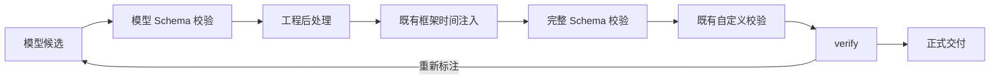

# LabelKit 标注后处理钩子特性规格

> 状态：最终开发规格；实现与验收必须覆盖本文全部要求
> 日期：2026-09-05
> 实施基线：`9f88620`
> 范围：普通记录、序列记录和成员帧的标注结果；包含所有标注重试、verify 修复与序列交付路径

## 1. 产品行为

工程通过 Python 函数对标注结果进行确定性后处理。模型负责语义理解，工程代码负责可计算的字段和
字段规范化；完整 Schema、自定义校验和 verify 检查最终结果。

本特性同时支持规范化模型已经生成的普通字段，以及补齐明确声明由代码负责的字段。
代码负责字段不发送给模型生成。所有已声明功能必须在本轮实现并用测试证明，不设置后续实现项目。



后处理属于标注候选的定稿过程，不新增可排序流水线阶段，不增加插件链、优先级、运行时注册表、
独立线程池或新的第三方依赖。框架原始记录、生成 payload、分类路由、记录身份、成员顺序和计划时间
继续由现有模块管理，不能通过标注后处理改变这些框架事实。

普通字段必须先满足模型 Schema，随后才能规范化。此接口不承诺修复任意 JSON 解析错误或普通字段的
结构违规。例如模型 Schema 的 `maxLength` 不通过时，仍由既有模型修复路径处理。

## 2. 业界依据与设计裁决

| 官方依据 | 已验证的机制 | 本特性采用的行为 |
|---|---|---|
| [Hugging Face Dataset.map](https://huggingface.co/docs/datasets/en/package_reference/main_classes#datasets.Dataset.map) | 回调显式返回字段变换结果 | 显式返回完整 JSON object；不引入部分字典合并语义 |
| [Scrapy Item Pipeline](https://docs.scrapy.org/en/latest/topics/item-pipeline.html) | 处理后的 item 继续经过验证与交付 | 处理结果进入后续校验，校验通过才交付 |
| [Pydantic validators](https://docs.pydantic.dev/latest/concepts/validators/) | 变换函数返回的值继续接受类型校验；共享可变输入可能污染其他验证 | 独立副本、显式结果与完整 Schema 终验 |
| [Pydantic computed fields](https://docs.pydantic.dev/latest/concepts/fields/#the-computed-field-decorator) | 计算属性可以只出现在序列化结果及相应 Schema | 模型 Schema 与最终输出 Schema 分别承担生成和交付约束 |
| [JSON Schema annotations](https://json-schema.org/understanding-json-schema/reference/annotations) | `default` 不会在验证过程中自动补值 | 工程代码负责计算，Schema 负责检查 |
| [Apache Beam user code](https://beam.apache.org/documentation/basics/) | 用户函数可能重复执行 | 每个候选使用独立副本；工程函数不依赖调用顺序或外部副作用 |

已有 `SchemaEngine.complete_finalized` 提供模型 Schema 校验、深拷贝变换、完整 Schema 校验和 L2.5 的
实际调用路径。现有时间字段注入已使用此机制。本特性复用其控制流，同时保持时间注入的权威边界。

以下选择已经排除：在 emitter 写出后修改文件、依赖 validator 参数变异写回、把程序异常回喂模型修复、
运行虚构业务输入探测任意后处理函数、每个真实候选偷偷重复运行函数以声称证明确定性。
确定性是工程函数的使用契约；框架保证调用位置、次数、隔离和重试输入，不声称能证明任意 Python 程序纯度。

## 3. 工程配置与函数契约

### 3.1 唯一配置形式

```toml
[annotate]
postprocessor = "hooks.py:complete_annotation"

[class.receipt.annotate]
postprocessor = "hooks.py:complete_receipt"

[frame.annotate]
postprocessor = "hooks.py:complete_frame"

[frame.class.message.annotate]
postprocessor = "hooks.py:complete_message"
```

`postprocessor` 是可选的非空字符串，引用形式与现有钩子一致：`<python-file>:<attribute-path>`。
相对文件按工程根目录解析，允许绝对路径和点号属性路径；不改 `sys.path`，不做自动发现。
本特性不提供 `output.postprocessor`、空字符串或 `false` 的别名及关闭表达。
需要某些类处理时直接在这些类上声明；未声明类覆盖时继承全局处理函数。

覆盖引用后必须重新取得对应 callable，不得保留原引用的冻结函数。关闭的标注阶段或关闭的帧类不调用
后处理函数；配置加载仍检查所有显式引用。含代码负责字段的每份启用的有效标注 Schema 必须具有有效函数。

### 3.2 函数输入和输出

```python
def complete_annotation(obj: dict, record: dict | None) -> dict:
    """在候选副本上计算字段并返回完整标注对象。"""
```

函数必须同步，恰好接受两个位置参数；允许第二个参数默认值为 `None`。禁止异步函数、异步 `__call__`、
生成器函数、异步生成器、可变参数及额外参数。返回类型标注不是运行时证明，返回值仍必须逐次检查。

`obj` 是已通过模型 Schema 的独立深拷贝。普通记录与成员帧的 `record` 是 `Record.raw` 的独立深拷贝，
缺失时为 `None`。序列记录恒传 `None`，不把内部 generation truth 当成原始业务记录暴露给工程函数。
框架不虚构 `text`、`label` 或其他原始行字段。函数可以返回修改后的 `obj`，也可以返回另一个完整字典。

返回值必须是仅包含标准 JSON 值的字典：字符串键、对象、数组、字符串、有限数值、布尔值和 null。
`None`、标量、tuple、set、任意对象、非字符串键、NaN、Infinity 和循环引用均是契约错误。
返回值再次复制，与函数保存的输入或返回对象引用隔离。后续校验不能改变这份正式候选。

每个通过模型 Schema 的候选恰好调用一次；模型 Schema 不通过时不调用。模型修复产生的新候选重新调用。
自洽采样的每个候选各调用一次，选定结果不再调用。函数不得依赖全局递增状态、墙钟、未固定随机源或
网络及文件副作用。框架不提供跨记录状态、外部副作用回滚或抢占任意同步 Python 函数的超时机制。

### 3.3 启动检查与 few-shot

启动阶段只做文件加载、可调用性和签名检查，不执行 synthetic 候选、不执行 few-shot 上的后处理函数，
也不物化凭据。所有配置错误继续由 M1 聚合，`validate` 与 `dry-run` 使用同一份解析和冻结结果。

few-shot 是工程声明的期望输出，代码负责字段仍须通过其最终约束；再删除代码负责字段形成模型示例。
涉及框架时间的类遵循现有时间字段示例规则：先取得既有去时间的示例与校验 Schema，在保留代码负责字段
的条件下完成检查，然后才投影代码负责字段。禁止先删代码负责字段，再把缺失最终字段的示例宣称为合格。
全局、类覆盖、帧级与帧类继承示例都采用其实际有效 Schema。提示词内容和静态、动态预算必须消费相同的
模型 Schema 与投影示例。

`resolved_postprocessor`、`model_user_schema` 和 `model_frame_schema` 是内部载体字段，不能成为工程配置键。
在对应工程命名空间显式写入内部字段必须报配置错误，不能仅告警后忽略。

## 4. 代码负责字段与 Schema 投影

### 4.1 唯一标记

在标注 Schema 的显式 property 上使用 `x-labelkit-postprocessor: true`，表示整项 property 由代码补齐：

```json
{
  "type": "object",
  "properties": {
    "entities": {
      "type": "array",
      "items": {
        "type": "object",
        "properties": {
          "value": {"type": "string"},
          "start": {"type": "integer", "minimum": 0, "x-labelkit-postprocessor": true},
          "end": {"type": "integer", "minimum": 0, "x-labelkit-postprocessor": true}
        },
        "required": ["value", "start", "end"],
        "additionalProperties": false
      }
    }
  },
  "required": ["entities"],
  "additionalProperties": false
}
```

标记仅定义生成职责，不是所有可写字段的白名单。未标记的 `value` 可以由后处理函数规范化。
没有标记也允许配置处理函数。标记必须严格为 JSON true，且只能出现在受支持的显式 property Schema 上。
根 Schema、`items` 本身或不可追踪的组合分支中使用标记均为配置错误。

### 4.2 支持域与保真约束

| 结构 | 冻结规则 |
|---|---|
| 对象与数组 | 沿显式 `properties` 和同构数组 `items` 递归，受影响边必须与 object/array 类型匹配；支持嵌套数组、可选父对象、明确的 object/null 与 array/null 类型。未受影响的忽略关键字不扩大限制 |
| 标记目标 | 可以是标量、完整对象或完整数组 property；不得嵌套重复归属标记 |
| 直属对象 | 直接包含被删除 property 的对象必须显式 `additionalProperties=false`，并禁止 `minProperties`、`maxProperties` |
| 普通祖先 | 不强制改变 `additionalProperties`；禁止可能观察被删除内容的 `$ref`、`$dynamicRef`、`allOf`、`anyOf`、`oneOf`、`not`、`if`、`then`、`else`、`dependentRequired`、`dependentSchemas`、`patternProperties`、`propertyNames`、`unevaluatedProperties`、整体 `const` 或 `enum` |
| 数组祖先 | 禁止 `prefixItems`、`contains`、`minContains`、`maxContains`、`uniqueItems=true`；保留 `minItems`、`maxItems` |
| 完整删除的目标 | 目标自身的复杂 Schema、`const`、`enum` 和 `$ref` 保留在完整 Schema，由最终验证执行 |
| 不受影响区域 | 其他 sibling 的合法 Schema 保持原样；没有标记时不限制原有合法 Schema |
| 数据示例 | `const`、`enum`、`default`、`examples` 内的同名普通数据键不能当作 Schema 标记 |
| 框架时间 | 代码负责字段与框架业务时间字段不能相同或形成父子覆盖；任何此类归属冲突均为配置错误 |

直属对象开放时，仅删除 `properties` 并不能禁止模型自行生成代码字段；因此必须拒绝该配置，不能静默
改变开放对象语义。删除字段可能把两个不同数组元素投影为相同对象，因此受影响数组禁止 `uniqueItems=true`。

M1 保留完整 Schema，并派生模型 Schema：删除被标记 property、对应的直属 `required` 成员，以及 Schema
`default`、`examples` 中的对应值；移除作为 Schema 注解的代码字段标记。保留空父对象和数组结构。
派生结果必须再次通过 Draft 2020-12 元 Schema 检查。

实例投影以完整 Schema 树为指南，递归删除代码负责字段，不引入 JSON Pointer 通配符。
缺失、null 或错误类型的父节点原样保留，不创建父节点、不替换父类型、不改变数组长度或顺序；是否有效
由相应 Schema 判断。此规则同样用于 few-shot 和模型修复的 previous_output。

框架时间先按既有规则从 Schema 派生，随后投影代码负责字段；真正调用时则先运行工程函数，再注入框架
时间。工程函数不能自行返回框架时间字段；现有时间注入检查必须仍能拒绝这种行为。

## 5. 运行、失败和交付

### 5.1 全路径调用

记录级正常标注、自洽采样、内部 L3 修复、verify 重新标注、流式序列成员修复和成员帧补标注均经过相同
后处理边界。帧级路径使用帧模型 Schema 和完整帧 Schema，并按帧类选择函数，原始上下文来自真实成员。

帧标注继续保持现有内部 Schema 待遇：不新增帧 validator，不误调用记录级 `output.validator`，不污染
记录级 Schema resolved-at 统计。verify 和 quality 的内部判决对象也不调用工程标注后处理函数。

自洽采样按模型 Schema 的字段进行已有候选选择，代码字段不参与投票选择。返回已经完整处理、完整验证的
某个原候选，不能拼接未经整体校验的新对象，也不能对选定结果再次调用函数。

verify 必须评审含代码字段的完整最终标注；重新标注时的模型 Schema、few-shot 和 previous_output 中均
不包含代码负责字段及框架时间值。预算估算必须与这些实际提示词一致。

### 5.2 错误边界

| 情况 | 处理 |
|---|---|
| 模型 JSON 或模型 Schema 违规 | 既有 L1/L3 修复；不调用尚未合格候选的后处理函数 |
| 完整终验后的用户 validator 返回违规 | 既有 L3 修复预算，每次对新的模型候选重新处理 |
| 函数异常、非法返回值、非法 JSON | 固定脱敏 `PostprocessorError`，属于 `InternalError`，不进入模型修复 |
| 函数自行产生框架时间或最终 Schema 不合格 | 定稿契约错误，沿既有 internal error 路径处理，不进入模型修复 |
| 普通批处理中的上述程序错误 | 当前记录 failed；其他记录继续，按现有 rejects 与报告规则交付 |
| sequence attempt 中的上述程序错误 | 原样传播内部错误、取消执行域、退出码 4，不消费 slot retry；保留上一轮成功 manifest 与工件 |

stream verify 的 episode repair 和 frame backfill 不能把上述 sequence 内部错误吞成可恢复记录失败。
失败对象不得进入正式 annotation，后处理副本及其修改全部丢弃。错误日志为英文，仅含固定原因、钩子位置
及允许的记录标识，不包含候选、原始记录、函数异常正文或凭据。

### 5.3 隔离、冻结与序列一致性

同时修复现有 `output.validator` 的嵌套候选和原始记录隔离：运行与启动 few-shot 校验都传独立深拷贝，
校验器参数变异不能回写处理后的对象。此前浅拷贝泄漏不是受支持行为，不保留兼容路径。

M1 冻结全局与按类函数、完整与模型 Schema。sequence GenerationProgram 还必须冻结帧模型 Schema，
attempt-local 配置只读取 program 的视图和 Schema；源 ResolvedConfig 的同名字段后续改变不影响该 attempt。
沿用现有 program digest 语义：callable 本身不序列化，引用参与摘要；本特性不声称摘要已覆盖钩子文件内容。

最终 annotation 与 frame annotation 由现有 emitter 从最终 PipelineItem 装配。main、primary、replay、
retained-content、候选 digest、交付 digest 和 manifest hash 必须引用处理后的同一份结果。组内任何拒绝沿
现有整组回滚规则丢弃所有临时 annotation、dedup reservation 与 dataset counter；usage 等运行事实仍累积。
关闭处理函数时不增加模型调用，也不改变既有业务字段处理、状态或交付规则。新增冻结字段参与当前规范
摘要，摘要结构随本特性契约更新，不保留旧摘要兼容路径。

## 6. 实现接口与文件修改清单

### 6.1 最小载体

| 载体 | 变更 |
|---|---|
| `AnnotateConfig`、`FrameAnnotateConfig` | 增加 `postprocessor: str \| None` 与内部 `resolved_postprocessor: ResolvedHook \| None` |
| `FrameClassView` | 增加生效的 `resolved_postprocessor`，共享帧模型 Schema |
| `ResolvedConfig` | 增加冻结的 `model_user_schema` 与 `model_frame_schema` |
| `ClassView.model_schema` | 同时排除框架时间与代码负责字段 |
| `GenerationProgram` | 增加冻结的 `model_frame_schema`，纳入现有序列摘要与 attempt 绑定 |
| `ResolvedHook.target` | 通用 callable 返回 object；各调用边界分别检查返回契约 |
| `ValidationHooks` | 仍只表示 output/sample/state 校验，不加入后处理函数 |

复用现有有效 Schema 和类视图，不整体替换为新的通用配置抽象，不保留旧行为别名。

新增 `common/extensions/postprocessing.py` 集中纯 Schema/实例投影及后处理函数装载、严格调用。
公开函数签名固定为：

```python
def resolve_postprocessor(reference: str, project_root: Path) -> ResolvedHook: ...
def project_postprocessor_schema(schema: Mapping) -> dict: ...
def project_postprocessor_instance(value: Mapping, schema: Mapping) -> dict: ...
def invoke_postprocessor(hook: ResolvedHook, obj: Mapping, record: Mapping | None) -> dict: ...
```

Schema 投影发现不支持的带标记结构时抛固定定位的 ValueError，M1 聚合为 ConfigError；运行调用错误为
`common.errors.PostprocessorError`。辅助函数可按关注点拆分，但不能改变以上公共语义。

### 6.2 文件责任

| 范围 | 文件 | 必须完成的变更 |
|---|---|---|
| 钩子与投影 | `labelkit/common/extensions/hooks.py`、新增 `postprocessing.py`、`labelkit/common/errors.py` | 文件加载复用、严格接口、Schema 与实例投影、深拷贝、脱敏程序错误 |
| 配置 | `labelkit/common/config/model.py`、`_sections.py`、`_constraints.py`、`_classviews.py`、`_schemas.py`、新增 `_postprocessing.py`、`loader.py` | 四种配置入口、继承覆盖、冻结函数与模型 Schema、完整示例检查与投影、预算一致 |
| 结构引擎 | `labelkit/common/inference/schema_engine.py` | 处理错误身份传播、validator 深拷贝、保持既有定稿和 L3 顺序 |
| 标注 | `labelkit/operators/annotate.py`、新增 `annotation_finalization.py` | 统一记录和帧入口、时间组合、提示词与修复投影、自洽采样；原文件保持不超过 2000 行 |
| 修复 | `labelkit/operators/stream_verify.py` | sequence 中程序错误在 episode repair/frame backfill 原样传播；`verify.py` 沿用完整结果评审入口并以新增用例证明 |
| 序列冻结 | `labelkit/common/contracts/generation.py`、`labelkit/operators/generation/program.py`、`labelkit/orchestration/sequence_workflow.py` | 帧模型 Schema 冻结、摘要与 attempt 配置绑定 |
| 测试 | 新增 extensions/config/inference 的 postprocessing 测试；扩充 config、generation contracts、annotate、verify、program、planner、project、sequence workflow 与 CLI 测试；新增 `tests/operators/test_postprocessing_examples.py` | 覆盖验收矩阵全部行为和反例；emitter 沿用最终行、retained bytes、摘要与 manifest 的已有用例，CLI 检查退出码 4 及精确源码/测试文件清单 |
| 真实示例 | 新增 `examples/annotation-postprocessing/` 和 `tests/integration/test_postprocessing_local_llm.py` | 本地 4B 可运行工程、工程钩子、Schema、独立最终输出检查器 |
| 权威文档 | 本文、`docs/CONTRACTS.md`、`docs/dev/SPEC-sequence-generation-redesign.md`、`spec/00-frontmatter.md`、`301-m1-config.md`、`305-m5-annotate.md`、`307-m7-verify.md`、`308-m8-schema-engine.md`、`40-ch4-data-structures.md`、`50-ch5-config-spec.md` | 统一配置、数据载体、调用顺序和错误契约 |
| 手册与证据 | 标注、Schema、帧标注与配置手册，`docs/dev/E2E-FINDINGS.md`、`AGENTS.md`/`CLAUDE.md` | 删除旧模块名/PYTHONPATH 钩子指导和浅拷贝隔离承诺，记录真实验证事实 |
| 生成设计 | 新增 `tools/design_figures/fig-3-7.svg`，`docs/design/labelkit-design-v1.html`、`labelkit-design-v1.pdf` | 从更新后的 spec 重新生成并视觉检查影响页面 |

文件清单按最终实际改动更新；若发现额外必要入口，先修订本文再修改实现，不用清单遗漏作为跳过依据。

## 7. 验收矩阵

每个自然语言命名的验收项都必须映射到测试函数及当前结果。不能仅以测试文件存在代替行为证明。

| 验收项 | 必须观察到的行为 |
|---|---|
| 工程根相对加载 | 从其他 cwd 执行仍加载正确工程函数；同名 hooks 文件不串用 |
| 四种入口与覆盖 | 全局、记录类、帧全局和帧类生效；覆盖引用与 callable 始终一致 |
| 同步严格签名 | 异步、生成器、可变参数、额外参数和不可调用目标均在启动期拒绝 |
| 无虚构调用 | validate、dry-run、few-shot 检查均不执行后处理业务函数 |
| 内部字段拒绝 | 工程显式配置内部冻结字段时聚合报错 |
| Schema 原样使用 | 无标记 Schema 不受新增投影限制，普通字段可被规范化 |
| 必填代码字段 | 模型不产生代码负责字段，处理后补齐且通过最终 Schema |
| 实体数组与可选父节点 | 递归 items、嵌套数组、缺失和 null 父节点按约定投影 |
| 投影反例 | 开放直属对象、受影响组合/引用、数组 uniqueItems、非法标记位置或值均拒绝 |
| 数据键与目标子树 | 示例中的同名数据键保留；未受影响 Schema 保留；整个被标记复杂 property 可补齐 |
| 时间交叉 | marker 归属重叠启动拒绝；工程函数自行生成框架时间运行拒绝；原时间规则保持 |
| few-shot 完整性 | 缺少 required 代码字段的期望输出拒绝；发送模型的示例不含代码字段 |
| 候选调用顺序 | 模型 Schema 拒绝时零 hook；合格候选恰一次；完整 Schema 与 validator 看见处理结果 |
| 原始上下文 | 普通记录/帧收到真实 raw 副本；序列收到 None；输入变异不污染源记录 |
| 返回边界 | None/非字典/非 JSON/非有限数值/循环对象拒绝，异常正文不泄漏 |
| 校验器隔离 | validator 对顶层、嵌套和 raw 的修改均不进入最终候选，启动 few-shot 同样隔离 |
| 自洽采样 | 每样本先处理，代码字段不参与选择，选定已验证原候选不再调用 hook |
| L3 与 verify 修复 | 每个新候选重新处理，模型修复输入删除代码与时间字段，评审使用完整结果 |
| 帧类与补标注 | 帧类函数及真实 raw 生效，verify frame backfill 仍经过同一边界 |
| 程序错误隔离 | 普通批仅当前记录 failed；不调用模型修复；其他记录继续 |
| 序列致命传播 | 正常标注、episode repair、frame backfill 的程序错误均退出 4、不消费 slot retry |
| 序列冻结 | 修改源配置中的模型 Schema 或函数不改变已冻结 program 的 attempt 行为 |
| 组回滚与计数 | 拒绝丢弃整组处理结果和 dataset counter，usage 等运行事实保留 |
| 最终交付 | 处理后的 main/member/primary/replay 一致，retained bytes、摘要与 manifest hash 独立复算通过 |
| 关闭行为与预算 | 未启用处理时结果和调用数保持；模型提示词、实际 response Schema 与预算使用同一投影 |
| 本地真实模型 | 真实 4B 推理产生语义字段，代码计算实体位置/派生值，独立检查最终工件 |

## 8. 验证门与完成条件

先取得当前代码完整离线通过基线，再按配置/投影、结构引擎、标注与序列集成的依赖顺序实施。
针对性回归通过后运行完整离线套件；新增特性用例覆盖全部矩阵，修改过的生产函数进入率 100%，
每个修改生产文件至少 85% 行覆盖和 75% 分支覆盖。生产注释及接口文档使用中文，日志与错误使用英文，
保持每行不超过 120 字符、每函数不超过 50 行且参数不超过五个、每文件不超过 2000 行。

本地真实模型固定为已存在的 `Qwen3.5-4B-Q6_K.gguf`，必须记录本轮实际模型 SHA-256、llama-server build、
服务参数、运行命令、usage、调用数、wall time 和最终输出检查结果。使用独立的本地服务端口，不停止或
替换用户正在使用的其他模型服务。不得用 mock LLM、录制响应或静态结果替代真实集成。

真实门至少包含普通记录标注及带帧标注、replay 的 sequence 交付。工程函数必须依赖真实模型返回的
语义字段和真实输入计算输出，不能直接返回预存整行答案。独立检查器不用后处理函数本身作为唯一 oracle；
实体位置必须通过原文切片与预期实体集合复核。多次运行检查确定性代码字段与输入关系，不要求模型两次
产生完全相同的自然语言。另用具有歧义、缺失和多实体的离线用例验证工程示例函数的失败边界。

现有外部端点发布门保留，本地 4B 不被描述为 DeepSeek 或 z.ai 的替代发布证据。本轮用户指定的特性真实
验收以本地 4B 为准；未运行的外部发布证据必须明确区分，不能伪称完成。

实现和测试就绪后依据本文开展 Uncle Bob review：使用干净、有真实 commit 的隔离 worktree，从绿色基线
逐项执行独立语义变异，补齐 survived 对应测试后重新 review，最终有效变异全部 killed 且恢复零 diff。
遵守该技能对提交和工作区的要求，不自动提交用户工作区。

完成时更新本规格的验收证据表、全部对应文档和示例，生成并视觉检查设计 HTML/PDF，核对 AGENTS.md 与
CLAUDE.md 字节一致，执行 `git diff --check`。没有通过的门不得标记完成，没有实现的验收项不得删改为非目标。

## 9. 当前验收证据

下表链接到实际测试函数；参数化反例属于相同测试函数。配置/投影、真实标注错误边界、verify 完整输入、
usage 保留及摘要敏感性补强完成后，最终完整离线门为 `3224 passed, 49 deselected in 670.75s`。
用户已授权本地提交和隔离语义变异；Uncle Bob 尚未执行，不能把开发回归等同于变异审查。
本地真实门为 1 passed，模型身份、逐运行 usage、调用数、时间及失败修复证据见
[E2E 记录](E2E-FINDINGS.md#2026-09-05-标注后处理钩子证据)。

| 验收项 | 已执行的测试函数 |
|---|---|
| 工程根相对加载 | [test_global_hook_is_frozen_project_relative_without_any_startup_business_call](../../tests/common/config/test_postprocessing_config.py#L64)；[test_two_projects_with_same_hook_filename_keep_distinct_frozen_callables](../../tests/common/extensions/test_postprocessing.py#L301) |
| 四种入口与覆盖 | [test_record_class_override_and_inheritance_keep_reference_and_target_together](../../tests/common/config/test_postprocessing_config.py#L118)；[test_frame_global_and_class_overrides_freeze_shared_projection](../../tests/common/config/test_postprocessing_config.py#L142) |
| 同步严格签名 | [test_resolver_rejects_non_sync_or_non_exact_signatures](../../tests/common/extensions/test_postprocessing.py#L326)；[test_record_default_must_be_none_by_identity_without_invoking_equality](../../tests/common/extensions/test_postprocessing.py#L356) |
| 无虚构调用 | [test_global_hook_is_frozen_project_relative_without_any_startup_business_call](../../tests/common/config/test_postprocessing_config.py#L64)；[test_temporal_fewshot_omits_framework_time_but_requires_code_fields](../../tests/common/config/test_postprocessing_config.py#L409) |
| 内部字段拒绝 | [test_internal_frozen_fields_are_errors_in_every_annotation_namespace](../../tests/common/config/test_postprocessing_config.py#L183)；[test_output_alias_and_root_internal_schema_fields_are_rejected](../../tests/common/config/test_postprocessing_config.py#L224) |
| Schema 原样使用 | [test_unmarked_schemas_and_unaffected_siblings_remain_unchanged](../../tests/common/extensions/test_postprocessing.py#L102)；[test_global_record_postprocessor_normalizes_and_isolates_raw_and_result](../../tests/operators/test_annotate.py#L2209) |
| 必填代码字段 | [test_items_projection_removes_required_code_fields_and_rejects_provider_values](../../tests/common/extensions/test_postprocessing.py#L33)；[test_enabled_class_and_frame_schemas_require_their_effective_postprocessor](../../tests/common/config/test_postprocessing_config.py#L241) |
| 实体数组与可选父节点 | [test_nested_arrays_optional_nullable_parents_and_empty_objects](../../tests/common/extensions/test_postprocessing.py#L57) |
| 投影反例 | [test_open_direct_object_is_rejected_without_closing_other_ancestors](../../tests/common/extensions/test_postprocessing.py#L127)；[test_affected_object_constraints_rejected](../../tests/common/extensions/test_postprocessing.py#L144)；[test_affected_array_constraints_rejected](../../tests/common/extensions/test_postprocessing.py#L154)；[test_marker_requires_supported_property_route](../../tests/common/extensions/test_postprocessing.py#L175)；[test_marker_value_is_strict_json_true](../../tests/common/extensions/test_postprocessing.py#L162) |
| 数据键与目标子树 | [test_default_examples_projection_and_same_named_data_are_preserved](../../tests/common/extensions/test_postprocessing.py#L73)；[test_enum_data_key_named_marker_is_preserved_with_and_without_projection](../../tests/common/extensions/test_postprocessing.py#L88)；[test_whole_marked_property_can_have_complex_final_schema](../../tests/common/extensions/test_postprocessing.py#L117) |
| 时间交叉 | [test_code_time_target_overlap_is_rejected_before_time_projection](../../tests/common/config/test_postprocessing_config.py#L425)；[test_postprocessor_cannot_write_framework_time](../../tests/operators/test_annotate.py#L2324)；[test_sequence_postprocessor_gets_none_before_mechanical_time_injection](../../tests/operators/test_annotate.py#L2268) |
| few-shot 完整性 | [test_fewshot_expected_output_must_include_required_code_fields](../../tests/common/config/test_postprocessing_config.py#L164)；[test_model_budget_omits_large_code_owned_fewshot_in_every_namespace](../../tests/common/config/test_postprocessing_config.py#L310) |
| 候选调用顺序 | [test_complete_finalized_orders_once_and_isolates_all_mutable_boundaries](../../tests/common/inference/test_postprocessing_schema_engine.py#L143)；[test_complete_finalized_l3_processes_each_new_candidate_once](../../tests/common/inference/test_postprocessing_schema_engine.py#L181) |
| 原始上下文 | [test_global_record_postprocessor_normalizes_and_isolates_raw_and_result](../../tests/operators/test_annotate.py#L2209)；[test_sequence_postprocessor_gets_none_before_mechanical_time_injection](../../tests/operators/test_annotate.py#L2268)；[test_frame_global_and_class_postprocessors_use_real_member_raw](../../tests/operators/test_annotate.py#L2419) |
| 返回边界 | [test_invalid_returns_fail_with_fixed_internal_error](../../tests/common/extensions/test_postprocessing.py#L251)；[test_cycles_fail_but_shared_references_are_copied_independently](../../tests/common/extensions/test_postprocessing.py#L260)；[test_exception_and_bad_input_never_leak_business_data](../../tests/common/extensions/test_postprocessing.py#L275) |
| 校验器隔离 | [test_complete_validated_deeply_isolates_validator_candidate_and_record](../../tests/common/inference/test_postprocessing_schema_engine.py#L96)；[test_complete_validated_l3_gives_each_validator_call_fresh_deep_copies](../../tests/common/inference/test_postprocessing_schema_engine.py#L116)；[test_fewshot_validator_cannot_mutate_nested_expected_output](../../tests/common/config/test_postprocessing_config.py#L285) |
| 自洽采样 | [test_self_consistency_votes_model_fields_and_does_not_rerun_postprocessor](../../tests/operators/test_annotate.py#L2356) |
| L3 与 verify 修复 | [test_complete_finalized_l3_processes_each_new_candidate_once](../../tests/common/inference/test_postprocessing_schema_engine.py#L181)；[test_verify_repair_projection_and_budget_use_the_same_model_schema](../../tests/operators/test_annotate.py#L2382)；[test_leaf_repair_projects_previous_time_and_uses_same_finalizer](../../tests/operators/test_annotate.py#L2057)；[test_verify_judge_receives_complete_annotation_with_code_owned_field](../../tests/operators/test_verify.py#L2850) |
| 帧类与补标注 | [test_frame_global_and_class_postprocessors_use_real_member_raw](../../tests/operators/test_annotate.py#L2419)；[test_stream_frame_backfill_final_schema_error_is_attempt_fatal](../../tests/operators/test_verify.py#L3381) |
| 程序错误隔离 | [test_postprocessor_error_isolates_one_record_and_keeps_sibling](../../tests/operators/test_annotate.py#L2485)；[test_postprocessor_error_on_repair_candidate_is_terminal_and_unwrapped](../../tests/common/inference/test_postprocessing_schema_engine.py#L226) |
| 序列致命传播 | [test_stream_episode_repair_postprocessor_error_is_attempt_fatal](../../tests/operators/test_verify.py#L3349)；[test_stream_episode_repair_final_schema_error_is_attempt_fatal](../../tests/operators/test_verify.py#L3366)；[test_terminal_primary_failure_never_consumes_or_retries](../../tests/orchestration/test_sequence_workflow.py#L1456)；[test_public_terminal_failure_preserves_success_artifacts_and_writes_only_failure](../../tests/orchestration/test_sequence_workflow.py#L2129)；[test_sequence_attempt_postprocessor_error_escapes_real_annotation_boundaries](../../tests/operators/test_annotate.py#L2746) |
| 序列冻结 | [test_program_freezes_temporal_frame_and_model_schema_carriers](../../tests/operators/generation/test_program.py#L359)；[test_downstream_barriers_bind_only_frozen_program_views](../../tests/orchestration/test_sequence_workflow.py#L432)；[test_global_full_schemas_are_deeply_frozen_and_isolated_from_loader_sources](../../tests/common/config/test_postprocessing_config.py#L85)；[test_program_digest_includes_postprocessor_reference_but_not_callable](../../tests/operators/generation/test_program.py#L127) |
| 组回滚与计数 | [test_annotate_attempt_seam_propagates_terminal_errors_without_dataset_commit](../../tests/operators/test_annotate.py#L2631)；[test_frontier_internal_error_discards_without_group_commit](../../tests/orchestration/test_sequence_workflow.py#L1063)；[test_successful_group_commit_never_discards_consumed_reservation](../../tests/orchestration/test_sequence_workflow.py#L1078)；[test_sequence_attempt_postprocessor_error_escapes_real_annotation_boundaries](../../tests/operators/test_annotate.py#L2746)；[test_public_terminal_failure_preserves_success_artifacts_and_writes_only_failure](../../tests/orchestration/test_sequence_workflow.py#L2129) |
| 最终交付 | [test_sequence_assembly_uses_final_item_for_every_output_byte](../../tests/operators/test_emitter.py#L1818)；[test_sequence_prepare_and_commit_use_one_digest_and_manifest_last](../../tests/operators/test_emitter.py#L2094)；[test_real_local_postprocessing_delivery](../../tests/integration/test_postprocessing_local_llm.py#L214)；[test_prepared_digest_changes_with_final_postprocessor_fields](../../tests/orchestration/test_sequence_workflow.py#L976) |
| 关闭行为与预算 | [test_frame_only_attempt_has_zero_sequence_calls_and_accepts_all_members](../../tests/operators/test_annotate.py#L2833)；[test_verify_repair_projection_and_budget_use_the_same_model_schema](../../tests/operators/test_annotate.py#L2382)；[test_model_budget_omits_code_owned_schema_content](../../tests/common/config/test_postprocessing_config.py#L301) |
| 本地真实模型 | [test_real_local_postprocessing_delivery](../../tests/integration/test_postprocessing_local_llm.py#L214)；[test_independent_checker_rejects_forged_plate_offset_and_frame_length](../../tests/operators/test_postprocessing_examples.py#L176)；[test_plate_hook_normalizes_and_derives_unicode_offsets](../../tests/operators/test_postprocessing_examples.py#L61) |

### 9.1 覆盖率与静态检查

同一次 3224 用例完整离线运行产生分支覆盖，包含独立复核补充的全部测试断言。
与实施基线比较 AST 得到 79 个新增或修改生产函数，79/79 均进入；17 个修改生产文件全部达到规格阈值。

| 修改生产文件 | 行覆盖 | 分支覆盖 |
|---|---:|---:|
| `labelkit/common/config/_classviews.py` | 96.53% | 92.96% |
| `labelkit/common/config/_constraints.py` | 99.32% | 98.60% |
| `labelkit/common/config/_postprocessing.py` | 98.48% | 94.44% |
| `labelkit/common/config/_schemas.py` | 96.44% | 93.24% |
| `labelkit/common/config/_sections.py` | 100.00% | 100.00% |
| `labelkit/common/config/loader.py` | 100.00% | 100.00% |
| `labelkit/common/config/model.py` | 100.00% | 无分支 |
| `labelkit/common/contracts/generation.py` | 99.66% | 90.91% |
| `labelkit/common/errors.py` | 100.00% | 无分支 |
| `labelkit/common/extensions/hooks.py` | 94.90% | 96.15% |
| `labelkit/common/extensions/postprocessing.py` | 100.00% | 100.00% |
| `labelkit/common/inference/schema_engine.py` | 96.95% | 95.83% |
| `labelkit/operators/annotate.py` | 93.48% | 82.23% |
| `labelkit/operators/annotation_finalization.py` | 91.60% | 77.50% |
| `labelkit/operators/generation/program.py` | 95.15% | 87.50% |
| `labelkit/operators/stream_verify.py` | 92.76% | 92.72% |
| `labelkit/orchestration/sequence_workflow.py` | 88.65% | 82.94% |

生产代码及实际运行的示例钩子、检查器通过文件长度、函数长度、调用参数和行宽检查；新增接口使用中文
Doxygen 注释。`git diff --check` 与 AGENTS/CLAUDE 字节一致检查通过。Ruff 与 `9f88620` 比较没有新增诊断；
四份既有文件原有的 7 条未使用导入/静态类型名诊断不作为本轮零诊断声明。

设计 HTML/PDF 已重建；检查了配置、候选定稿图、verify、SchemaEngine、数据载体及配置表所在页面。
修复了受影响页面原有的围栏和字面换行显示问题，最终 PDF 为 190 页。
Uncle Bob review 仍须基于本轮干净提交执行；没有变异结果前，本节不声称该门已完成。
