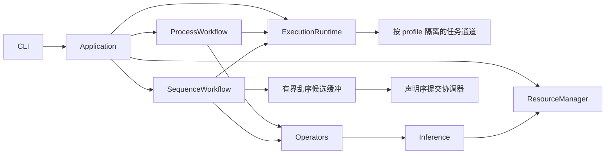
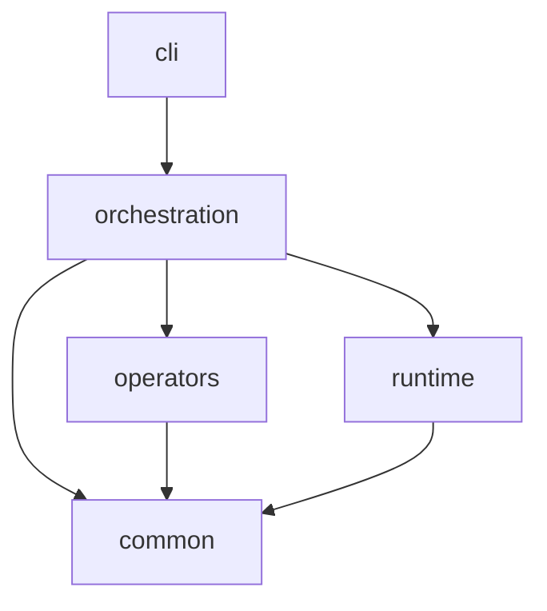
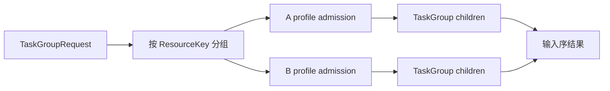
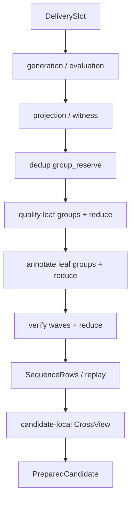
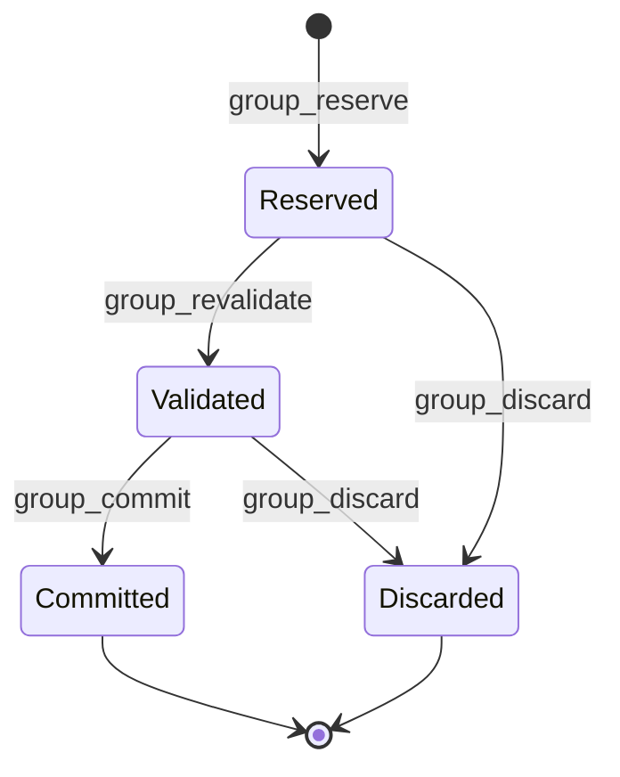
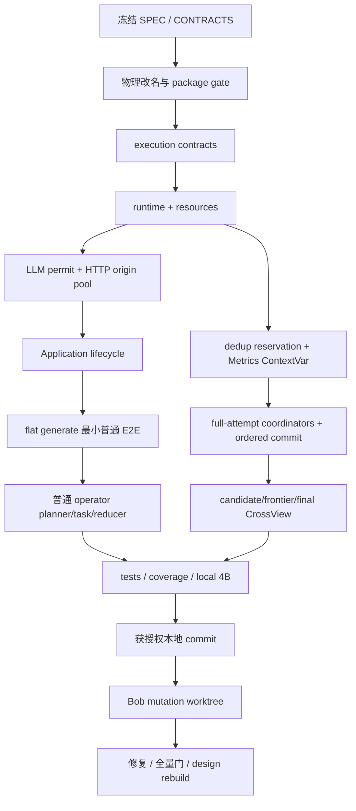

# LabelKit v1.19 统一执行运行时规格

> 状态：实现已切换；验收证据持续记录在 `docs/dev/E2E-FINDINGS.md`<br>
> 目标版本：v1.19<br>
> 变更性质：破坏性架构修订；不保留旧模块、旧接口、别名、兼容层、migration 或 fallback<br>
> 适用范围：普通标记流水线、flat 生成回流、sequence 精确交付、真实模型调用与 embedding 调用<br>
> 上游真值：`docs/CONTRACTS.md`、`docs/dev/SPEC-sequence-generation-redesign.md`、
> `docs/dev/SPEC-sequence-temporal-integrity.md` 与 `spec/*.md`

## 1. 结论

LabelKit 新增一级 `labelkit/runtime/`，作为普通标记与 sequence 生成共同使用的进程内执行运行时。
它只负责资源感知的有界任务接纳、结构化并发、取消、结果顺序和运行观测；业务阶段、重试、去重、
CrossView、retained-content 与工件提交仍由工作流和 operator 拥有。

v1.20 的时间完整性保持这条所有权边界：generic candidate finalizer、`SequenceTemporalContext`、区间规划和
replay rebound 属于 inference/operator/workflow，不进入执行运行时配置面。运行时只承载冻结候选；ordered commit
消费的 `CrossViewDelta` 新增 resource intervals，并把 source 与其全部 rebound replay 作为同一个原子 delta。

选定模型不是通用有向无环任务图，也不是线程池：

```text
资源独立的有界异步任务通道
+ asyncio.TaskGroup 结构化任务寿命
+ operator 计划 / 纯叶任务 / 声明序归并
+ sequence 全 attempt 并发准备 / 声明序短提交临界区
```



昂贵 sequence 路径不再按声明序串行。跨槽并发边界冻结为：

```text
generation → evaluation → dedup reservation → quality → annotate → verify
→ candidate assembly → candidate-local CrossView
```

只有依赖已提交前缀的去重重验证、增量 CrossView、retained 累加和内存 commit 进入无 `await` 的声明序
临界区。最终再执行一次完整 CrossView，随后 manifest-last。这个边界面向四槽本地模型与声明六百容量的部署使用
同一架构；四槽只是一份真实 E2E 证据，不是架构容量假设。

## 2. v1.18 基线事实与问题

### 2.1 v1.18 runtime 命名冲突

| 当前路径 | 实际职责 | v1.19 处置 |
|---|---|---|
| `labelkit/common/runtime/` | LLM、Schema、预算与凭据 | 移到 `common/inference/` |
| `labelkit/orchestration/runtime.py` | 对象装配与进程入口 | 改名为 `application.py` |
| `labelkit/orchestration/orchestrator.py` | 普通批次工作流 | 改名为 `process_workflow.py` |
| `labelkit/orchestration/generation_delivery.py` | sequence 工作流 | 改名为 `sequence_workflow.py` |

`runtime` 在 v1.19 后只表示任务执行运行时。

### 2.2 v1.18 普通侧已有并发但没有统一执行面

segment、stitch、classify、extract、quality、generate、annotate 和 verify 分别直接调用
`asyncio.gather()`。任务接纳、取消、异常隔离与结果归并散落在 operator 内；LLMClient 的 semaphore 只能限制
最终请求，不能阻止上游一次物化整批 coroutine，也不能给运行级提供统一的排队和取消证据。

### 2.3 v1.18 sequence 把昂贵链路全局串行化

`_deliver_primary_slots()` 只有前一槽完成生成、评估、去重、quality、annotate、verify、CrossView 和 commit 后，
才开始下一槽。同一序列内部确实依赖前一事件的 `state_after`，但不同交付槽的 attempt-local 数据没有这种依赖。

### 2.4 v1.18 CrossView prospective 路径近似二次增长

每次 prospective reconcile 都重新遍历全部已提交前缀和当前候选。随着槽位增长，累计工作量近似
`1 + 2 + ... + N`。六百并发模型即使完成得很快，也会被单事件循环中的全前缀重复扫描拖住。

### 2.5 v1.18 HTTP 连接池存在隐藏上限

`httpx.AsyncClient(timeout=None)` 使用 HTTPX 默认连接池：`max_connections=100`、
`max_keepalive_connections=20`。因此 profile 即使声明 `max_concurrency=600`，transport 仍会在隐藏的百连接
上限处排队，且这段等待会混入 provider latency。

### 2.6 周数据慢的已核实归因

白领周工程报告记录 wall 4720.439 秒，其中 generate 4049.871 秒、annotate 636.202 秒；365 个 exact sets、
1360 个 primary events，无 retry/rejection。两个 profile 合计 3540 次真实模型调用、4815622 prompt tokens 和
277052 completion tokens。v1.18 `_deliver_primary_slots()` 还让每个槽完成 generation、evaluation、下游和 commit
后才开始下一槽。因此这次退化是工作量扩大与跨槽串行共同造成，不是“七天天然只应放大七倍”，也不能只归因于
scheduler。v1.19 的同工作负载前后证据仍须分别记录 calls、tokens、attempts、rejections、资源等待、HTTP 等待、
commit 等待、peak RSS 与 wall，避免把 prompt cache 或调用形状变化冒充调度收益。

## 3. 目标与非目标

### 3.1 目标

- 普通标记与 sequence 只使用一个 TaskExecutor 和一个 ResourceManager。
- 每个 profile 的等待和执行互不占用其他 profile 的接纳名额。
- 叶任务数量有硬上界；生产者在接纳名额耗尽时异步等待。
- operator 只让纯叶任务并发，共享业务对象只在冻结 ordinal 的归并屏障修改。
- sequence 的完整昂贵 attempt 可以跨槽并发，first-writer-wins 与 whole-set 原子语义不变。
- 六百任务反向完成时仍按声明序提交，并能证明无任务、许可、reservation 或 ContextVar 泄漏。
- HTTP 连接池容量与现有 profile 容量一致，不再有隐式百连接上限。
- 不新增生产依赖，不新增 runtime 配置面，不改变单进程、单事件循环、无状态 CLI 边界。

### 3.2 非目标

- 不引入 broker、数据库、守护进程、远程 worker、跨进程恢复或持久化任务状态。
- 不提供用户可编写的任务图、TaskHandle、依赖边、通用 retry 或公开 `submit/wait/cancel` API。
- 不跨普通批次 overlap，不改变固定业务阶段顺序。
- 不用线程池包装异步 HTTP；不为尚无 profiling 证据的 CPU 操作预建 executor。
- 不保证任意工程都能同时驻留六百个完整候选；容量受可运行槽位数、调用依赖与进程内存共同约束。
- 不把 `retained_content_bytes` 描述成物理内存预留；它仍只计算最终 canonical output。
- 不承诺固定三倍加速或固定利用率；性能结论必须来自同形状前后实测。

## 4. 统一术语

| 术语 | 唯一含义 |
|---|---|
| 执行运行时 | `labelkit/runtime/` 内的进程内异步任务执行系统 |
| 工作流 | orchestration 层拥有的业务阶段、屏障、重试与提交规则 |
| 叶任务 | 一次不可再提交任务的独立异步操作 |
| 协调协程 | 可调用 TaskExecutor、推进阶段或 attempt，但不直接占 profile 许可的 coroutine |
| 任务组 | 一组共享取消边界、按输入序返回的叶任务 |
| 资源通道 | 一个 `(kind, profile_name)` 的独立有界接纳通道 |
| 资源许可 | ResourceManager 对一个逻辑 LLM 或 embedding 调用发放的容量许可 |
| 候选缓冲 | 从当前提交槽开始的连续 sequence 槽位集合，含 preparing、prepared 与 recoverable outcome |
| 候选缓冲容量 | 候选缓冲可同时占用的槽位数，由本阶段不同资源容量之和与剩余槽位数共同钳制 |
| 提交协调器 | 唯一按声明 ordinal 修改 dedup 与 DeliveryState 的协调协程 |
| CrossViewFrontier | 已提交 event ID、timestamp、source、resource intervals 与下一 phase/ordinal 的增量校验状态 |

不使用 worker pool、thread pool、executor pool 等词替代资源通道或执行运行时。

## 5. 包分层

```text
labelkit/
├── cli/
├── orchestration/
│   ├── application.py
│   ├── factory.py
│   ├── process_workflow.py
│   └── sequence_workflow.py
├── operators/
├── runtime/
│   ├── __init__.py
│   ├── scheduler.py
│   └── resources.py
└── common/
    ├── contracts/
    │   └── execution.py
    ├── inference/
    ├── observability/
    ├── config/
    └── errors.py
```



- common 不导入 runtime、operators 或 orchestration。
- operators 不导入 runtime 实现，只依赖 `common/contracts/execution.py`。
- runtime 只导入 common，不导入 operators、orchestration 或 cli。
- orchestration 是唯一同时看见 runtime 与 operators 的层。
- 不新增 `runtime/model.py`；跨层 carrier 位于 common，scheduler 私有队列项留在实现文件内。

## 6. 冻结执行契约

`labelkit/common/contracts/execution.py` 提供以下唯一跨层接口。实现使用 Python 3.11 可执行的
`TypeVar` 与 `Generic` 写法，不使用只在更新解释器可用的类型参数语法。

```python
ResourceKey = tuple[Literal["llm", "embedding"], str]
HttpOrigin = tuple[str, str, int]

@dataclass(frozen=True)
class TaskSpec(Generic[T]):
    task_id: str
    declaration_key: tuple[int, ...]
    stage: str
    resource_key: ResourceKey
    operation: Callable[[], Awaitable[T]] = field(repr=False, compare=False)

@dataclass(frozen=True)
class TaskGroupRequest(Generic[T]):
    tasks: tuple[TaskSpec[T], ...]

class TaskExecutor(Protocol):
    async def run_group(self, request: TaskGroupRequest[T]) -> tuple[T, ...]: ...

class ResourceLimiter(Protocol):
    def resource_limit(self, resource_key: ResourceKey) -> AsyncContextManager[None]: ...
    def origin_for(self, resource_key: ResourceKey) -> HttpOrigin: ...
    def origin_limit(self, origin: HttpOrigin) -> AsyncContextManager[None]: ...
    @property
    def http_connection_capacity(self) -> int: ...
```

冻结行为如下：

- `task_id` 在一次 execution domain 内全局唯一，只含 run、batch/slot、attempt、stage 与 ordinal，不含 prompt、
  payload、state、异常 repr 或密钥；重复 ID 在创建任何叶任务前 fail closed。
- `declaration_key` 是 execution domain 内可比较的声明序键，按 phase、batch/slot、attempt、stage 与 task ordinal
  展开；它只用于稳定选择同时发生的 fatal，不改变结果归并顺序。
- `stage` 使用现有规范阶段名；不为 scheduler 发明第二套阶段名称。
- `resource_key` 是调度接纳身份；ResourceManager 仍是实际逻辑调用许可的唯一所有者。
- `operation` 不进入 repr、日志、trace、报告、哈希或序列化。
- 空 TaskGroupRequest 立即返回空 tuple，且不材料化任务或 HTTP client。
- 结果按 request 输入序返回，不按完成序返回。
- 可恢复业务失败必须成为有类型的普通结果；逃逸异常均为 fatal/control/internal。
- 叶任务内调用 `run_group()` 必须 fail closed；协调协程可以调用。
- `RunContext` 显式新增 `tasks` 与 `task_namespace`；`GenerationServices` 显式新增 `tasks`，不提供默认空 executor、
  隐式 ContextVar 身份或旧构造 fallback。普通 namespace 由 run/batch/stage 派生；sequence namespace 由
  run/phase/slot/attempt/stage 派生。operator 只用 `{task_namespace}:{stage}:{ordinal}` 构造 task_id。
- `RunServices` 同样显式新增 `tasks`。Application 创建唯一 TaskExecutor；RunServices、全部 RunContext、
  GenerationServices 与派生 context 必须保持同一对象身份，禁止按批、slot 或 attempt 创建第二个 runtime。
- `ExecutionRuntime.run(workflow)` 是 composition root 使用的唯一 execution-domain 入口；域外或嵌套调用
  `run_group()` 都 fail closed。空静态命令不调用该入口。

## 7. ExecutionRuntime

### 7.1 资源独立接纳

`run_group()` 在任何阻塞前按 `resource_key` 分组，每个资源通道并行生产，通道内部保持输入 FIFO。
每个 ExecutionRuntime 实例对每个 ResourceKey 只持有一个 execution-domain 生命周期级接纳计数；全部并发
`run_group()` 共享它。接纳计数覆盖“已取得名额且尚未结束”的任务，其上限恰为对应 profile 的
`max_concurrency`，不能按任务组重新创建。



反例必须成立：A 容量为一、B 容量为五百九十九，输入先列出六百个 A 任务再列 B 任务；A 被阻塞时，
B 的五百九十九个任务仍全部可以启动。禁止单全局 FIFO 与固定全局 worker 数。

TaskGroupRequest 的冻结 TaskSpec tuple 属于 operator 业务计划，不计作已创建叶任务。普通侧由单活动批限制计划量；
sequence 侧由候选缓冲容量限制并发计划量。运行时不承诺不同 `run_group()` 在同一资源通道上的 FIFO 或无饥饿；
它只承诺容量、资源隔离、结构化终止和组内输入序结果。

TaskSpec 的 ResourceKey 只表示该叶任务首轮模型调用的接纳通道。Schema output repair 可在叶任务内部切换到另一个
profile；主调用与 repair 调用分别通过 ResourceManager 取得自己的实际资源许可。repair 等待不反向占用 repair
资源通道的 admission 名额，也不突破其实际调用容量；叶任务总数仍受首轮通道接纳上界约束。

### 7.2 结构化并发

- Application 先通过 `ExecutionRuntime.run(workflow)` 建立唯一 execution domain；所有任务组与 sequence coordinator
  都在这个根作用域的结构化子作用域内结束，`run()` 不得在仍有子任务时返回。
- 只在取得资源通道接纳名额后通过 `asyncio.TaskGroup.create_task()` 创建叶任务。
- scheduler 在 `run_group()` 入口捕获一次 `contextvars.copy_context()`；每个 leaf 必须使用独立的
  `captured_context.copy()` 创建。复制后的 Metrics capture 可引用同一个 attempt-local dict，其他 ContextVar 修改
  不得在 sibling leaf 之间可见。
- TaskGroup 在首个逃逸异常后取消 siblings，并等待所有 cleanup 完成。
- leaf wrapper 只捕获普通 `Exception`；同时观察到多个非 cancellation 异常时，按全 execution domain 唯一的
  `declaration_key` 选择最小者原样重抛。
- CircuitBreakerTripped 使用独立 group-control wrapper：只取消并清理当前 `run_group()`
  siblings，随后向工作流属主原样重抛，不记入 root fatal ledger。ProcessWorkflow 依旧完成
  partial-delivery 与 exit 4 报告；sequence workflow 仍可把同一 control 作为运行终态。
- 调用方不得看到 ExceptionGroup 包装；KeyboardInterrupt、SystemExit 与 CancelledError 不得进入 fatal wrapper。
  叶任务直接抛出 CancelledError 或取消自身 asyncio task 都以 cancellation 终止 execution domain，
  不得转为 InternalError；
  保持语言原语语义。
- lane producer 在 leaf task 创建成功后把 admission 名额所有权转交给 task done callback。
  取消即使发生在协程体首次执行之前，done callback 也必须释放名额并记录 cancellation；
  取消返回前活动任务与接纳计数必须归零。
- TaskExecutor 不执行业务 retry。

长期 dispatcher 若在自身 context 直接执行 operation 会造成 ContextVar 串扰，因此禁止；当前实现直接用携带独立
Context 的 admitted leaf，不新增固定 worker 或 dispatcher。

### 7.3 协调协程作用域

SequenceWorkflow 在 execution domain 内拥有根 coordinator TaskGroup。sequence 每个在途槽位由一个协调协程
推进；declared baseline 完成后，generation operator 可创建只覆盖 sibling counterfactual suffix 的 branch-local
TaskGroup。协调协程不计入叶任务接纳，也不直接取得 LLM/embedding 许可；每次真实调用仍逐次取得准确的
ResourceManager 许可。任意逃逸
fatal 先由 coordinator wrapper 记录稳定身份，再触发 TaskGroup 取消所有 sibling coordinators；所有 cleanup 完成后
按 `(phase declaration order, slot ordinal, attempt index, leaf declaration key)` 选择最小原始异常。

候选缓冲容量为本阶段引用的不同 ResourceKey 容量之和，并钳制到剩余槽位数。候选缓冲 permit 在创建 coordinator
前取得，跨 attempt、preparing、prepared、recoverable outcome 与等待提交全程保留，只在该 ordinal 成功提交或
运行终止清理后释放。由此 preparing 与 prepared 的并集不超过候选缓冲容量；这不是物理 RSS 证明。

候选缓冲始终是连续声明序区间：

```text
[next_commit, min(total_slots, next_commit + candidate_buffer_capacity))
```

区间内每个 ordinal 恰有一个 running、prepared 或 recoverable-outcome 占位。只有 head 成功 commit 并释放 permit
后，候选缓冲才向右接纳一个新 tail；head retry 在原 ordinal 替换占位，不释放 permit。高 ordinal 提前完成或失败
都继续占位，不得因它不再运行叶任务而持续向后补位。

### 7.4 错误与取消

| 终态 | runtime 行为 |
|---|---|
| 叶任务返回业务失败 outcome | 正常收敛，不取消 peer |
| 叶任务逃逸 fatal/internal | 取消执行域、等待 cleanup、重抛稳定原异常 |
| 叶任务逃逸 CircuitBreakerTripped | 取消当前任务组、等待 cleanup、原样交回工作流属主 |
| 外部取消 | 停止接纳、取消所有已创建任务、等待 cleanup、重抛 CancelledError |
| coordinator fatal | 取消所有 sibling coordinators 与其叶任务 |
| coordinator recoverable attempt failure | 作为普通结果交给声明序提交协调器 |

## 8. ResourceManager 与 transport

### 8.1 profile 许可

每个 profile 的唯一资源键与容量为：

```text
("llm", profile_name)       → llm profile max_concurrency
("embedding", profile_name) → embedding profile max_concurrency
```

LLMClient 删除私有 `_semaphores`，通过 `resource_limit()` 取得许可。许可继续覆盖完整逻辑调用，包括 provider
attempt、密钥轮换、retry backoff、429 cooldown 与 parking，直到逻辑调用成功或终止。不同 kind 的同名 profile
使用不同许可。

资源等待在取得许可前计时，不混入 provider latency。取消必须归还许可。probe child 与根 LLMClient 共享同一
ResourceManager。

### 8.2 HTTP origin 容量

Application 使用 `httpx.URL` 从所有本轮引用的 LLM 与 embedding profile 规范化
`(lowercase scheme, IDNA host, effective port)`，并按 origin 汇总容量。repair、probe 与生成路径引用的
profile 都必须计入；同一 profile 重复引用只计一次。显式 port 必须保留，只有 port 缺席时才取
scheme 默认值；非正 port 由 ResourceManager fail closed，不得折叠到默认 origin。ResourceManager 冻结
ResourceKey 到 origin 的映射、每 origin 的许可及
`http_connection_capacity`。共享 AsyncClient 延迟到第一次真实 HTTP 调用时按下式构造：

```python
httpx.Limits(
    max_connections=sum(origin_capacities.values()),
    max_keepalive_connections=sum(origin_capacities.values()),
)
```

每次 HTTP attempt 在调用 HTTPX 前通过 `origin_limit()` 取得对应 origin 的显式许可，容量为该 origin 所有引用
profile 容量之和。`http_pool_wait_ms` 只计算显式 origin admission 等待，provider latency 从取得 origin 许可后开始。
已经取得 origin 许可仍收到 `httpx.PoolTimeout` 表示内部容量契约不一致，必须在宽泛 timeout 分支前 fail closed，
不能当作 provider retryable。零 origin 的静态路径不构造容量为零的 AsyncClient。

probe child 共享根连接池但不拥有关闭权。root `aclose()` 幂等且实际关闭恰好一次：正常路径的 close failure 转成
InternalError；已有主异常或外部取消时记录英文错误日志、等待 close cleanup，再保留原主异常或原 CancelledError。
`run`、成功、失败、取消与 `validate --probe` 都在创建 client 的同一事件循环完成关闭；空静态路径不创建 client。

### 8.3 无新配置与依赖

不新增 `[runtime]`、`workers`、`queue_size`、`thread_count` 或 HTTP pool 配置。现有 profile
`max_concurrency` 是唯一容量真值。`pyproject.toml` 只允许登记 `local_llm` 测试 marker；`uv.lock` 与生产依赖
必须无差异。

## 9. 普通标记工作流

普通流程继续保持一个活动批次和严格阶段屏障。正确形态统一为：

```text
同步计划 → 有界纯叶任务组 → 冻结 ordinal 同步归并 / 提交
```


| 阶段 | 并发叶任务 | 串行边界 |
|---|---|---|
| ingest | 无 | next-fit、硬切、批号与输入消费 |
| segment | 每个判定窗口 | session/member 状态与 episode 追加 |
| stitch | 不同 session 的当前候选及其 vote samples 组成同一 wave | 同一 session 的 candidate、pool、repass 状态机 |
| dedup | semantic 开启时每个静态 eligible active item 的 embedding | 全层级按输入序 probe/commit，保持 first-writer-wins |
| classify | sequence samples；归并后 frame windows | classification 写入与 fanout |
| extract | 每个 transition | episode/member ordinal 回填 |
| quality | 每个 comparison 或 pointwise criterion | pool、score、gate、errors 与事件 |
| flat generate | 每个 planned call | postprocess 与生成子批组装 |
| annotate | sequence samples；归并后 frame members | vote、annotation、member map 与 counters |
| verify | judge waves；归并后 repair waves | round、claim、surgery 与 verification |
| emitter | 无 | output、reject、flush、batch end 与 freeze |

额外冻结：

- 任何叶任务都不得直接修改共享 PipelineItem、quality pool、claim table、DedupIndex 或 emitter。
- 普通 ProviderFatalError 继续服从 operator 既有记录级策略；只有逃逸异常触发 runtime 取消。
- ordinary dedup 先同步、纯计算地冻结每个 active item 的 exact、MinHash、pHash、图像解码状态、sequence 身份与
  embedding input，不查询或修改正式索引。CPU 特征不提交 runtime 叶任务。
- semantic 开启时，所有按 modality、`ui_dup_requires`、图像解码状态与 sequence 身份静态判定为 participating 的
  item 都投机并发取得 embedding；这包括随后可能被同批较低 ordinal 的 exact、MinHash、pHash 或 semantic 判决
  淘汰的 item。只有这种固定调用形状才能同时保持声明序 first-writer 与跨 item 模型并发。
- 归并屏障按输入序使用最新正式索引执行完整层级判决；只有走到 semantic 层才消费预计算 vector，未使用 outcome
  不改 PipelineItem 或 DedupIndex。所有已发出的 usage、provider result、breaker、latency 与 embedding failure 是
  真实运行事实，不因 outcome 未使用而回滚。capacity 改变不得改变 semantic task 集合。
- rules-only segment、单样本无需调用、hash-only dedup、空批等路径提交零任务。
- `annotate.enabled=false, frame_annotate.enabled=true` 仍必须执行 annotate stage。
- flat generated child 在父批 emit、flush、freeze 后、下一输入批前执行；child reflow 不再进入 generate。
- 不跨 batch overlap；calibrator 仍在每个已派发外层批结束时恰冻结一次。
- 所有生产 `asyncio.gather()` 从 operator 删除；不保留旧执行分支。

## 10. Sequence 并发工作流

### 10.1 有界全 attempt 准备

每个在途 slot coordinator 一个时刻只运行一个 attempt：



- 同一 branch 的事件按 state_after 依赖串行；不同 slot 并发。
- declared baseline 完成后，不同 counterfactual suffix 由 branch coordinator 结构化并发；完整 branch 不冒充某个
  profile 的单一叶任务。结果与可恢复失败按 variant 声明序归并；fatal/control 等待 sibling cleanup 后原样传播。
- quality → annotate → verify 的业务屏障不删除；前一 gate 拒绝后不支付后续 gate。
- 不同 attempt 使用不同 PipelineItem；同一 attempt 内共享 item 的叶调用必须返回纯 outcome 后归并。
- 高 ordinal 的 recoverable failure 提前完成后只保留结果，不自行重试或写报告。
- 只有轮到该 ordinal 时，提交协调器才消费 attempt、记录 rejection 并启动下一 attempt。
- running、PreparedCandidate 与 RecoverableOutcome 都占用同一个连续候选缓冲位置；高槽完成不接纳缓冲外 tail。
- 任意 fatal/circuit/internal 立即取消全 sequence 执行域，且不消耗 attempt。
- attempt 只在当前 head 被判定为本地 recoverable rejection、commit-time rejection 或成功 commit 时恰消费一次。
  speculative 高槽被丢弃时不进入 slot attempts 或 rejection bucket；fatal、circuit 与 cancellation 不消费 attempt。
- reservation 之后发生的 downstream recoverable failure 仍保留 reservation 到该 ordinal 成为 head。提交协调器先
  revalidate：若最新前缀产生 dedup 冲突，则按既有优先级记录 dedup；否则才记录已保存 downstream failure 并 discard。

### 10.2 声明序提交协调器

协调器只消费当前 `next_commit`：

```text
dedup.group_revalidate
→ frozen candidate digest 验证
→ CrossViewFrontier.check_primary
→ retained-content prospective check
→ 预验证 counters 与 DeliveryState delta
→ dedup.group_commit
→ frontier / counters / rows / sources / replays / retained commit
```

这段代码必须无 `await`。去重重验证先于 CrossView，以保持同一候选同时存在 dedup 与 reconcile 冲突时的既有
拒绝优先级；group_commit 后的状态交换不得再有普通可恢复失败分支。

提交成功后窗口只向右移动一个 ordinal。commit-time dedup、CrossView 或 retained rejection 只在当前窗口 head
原位重建下一个 attempt；已准备好的更高候选继续保留，并在轮到时对最新正式状态重验证。

当前 slot 耗尽时停止接纳、取消并等待所有更高 coordinator，discard 全部 reservation，丢弃其 dataset counters
与候选。它们已发生的 usage、retry、Schema、trace 与 provider latency 仍是运行事实，但不进入 attempt/rejection
报告桶。

failed report 在 coordinator 与叶任务 cleanup 全部完成后冻结。并发 fatal 按本规格的稳定 coordinator key 选中；
`failed_slot` 使用被选 fatal 的槽身份，`attempts_used` 是该槽此前已消费的 recoverable attempts。exhaustion 的当前槽
恰记录 `max_slot_attempts`；外部 cancellation 与最终 full CrossView 内部错误使用 `failed_slot=null`、
`attempts_used=0`。高槽 recoverable outcome 因低槽耗尽而丢弃时不得泄漏到报告。

### 10.3 Noise 与 replay

全部 primary 内存提交后，NoiseSlot 使用相同的“并发准备、声明序重验证”模型。生成和独立 semantic evaluator
可跨 noise slot 并发；SimilarityFilter 必须在提交时针对最新 primary 与较低 ordinal noise 重新 probe。Noise
PreparedNoiseCandidate 闭包 NoiseSlot、post-gate payload digest、最终 row、signature、dataset counter delta 与
实际 retained bytes；进入
候选缓冲前的 NoiseCandidateReconcileRequest 验证 payload、topic/ordinal、timestamp、ID 派生、字段闭包与
canonical bytes。

Noise head 的完整无 `await` 顺序冻结为：

```text
SimilarityFilter.probe(latest primary + lower noise)
→ frozen noise digest 验证
→ CrossViewFrontier.check_noise
→ retained-content prospective check
→ 预验证 frontier / DeliveryState delta
→ SimilarityFilter.commit(signature)
→ frontier / noise rows / digest / retained commit
```

SimilarityFilter 正式突变后不得再有普通 rejection。相似度冲突只拒绝当前 noise attempt；高槽提前计算的 signature
不能直接 commit。

Replay 不调用 LLM，不进入独立 coordinator。它只从对应 source slot 的最终成功 SequenceRows 派生；Planner 冻结一个
毫秒对齐的正 `shift_us`，所有成员保持 start delta、duration、resources、role 顺序与非时间 payload，业务时间按 replay
start 重新绑定。source 与全部 rebound replay 一起做本地校验并进入同一个声明序提交。

## 11. Dedup reservation

现有 token 的“任何 commit 增代并清空全部 pending”语义删除。新状态机为：



- `group_reserve()` 异步计算 exact、MinHash 与可选 embedding 特征，检查正式索引和组内非豁免重复，零正式突变。
- 外部 DedupReservation 只携带 opaque capability、epoch、record digests 与小型 exact cluster keys。
- MinHash、embedding、Record 引用与完整冻结特征只在 DedupIndex registry 保留一份。
- pending reservation 彼此不参与早期拒绝；低 ordinal 仍可能在下游失败，提前让它淘汰高槽会偏离串行语义。
- `group_reserve()` 返回后 reservation 由当前 coordinator 唯一拥有；只有深冻结 outcome 成功插入候选缓冲后，
  所有权才转移给缓冲与提交协调器。coordinator 在未转移终态的 finally 中恰好 discard 一次。
- `group_revalidate()` 无 `await`，对最新正式索引重查；冲突时不写 `validated_generation`，状态保持 Reserved，调用方
  在同一无 `await` rejection 路径 discard。成功时才进入 Validated，零正式索引突变。
- `group_commit()` 只接受当前 generation 的 Validated reservation，只消费自己，不清空其他 pending。revalidate
  已成功后的 generation 变化或 commit failure 都是 InternalError，不能再产生普通 DedupGroupRejected。
- `reset()` 清空 registry 并递增 epoch；旧 epoch capability、Record 内容变化或非法状态均为 InternalError。
- `group_discard()` 严格消费一次；重复 discard 直接暴露所有权错误。结束、exhaustion 与 cancellation cleanup 后
  pending registry 必须为空。

两个相同的 speculative candidate 可能都支付完整下游成本；较低 ordinal commit 后，较高 ordinal 在 revalidate
时被拒绝。这是维持确定性 first-writer-wins 的必要投机成本。

## 12. CrossView 线性化

### 12.1 候选局部校验

新增显式 PrimaryCandidateReconcileRequest，携带当前 DeliverySlot、variant-aligned witnesses、SequenceRows、计划中该
source 的完整 ReplayLayouts、实际 ReplayRows 与候选 retained bytes。它只验证当前候选，不从计划首槽开始 zip，
也不读取 DeliveryState 前缀。

它执行 CrossView 的本地事实：payload/base event/generation witness、ID 派生、owner、role、frame、actor、duration、
resources、time-binding descriptor、业务时间机械值、containment、replay source 与 constant shift、候选内
timestamp/event ID 唯一、resource interval 互斥和候选 canonical bytes。比较 source/replay payload 时先删除 descriptor
列出的时间路径，要求其余内容与下游 metadata 相同，再用 rebound payload 重算 replay event ID。SequenceRows 数量与
variant 顺序必须和 slot 完全相等；ReplayRows 必须和该 source 的全部 ReplayLayouts 一一相等，不得遗漏或增加；
retained bytes 必须覆盖 main、全部 primary 与全部 rebound replay。

candidate-local 通过后创建唯一深冻结 PreparedCandidate，闭包 slot/attempt identity、严格 variant 顺序的 witnesses
与 SequenceRows、按 layout 顺序的全部 ReplayRows、reservation、已验证 counter delta、实际 retained bytes 与
candidate digest。递归冻结成功并把所有权转移到候选缓冲后，立即释放 AttemptTransaction、PipelineItems 与投影中间
对象；任何代码不得再修改候选。提交临界区只比较 frozen digest，不再执行第二次完整 candidate-local 扫描。

Noise 使用独立 NoiseCandidateReconcileRequest 与深冻结 PreparedNoiseCandidate，不把 primary 请求复用成联合 carrier。

### 12.2 增量 frontier

CrossViewFrontier 保存 `(primary|noise, next ordinal)`、已提交 event IDs、timestamps、source keys 与按 resource 排序的
intervals。primary 完成后才切换到 noise phase，这些集合不清空。提交时检查当前 candidate rows 与 frontier 不冲突，
`check_primary()` / `check_noise()` 只生成尚未正式应用的冻结 CrossViewDelta；全部其他可恢复检查通过后，
`commit(delta)` 无失败消费。每槽工作量只与当前候选行数有关，不再重扫完整前缀。primary candidate
的 rebound replay 与 source 一起进入同一 frontier delta 和同一次原子 commit；noise candidate 同样参与全局 ID 与
timestamp 唯一性。固定计划的 payload time、annotation、containment、resource 或 frontier interval 不一致是终态
`generation_downstream_contract`，不得作为 recoverable slot rejection。

### 12.3 最终独立对账

全部 primary、noise 与 replay 内存提交后，full `reconcile_views()` 从最终 rows 独立重建全部事实；stream 完成最终
timestamp 排序后再复查全局起点唯一、resource interval 互斥、containment、descriptor、payload 业务时间与 main
annotation。incremental frontier 与 full reconcile 必须通过属性式反例证明等价。最终 full reconcile 失败属于内部不变式破坏，
使用既有运行级 InternalError、exit 4，不消费 attempt，failed report 使用 `failed_slot=null`、`attempts_used=0`，
不能打开输出或替换旧 manifest，也不得重新包装为 GenerationAttemptRejected。任何 candidate-specific mismatch 必须
已在 local/frontier 阶段成为当前 attempt 的 reconcile rejection。

因此 CrossView 总工作量从每槽前缀重扫的近似 O(N²) 改为候选局部 O(total rows) 加最终 O(total rows)。

## 13. 下游纯结果与 MetricsSink

### 13.1 纯叶任务

quality、annotate 与 verify 的叶调用不得写 PipelineItem、pool、member map、events 或 errors。叶任务返回冻结 outcome，
operator 按以下稳定键归并：

```text
slot ordinal → attempt index → stage declaration order → item/criterion/sample/member/judge ordinal
```

sequence quality 受配置约束为 pointwise；每个 variant × criterion 可并发。annotate enabled 时先归并 sequence
samples，成功后再执行 frame members；annotate disabled 时 sequence 调用为零，直接执行 frame pass，annotation 保持
null。verify 按 judge wave、repair wave 与 round 屏障推进。sequence 配置强制 segment disabled，因此 verify 必须走
classic 路径，不能进入 stream claim/surgery driver。

普通 stream verify 每轮严格执行以下波次，不得把有依赖的波次合并成一个任务组：

```text
review leaves → route reduce → claim leaves/reduce → reseam leaves/rebuild
→ frame-classify leaves/reduce → frame-annotate leaves/reduce
→ reannotate leaves/reduce → next round
```

每个叶任务只返回冻结 outcome，不得修改 claim table、PipelineItem、episode/member map 或 stage events，也不得嵌套
调用 `run_group()`。ordinary ProviderFatal 先由 operator 转为既有 record/outcome 失败，不触发 runtime sibling cancel；
sequence ProviderFatal 原样逃逸并取消 execution domain，且不消费 attempt。CircuitBreaker 与 CancelledError 在两侧都
结构化取消。

### 13.2 ContextVar 计数捕获

MetricsSink 的实例级 `_captured_counts` 改为 ContextVar：

- 每个 collaborator capture 一个局部 dict，并用 token 在 finally reset。
- scheduler 为每个 leaf 复制独立 Context；不同 slot/stage capture 互不可见，同组 leaf 对非 metrics ContextVar 的修改
  也互不可见。
- child tasks 共享所属 capture；nested capture 仍 fail closed。
- `budget.*`、LLM/embedding calls 与 tokens、Schema validation/repair、provider retry、breaker、resource/origin wait、
  provider latency、runtime cancellation 与 trace call events 绕过 attempt capture，实时写运行事实。
- dataset counters 只在成功 group_commit 后合并。

breaker streak 按真实 provider 完成顺序实时生效；capacity 改变可能改变并发 fatal/success 的到达顺序。规格只保证
数据提交确定性，不虚构 provider 完成序或 trace 字节确定性。

## 14. 内存与背压边界

运行时冻结两个可证明的硬上界：

- 每个资源通道已接纳叶任务数不超过对应 profile capacity。
- sequence preparing、prepared 与 recoverable outcome 的总槽位数不超过冻结候选缓冲容量。

待提交候选进入缓冲后计算实际 canonical bytes，并记录所有“已完成但尚未提交”候选 canonical bytes 同时驻留总和
的 high-water，不是单候选最大值。它不包含正在生成的 provider response、AttemptTransaction、Python 对象开销、
dedup registry 或 HTTP buffer。现有 retained-content gate 继续按声明序比较
“已提交实际 bytes + 当前候选实际 bytes”。恰好上限接受，超一 UTF-8 byte 拒绝当前 whole set。

不保留 `slot_result_bytes_upper_bound`。当前用户 annotation Schema 可以含无 maxLength 的 string 或无 maxItems 的
array，provider 响应体也没有统一硬字节上限；在不新增内容语义上限或磁盘 spill 的前提下，不能诚实证明候选启动前
的物理 RSS 预留。v1.19 选择数量背压、实际字节观测和真实 RSS 压测，不新增虚假的 compiler 上界。

`retained_content_bytes=536870912` 仍是 compact canonical-output accounting，不是物理 allocation。若未来产品明确
要求进程 RSS 硬上界，必须另行冻结统一 provider response 与 annotation canonical-byte 契约，不能伪装成 runtime 实现细节。

## 15. 可复现性与提交语义

- 普通 batch number、stage order、item order、fanout order 与 freeze order 不变。
- 普通 RNG 只在同步计划阶段按输入序消费；叶任务不共享 RNG。
- sequence 随机源继续由 seed、slot identity、attempt index 与 purpose 派生。
- TaskGroup 结果按输入序；attempt-local reduce 按冻结 ordinal。
- dedup 与 DeliveryState 只按输入序或 slot declaration ordinal commit。
- capacity 改变不得改变 task identity、随机数消费、first-writer 或最终排序。
- LLM 服务端内容非确定性不在逐字节保证内。
- success 仍是 main、stream、report，manifest last；manifest 是唯一成功真值。
- exhaustion 与 pre-commit terminal 保留旧成功 artifacts，只写独立 failed report。

## 16. 观测与报告

成功 report 与 failed report 新增同形状 `runtime` 块；静态 dry-run 使用零值，不启动 runtime：

| 字段 | 含义 |
|---|---|
| `queue_high_water` | 全部资源通道等待接纳的最高任务数 |
| `running_high_water` | 同时运行叶任务最高值 |
| `resource_wait_high_water` | 等待 profile 许可的最高逻辑调用数 |
| `commit_waiting_high_water` | 已完成且等待声明序提交的候选最高值 |
| `candidate_bytes_high_water` | 所有已完成且尚未提交候选 canonical bytes 同时驻留总和最高值 |
| `cancelled_tasks` | 完成 cleanup 的取消叶任务数 |
| `resource_wait_ms` | 全部 profile 许可等待累计毫秒 |
| `http_pool_wait_ms` | 全部 origin 许可等待累计毫秒 |
| `commit_ms` | 声明序短提交临界区累计毫秒 |

等待中取消的调用也把已经过时长计入 `resource_wait_ms` 或 `http_pool_wait_ms` 恰一次，
且不消费许可。

报告不含 endpoint、origin、prompt、payload、state、callable repr 或 API key。trace 的叶调用事件按真实完成时序，
dataset 与工件事件按归并/提交时序。

## 17. CLI 与生命周期

- 不带 `--probe` 的 validate 与 estimate 不构造 HTTP client 或 ExecutionRuntime。dry-run 可为精确的
  `RunServices.tasks` 身份构造唯一惰性 ExecutionRuntime，但不进入 execution domain、不创建 leaf，也不构造
  HTTP client。
- `validate --probe` 构造 ResourceManager 与 LLMClient，以精确 ResourceKey 区分同名 LLM 与
  embedding profile，通过相同资源许可与 origin pool 执行，并在 finally 关闭。
- live run 在 ResolvedConfig、GenerationProgram 与 ScenarioPlan 冻结后构造 runtime。
- Application 是唯一 composition root，并在所有成功、错误与 cancellation 路径关闭 LLMClient。
- CLI 参数、退出码、partial delivery 与信号边界保持既有契约。

## 18. 业界方案

本规格采用成熟系统的 ordered asynchronous execution 形态：异步工作可以乱序完成，容量耗尽时向上游背压，
可观察输出仍按输入顺序。Apache Flink 的 ordered async I/O 也明确以 capacity 限制在途请求并缓存乱序结果，
代价是队头等待；LabelKit 在此基础上增加了 dedup reservation 与 whole-set commit。

| 方案 | 吸收 | 不引入 |
|---|---|---|
| Python asyncio TaskGroup | sibling cancellation、cleanup 等待、结构化寿命 | ExceptionGroup 作为产品错误面 |
| Python asyncio Queue/Semaphore | 有界接纳与 producer backpressure | 通用 broker |
| Apache Flink ordered async I/O | 乱序计算、有界结果、输入序输出 | 分布式 runtime 与 checkpoint |
| Ray pending-task backpressure | 限制未完成任务，资源需求与调度分离 | Ray worker 与 object store |
| HTTPX explicit Limits | 显式连接池容量 | 新 transport 依赖 |

权威资料：

- [Python TaskGroup](https://docs.python.org/3.12/library/asyncio-task.html#task-groups)
- [Python asyncio Queue](https://docs.python.org/3.12/library/asyncio-queue.html)
- [Apache Flink Async I/O](https://nightlies.apache.org/flink/flink-docs-release-2.3/docs/dev/datastream/operators/asyncio/)
- [Ray pending-task backpressure](https://docs.ray.io/en/master/ray-core/patterns/limit-pending-tasks.html)
- [HTTPX resource limits](https://www.python-httpx.org/advanced/resource-limits/)

## 19. 精确文件修改清单

### 19.1 新增

- `labelkit/common/contracts/execution.py`
- `labelkit/runtime/__init__.py`
- `labelkit/runtime/scheduler.py`
- `labelkit/runtime/resources.py`
- `labelkit/operators/quality_calls.py`
- `labelkit/operators/stream_verify.py`
- `tests/common/contracts/test_execution.py`
- `tests/runtime/test_scheduler.py`
- `tests/runtime/test_resources.py`
- `tests/orchestration/test_application.py`
- `tests/integration/test_execution_runtime_local_llm.py`
- `spec/317-m17-execution-runtime.md`
- `examples/sequence-generation/config-local-4b.toml`
- `examples/sequence-generation/project-runtime-four-slot.toml`

`quality_calls.py` 承担纯调用计划/outcome；`stream_verify.py` 承担普通 stream verify driver。拆分用于保持
`quality.py` 与当前恰好两千行的 `verify.py` 满足生产文件长度限制，不创建兼容入口。

### 19.2 直接移动并删除旧路径

- `labelkit/common/runtime/budget.py` → `labelkit/common/inference/budget.py`
- `labelkit/common/runtime/credentials.py` → `labelkit/common/inference/credentials.py`
- `labelkit/common/runtime/generation_prompts.py` → `labelkit/common/inference/generation_prompts.py`
- `labelkit/common/runtime/llm_client.py` → `labelkit/common/inference/llm_client.py`
- `labelkit/common/runtime/schema_engine.py` → `labelkit/common/inference/schema_engine.py`
- `labelkit/orchestration/runtime.py` → `labelkit/orchestration/application.py`
- `labelkit/orchestration/orchestrator.py` → `labelkit/orchestration/process_workflow.py`
- `labelkit/orchestration/generation_delivery.py` → `labelkit/orchestration/sequence_workflow.py`
- `tests/common/runtime/test_budget.py` → `tests/common/inference/test_budget.py`
- `tests/common/runtime/test_credentials.py` → `tests/common/inference/test_credentials.py`
- `tests/common/runtime/test_generation_prompts.py` → `tests/common/inference/test_generation_prompts.py`
- `tests/common/runtime/test_llm_client.py` → `tests/common/inference/test_llm_client.py`
- `tests/common/runtime/test_schema_engine.py` → `tests/common/inference/test_schema_engine.py`
- `tests/orchestration/test_orchestrator.py` → `tests/orchestration/test_process_workflow.py`
- `tests/orchestration/test_generation_delivery.py` → `tests/orchestration/test_sequence_workflow.py`
- `spec/310-m10-orchestrator.md` → `spec/310-m10-orchestration.md`

全部旧模块删除，不保留 import shim、包装类、转发函数或 removed path package。

### 19.3 核心语义修改

- `labelkit/common/config/model.py`
- `labelkit/common/contracts/stage.py`
- `labelkit/common/contracts/generation.py`
- `labelkit/common/errors.py`
- `labelkit/common/observability/obslog.py`
- `labelkit/common/inference/llm_client.py`
- `labelkit/orchestration/application.py`
- `labelkit/orchestration/factory.py`
- `labelkit/orchestration/process_workflow.py`
- `labelkit/orchestration/sequence_workflow.py`
- `labelkit/orchestration/__init__.py`
- `labelkit/operators/dedup.py`
- `labelkit/operators/segment.py`
- `labelkit/operators/stitch.py`
- `labelkit/operators/classify.py`
- `labelkit/operators/extract.py`
- `labelkit/operators/quality.py`
- `labelkit/operators/quality_calls.py`
- `labelkit/operators/generate.py`
- `labelkit/operators/annotate.py`
- `labelkit/operators/verify.py`
- `labelkit/operators/stream_verify.py`
- `labelkit/operators/generation/scenario.py`
- `labelkit/operators/generation/evaluate.py`
- `labelkit/operators/generation/project.py`

### 19.4 机械 canonical import 修改

- `labelkit/cli/__init__.py`
- `labelkit/cli/commands.py`
- `labelkit/cli/console.py`
- `labelkit/common/config/_constraints.py`
- `labelkit/common/config/_generation_budget.py`
- `labelkit/common/config/_sections.py`
- `labelkit/common/config/generation.py`
- `labelkit/operators/emitter.py`
- `labelkit/operators/generation/flat.py`
- `labelkit/operators/generation/render.py`

19.2 与 19.3 已列出的移动或核心文件内部 import 同批修改。除此之外，不存在未列出的生产 import 命中；
`rg -l 'labelkit\.common\.runtime' labelkit tests` 必须为零。

### 19.5 测试修改

- `tests/conftest.py`
- `tests/llm_client_helpers.py`
- `tests/cli/test_cli.py`
- `tests/cli/test_console.py`
- `tests/common/config/test_generation.py`
- `tests/common/contracts/test_stage.py`
- `tests/common/contracts/test_generation_contracts.py`
- `tests/common/observability/test_obslog.py`
- `tests/operators/test_segment.py`
- `tests/operators/test_stitch.py`
- `tests/operators/test_dedup.py`
- `tests/operators/test_classify.py`
- `tests/operators/test_extract.py`
- `tests/operators/test_quality.py`
- `tests/operators/test_generate.py`
- `tests/operators/test_annotate.py`
- `tests/operators/test_verify.py`
- `tests/operators/test_emitter.py`
- `tests/operators/generation/test_evaluate.py`
- `tests/operators/generation/test_project.py`
- `tests/operators/generation/test_render.py`
- `tests/operators/generation/test_scenario.py`
- `tests/orchestration/test_process_workflow.py`
- `tests/orchestration/test_sequence_workflow.py`
- `tests/integration/test_annotate_llm.py`
- `tests/integration/test_budget_llm.py`
- `tests/integration/test_classify_llm.py`
- `tests/integration/test_frame_llm.py`
- `tests/integration/test_generate_llm.py`
- `tests/integration/test_key_pool_llm.py`
- `tests/integration/test_llm_client_llm.py`
- `tests/integration/test_quality_llm.py`
- `tests/integration/test_schema_engine_llm.py`
- `tests/integration/test_sequence_generation_llm.py`
- `tests/integration/test_sequence_generation_structured_output_llm.py`
- `tests/integration/test_stitch_llm.py`
- `tests/integration/test_stream_llm.py`
- `tests/integration/test_verify_llm.py`

`tests/cli/test_cli.py` 同时更新精确文件 manifest、依赖方向、旧模块 `find_spec is None` 和无 shim 断言。

### 19.6 权威文档同步

- `docs/dev/SPEC-execution-runtime.md`
- `docs/CONTRACTS.md`
- `docs/dev/SPEC-activity-structure.md`
- `docs/dev/SPEC-classify-operator.md`
- `docs/dev/SPEC-context-budget.md`
- `docs/dev/SPEC-frame-annotation.md`
- `docs/dev/SPEC-package-layer-reorganization.md`
- `docs/dev/SPEC-sequence-generation-redesign.md`
- `docs/dev/SPEC-stream-segmentation.md`
- `docs/dev/SPEC-tui-console.md`
- `docs/dev/E2E-FINDINGS.md`
- `spec/00-frontmatter.md`
- `spec/10-ch1-overview.md`
- `spec/20-ch2-overall-design.md`
- `spec/30-ch3-modules-intro.md`
- `spec/40-ch4-data-structures.md`
- `spec/50-ch5-config-spec.md`
- `spec/60-ch6-io-formats.md`
- `spec/70-ch7-logging.md`
- `spec/303-m3-dedup.md`
- `spec/304-m4-qualityqurating.md`
- `spec/305-m5-annotate.md`
- `spec/306-m6-generate.md`
- `spec/307-m7-verify.md`
- `spec/308-m8-schema-engine.md`
- `spec/309-m9-llm-client.md`
- `spec/310-m10-orchestration.md`
- `spec/311-m11-emitter.md`
- `spec/312-m12-logging.md`
- `spec/313-m13-classify.md`
- `spec/314-m14-segment.md`
- `spec/315-m15-extract.md`
- `spec/316-m16-stitch.md`
- `spec/317-m17-execution-runtime.md`
- `docs/manual/04-concepts.md`
- `docs/manual/02-install.md`
- `docs/manual/03-quickstart.md`
- `docs/manual/06-config-toml.md`
- `docs/manual/15-cli.md`
- `docs/manual/16-observability.md`
- `docs/manual/17-tuning.md`
- `docs/manual/18-troubleshooting.md`
- `docs/manual/27-sequence-generation.md`
- `docs/design/labelkit-design-v1.html`
- `docs/design/labelkit-design-v1.pdf`
- `tools/build_design_doc.py`
- `pyproject.toml`，只登记 `local_llm` 测试 marker

工作区可能由宿主提供被 `.gitignore` 排除的 `AGENTS.md` 与 `CLAUDE.md`。它们存在时必须同步且保持字节一致，
但不是本 feature commit 的版本化工件；版本化权威仍是本节列出的 Markdown、生成设计与 executable manifests。

真实运行事实只能在完成对应运行后写入 E2E/manual；未运行的真端点证据使用
`[PENDING-EVIDENCE:<name>]`。

## 20. Spec-to-test 验收矩阵

### 20.1 Runtime 与资源

| 规格事实 | 必须杀死的反例 |
|---|---|
| profile 通道独立 | A=1 的六百任务阻塞时，B=599 全部启动 |
| 跨组全局接纳 | 六百个并发 group 共用 capacity=7，active leaf 总数始终不超过七 |
| 接纳覆盖 admitted leaf | high-water 恰不超过各 profile capacity |
| 输入序结果 | 六百任务反向完成仍返回零至五百九十九 |
| ContextVar 传播 | 长等待后 leaf 仍见提交 capture；siblings marker 隔离但共享 attempt metrics dict |
| fatal 结构化取消 | siblings finally 完成、许可归还、活动数归零后才抛 |
| 稳定原异常 | 跨 group 同时 fatal 按最小 declaration key，且无 ExceptionGroup |
| nested run_group 禁止 | fail closed 且无接纳/许可泄漏 |
| execution domain | 域外与嵌套 run_group fail closed；run 返回时无子任务 |
| HTTP pool 显式容量 | capacity 六百时不能退回 HTTPX 默认一百/二十 |
| origin 等待独立 | 不计入 provider latency；admission 后 PoolTimeout 为 internal |
| origin 聚合 | LLM/embedding/repair/probe 同 origin 聚合，不同 origin 独立 |
| repair 切 profile | A=600 叶任务进入 B=1 repair 时 B active≤1，且 B lane 可独立接纳 |
| 生命周期关闭 | run/probe 成功、失败、取消及主异常+close failure 都保持优先级并恰好关闭一次 |

### 20.2 普通标记

| 阶段 | 必须证明 |
|---|---|
| segment | 窗口反序完成仍按 session/span 归并 |
| stitch | 同会话前一候选决定后一 prompt/pool；不同会话当前候选的 vote samples 在同一 wave 并发且按输入序归并 |
| dedup | participating embedding 真实并发；exact twins、semantic twins、低槽 failure 反序仍 input-order first-writer |
| classify | samples 与 frame windows 分阶段；fanout 按 item×label 声明序 |
| extract | transition 反序完成仍按 member ordinal，episode all-or-none |
| quality | 共享 item 的多 criterion 反序失败仍固定 errors[0]/score/gate |
| flat generate | planned call 反序完成仍按计划组装 child batch |
| annotate | sample reduce 后才执行 frame；duplicate member first-wins |
| verify | judge/repair/round 屏障；普通 stream claim 按 batch position |
| process | 一个活动批；emit→flush→freeze；child 优先且不再 generate |
| frame-only | annotate disabled、frame annotate enabled 仍执行 stage |
| dedup 零调用 | semantic off 与 UI image-only 提交零任务；未使用 speculative outcome 不污染 item/index |
| error topology | ordinary ProviderFatal 保持 record/outcome 隔离；CircuitBreaker/Cancelled 结构化取消 |

### 20.3 Sequence

| 规格事实 | 必须杀死的反例 |
|---|---|
| 全 attempt 跨槽并发 | quality/annotate/verify 的不同槽调用真实重叠 |
| 同槽状态串行 | event N+1 不得早于 N 的 state_after |
| 同槽 suffix 并发 | baseline 后至少三个 counterfactual suffix 同时在途，结果与 recoverable failure 按 variant 声明序归并 |
| 声明序 commit | 六百槽反向完成仍严格零至五百九十九 |
| 高槽失败延迟记账 | 高槽先拒绝、低槽耗尽时报告不含高槽 rejection |
| reservation 失败优先级 | 高槽 quality failure、低槽后提交同内容时，高槽轮到后先记 dedup |
| 低槽耗尽清理 | 高槽 tasks/token/capture/candidates 全部归零 |
| dedup reservation | 六百 pending 共存；低槽 commit 不使高槽 stale |
| dedup first-writer | 六百相同候选只有最低 ordinal commit，其余重试 |
| 拒绝优先级 | 同一候选 dedup 与 CrossView 同时失败时先记 dedup |
| CrossView 无索引污染 | revalidate 后 CrossView 拒绝，正式 dedup 仍为空 |
| 增量线性 | 一百/三百/六百槽不出现前缀重扫的二次调用数 |
| incremental/full 等价 | ID、timestamp、resource interval、containment、replay、retained 随机破坏判定一致 |
| candidate 闭包 | 遗漏 variant/replay、descriptor 或 rebound payload 篡改都在提交前拒绝 |
| noise 本地真值 | 伪造 descriptor、payload digest、topic/ordinal、ID 或 bytes 都在当前 noise attempt 拒绝 |
| final invariant | 故意漏写 frontier delta 只产生 exit 4 内部失败，不消费 attempt 或打开输出 |
| ContextVar capture | 六百 attempt counters 隔离，只有提交者合并 |
| capacity 确定性 | capacity 一与六百的 deterministic provider 产物 digest 相同 |
| noise | 并发准备、声明序 similarity re-probe、first-writer 固定 |
| sequence frame-only | annotate disabled 时 sequence 调用为零、frame pass 执行且 annotation 为 null |
| fatal ledger | 高槽 fatal、多个同时 fatal 与 cleanup 后 failed report 身份稳定 |
| manifest-last | 每个 commit fault point 仍以旧 manifest 为唯一成功真值 |

### 20.4 覆盖率与 Bob review

- spec 功能用例覆盖率为 100%。
- 变更生产函数函数覆盖率为 100%，行覆盖率不低于 85%，分支覆盖率不低于 75%。
- Uncle Bob mutation review 使用干净、已提交的 detached worktree，一次只做一个语义 mutation。
- 每次 mutation 后恢复源文件并证明 diff 为空；最终报告标题必须为 `# Bob report`。
- mutation 至少覆盖 profile 通道合并、接纳上界放松、完成序返回、漏取消、漏 ContextVar、nested submit、
  HTTP pool 退回默认、repair 错计首轮 lane、ordinary semantic dedup 重新串行化、dedup 按完成序 commit、unused
  speculative outcome 污染索引、dedup 不重验证、CrossView 前缀重扫、quality 按完成序写 error、verify leaf 写共享
  claim、ordinary ProviderFatal 升级为 runtime fatal、frame annotate OR gate 回退、generated child 再进 generate、
  RunServices/task identity 断裂与 sequence 越序 commit。

## 21. 性能与真实模型验收

### 21.1 六百并发合成门

不使用 mock LLM transport。scheduler 自身用受控 coroutine 证明六百接纳、反向完成、profile 隔离、取消和 cleanup；
这只证明内部调度能力，不声称外部 endpoint 支持六百真实请求。

候选缓冲压力用固定 canonical candidate 大小运行并报告 peak RSS、候选缓冲高水位与
`candidate_bytes_high_water`；该结果只证明这一固定工作负载。它不证明任意合法 Schema 在六百候选下不会 OOM。

commit 性能记录候选到达率与 `commit_ms`。有序临界区只有在
`commit service rate > prepared candidate arrival rate` 时不会成为瓶颈。若六百压力下 commit 持续背压，必须优化
当前候选的增量检查或 dedup 索引，不能把昂贵下游重新串行化，也不能放松声明序语义。

### 21.2 本地 Qwen3.5-4B 真实门

使用已验证模型：

```text
/Users/atishoo/models/Qwen3.5-4B-GGUF/Qwen3.5-4B-Q6_K.gguf
sha256 fdedd781c9ce676ab66b018ca247ff78e8a33c98098a822c1e2d5075e7718f66
历史 v1.19 证据使用 llama-server binary version 9200；每次发布门必须重新记录实际 build，不能沿用历史值
```

启动命令：

```bash
/opt/homebrew/bin/llama-server \
  -m /Users/atishoo/models/Qwen3.5-4B-GGUF/Qwen3.5-4B-Q6_K.gguf \
  -c 393216 -np 4 -b 2048 -ub 512 -t 6 -tb 6 \
  -ngl all -fa on --fit off -rea off \
  --host 127.0.0.1 --port 18081 --metrics --no-webui
```

LabelKit 使用两个不同 profile、各 `max_concurrency=2`，合计匹配四个物理 server slot；每槽声明的
`context_window=98304` 与 server 总上下文 `393216 / 4` 一致。provider 为 anthropic，base URL 为
`http://127.0.0.1:18081`，structured output/vision 关闭，thinking disabled，temperature 为零。旧基准命令的
`-c 65536 -np 4` 只给每槽 16384，不能满足 v1.18 完整 sequence 提示词的启动期预算证明，不用于本验收。

v1.21 fixture 按 `SPEC-sequence-interleaving.md` 拆成两个 trigger slots 与两个 partner slots，
`no_interleaving_weight=0`，由一个 named pattern 强制形成两个 interleaving layouts。它仍含四个 delivery slots、
primary、noise、replay 与真实下游。验收同时证明：

- 非 mock、非录制的 `/v1/messages` 请求成功；
- runtime/profile active high-water 大于一；
- `/metrics` 显示请求重叠；
- planned 等于 delivered、usage 非零、manifest hash 与 checker 全通过；
- `interleaving_opportunities=2`、`interleaved_primary_sessions=2`、`primary_sessions=2`；
- 两个 primary session 都有两个 owner 和至少三个 owner runs，owner 内 logical/artifact delta 保持；
- Schema/CrossView/人工抽样质量与 throughput 分开报告。

本门只证明真实生成与下游能消费冻结的交织 plan；整数权重分布由离线 ticket/fixed-vector 测试证明。

### 21.3 前后性能证据

旧 HEAD 与新 HEAD 使用同一模型、server 命令、工程、profile 和调用形状，各运行三次并报告 median/range、wall、
peak RSS、calls、tokens、attempts、rejections、resource wait、HTTP wait、commit wait。调用或 rejection 形状不同不得
声称纯 scheduler 加速。全周工程在四槽代表 fixture 通过后运行，不设未经基线证明的固定三倍发布门。

现有 DeepSeek 与 z.ai real endpoint suite 仍是发布门；本地四 B 模型不替代它们。

## 22. 实施依赖顺序



最小纵向版本选择 flat generate：

```text
Application → ProcessWorkflow generate_only → TaskExecutor → GenerateStage reduce
→ downstream → Emitter
```

它使用最终 TaskSpec、ResourceManager 与生命周期，不创建临时接口。随后并行接入其他普通 operator 与 sequence；
任何权威行为都不得留 TODO、placeholder、兼容分支或待以后实现的配置。

## 23. 被拒绝方案

| 方案 | 拒绝原因 |
|---|---|
| 只把 slot for 改成 gather | 无背压；dedup token、Metrics capture 与越序提交立即冲突 |
| 只并发 generation/projection | 四槽可用但六百并发时 quality/annotate/verify 形成单通道瓶颈 |
| 每槽重复 full prospective CrossView | 累计近似 O(N²)，高并发完成后 CPU 提交通道退化 |
| 单全局 FIFO + sum capacity workers | 低容量 profile 可占满 worker，让其他 profile 许可闲置 |
| 通用 DAG、TaskHandle、dependencies | 当前依赖已由工作流屏障表达，增加第二份状态真值 |
| dedup 全局锁包住 downstream | 正确但把昂贵链重新串行化 |
| pending reservation 互相淘汰 | 较低槽可能随后失败，结果偏离声明序串行 first-writer |
| 把 retained limit 当物理预留 | annotation/provider 无统一硬字节上限，证明不成立 |
| 通用线程池 | 主要瓶颈是异步 I/O；共享状态与 ContextVar 不是线程模型 |
| Celery/Ray/Temporal/Flink runtime | 引入进程、服务或持久化，超出单机无状态 CLI 边界 |
| 固定 70% 利用率或三倍门 | workload/provider 形状不稳定，不能作为普适正确性契约 |
