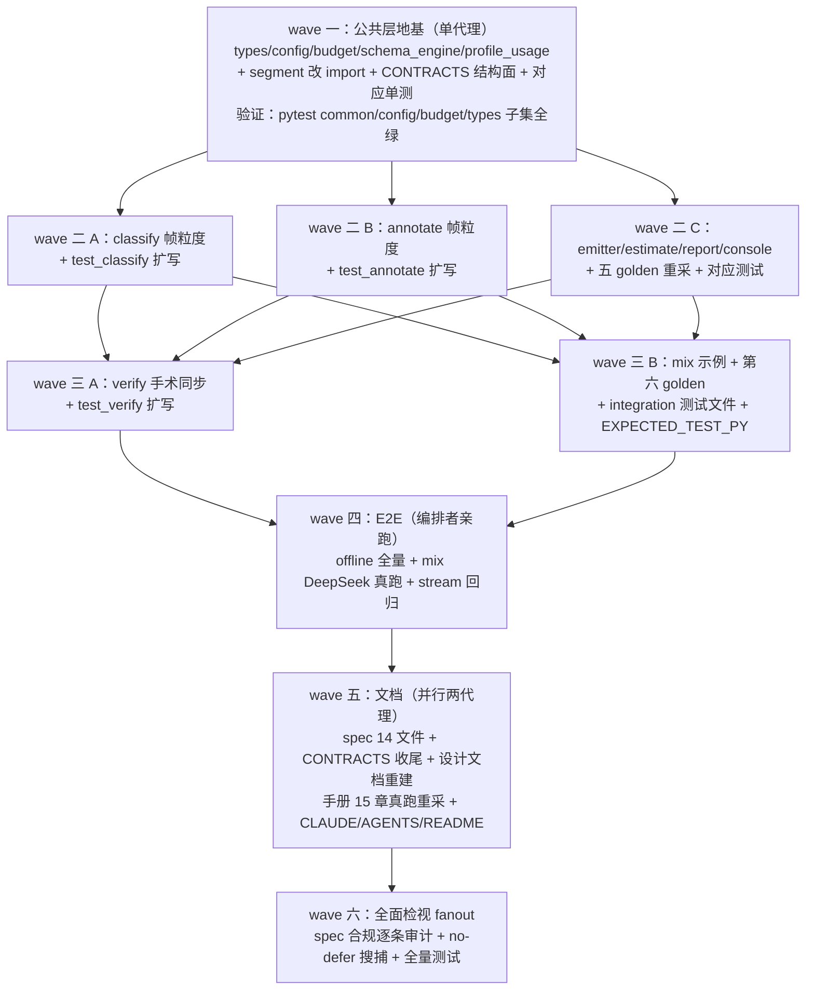

# 特性开发规格：流模式帧级分类与标注（spec v1.12）

> 2026-08-12。上游文档：`docs/dev/PROPOSAL-frame-annotation.md`（问题验证 + 方案论证 + 行业调研）。
> 本文是**最终开发规格**：三方预实现审计（代码可行性/亲和性、修改清单穷尽、对抗性反证）已于 2026-08-12 完成并折入——凡与提案不一致处，**以本文为准**。
> 实现纪律：不允许 defer 任何本文描述的内容；每条规格必须有对应测试用例；观测面与输出面逐字节按本文冻结。

---

## 1. 结论与形态

一句话：流模式下，M13/M5 在处理 episode/thread 序列信封时对其成员帧**顺带**产出帧级闭集分类与帧级标注，产物挂序列信封新字段、随序列行落盘 `_meta.stream.members[]`；成员帧状态机、链序、Stage 契约 ②a/②b/②c、守恒恒等式**零改动**；帧粒度全关时全系统与 v1.11 字节等价（唯 dry-run 估算行与 estimate 键表例外，见「裁决·估算上界与六 golden」）。

```mermaid
flowchart LR
    B[segment<br/>成员→absorbed] --> C[stitch<br/>重绑/救援<br/>先于帧产物] --> D[dedup]
    D --> E[classify 序列级]
    E --> E2["<b>classify 帧粒度</b><br/>批量闭集判决<br/>member_classifications"]
    E2 --> F[extract] --> G[quality<br/>质量门]
    G --> H[annotate 序列级]
    H --> H2["<b>annotate 帧粒度</b><br/>逐成员按类标注<br/>member_annotations"]
    H2 --> I["verify<br/>手术时同步帧产物<br/>（收缩删键/回收补跑）"]
    I --> J["emitter<br/>members[] + 写前帧校验"]
    style E2 fill:#e8f5e9,stroke:#2e7d32
    style H2 fill:#e8f5e9,stroke:#2e7d32
    style I fill:#fff3e0,stroke:#ef6c00
```



DeepSeek 端点实测（2026-08-12，两次真实探针 + E2E）：`https://api.deepseek.com/anthropic` + `deepseek-v4-flash` 文本调用可用；响应默认携带 `thinking` 内容块，M9 anthropic 解析器只收集 `type=="text"` 块（`llm_client.py:454-456`），thinking 被天然跳过，JSON 干净落在 text 块；温度 0 可用、usage 在场。**该路由不支持图像内容块（官方兼容表），故 mix 示例取双 profile 混合接入——UI 主工程的视觉必需阶段走 z.ai glm-5.2，文本判决阶段与文本姊妹工程走 DeepSeek（§3.8，2026-08-12 需求方修订）**；该路由对指定工具强制（`tool_choice type="tool"`，M9 anthropic 结构化输出形态）返回 400 ⇒ mix profile 声明 `supports_structured_output = false` 走文本 + L1 确定性解析路径（E2E-FINDINGS 第 24 条）；密钥经 `.env` 的 `LABELKIT_DEEPSEEK_KEY`（已写入，git-ignored）。

## 2. 设计裁决记录（审计折入；自然语言命名）

| 裁决 | 内容与理由 |
|---|---|
| 裁决·承载形态 | 帧产物 = `PipelineItem` 两个新 dict 字段（按成员 `record.id` 键控，按引用共享语义），成员帧保持 `absorbed`。审计确认状态机/链序/契约零改动可行 |
| 裁决·成员失败不入 rejects（**推翻提案**） | 帧标注不可修复 ⇒ members[] 条目 `status:"failed"` + `annotation:null` + `report.stream.frame_annotate.failed` 计数。**不写 rejects 行、不触发 `--strict`**（spec 明文声明）。理由：emitter 四路由互斥是结构承诺、rejects 句柄私有于 M11、`--strict` 读信封状态计数 `_rejects_lines`（orchestrator 退出码判定点）帧失败不改信封状态、rejects 行键集是有序精确断言闭集 |
| 裁决·帧 Schema 显式路由 | 帧标注调用 `complete_validated(..., schema=cfg.frame_schema)`：L0–L3 四层全在，**无 L2.5、不计 `resolved_at`**（保住 §6.4 恒等式「resolved_at 加总 = 进入 M5 的记录数」）。`ResolvedConfig` 新增 `frame_schema` 解析产物（`user_schema` 的同胞：M1 元校验 + few-shot 干跑）。emitter 写前对每个非 null 帧标注跑 `validate_only(obj, schema=frame_schema)` 兜底，失败翻 `failed` 并计数——非法帧对象永不落盘 |
| 裁决·装箱器下沉 | `segment._pack_windows`（纯函数）下沉为 `budget.pack_windows`，segment 改 import，行为字节等价（既有装箱测试守住）；CONTRACTS §7.17 与 `budget.py` 头注的归属句同步改写。帧级批量判决复用之 |
| 裁决·修复面第四向 | verify 回收成员补跑帧产物：懒加载面从三个扩为四个——新增 `classify.classify_frames`（公开直调面，v1.8 `segment.judge_window` 同款先例）；`annotate.annotate_member` 并入既有 annotate 修复面族。补跑幂等：**只补 dict 中缺位的成员**。收缩成员 ⇒ 从两 dict 删键（不留无主条目） |
| 裁决·扇出共享与首标签执行 | `classify._fan_out` 克隆构造清单显式加入两字段（按引用共享，与 `record`/`dedup` 同族）；帧级两 pass **只在首标签信封上执行**（克隆判据 = `classification.label != classification.labels[0]`，verify S8 同款）。克隆行渲染同一 dict；手术后原/克隆行 members 分叉由既有 `repaired` 位消歧（spec §6.3 补注）。**时序补丁（终审缺陷修复）**：帧标注 pass 在 M5 才运行，扇出前 M13 对将克隆的首标签序列信封把 `member_annotations` 钉为共享空容器 {}（降格信封除外——保持 None=未运行语义）；M5 只补缺位、从不换对象。沉没成本 `discarded` 只取首标签信封视角（克隆终态不重复计共享产物）；verify 收缩从共享 dict 删键会穿透到克隆行呈现（被剔成员在克隆行呈 label null）——接受并记录，与 v1.8 手术后 member_ids 分叉同族 |
| 裁决·组链双门（实现期补充） | factory `build_stages` 与 orchestrator `_compose_chain` 的 classify 槽位**同口径或门** `classify.enabled ∨ frame_classify.enabled`；stage 内序列级判决单独受 `classify.enabled` 门控——仅帧级开启时序列记录不产生 Classification，帧 pass 照常（组链与运行链两层各有测试守护） |
| 裁决·同 id 成员 first-wins（终审缺陷修复） | 成员 id 是内容哈希（ingest D2 已知碰撞面），episode 内字节相同的帧同 id——帧产物 dict 以 id 为键：M13 落表与 M5 逐帧调用均 **first-wins**（首位次胜出、同 id 只调用一次、不重复计数）；同 id 同产物是温度 0 语义下的自然近似，members[] 各位次行渲染同一产物 |
| 裁决·帧类 examples 不渲染（实现期补充） | 帧级批量判决模板无 few-shot 段（与序列级 §10.8 有意不同）——`[[frame.classify.classes]].examples` 解析合法但不渲染，M1 显名 WARN「该键将被忽略」，V13③ 静态预检口径同步不计 examples |
| 裁决·meta_mode 护栏 | `frame.*` 任一启用 ⇒ `output.meta_mode != "none"`（CONFIG_ERROR，文案指明帧产物仅经 `_meta` 承载）。sidecar 合法 |
| 裁决·降格会话跳过 | `segment_degraded` duck 标在场的 episode 跳过两个帧 pass（label=null、status="skipped"、`frame_classify.skipped_degraded` 计数）。理由：降格 = 噪声未剔，对垃圾帧付费反直觉 |
| 裁决·摘要行回填砍掉（**推翻提案倾向**） | v1.12 不做「帧标签回填成员摘要行」：审计确认真实爆炸半径 = quality/annotate/verify/extract 四处渲染点 + CONTRACTS §10 多个逐字节冻结模板，收益不成比例。列 §8.4 演进候选，帧标签仅经 members[] 输出 |
| 裁决·帧级无多标签无自洽采样 | `[frame.classify]` 无 `assignment`（帧单一归属地基），`[frame.annotate]` 无 `self_consistency`（成本 ×n 且投票键取自帧 Schema 需动投票主干）。两键显式书写 ⇒ **定向 CONFIG_ERROR**（v1.11 `use_vision` 的原始节探针同款） |
| 裁决·vision 语义分列 | `frame.classify.llm` **永不**入 vision 必需集：解析产物 `FrameClassifyConfig.vision_resolved` = ui ∧ enabled ∧ profile.supports_vision（segment V1 同款自动推导；成本控制面 = 指向纯文本 profile，判决仅凭摘要行）。`frame.annotate.llm` 在 ui ∧ enabled 时**无条件**入 vision 必需集（镜像序列级 annotate：截图是标注主证据）。两者都登记进 `profile_usage.referenced_profiles`（密钥/探测/预算报表四处引用集） |
| 裁决·计数命名空间 | 计数器/报表前缀 `frame_classify.*` / `frame_annotate.*`，与序列级 `classify.*` 严格分离；帧类名与序列类名互相独立、允许重名、互不约束 |
| 裁决·members 块冻结位 | `_meta.stream` 内 `members` 位于 `member_sources` 之后、`session_split` 之前；条目字段序 `index, id[, label][, annotation, status]`；在场规则与闭集见 §3.6 |
| 裁决·估算上界与六 golden | `estimate_run` 新增 `frame_classify_calls` / `frame_annotate_calls`（**粗上界 = 预扫描帧总数**，数据源与 `segment_calls` 完全同源；对应开关关闭 ⇒ 0），`total_calls` 扩项；dry-run 估算行是**改第 2 行**（非加行），五个既有 golden 重采 + mix 第六 golden；console 段棋盘分母折入（classify 分母 = `classify_calls + frame_classify_calls`，annotate 同理），`_ESTIMATE_CALL_KEYS` 加两键，面板无新行 |
| 裁决·trace 载荷纪律 | `classify.frame`（每 episode 一发，ids=(episode_id,)）payload = `members`/`windows`/`fallback` 计数；`annotate.frame`（每成员一发，ids=(episode_id,)）payload = `member_id`/`status`/`attempts`，标注内容仅经既有 `excerpt` 键（excerpt/full 档 200 字截断）。**不新增任何承载数据内容的 payload 键**（`none` 档预脱敏载荷直通 console 面板的红线） |
| 裁决·链位与成本 | 帧分类住 M13（dedup 之后：重复不付费；quality 之前的少量批量调用可接受）；帧标注（逐帧、贵）住 M5——**quality 质量门之后**，被淘汰记录永不付帧标注费。spec 明文这个成本结构 |
| 裁决·沉没成本记账 | emitter 对终态非 active 且携带 `member_annotations` 的序列信封，按条目数累计 `report.stream.frame_annotate.discarded`（已产出未交付，counts-only） |
| 裁决·mix 示例独立成套（2026-08-12 需求方修订：UI 主工程） | `examples/mix/` 自带 `config.toml`（双 profile：DeepSeek 文本判决面 + z.ai 视觉必需面）+ UI 主工程 `project.toml`（截图+控件树，PIL 确定性 fixtures）+ 文本姊妹 `project-text.toml`（纯 DeepSeek 最低成本形态）；**主工程必为 UI 控件树数据、禁纯文本单独成例**（需求原文），「混合数据」= 主/姊妹双工程；偏离「共享 ../config.toml」惯例的理由（独立上手、端点隔离）写进文件头注（§3.8） |

## 3. 规格正文

### 3.1 配置面（spec §5.2 增量 + §2.3.1 约束）

```toml
[frame.classify]                  # 帧级闭集分类（默认关；仅流模式）
enabled = true
llm = "default"                   # 缺省 "default"
fallback_class = "other"          # 必须 ∈ 类表；修复穷尽/窗口失败的兜底

[[frame.classify.classes]]        # 与 [[classify.classes]] 同构；name 匹配 [a-z0-9_]+
name = "task_request"
description = "发起一项新任务的请求"

[frame.annotate]                  # 帧级标注（默认关；仅流模式）
enabled = true
llm = "default"
instruction = "……"                # 全局帧标注指令（必填 when enabled）
schema_inline = """…"""           # 帧级输出 JSON Schema；schema_path/schema_inline 恰一
# examples = [...]                # 可选 few-shot，形态镜像 annotate.examples，M1 干跑校验

[frame.class.task_request.annotate]  # 按帧类覆盖：instruction / examples / enabled 三键白名单
instruction = "……"

[frame.class.chitchat.annotate]
enabled = false                   # 该类成员跳过标注（省成本面）
```

M1 组合约束（全部 CONFIG_ERROR，写进 §2.3.1 与 §3.1.4）：

| 约束 | 内容 |
|---|---|
| 帧粒度要求流模式 | `frame.classify.enabled ∨ frame.annotate.enabled` ⇒ `segment.enabled = true`；报错文案指引「非流模式请用 classify + [class.<name>.annotate]」 |
| 帧类覆盖要求帧分类 | `[frame.class.*]` 在场 ⇒ `frame.classify.enabled = true`；节名 ⊆ 帧类表；白名单外键/节 ⇒ CONFIG_ERROR |
| 帧 Schema 恰一 | `frame.annotate.enabled` ⇒ `schema_path`/`schema_inline` 恰一 + draft 2020-12 元校验 + examples 干跑（镜像 output.schema 全套分支） |
| meta_mode 护栏 | `frame.*` 任一启用 ⇒ `output.meta_mode != "none"` |
| fallback 合法 | `frame.classify.fallback_class` ∈ 帧类表 name 集 |
| 定向探针 | `[frame.classify].assignment`、`[frame.annotate].self_consistency` 显式书写 ⇒ 定向 CONFIG_ERROR（原始节探针，v1.11 `use_vision` 同款机制与文案风格） |
| no-op 提示 | `[frame.*]` 节在场 ∧ 均未启用 ∧ `segment.enabled = false` ⇒ R8 家族 WARN（节被忽略）；`[[frame.classify.classes]].examples` 在场 ⇒ 显名 WARN「帧级批量判决模板不渲染类别示例」（实现期补充裁决——批量判决形态无 few-shot 段，与序列级有意不同；V13③ 静态预检口径同步不计 examples） |

解析产物：`FrameClassifyConfig`（含 `vision_resolved`）、`FrameAnnotateConfig`、`frame_class_views: Mapping[str, FrameClassView]`（仅 annotate 一节：instruction/examples/enabled）、`ResolvedConfig.frame_schema: Mapping | None`。`referenced_profiles` 登记两个新 llm 键；vision 必需集**只**登记 `frame.annotate.llm`（ui ∧ enabled）。启动期静态预算预检表（`loader.py` V13③）新增 `frame_classify` / `frame_annotate` 两段（头常量 + instruction/类表/Schema 静态部件）。

### 3.2 M13 classify：帧级批量判决

- **执行门**：`status=="active"` ∧ `record.kind=="sequence"` ∧ 首标签信封（非克隆） ∧ 非降格（无 `segment_degraded` duck 标） ∧ 幂等门 `item.member_classifications is None`。
- **组链双门**（实现期补充裁决）：factory 以或门 `classify.enabled ∨ frame_classify.enabled` 决定 ClassifyStage 进链（槽位不变）；stage 内序列级判决单独受 `classify.enabled` 门控——仅帧级开启时序列记录不产生 Classification，帧 pass 照常。
- **调用形态**：一 episode 一调用；预算声明时按 `budget.pack_windows`（下沉后的同一纯函数）对成员摘要行成本贪心分窗（窗口重叠语义**不适用**——帧分类窗口是不重叠切分，实现为 `pack_windows` 的零重叠调用形；预算关 ⇒ 单窗全成员）。
- **提示词**（确定性模板，镜像 classify.py house 风格；实现后 verbatim 捕进 CONTRACTS §10.12）：`[任务]` 逐帧闭集分类指令 + 类别表行 `name: description` + 输出契约；`[会话成员帧]` 1-based 摘要行（`frame_digest`，上限 `segment.digest_max_chars` 每行、窗口总量受预算 fit）；`vision_resolved` 时每成员追加 `[成员 i 截图]` 标签 + image part（工作点 = profile `default_image_px`，不另设尺寸——校准器按 profile 聚合的前提）。
- **内部 Schema**：`schema_engine.frame_classify_schema(names, n)` = `{"labels": {"type":"array","items":{"enum":[...]},"minItems":n,"maxItems":n}}` + `additionalProperties:false`（`segment_window_schema` 同款先例）；代码侧长度/索引对齐后校验（first-wins，缺项 ⇒ 该帧 fallback_class）。
- **失败语义**：单窗修复穷尽或调用不可恢复 ⇒ 该窗全部成员 `fallback_class`，`frame_classify.fallback += N`、`frame_classify.window_failures += 1`；**永不**使 episode 信封 failed（v1.7 fallback 哲学下推）。溢出：precheck 最小单元不喂熔断；反应式溢出 ⇒ 窗口对半重试 ≤2（segment V20 同款），仍溢出按窗失败兜底。
- **产物**：`item.member_classifications = {member_id: Classification(label=..., labels=(label,), source="llm"|"fallback")}`。
- **事件**：`classify.frame`（每 episode，payload = members/windows/fallback 计数）。计数器：`frame_classify.calls`/`fallback`/`window_failures`/`skipped_degraded`。
- **修复面**：`classify_frames(members, ctx)` 为公开直调面（verify 懒加载第四向）；单成员回收补跑即单元素调用。

### 3.3 M5 annotate：帧级逐帧标注

- **执行门**：序列级标注完成后，同一执行门（active ∧ sequence ∧ 首标签 ∧ 非降格），逐成员：`member_annotations` 缺位该成员才调用（幂等）；按成员的帧类查 `frame_class_views`，`enabled=false` ⇒ status="skipped"；`frame.classify` 关闭 ⇒ 全员用全局 instruction。
- **调用形态**：每成员一次 `annotate_member(member, ctx, label=帧类|None)`（公开直调面，修复面族成员）；prompt = `[任务]`（类覆盖或全局 instruction + few-shot）+ `[成员帧]` 摘要（text 模态 = 行文本；ui 模态 = `[屏幕截图]` + image part + `[UI 控件树]` 摘要，单记录 ui 标注三段形同款）+ 帧 Schema 文本嵌入（镜像 annotate 的 schema_text 嵌入手法）。
- **Schema 路由**：`complete_validated(frame.annotate.llm, prompt, schema=cfg.frame_schema, ...)`——L0–L3、无 L2.5、不计 resolved_at。
- **失败语义**：修复穷尽/不可恢复 ⇒ 该成员 status="failed"、annotation=null、`frame_annotate.failed += 1`、`item.errors` **不写**（成员失败非信封失败）；episode 照常发射。溢出：precheck 最小单元跳过（failed）不喂熔断；帧 prompt 极小，无降级梯（spec 明文「无降级梯」的理由：最小单元）。
- **产物**：`item.member_annotations = {member_id: Annotation(output=..., model=..., attempts=...)}`；skipped 成员不占键（emitter 按缺键 + 类表推导 status）。**实现注**：skipped/failed 的区分由 emitter 侧重算会引入两处真相，故统一：M5 直接维护一个并行 `member_annotate_status: dict[str, str]`？——**不**。裁决：`member_annotations` 值允许 `None`（failed 占键为 None；skipped 不占键）；emitter 规则见 §3.6，单一真相 = dict 形态本身。
- **事件**：`annotate.frame`（每成员，payload = member_id/status/attempts[, excerpt]）。计数器：`frame_annotate.annotated`/`skipped`/`failed`。
- 序列级 `annotate_record`/`build_annotate_prompt` 冻结签名**零改动**。

### 3.4 M7 verify：手术同步

`_rebuild_episode` 之后、重标注之前挂接（stream driver 阶段 e→f 之间）：

- 收缩：对被剔成员从两 dict 删键（含 None 值键）。
- 回收：对新成员且键缺位者，懒加载补跑——`classify.classify_frames([member], ctx)`（frame.classify 开启时）→ `annotate.annotate_member(member, ctx, label)`（frame.annotate 开启且该类未跳过）。失败落 fallback/None，同 §3.2/§3.3 语义；并发形态与记录级隔离镜像 `_reseam_episodes`。
- 克隆信封永不手术（既有 S8），无同步分支。
- CONTRACTS §1.1 算子间导入白名单 3→4（`classify.classify_frames`），§7.6 修复五步扩注帧产物同步。

### 3.5 M8 schema-engine

新增模块级构造器 `frame_classify_schema(names: Sequence[str], n: int)`（§3.2 形态）。`complete_validated` 与 `validate_only` 的显式 schema 参数路径**零改动**（既有能力，spec §3.8.2 补一段「帧级两类调用的路由声明」：内部 Schema 待遇、不入 resolved_at、不触发 L2.5）。

### 3.6 M11 emitter：members 块与写前校验

`_stream_block` 在 `member_sources` 后插入（任一帧开关开启时在场）：

```json
"members": [
  {"index": 0, "id": "873a…", "label": "task_request",
   "annotation": {"intent": "book_train", "entities": ["上海", "明天"]}, "status": "annotated"},
  {"index": 1, "id": "98a8…", "label": "chitchat", "annotation": null, "status": "skipped"},
  {"index": 2, "id": "c51c…", "label": "task_request", "annotation": null, "status": "failed"}
]
```

- 逐成员按 `rec.members` 序；`index` 0 基。`label` 键仅 `frame.classify.enabled` 时在场（降格跳过 ⇒ null）；`annotation`/`status` 两键仅 `frame.annotate.enabled` 时在场。
- `status` 闭集 = `"annotated" | "skipped" | "failed"`：dict 缺键 ⇒ skipped；值 None ⇒ failed；对象 ⇒ 写前 `validate_only(obj, schema=frame_schema)`，通过 ⇒ annotated，不通过 ⇒ failed + annotation 置 null + `frame_annotate.failed += 1`（写前兜底，非法帧对象零落盘）。
- 终态非 active 序列信封携带 `member_annotations` ⇒ `frame_annotate.discarded += 非空条目数`（仅计数，不落盘）。
- rejects 面**零改动**（键集维持五/六键闭集）。`_meta` 顶层键序、四路由互斥、守恒恒等式零改动；两处有序精确断言测试同步 `members` 位置。

### 3.7 观测、估算与预算（M12 / M10 / budget）

| 面 | 增量 |
|---|---|
| trace | 事件 `classify.frame` / `annotate.frame`（§7.2 目录两行；前缀自动路由既有通道，通道枚举维持 11 值）；payload 纪律见裁决表；§7.6 **零新错误 kind**（帧失败复用 `schema_violation` 等既有 kind，spec 明写此结论） |
| report | `report.stream` 增 `frame_classify` 子块（位于 `stitch` 后、`extract` 前）与 `frame_annotate` 子块（`extract` 后、`verify` 前），**条件在场**（对应开关开启才出现；两处精确集合断言测试同步）。键：`frame_classify = {calls, fallback, window_failures, skipped_degraded}`；`frame_annotate = {annotated, skipped, failed, discarded}`。`report.budget` 经 profile 聚合自动覆盖（引用集登记即生效） |
| estimate_run | `frame_classify_calls` / `frame_annotate_calls`（上界 = 预扫描帧总数，与 `segment_calls` 同数据源；开关关 ⇒ 0）；`total_calls` 扩项；返回键表冻结注释同步 |
| dry-run | 估算行（第 2 行）按键序插入两键，**无条件打印**（非流工程恒 0，v1.9 `stitch_calls` 先例）；五 golden 重采 + `dryrun-mix.txt` 第六 golden + 参数化列表加行 |
| console | `_ESTIMATE_CALL_KEYS` 加两键（rich 估算表等价性）；`_STAGE_CALL_KEYS` 改为可多键求和的分母映射：classify ↦ classify_calls+frame_classify_calls，annotate ↦ annotate_calls+frame_annotate_calls；面板零新行 |
| budget | `TEMPLATE_HEAD_TOKENS` 增 `"frame_classify"` / `"frame_annotate"`（闭集断言测试与跨层等式测试同步）；`pack_windows` 下沉（归属句改写）；帧调用图像工作点恒 = profile 工作点 |

### 3.8 mix 示例（examples/mix，用户上手演示；2026-08-12 需求方修订：**UI 控件树数据为主工程，禁纯文本示例**）

设计约束的对撞与解：需求方要求示例使用 UI 控件树数据（或混合数据）且以 DeepSeek 端点做 E2E 接入，而该路由不支持图像内容块（E2E-FINDINGS 第 23 条）——解 = **双 profile 混合接入**，恰为 v1.12 vision 语义分列裁决的教学形态：文本判决阶段走 DeepSeek（segment 滑窗摘要判决、帧级批量分类 digest-only、stream 模式 quality 纯文本打分——S30 放宽），视觉必需阶段走 z.ai glm-5.2（classify/annotate/frame.annotate/verify 四阶段在 UI 模态强制 supports_vision）。

| 文件 | 内容 |
|---|---|
| `examples/mix/config.toml` | 双 profile：`[llm.default]` = DeepSeek（provider="anthropic"、base_url="https://api.deepseek.com/anthropic"、model="deepseek-v4-flash"、api_key_env="LABELKIT_DEEPSEEK_KEY"、supports_vision=false、supports_structured_output=false（tool_choice 400 实测）、context_window=131072 保守声明、注释记录 thinking 块被 M9 过滤）；`[llm.vision]` = z.ai glm-5.2（base_url="https://api.z.ai/api/anthropic"、api_key_env="LABELKIT_ZAI_KEY"、supports_vision=true、镜像 examples/config.toml 取值哲学）。头注写明双端点分工与「独立成套」偏离共享惯例的理由 |
| `examples/mix/project.toml`（主工程，UI 模态） | 截图+控件树帧对时间序流（`[stream]` source_dir 分区，镜像 examples/stream）：segment(llm="default"——DeepSeek 摘要判决，vision_resolved=false 成本控制面) → dedup(pHash/树) → classify（序列级，llm="vision"，首帧截图入提示词）→ **`[frame.classify]`**（llm="default"——digest-only 帧级批量判决，UI 屏幕类表如 form_screen/list_screen/confirm_screen/transition/other）→ quality（pointwise, default:trajectory, llm="default"——stream 模式纯文本打分）→ annotate（序列级 {task_label, app, summary}，llm="vision"）→ **`[frame.annotate]`**（llm="vision"，帧 Schema 如 {screen_role, key_widgets}，`[frame.class.form_screen.annotate]` 覆盖指令 + `[frame.class.transition.annotate].enabled=false` 跳过示范）→ verify(repair, llm="vision")。extract/stitch 关（头注注明：上手示例聚焦双粒度，动作摘取与线索缝合见 examples/stream） |
| `examples/mix/data/`（PIL 确定性生成） | `tools/gen_fixtures.py`（镜像 examples/stream 同名工具：无随机无时间戳、树是唯一语义源）生成 17 帧对（as-built：6+5+6）、3 会话子目录：会话一 外卖下单流程（含 1 过渡屏——帧类 transition 跳过标注示范）；会话二 订酒店流程（含 1 无关插入屏——噪声候选）；会话三 = 会话一 verbatim 复刻（episode 级判重演示落 dropped_dup） |
| `examples/mix/project-text.toml`（姊妹工程，文本流） | 即原纯文本双粒度工程（帧类 task_request/followup/chitchat/other + {intent, entities} 帧 Schema），输入改 `data-text/events.jsonl`、输出 mix-text-labels.jsonl；定位 = 单端点（纯 DeepSeek）最低成本上手形态与文本帧路径演示（examples/stream 双工程同款姊妹惯例）。「混合数据」由主/姊妹两工程共同构成——主工程必为 UI |
| goldens | `dryrun-mix.txt` 重采为 UI 主工程 + 新增 `dryrun-mix-text.txt`（姊妹）——七个 golden（stream 双工程双 golden 同款惯例），「六个 golden」措辞全量改「七个」 |
| E2E 命令 | `cd examples/mix && mkdir -p out && uv run labelkit run --config config.toml --project project.toml`（UI 主工程，双端点）；`uv run labelkit run --config config.toml --project project-text.toml`（文本姊妹，纯 DeepSeek） |

### 3.9 测试与验收

- **既有必红且须同步**（穷尽清单）：五 dry-run golden 与 `test_console.py` 参数化；`test_budget.py` 头常量闭集与跨层等式；`test_emitter.py` `_meta.stream` 有序键断言两处；`test_orchestrator.py` estimate 冻结键/`report["stream"]` 精确集合两处/dry-run stderr 三处逐字断言；`test_config.py` 默认值全量断言；`test_types.py` PipelineItem 默认值；`test_cli.py` `EXPECTED_TEST_PY` 冻结集合（新增 integration 文件时）。
- **新增覆盖**（offline）：配置七条约束逐条正反例；帧 Schema 元校验/干跑；批量判决 prompt 装配与对齐后校验（缺项 fallback）；分窗（预算开/关）；扇出共享与首标签门；降格跳过；annotate 逐帧门/类跳过/失败隔离/幂等；verify 收缩删键/回收补跑幂等；emitter members 形态/在场规则/status 三值/写前校验兜底/discarded；estimate 公式与 golden；console 两映射；profile_usage 两键与 vision 集分列；定向探针两键。
- **integration**（z.ai glm-5.2，`tests/integration/test_frame_llm.py`）：文本流帧分类批量判决真实可靠性 + 帧标注真实产出走四层；UI 帧标注单帧带图冒烟（examples/ui fixture 复用）。
- **E2E 验收**：mix 示例 DeepSeek 真跑退出码 0、members 块结构合规、report 两子块在场且自洽；examples/stream 双工程回归（行为与 v1.11 等价——帧粒度未启用）；`uv run pytest -q -m 'not integration'` 全绿。

## 4. 文件修改清单（实现工序按此穷尽核销）

- **labelkit/**（15 改，as-built）：`common/contracts/types.py`、`common/config/model.py`、`common/config/loader.py`、`common/runtime/budget.py`、`common/runtime/schema_engine.py`、`common/observability/obslog.py`（§7.2 事件目录两常量登记）、`operators/classify.py`、`operators/annotate.py`、`operators/verify.py`、`operators/emitter.py`、`operators/segment.py`（仅 pack_windows 改 import）、`orchestration/orchestrator.py`（含 `_compose_chain` 或门）、`orchestration/profile_usage.py`、`orchestration/factory.py`（组链或门）、`cli/console.py`。`errors.py`/`console_format.py`/`runtime.py`/`stage.py`/`llm_client.py`/CLI 其余 **零改动**。
- **tests/**（9 改 + 1 新）：`operators/test_classify.py`、`operators/test_annotate.py`、`operators/test_verify.py`、`operators/test_emitter.py`、`common/config/test_config.py`、`common/contracts/test_types.py`、`common/runtime/test_budget.py`、`orchestration/test_orchestrator.py`、`cli/test_console.py`、`cli/test_cli.py`（EXPECTED_TEST_PY）+ 新 `integration/test_frame_llm.py`；goldens 五改一新。
- **spec/**（16 改，无新文件 ⇒ build_design_doc 脚本零改动但须重建 html/pdf）：`00-frontmatter`（版本/修订史行）、`10-ch1` §1.6 决策日志、`20-ch2` §2.2.1/§2.3.1、`301-m1` §3.1.3/§3.1.4、`305-m5`、`307-m7`、`308-m8` §3.8.2、`310-m10` §3.10.3、`311-m11`、`312-m12` §3.12.4、`313-m13`、`40-ch4`（PipelineItem）、`50-ch5`（键表/白名单/示例）、`60-ch6`（members 块/report/rejects 零改动声明/resolved_at 理由）、`70-ch7`（事件目录/脱敏/零新 kind 声明/console 分母）、`80-ch8`（Schema 唯一性按粒度改写 + 演进候选三项）。
- **docs/**：`CONTRACTS.md`（§1.1 白名单 3→4、§3 字段注、§6.1/§6.3、§7.4/§7.6/§7.9/§7.13/§7.17、§8.1 事件表、§9.1 members + 退化锚句、§9.3、§10.12/§10.13 verbatim、§12 登记）；`docs/manual/` 15 章面（01/03/04/07/08/11/13/14/15/16/17/18/24/25/26 + cheatsheet A.8/A.12 + README 目录；真跑重采样惯例执行）；`docs/dev/E2E-FINDINGS.md`（DeepSeek thinking 块/文本 only 两条 + E2E 新发现）；`docs/dev/PROPOSAL-frame-annotation.md`（状态行改「已实现，以本文/SPEC 为准」）。
- **根**：`CLAUDE.md`/`AGENTS.md`（字节一致四处：修订状态行、示例命令段、What-is 链述、v1.12 长条目 + 「五个 golden」措辞全改「六个」+ DeepSeek 端点与密钥说明）；`README.md` 示例段；`examples/mix/*` 三文件新增；`.env`（已写入，不入库）；pyproject **零改动**。

## 5. 实施工序（wave 制；每 wave 定义可失败的验证）



## 6. 非目标（v1.12 明确不做）

帧级 quality/dedup/verify/generate；帧多标签与帧级扇出；帧级 L2.5 回调（演进候选 `frame.annotate.validator`）；帧级 self_consistency；摘要行帧标签回填（演进候选，爆炸半径已勘明）；同内容帧标注备忘录（演进候选）；按序列类分叉的帧类表。

## 7. 引用

Label Studio 同配置双粒度模板（TimelineLabels + Choices）；GUIOdyssey / WildGUI / GUI-360° 的 episode+step 双级语义标注结构；AndroidControl 两级结构（PROPOSAL-stream-segmentation 已引）；DeepSeek Anthropic API 兼容文档（base_url/字段支持表/图像块不支持/模型名映射，2026-08-12 检索）；本仓库 v1.7 R4 fallback 留痕、v1.8 ②b 契约与 judge_window 面、v1.9 S8/T6/T16、v1.11 V1/V13/V20/V21/V26/V27 先例。
