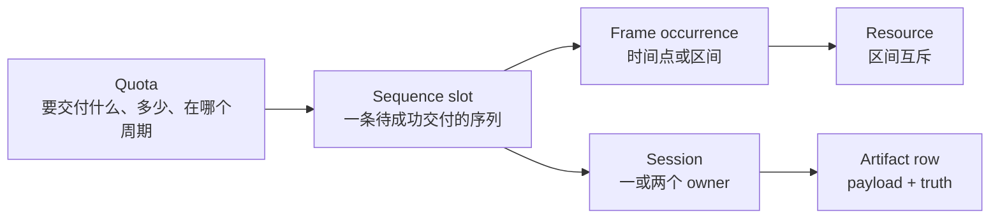
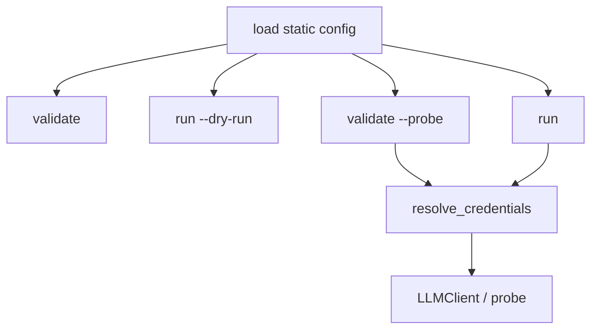
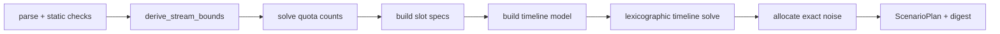
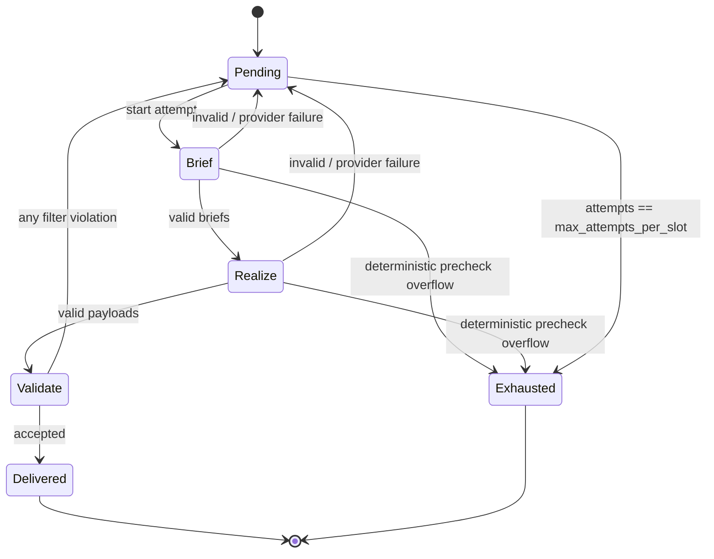
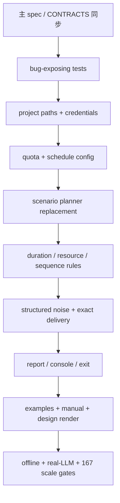

# LabelKit v1.17 场景规划与精确交付开发规格

> 状态：**superseded（v1.17 Wave 8 已收口）**。
>
> 本文是 v1.17 实现前的冻结开发规格，保留历史边界与验收裁决；当前行为真值以 `spec/*.md`、
> `docs/CONTRACTS.md` 与已 shipped 的 v1.17 代码为准。本文中的“待同步主规格”“待实现”等措辞
> 仅描述历史阶段，不是当前仓库状态。

## 1. 目标与边界

### 1.1 必须达到

- 零交叉场景不构造任何 crossing pair 或 alternation 变量；167 条序列规模可以完成静态规划。
- planner capacity、planner infeasible 与 planner budget 是三个不同错误面，capacity 绝不显示为
  INFEASIBLE。
- 有限 schedule 是时间规划硬边界；一天配置只能生成这一天内的 occurrence。
- validate、dry-run、estimate 与 M6 使用同一份冻结 `ScenarioPlan`，不重复规划、不漂移目标。
- project TOML 内的相对路径不受调用 cwd 影响；本地 hook 与工程一起移动仍可运行。
- 无 `--probe` 的 validate 与 dry-run 不读取 API key value。
- dry-run 的估算完整写入 report，且与 console 使用同一个对象。
- quota 表达成功交付数量；sequence 与 structured noise 都在有限预算内补足。
- 支持日、周、整个 schedule 的整数 quota，并明确 exact 与 largest remainder 两种分配。
- 支持跨 sequence class 的先后、响应、双向先后与同周期互斥。
- 支持 frame duration、严格包含关系与跨序列 resource no-overlap。
- 结构化 noise 复用 frame class 的 instruction 与 JSON Schema，truth 保留其 frame class。

### 1.2 明确不做

- 不保留 v1.16 time-stream 配置兼容层，不写 migration，不接受旧键别名。
- 不实现完整 iCalendar RRULE、IANA timezone 或 daylight saving time；只支持带固定 offset 的
  day、ISO week 与 schedule。
- 不把重叠 quota 相加成额外 occurrence 或 target；多张 quota 是同一批 occurrence 上的同时约束。
- 不增加超过两个 owner 的 crossed session。
- 不把 LLM content、checkpoint 或 retry 状态写入磁盘；跨运行不续跑。
- 不让模型自动推断 resource 名或语义冲突；resource 由配置声明，内容语义由 hook 判定。
- 不改变 process 模式的生成配额语义；本规格的 exact delivery 只作用于 time-stream generate-only。
- time-stream 形态不再接受 `--limit`（M1 定向 CONFIG_ERROR，exit 2）。quota 是整体契约，截断后的前缀不再声称满足 quota。

## 2. 统一心智模型



| 名称 | 唯一语义 |
|---|---|
| schedule | 所有 primary 与 noise occurrence 必须落入的固定 offset 半开时间区间 |
| quota | 成功交付 sequence occurrence 的周期性数量要求 |
| sequence slot | quota 编译后的一条稳定交付槽位；content 失败只重试该槽位，不重排时间 |
| frame occurrence | sequence slot 内的一帧；可以是时间点，也可以有 duration |
| session | replay 会话；一个 primary owner，至多一个 secondary owner |
| crossed session | 同时有 primary 与 secondary owner，且 task frame 满足真实 A-B-A 或 B-A-B 交错 |
| noise occurrence | 不属于 sequence 的 point frame；仍有 frame class 与可选结构化 payload |
| delivery attempt | 为同一 slot 重新执行 brief + realization + validators 的一次有界尝试 |
| resource | duration frame 声明占用的互斥资源名，例如 `audio_focus` |

“attempt”不再出现在 project 配额语义里，只保留为运行时交付尝试计数。配置与报告使用
`target`、`delivered`、`attempts` 三个不同字段，禁止混称。

## 3. E2E 处置矩阵

| Finding | 设计裁决 | 验收证据 |
|---:|---|---|
| 42 | owner slot permutation；session 不再展开全部 sequence frame | 167 sequence / 180 task frame 模型低于 capacity，validate 完成 |
| 43 | `crossed_sessions = 0` 时 crossing builder 不调用 | crossing family 的 variables/constraints 均为 0 |
| 44 | 独立 capacity exception + family stats | 错误含 actual/limit/dominant family，绝无 INFEASIBLE |
| 45 | 有限 schedule + shared lexicographic objective | 九条半日序列只落在声明日期，跨度为 1 日 |
| 46 | M1 生成唯一 `ScenarioPlan`，M6 只消费 | validate/dry-run/run 的 plan digest 相同 |
| 47 | `path.py:function` 相对 project root，`spec_from_file_location` | 从任意 cwd 运行外部工程 hook 成功 |
| 48 | 删除 `sessions`，只声明 `crossed_sessions`；按实际 slot 容量建模 | 零交叉时只要求单序列真实长度与 noise reserve |
| 49 | 一个纯函数收集派生 bounds；一次聚合输出 | length、span、gap 关联错误同轮出现 |
| 50 | 静态配置与 `RuntimeCredentials` 分离 | 无 key 的 validate/dry-run 成功，probe/run 失败关闭 |
| 51 | dry-run `report.estimate` 直接引用 estimate 对象 | console 与 JSON 逐键相等 |
| 52 | TOML 路径相对 project root；所有 effective path 绝对化并回显 | 不同 cwd 产生同一绝对输出位置 |
| 53 | 必填 schedule.start/end，删除隐式 horizon | 单日、多日、边界外 occurrence 测试 |
| 54 | noise table 引用 frame class generate face | string/object noise 均可生成，truth 可辨 |
| 55 | day/week/schedule quota | 工作日与每周行为无需手工展开日期 |
| 56 | exact cohort 与 largest remainder deviation | 不整除时给 minimum cohort 与上下邻近值 |
| 57 | sequence rules + incremental scenario validator | precedence/gap/not-coexistence/semantic exclusion |
| 58 | frame duration + `contains` | App interval 严格包含 screen/clipboard occurrence |
| 59 | duration frame resources + `AddNoOverlap` | 全局 `audio_focus` interval 零重叠 |
| 60 | stable slot + `max_attempts_per_slot` | 首次失败后补足；预算耗尽 exit 1 且报告 partial |

## 4. 破坏性配置修订

### 4.1 删除键

以下键在 v1.17 为定向 `CONFIG_ERROR`，错误只告诉用户新的唯一表达，不读取旧值、不转换：

| 删除键 | 新表达 |
|---|---|
| `[generate].sequences` | `[[generate.stream.quotas]]` |
| `[class.<name>.generate].sequences` | `[[generate.stream.quotas]]` |
| `[generate.stream].sessions` | `[generate.stream].crossed_sessions`；总 session 自动推导 |
| `[generate.stream].ts_start` | `[generate.stream.schedule].start/end` |
| `[generate.stream].noise_instruction` | `[[generate.stream.noise]]` |
| `[[generate.stream.rules]]` | `[[generate.stream.frame_rules]]` |
| `[[generate.stream.windows]]` | `[[generate.stream.frame_windows]]` |
| `[[class.<name>.generate.rules]]` | `[[class.<name>.generate.frame_rules]]` |
| `[[class.<name>.generate.windows]]` | `[[class.<name>.generate.frame_windows]]` |
| hook 的 `module:function` 引用 | `path.py:function` |

### 4.2 `[generate.stream]`

| 字段 | 类型 | 默认 | 约束与语义 |
|---|---|---:|---|
| `enabled` | bool | false | 沿用 time-stream 形态门 |
| `crossed_sessions` | int | 0 | `0 ≤ value ≤ floor(target_sequences / 2)`；session 数恒为 `target_sequences - value` |
| `noise_ratio` | float | 0.0 | `[0,1)`；target noise = `round(ratio × planned_task_frames)`（round = ROUND_HALF_EVEN，见 §7.6），现在是精确交付目标 |
| `duplicates` | int | 0 | `0 ≤ value ≤ target_sequences`；流尾原样重发，source 与时间布局在 planner 前冻结，不消耗 LLM |
| `frame_gap_s` | `[number, number]` | `[5,60]` | 起点间隔闭区间；微秒量化规则沿用 v1.16 |
| `max_attempts_per_slot` | int | 3 | `≥ 1`；每个 sequence slot 与 noise slot 的独立交付预算。载体为 `GenerateStreamConfig.max_attempts_per_slot`，仅 M6 delivery 消费，不进入 `ScenarioConfig` |

`crossed_sessions` 取代反向的 `sessions`。当 target 为 `N`、crossed 为 `D` 时：

```text
primary sessions = N - D
single-owner sessions = N - 2D
crossed sessions = D
```

这里的公式是配置语义，不是 report 推测。duplicates 另增流尾 session，不参与上述计数。

### 4.3 有限 schedule

```toml
[generate.stream.schedule]
start = "2026-01-05T14:00:00+08:00"
end = "2026-01-08T00:00:00+08:00"
exclude_dates = ["2026-01-07"]
```

| 字段 | 类型 | 默认 | 约束与语义 |
|---|---|---|---|
| `start` | ISO-8601 datetime | 必填 | 必须显式带 `Z` 或 numeric offset |
| `end` | ISO-8601 datetime | 必填 | 与 start 使用相同 offset，且 `end > start` |
| `exclude_dates` | local date array | `[]` | 排除 schedule 内对应本地自然日；重复值报错；落在 schedule 本地日范围之外的条目是定向 CONFIG_ERROR（fail-fast，不静默忽略） |

schedule 是半开区间 `[start, end)`。所有 point timestamp 满足 `start ≤ ts < end`；所有 interval
满足 `start ≤ interval.start < interval.end ≤ end`。排除日上不能放 primary、noise 或 duplicate。
具体语义是 point start 不得落在排除日，duration interval 不得与排除日的本地日界区间相交；sequence
若跨午夜，其后续 frame 仍逐帧执行该规则。

删除 `_horizon` 的每 session 一周递推。frame window 只枚举 schedule 内、未排除的 local date；
没有第二个隐式时间上界。

### 4.4 成功交付 quota

每张 quota 表必须有自然名称。quota 中的 class 必须存在于 `classify.classes`。多张 quota 可以引用
同一个 sequence class：它们约束同一批 occurrence，不相加、不覆盖。一个 occurrence 的 local date
同时落入多张表的 bucket 时，可以同时满足这些表。未被任何 quota 提及的 sequence class target 为 0；
noise-only frame class 不需要 quota。

quota 有两种互斥形态。

#### Exact counts

```toml
[[generate.stream.quotas]]
name = "weekday_coverage"
period = "day"
of_week = ["mon", "tue", "wed", "thu", "fri"]
counts = { mail = 1, calendar = 1, commute = 1, food_delivery = 1 }
```

#### Integer weights

```toml
[[generate.stream.quotas]]
name = "three_week_irregular_mix"
period = "schedule"
total = 20
weights = { shopping = 60, entertainment = 25, fitness = 15 }
allocation = "exact"
```

| 字段 | 适用形态 | 约束与语义 |
|---|---|---|
| `name` | 两者 | `[a-z0-9_]+`，全表唯一；错误、assumption 与 report 都用该名称 |
| `period` | 两者 | `day`、`week`、`schedule` |
| `of_week` | 两者 | period bucket 内允许计数的 weekday；缺省为周一至周日 |
| `counts` | counts | 非空 `{sequence_class = integer ≥ 0}`；与 total/weights/allocation 互斥 |
| `total` | weights | integer ≥ 1；每个 period bucket 的总交付数 |
| `weights` | weights | 至少两个 class，正整数；与 counts 互斥 |
| `allocation` | weights | `exact` 或 `largest_remainder`，必填 |

period 展开规则：

- `day`：对 schedule 相交且未排除、`of_week` 命中的每个 local date 各应用一次。
- `week`：对 schedule 相交的每个 ISO Monday week 各应用一次，只统计该周 `of_week` 命中的合法日；
  排除日不取消整周。
- `schedule`：对完整 schedule 应用一次，只统计 `of_week` 命中的合法日。

若某个展开 bucket 没有合法日期但 target > 0，该 quota 直接不可满足。

time-stream 形态开启时 quota 表必须至少一张，且全部表编译出的 sequence target 总和 ≥ 1：零表或
全零 target 是定向 CONFIG_ERROR（零序列工程只剩 noise 与无源 duplicate，没有可交付内容）。

weights 先除以所有 weight 的最大公约数得到最简整数比。`minimum_exact_cohort` 是最简整数比之和。
`allocation = "exact"` 要求 `total` 是该 cohort 的整数倍；否则 M1 同轮报告：

- normalized weights；
- minimum exact cohort；
- 小于 total 的最近正数可精确 total；不存在时为 null；
- 大于 total 的最近可精确 total。

`largest_remainder` 复用当前 `apportion_tiers` 的纯整数最大余额算法：不使用浮点、不消费 RNG，平票按
quota 表内 class 声明顺序。report 必须写 expected count、realized ratio 与相对目标的 integer deviation。

QuotaCompiler 为每个 `(sequence_class, local_date)` 建非负整数 occurrence count。每张 quota 的每个
展开 bucket 都形成具名 equality：counts 直接给逐类值；weights 先按 allocation 化成逐类整数值。
所有表共同作用在同一组 count 变量上。模型先最小化 occurrence 总数，再按 `classify.classes` 声明序
输出逐类 target，从而禁止没有 quota 需要的额外 occurrence。weights 已在建模前分成逐类整数 equality，
所以不同 class 的 count 变量彼此独立；总数 OPTIMAL 即每个 class 各自达到最小 target，不需要逐类
重复 solve。

这一区分“逐日覆盖”和“长期比例”，但允许二者在数学上兼容时同时成立。例如每日逐类 counts 聚合后
恰好等于 schedule 级 60/25/15 exact ratio 时通过；不一致时 assumptions core 同时点名两张自然名称
quota，并附 ratio 的 minimum exact cohort。

QuotaCompiler 只冻结每个 class 的 target count，不冻结具体 local date。随后按
`classify.classes` 声明序与类内 ordinal 建 sequence slot，复用生效 tier 表与纯整数最大余额算法分配
tier，再由 `scenario.preference` 随机流抽 length target。**length 在 slot 构建时冻结为
`SequenceSlotSpec.length_target`**（`length_range` 只是抽取域与诊断输入）：ScenarioPlanner 不再改变
active length，帧数恒定，模型内没有 per-potential-position 的变长机制；tier 构成、frame class word、
日期与时间才由 planner 决定。ScenarioPlanner 用这些有限 slot 重新执行
全部 quota bucket equality，在 frame window、sequence rule 与 resource 同时在场时选择具体日期。
quota 与 tier 分配本身均不消费 RNG。

### 4.5 frame rule 与 frame window

v1.16 的同序列规则语义保留，但名称改准确：

- `SequenceRuleSpec` 重命名为 `FrameRuleSpec`。v1.17 的 `SequenceRuleSpec`（§4.6）指跨 sequence occurrence 的周期规则，与被重命名的 v1.16 同名类没有任何继承关系——名字是回收再利用。
- `rules` 配置表重命名为 `frame_rules`。
- `windows` 配置表重命名为 `frame_windows`。

全局与按 sequence class 的三态整表覆盖语义保留。旧键不别名到新键。

frame rule 新增标准 interval relation `contains`：

```toml
[[class.coffee_order.generate.frame_rules]]
name = "app_contains_screen_evidence"
template = "contains"
source = "app_usage"
target = "screen_evidence"
```

每条 rule 新增必填 `name`，用来替代数组序号诊断。`contains` 要求 source frame class 声明 duration，
对每个 target occurrence 存在同 sequence 的 source occurrence，使：

```text
source.start < target.start
target.end < source.end
```

point target 的 `target.end == target.start`。这是严格包含；相等边界不通过。

frame window 同样新增必填自然名称：

```toml
[[generate.stream.frame_windows]]
name = "ticket_request_work_hours"
frame_class = "task_request"
of_day = [["08:00", "11:00"], ["14:00:00", "17:00:00.000001"]]
of_week = ["mon", "tue", "wed", "thu", "fri"]
```

quota、frame rule、frame window 与 sequence rule 的 `name` 共同处于一个全局唯一域；不能靠配置表
路径或数组序号消歧。按类覆盖只改变生效表，不复制或改写自然名称。resource 不另加配置名称；其
assumption 与诊断键固定为 `resource:<resource-name>`。

### 4.6 sequence rule

```toml
[[generate.stream.sequence_rules]]
name = "navigate_before_clock_out"
template = "precedence"
source = "navigate_home"
target = "clock_out"
period = "day"
gap_s = [300, 3600]

[[generate.stream.sequence_rules]]
name = "delivery_excludes_grocery"
template = "not_co_existence"
source = "food_delivery"
target = "grocery"
period = "day"
```

| 字段 | 约束 |
|---|---|
| `name` | `[a-z0-9_]+`，全表唯一 |
| `template` | `precedence`、`response`、`succession`、`not_co_existence` |
| `source`、`target` | 已由 quota 拥有、target > 0 的 sequence class；两者不同 |
| `period` | `day`、`week`、`schedule` |
| `gap_s` | positive templates 可选半开 `[lo,hi)`，`0 ≤ lo < hi`；not_co_existence 禁止 |

sequence occurrence 归属其 `sequence_start` 的 local date；跨午夜的 sequence 仍只属于起始 date 对应
的 period。语义按每个 period bucket 独立执行：

- `precedence`：每个 target occurrence 至少有一个 source witness，满足 source interval end 早于 target
  start，且 gap 在声明半开区间内。
- `response`：每个 source occurrence 至少有一个更晚的 target witness，gap 同上。
- `succession`：同时执行 precedence 与 response。
- `not_co_existence`：同一 bucket 不能同时出现 source 与 target。

source witness 可以服务多个 target；这是标准 DECLARE existence 语义。若需要 payload 级一一对应，
使用 scenario validator，不给 CP 层增加 pairing 配置。

### 4.7 frame duration 与 resource

```toml
[frame.class.app_usage.generate]
instruction = "生成一个前台 App 使用区间。"
schema_path = "schemas/app-usage.json"
duration_s = [30, 1800]
resources = ["foreground_app"]

[frame.class.video_playback.generate]
instruction = "生成一段视频播放。"
schema_path = "schemas/video.json"
duration_s = [300, 1800]
resources = ["audio_focus"]

[frame.class.app_usage.generate.time_fields]
started_at = "ts"
ended_at = "end_ts"
duration = "duration_s"
```

| 字段 | 默认 | 约束与语义 |
|---|---|---|
| `duration_s` | 缺省，表示 point frame | 闭区间 `[lo,hi]`，`1e-6 ≤ lo ≤ hi`；只允许结构化 frame class |
| `resources` | `[]` | 每项 `[a-z0-9_]+`；非空时 duration_s 必须在场 |

duration 与 sequence length 使用同一 seeded preference 机制：先按配置区间抽一个 target，再由 planner
在硬约束不可兼得时最小化绝对 deviation。artifact timestamp 表示 interval start。声明 duration 的
frame class 必须在 `time_fields` 至少绑定 `end_ts` 或 `duration_s`，不允许生成 artifact 无法观察的
隐藏区间。

所有秒值先转成 `Decimal(str(value))`。闭区间 duration 量化为
`[ceil(lo × 1e6), floor(hi × 1e6)]`；量化后为空是 CONFIG_ERROR。frame gap 的闭区间使用同一规则；
frame/sequence rule 的半开区间保持 `[exact(lo × 1e6), exact(hi × 1e6))`，两个端点都必须能无损表示
为整数微秒。planner 在求解前为每个稳定 `(slot key, frame position, candidate duration frame class)`
各自派生 duration target，只有最终选中的 frame class 对应 target 进入 preference deviation；求解器
不能先看到选中结果再消费 RNG。

时间字段闭集新增：

| 语义词 | Schema type | 机械值 |
|---|---|---|
| `end_ts` | `"string"` | interval end 的 ISO-8601；point frame 不得绑定 |
| `duration_s` | `"number"` | `round((end-start)/1e6, 6)`；point frame 不得绑定 |

既有 `ts`、`gap_prev_s`、`gap_next_s`、`elapsed_s` 保留。所有 resource 名相同的 active interval 进入
同一个 CP-SAT `AddNoOverlap`；一个 frame 可以同时占用多个 resource。

### 4.8 structured noise

```toml
[[generate.stream.noise]]
frame_class = "social_notification"
weight = 3

[[generate.stream.noise]]
frame_class = "weak_location_evidence"
weight = 1
```

规则：

- `noise_ratio > 0` 时 noise 表必须非空；`noise_ratio == 0` 时写 noise 表是定向 CONFIG_ERROR。
- frame_class 必须存在于 `frame.classify.classes`，并有非空 generate instruction。
- structured 与 plain-text frame class 都合法；Schema 解析、预算检查和 realization 复用 task frame 路径。
- noise frame class 不得出现在任何生效 tier、frame rule、frame window 中。
- noise frame class 不得声明 duration 或 resources；v1.17 noise 仍是 point occurrence。
- task frame 的候选域始终排除 noise 表声明的 frame class，即使该工程没有 tier；排除后任一 task
  position 的候选域为空是定向 CONFIG_ERROR。
- weight 为正整数；noise target 按最大余额法分到各 noise class，不消费 RNG。
- `truth.noise = true`，`truth.frame_class = <实际类名>`，`sequence_class`、`sequence`、`tier_rank` 为 null。

不新增 `role`、`negative_type` 或第二套 noise Schema。

### 4.9 hook 引用与 scenario validator

所有 hook 键统一改用 `<python-file>:<attribute-path>`：

```toml
[output]
validator = "hooks.py:validate_output"

[generate]
sample_validator = "hooks.py:validate_sample"
sequence_validator = "hooks.py:validate_sequence"
scenario_validator = "hooks.py:validate_scenario"
```

相对 python-file 按 project root 解析；绝对路径允许。文件必须是 `.py` 普通文件。M1 使用
`importlib.util.spec_from_file_location` 和绝对路径 hash 生成唯一 module name，不修改 `sys.path`，
不依赖 cwd，不做自动发现。hook 文件可以导入标准库与已安装依赖；多文件扩展应作为正常 Python 包
安装，LabelKit 不临时拼搜索路径。

M1 解析并冻结 callable；M6 与 schema engine 不再按字符串二次 resolve。载体固定为：

```python
@dataclass(frozen=True)
class ResolvedHook:
    """一个已按工程根目录解析并通过 synthetic probe 的校验器。"""

    reference: str
    target: Callable[..., list[str]] = field(repr=False, compare=False)


@dataclass(frozen=True)
class ValidationHooks:
    """运行内四个校验阶段唯一使用的冻结 callable 集。"""

    output: ResolvedHook | None = None
    sample: ResolvedHook | None = None
    sequence: ResolvedHook | None = None
    scenario: ResolvedHook | None = None
```

`reference` 是 `<absolute-normalized-python-file>:<attribute-path>`，用于稳定错误定位；callable 的 repr
与 equality 都被排除。`ResolvedConfig.validation_hooks` 保存该载体，但 report、trace、digest 与配置
序列化只允许使用 reference，绝不遍历或输出 target。

新增冻结输入：

```python
@dataclass(frozen=True)
class ScenarioSequence:
    """场景校验器看到的一条已实现序列。"""

    slot_key: str
    sequence_class: str
    start: str
    end: str
    frames: tuple[SequenceValidationFrame, ...]


@dataclass(frozen=True)
class ScenarioValidationInput:
    """增量场景校验输入；candidate 是本次唯一可拒绝项。"""

    accepted: tuple[ScenarioSequence, ...]
    candidate: ScenarioSequence
```

上述两个输入类型落 `labelkit/common/contracts/types.py`，与既有 `SequenceValidationFrame`/`SequenceValidationInput` 同层并列——后者形状原样保留，`sequence_validator` 的输入契约零变化。planner 内部 dataclass 一律落 `labelkit/common/runtime/scenario/model.py`，两层不得混放。`ResolvedHook`/`ValidationHooks` 两个冻结载体落 `labelkit/common/extensions/hooks.py`（与 hook 解析机制同文件），`ResolvedConfig` 引用之。

`scenario_validator(value) -> list[str]`。accepted 按时间、slot key 排序，candidate 是当前交付槽位。
非空违规只拒绝 candidate 并重试同一 slot；既有 accepted 不回滚、不重排。hook exception 与非法返回值
都按 candidate violation 处理，WARN once，计入独立失败原因。

M1 对四个 hook 都检查恰当的位置参数数量，并使用不含用户数据的 synthetic input 干跑。scenario
validator probe 使用 `accepted = ()` 与一条最小 candidate；异常类型与非法返回值在 validate 阶段聚合，
不得等到首条真实 content 才暴露。

## 5. project root、路径与凭据

### 5.1 project root

`project_root = Path(project_path).resolve().parent`，在读取 project TOML 成功后立即冻结。project TOML
中的以下相对路径一律相对 project root：

- `run.input`、`run.output`；
- `output.schema_path`；
- `class.<name>.annotate.schema_path`；
- `frame.annotate.schema_path`；
- `frame.class.<name>.generate.schema_path`；
- `trace.path`；
- 四个 hook 文件路径。

CLI `--input`、`--output` 是 shell 参数：相对路径先按调用 cwd 解析，再参与 CLI > project 优先级。
无论来源，`ResolvedConfig` 内只保留绝对规范化路径。配置原文仍用于 digest，不改写文件。

新增 `ResolvedPaths`：

```python
@dataclass(frozen=True)
class ResolvedPaths:
    """运行涉及的全部绝对路径。"""

    project: str
    project_root: str
    input: str | None
    output: str
    report: str
    rejects: str | None
    sidecar: str | None
    trace: str | None
    stream_artifact: str | None
```

M2、M11、trace runtime、console 与 stream artifact helper 只能消费 `ResolvedPaths`，不得重新从字符串
推导 cwd-relative 路径。启动 INFO 与 dry-run 各打印一次 output、report 及实际启用的 side channel
绝对路径。

live report 固定为 `<output-stem>.report.json`；dry-run report 固定为
`<output-stem>.dryrun.report.json`。两者都由 M1 写入 `ResolvedPaths.report`，emitter 与 console 不再根据
命令模式追加后缀。rejects、sidecar、trace 与 stream artifact 也只在 M1 派生一次。

`ResolvedConfig` 新增 `paths: ResolvedPaths`、`validation_hooks: ValidationHooks` 与
`scenario_plan: ScenarioPlan | None` 三个冻结 parse product。原始 config section 不再保存可调用对象、
secret value 或待下游解释的相对路径。

### 5.2 secret-free config

删除 `LLMProfile.api_key`、`LLMProfile.api_keys`、`EmbeddingProfile.api_key`、
`EmbeddingProfile.api_keys`。profile 只保存环境变量名称。

新增运行期载体；它不属于 `ResolvedConfig`：

```python
@dataclass(frozen=True, repr=False)
class RuntimeCredentials:
    """仅真实网络运行持有的 profile 密钥值。"""

    llm: Mapping[str, tuple[str, ...]]
    embedding: Mapping[str, tuple[str, ...]]
```

两个 mapping 在构造时复制为只读映射，key 按 profile name 排序；value 是去重后、保持环境变量声明
顺序的非空 key tuple。该对象没有显示 secret 的 repr、异常或序列化方法。common 层只有一个
`referenced_profiles(config)` 收集器，static validation、credential resolution、probe、runtime 与
estimate 共用它；删除 orchestration 内第二份引用收集实现。

命令路径：



- static load 校验 env 名、profile 引用与 capability，但不调用 `os.environ.get`。
- validate 与 dry-run 到此结束，不发 missing-key WARN。
- run 与 `validate --probe` 对所有 referenced profile 聚合解析 key value；任一缺失仍是 exit 2。
- LLMClient 构造函数必须收到 `RuntimeCredentials`，删除内部 env fallback 与 profile secret fallback。
- credentials 不进入 dataclass repr、日志、trace、report、exception 或 deepcopy。
- static validate 与 dry-run 不调用任何环境变量 value reader；console auto 对 `TERM` 的非秘密读取使用
  membership/indexing，不得成为偷读 credential 的旁路。

## 6. ScenarioPlan 与唯一编译入口

### 6.1 数据结构

```python
@dataclass(frozen=True)
class ScheduleSpec:
    """planner 使用的有限 fixed-offset schedule。"""

    start_us: int
    end_us: int
    utc_offset_minutes: int
    exclude_dates: tuple[str, ...]


@dataclass(frozen=True)
class QuotaSpec:
    """一张尚待展开 period bucket 的 quota。"""

    name: str
    period: Literal["day", "week", "schedule"]
    of_week: tuple[int, ...]
    counts: tuple[tuple[str, int], ...]
    total: int | None
    weights: tuple[tuple[str, int], ...]
    allocation: Literal["exact", "largest_remainder"] | None


@dataclass(frozen=True)
class CorrelationSpec:
    """frame rule 的类型敏感顶层字段相等约束。"""

    source_field: str
    target_field: str


@dataclass(frozen=True)
class FrameRuleSpec:
    """一条带自然名称的同序列有限迹规则。"""

    name: str
    template: str
    frame_class: str | None = None
    source: str | None = None
    target: str | None = None
    count: int | None = None
    time_us: tuple[int, int] | None = None
    correlation: CorrelationSpec | None = None


@dataclass(frozen=True)
class FrameWindowSpec:
    """一条带自然名称的 frame class 本地日历窗口。"""

    name: str
    frame_class: str
    of_day_us: tuple[tuple[int, int], ...]
    of_week: tuple[int, ...]


@dataclass(frozen=True)
class SequenceRuleSpec:
    """一条跨 sequence occurrence 的周期规则。"""

    name: str
    template: Literal["precedence", "response", "succession", "not_co_existence"]
    source: str
    target: str
    period: Literal["day", "week", "schedule"]
    gap_us: tuple[int, int] | None = None


@dataclass(frozen=True)
class TierDomain:
    """一个 sequence class 的一档 frame class 构成。"""

    rank: int
    weight: int
    frame_classes: tuple[str, ...]


@dataclass(frozen=True)
class SequenceClassDomain:
    """一个 sequence class 的完整生效 planner 输入。"""

    name: str
    length_range: tuple[int, int]
    tiers: tuple[TierDomain, ...]
    frame_rules: tuple[FrameRuleSpec, ...]
    frame_windows: tuple[FrameWindowSpec, ...]


@dataclass(frozen=True)
class FrameClassDomain:
    """一个 frame class 的时间与 resource 域。"""

    name: str
    duration_us: tuple[int, int] | None
    resources: tuple[str, ...]


@dataclass(frozen=True)
class NoiseClassSpec:
    """一个 structured noise frame class 及其整数权重。"""

    frame_class: str
    weight: int


@dataclass(frozen=True)
class ScenarioConfig:
    """compile_scenario 的唯一冻结参数对象。"""

    seed: int
    schedule: ScheduleSpec
    quotas: tuple[QuotaSpec, ...]
    sequence_classes: tuple[SequenceClassDomain, ...]
    frame_classes: tuple[FrameClassDomain, ...]
    sequence_rules: tuple[SequenceRuleSpec, ...]
    crossed_sessions: int
    frame_gap_us: tuple[int, int]
    session_gap_us: int
    session_max_len: int
    session_max_span_us: int | None
    noise_ratio: Decimal
    noise_classes: tuple[NoiseClassSpec, ...]
    duplicates: int


@dataclass(frozen=True)
class SequenceSlotSpec:
    """QuotaCompiler 冻结 target 后的一条稳定成功交付槽位。"""

    key: str
    sequence_class: str
    class_ordinal: int
    tier_rank: int | None
    length_target: int
    length_range: tuple[int, int]


@dataclass(frozen=True)
class FrameLayout:
    """一条已选中的 active frame occurrence 布局。"""

    position: int
    frame_class: str
    start_us: int
    end_us: int
    duration_target_us: int | None
    resources: tuple[str, ...]


@dataclass(frozen=True)
class SequenceLayout:
    """一条 sequence slot 的完整时间与 session 布局。"""

    slot_key: str
    session_index: int
    owner_role: Literal["primary", "secondary"]
    anchor_date: str
    start_us: int
    last_point_us: int
    end_us: int
    frames: tuple[FrameLayout, ...]


@dataclass(frozen=True)
class SessionLayout:
    """一个 replay session 的 owner、边界与 noise 数量。"""

    index: int
    primary_slot_key: str
    secondary_slot_key: str | None
    start_us: int
    last_point_us: int
    end_us: int
    noise_count: int


@dataclass(frozen=True)
class NoiseSlot:
    """一条已冻结 class、session 与时间的 noise 交付槽位。"""

    key: str
    frame_class: str
    class_ordinal: int
    session_index: int
    timestamp_us: int


@dataclass(frozen=True)
class DuplicateLayout:
    """一条已冻结 source 与平移后时间的流尾 duplicate。"""

    key: str
    ordinal: int
    source_slot_key: str
    session_index: int
    offset_us: int
    frames: tuple[FrameLayout, ...]


@dataclass(frozen=True)
class QuotaSummary:
    """一张 quota 展开后的一个 class/bucket target。"""

    name: str
    period: Literal["day", "week", "schedule"]
    bucket: str
    sequence_class: str
    target: int


@dataclass(frozen=True)
class PlannerObjectives:
    """三层字典序目标的冻结最优值。"""

    preference_deviation: int
    calendar_days_spanned: int
    timeline_end_us: int


@dataclass(frozen=True)
class PlannerFamilyStats:
    """一个约束族对模型规模的增量。"""

    variables: int
    constraints: int


@dataclass(frozen=True)
class PlannerModelStats:
    """quota 或 timeline 模型的稳定规模统计。"""

    variables: int
    constraints: int
    families: Mapping[str, PlannerFamilyStats]


@dataclass(frozen=True)
class ScenarioPlan:
    """M1 唯一生成、estimate 与 M6 只读消费的冻结计划。"""

    slots: tuple[SequenceSlotSpec, ...]
    layouts: tuple[SequenceLayout, ...]
    sessions: tuple[SessionLayout, ...]
    noise_slots: tuple[NoiseSlot, ...]
    duplicates: tuple[DuplicateLayout, ...]
    quota_summary: tuple[QuotaSummary, ...]
    objectives: PlannerObjectives
    models: Mapping[str, PlannerModelStats]
    plan_digest: str
```

`ScenarioPlan.models` 以及本节所有声明为 Mapping 的字段都在构造点复制为只读、按 key 排序的 mapping；
冻结 dataclass 内不得藏可变 dict/list。

所有 `*_us` 时间都是 Unix epoch 的绝对整数微秒；本地日期和 artifact ISO-8601 使用 schedule 的固定
offset 转换，不能混用 naive datetime。slot key 与计划顺序冻结为：

- sequence：`sequence:<sequence-class>:<zero-based-class-ordinal>`，按 `classify.classes` 声明序，
  再按类内 ordinal；
- noise：`noise:<frame-class>:<zero-based-class-ordinal>`，按 noise 表声明序，再按类内 ordinal；
- duplicate：`duplicate:<zero-based-ordinal>`，按 ordinal。

交付顺序是全部 sequence slot 后接全部 noise slot；duplicate 是零 LLM 的工件布局，不进入 delivery
attempt 顺序。

`plan_digest` 固定为 `sha256:` 加以下 canonical object 的 UTF-8 SHA-256：

```python
json.dumps(value, sort_keys=True, ensure_ascii=False, separators=(",", ":"))
```

canonical object 只覆盖 quota targets、slot key、frame class word、start/end/duration、resource、session
owner、noise slot、duplicate source/layout 与 objective values。它不含 payload、callable、credential、
report 字段或 OR-Tools `ModelStats()` 版本文本；稳定 family counts 只用于 report，不参与 digest。
validate console、dry-run report 与 live report 均回显该 digest。

### 6.2 唯一入口

```python
def compile_scenario(config: ScenarioConfig) -> ScenarioPlan:
    """编译 quota、求解时间布局并冻结 noise，不做网络调用。"""
```

输入参数收成一个 frozen parameter object，避免超过五个参数。执行顺序固定：



`ResolvedConfig.scenario_plan` 在非 time-stream 形态为 None。time-stream 形态若无法生成完整计划，load
不返回半成品。

删除 `check_local_candidates`、`check_question` 的生产调用面以及 M6 的 `select_feasible_plan`。纯规则
单元测试调用新的 rule evaluator；用户配置只走完整计划。

### 6.3 QuotaCompiler 模型

QuotaCompiler 只使用 schedule 内合法 local date，变量域上界取所有命中 quota target 之和，不使用
任意常数 horizon。每张展开后的 quota bucket 建一个 assumption literal；counts/allocated weights 的
逐类 equality 只在对应 literal 下生效。

模型只求一个整数目标 `Minimize(sum(all occurrence counts))`，必须得到 OPTIMAL。解码只读取每个
class 的 target 总数；具体 date assignment 是 quota-only witness，不进入 ScenarioPlan，也不进入 RNG。
ScenarioPlanner 收到有限 slot 后重新建立同一组 bucket equality，让完整 frame windows、sequence
rules 与 resources 共同决定日期。

QuotaCompiler 固定单线程、run seed 与 10.0 deterministic time；capacity、budget、infeasible 沿用
§8 的三分错误，但 message 明确 `model=quota`。quota model 与 timeline model 各自执行 250,000 entry
limit，不能把两个小模型的 entries 相加后误报 capacity。

## 7. planner 模型

### 7.1 owner permutation

设 `N = len(slots)`、`D = crossed_sessions`、`S = N - D`。

- 创建 `owner_at_position[N]` 与 `position_of_owner[N]`，域均为 `[0,N)`，`AddInverse`。
- 前 `S` 个 owner position 是对应 session index 的 primary；后 `D` 个 position 是 secondary。
- `D > 0` 时再创建一个长度为 `S` 的 `session_at_rank` permutation 及其 inverse
  `rank_of_session`。rank `< D` 对应 `owner_at_position[S + rank]`，其余 rank 对应 sentinel `N`；
  每个 session 只用一次 `AddElement(rank_of_session[session], secondary_by_rank)` 取得 secondary owner。
- `D = 0` 时不创建 session permutation、inverse、secondary、orientation 或 crossing witness 变量。

session owner count 由结构保证，不再为每个 `(sequence slot, session)` 创建 bool。secondary 映射的变量
与约束规模是 `O(S)`，禁止使用 `D × S` bool 矩阵。

### 7.2 session bounds

每条 sequence slot 暴露：

- `sequence_start`：首个 active frame start；
- `sequence_last_point`：最后一个 active frame start；
- `sequence_end`：全部 active frame end 的最大值，point frame 的 end 等于 start。

session 通过 primary/secondary owner index 的 `AddElement` 选择对应量，再用 min/max 得到：

- `session_start`；
- `session_last_point`；
- `session_end`。

secondary 映射的 sentinel `N` 会作为下标进入这些 `AddElement`：被选数组按 `N + 1` 长度物化，位置
`N` 填中性常量（进 min 的数组填上界大值、进 max 的数组填 0），使未被 secondary 选中的 session 取回
自身 primary 的量。该中性值 channeling 是编码的一部分，不是实现自由度。

相邻 replay session 硬约束：

```text
next.session_start >= previous.session_last_point + stream.gap_s + 1 microsecond
```

`stream.session_max_span_s > 0` 时约束 `session_end - session_start`。resource interval 延伸因此计入
session span；replay 切分仍以 point timestamp 的 gap 为准。

### 7.3 crossing

只为实际 secondary mapping 创建 crossing witness。每个 crossed session 选一个 orientation：

- primary.first < secondary.middle < primary.last；或
- secondary.first < primary.middle < secondary.last。

middle position 必须小于被选 owner 的 active length。两种 orientation 都要求承担 first/last 角色的
owner active length ≥ 2（first 与 last 是两个不同帧）、承担 middle 角色的 owner length ≥ 1；由于
orientation 由 solver 选择，crossed session 的结构前提是**两个 owner 至少一个 length ≥ 2**，
该前提在 `derive_stream_bounds` 做长度域级校验（有交叉时声明域必须提供足量 `lo >= 2` 的 slot 覆盖 `D` 个 crossed session）；owner 配对求解后的实例性校验属解码不变量，违反即 `PlannerInternalError`。slot 长度已冻结为 `length_target`，全部
位置索引都是 (slot, position) 扁平常量偏移——owner、middle position 与 timestamp 均用 `AddElement`
选择，约束数按 session 线性增长，不存在变长索引。

`D = 0` 时 crossing builder 提前返回；model stats 中 crossing variables/constraints 必须都是 0。

### 7.4 active frame timestamp 唯一

每个 frame position（slot 长度已冻结，position 数恒定）创建一个长度一微秒、always-present 的
interval；全部进入一个 `AddNoOverlap`。不存在 optional/prefix 变长机制，也删除 v1.16 variable-length
路径的全帧 pairwise `!=`。

### 7.5 rules、windows 与 quota bucket

- frame rule 只在一条 sequence slot 内建模；不跨 owner 枚举。
- 每个 slot 的 anchor local date 由 schedule 内 one-hot selector 决定；同一 sequence 的 frame 可以跨
  本地午夜，但 sequence_start 所在日期是 quota 计数日期，sequence_end 仍不得越过 schedule.end。
- 每张 quota bucket equality 按 sequence class 汇总这些 date selector；因此同一 slot 可以同时贡献给
  day、week 与 schedule quota。
- frame window 枚举 schedule 内合法 local date，并与 slot anchor/date offset 的实际 timestamp 联合。
- sequence rule 只枚举规则声明的 source/target occurrence；不创建无规则 class pair。
- resource 只收集显式声明该 resource 的 duration occurrence。

### 7.6 aggregate noise reserve

每个 session 只有一个 `noise_count` IntVar：

```text
sum(noise_count) == noise_target
task_count + noise_count <= stream.session_max_len
noise_count <= legal_open_interval_points - occupied_task_points
```

`legal_open_interval_points` 是未排除 schedule 日区段的整数微秒点集合与
`[session_start + 1, session_last_point)` 的交集基数；`occupied_task_points` 是该交集内已有 task
start timestamp 的数量。编码固定为 **O(S)**：相邻 session 顺序约束（§7.2）使全部 session 墙钟区间
两两不交，且区间端点本身就是 task 点、被半开区间排除，故
`occupied_task_points[s] = max(0, task_count[s] - 2)`（单 task session 的 reserve 为 0）；
`legal_open_interval_points` 按 (session × 合法日期区段) 建立——每一对建 clip 并钳非负：`max(0, min(seg_end, session_last_point) - max(seg_start, session_start + 1))`，用 AddMinEquality/AddMaxEquality 加一个零下界钳位 IntVar 表达（每对约四个 IntVar），跨区段求和；区段与 session 不相交时贡献恰为 0，任何区段不得产生负贡献。
**禁止逐 (session, frame) 的 reified 计数**：该形态在 167 序列规模约 30 万 entries，单项击穿
250,000 容量上限。interval end 不扩大 noise 可放置区间；不能把跨越 exclude date 的墙钟空洞虚报成
reserve。session 可以跨 exclude date，但 task interval、task point 与 noise point 各自仍不得占用
排除日。

`planned_task_frames` 是全部 slot 的 `length_target` 之和（建模前常数）。`noise_ratio` 以 `Decimal(str(value))` 转成整数比例，planner 用 quotient/remainder 约束实现 `ROUND_HALF_EVEN`；`noise_target` 仍建模为 IntVar 并在模型内由该约束决定（对常数被除数同样成立），不在 solve 后按浮点重算。

NoiseAllocator 解码每个 session 的 count 后，从 task timestamp 之间的空微秒点确定性选取具体位置。
若模型声称有 reserve 而 allocator 找不到位置，属于 `PlannerInternalError`，不是配置错误。

### 7.7 duplicate layout

`artifact.duplicate` 随机流在 timeline model 前按 class/ordinal 稳定选择 source slot。每条 duplicate
独占一个流尾 session（`session_index` 从 `S` 起接续编号；`ScenarioPlan.sessions` 只描述 `N - D` 个
primary session，duplicate session 不生成 `SessionLayout`、不放 noise），建立一个正 offset
variable；其 frame start/end 是 source layout 的整体平移——CP-SAT 9.15 的 interval 不接受双变量和
表达式，平移必须为每帧显式建立 channeling IntVar（`dup_start == src_start + offset`，end 同理），
代价按帧线性。frame window、schedule、timestamp uniqueness 与 resource `AddNoOverlap` 都按
duplicate 的实际时间重新执行。duplicate 不参与 quota、frame rule、sequence rule 或 noise ratio。

payload、tier、frame word 与全部 `time_fields` 绑定键都是 source 深拷贝；artifact 行 timestamp 与
resource interval 使用 duplicate layout 的新时间。这个有意的双时间语义表示“在新 wrapper 时刻原样
重发一份携带 source 时间字段的 payload”，保证 structured payload 仍可按 canonical JSON 精确判重。
duplicate 的绑定字段不声称描述新 wrapper 布局，consumer 通过 `truth.duplicate_of` 识别该例外。若
source slot 因 delivery exhaustion 未交付，该 duplicate 省略并计 shortfall，不改选另一 source、不重排
其他 duplicate。

### 7.8 objective

目标层级固定且所有计算使用整数：

| 优先级 | 目标 | 定义 |
|---:|---|---|
| 高 | preference deviation | duration 对 seeded target 的绝对偏差之和（sequence length 已在 slot 构建时冻结为 `length_target`，无长度偏差项） |
| 中 | calendar days spanned | 本地 offset 下 earliest occupied microsecond 至 latest occupied microsecond 覆盖的自然日数 |
| 低 | timeline end | latest interval end 距 schedule.start 的微秒 offset |

point 的 occupied microsecond 是 `start_us`；duration interval 的最后占用点是 `end_us - 1`。因此恰在
本地午夜结束的 interval 不占用下一自然日。calendar span 覆盖 sequence、noise 与 duplicate 的全部
occurrence；timeline end 仍使用半开 interval 的 `end_us`。

每层独立 solve，必须 OPTIMAL；冻结等式后再进入下一层。solver 参数固定：

- `num_search_workers = 1`；
- `random_seed = run.seed & 0x7fffffff`；
- 每层 `max_deterministic_time = 10.0`；
- 不声明手写 decision strategy，使用 CP-SAT 自动搜索。

相同配置字节、CLI override、seed、LabelKit/OR-Tools 版本必须得到相同 `plan_digest`。

`max_deterministic_time = 10.0` 是冻结常数，不是对所有约束组合已证明安全的界——§13.2 的五点曲线与
crossing 组在实现门里证明该常数覆盖受测形态；超出预算的形态按 §8.3 的 `PlannerBudgetError`
报告，绝不放宽常数换取绿灯。

## 8. 派生约束与诊断

### 8.1 一次性派生检查

`derive_stream_bounds` 是纯函数，返回全部错误，不因前一错误短路。至少同时计算：

- target sequence、crossed session 与 derived session 数；
- 每个 required slot 的 min/max task frames；
- 零交叉的单 owner 最小容量；
- 有交叉时任意合法 owner pair 的最小容量；
- total session frame capacity 与 exact noise target；
- frame gap、session gap、session max span 的数值关系；
- schedule 可用微秒、排除日与 quota bucket 数；
- exact quota cohort 与 total compatibility；
- duration/resource 与 contains 的前置条件。

跨度检查使用实际 slot length domain 与 crossed count，不再用用户 `session_max_len` 反推另一个错误。
因此 `session_max_len`、frame gap 与 session max span 的关联问题在一次 validate 中全部出现。

### 8.2 model stats

每个 builder 调用前后读取 proto variable/constraint 数差。quota model 记录
`quota_domain`、`quota_row`、`objective`；timeline model 记录：

- `frame_domain`；
- `frame_rule`；
- `frame_window`；
- `session_slot`；
- `crossing`；
- `quota_period`；
- `sequence_rule`；
- `resource`；
- `noise_reserve`；
- `objective`。

总 entry 仍定义为 variables + constraints，limit 仍为 250,000。另附 OR-Tools `ModelStats()` 原文只进
debug trace，不直接进用户 report，避免版本相关文本污染稳定键。

### 8.3 exception taxonomy

```python
class PlannerInfeasibleError(ValueError):
    """用户硬约束没有共同解。"""


class PlannerCapacityError(RuntimeError):
    """模型在求解前超过实现容量。"""


class PlannerBudgetError(RuntimeError):
    """deterministic solve budget 内无法冻结最优计划。"""


class PlannerInternalError(RuntimeError):
    """solver 解码或冻结计划违反实现不变量。"""
```

- `PlannerInfeasibleError` 汇入 ConfigError，CLI exit 2。
- `PlannerCapacityError` 与 `PlannerBudgetError` 映射 runtime exit 4；配置未被判无解。budget
  message 明确 `model=quota|timeline` 与超时的 layer 名。
- `PlannerInternalError` 仍 exit 4。

capacity message 使用英文稳定字段：

```text
sequence planner capacity exceeded: model=timeline entries=251891 limit=250000 dominant=crossing
families={crossing:170000,session_slot:60000,...}
```

不输出“减少 horizon”一类猜测建议；schedule 已是显式硬边界。用户可根据 dominant family 调整对应
声明，工具本身的 167-sequence acceptance gate 保证常规一日工程不触发该面。

### 8.4 infeasible core

每个用户 quota、frame rule、frame window、sequence rule 与 resource 都建立具名 assumption。每个
literal 都必须同时调用 `model.AddAssumption(literal)`；只写 `OnlyEnforceIf` 会允许 solver 关闭用户
约束，属于实现错误。constraint 通过该 literal enforcement，或通过 optional interval presence 与
assumption 合取。resource assumption 的键固定为 `resource:<name>`。INFEASIBLE 时调用
`SufficientAssumptionsForInfeasibility()`，返回“足以导致不可行”的自然名称集合；不声称最小。

错误示例：

```text
sequence planner infeasible: constraints=[weekday_coverage,navigate_before_clock_out,
ticket_request_work_hours]
```

静态 arithmetic 错误优先于 solver core，且同一纯检查阶段聚合全部 arithmetic 错误。
core 诊断以求解器在 deterministic budget 内**证得** INFEASIBLE 为前提：167 规模的非算术冲突
（规则/窗口/配额交互）在预算内可能只能得到 UNKNOWN，此时按 §8.3 报 `PlannerBudgetError`（exit 4），
不降格、不伪装成 core；能被 `derive_stream_bounds` 静态拦截的冲突不会走到这一步。

## 9. exact delivery

### 9.1 状态机



图的边注是概览；失败桶的唯一定义是 §9.4 的 13 桶闭集——Validate 阶段任一子过滤器
（sample / correlation / temporal / sequence / scenario / similarity）违规都走同一条
Validate→Pending 回边，桶按「只记第一个失败阶段」取对应桶。`Brief/Realize → Exhausted` 捷径只用于
对同一固定 prompt 可证明不变的 precheck context overflow：计入 `context_overflow` 桶与 attempts，
不再消耗后续 attempt。

每次回到 Pending 都重跑同一 slot 的完整 brief + realization，frame word、timestamps、duration、session、
quota 与 noise slot 不变。accepted payload 不回滚。

slot 处理顺序固定为 `ScenarioPlan.slots` 顺序；同一 attempt 内可以按 profile 并发调用，但 acceptance
与 similarity filter commit 必须回到 slot 顺序，避免网络完成顺序影响结果。

“delivered sequence”在本规格中唯一表示 M6 已接纳该 sequence、写入 replay artifact 并交给下游
stage；因此 `delivery.delivered_sequences == counts.generated`。quality、annotate 或 verify 可以让最终
`counts.emitted` 更低，但不得反向触发 M6 refill，也不改变 quota 已交付事实。

既有 provider 边界保持：provider retryable exhausted 可以消耗下一次 delivery attempt；provider fatal
与 circuit breaker 仍立即走 exit 4，不被 quota refill 吞掉。对同一固定 prompt 可证明不会变化的
precheck context overflow 不重复派发，直接把该 slot 记为 exhausted；由 realization content 引起的
可变预算失败可以进入下一次 attempt。

### 9.2 sequence validator 顺序

一条 candidate 的过滤顺序固定：

```text
schema guarantee
→ sample_validator
→ correlation/temporal replay
→ sequence_validator
→ similarity filter probe
→ scenario_validator against accepted prefix
→ commit similarity state and accept
```

similarity probe 与 commit 分离，scenario violation 不得污染 similarity filter。

### 9.3 noise delivery

每个 frozen noise slot 按同一个 `max_attempts_per_slot` 调其 frame class realization。noise 不走
sequence/scenario validator，仍走 Schema、sample validator 与 similarity filter。noise slot 的失败
归桶与 sequence slot 同用 §9.4 闭集与「只记第一个失败阶段」原则：realization 调用段（Schema
guarantee、provider retryable exhaustion、output truncation）归 `noise` 桶，之后的 sample
validator / similarity 违规各自归 `sample_validator` / `similarity` 桶。noise acceptance 也按
slot 顺序 commit；structured payload 先投影为 canonical JSON 字符串，再传给既有
`sample_validator(text)` 与 similarity filter。

### 9.4 exhaustion

任一 slot Exhausted：

- 继续处理其他 slot，收集全部 exhausted slot；
- 主 output、stream artifact 与 rejects 交付已成功部分；
- report 标 `delivery.complete = false`；
- CLI exit 1，与 provider fatal/circuit breaker 的 exit 4 区分；
- duplicate source 已在 ScenarioPlan 冻结；source slot 未交付就省略该 duplicate 并计 shortfall，禁止改选
  另一个 delivered source；
- 不重排 ScenarioPlan、不回填其他 class、不无限循环。

全部 target sequence 与 noise slot Delivered 时 `delivery.complete = true`。exact quota 指 primary sequence
delivery；duplicates 不计入 quota。

delivery attempt 只记第一个失败阶段，failure bucket 是以下互斥闭集，report 中即使为零也全部在场：

```text
brief
realize
noise
context_overflow
sample_validator
sample_validator_exception
correlation
temporal
sequence_validator
sequence_validator_exception
similarity
scenario_validator
scenario_validator_exception
```

brief/realize 的 Schema guarantee、provider retryable exhaustion 与 output truncation 归到当时的 call
phase；noise realization 的对应失败归到 `noise`。确定性 precheck overflow 归到 `context_overflow`。
provider fatal 与 circuit breaker 立即 exit 4，不进入 failure bucket。每次非 fatal attempt 恰好满足：

```text
attempts = delivered_sequences + delivered_noise + sum(failures.values())
```

SIGINT 发生在 delivery 期间时停止启动新 attempt，等待已发出的有界调用收束，原子交付已成功部分，
并写 `delivery.complete = false`、`delivery.interrupted = true`、exit 1。收束完成的 attempt 按正常
桶记账；等待超时被放弃的在途 attempt 不计入 `attempts` 也不入任何 failure 桶——守恒等式只覆盖
完整的非 fatal attempt。若同轮已经发生 provider fatal
或 circuit breaker，exit 4 优先。

## 10. report、console 与 trace

### 10.1 paths

`report.run.paths` 恒在场：

```json
{
  "project": "/abs/project.toml",
  "project_root": "/abs",
  "input": null,
  "output": "/abs/out/labels.jsonl",
  "report": "/abs/out/labels.report.json",
  "rejects": "/abs/out/labels.rejects.jsonl",
  "sidecar": null,
  "trace": null,
  "stream_artifact": "/abs/out/labels.stream.jsonl"
}
```

未启用通道为 null，不写相对路径。run start INFO 与 dry-run plain/rich 各消费同一 `ResolvedPaths`。

### 10.2 dry-run estimate

dry-run 顶层新增 `estimate`，其值就是 `estimate_run` 返回对象，不复制重算：

```json
{
  "records": 167,
  "batches": 2,
  "generate_calls": 352,
  "total_calls": 519,
  "scenario": {
    "target_sequences": 167,
    "task_frames": 180,
    "noise_frames": 18,
    "sessions": 167,
    "crossed_sessions": 0,
    "schedule_start": "2026-01-05T00:00:00+08:00",
    "schedule_end": "2026-01-06T00:00:00+08:00",
    "calendar_days_spanned": 1,
    "plan_digest": "sha256:...",
    "models": {
      "quota": {"entries": 321, "families": {}},
      "timeline": {"entries": 12345, "families": {}}
    }
  }
}
```

上例假设 `batch_size = 128`，且下游只有每条 sequence 一次 quality call：`records` 是 sequence
envelope 数，`batches = ceil(167 / 128)`，`generate_calls = 2 × 167 + 18`，`total_calls = 352 + 167`。
baseline generate estimate 包含每个 structured noise slot 的一次 realization；不包含 delivery retry、
LLMClient 内 provider retry 或 Schema repair。console 的 dry-run 数字和 scenario 日期都从这个对象
格式化。测试必须把 console parser 结果逐键与 JSON 比较。

### 10.3 live delivery

`report.generate.stream` 新增并冻结。v1.16 既有键的完整处置：**删除**七个失败/作废计数器
`plan_failures`、`realize_failures`、`validator_scrapped`、`sample_validator_scrapped`、
`sequence_validator_scrapped`、`rules.correlation_scrapped`、`rules.temporal_scrapped`——同一失败
事实由 `delivery.failures` 的 13 桶闭集唯一承接，保留两套即双记；**删除** `windows` 子块（其唯一
键 `calendar_days_spanned` 移入 `planner.objectives`，不双报）；**更名** `plan_calls` → `brief_calls`
（planning 在 v1.17 是零 LLM 的 CP-SAT 求解，旧名误导），`rules` 子块更名 `frame_rules` 且只保留
`sampled`；其余既有键（sequences、sessions、crossed_sessions、frames、noise_frames、duplicates、
realize_calls、noise_calls、tiers 等）全部保留原语义。新键按 `plan_digest` / `planner` / `delivery` /
`quotas` 的顺序追加于块尾，构成块的冻结键序：

```json
{
  "plan_digest": "sha256:...",
  "planner": {
    "models": {
      "quota": {"entries": 321, "families": {}},
      "timeline": {"entries": 12345, "families": {}}
    },
    "objectives": {
      "preference_deviation": 0,
      "calendar_days_spanned": 1,
      "timeline_end_us": 123456
    }
  },
  "delivery": {
    "target_sequences": 167,
    "delivered_sequences": 167,
    "target_noise": 18,
    "delivered_noise": 18,
    "target_duplicates": 3,
    "delivered_duplicates": 3,
    "duplicate_shortfall": 0,
    "attempts": 192,
    "complete": true,
    "interrupted": false,
    "exhausted_slots": 0,
    "failures": {
      "brief": 2,
      "realize": 1,
      "noise": 0,
      "context_overflow": 0,
      "sample_validator": 1,
      "sample_validator_exception": 0,
      "correlation": 0,
      "temporal": 0,
      "sequence_validator": 1,
      "sequence_validator_exception": 0,
      "similarity": 1,
      "scenario_validator": 1,
      "scenario_validator_exception": 0
    }
  },
  "quotas": []
}
```

`delivery.failures` 的 13 个子键按 §9.4 闭集的枚举序排列，即使为零也全部在场。

每个 quota report row 以 quota `name`、period bucket、class 为自然键，包含 target、delivered、
allocation、realized ratio 与 deviation。禁止仅给 aggregate 数而丢掉周期归因。
`delivery.attempts` 同时计 sequence slot 与 noise slot 的 delivery attempt；不计 LLMClient 内部 provider
retry，也不把一次 sequence attempt 的 brief/realize 两个 call 误计成两次 delivery attempt。
`delivery.exhausted_slots` 是到达 Exhausted 的交付 slot（sequence ∪ noise）计数；duplicate source
shortfall 不计入该键，由 `duplicate_shortfall` 单独承载。console rich 面板不新增行——dry-run 的
scenario 数字经既有 estimate 键格式化，plain 面键集冻结不变。

### 10.4 truth

task 与 duplicate 的 truth 语义保持；noise 的 `frame_class` 从 null 改为实际类名。duration 不新增 truth
键，机械值通过 payload 的 time_fields 暴露；planner invariant 通过 report/trace 与 tests 证明。

trace 不记录 hook payload、quota 内容样本或 credential。`run.start` 中的 planner summary 只允许 plan
digest、status、objective、family stats 与 assumption names。

ScenarioPlan 在 M1 创建，此时 EventLog 尚未构造，因此不新增虚假的 planner 事件。运行期在 EventLog
建立后，把 plan digest、objectives 与 family stats 的冻结摘要并入既有 `run.start` payload；planning
失败发生在 trace 生命周期之前，不承诺留下 trace 文件或 planner event。

## 11. RNG 与可复现性

从一个 run seed 派生具名、互不借位的随机流：

| 随机流 | 唯一用途 |
|---|---|
| `scenario.preference` | length 与 duration target |
| `scenario.noise` | frozen noise timestamp 的空位选择 |
| `delivery.profile` | LLM profile/style 选择 |
| `delivery.content` | 各 slot attempt 的生成抽签 |
| `artifact.duplicate` | duplicate source 选择 |

使用 `Random(f"{seed}:<name>")` 形式独立构造。某 slot 多一次 content retry 不得改变其他 slot 的
length、timestamp、noise、profile 或 duplicate 抽签。slot retry 随机流再由稳定 slot key 与 attempt
count 派生。

## 12. 生产文件归属

v1.17 删除 `labelkit/common/runtime/sequence_planner.py` 的旧实现，不留 re-export。新的 canonical package：

不新增第三方依赖：整数与时间规划继续使用仓库已锁定的 `ortools==9.15.6755`，hook 文件加载使用
stdlib `importlib`，固定 offset calendar 使用 stdlib `datetime`。

| 文件 | 单一职责 |
|---|---|
| `labelkit/common/runtime/scenario/model.py` | frozen quota/slot/layout/plan/stats dataclass |
| `labelkit/common/runtime/scenario/quota.py` | period 展开、exact cohort、largest remainder、quota model 与逐类 target |
| `labelkit/common/runtime/scenario/calendar.py` | fixed-offset schedule、frame window 与 period bucket |
| `labelkit/common/runtime/scenario/rules.py` | frame rule 与 sequence rule 解析后的纯语义/evaluator |
| `labelkit/common/runtime/scenario/planner.py` | `compile_scenario`、model assembly、solve、decode、digest |
| `labelkit/common/runtime/scenario/sessions.py` | owner permutation、session/crossing/noise reserve builder |
| `labelkit/common/runtime/scenario/diagnostics.py` | bounds、family stats、assumptions 与 exception |
| `labelkit/common/runtime/scenario/noise.py` | frozen layout 上的 deterministic noise allocation |
| `labelkit/common/runtime/credentials.py` | run/probe 的 secret materialization |

现有 `declare.py`、`temporal.py` 的仍需逻辑移动到上述明确属主后删除旧文件；不保留平行实现。

其他修改属主：

| 模块 | 修改 |
|---|---|
| M1 config model/sections/constraints | 新配置、project root、secret-free profile、ScenarioPlan parse product |
| common extensions | path hook loader、四个 frozen callable、scenario input clone |
| M6 generate | 消费 ScenarioPlan、有界 delivery state machine、structured noise |
| M10 orchestrator | estimate/report/delivery exit code；不再触发 planner |
| M11 emitter | 只消费 ResolvedPaths；partial exact delivery 原子交付 |
| CLI runtime | command-aware credentials；paths startup output |
| examples/manual | 全部旧键替换、真实输出重跑 |

### 12.1 开发前冻结文件修改清单

本清单来自旧 planner/config/path/credential/hook 符号的全仓 `rg` 引用闭包，以及新增接口的反向调用
图。它是进入生产开发前的 scope fence，不是完成后的估计。冻结统计如下：

| 操作 | 生产代码 | 测试与 golden | example | 文档与生成物 | 合计 |
|---|---:|---:|---:|---:|---:|
| 新增 | 10 | 14 | 0 | 2 | 26 |
| 修改 | 26 | 47 | 4 | 49 | 126 |
| 删除 | 4 | 3 | 0 | 0 | 7 |
| 合计 | 40 | 64 | 4 | 51 | 159 |

（2026-08-21 三路审计修正：文档修改列补 `docs/manual/03-quickstart.md`、
`22-tutorial-4-generate.md`、`24-classify.md`、`26-thread.md`——03/26 含逐字 dry-run 块，22 含被删
键文档面，24 文档化 `[class.*.generate].sequences`。原表 155 → 159。）

若实现需要触碰清单外文件，必须先停止该文件的代码编辑、补充本节并说明依赖原因，再继续；不得把
额外改动留到最终总结才补票。开发完成后用 `git diff --name-status` 逐项反查，未触达的预期文件也要
确认是设计收敛后确实无需改，而不是漏实现。

#### 生产代码新增

```text
labelkit/common/runtime/credentials.py
labelkit/common/runtime/scenario/__init__.py
labelkit/common/runtime/scenario/calendar.py
labelkit/common/runtime/scenario/diagnostics.py
labelkit/common/runtime/scenario/model.py
labelkit/common/runtime/scenario/noise.py
labelkit/common/runtime/scenario/planner.py
labelkit/common/runtime/scenario/quota.py
labelkit/common/runtime/scenario/rules.py
labelkit/common/runtime/scenario/sessions.py
```

#### 生产代码修改

```text
labelkit/cli/__init__.py
labelkit/cli/commands.py
labelkit/cli/console.py
labelkit/cli/main.py
labelkit/common/config/__init__.py
labelkit/common/config/_classviews.py
labelkit/common/config/_collect.py
labelkit/common/config/_constraints.py
labelkit/common/config/_generate_stream_constraints.py
labelkit/common/config/_schemas.py
labelkit/common/config/_sections.py
labelkit/common/config/loader.py
labelkit/common/config/model.py
labelkit/common/contracts/types.py
labelkit/common/errors.py
labelkit/common/extensions/hooks.py
labelkit/common/observability/obslog.py
labelkit/common/runtime/llm_client.py
labelkit/common/runtime/schema_engine.py
labelkit/operators/emitter.py
labelkit/operators/generate.py
labelkit/operators/generate_stream.py
labelkit/operators/ingest.py
labelkit/orchestration/__init__.py
labelkit/orchestration/orchestrator.py
labelkit/orchestration/runtime.py
```

#### 生产代码删除

```text
labelkit/common/runtime/declare.py
labelkit/common/runtime/sequence_planner.py
labelkit/common/runtime/temporal.py
labelkit/orchestration/profile_usage.py
```

删除文件的仍需语义必须先迁入 canonical 新属主；最终 package manifest 与 import 扫描证明旧路径不存在，
不创建同名 shim、re-export 或 compatibility module。

#### 测试新增

```text
tests/cli/test_scenario_cli.py
tests/common/config/test_paths_hooks.py
tests/common/runtime/test_credentials.py
tests/common/runtime/scenario/test_calendar.py
tests/common/runtime/scenario/test_diagnostics.py
tests/common/runtime/scenario/test_model.py
tests/common/runtime/scenario/test_noise.py
tests/common/runtime/scenario/test_planner.py
tests/common/runtime/scenario/test_quota.py
tests/common/runtime/scenario/test_rules.py
tests/common/runtime/scenario/test_sessions.py
tests/integration/test_scenario_llm.py
tests/operators/test_scenario_delivery.py
tests/orchestration/test_scenario_reporting.py
```

#### 测试修改

```text
tests/cli/goldens/dryrun-mix-text.txt
tests/cli/goldens/dryrun-mix.txt
tests/cli/goldens/dryrun-stream-text.txt
tests/cli/goldens/dryrun-stream.txt
tests/cli/goldens/dryrun-synth-stream.txt
tests/cli/goldens/dryrun-text-synth.txt
tests/cli/goldens/dryrun-text.txt
tests/cli/goldens/dryrun-ui.txt
tests/cli/test_cli.py
tests/cli/test_console.py
tests/common/config/test_config.py
tests/common/config/test_loader_generate_stream.py
tests/common/contracts/test_types.py
tests/common/extensions/test_hooks.py
tests/common/observability/test_obslog.py
tests/common/runtime/test_budget.py
tests/common/runtime/test_llm_client.py
tests/common/runtime/test_schema_engine.py
tests/common/test_errors.py
tests/conftest.py
tests/hook_samples.py
tests/integration/test_annotate_llm.py
tests/integration/test_budget_llm.py
tests/integration/test_classify_llm.py
tests/integration/test_frame_llm.py
tests/integration/test_generate_llm.py
tests/integration/test_generate_stream_llm.py
tests/integration/test_key_pool_llm.py
tests/integration/test_llm_client_llm.py
tests/integration/test_quality_llm.py
tests/integration/test_schema_engine_llm.py
tests/integration/test_stitch_llm.py
tests/integration/test_stream_llm.py
tests/integration/test_verify_llm.py
tests/operators/test_annotate.py
tests/operators/test_classify.py
tests/operators/test_dedup.py
tests/operators/test_emitter.py
tests/operators/test_extract.py
tests/operators/test_generate.py
tests/operators/test_generate_stream.py
tests/operators/test_ingest.py
tests/operators/test_quality.py
tests/operators/test_segment.py
tests/operators/test_stitch.py
tests/operators/test_verify.py
tests/orchestration/test_orchestrator.py
```

#### 测试删除

```text
tests/common/runtime/test_declare.py
tests/common/runtime/test_sequence_planner.py
tests/common/runtime/test_temporal.py
```

#### example 修改

```text
examples/synth-stream/config.toml
examples/synth-stream/hooks.py
examples/synth-stream/project-replay.toml
examples/synth-stream/project.toml
```

教学主工程必须同时展示 finite schedule（跨至少两个本地日，使 `exclude_dates` 有区间内日期可排
除）、兼容的 day/schedule quota、named frame rule/window、跨
sequence rule、duration + resource、structured noise、四类 file hook、exact delivery 与 duplicate
shortfall 口径。replay 工程必须证明 structured payload 的 verbatim duplicate 命中、session/noise/truth
往返。`config.toml` 的真实验收 profile 固定为 anthropic provider、
`https://api.deepseek.com/anthropic`、`deepseek-v4-flash`、`LABELKIT_DEEPSEEK_KEY`；密钥值不入文件。

#### 文档新增

```text
docs/dev/PROPOSAL-scenario-planning.md
docs/dev/SPEC-scenario-planning.md
```

#### 文档修改

```text
AGENTS.md
CLAUDE.md
README.md
docs/CONTRACTS.md
docs/design/labelkit-design-v1.html
docs/design/labelkit-design-v1.pdf
docs/dev/E2E-FINDINGS.md
docs/dev/SPEC-generation-tiers.md
docs/dev/SPEC-per-class-tiers.md
docs/dev/SPEC-sequence-rules.md
docs/dev/SPEC-stream-generation.md
docs/manual/01-what-is-labelkit.md
docs/manual/03-quickstart.md
docs/manual/04-concepts.md
docs/manual/05-data-preparation.md
docs/manual/06-config-toml.md
docs/manual/07-project-toml.md
docs/manual/08-outputs.md
docs/manual/12-generate.md
docs/manual/14-schema-engine.md
docs/manual/15-cli.md
docs/manual/16-observability.md
docs/manual/17-tuning.md
docs/manual/18-troubleshooting.md
docs/manual/22-tutorial-4-generate.md
docs/manual/23-tutorial-5-production.md
docs/manual/24-classify.md
docs/manual/26-thread.md
docs/manual/27-synth-stream.md
docs/manual/README.md
docs/manual/appendix-a-cheatsheet.md
spec/00-frontmatter.md
spec/10-ch1-overview.md
spec/20-ch2-overall-design.md
spec/30-ch3-modules-intro.md
spec/301-m1-config.md
spec/302-m2-ingest.md
spec/306-m6-generate.md
spec/308-m8-schema-engine.md
spec/309-m9-llm-client.md
spec/310-m10-orchestrator.md
spec/311-m11-emitter.md
spec/312-m12-logging.md
spec/40-ch4-data-structures.md
spec/50-ch5-config-spec.md
spec/60-ch6-io-formats.md
spec/70-ch7-logging.md
spec/80-ch8-nongoals-roadmap.md
spec/85-ch9-references.md
```

`AGENTS.md`/`CLAUDE.md` 只在实现与真实 E2E 完成后改 shipped 状态，并保持 byte-identical；HTML/PDF 只由
`uv run python tools/build_design_doc.py --pdf` 生成。旧开发规格只加明确 superseded 边界，不篡改历史
决策正文；当前行为真值只来自 v1.17 主 spec、CONTRACTS 与本文。

所有公开 dataclass 与函数写 doxygen-style 中文 docstring；生产函数 ≤ 50 行、参数 ≤ 5、文件 ≤ 2000 行。
异常分支必须写英文 error log；代码标识符、日志、错误、CLI 输出均为英文。

## 13. 测试与验收门

### 13.1 bug-exposing tests 先行

实现前先让以下测试在 v1.16 上按预期失败：

| 测试主题 | 失败锚 |
|---|---|
| 规模 | 13 条已经触顶；167 条无法建模 |
| 零 crossing | crossing family 非零 |
| 布局 | 半日配置跨多个周一 |
| hook | project 外同目录 hook import error |
| credential | 无 key validate 失败 |
| dry-run | report 缺 estimate |
| path | cwd 改变 output 位置 |
| schedule/quota/interval/resource/refill | v1.16 配置键不存在 |

### 13.2 planner scale gate

固定五组曲线：8、32、64、128、167 sequence；167 组使用 180 task frame、167 session、零 crossing。
门槛：

- 167 组 total entries < 250,000；
- 曲线不出现 session × frame² 主项；
- 零 crossing family 恒为 0；
- 两次 build 的 family stats 与 plan digest 相同；
- validate 在每层 deterministic budget 内得到 OPTIMAL。

另设 crossing 组：`D = 1`、`D = floor(N/4)`（配置 `len_range` 使每个 slot 至少 2 帧，满足 §7.3 的
crossed session 结构前提——平均约 1 帧的退化分布下大 D 无解不是 planner 缺陷），断言 crossing
entries 随实际 crossed session 数增长，
不随全部 owner pair 增长。

### 13.3 配置与诊断

- capacity、budget、infeasible 三个异常和 CLI exit 分流全覆盖。
- assumption core 至少覆盖 quota + window、sequence rule + window、resource + duration 冲突。
- exact weight 60/25/15 的 cohort 为 20；total 9 报 nearest null/20，total 21 报 20/40。
- largest remainder 使用纯整数 golden，平票按声明序。
- 同一 class 的 day counts 与 schedule ratio 各有兼容正例；整数冲突时 core 同时点名两张 quota。
- 零 crossing 的 `session_max_len = max(required min length)` 通过，不要求 `2 × len_max`。
- length/gap/span 派生错误同轮聚合。

### 13.4 路径、hook 与 credential

- 在三个不同 cwd 对同一 project 运行 validate，ResolvedPaths 与 plan digest 相同。
- CLI relative output 按 cwd；TOML relative output 按 project root；两者 precedence 测试。
- 四类 schema_path、trace、input/output、四 hook path 都有 project-root test。
- hook module name hash 防两个工程同名 `hooks.py` 污染 `sys.modules`。
- validate/dry-run monkeypatch `os.environ.get` 为 forbidden，断言零调用。
- probe/run 聚合所有 referenced missing key；LLMClient 无 env/profile fallback test。

### 13.5 场景能力

- 单日 schedule 所有 point/interval/noise/duplicate 均不越界。
- day、week、schedule quota 的 bucket 边界与 exclude_dates。
- structured noise string/object 两形态及 truth。
- sequence precedence、response、succession、not_co_existence 与 half-open gap。
- strict contains 的四个边界反例。
- `foreground_app` 与 `audio_focus` 各自全局 no-overlap；不同 resource 可重叠。
- scenario validator 首次拒绝、第二次通过，只改变 candidate payload，不改变 plan digest。
- brief、realize、四类 validator、similarity 各一次失败后仍补足 exact quota。
- budget exhaust 继续其余 slot、partial artifacts、delivery.complete=false、exit 1。
- duplicate source/layout 在 content 前冻结、落在 schedule 内并参加 resource no-overlap；source 耗尽只计
  shortfall，不换 source。

### 13.6 报告与真实 E2E

- dry-run console parser 与 `report.estimate` 深度相等。
- report paths 全部绝对，disabled channel 为 null。
- quota target/delivered、attempt/failure/exhaustion 守恒。
- `examples/synth-stream` 改为新配置后跑真实 DeepSeek，replay 仍证明 session、noise、duplicate。
- 新增外部工程验收：167 sequence / 180 task frame 的一日配置完成 validate、dry-run，并由 offline
  delivery state tests 证明全部 167 个稳定槽位可补足且守恒；time-stream 仍不开放 `--limit`。
- 真实 endpoint compatibility 从该 167 计划中确定性选首个 sequence slot 与首个 noise slot，直接调用
  与 live delivery 完全相同的 prompt、Schema guarantee、validator 与 artifact assembly 函数；不得新增
  只供测试的生成路径。`examples/synth-stream` 以较小但完整的 quota 跑完真实 exact delivery、replay、
  noise 与 duplicate。这里缩小的是网络验收样本，不是生产 quota 功能或待实现内容。
- 真实 LLM 测试遵守仓库 endpoint 纪律，不加 mock server、mock transport 或伪造 provider response。

最终运行：

```bash
uv run pytest -q -m 'not integration'
uv run pytest tests/integration -q -m integration
uv run python tools/build_design_doc.py --pdf
```

代码覆盖门保持：spec 功能用例 100%，函数 100%，行 85%，分支 75%。

## 14. 实现顺序与门



每个箭头前一项的测试必须通过后再进入下一项。不得先保留旧 planner 再旁路接新 planner；planner
replacement 阶段完成时删除旧 canonical 文件与旧配置字段。

## 15. 主规格同步清单

实现前必须同步：

- `spec/20-ch2-overall-design.md`：time-stream、有限 schedule、exact delivery、区间/resource 边界。
- `spec/301-m1-config.md`：project root、static credential、quota/bounds/planner errors。
- `spec/306-m6-generate.md`：ScenarioPlan、delivery state machine、structured noise。
- `spec/309-m9-llm-client.md`：RuntimeCredentials、删除 env fallback。
- `spec/310-m10-orchestrator.md`：single plan、dry-run estimate、exit code。
- `spec/311-m11-emitter.md`：ResolvedPaths、partial exact delivery。
- `spec/40-ch4-data-structures.md`：新 dataclass、hook input、duration semantics。
- `spec/50-ch5-config-spec.md`：全部删除键与新增字段。
- `spec/60-ch6-io-formats.md`：report、truth.frame_class、paths、delivery。
- `spec/70-ch7-logging.md`：planner error kinds 与稳定英文消息。
- `spec/80-ch8-nongoals-roadmap.md`：移除被 v1.17 实现的既有非目标。
- `docs/CONTRACTS.md`：公开签名、config dataclass、report keys、exit mapping。
- `AGENTS.md` 与 `CLAUDE.md`：完成实现后更新版本状态并保持 byte-identical。

## 16. 业界依据

- [Google OR-Tools CP-SAT Python API](https://or-tools.github.io/docs/pdoc/ortools/sat/python/cp_model.html)：
  `AddInverse`、`AddElement`、interval、`AddNoOverlap`、assumptions、model stats。
- [Google OR-Tools Job Shop](https://developers.google.com/optimization/scheduling/job_shop)：
  precedence、resource no-overlap 与 makespan 的成熟分层。
- [Timefold score levels](https://docs.timefold.ai/timefold-solver/1.x/constraints-and-score/overview)：
  hard/soft 字典序与拒绝 score folding。
- [Terraform validate](https://developer.hashicorp.com/terraform/cli/commands/validate)：
  静态一致性检查不访问远端服务。
- [Ruff configuration](https://docs.astral.sh/ruff/configuration/)：
  配置内相对路径相对 project root。
- [Python importlib](https://docs.python.org/3/library/importlib.html)：
  `spec_from_file_location` 的文件路径模块加载面。
- [RFC 5545](https://www.rfc-editor.org/rfc/rfc5545.html)：
  recurrence 必须由 end/count 有限化、时间类型一致。
- [Hypothesis settings](https://hypothesis.readthedocs.io/en/latest/reference/api.html)：
  satisfying target、discard 与 bounded generation 的分离观测。
- [Synthea](https://github.com/synthetichealth/synthea)：
  module/schema 驱动的结构化合成记录。
- [Simod](https://github.com/AutomatedProcessImprovement/Simod)：
  配置驱动过程模拟与 configuration-relative path。
