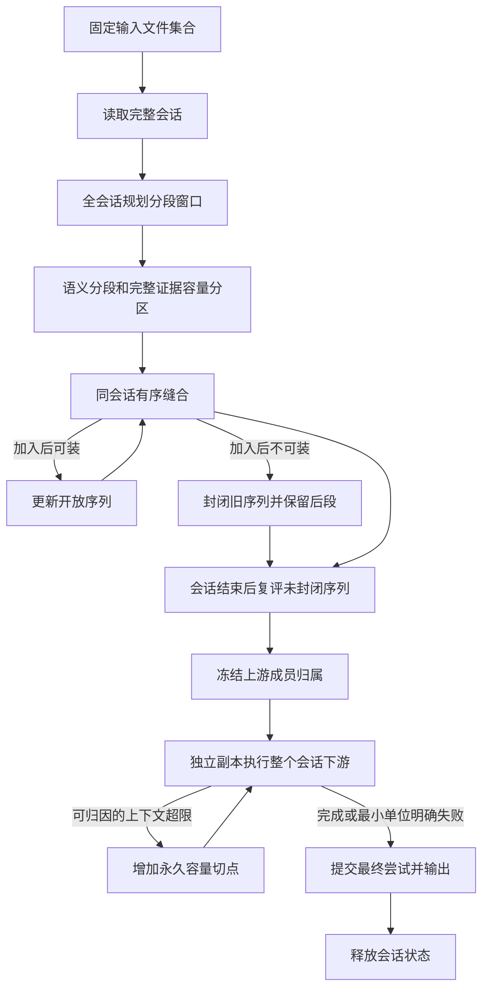

# LabelKit 跨批次序列缝合与上下文容量规格

> 状态：全部规格功能已实现；完整离线、覆盖率、文档、本地 4B 与 Uncle Bob 门禁全部通过
> 日期：2026-09-09
> 实施基线：`56a0ea1`
> 范围：`run.mode = "process"` 且 `segment.enabled = true` 的文本与 UI 序列处理

## 产品行为

同一个输入会话的任务片段可以跨计算批次缝合。模型对最终序列使用完整成员证据；当继续加入成员会
超过请求上下文容量时，封闭当前序列并保留后续成员。容量边界必须明确记录，不能冒充业务任务结束。

输入仍是启动时确定的文件集合。会话仍由现有 key、gap、长度、跨度、文件排序规则、EOF 和 limit 闭合。
所有中间状态只在本次进程内保留；不增加实时输入、后台服务、断点恢复或持久化状态服务。

生成核心流程与真值约束不修改。删除公共 AnnotateConfig 的旧裁帧字段会改变规范化配置中的
GenerationProgram/ScenarioPlan 摘要及派生 event_key；不保留旧字段占位。固定测试向量必须根据独立
旧版与当前版规范化材料差异更新，不能直接接受未经解释的新摘要值。



本规格全部行为属于本轮交付，不设后续实现项目。开发必须先通过规格审查，再分工实现；完成标准是
行为测试、覆盖率、真实本地 4B 验证、独立审查和 Uncle Bob 变异审查全部闭环。

## 行业依据与设计裁决

实际修改路径见 [文件清单](SEQUENCE-CONTEXT-CAPACITY-FILES.md)，实跑结果见
[验收记录](SEQUENCE-CONTEXT-CAPACITY-VERIFICATION.md)。

详细原始资料及当前代码证据见 [行业研究](research/sequence-context-capacity-industry.md)、
[输入与缝合研究](research/sequence-context-capacity-upstream.md) 和
[下游与提交研究](research/sequence-context-capacity-downstream.md)。研究建议与本规格不一致时，以本规格的明确裁决为准。
真实端点环境和用例准备见 [本地 4B 门禁](research/sequence-context-capacity-local-gate.md)。

| 官方机制 | 对 LabelKit 的裁决 |
|---|---|
| Spark State Store 在批次之间保留状态并事务提交更新集合 | 状态归属会话；最终下游尝试才更新正式去重索引及数据计数 |
| Flink session 窗口后续合并会产生旧结果的更新 | 未终结序列不提前写出，避免引入输出撤回协议 |
| ksqlDB `EMIT FINAL` 在窗口终结后给出最终结果 | 会话结束后统一质量比较、验证和输出 |
| LlamaIndex 按指令及输出预留计算剩余上下文 | 复用已有完整请求估算；禁止仅计算正文或 stitch 摘要卡 |
| Provider 计数仍是估计，413 可能是字节限制 | 保留真实上下文超限处置；非 token 错误不得触发序列拆分 |

来源见上述研究文档的一手链接。这里采用已验证的状态生命周期和预算原则，不引入 Spark、Flink、Kafka、
LlamaIndex 或新的 tokenizer 依赖。现有 `httpx`、SchemaEngine、TaskExecutor、预算估算器和指标捕获器足够。

## 会话、计算分组与状态生命周期

`Ingestor.sessions()` 继续返回完整不可变 Session。编排按输入声明序逐会话执行，禁止把不同会话组成
同一个质量比较池。会话内分段窗口、缝合候选、相邻动作、帧请求和评审请求仍经现有有界执行器派发。

流模式的 `run.batch_size` 定义为每次向 TaskExecutor 提交的叶任务组大小上限。它不再表示帧数上限，
不切分会话、序列或模型请求。每一轮可并行判决先冻结完整叶任务及其声明顺序，再按此上限分组；
全部分组返回后只归并一次，再规划依赖结果的下一轮。segment 是全会话窗口轮，stitch 是当前候选的
全部 votes，verify 是当前评审或修复轮。空组不派发。
同一会话的 stitch 候选仍串行推进；分组边界不重建池、不结束尾段、不触发复评、不重置噪声状态。
普通单记录模式的 batch 语义保持原有定义。

`RunContext` 提供基于已有 `tasks.run_group` 的分组执行方法；不建立第二个执行器或资源许可体系。
流模式阶段经该方法派发固定计划。每次返回保持完整任务声明序，任务 ID 和 declaration key 不含物理分组号。

现有日志 `batch_no` 在流模式表示会话声明序号。随机源按 seed、会话声明序与 stage 派生；下游重算重新
使用相同初始随机源，改变的成员分区自然形成新的确定性计划。任务 namespace 另带尝试序号以保证唯一。
只改变 batch_size，在模型判决相同的条件下，成员、边界、归属、分类池、随机配对和最终数据必须相同。

图像预算校准在一个会话全部尝试期间冻结。该会话结束后才合入真实请求样本；不能按物理任务组或重算
尝试冻结。下一会话读取这一快照。真实 LLMClient 终检与预先规划读取同一冻结值。

删除按 batch 硬切会话的实现、警告、`session_split` 载体、输出字段和 verify 降级分支。
不提供该字段的别名、兼容配置或 migration。dry-run 和进度估算改为会话数；调用数继续明确区分静态估计
与实际运行数，不能声称预先知道模型分段及重算次数。

## 完整证据与配置

复用 `config.toml` 中已有 `[llm.<name>].context_window` 和 `max_output_tokens`，不新增重复的上下文配置。
流模式所有实际启用的 LLM 和语义去重 embedding profile 必须声明正的 context_window。
embedding 输入完整保留，预算沿用 embed_budget，不截取序列头部。配置加载聚合错误并在凭据物化之前失败。
未使用的 profile 不因此增加要求。部署字段不移动到 project.toml。

```toml
[llm.sequence]
context_window = 32768
max_output_tokens = 4096
```

输入预算沿用 `context_window - max_output_tokens - margin`，margin 沿用已有统一公式。
每次计量包括实际 system/user 消息、标签、指令、few-shot、完整数据证据、消息开销、图片及实际上行 Schema。
代码负责的标注字段继续不进入模型 Schema；完整最终 Schema 仍用于后处理后的校验。

完整证据采用以下固定口径，不能在遇到预算压力后改变：

| 请求类型 | 必须保留的证据 |
|---|---|
| 序列 classify、quality、annotate、verify | 每个成员完整文本；UI 每个成员完整归一化树与全部图片；完整现有派生成果和实际任务指令 |
| 逐帧 classify、annotate | 完整目标帧及该帧请求契约要求的序列上下文；不得用按成员数抽样伪装覆盖 |
| segment 边界判断 | 已规划窗口中每个成员的完整证据及相邻关系；保留现有接缝裁决所有权 |
| extract 相邻动作 | 完整相邻帧对和必要的树差异；容量切点两侧不推断不存在的跨段动作 |
| stitch 候选判断 | 保留既有语义卡片作为候选检索表达；卡片可装不能证明合并序列可装，必须另过完整序列容量检查 |

帧分类对当前完整 episode 发一次请求，返回与全部成员对齐的 labels 数组；多个成员时容量单位为
sequence，单成员及回收直调为 frame。下游帧分类不再用 segment.window 限制证据范围；固定类表、
指令和 Schema 超限按同源空证据模板判为 fixed，单帧仍保留 frame 最小失败语义。

verify 边界余量中实际引用的邻帧同样提供完整文本、完整归一化树及图片，并进入同一实际请求预算；
允许区间之外的邻帧不作为回收证据引用，不发送其图片。

UI 所有实际接收图片的 profile 必须具备 vision 能力；更新 quality 等原先纯文本路径的能力矩阵。
归一化 UI 树采用既有 `UITree.serialize(max_chars=None)` 的全部可见节点表达，不增加预算裁剪；
“完整”指本工具既有输入表达，不声明保留未经摄取的原始文件全部字段或不可见节点。
固定 `max_image_px` 属于原有部署表达口径，可保留；不新增遇超限动态降清、抽图、正文截断或摘要替代。

所有 process stream Schema 调用显式设置 CallScope.complete_evidence。L3 修复原样保留首轮任务、
完整成员证据、图片与 Schema，追加上一模型空间候选及完整违规清单；代码负责字段仍经既有 projector
排除。L3 的 ContextOverflowError 必须保留实际 repair profile、phase 和 origin 原样上抛所属算子，
不能在结构引擎中吞掉改成 SchemaViolation 或提前记入熔断。普通记录及生成路径保留各自既有修复合同。
固定容量预览用同一 builder 渲染空成员/空派生产物，并保留不可省略的 user 消息、标签、指令、示例和
Schema；不能以删除整条 user 消息低估固定开销，再把本来不可分的问题反复切为更短序列。
流模式删除被完整证据取代的 sequence_frames、序列摘要字符裁剪、steps 裁剪的控制路径及失效配置约束；
仍用于普通记录或 stitch 语义卡片的配置保留其准确适用范围，显式无效的声明应配置报错而非静默忽略。

完整序列证据用一个公共渲染路径生成，实际请求构建和提前预算检查共用它。算子公开无副作用的容量预览，
编排组合为 common 声明的小型容量检查协议交给 RunContext；stitch 不导入 orchestration 或其他算子的私有函数。
预览使用当前已知的实际模板与模型 Schema；分类尚未确定时检查所有可达类配置。不得调用模型做预览。

预览不承诺提前知道 extract、annotation、postprocessor 或 verify 修复产物的大小。实际请求构建后仍必须
完整终检；任何未知产物造成的超限由未提交会话重算闭合。启发式估算没有绝对安全保证。

## 容量分区、封闭与身份

分段先完成整个会话的语义关系归并、noise 判定和 min_len 判定，再按完整成员容量贪心分区，最后创建
episode。原语义段通过 min_len 后，容量子段不得再次因短于 min_len 被丢弃。规则分段和 on_error=keep
保留的整段走相同容量检查。必要的最小边界判断仍要求完整相邻帧对，不能拆成失去判断条件的单帧请求。
segment 的 precheck/reactive 窗口超限先按完整成员边界缩窗并保留相邻重叠，最少两帧；最小两帧仍超限
则整个受影响会话形成明确 context_overflow 终态，不进入 on_error=keep。其他非容量错误保持既有策略。
初次容量分区只缩小 unit=sequence 的请求。fixed、frame、transition、pairwise 等不可通过缩小当前
单序列修复的预览失败保留原语义 episode，由下游原阶段控制信号和最小终态执行门处理；不能在
segment 提前失败整个序列，从而跳过 dedup/classify 或把成员标注失败改为序列失败。

候选加入前先构造无副作用的合并预览。可装才一次提交 Record 重绑、fragments、成员状态和统计。
不可装时，容量封闭前段，保留未加入部分；禁止先写归属再撤销部分字段。

| 缝合入口 | 容量不足时的固定结果 |
|---|---|
| 初始语义段 | 按完整成员边界贪心分区；已被后段接替的前段 sealed |
| pass1 接续 | 封闭旧目标；候选保留并按原规则新开自己的线索 |
| below_min_len 救援 | 封闭旧目标；救援帧保持 dropped_noise，不因容量失败凭空创建任务 |
| pass2 复评 | 双方保持原成员；按最早成员出现位置封闭较早的线索，位置相同是契约错误 |

真实成员分区或严格前段尾位置小于后段首位置时才建立线性 CapacityCut。pass2 双方已有成员交错时，
容量不足只 sealed 较早线索并记录双方位置，不新增伪切点或排除已有成员的允许区间。
例如成员 `[0,8]` 与 `[4,6]` 合并失败，封闭前者而保留其原范围，不能把其上界收紧到位置 4。

`sealed` 与 pool eviction、alive 分开。sealed 从候选池移除；不能作为 pass1/rescue/pass2 目标，也不能
作为任何合并的候选。初次容量分区产生的 sealed episode 不发 stitch 判决，直接建立自己的 sealed
输出线索且不入 pool。所有合并预览和提交入口同时复查候选与目标的 sealed 不变量。
普通 max_open 淘汰仍按原复评规则处理。
会话结束统一复评尚未 sealed 的线索，再结算所有 alive 线索的 seam 与中断归因。

成员身份用会话中从零开始的输入出现位置区分，不用内容 record.id 作为出现位置的唯一键。
原始 Record ID 保持现有内容推导，重复内容仍可拥有相同 ID；位置、来源坐标与原始 ID 一起保留。
帧信封持有 session_position，序列持有有序 member_positions；序列全部成员相关字典通过明确的出现位置键
关联，输出仍保留真实 record.id。sequence generation 使用其已有唯一成员身份，不受本处理路径改变。
stitch_fragments 每个公开条目固定键序为 order_span、member_count、cause、source_episode、
member_positions。片段出现位置必须显式保存；容量子段和 verify 手术按这些位置投影片段，不能用
仅有成员数或首尾跨度推断交错成员归属。
投影删除空片段后按首个剩余出现位置重新排序，交错片段缩段后也必须保持会话顺序。
内部 stitch_task_name 保留最终已判断的线索名，用于 verify 手术后按出现位置重建中断任务名。
此字段随分类扇出、会话快照和容量子段复制，不新增外部 JSON 字段。
verify 手术后按全会话最终成员归属重新计算接缝。若其他已评审序列的接缝受影响，必须重建其动作、
重新标注并复评，不能只更新元数据而交付消费旧接缝的标注。受影响序列沿用各自已经消耗的修复轮数，
不重置 max_repair_rounds；不能完成复评时明确失败。手术回滚同时恢复受其影响的成员与派生产物。
成员归属只取未分类或首标签信封；同 record.id 的标签视图不构成彼此的任务中断。
独立线索即使任务名相同仍有独立归属。克隆可以因接缝变化重建动作、重标注与复评，
但不能按其旧成员集合删除或补跑首标签拥有的共享帧产物。

普通 process 初始 episode ID 统一取
`sha256(canonical_json(["process_sequence", session_id, member_positions, member_ids]))[:16]`，
canonical_json 使用 UTF-8、ensure_ascii=False、separators=(",", ":")。公式由 common 唯一实现并写入
CONTRACTS，消除同会话重复内容分区的碰撞，不保留旧公式的兼容分支。成功 stitch 幸存者 ID 仍不重算。
冻结上游时为每个存活序列确定 root_id。下游容量子序列 ID 取
`sha256(canonical_json(["process_sequence_capacity", root_id, member_positions, member_ids]))[:16]`，
记录 root_id 与直接 parent_id；最终成员分区相同时 ID 不依赖二分路径，且不会与上游创始 ID 自指。
不得重复保留原活跃信封或输出空壳。

每个容量切点记录左右成员出现位置、stage、profile、phase；只增不减。序列明确携带 sealed 状态与两端
容量边界。边界信息随分类扇出和 verify 重建传播。`_meta.stream.capacity` 输出此信息，普通未容量分区
序列输出 null；容量 sealed 即使没有线性切点也输出非 null 的容量对象。
另输出 member_positions，与 member_ids、member_sources 一一对应。
capacity 非 null 时字段固定为 sealed、allowed_positions、before、after、root_id、parent_id。
allowed_positions 是半开区间的两个整数；before/after 是 null 或含 left_position、right_position、stage、
profile、phase 的切点对象。尚未建立下游 lineage 时 root_id/parent_id 可为 null；正式下游输出必须有 root_id。

容量边界约束同一原序列的前后子段，不得把独立交错线索也整会话截断。verify 可按既有规则在允许范围
回收邻帧，但不得跨本序列容量切点重新扩张。每条线索维护半开允许位置区间，初始为整个会话；
切点以右侧首成员位置收紧前段上界和后段下界。合并预览必须确保并集全部位于双方允许区间的交集内，
成功合并继承交集，收缩不放宽区间。verify 建立 claim 前和成员变更提交前均检查此区间。
不满足允许区间的合并不发模型判决，双方保留原归属。边界随分类扇出完整传播。
process stream 的 verify 请求与 defects.members Schema
使用 session_position 整数定位，禁止用裸内容 ID 认领或删除成员。片段、动作索引和帧产物同步按位置更新。
缺头/缺尾若准确命中已声明的人工边界，作为 capacity 边界疑点留在审计结果，不触发回收，也不独立造成
业务 fail；若全部缺陷均为这类疑点，规范化 verdict 为 pass。其他真实缺帧、label_mismatch、wrong_stitch
等照常决定失败，不能因序列具有任意容量标记而整体豁免。

## 未提交会话下游与有限重算

上游 segment/stitch 成功结束后冻结成员归属。下游从这个快照及持久保留的容量切点开始，每次使用一份
独立可变信封副本。不可变 Record 与惰性图片引用可以共享；errors、scores、classification、annotation、
成员产物、transitions、verify 状态、噪声认领及分类扇出容器必须隔离。

每次尝试按原链序执行 dedup、classify、extract、quality、annotate、verify。quality 比较池固定为当前会话，
仍遵守已有按类分池、配对和筛选规则。发生容量重算时重建整个会话下游，不能只重算 annotation 而保留旧
质量分数。重算不重新调用 segment/stitch，不撤销先前已提交会话，也不移除已有容量切点。

普通 DedupIndex 使用仅包含当前尝试新增特征的会话局部增量。查询同时检查正式索引与增量，保持现有精确、
近似和语义层级、最佳分数及并列插入顺序；不深拷贝正式索引，不复用 generation 的整组任一重复拒绝策略。
`dedup.scope = "batch"` 在流模式解释为当前会话，重算从空局部增量开始；global scope 读取已提交会话索引。
最终尝试在 dedup 阶段接受的身份全部提交，之后 quality/verify 拒绝不追溯改变原有去重链语义。
DedupStage 的 counted_clusters 同样采用已提交集合加当前增量；正式 last_probe/last_similarity 不保留
失败尝试的临时结果或 Record 引用。只捕获计数不能替代这些算子字段的隔离。

复用 MetricsSink.capture_counts/merge_counts，禁止嵌套。最终数据计数、质量汇总、fanout、episode、
noise claim 和输出只采纳最终尝试；LLM usage、Schema 修复、真实调用错误、重试、trace 和耗时累积保留。
budget 计数区分触发重算的请求与最终不可处理记录，不能把成功恢复的记录统计成 overflow_records。
上游数据计数先独立捕获并冻结，下游每个尝试另行捕获，最终只合并上游及最终尝试一次。
最终 `counts.episodes = 上游初始 episode 数 + 下游最终容量分区净增数`；
`counts.stitched` 仅为上游实际成功合并壳数，`counts.threads = counts.episodes - counts.stitched`。
分类扇出另计 fanout，不能当作新 episode；最终失败段仍是已创建的序列。废弃尝试的中间拆分壳不进入计数。

上下文超限使用现有 ContextOverflowError 的 phase、profile、origin，并由算子转换成带 stage、受影响
序列身份和请求最小单位的会话容量信号。必须在现有 record-failed、pairwise tie、extract 替代或普通
repair 分支吞掉异常之前上抛。其他异常遵守既有阶段策略，不借容量机制改变语义。
信号的 stage 表示拥有本次操作的编排阶段；verify 内重新标注造成的超限归 verify 的终态执行门。
实际子调用阶段、profile 和原始错误保留在请求 trace 中，不能因此重复运行同一次失败扩张。
同一判决轮多个容量信号按任务声明顺序选择，不能按先完成者选择。当前轮全部叶任务必须收拢或取消并
等待结束，才允许丢弃尝试和启动下一尝试；旧任务不得跨尝试写信封或计数。

| 错误范围 | 固定处理 |
|---|---|
| 完整序列请求的 precheck 或真实 context overflow | 在受影响序列的成员中点增加新切点，形成两个非空子序列，重算当前会话下游 |
| quality 双序列请求超限 | 选择成员更多且可分的序列；相同成员数按最早输入位置选择；全部不可分则相关记录明确失败 |
| 单帧请求或必要相邻对本身超限 | 明确记录 context_overflow 终态，不靠切分外层序列重复相同最小请求 |
| 固定指令、Schema 或 stitch 卡片池本身超限 | 不伪称某条序列过长，不无限拆分；按该请求的既有错误归属明确失败 |
| OutputTruncatedError、413、认证、限流、网络、程序和后处理异常 | 不触发容量拆分；沿既有错误类型、重试、终态和熔断规则 |

终态最小单位失败仍通过一次最终会话尝试结算其他记录；不会因一个不可分记录永久阻断后续会话。
容量信号必须包含实际工作成员位置和分类视图。verify 扩张后超限时丢弃当前手术，再拆冻结基线中可拆的
对应序列；若基线不可拆而超限完全来自新增回收成员，则对应序列视图明确终态失败，不产生空子段、
不转成成功占位，也不反复执行相同扩张。

最小失败键为 stage、profile、请求单位、源序列 lineage、分类 label 和请求出现位置集合；
失败在后续尝试的同一阶段执行门投影，不提前跳过 dedup/classify 等前置语义。
逐帧 annotation 失败继续采用现有帧失败产物；逐帧 classify 按现有帧分类失败路由；整序列请求失败只使
该分类视图 failed；不可分 pairwise 请求使两侧相应视图失败并重建其余比较池。
frame 或 transition 的固定 Schema/指令超限保留原最小请求单位，不提升成会误杀整序列的 fixed 单位。
其他类别视图或相同内容的其他出现位置不受误伤。已终态失败的请求不再次调用模型。
frame 终态按精确出现位置匹配；transition 证据保留失败相邻对，但执行门投影为该阶段与 profile 的
当前序列分类视图不可完成，不能继续该视图其他相邻对请求。其他独立视图的合法请求仍可执行。
ProviderFatalError 与熔断终止继续
穿透；被容量重算接纳的 reactive-400 不重复喂熔断器，真正终态按既有 origin 规则恰好记一次。

每次重算必须新增此前不存在的有效成员切点，或永久确立一个不能再请求的最小失败单位。原会话含有限
N 个出现位置，分区数不超过 N；同一序列的已有切点不会移除，不能重建原超大请求。没有可推进的变化时
直接终态失败。不得靠无限 retry、任意可配次数、空序列或丢成员来推进。

同一判决轮多个请求超限时，必须收齐全部计算分组的结果，并在业务归并前按叶任务声明序收集全部容量
失败。SessionCapacityError 唯一载荷为非空 failures 元组，不能只抛首错而丢掉其他已实际失败的请求。
会话编排按声明序消费整组失败，新增全部仍适用的切点或最小终态，再启动一次重算；同一轮的重复失败
只消费一次。先前切分已消除的旧 sequence/pairwise 请求不再可达，丢弃其过时失败，不误记为最小终态。
frame、transition 与 fixed 请求仍按其最小单位保留；重定位使用子段允许区间，保留可能刚回收而尚不在
冻结成员表中的位置；跨新切点而不再允许的相邻对请求失效。所有失败错误对象都释放调用栈引用。
重算次数按新尝试计量，切点与最小失败计数按实际新增事实计量；已知超大请求不能在下一轮原样重发。

所有正常阶段完成后，先校验本次成员分区与状态守恒，再同步提交 dedup 增量和捕获的数据计数，随后调用
现有 emitter 输出并 tally。该提交段不 await。这里保证重算不会泄漏已输出数据，不新增普通 process 文件
级事务协议；现有输出 I/O 错误和部分交付语义不包装成 sequence generation 的 manifest-last。
emitter 写前校验仍可将 active 改判为 rejects；最终 delivered/failed 统计以 post-emit 为准。
一旦开始正式提交，任何最终校验或 I/O 错误均不得回到容量重算。

## 资源、观测与中断

内存寿命从物理 batch 改为完整 session。沿用 stream.session_max_len、图片大小检查、惰性图片和
execution runtime 许可；现有文本输入没有独立字节硬上限，不声称 batch_size、max_open 或会话帧数
给出固定的物理内存上限。验证记录实际保留内容量及峰值 RSS。
至多保留当前会话上游快照、一个下游可变尝试和该尝试 dedup 增量；尝试结束释放旧副本，成功会话结束释放
所有会话对象。全局 dedup 索引属于原有整次运行状态，不复制进快照。
冻结上游后释放重复的原信封列表。跨尝试保存错误对象前清除 traceback、cause 和 context 的旧执行帧
引用，保留原错误对象及其 profile、phase、origin 和消息；错误证据不能使已废弃尝试继续驻留。

trace 增加容量封闭、切分、重算和最小单位终态事件，仅写结构信息、record IDs、位置、stage、profile、
phase 与数量。report 增加 capacity 的封闭数、实际切分数、重算次数、最小单位失败数和会话保留高水位；
准确路径为 report.stream.capacity，键为 splits、sealed、minimum_failures、recomputations、
retained_frames_high_water；内部计数器使用同名 capacity. 前缀。capacity.* 和 dedup.embedding_failures
是已发生的控制与请求失败事实，取消或重算仍保留；budget.overflow_records 仅统计最终失败记录。
不写正文、树、图片、prompt、用户标注或密钥。容量边界在输出的元数据中可独立审计。
MetricsSink 用独立 ContextVar 标记当前会话和尝试，流模式所有阶段、Schema 与 LLM trace payload
统一附带 session_id 和 session_attempt；上游为零，下游从一开始。旁路脱敏保留这两个结构字段。
普通模式不附加字段；废弃尝试的保留事件必须能明确归属。

收到停止信号后不开始新会话，沿用现有至多等待 30 秒再取消的机制。当前会话若完整完成即可提交；被取消
的未提交尝试释放局部增量和捕获计数，不写其输出。已完成会话的输出保持有效。中断报告按出现位置核算
未提交输入残差，不把未结束帧或 stitched 壳误计为独立失败记录。

## 文件修改清单与实施顺序

| 模块与文件 | 必须完成的变化 |
|---|---|
| `common/contracts/stage.py`、`types.py` 及新容量契约文件 | 会话上下文、叶任务分组、容量信号/检查协议、出现位置和容量边界载体 |
| `common/inference/budget.py`、`llm_client.py`、`schema_engine.py` | 完整请求统一预算、实际 overflow 分类、终态计数边界、verify 出现位置 Schema；不复制估算器 |
| `common/config/model.py`、`_constraints.py`、相关加载文件 | 正 context_window 和 UI vision 约束，删除过时序列裁剪配置与硬切警告 |
| 新公共完整序列证据模块 | 无损文本/完整归一树/全图渲染、出现位置关联和实际请求预览共用 |
| `operators/segment.py`、`stitch.py` | 全会话计划、计算分组、首次容量分区、所有合并预算门、sealed 与最终复评 |
| `operators/classify.py`、`extract.py`、`quality.py`、`annotate.py`、`verify.py`、`stream_verify.py` | 完整证据与最小请求、容量信号上抛、出现位置键、重算隔离、verify 人工边界保护 |
| `operators/dedup.py` | 普通索引的会话局部增量与最终提交；不改变 generation 组预留策略 |
| `orchestration/process_workflow.py` 及独立会话驱动模块 | 完整会话驱动、上游冻结、下游有限重算、提交/中断、随机源、校准和估算 |
| `common/observability/obslog.py`、`operators/emitter.py` | 容量事件、报告计数、成员出现位置和边界输出，删除 session_split |
| `docs/CONTRACTS.md`、`spec/` 对应模块章和数据/配置/日志章 | 在实现接口前同步新的权威边界，删除冲突旧契约 |
| `docs/manual/`、`examples/`、`docs/dev/E2E-FINDINGS.md`、AGENTS/CLAUDE | 用户可运行示例、准确适用范围和真实证据；AGENTS 与 CLAUDE 保持字节相同 |
| `docs/design/` | 重新生成 HTML/PDF 并检查受影响页面 |
| 各模块测试、新会话集成测试和本地 4B 集成 | 下述所有验收行为均有可独立观察的断言 |

先完成公共契约和一个完整会话经下游暂存/输出的最小端到端路径，再并行补齐容量路径及完整证据，
随后集成测试、配置文档和真实端点。不得为实现尚未完成的复杂路径拆掉已通过的端到端路径。
共享文件由父代理串行维护，各 worker 获得明确文件所有权，不覆盖其他人的工作。

## 验收矩阵

下表由实际测试、真实模型与独立审查证据结算，详见[验收记录](SEQUENCE-CONTEXT-CAPACITY-VERIFICATION.md)。

| 要求 | 必须通过的观察 | 证据位置 | 状态 |
|---|---|---|---|
| 跨批次缝合 | 相同输入取多种 batch_size，TaskGroup 大小确实改变，序列成员/顺序/ID/线索相同 | orchestration 与 stitch 测试 | 已验证 |
| 会话边界 | key、gap、文件顺序模式、长度、跨度、EOF、limit 不跨会话；空会话迭代正常结束，无有效输入文件仍按既有 InputError 契约处理 | ingest 与会话驱动测试 | 已验证 |
| 分段接缝 | 分组切在窗口接缝、噪声和短段中间仍采用后窗裁决，尾部不提前终结 | segment 测试 | 已验证 |
| 初次容量分区 | 规则、LLM、keep 均覆盖；短尾保留，完整成员恰归一次 | segment 与容量测试 | 已验证 |
| 全部合并入口 | pass1、rescue、pass2 刚好可装/差一点不可装；失败预览零成员和计数泄漏 | stitch 测试 | 已验证 |
| sealed 不重开 | 所有候选、目标和最终提交入口拒绝 sealed；普通 eviction 可按原规则复评 | stitch 测试 | 已验证 |
| 重复内容身份 | 相同 record ID 的不同出现位置、帧产物和 seam 均完整保留，不用 set 吞成员 | 出现位置与全链测试 | 已验证 |
| 手术接缝依赖 | A=[0,4]、B=[2,5] 的 B 移除位置 2 后，A 接缝重建、重标注与复评；轮数耗尽不得交付旧结果，回滚恢复依赖 | verify 与会话测试 | 已验证 |
| 完整文本与 UI | 故意在中间成员和原裁剪位置放决定性事实；实际请求包括全部文本、树、图、steps 和 Schema | 每个实际请求构造及序列化测试 | 已验证 |
| 能力与上下文配置 | 缺少正窗口、UI 无 vision、失效裁剪字段均在凭据物化前聚合报错 | config 与 validate/dry-run 测试 | 已验证 |
| 请求真实预算 | 实际模板、剥离代码负责字段的上行 model Schema、few-shot、图片和后处理大产物均计入；静态可装不跳过终检 | budget 与各阶段测试 | 已验证 |
| 有限真实超限恢复 | precheck/reactive、单序列/quality 双序列均新增切点；每次严格推进，无相同超大请求重播 | 会话重算测试 | 已验证 |
| 最小单位和错误分类 | 单帧、相邻对、固定开销终态；输出截断/413/认证/网络/程序错误不触发拆分 | 错误路径测试 | 已验证 |
| dedup 隔离 | exact/near/semantic、global/会话、顺序与并列规则；失败尝试不占位，最终阶段接纳身份提交 | dedup 与重算测试 | 已验证 |
| 全下游隔离 | 扇出、帧标注、noise claims、verify 手术、quality 池和数据统计在失败尝试后不泄漏 | 故障注入会话测试 | 已验证 |
| 运行证据保留 | failed attempt usage、Schema、trace、耗时保留，成功恢复不计最终 overflow_records | report 与 metrics 测试 | 已验证 |
| 人工边界 | verify 缺头缺尾不当自然缺帧、禁止跨容量边界回收；交错独立线索不受误切 | stream_verify 与 emitter 测试 | 已验证 |
| 随机源与校准 | 任务完成序和分组大小变化不改变会话随机计划/预算快照；重算不冻结校准 | runtime 与会话测试 | 已验证 |
| 守恒与释放 | 输出、noise、drop、失败和吸收出现位置可核对；至少两个会话证明前一会话对象释放 | 会话资源与中断测试 | 已验证 |
| 中断与既有输出 | 中断前成功会话保持；未提交会话零输出/正式 dedup/数据计数泄漏，残差准确 | process 中断测试 | 已验证 |
| 普通及生成路径 | 普通记录和 generate_only sequence 原有功能及后处理协议不被改变 | 窄回归与完整离线套件 | 已验证 |
| 本地真实 4B 文本 | 超过 batch_size 的任务被正确缝合；原中间事实参与最终标注；真实 usage 非零 | local_llm 集成与独立产物检查器 | 已验证 |
| 本地真实 4B 容量 | 主动预算分区和真实端点 token 超限各有一次可验证恢复；最小失败明确结束 | local_llm 真实调用证据 | 已验证 |
| 本地真实 4B UI | 全图/树进入实际请求且有依赖中间帧的明确答案；不以文本测试代替视觉门禁 | local_llm UI 集成 | 已验证 |
| 特性与生产覆盖率 | 规范特性全覆盖；300/300改动函数进入，32文件最低行89.61%、分支78.05% | 最终完整离线及独立覆盖报告 | 已验证 |
| Uncle Bob 变异审查 | 独立绿色基线与有效语义 mutant 零 survived | [Bob报告](BOB-sequence-context-capacity.md)；干净提交 `a050661` 完整复审293个有效变体全部 killed | 已验证 |
| 文档与产物 | validate、dry-run、run 同配置可用；手册、报告、HTML/PDF 与实际行为一致 | 示例检查器及文档检查 | 已验证 |

本地门禁使用真实 Qwen3.5-4B-Q6_K 与真实 llama-server。正常文本、UI、主动分区、真实超限恢复分别记录
请求跨度、完整证据覆盖、usage、Schema 合法性、业务答案和输出成员守恒。不得用 mock transport/server、
录制响应、静态替身或“服务成功返回”代替语义验收；不得为了绿色结果关闭被验收阶段。
真实上下文错误形状需实测核实，缺乏证据时不能把任意 HTTP 400 算作 overflow。
固定答案用独立检查器验证；运行耗时和 RSS 单独记录，不把单模型并发当作加速保证。

完整离线门禁沿用 `uv run --python 3.12 pytest -q -m 'not integration'`，先窄后宽。
本地 4B 是本次特性明确授权的真实证据，补充而非替代仓库已有 DeepSeek/z.ai 发布门禁。
任何未执行的真实发布证据必须明确记录 `[PENDING-EVIDENCE:<name>]`，不能伪称通过；本规格接受矩阵
中的本地门禁、功能、文档和测试条目则不得以该标记延期。
