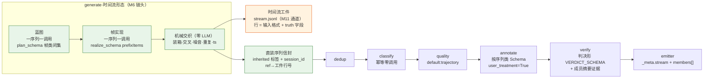
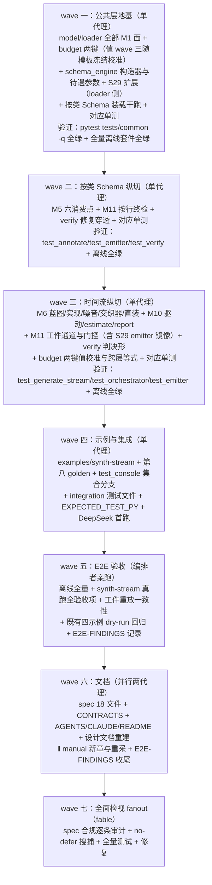

# 特性开发规格：时间流生成（spec v1.13）

> 状态：**superseded（v1.17 Wave 8 已收口）**。本文保留 v1.13 的历史决策与实现依据；当前
> 行为真值以 v1.17 主规格与 `docs/CONTRACTS.md` 为准。

> 本文是**最终开发规格**：三方预实现审计（代码可行性/亲和性、文档观测清单穷尽、对抗性反证——反驳四条 + 需调整十二条全部折入）已于 2026-08-13 完成——凡与提案不一致处，**以本文为准**。
> 实现纪律：不允许 defer 任何本文描述的内容；每条规格必须有对应测试用例；观测面与输出面逐字节按本文冻结；注释统一中文、代码/日志/报错英文；函数 ≤50 行、≤5 入参；异常分支必须有错误日志。

> **2026-08-14 整改修订注记**：全库代码规则整改（spec §1.6 同日条目 / CONTRACTS §12 第 34 条）对本文的**决策与规格零改动**——本文保留为历史裁决记录。仅两处口径随代码更新：① 生产代码的注释与 docstring 为中文，日志/报错/CLI 输出为英文（LLM 提示词模板与 spec 冻结的输出数据仍为中文原样）；② 若本文引用了 `build_annotate_prompt` / `annotate_record` / `build_verify_prompt` / `complete_validated` / `render_thread_card` / `Orchestrator` 的「末位可选形参」调用形，这些取值现已收拢为参数对象 `AnnotatePromptOptions` / `VerifyPromptOptions` / `CallScope` / `ThreadCard` / `RunServices`（字段名与语义逐项不变）。

---

## 1. 结论与形态

一句话：`generate_only` 新增**时间流形态**（`[generate.stream]`）——LLM 只做两类内容调用（一序列一次**蓝图**、一次**帧实现**，噪音帧批量实现复用既有生成模板），会话装箱、交叉、噪音插入、重复重发、时间戳铺设全部由 `Random(f"{seed}:0:generate")` 单流顺序消费的**机械交织器**完成；交织产物一式两份——可重放的**时间流工件**（`{output_stem}.stream.jsonl`，首个新增输出通道）与**直装序列信封**（`kind="sequence"`、inherited 序列类标签、帧类真值随 `member_classifications` 落 `members[]`），信封经 dedup → classify（幂等零调用）→ quality（`default:trajectory` 自动解析扩展）→ annotate（**按序列类独立标注 Schema**，M8 门重构）→ verify（判决形拒绝采样）→ emit。segment/stitch/extract 不参与，互斥条文字面维持；本形态全关时全系统与 v1.12 字节等价（含七个既有 dry-run golden 字节不动）。



DeepSeek 端点（E2E 验证面，2026-08-13 探针复核）：`https://api.deepseek.com/anthropic` + `deepseek-v4-flash` 在线；`thinking` 内容块被 M9 anthropic 解析器天然跳过（只收集 `type=="text"`）；该路由对强制 tool call 硬拒 400（E2E-FINDINGS 第 24 条）⇒ profile 声明 `supports_structured_output = false`，**L0 全关——蓝图/实现的结构服从性主战场在提示词文本内嵌结构契约**（两个新模板的硬要求，非兜底）；密钥 `.env` 的 `LABELKIT_DEEPSEEK_KEY`（已在位，git-ignored）。本特性的集成测试按需求方指示（2026-08-13）走 DeepSeek 端点；另设一例 z.ai glm-5.2（L0 开启面）钉 `prefixItems` 供应商透传。

## 2. 设计裁决记录（提案四项已闭 + 审计折入；自然语言命名）

| 裁决 | 内容与理由 |
|---|---|
| 裁决·按类标注 Schema（需求方 2026-08-13） | `[class.<name>.annotate]` 白名单增 `schema_path`/`schema_inline`（**覆盖**语义，缺省回落全局 `output.schema`）；实现抄 rubric 的 `ClassView` 按类重资产先例；兑现 v1.7 演进候选（§8.4 M13 行核销），`50-ch5` 白名单尾行排除句同一次改写 |
| 裁决·时间流工件通道（需求方 2026-08-13） | `{output_stem}.stream.jsonl`，M11 第五输出通道；§2.6「唯一写盘对象」清单增补（增条目、不放松「无中间态落盘」原则；工件是与主输出同级的数据输出通道）。`.part` + fsync + 原子改名与主输出**同批 finalize 改名**；dry-run 不写（`_run_dry` 不开 emitter，天然豁免）；不可写 ⇒ 既有 `_undeliverable` 纪律（exit 4 家族） |
| 裁决·量目标辖区（需求方 2026-08-13） | 按类 `sequences` = **尝试配额**（同 `standalone_count`：无输出条数保证、无补齐回路）；O6 保留「输出精确定量 + 补齐回路」辖区，§8.3 O6 注记同步 |
| 裁决·示例工程形态（需求方 2026-08-13） | 独立第五例 `examples/synth-stream`；**自含单 profile DeepSeek `config.toml`**（共享 `../config.toml` 是 z.ai，违背 E2E 端点指定；mix 自含先例）；`tests/cli/test_console.py` 的 config 三元分支改集合判断 |
| 裁决·互斥语义答卷 | O3 预留的「互斥放开或串接」答卷 = **第三形态·直装**：segment×generate 互斥字面维持（本形态不启用 segment），O3 注记核销指向 v1.13；重放评测回路列演进候选 |
| 裁决·直装评审判决形（**修正提案**） | 提案「走既有非流评审路径零改动」被审计证伪（`verify.py:647` 驱动器门=segment.enabled × `:438` 模板门=kind 不一致——缺陷词表模板 × `VERDICT_SCHEMA` 禁 defects 键错配、空体 `[边界余量]`、无成员证据段）。裁决：直装序列在 M7 走**判决形**——`build_verify_prompt` 增判决形序列变体（判决指令 system 文本 + `[任务指令]`+`[成员帧摘要]`+`[标注结果]`，无缺陷表/边界余量/片段结构，成员摘要渲染镜像 M5 的 400 字/成员 + 总量截断），schema 恒 `VERDICT_SCHEMA`；修复 = 既有重标注 policy；fail ⇒ `dropped_verify`（拒绝采样、淘汰不改真值）；`VerificationResult.defects` 恒空、emitter `_verification_block` defects 门**零改动**；流式驱动器与缺陷词表面不动 |
| 裁决·轨迹准则自动解析扩展（**修正提案**） | S29 空选择子解析 `quality.rubric = "" ⇒ default:trajectory` 的条件从 `segment.enabled` 扩为 `segment.enabled ∨ generate_stream.enabled`——**loader（`loader.py:1791-1796`）与 emitter 镜像（`emitter.py:331-342`）两处同步改**，S29 组合 advisory 同步；spec 三处措辞（`301:36`、`50:179`、`90:119`）同改；示例依赖自动解析（教学该行为） |
| 裁决·序列类约束按形态放宽（**修正提案**） | 提案配置草案自身非法（单类撞 ≥2 规则、缺 fallback_class）。裁决：`[generate.stream]` ⇒ **`classify.enabled = true` 硬合取**（class_views 物化前提，否则 annotate 按 inherited 标签取视图 KeyError）；本形态下类表约束放宽为 **≥1 类**、`fallback_class` **免填**（写了仍须 ∈ 类表）——inherited 形态无判决路径，两规则的保护对象不存在；`classify.llm` 援引 S30 先例**豁免引用集**（零调用不强制活密钥）；`report.classify` 直方图恒全零声明为预期（手册注明） |
| 裁决·golden 冻结锚不动（**修正提案**） | 既有七个 dry-run golden **字节不动**（回归锚文化）；估算行格式零改动（不加键，蓝图/实现/噪音全折入 `generate_calls`）；仅新增第八个 `dryrun-synth-stream.txt` |
| 裁决·时间流入口与配额截断 | 新公开面 `generate_stream_all(ctx) -> StreamGenerateProduct`（信封列表 + 工件行列表的富返回；`PipelineItem(record=r)` 裸构造无法携带 session_id/classification/member_classifications）；`generate_all -> list[Record]` 冻结签名与平面路径**零改动**（CONTRACTS §7.5 增补分支注记）；`--limit` 单位 = 序列，截断在**计划期配额层**（类段字典序前缀，作废序列不再生成、不进交织）⇒ 工件与主输出覆盖面恒一致；orchestrator 尾部 belt&braces 保留 |
| 裁决·工件行即 raw | 成员 `Record.raw` = **工件行全对象**（含 truth 字段）、`id = sha256(canonical_json(raw))[:16]`（M2 公式）⇒ 工件重放时成员 id 逐字节一致；`text` = `text_field` 值的 M2 语义投影（字符串直取、对象 canonical JSON）；`session_id` = M2 公式 `sha256("\n".join(会话内全部帧 id))[:16]`——**含噪音帧与重复帧**，重放一致；序列 `record.id` = M14 公式 `sha256("\n".join(member ids))[:16]` |
| 裁决·真值不携最终 id（封死循环依赖） | 工件行 truth 的序列归属用**计划期标识**（`sequence_class` + 类内序数 `sequence`），**禁止**携带装配后 record id（成员 id 依赖行内容、序列 id 依赖成员 id——携带即环）；`_meta.stream.episode_id` 与工件的对账靠 `member_sources` 行号双向可查 |
| 裁决·工件行真值字段集 | 行 = `{<ts字段>: …, <text_field>: …, "truth": {…}}`；truth 键集（冻结）：`session`（int，全流会话序数 0 基）、`sequence_class`（str\|null）、`sequence`（int\|null，类内序数 0 基）、`frame_class`（str\|null）、`noise`（bool）、`duplicate_of`（int，仅重复序列的帧在场，值 = 原序列类内序数）。噪音帧三 null + noise=true。重放时可经 `output.passthrough_fields` 透传，不参与任何判定 |
| 裁决·会话装箱定容 | 交叉并发度恒 **k ∈ {1,2}**（更高并发度列演进候选）；`sessions` 显式声明，交叉会话数 = `Σsequences − sessions`（M1：`sessions ≤ Σsequences ≤ 2×sessions`）——**取代提案的 cross_ratio 键**（比率+取整规则的弯折消除）；交叉形态 = A 段+B 段+A 余段[+B 余段]（保证真交叉，镜像 stream 夹具 s2 单交叉布局）；重复序列恒落**流尾新会话**（ts 顺延，避免同刻不定序） |
| 裁决·生成键效力矩阵 | `llms`/`mixture`/`weights` 生效——**每序列预抽一次，蓝图+实现绑定同一 profile**（噪音批调用独立预抽）；`styles` 生效于实现与噪音调用（每序列预抽，蓝图不带风格）；`temperature` 生效（蓝图实现同温，类覆盖照常；蓝图低温分档列演进候选）；`num_per_call` 仅噪音批装箱生效；`num_per_record`/`seeds_per_call`/`seed_examples`/`standalone_count` 显式书写 ⇒ **定向 CONFIG_ERROR**（v1.11 原始节探针机制）；`sample_validator` 生效于**逐帧文本**（实现产物每帧），违规 ⇒ 整序列作废计数（蓝图定长不可剔单帧，拒绝采样语义）；`[class.<name>.generate]` 白名单增 `sequences`/`len_range` 两键（instruction/styles/temperature 照旧可覆盖，num_per_record 从本形态白名单语义中除名——显式书写同上探针） |
| 裁决·序列相似度过滤 | M6 内置 `SimilarityFilter` 单元上移为序列：判重文本 = 成员 text 按序 `"\x1e"` 拼接（M3 序列配方同式）、比对面 = 兄弟序列（无种子）、参数取 `[dedup]` 三键；淘汰计 `survived_dedup` 桶差（既有桶字段语义不变；桶键 `<class>×<llm>×<style>` 三段式在 generate_only 首现类段——CONTRACTS §7.5 注记） |
| 裁决·M8 显式待遇参数 | `complete_validated` 增 additive keyword `user_treatment: bool \| None = None`（None = 现行 `schema is None` 推断——**15 个调用点零改动**）；按类标注 Schema 调用传 `schema=类Schema, user_treatment=True` ⇒ **L2.5 与 resolved_at 记账同时保留**（正面修掉 v1.12「显式 Schema = 放弃 L2.5/记账」弯折）；§6.4 恒等式重述为「resolved_at 加总 = 进入 M5 的**记录级**标注调用数（user_treatment 族）；帧级标注（内部待遇）仍不计」 |
| 裁决·蓝图实现内部 Schema | `schema_engine` 新增 `plan_schema(names, length)`（steps 数组，item = `{frame_class: enum, brief: string}`，minItems=maxItems=L）与 `realize_schema(step_schemas)`（frames `prefixItems` 逐位 + minItems=maxItems=L + `"items": false` 封尾）；jsonschema≥4.21 原生支持 draft 2020-12 prefixItems（L2 直接可校验）；L1 与 schema 无关零风险 |
| 裁决·用户生成 Schema 的 L0 待遇 | 帧类生成 Schema 是用户手写、经 realize_schema 逐位包装后随 L0 透传（`output.schema` 今日同款暴露面）——**不做关键字白名单 lint**；CONTRACTS §7.7「内部 Schema 关键字冻结集」句改写为「LabelKit 侧构造器作用域 + realize 包装器骨架键（含 prefixItems）」；排障指引（某些 strict 路由对 prefixItems 400）= 配置级 `supports_structured_output = false`（手册注明，不新增调用级参数） |
| 裁决·抽签消费顺序表 | 单流 `Random(f"{seed}:0:generate")` 三段冻结顺序（防实现漂移，测试钉住）：**计划期**（任何派发前）①类按类名字典序展开配额（limit 前缀截断在此）②逐序列 `L = randint(len_range)` ③逐序列 (llm, style) 预抽；**派发期**零 rng 消费（现行纪律）；**交织期**（gather 后、按幸存序列计划序）④重复选取 `sample(survivors, duplicates)` ⑤装箱洗牌 + 前 `Σ−sessions_eff` 对成对交叉 ⑥逐交叉会话切换点 ⑦逐噪音帧 (会话, 槽位) 掷签（尊重 session_max_len 容量）⑧ts 铺设（帧间隔 `uniform(frame_gap_s)`，会话间隔 `uniform(gap_s+lo, gap_s+hi)`）。作废序列改变交织输入 ⇒ 确定性以蓝图/实现 LLM 输出为条件（§2.6 声明链 v1.13 句） |
| 裁决·噪音只做插入与重复 | PLG2 四类噪音中乱序自相矛盾（M2 on_disorder 丢弃）、缺失对合成无意义；插入 = `noise_ratio`（占任务帧比例，count = round，位置掷签，**噪音在蓝图层注入、真值链接保留**——过程挖掘 2025 教训）+ 重复 = `duplicates`（原样重发 N 条序列成新会话，text 逐字节同 ⇒ episode 级 exact dup 演示位；`--strict` 下重复序列必落 rejects 退 1，示例与手册明示） |
| 裁决·估算精确复演 | `estimate_run` 增 generate.stream 分支：**复用 M6 计划期纯函数**（吃 cfg+seed，精确复演长度/噪音/会话采样——非上界）；`records = Σsequences`（limit 后）、`generate_calls = 2×Σsequences + ⌈噪音帧数/num_per_call⌉`、**`classify_calls = 0`**（inherited 零调用，v1.7 R11 哲学）、quality/annotate/verify 基数 = Σsequences；估算行格式零改动；console `_ESTIMATE_CALL_KEYS`/`_STAGE_CALL_KEYS` **零改动**（三类调用全归 generate 段分子分母） |
| 裁决·预算头两键 | `TEMPLATE_HEAD_TOKENS` 增 `generate_plan`/`generate_realize`（噪音复用 `"generate"` 键值）——闭集断言测试十键 → 十二键 + 两条跨层等式同步；M1 静态预算预检增蓝图/实现两段（最坏 `L_max × max(帧类 Schema est) + 类 instruction`）；实现调用反应式溢出 ⇒ **序列对半分**（前/后半各一次实现调用，schema 与概要同步减半，≤2 级 AIMD，`classify._judge_frames_degrading` 零重叠版同型）计入 `budget.degrade_retries`；终局失败 = 该序列作废（不产 failed 记录）；A7 熔断矩阵沿用 |
| 裁决·观测面 | `report.generate` 增 `stream` 子块（counts-only，工件行数与 report.run 摘要族同源）：`{sessions, crossed_sessions, sequences: {<class>: {planned, produced}}, frames, noise_frames, duplicates, plan_calls, realize_calls, noise_calls, plan_failures, realize_failures, validator_scrapped}`；`report.stream` 节**不出现**（segment 观测面，避免混淆）；`report.run` 摘要族增工件条目（路径/sha256/行数，主输出同款）；trace **零新通道零新事件**（蓝图/实现经 `llm.call` 可见；generate 通道列演进候选）；§7.6 **零新错误 kind**；`counts.generated` = 进链序列条数 |
| 裁决·members 呈现真值门 | emitter `_stream_block` 门 `segment.enabled` → `∨ generate_stream`；members[] 在场门与 label 列门同步 `∨ generate_stream`（label 取 `member_classifications` 真值；无 annotation/status 列——v1.12 条件列规则相容）；条目 = `{index, id, label}`；`degraded`/`repaired` 恒 null/false；`order_span`/`member_sources` 指向工件路径+行号（既有渲染器直接可用） |
| 裁决·停放豁免精确化 | `generate_stream.enabled` 时 `[stream]` 节移出 no-op 停放清单（`loader.py:2048-2049`）、`[frame]` 停放按帧类生成节放宽（`:2056-2061`）；`[segment]`/`[stitch]`/`[extract]` 照旧停放告警；`50-ch5` 的 `[stream]`「仅 segment.enabled 生效」措辞改「segment.enabled ∨ generate_stream 生效（生成侧为铺设契约）」 |
| 裁决·织造上限静态校验 | M1 静态校验：`2 × max(各类 len_range 上界) ≤ stream.session_max_len`（噪音插入由交织器按容量掷签保证不破上限）；`stream.key` 必须 `[]`、`stream.gap_steps` 必须 0（本形态定向 CONFIG_ERROR）；`session_max_span_s` 若设 ⇒ 静态跨度上界校验 `(session_max_len−1) × frame_gap_s 上界 ≤ session_max_span_s` |
| 裁决·meta_mode 护栏 | `generate_stream.enabled` ⇒ `output.meta_mode != "none"`（CONFIG_ERROR，镜像 v1.12 约束——真值标签仅经 `_meta.stream.members` 承载） |
| 裁决·帧类生成面 | 帧类表复用 `[[frame.classify.classes]]`（`frame.classify.enabled` 保持 false）；新节 `[frame.class.<name>.generate]` 白名单 = `instruction`（必填非空）+ `schema_path`/`schema_inline`（**至多其一**，缺省 = 纯文本帧）；v1.12 约束「`[frame.class.*]` 在场 ⇒ frame.classify.enabled」放宽 `∨ generate_stream.enabled`（generate 节仅本形态合法——反向定向 CONFIG_ERROR）；`frame.classify.enabled`/`frame.annotate.enabled` 与本形态互斥（真值已知/演进候选，定向 CONFIG_ERROR）；蓝图 enum 覆盖全类表 ⇒ **每个帧类都必须有 generate.instruction**（M1 校验） |

## 3. 规格正文

### 3.1 配置面（spec §5.2 增量 + §2.3.1 约束）

```toml
[generate]
enabled = true                    # 既有键族效力见裁决·生成键效力矩阵
llms = ["default"]

[generate.stream]                 # 时间流形态（默认 enabled = false；全关 ⇒ v1.12 字节等价）
enabled = true
sessions = 5                      # 会话数；交叉会话数 = Σsequences − sessions
noise_ratio = 0.1                 # 噪音帧 / 任务帧 比例，[0,1)，count = round
noise_instruction = "……"          # noise_ratio > 0 时必填非空
duplicates = 1                    # 原样重发序列条数（0 = 无；≤ Σsequences）
frame_gap_s = [5, 60]             # 帧间隔均匀采样区间（秒）；0 < lo ≤ hi < stream.gap_s
ts_start = "2026-01-01T09:00:00+08:00"   # ISO-8601；缺省 "2026-01-01T00:00:00Z"（恒不取墙钟）

[stream]                          # 复用摄取侧词汇（工件按此可重放）
order_by = "meta:ts"              # 本形态必须 meta:*（ts 字段名由此声明）
gap_s = 900

[classify]                        # 序列类表（inherited 零调用；classify.enabled 硬合取）
enabled = true
[[classify.classes]]
name = "..."                      # 本形态 ≥1 类即可、fallback_class 免填（裁决·序列类约束按形态放宽）
description = "..."

[class.<name>.generate]           # 白名单：instruction / styles / temperature / sequences / len_range
instruction = "……"                # 参与类必填非空
sequences = 4                     # 尝试配额 ≥1（全局 [generate].sequences 可设默认，类覆盖）
len_range = [3, 6]                # 1 ≤ lo ≤ hi；全局默认 [3, 6]

[class.<name>.annotate]           # 白名单增：schema_path / schema_inline（至多其一；缺省回落 output.schema）
instruction = "……"
schema_inline = """…"""

[[frame.classify.classes]]        # 帧类表（enabled 保持 false）
name = "..."
description = "..."

[frame.class.<name>.generate]     # 新节白名单：instruction（必填）+ schema_path/schema_inline（至多其一）
instruction = "……"
schema_inline = """…"""           # 有 = 结构化帧（canonical JSON 落 text）；无 = 纯文本帧
```

M1 组合约束（全部 CONFIG_ERROR，除注明 WARN；报错文案给指引）：

| 约束 | 内容 |
|---|---|
| 形态前提合取 | `generate_stream.enabled` ⇒ `run.mode="generate_only"` ∧ `run.modality="text"` ∧ `generate.enabled` ∧ `classify.enabled` ∧ `stream.order_by="meta:*"` ∧ `output.meta_mode != "none"`；工件键守卫（实现期补充，wave 六A 审计发现的重放缺口）：`input.text_field` 与 ts 字段名不得含 `"."`（字面顶层键 vs 点路径解析，往返不成立）、互不同名、均不得为 `"truth"` |
| 类表与配额 | 序列类表 ≥1（放宽自 ≥2，仅本形态）∧ 至少一类有效 `sequences ≥ 1` ∧ 参与类（有效 sequences ≥1）instruction 非空 ∧ `fallback_class` 免填（写了须 ∈ 类表）；帧类表非空 ∧ **每个**帧类 `[frame.class.*.generate].instruction` 非空 |
| 禁设键探针 | `[generate]` 的 `seed_examples`/`standalone_count`/`num_per_record`/`seeds_per_call` 显式书写 ⇒ 定向 CONFIG_ERROR（原始节探针）；`frame.classify.enabled`/`frame.annotate.enabled` = true ⇒ 定向 CONFIG_ERROR |
| 装箱一致性 | `sessions ≥ 1` ∧ `sessions ≤ Σsequences ≤ 2×sessions`；`duplicates ∈ [0, Σsequences]`；`noise_ratio ∈ [0,1)`（>0 ⇒ noise_instruction 非空）；`frame_gap_s`：`0 < lo ≤ hi < stream.gap_s` |
| 织造上限 | `2×max(len_range 上界) ≤ stream.session_max_len`；`stream.key == []` ∧ `stream.gap_steps == 0`；`session_max_span_s > 0` ⇒ 静态跨度上界校验 |
| Schema 元校验 | 帧类生成 Schema 与按类标注 Schema：`_load_schema_pair` 全套（恰一→至多其一按节语义、draft 2020-12 元校验、顶层 object）；按类标注 Schema 另加 `_meta` 禁令 + `$ref` 遍历 + **按类 few-shot 干跑**（修正现状「类示例过全局 Schema」）；帧类生成 Schema 无 `_meta` 分支 |
| 白名单与豁免 | `[frame.class.*]` 在场 ⇒ `frame.classify.enabled ∨ generate_stream.enabled`（generate 节仅本形态合法）；`[stream]`/`[frame]` 停放豁免（裁决·停放豁免精确化）；`classify.llm` 豁免引用集（S30 先例） |
| S29 扩展 | 空 `quality.rubric` 解析条件 `segment.enabled ∨ generate_stream.enabled ⇒ "default:trajectory"`（loader + emitter 镜像两处同步；S29 组合 advisory 维持 segment 门——其「请启用 [extract]」指引在本形态结构上不可能成立，wave 一已按此落地并以「不误报」测试钉住） |

解析产物：`GenerateStreamConfig`（enabled/sessions/noise_ratio/noise_instruction/duplicates/frame_gap_s/ts_start，挂 `ResolvedConfig.generate_stream`）；`GenerateConfig` 增 `sequences: int = 0`/`len_range: tuple[int,int] = (3,6)`（类覆盖载体）；`ClassView` 增 `schema: Mapping | None`（解析后的按类标注 Schema）；`FrameClassView` 增 generate 面（`gen_instruction: str | None`/`gen_schema: Mapping | None`）。静态预算预检增蓝图/实现两段；annotate 段 schema est 改按类取 max。

### 3.2 M6 generate：时间流形态

- **公开面**：`generate_stream_all(ctx) -> StreamGenerateProduct`；`StreamGenerateProduct = (envelopes: list[PipelineItem], artifact_lines: list[str])`（行已按交织序定稿、行号 = 列表序 + 1）。`generate_all` 平面路径零改动。
- **蓝图调用**（一幸存配额序列一次）：system = 计划器指令 + `[任务]` 类有效 instruction + `[帧类表]`（`name: description` 行，全类表）+ 结构句；user = 「请为一条「{class}」序列产出 {L} 步蓝图」。schema = `plan_schema(帧类名集, L)`，M8 四层（内部待遇）；修复穷尽 ⇒ 该序列作废（`plan_failures`），不产 failed 记录。**模板实现后 verbatim 冻结进 CONTRACTS §10.14**；L0 关端点上结构服从性靠模板内嵌结构契约（`{"steps": [...]}` 形状句 + 逐字段说明）。
- **帧实现调用**（一蓝图一次）：system = `[任务]` 类有效 instruction + `[风格要求]`（预抽 style，可缺）+ 结构句（`{"frames": [...]}` 恰 L 帧 + 「第 i 帧（{frame_class}）须符合：{Schema 文本 | 自由文本一段}」逐位契约）；user = 蓝图 steps 逐行（`i. [{frame_class}] {brief}`）+ 「请实现全部 {L} 帧内容」。schema = `realize_schema(逐步 Schema 序列)`；结构化帧对象 → `canonical_json` 落 text，纯文本帧直取。修复穷尽/降级穷尽 ⇒ 序列作废（`realize_failures`）。**模板 verbatim 冻结进 CONTRACTS §10.15**。
- **噪音实现**（批量）：`render_prompt_texts(noise_instruction, style, num_per_call, [])` 复用既有模板与 `samples_schema`（style = 噪音批的独立预抽，未配置 styles 时为 None——裁决·生成键效力矩阵），`⌈噪音帧数/num_per_call⌉` 次调用；作废调用 ⇒ 缺额帧从交织中缺席（不补生成）。
- **逐帧钩子与过滤**：`sample_validator` 对实现产物逐帧文本执行，违规 ⇒ 序列作废 + `validator_scrapped`；序列级 `SimilarityFilter`（裁决·序列相似度过滤）在交织前淘汰近重序列。
- **机械交织器**：纯函数族（零 LLM、零 IO），按裁决·抽签消费顺序表执行装箱/交叉/噪音/重复/ts；产出会话结构与工件行对象；`session_max_len` 容量由噪音掷签尊重。ts 严格递增（正间隔累加）。
- **直装组装**：逐工件行构造成员 `Record`（裁决·工件行即 raw；`ref = RecordRef(source_file=工件路径, line_no=行号, pair_index=None, generated_from=(), generator={"llm": <profile>, "style": <style|None>})`）；逐序列构造 `Record(kind="sequence", members=成员元组, text/raw/ui_tree/image=None, ref=首成员 ref, id=M14 公式)` 与 `PipelineItem(record=…, session_id=…, classification=Classification(label, (label,), "inherited", {}), member_classifications={成员id: Classification(帧类, (帧类,), "inherited", {})})`。噪音帧与重复帧只活在工件（不构造信封）；重复序列**不**进 envelopes（其原本已进）——工件行属新会话。
- **`--limit`**：计划期类段字典序前缀截断配额；`counts.generated` = len(envelopes)。

### 3.3 M8 schema-engine

新增模块级构造器 `plan_schema`/`realize_schema`（裁决·蓝图实现内部 Schema）。`complete_validated` 增 `user_treatment: bool | None = None`（裁决·M8 显式待遇参数）：`None` 缺省推断（15 个既有调用点零改动）；`True` ⇒ 计 `resolved_at` + 启 L2.5（配置了 `output.validator` 时）。`validate_only` 零签名改动（已有显式 schema 参数）。stats 语义句与 §6.4 恒等式按裁决重述。

### 3.4 按序列类标注 Schema（M1 / M5 / M11 / budget）

- **M1**：`[class.<name>.annotate].schema_path/schema_inline` 至多其一；`_load_schema_pair` + `_meta` 禁令 + `$ref` 遍历逐类执行；类 few-shot 示例以**类有效 Schema + 全局 hook** 干跑；错误定位前缀 `[class.<name>.annotate].schema_*`；静态预算预检 annotate 段 = max(各类 schema_text + instruction + few-shot)。
- **M5 六消费点**：标注调用两处（`annotate.py:525,545`）传 `schema=类有效Schema, user_treatment=True`（全局类传 None 走既有推断——字节等价）；`user_schema_text` 改按类现算（帧侧 `:880` 先例）；`_majority_vote` 传类有效 Schema；`_pack_prompt` 的 `schema_est` 按类计价（`:429-431`）；verify 修复路径经 annotate 修复面自然穿透（同一取值函数）。类有效 Schema 取值函数单点实现（`item.classification.label → cfg.class_views[label].schema ?? cfg.user_schema`；label 缺失/未知类回落全局）。
- **M11**：`_write_main` 写前终检 `validate_only(obj, schema=该行类有效Schema)`；multi 扇出行按各自 label 取值。
- **§6.3 语义**：「剥除 `_meta` 后须过**该行类有效 Schema**」。

### 3.5 M7 verify：直装评审判决形

`build_verify_prompt` 增判决形序列变体（裁决·直装评审判决形）：调用方按「流式驱动器在场与否」选择——stream driver（segment.enabled）走既有缺陷词表面**零改动**；经典路径遇 `kind=="sequence"` 走判决形（判决指令 system + `[任务指令]`+`[成员帧摘要]`（400 字/成员、`ui_tree_max_chars` 总量中段丢弃）+`[标注结果]`；无缺陷表/边界余量/片段结构）。`_judge_round` 恒 `VERDICT_SCHEMA`；修复 = 既有 policy 重标注（穿按类 Schema）；fail ⇒ `dropped_verify`。`_verification_block` defects 门零改动。新模板 verbatim 冻结进 CONTRACTS §10.16。

### 3.6 M11 emitter：工件通道与呈现面

- **工件通道**：`write_stream_artifact(lines)` 新方法——`{output_stem}.stream.jsonl.part` 写入 + flush；finalize 与主输出同批 fsync + 原子改名；`_undeliverable` 纪律共用；dry-run 不触达。工件行序 = 交织序 = 成员 `line_no`。
- **`_meta.stream`**（门 `segment.enabled ∨ generate_stream`）：`episode_id`/`session_id` 照常；`order_span` = `["工件名:首行", "工件名:末行"]`；`member_sources` = `{file: 工件路径, line_no}`；`members[]` = `{index, id, label}`（label = 真值；在场门与 label 列门 `∨ generate_stream`）；`session_split=false`、`repaired=false`、`degraded=null`、`steps=null`、无 `thread_id`/`fragments`。
- **`_meta` 顶层键序 / 四路由互斥 / rejects 键集闭集 / 守恒恒等式：零改动**（显式声明）；守恒式取 generate_only 退化形 `emitted + dropped_dup + dropped_lowq + dropped_verify + failed = generated`（成员不成为信封，absorbed/episodes 项不出现）。

### 3.7 观测、估算与预算（M12 / M10 / budget）

| 面 | 增量 |
|---|---|
| report | `report.generate.stream` 子块（裁决·观测面键集；条件在场 = 形态开启）；`report.run` 摘要族增工件条目；`report.classify` 全零直方图为预期；`report.stream` 不出现 |
| estimate_run | generate.stream 分支精确复演（裁决·估算精确复演）；`classify_calls = 0`；估算行格式零改动 |
| dry-run golden | 既有七个字节不动；新增 `dryrun-synth-stream.txt` 第八个；`test_console.py` 参数化 + config 集合分支 |
| console | 零改动（`_ESTIMATE_CALL_KEYS`/`_STAGE_CALL_KEYS`/面板行） |
| budget | `TEMPLATE_HEAD_TOKENS` += `generate_plan`/`generate_realize`（闭集测试 10→12 键 + 跨层等式）；M1 静态预检两新段；序列对半降级 ≤2 计 `degrade_retries` |
| trace | 零新通道、零新事件、零新错误 kind（显式声明；generate 通道列演进候选） |
| 确定性 | §2.6 声明链 v1.13 句 + 抽签消费顺序表测试钉住（同 seed 双跑交织产物逐字节一致） |

### 3.8 示例工程 examples/synth-stream（独立第五例，DeepSeek E2E 面）

| 文件 | 内容 |
|---|---|
| `config.toml`（自含） | 单 profile `[llm.default]` = DeepSeek（镜像 `examples/mix/config.toml:24-38` 逐键：provider anthropic、base_url `https://api.deepseek.com/anthropic`、model `deepseek-v4-flash`、api_key_env `LABELKIT_DEEPSEEK_KEY`、`supports_structured_output = false`、`supports_vision = false`、context_window 131072、temperature 0.0）；头注写明单端点纯文本 + 自含理由（E2E 端点隔离） |
| `project.toml` | `generate_only` + text；`[stream]` `order_by="meta:ts"`、`gap_s=900`；`[generate]` enabled + `[generate.stream]`（sessions=5、noise_ratio≈0.1、duplicates=1、frame_gap_s=[5,60]、ts_start 固定）；**两个序列类**（如 `ticket-booking` 高铁购票 / `smart-home` 智能家居指令，各 `sequences=3`、`len_range=[3,5]`、各自 `[class.*.annotate]` 独立 `schema_inline`）；**三个帧类**（如 `task_request` 带生成 Schema {utterance, entities}、`followup` 纯 prompt、`confirmation` 纯 prompt）；quality pointwise + threshold（质量门演示）；annotate + verify(repair)；头注写明：重复序列只活在工件（不进本次运行的信封与守恒），判重演示位在**工件重放**（process 模式）时生效——重放命中 `dropped_dup`（档位随原会话噪音帧是否被 segment 剔除而落 `exact` 或 `near_text`，实测为后者）、`--strict` 预期退 1；工件可作 `examples/stream` 式输入重放 |
| `out/` | 主输出 + rejects + report.json + `synth-labels.stream.jsonl` 工件 |
| 无 | `data/`（无输入）、`tools/`（工件由运行产出） |

E2E 命令：`cd examples/synth-stream && mkdir -p out && set -a && source ../../.env && set +a && uv run labelkit run --config config.toml --project project.toml`。

**验收实测（2026-08-13，DeepSeek 真跑）**：exit 0；`counts.generated = emitted = 6`、`failed/dropped_* = 0`；`report.generate.stream = {sessions 5, crossed_sessions 1, ticket_booking 3/3, smart_home 3/3, frames 23, noise_frames 2, duplicates 1, plan_calls 6, realize_calls 6, noise_calls 1, 三项 failures 0}`；工件 29 行 = `report.run.artifact.lines`，含结构化帧（`task_request` 落 `{utterance, entities}` 对象）与纯文本帧、两条噪音帧、一段交叉会话（序列 0/1 交错）、流尾重发会话；主输出六行按类分走两份**字段集互不相同**的标注 Schema，`_meta.run.rubric = default:trajectory`（S29 扩展生效），`_meta.stream.members[]` 携帧类真值、`order_span`/`member_sources` 指向工件行号。**工件重放**（拷为 process 模式输入 + `[stream]` 同参 + segment）：29 帧 → 6 会话（= sessions 5 + duplicates 1）→ 6 episodes、`absorbed 28`、`dropped_noise 1`、`dropped_dup 1`（档位 `near_text`——原会话的噪音帧被吸收使成员数差一帧；剔除时为 `exact`），exit 0、加 `--strict` 预期退 1。

集成测试实测：`tests/integration/test_generate_stream_llm.py` 三例全通过（DeepSeek 蓝图/实现/按类标注两例 + z.ai `prefixItems` L0 透传一例）。已知锐边（记入 E2E-FINDINGS）：温度 0.9 下 DeepSeek 路由的帧实现调用**偶发**违反逐位契约或输出截断，按设计整序列作废（一次早期真跑观察到 6 条计划里作废 2 条，`realize_failures = 2`，随之 `crossed_sessions` 因幸存不足退化为 0）——形态本身无缺陷，但示例的交叉演示位依赖足量幸存序列。

### 3.9 测试与验收

- **既有必红且须同步**（穷尽）：`test_budget.py` 头常量闭集（十→十二）与跨层等式；`test_console.py` 参数化七→八 + config 集合分支；`test_config.py` 默认值全量断言（GenerateConfig/GenerateStreamConfig/ClassView 新字段）；`test_schema_engine.py` stats 计数语义（user_treatment 正反例）；`test_cli.py` `EXPECTED_TEST_PY`（新增 integration 文件）。
- **新增覆盖**（offline，全部无 LLM）：M1 约束矩阵逐条正反例（形态合取/类表放宽/禁设探针/装箱一致性/织造上限/S29 扩展/停放豁免/meta_mode/白名单扩键与 provenance/帧类生成节/按类 Schema 元校验与干跑）；`plan_schema`/`realize_schema` 形状 + prefixItems L2 正反例；交织器确定性（同 seed 双跑逐字节）与顺序表钉板；装箱/交叉/噪音容量/重复/ts 单调的机械性质；直装组装约定（id/raw/ref/session_id/member_classifications/inherited）；canonical JSON 重放等价（工件行 → M2 摄取 → 同 id 同会话）；M5 按类 Schema 六消费点 + 回落全局；emitter 工件通道（.part/rename/dry-run 不写/undeliverable）+ `_meta.stream` 门 + members 真值 + 写前按行终检 + rubric 镜像；verify 判决形（模板/schema 配对、序列证据段、修复穿按类 Schema）；estimate 分支（classify_calls=0、精确复演）+ `report.generate.stream` 形状；`--limit` 配额层截断与工件一致性。
- **integration**（`tests/integration/test_generate_stream_llm.py`）：**DeepSeek 端点**（`LABELKIT_DEEPSEEK_KEY`，需求方指定 E2E 面）——蓝图+实现真跑（含结构化帧类）走 L1-L3 路径、按类标注 Schema 真跑；**z.ai glm-5.2 一例**（`LABELKIT_ZAI_KEY`）——`realize_schema` prefixItems 的 L0 透传服从性（站立假设钉板）。各自缺键自动跳过（conftest 既有机制）。
- **E2E 验收**：3.8 命令真跑全部验收项 + `uv run pytest -q -m 'not integration'` 全绿 + 四个既有示例 dry-run golden 字节回归。

## 4. 文件修改清单（实现工序按此穷尽核销）

- **labelkit/**（9 改；已知技术债随行增长——`loader.py` 既有超标（2550 → 2985 行 > 2000 上限）且 `load()`/`_build_report` 等既有巨型函数继续加长，本特性新增函数自身零违规，约束簇整体下沉 `loader/constraints.py` 另立重构项）：`common/config/model.py`（GenerateStreamConfig 新 + GenerateConfig/ClassView/FrameClassView/ResolvedConfig 扩字段）、`common/config/loader.py`（节解析/白名单/约束簇/豁免/S29/按类 Schema 装载与干跑/静态预检）、`common/runtime/schema_engine.py`（两构造器 + user_treatment）、`common/runtime/budget.py`（两键）、`operators/generate.py`（主变更体：蓝图/实现/噪音/交织器/直装/过滤/limit）、`operators/annotate.py`（按类 Schema 六消费点）、`operators/verify.py`（判决形序列变体）、`operators/emitter.py`（工件通道/门控或门/members 真值/rubric 镜像/按行终检）、`orchestration/orchestrator.py`（驱动分支/estimate/report）。**零改动**（显式）：`cli/console.py`、`operators/{dedup,classify,quality,segment,stitch,extract,ingest}.py`、`common/contracts/*`、`common/observability/*`、`cli/{main,parser,commands}.py`、`orchestration/{factory,profile_usage,runtime}.py`（工件写出走 emitter 实例——若 runtime 需穿参则仅装配线一行）。
- **tests/**：新 `common/config/test_loader_generate_stream.py`、`operators/test_generate_stream.py`、`integration/test_generate_stream_llm.py`；改 `common/runtime/test_schema_engine.py`、`common/runtime/test_budget.py`、`common/config/test_config.py`、`operators/test_annotate.py`、`operators/test_verify.py`、`operators/test_emitter.py`、`orchestration/test_orchestrator.py`、`cli/test_console.py`、`cli/test_cli.py`；goldens 新增 `dryrun-synth-stream.txt`（七个既有字节不动）。
- **spec/**（20 改，无新文件；重建 html/pdf）：`00-frontmatter`（v1.13 三行 + 修订史）、`10-ch1`（术语两条/需求映射/背书表 [99] 起/§1.6 决策日志）、`20-ch2`（§2.1/§2.1.2/§2.2.1/§2.3/§2.3.1/§2.3.2/§2.4/§2.5/§2.6 数据不落盘行与可复现行）、`301-m1`（新「时间流生成」行 + L33/L35/L36/L41/L43 各行）、`302-m2`（可重放注记两处）、`303-m3`(适用性注记)、`305-m5`（按类 Schema 三处）、`306-m6`（§3.6.5 新小节 + 概览行 + 示例）、`307-m7`（判决形一节）、`308-m8`（§3.8.1 构造器/§3.8.2 待遇参数与路由声明/§3.8.3 签名）、`310-m10`（§3.10.3 新行）、`311-m11`（通道表新行 + 门控 + 零改动声明）、`313-m13`（inherited 注记 + 互斥注记）、`40-ch4`（RecordRef/Record 生成侧约定 + §4.3 零改动声明段）、`50-ch5`（[generate.stream] 七键（enabled/sessions/noise_ratio/noise_instruction/duplicates/frame_gap_s/ts_start）+ 白名单表三行 + 尾行改写 + [stream]/[output]/rubric 行）、`60-ch6`（§6.1 对应/§6.3 按类语义/`_meta.stream` 门/report 键/守恒退化式/rejects 零增量/新 §6.5 工件格式）、`70-ch7`（零新通道零新 kind 声明 + §7.8 八工程八 golden）、`80-ch8`（§8.1 v1.13 四条不做/O3 核销/O6 窄化注记/§8.4 M6 现行栏与演进候选/M13 行核销/M5 行候选）、`85-ch9`（[99] 起新引用）、`90-appendix`（A.3 适用条件扩）。
- **docs/**：`CONTRACTS.md`（§1.1 若增文件登记、§6.1 GenerateConfig/GenerateStreamConfig/ClassView/FrameClassView/ResolvedConfig、§6.3 规则 10/13/14/25/28/29/44/48 + 新规则 + Warnings、§7.5 新公开面与桶键注记与平面路径注记、§7.7 构造器清单/`__init__`/`complete_validated`/关键字冻结句/stats 语义、§7.9 estimate 分支与八 golden、§7.10 工件通道与门控、§9.1 `_meta.stream` 门与 members、§9.3 report.generate.stream 与 counter 归属、守恒式区退化式声明、§10.14/10.15/10.16 三模板 verbatim、§10.7 两内部 Schema JSON、§12 冻结登记：工件行格式/truth 键集/抽签顺序表/待遇参数/模板）；`docs/manual/`（新 `27-synth-stream.md` + ch 4/5/7/8/12/14/15/16/17/18/22/24/25 + 附录 A 四处 + README 两处；全部样例真跑重采）；`docs/dev/E2E-FINDINGS.md`（#25 起：prefixItems 无 L0 端点服从性实测、工件重放一致性、resolved_at 恒等式回归）；`docs/dev/PROPOSAL-stream-generation.md`（状态行改「已 SPEC 化，凡不一致以本文为准」）。
- **根**：`AGENTS.md`/`CLAUDE.md`（逐字节同步：修订状态行 v1.13、命令区增 synth-stream、examples 叙述第五例、What-is 句、集成测试纪律句改「z.ai glm-5.2 + v1.13 时间流生成走 DeepSeek（需求方 2026-08-13 指定）」、v1.13 长条目、golden 措辞七→八）；`README.md` 若列示例则同步；`tools/build_design_doc.py` 零改动（无新 spec 文件）但须重建产物。

## 5. 实施工序（wave 制；每 wave 定义可失败的验证；开发 = opus，检视 = fable）



## 6. 非目标（v1.13 明确不做；均列 §8.4 演进候选或维持既有归属）

重放评测回路（工件可自行当输入跑，真值自动对照另立项）；UI 模态时间流生成（O3 维持）；乱序/缺失两类噪音；交叉并发度 k>2；蓝图低温分档；一批多蓝图装箱；合成序列上开放 `[frame.annotate]`；generate 专属 trace 通道；输出精确定量与补齐回路（O6 维持）。

## 7. 引用

两阶段合成：M2M、Schema-Guided Dialogue（零再标注真值保留）、Plan-and-Write（静态计划收益对照）、APIGen-MT（蓝图验证→互演实现，NeurIPS 2025）、LoCoMo（时间事件图先行）。结构维度机械化：PLG2（四类噪音逐类概率 + 按时间归并交织）、Simod（到达间隔分布族）、SNIP/过程挖掘真值方法 2025（噪音在计划层注入保真值链接）、LongMemEval/MT-Eval（干扰注入位置参数化）。过滤与去重：MT-Bench（LLM 评审=过滤器）、AlpaGasus/Nemotron-4（过滤优于全量、判定生成分离）、Lee et al. 2022/SemDeDup（序列级近重删除）。仓库先例：v1.5 回调注册、v1.6 密钥池、v1.7 按类条件化与 inherited 幂等（R11）、v1.8 分段吸收例外与 S24/S29/S30、v1.9 契约缝合例外、v1.11 预算教义（V13/V20/A7）与原始节探针、v1.12 帧粒度裁决族（裁决·帧 Schema 显式路由、裁决·装箱器下沉）。
