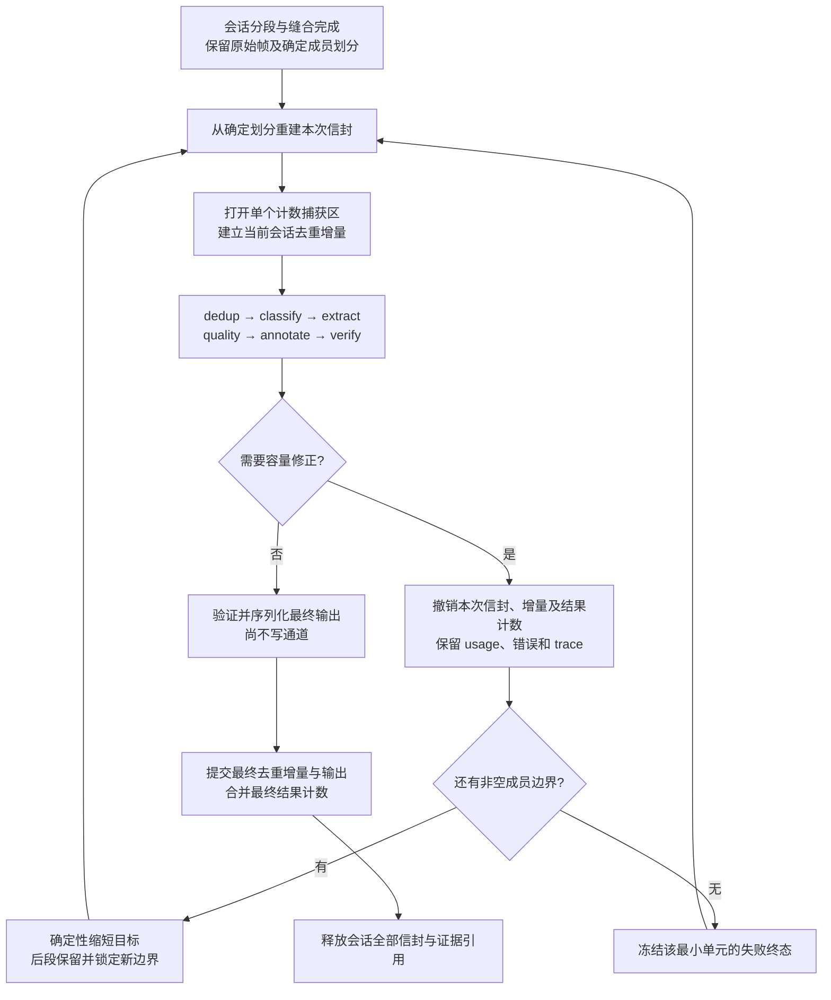

# 序列上下文容量：下游暂存与完整证据设计核对

状态：只读核对后提出的实现方案，尚未实现、未运行 LLM，不能作为验收证据。本文供父任务冻结主规范和分配模块工作，不替代 `docs/CONTRACTS.md`。

## 已冻结的产品边界

固定文件输入保持不变。同一已识别 session 的分段和缝合状态跨读取 batch 保留。读取 batch 不关闭序列；会话结束或容量边界关闭序列。关闭后禁止后续 pass1/repass 合并。

容量修正的最小单元是完整 frame。沿确定的非空成员边界缩短序列，后段保留为后续序列，不丢成员。单帧、固定请求部分或不可缩的调用单元仍然超限时，明确形成失败终态。

完整证据指每个成员的完整输入正文、UI 树及该阶段实际依赖的图像，不允许为预算省略成员、截短正文或摘要、抽取部分图像。配置中所有被启用阶段实际引用的 LLM/embedding profile 必须声明正的 `context_window`。完整性作用范围由主规范按阶段冻结；不得暗中保留当前摘要帽冒充完整原文。

保留普通去重链语义：最终 session attempt 在 dedup 阶段接纳的全部身份一起提交，后续 quality/verify 过滤不追溯重定义去重；失败 attempt 的身份绝不提交。当前 verify 成员手术不重算已生成的 dedup 身份，这条现有规则保持不变。

会话收尾后才统一运行下游；quality 比较池限制在当前 session 内，按既有类规则分池。不引入实时输入、跨进程恢复、状态落盘或跨 session 并行提交。

## 当前实现证明了什么

| 当前入口 | 已核实行为 | 可复用程度 |
|---|---|---|
| `labelkit/common/observability/obslog.py:590`，`capture_counts()` / `merge_counts()` | `ContextVar` 捕获 dataset counter；事件、usage、Schema、熔断和 `budget.*` 实时保留；禁止嵌套捕获 | 可直接复用单个最外层捕获区，必须修正新路径的终态溢出计数时机 |
| `labelkit/orchestration/sequence_workflow.py:1056`，`_transaction()` / `_item()` | 从生成投影重新构造 attempt-local `PipelineItem`，没有通用 clone 接口 | 可借用重建信封的方法；不可直接构造生成专用事务 |
| `labelkit/common/contracts/generation.py:885`，`AttemptTransaction` | 强依赖 `class_views`、`projected_sequences` | 不适合普通 session；不得伪造生成投影来满足类型 |
| `labelkit/operators/dedup.py:535`，`group_reserve()` | 使用独立 `_group_exact` / `_group_lsh` / `_group_vec_*`；任一非豁免重复拒绝整个生成组 | 不能代替普通逐条去重；保留其现有用途 |
| `labelkit/operators/dedup.py:315`，`prepare()` / `probe_prepared()` / `commit_prepared()` | 已分开 CPU 特征计算、查询与写入；普通层仍会在 reduce 时立即写正式索引 | 复用特征、库与判定公式；新增当前 session 增量 |
| `quality.py:826`、`annotate.py:1498`、`verify.py:984` 的 `run_attempt()` | 为生成整组 gate 捕获计数，接受条件是整组通过；部分异常被压成 `accepted=False` | 不直接调用，否则嵌套 capture，且丢失容量错误与逐条终态语义 |
| `labelkit/operators/stream_verify.py:432`，`_route_round()` | 当前轮按确定顺序共享噪声认领集合；修改帧归属、成员、接缝及帧产物 | 可在完整 attempt-local 会话信封上复用，不能分批独立验证 |
| `labelkit/operators/emitter.py:204`，`emit_batch()` | 会验证、改判、写 main/sidecar/rejects、flush、更新累计计数并通知进度 | 不是只读序列化接口；attempt 期间禁止调用 |

现有生成事务的价值是已经证明“新建信封、暂存计数、先验证再提交”的局部分层，不是提供了可无条件套用的普通 session 事务。

## 推荐的最小处理边界

最简重做范围是整个当前 session 的下游，不缓存尝试保留“未受影响”的质量结果。一次成员变化会改变分类路由、去重先后、pairwise 配对、百分位、top_ratio、噪声归属及验证邻域；整会话重建避免增加依赖失效机制。

只重跑下游，不能重新跑自由缝合把容量边界合回去。会话的原始帧与已经冻结的划分是重做来源，不以失败 attempt 的可变 `PipelineItem` 为下一次输入。

终态单元写入确定划分的失败集合；下一次 attempt 从一开始就排除其后续调用，避免反复遇到同一不可缩错误。剩余序列重新经过去重、质量分池和验证。会话尝试最终可以包含成功输出和逐条失败，不要求所有序列都成功。

每次修正必须严格增加不可合回的成员边界，或者增加一个终态失败单元。对有限 session，这给出有限停止条件，不依赖额外可调重试次数。多调用同时超限时，按已声明的阶段、序列、调用顺序选取首个容量事件；先收拢/取消并等待当前任务组结束，再丢弃 attempt，禁止叶任务在下一次 attempt 启动后继续修改旧状态。

## 建议增加的公共接口

以下为实现建议命名，需与主规范和其它模块 owner 一次冻结。接口不得放在 generation 专用契约中。

| 模块 | 建议接口或载体 | 职责 |
|---|---|---|
| `common/contracts/stage.py` | `SessionAttemptScope(session_id, attempt_index)`，由 `RunContext` 携带 | 明确当前调用属于可重做的完整证据 session；统一任务与观察身份，不承载框架业务算法 |
| `common/contracts/types.py` 或独立普通 session 契约文件 | `SessionCapacityFailure(stage, profile, record_ids, unit, error)` | 保留原始 `ContextOverflowError` 的 phase/origin；携带确定的受影响记录与调用单元，参数不超过五个 |
| `common/errors.py` | `SessionCapacityError(failure)` | 在 common 定义容量控制信号，让 operators 通知 orchestration；禁止 operators 反向导入 orchestration |
| `operators/dedup.py` | `DedupStage.reserve_session(batch, ctx)` | 复用完整普通去重判定，在本会话增量上产生暂存判决与引用绑定；不写正式索引 |
| `operators/dedup.py` | `DedupIndex.commit_session(reservation)` / `discard_session(reservation)` | 同步提交/销毁本会话唯一拥有的增量；提交前检查引用绑定和正式前缀版本 |
| `operators/emitter.py` | `prepare_batch(batch, batch_no)` / `emit_prepared(prepared)` | 将最终验证、终态改判和序列化与通道写入分开；仅最终 settled attempt 可以调用后者 |
| 新 `orchestration/session_workflow.py` | 会话下游 coordinator | 独占确定划分、attempt 重建、容量选择、终态集合、增量及提交顺序；避免继续扩大接近文件上限的 `process_workflow.py` |

`SessionCapacityFailure.unit` 的必要区别是目标序列、成对比较、单帧/帧对、固定请求、缝合候选池。具体闭集由主规范冻结；不把候选池超限错误归为任意目标序列已满。

不得通过全局切换 `self.index`、临时替换共享 `MetricsSink.counters` 或保存/恢复整个配置对象实现隔离。一个 session 顺序提交，允许其内部依现有 runtime 并行叶调用。

## 普通去重增量的实现边界

当前普通 `DedupIndex` 和生成 group 索引是两套不同状态；重用 group API 会改变 duplicate、先到先得、簇计数和 exact/semantic 判定，因此明确排除。

推荐在普通索引内部维护一个当前 session 的暂存增量，只存本会话新接纳的 exact 键、MinHash、向量、插入顺序和计簇增量。使用已有 `datasketch.MinHashLSH`、NumPy 与现有特征函数，不增加包，不复制已提交的 LSH/向量大索引。

正式索引与当前增量共同组成查询前缀，必须保留当前判定顺序：先查两边的 exact；再在两边候选中取最大 Jaccard，得分相同按全局输入序；最后按现有参与条件执行 semantic，最大余弦并列保留最早记录。不能“正式索引先命中就返回”，否则正式 near 命中会压过暂存 exact 命中，或选择较差相似度。

`probe_prepared()` 当前还写 `_last_probe` / `_last_similarity`，`_compose()` 会更新 `_last_similarity`。新 session 查询必须把这些临时结果保留在增量/当前调用对象，不能让失败 attempt 的 Record 引用挂在正式索引上。

`DedupStage._counted_clusters` 是运行级集合，也必须采用“已提交集合只读 + 当前新增簇集合”的方式；只捕获 `dedup.clusters` counter 而提前修改这个集合会漏掉下一次成功 attempt 的簇计数。

`scope="global"` 查询已经提交的 session 前缀与当前增量；`scope="batch"` 在本功能下由主规范明确为当前 session 的去重范围，不查询此前 session，且不得调用正式索引的 `reset()` 清掉其它状态。两者均在最终 attempt 完成后才正式结算。

提交的是最终 attempt 在 dedup 阶段接纳的身份与当时特征，即使后续 quality/verify 拒绝该记录。失败 attempt 中曾被当作唯一的记录完全不留痕；这里保留普通链语义，不改成仅对 emitted 数据去重。

语义 embedding 当前 `_embed_input()` 会截取头部（`dedup.py:1140`）。新完整证据路径不得这样处理；超限必须交给容量修正。provider fatal、内部错误不能继续借用普通 semantic 跳过逻辑被掩盖为成功；保持主规范冻结的普通错误终态和 provider 熔断边界。

## 信封重建与可观察副作用清单

`PipelineItem` 没有通用深拷贝接口。`Record` 是 frozen dataclass，但其 `raw`、产物中的 Mapping 并不由 dataclass 自动深度冻结。推荐从原始 `Record` 引用和确定划分重建新信封，而非 `deepcopy` 整个 session、所有图片或大型服务对象。

每次 attempt 新建 `errors`、`scores`、`annotation`、`verification`、`transitions`、成员分类/标注字典、成员状态与噪声归属标记、`stitch_fragments` 等可变容器。只读原始 Record 和 ImageRef 可以共享；带 dict 的片段表不能在不同 attempt 之间共享可变对象。

多标签扇出只在同一个 attempt 内共享 Record、dedup 和成员产物字典，继续遵守 `classify._fan_out()` 的首标签执行门；不得共享到原始基线或下次 attempt。

| 副作用 | attempt 期间的归属 | 最终结算 |
|---|---|---|
| 成员状态、噪声认领、成员手术、接缝重建 | 本次新建的全部会话信封 | 最终 attempt 留用；失败 attempt 整体丢弃 |
| classification、fanout、quality scores / selection、annotation、frame products、verification | 本次信封及本次质量池 | 全会话重做，不混用旧结果 |
| dedup exact / MinHash / semantic / 插入序 / cluster 集合 | 当前 session 增量 | 最终 attempt 同步提交 |
| `counts.*`、`dedup.*`、`quality.*`、`classify.*`、`extract.*`、`verify.*`、frame 结果计数 | `capture_counts()` 的当前捕获区 | 仅最终 attempt 合并一次；源输入/分段事实不能每次重新累加 |
| `budget.overflow_records` | 当前实现实时保留，不适合把一次容量修正直接算成最终失败记录 | 新容量控制路径在被记录级失败转换前上抛；只在最小单元最终失败结算该计数 |
| usage、provider 请求/错误、Schema 调用与 resolved_at、runtime 耗时、任务取消、重试 | 真实运行事实，实时保留 | 不回滚；报告必须区分运行成本与最终数据结果 |
| provider 熔断状态、校准器观测 | 真实运行状态 | 不做快照回退；可修正容量事件不要提前执行旧的“反应式超限终态喂熔断” |
| trace、日志、进度事件 | 保留全部 attempt 事实 | 事件能关联 session/attempt；废弃结果不能被显示为正式成功交付 |
| `_collect_quality_stats()` 的累计直方图、`_output_lines` / `_rejects_lines`、emitter 累计 totals | attempt 阶段不调用相应更新入口 | 最终准备/写出后只结算一次 |
| main、sidecar、rejects | attempt 阶段不写 | 最终 settled attempt 才写；rejects 当前并非临时输出，尤其不能提前调用 emitter |

已有 `MetricsSink.capture_counts()` 对子任务通过 ContextVar 继承有效，不需要复制 MetricsSink。以它包住整个 session 下游，直接使用适配后的普通 `run()`，不嵌套 generation 的 `run_attempt()`。

同步工程 postprocessor 已有“不依赖全局递增状态、墙钟、未固定随机源或网络/文件副作用”的契约；它可能因新的模型候选再次调用。继续复用其输入/输出深拷贝与终态错误逻辑，不声称会话事务能回滚任意 Python 外部副作用。依据：`SPEC-annotation-postprocessing.md:88-99`。

## 完整证据请求与预算检查

当前四处成员摘要渲染分别位于 `classify.py:297`、`quality.py:487`、`annotate.py:197`、`verify.py:273`；其默认摘要帽和中间成员截断不能在新完整证据路径继续使用。

建议新增一个 common 层的纯序列证据渲染器，例如 `common/inference/sequence_evidence.py`，只负责把完整有序成员和惰性图像引用变成文本/Parts。classify、quality、annotate、verify 复用同一成员内容表达，分别叠加本阶段指令、Schema、步骤、标注结果与修复信息。不是新的配置层；它消除现有多份摘要实现的语义漂移。

| 阶段 | 当前需要替换的路径 | 新路径的完整性要求 |
|---|---|---|
| classify | `_sequence_digest_block()`、`_sequence_record_parts()`、`_classify_prompt()`；帧分类 `_plan_frame_episode()` 使用短摘要 | 序列分类含全部成员证据；帧分类可分窗口执行，但每个窗口内成员证据完整，所有成员都有唯一结果 |
| extract | `_extract_transition_outcome()` 在超限时可能走机械替代 | 相邻两帧是独立最小调用单元；完整两帧放不下应明确容量失败，不能换成机械结果冒充完整证据摘取 |
| quality | `_sequence_parts()`、`_fit_step_body()`、`_call_fit()` 和 `_Attempt.degrade()`；pairwise 超限目前变平局 | 保留全部步骤与成员输入；成对请求保留两侧完整证据；超限先交 coordinator，不能作为 tie 继续影响排名 |
| annotate | `_sequence_parts()` 的关键帧采样、`_member_digest_lines()`、`_trim_pack()`、`_degrading_call()`；帧 prompt 裁树 | 所有成员均入请求，所有依赖图像均保留；不裁正文/树/步骤，不动态减少关键帧；完整修复后缀照常计价 |
| verify | process 序列 `_build_defect_sequence_prompt()` 仅首末截图，`_fit_sequence_parts()` 裁步骤 | 本次完整成员证据、完整步骤/片段结构/边界证据及完整标注结果全部计价；不能裁标注 JSON 或已有修复证据 |
| dedup semantic | `_embed_input()` 在向量化前截正文头部 | 不截断完整去重文本；只对可缩目标序列触发容量修正 |

图像仍使用现有 profile 中明确的部署表达口径 `default_image_px` / `max_image_px` 和 `ImageRef.load_base64()`；不能在遇到容量错误后再偷偷降清或删图。如果主规范把“完整图像”定义为原始像素，则需要单独改变当前部署图像规范，不能把现有缩放说成原像素保真。

如果完整证据要求某个序列阶段接收全部 UI 图像，必须同步配置的 `supports_vision` 能力矩阵。当前 quality 的序列路径不发图；不能在保留允许纯文本 profile 的同时悄悄加入所有图像。真实本地文本 4B 门禁不能证明 UI 视觉模型效果。

复用 `budget.input_budget()`：`context_window - max_output_tokens - margin`，其中余量是现有 `max(256, ceil(0.10 * context_window))`。结构化 Schema、system、few-shot、图像、标注 JSON、修复后缀都必须在实际请求口径中计价；最终仍走 M9 `_check_budget()`。

静态预检只检查可知的固定部分和已知成员证据，不能证明未来 extract 文本、annotation 结果或 postprocessor 输出必然放得下。实际 provider `ContextOverflowError` 仍进入下述有界修正；`OutputTruncatedError`、Schema 错误、hook 程序错误和一般 HTTP 400 不得伪装成同一种容量事件。

## 实际超限如何重做

容量控制信号必须保留原 `ContextOverflowError` 的 `phase`、`profile`、`origin`，并由发出请求的算子附上确切目标 `record_ids` 与调用单元。不能仅在所有阶段结束后遍历英文 `StageError.message` 猜测原因。

普通记录路径现在会把超限变成 `failed`，quality pairwise 会变成 tie，extract 可变成机械替代。新 session scope 必须在这些转换之前把容量控制信号交回 coordinator。算子仍负责正常的 schema/provider 归类；只改变容量可修正边界。

| 超限来源 | 允许的修正 | 不能做的事 |
|---|---|---|
| 已知目标序列的 classify/quality pointwise/annotate/verify/semantic 请求 | 沿确定成员边界分为非空前后段，保留后段，重建整个 session 下游 | 删除后段，或把超限的现状标为成功归档 |
| quality 的实际双序列请求 | 在参与此次调用且仍可缩的序列中按确定顺序选一个缩短；重新建立整个 session 质量池 | 只重算一对分数，保留旧排名/阈值选择 |
| verify 手术后标注/复查超限 | 废弃当前 attempt 的手术/claims，按基线确定划分缩短后重做；新容量边界约束后续手术接纳 | 沿用失败 attempt 的噪声归属，或重新把容量边界两侧成员合回去 |
| 单帧标注、不可缩帧对、固定 system/Schema/few-shot、最小可发双侧池仍超限 | 冻结受影响单元的失败终态，其它序列继续 | 无限重试、误删其它无关序列、把失败换成成功占位 |
| stitch 候选池请求超限 | 由上游缝合规范处理该固定调用单元 | 宣称任意目标序列已满并直接送下游 |

确定性选择必须由主规范冻结。例如多目标时使用原会话成员顺序选取首个可缩目标；每次保留非空前缀并把尾部完整成员移至后段。可选二分以减少尝试次数，但不能依赖模型返回的任意新边界。最终身份与片段/接缝重建公式归上游公共契约，父任务必须核对同一次拆分的主输出、trace 和成员谱系一致。

当前反应式 400 的终态熔断由算子 `_feed_reactive_terminal()` 触发；容量修正期间尚不是终态，不能先喂一次再回滚。M9 已保留实际请求事件；无法继续缩短时再按现有 origin/phase 规则结算一次。取消与 provider fatal 原样终止会话/运行，不进入容量拆分。

## 提交与 I/O 失败边界

尝试期间零正式输出。最终 settled attempt 先运行 emitter 的完整校验和纯序列化，形成主行、sidecar 行、reject 行及对应终态计数；此时还能把序列化失败改判为真实失败，不能调用 LLM 或重新打开成员边界。

正式提交阶段不再有容量重试。先预检增量绑定和提交 shape，再同步提交去重增量、写入已准备输出并结算统计，整个同步段不能插入可取消的 await。开始通道写入后，I/O 错误沿既有 run 级不可交付路径结束，禁止倒回 attempt 重发。

这不构成操作系统级原子事务：内存索引提交和多个文件写入无法无条件原子化，`emit_batch()` 当前也承认 `.part` 可能有半行。主规范必须保留真实 I/O 限制，不能宣称“进程退出也完全回滚”。本次需求是防止容量重做污染正式结果，不是增加 checkpoint/数据库/新的磁盘日志。

拒绝通道当前直接写正式 rejects 文件。它只能在所有容量修正完成后写；若希望 I/O 失败时 rejects 也原子保存旧版本，这是独立交付契约变化，不能由本次 attempt 设计暗中承诺。

## 精确修改清单

| 责任模块 | 生产修改范围 | 相应验证 |
|---|---|---|
| `labelkit/orchestration/process_workflow.py` | 分流到会话 coordinator；将统计、emitter 和结果清点移到最终提交；更新 dry-run、batch/session 含义、limit/中断残差 | 原 workflow 回归与新会话状态测试 |
| 新 `labelkit/orchestration/session_workflow.py` | attempt 重建、确定拆分、terminal 集合、完整会话 verify、提交生命周期 | 新 `tests/orchestration/test_session_workflow.py` |
| `labelkit/common/contracts/stage.py`、普通 session 契约与 `common/errors.py` | 作用域、容量失败载体、暂存结果接口；不复用生成类型 | 载体不可变性、错误归因、跨层依赖测试 |
| `labelkit/operators/dedup.py` | 当前会话增量、纯查询合并、簇增量、完整 embedding 输入、commit/discard | `tests/operators/test_dedup.py` 与新增 session dedup 回归 |
| `labelkit/common/observability/obslog.py` | 复用 capture；明确 attempt 关联与终态容量计数时机 | `tests/common/observability/test_obslog.py` |
| 新 `labelkit/common/inference/sequence_evidence.py` | 完整成员正文/UI 树/图像的单一纯渲染入口 | 新完整证据纯单元测试 |
| `labelkit/operators/classify.py` | 完整序列和逐帧分类证据；容量错误上抛；扇出新边界标记复制 | `tests/operators/test_classify.py` / 帧分类既有测试 |
| `labelkit/operators/extract.py` | 完整帧对、容量与最小单元错误不落机械替代 | `tests/operators/test_extract.py` |
| `labelkit/operators/quality.py` | 会话分池入口、完整一侧/双侧 prompt、不裁剪不溢出平局、错误目标定位 | `tests/operators/test_quality.py` |
| `labelkit/operators/annotate.py` | 完整成员与全图、去除新路径预算裁剪/抽图、完整帧证据与修复 | `tests/operators/test_annotate.py`、后处理回归 |
| `labelkit/operators/verify.py`、`stream_verify.py` | 完整证据、完整会话边界/claims、容量边界约束、错误上抛与手术重做 | `tests/operators/test_verify.py`、stream verify 回归 |
| `labelkit/operators/emitter.py` | 验证/序列化和写入分离；仅最终准备结果写出；帧沉没产物统计 | `tests/operators/test_emitter.py`、I/O 失败回归 |
| `labelkit/common/config/_constraints.py` 及受影响模型/解析入口 | 用现有 `_collect_referenced()` 及有效类视图收集实际 profile；正上下文硬检查、完整 UI 证据能力矩阵；淘汰失效抽样配置 | 配置聚合错误、keyless validate/dry-run |
| `labelkit/common/inference/budget.py`、`llm_client.py` | 复用预算公式与 M9 终检；仅按新证据布局补齐静态估算和必要的可复用检查入口 | 预算一致性与真实最终请求内容检查 |

主规范同步面：`docs/CONTRACTS.md`、`spec/20-ch2-overall-design.md`、M1/M3/M4/M5/M7/M10/M11/M12/M13/M14/M15/M16 对应 `spec/*.md`、新的容量开发规范、`docs/manual/` 与 `docs/dev/E2E-FINDINGS.md`。新开发规范定义本地 4B 使用范围与证据，不能沿用只授权旧功能的文字。`AGENTS.md` / `CLAUDE.md` 更新必须 byte-identical。

实现深度按照父任务冻结的完整证据矩阵执行；上表不是允许将任何项目悄悄后移的清单。当前 `annotate.py`、`quality.py`、`process_workflow.py` 接近文件行数上限，拆出公共证据和会话 coordinator 应同时避免扩大这些文件。

## 必须覆盖的语义测试

| 场景 | 必须观察的结果 |
|---|---|
| 一条自然任务跨多个读取 batch | 成员有序无遗漏，batch 不关闭序列，输出一次；不同 session 不合并 |
| 实际下游长度错误发生在 dedup/quality 之后 | 正式索引、已计簇、正式数据统计和所有输出通道完全不变；重做后仅最后 attempt 结算 |
| 最后新增成员使实际请求超限 | 前缀与后段都非空，后段随后被处理；已有容量边界不可重新合并 |
| 单帧原文或完整树超限 | 明确失败一次，没有空序列、无限重试、正文截断或成功占位 |
| 质量双侧溢出或一次拆分改变类分池 | 整个受影响 session 重新配对/评分/门控，旧分数和旧 top_ratio 不泄漏 |
| 正式 near 命中与增量 exact 命中同时存在 | exact 仍优先；near/semantic 跨两侧选择最大匹配，并列保留最早输入 |
| 被下游拒绝的唯一记录 | 最终 attempt 的 dedup 身份按原链语义提交；废弃 attempt 的同类身份不提交 |
| 跨原 batch 的噪声争用与 verify 手术后超限 | 一个帧最多一个 owner；废弃 claims/成员字典无泄漏；最终边界/接缝/帧产品对齐 |
| 多标签、frame classify/annotate、后处理 | attempt 间容器隔离；同 attempt 首标签共享语义保留；代码字段不进入模型 schema；后处理错误不走容量修正 |
| 完整证据中间与末尾的独特值 | 实际最终请求中均可找到完整值；无 `truncated` 占位、无缺成员、无抽图；模型输出能证明关键中间事实被使用 |
| precheck 与真实 provider reactive 两类超限 | 归因明确；可修正期间不计最终 failed；usage/error/trace 不回滚；终态熔断最多结算一次 |
| 并发叶调用尚未结束时准备重做 | 旧任务全部收拢/取消完成，下一 attempt 无旧状态突变或旧计数合并 |
| limit、EOF、SIGINT、熔断、输出写入失败 | 完成会话与未完成残差可对账；不会半条成员序列交付；I/O 失败不回到容量重做 |
| batch 去重与 global 去重、固定 seed 重跑 | session 范围和正式前缀明确；相同确定划分生成相同配对计划，模型非确定性不得冒充框架确定性 |

禁止 mock LLM server、transport 或 recorded response。纯渲染/增量/状态机验证不需要伪造 LLM；实际容量失败注入与成功路径通过真实端点完成。新功能最终必须完成 Uncle Bob review，覆盖错误地提前提交、删后段、允许重并、吞超限为 tie、复用旧质量池、遗漏中间证据等行为破坏。

## 本地 Qwen3.5-4B 验证切面

新门禁复用 `tests/integration/test_postprocessing_local_llm.py` / `test_execution_runtime_local_llm.py` 的真实 endpoint、应用入口与独立输出检查方法，不复用返回值、不替换模型响应。

真实文本路径至少覆盖：一条 session 跨小读取 batch 的接续；完整中间事实标注；真实 annotate 与 verify；一次容量修正后保留后段；前 session 提交后后 session 重做不污染 global dedup；帧标注与确定性后处理同步。输出检查应从原始输入成员集合、最终成员集合与正式统计独立重算，不只断言命令通过。

预检超限门禁通过低配置预算和真实最小片段成功推理证明“缩短后确实执行了真实模型”。实际 provider 超限必须另有真实证据：在明确记录的本地 server 实际上下文与声明预算不匹配条件下触发真实容量错误，缩短后由相同真实 endpoint 成功完成。它是专门失败注入条件，不能把错配配置当推荐配置，也不能用预检失败冒充 provider 失败。

本地 server 起动后必须检查健康与新日志；共享单并发实例有在途用户请求时不能抢占。门禁应记录模型文件、server build、实际启动上下文、profile 声明窗口、真实错误形态、usage、attempt 身份和最终独立检查结果，不打印凭据。

UI 全图请求先做实际序列化前完整性检查，再按主规范列出真实视觉端点门禁；纯文本 4B 通过不代表 UI 完整证据效果已经验收。DeepSeek / z.ai 现有 release gates 仍须运行，新增本地证据不替代它们。

## 未执行事项

本文只增加这份研究方案，没有生产修改、测试执行、LLM 调用、提交或推送。接口名称、公共载体、输出身份和上游容量边界算法仍需由父任务与主规范统一冻结后实施。
