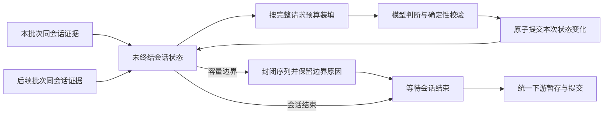

# 序列上下文容量与跨批次缝合：行业依据

核对日期：2026-09-09。本文是主规范的研究依据，不替代行为契约，也不代表功能已经实现或通过验证。
外部资料只采用官方文档、维护者源码和原始论文；仓库事实记录本次开发前 HEAD 56a0ea1 的快照。
功能现状以开发规格及验收记录为准；下方旧实现分析不描述改造后的行为。

## 核心结论

成熟系统会把处理批次、会话状态和最终输出分开。批次结束可以暂停计算，却不必结束会话。
这个原则适用于 LabelKit，但时间窗口聚合不能直接提供目标导向任务的语义缝合能力。

一次完整理解也必须区分两件事：完整证据进入一次模型请求，以及模型正确利用全部证据。
前者可由请求内容、容量检查和调用记录验证；后者只能通过真实任务评测检验，不能由窗口大小推导。

图中的状态仅描述一次运行内的生命周期。跨批次状态不等于跨进程恢复，也不要求引入持久化服务。

## 已验证的行业事实

| 成熟方案 | 一手资料确认的能力 | 对本次设计的意义与边界 |
|---|---|---|
| Spark Structured Streaming | State Store 明确承载跨批次有状态运算；更新以事务集合提交，并产生新版本 | 批次不是状态的寿命；LabelKit 可采用提交原则，无需复制分布式状态服务 |
| Flink session windows | 后到事件可桥接并合并既有会话窗口；迟到重算的输出属于先前结果的更新 | 如果先输出未终结序列，必须承担更正语义；时间间隔规则仍不同于任务语义判断 |
| ksqlDB window aggregation | grace period 限定后到事件接纳范围；持续更新与 `EMIT FINAL` 分别对应中间结果和最终结果 | 最终输出需要明确终结条件；批次耗尽和业务完成不能混同 |
| LlamaIndex PromptHelper | 从窗口中扣除提示词与输出预算，再重装填文本块；也另有截断能力 | 可以借鉴完整请求预算装填；其截断能力不符合保留全部序列证据的要求 |

来源：[Spark State Store](https://spark.apache.org/docs/4.0.3/streaming/apis-on-dataframes-and-datasets.html#state-store)、
[Flink 窗口与迟到重算](https://nightlies.apache.org/flink/flink-docs-stable/docs/dev/datastream/operators/windows/#late-elements-considerations)、
[ksqlDB 时间、窗口与最终输出](https://docs.confluent.io/platform/current/ksqldb/concepts/time-and-windows-in-ksqldb-queries.html)、
[LlamaIndex PromptHelper 维护者源码](https://github.com/run-llama/llama_index/blob/main/llama-index-core/llama_index/core/indices/prompt_helper.py)。

Anthropic 的计数接口接受与消息创建一致的结构化输入，包括 system、tools、图片和 PDF；
官方仍明确称计数为估计值，实际消息创建可能有小幅差异。
这支持“预先计数或估算，并保留端点实际溢出处理”的设计，不能证明任何启发式余量绝对安全。
来源：[Claude token counting](https://platform.claude.com/docs/en/build-with-claude/token-counting)。

HTTP 错误码不能单独作为上下文溢出的证据。例如 Anthropic 的 `413 request_too_large` 表示请求字节数超限。
授权错误、限流、服务失败、输出截断与输入上下文溢出也不是同一故障。
来源：[Claude API errors](https://platform.claude.com/docs/en/api/errors)。

## 开发前仓库事实与复用范围

| 已有能力 | 当前证据 | 复用边界 |
|---|---|---|
| 依赖声明 | `pyproject.toml` 已有 `httpx`、`jsonschema` 等；没有 Spark、Flink、Kafka、LlamaIndex 或 tokenizer 依赖 | 沿用现有传输和 Schema 校验；本次研究没有发现引入大型框架的必要性 |
| 输入预算 | `input_budget` 扣除 `max_output_tokens` 与 `margin`；`est_prompt` 汇总消息文本、图片、消息开销和上行 Schema | 扩展必须继续使用统一完整请求口径，不能仅对帧正文算容量 |
| 文本估算 | `est_text` 按字符类别估计 token；并非目标模型 tokenizer | `margin` 是估算缓冲，不能宣称它为所有模型和语言提供严格上界 |
| 装填 | `pack_windows` 同时受预算和帧数 `cap` 限制，相邻窗口有一帧重叠，并强制最少两帧 | “装得下就合并更多证据”的新要求不能仅凭调用此函数宣称已经满足；需核对上限和最小窗口契约 |
| 实际溢出处理 | `segment` 已有仅针对 `reactive` 溢出的有界二层对半拆分；`precheck`、最小窗口和层数耗尽进入终态 | 这是现有机制证据；新的适用范围、边界所有权和重试记账必须由主规范冻结 |
| 跨批次范围 | `process_workflow` 仍按 `batch_size` 硬切超长会话；`StitchStage.run` 处理本批次同会话 episode | 本次研究时，跨批次会话状态和延后最终输出尚不是现有行为 |

仓库来源：[依赖声明](../../../pyproject.toml)、[预算公共实现](../../../labelkit/common/inference/budget.py)、
[模型请求终检](../../../labelkit/common/inference/llm_client.py)、[分段实现](../../../labelkit/operators/segment.py)、
[缝合实现](../../../labelkit/operators/stitch.py)、[批次驱动](../../../labelkit/orchestration/process_workflow.py)、
[既有上下文预算契约](../SPEC-context-budget.md)。

若需要更贴近端点的计数，成熟的 provider 计数接口和 Hugging Face tokenizer 都是可调查候选。
Hugging Face 官方说明聊天消息需要通过模型的 chat template 转换并分词；只对正文调用通用 tokenizer
不能代表实际聊天请求。它们目前不是 LabelKit 已有依赖或统一支持的接口；本次不据此新增配置或网络调用。
来源：[Hugging Face chat templates](https://huggingface.co/docs/transformers/main/chat_templating)。

## 应由主规范冻结的设计不变量

下表是基于上述事实对 LabelKit 的设计推导，不是外部产品替 LabelKit 作出的语义保证。
本次主任务已明确采用固定输入文件集、单次进程运行；会话拥有语义状态，batch 只负责计算分组。
容量封闭后的序列不再参与缝合，并保留容量边界原因；整个会话结束后统一执行下游暂存与提交。

| 不变量 | 必须明确的行为 | 可验证证据 |
|---|---|---|
| 批次与会话分离 | 同一次运行、同一会话的未终结状态可跨批次保留；不同会话严格隔离 | 只改变 `batch_size` 的输入实验，检查归属、顺序、计数与输出 |
| 最终序列只处理一次 | 容量封闭后不得再次合并；会话结束后统一进入下游暂存与提交 | 后续批次到达后，检查容量封闭序列未被重开，没有重复标注、重复输出或遗留旧序列 |
| 成功才更新状态 | 候选判断、机械先验和完整校验全部成功后，原子提交成员归属、序列内容和相关计数；会话重算须撤销此前暂定变化 | 在判断、校验与提交前注入故障，确认状态和归属没有半更新 |
| 同会话有序 | 同一会话的后续判断只能观察上次成功提交的状态；并发仅用于相互独立的工作 | 改变任务完成顺序，确认状态演进与最终数据不受调度影响 |
| 容量按完整请求决定 | 预算包含指令、序列证据、状态、候选、Schema、媒体和输出预留；有效容量内尽量保留完整证据 | 检查实际发出的请求，证明没有被旧帧数或条数上限提前切断 |
| 拆分严格缩小问题 | 已构造完整请求终检超限或端点明确上下文溢出时，在提交前按确定性的非空完整成员帧边界拆分并重算会话；每次严格缩小 | 极小窗口、单个超大成员、固定指令或 Schema 超限实验必须明确终止且不丢成员 |
| 拆分不冒充完整理解 | 多次子请求的结果不能标成一次模型看过完整序列；重叠证据只能有一个最终归属 | 请求跨度与最终成员集合逐项对照，区分上下文重叠和重复数据 |
| 状态有界且可结算 | 清理时机、内存上限、输入耗尽和中断残差均须明确定义；资源限制不能伪装成自然业务终结 | 超长会话和中断实验，检查保留量、释放、残差与终态记账 |
| 失败分类真实 | 估算超限、端点上下文超限、输出截断和普通 provider 错误分别处理 | 检查异常类型、拆分触发条件、请求次数和报告计数 |

“一次请求看完整序列”只对实际完整请求能容纳的序列成立。输入超过端点容量时，必须明确暴露拆分或失败事实。
有界拆分能保全数据、推进任务；它不能保证各子请求获得一次全局判断的语义质量。
静态完整证据估算可以提前形成容量边界；最小拆分单位是完整成员帧，不是原 segment 片段，不裁剪帧内容。
单成员不可再拆或固定指令、Schema 本身超限时明确终止；HTTP 413 等非 token 容量错误不得触发拆分。
终止性可以由切点集合证明：会话成员有限，每次重算必须新增一个此前不存在的有效成员边界，已有容量边界不被移除。
含 N 个成员帧的会话至多有 N−1 个内部切点；不能增加切点时进入明确终态，禁止用相同请求无界重算。

## 不采用的替代方案

| 替代方案 | 不采用的原因 |
|---|---|
| 仅增大 `batch_size` | 仍把资源切批与序列边界绑定，无法覆盖任意长会话，也没有最终输出契约 |
| 只给相邻批次加固定重叠 | 能补相邻关系证据，不能覆盖任意距离的任务回归；还需要解决重复归属 |
| 先输出，稍后再拼接已标注行 | 缝合后上下文和序列属性可能改变；行拼接无法补做遗漏的整体判断，并引入撤回语义 |
| 无上限保留全部会话 | 不满足单机批处理的资源边界，也没有清理和中断结算保证 |
| 把任何请求失败都当作容量不足 | 会掩盖认证、服务和程序错误，产生无意义的拆分请求 |
| 摘要、LLMLingua-2 或仅保留检索片段 | 删除证据后不能保证所有事件与关系仍存在；可作为不同质量目标的方案，不能替代完整证据要求 |
| 用 prompt caching 扩大窗口 | 缓存 token 仍属于总输入，只减少重复前缀的成本和延迟 |
| 用 context parallelism 保证语义理解 | 可以分布同一序列的计算并保留全局注意力，但不能自动提高模型的有效理解长度 |
| 新增 Spark、Flink、Kafka 或 LlamaIndex 运行时 | 当前已有预算、模型客户端和阶段执行机制；只采用相关设计原则即可，无证据需要新增部署系统 |

LLMLingua-2 逐 token 作保留或删除判断，其论文中的忠实性不等于信息无损。
来源：[LLMLingua-2 原始论文](https://arxiv.org/html/2403.12968v2)。
Anthropic 明确把缓存读取 token 纳入总输入；NVIDIA 的 context parallelism 则通过跨 GPU 交换整条序列的 key/value
缓解计算和显存压力。这些机制均不能证明模型完整理解全部关系。
来源：[Claude prompt caching](https://platform.claude.com/docs/en/build-with-claude/prompt-caching)、
[NVIDIA context parallelism](https://docs.nvidia.com/megatron-core/developer-guide/latest/user-guide/features/context_parallel.html)。

## 验收证据边界

真实本地模型验证应分别记录：实际请求跨度与估计预算、provider 接受与真实 usage、输出解析、成员完整性与唯一归属、
跨批次状态提交，以及有明确答案的语义判断。小模型完成几个例子只证明这些例子的行为，不能证明任意长序列语义无损。
不同窗口或拆分策略必须用同一份原始序列比较，保留失败样本；不能把 Schema 合法或成员未丢当作语义正确。

本文未运行模型、未读取凭据、未验证 provider 的实际溢出格式，也未修改生产代码和主规范。
