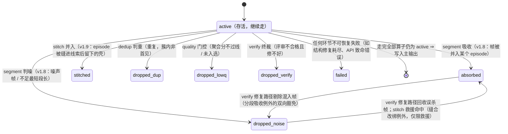

# 第 4 章　核心概念：记录、批、状态与流水线

> 本章是全书的「语法书」：记录如何获得身份，批如何流动，状态如何变迁，算子开关有哪些合法组合。
> 后面每一章都建立在这些概念上，值得慢读一遍。

## 4.1 记录（Record）：流水线上的最小单元

**一条记录 = 流水线处理的最小数据单元。**

- 文本模态下，记录 = 输入 JSONL 的一行；
- UI 模态下，记录 = 一对文件（`uitree_<N>.jsonl` + `image_<N>.png/jpg`）。

每条记录在进厂时（ingest 算子）拿到一个**确定性 id**——16 位十六进制字符串：

- 文本模态：`sha256(整行 JSON 的规范化序列化)` 取前 16 位。规范化 = 键排序、紧凑分隔，所以**内容相同的两行，无论出现在哪个文件第几行，id 必然相同**；
- UI 模态：`sha256(树文件字节 + 图像文件字节)` 取前 16 位。

id 贯穿一切：主输出的 `_meta.id`、拒绝通道、trace 事件里的 `record_ids`，全都用它指代记录。你可以拿着一个 id 在各个产物文件之间对账。

记录本体是**不可变**的——去重不改它，打分不改它，标注是「另附标签」而不是改写原文。唯一会动到「已产出标注」的是 verify 的修复路径（第 13 章）。

## 4.2 状态机：每条记录的一生

每条记录在流水线上背着一个状态牌，从 `active` 出发，只会发生这些变迁：



两个 v1.8 新状态只在开启分段算子（流模式，第 25 章）时出现：`absorbed` 表示这条帧记录被吸收为某个 episode（序列信封）的成员——它不进主输出也不进拒绝通道，账记在序列信封名下；`dropped_noise` 表示这一帧被判为噪声（弹窗、误触等插入帧）或所在段不足最短段长而被剔除，进拒绝通道。v1.9 新状态 `stitched` 只在再开启缝合算子（第 26 章）时出现：一个 episode 被缝进另一条线索后，成员已转移到幸存信封名下，原信封成了「壳」——壳既不进主输出也不进拒绝通道，仅计数（`counts.stitched`）。

三条铁律（出自 Stage 契约，spec §4.3）：

1. **仅处理 active 条款**：算子只处理 `active` 的记录——被前面算子淘汰的，后面算子看都不看（也就不再为它花钱）；
2. **不删元素条款**：算子永远不从批里删除元素，只改状态——账目因此永远算得平。v1.7 起有一个**只增不删**的例外——**多标签扇出例外**：分类算子在 `classify.assignment = "multi"` 下可向批**尾部**追加扇出的兄弟信封（一条记录命中多个类别时每类一个信封），既有元素仍一个不动（第 24 章）。v1.8 又添一个同族的**分段吸收例外**：分段算子可把批内成员帧信封置为 `absorbed` / `dropped_noise`，并向批尾追加以这些成员拼装的序列信封（每帧至多被一个 episode 吸收）；verify 的缺陷修复路径还可在本批内把成员帧状态在 `absorbed` 与 `dropped_noise` 之间**双向**改写（回收误杀帧 / 剔除混入帧）——这是「状态只进不退」的唯一反向豁免，且永远不会把成员翻回 `active`（第 25 章）。v1.9 再添**缝合改绑例外**：缝合算子把被并入线索的 episode 信封置为 `stitched`（壳）、幸存信封的成员集重绑为两方成员按序合并，救援命中时还可把过短被剔的收尾帧从 `dropped_noise` 翻回 `absorbed`——这是分段吸收例外的双向豁免在缝合算子上的延伸，仅限救援命中（第 26 章）；
3. **失败不逃逸条款**：单条记录的失败绝不升级为整批失败——异常被收进该记录的 `errors` 列表，状态置 `failed`，运行继续。

最终去向：`active` → 主输出；`dropped_*` / `failed` → 拒绝通道（按 `output.rejects` 档位落盘）；所有状态计数 → 报告。于是有了那条**守恒恒等式**：

```
emitted + dropped_dup + dropped_lowq + dropped_verify [+ dropped_noise] + failed + bad_input [+ absorbed] [+ stitched]
  = scanned + generated [+ fanout] [+ episodes]
```

序列生成把一条最终 sequence 作为一个流水线信封；成员事件只存在于 main 的成员视图和 stream 工件，
不加入普通 process 守恒式。它另在 `report.generate.sequence` 中精确对账 sets、sequences、primary/noise/replay
events、stream rows，以及由可见 primary branch 与交织布局派生的 session 数。分段产生的 `absorbed`、
`dropped_noise`、`episodes`，以及缝合产生的 `stitched`，
仍只属于 process stream 模式。熔断或流模式优雅中断时，普通守恒式还可能出现 `unprocessed`。

## 4.3 批（Batch）：流动与屏障

记录不是一条条流过流水线，而是**成批**流动（`run.batch_size`，默认 256）。v1.19 的 execution runtime 不改变
业务屏障，只统一每个屏障内的任务接纳与结果归并：

- **同一算子内，纯叶任务有界并发**——任务可乱序完成，但共享 item/index 只按输入序归并；
- **算子之间，批内串行（屏障）**——一批必须整体走完去重，才整体进入打分。
- **profile 之间独立接纳**——低容量 profile 排队不会占住另一个 profile 的接纳名额。

stitch 是一个有状态算子的具体例子：同一会话的候选必须逐个推进，但不同会话的当前候选会组成一轮 wave；结果仍按
会话声明序归并。sequence 的 declared slot 则先串行完成 baseline，再并发彼此独立的 counterfactual suffix，最后按
variant 声明序归并。两者都不会把依赖上一状态的同键步骤错误地并发化。

普通 semantic dedup 是一个明确的投机点：静态 participating 的记录先并发取得 embedding，再按输入序从 exact 层
到 semantic 层重验证。后来被 hash 或较低 ordinal 淘汰的 embedding 不改数据，但已经发生的 usage/retry/breaker
仍是运行事实。

为什么要屏障？因为 pairwise 质量打分需要「同一批的记录互相比较」（第 10 章），批不齐没法比。这带来一个你必须记住的推论：

> **批 = pairwise 打分的比较池。** `batch_size` 不只是内存/吞吐参数，它直接决定质量分的统计口径。pairwise 分数是「批内相对排名」，批间不可直接比较。

批走完最后一个算子就**立即落盘并释放内存**。普通路径任意时刻仍只有一个批的中间态（外加全局去重索引与
flat 回流子批）。sequence 不采用普通批：它有一个从当前声明序 head 开始的连续候选缓冲，完整 attempt 可跨槽并发，
但 dedup 重验证、CrossView frontier、retained 累加和内存 commit 只在短的无 await 临界区按声明序执行。

## 4.4 运行（Run）：一次进程的生命周期

一次 `labelkit run` = 读入 → 分批处理 → 写出 → 退出。要点：

- **可复现**：所有随机行为（配对采样、顺序随机化、种子抽样）都由 `run.seed` 播种的伪随机数发生器驱动；temperature 默认 0。同输入 + 同配置 + 同 seed，除 LLM 服务端本身的非确定性外，流程路径完全一致。
- **原子输出**：主输出先写临时名（`*.jsonl.part`），全部完成后 fsync + 原子改名。你永远不会读到半截的主输出文件。
- **增量落盘**：每批处理完即追加写出并 flush。两种中途结束的语义不同：**熔断**（退出码 4）时报告照常写出（以 `exit_code: 4` 体现，`interrupted` 保持 `false`），但主输出不改名交付（`.part` 留在原地）；**优雅中断**（SIGINT/SIGTERM）时停止取新批、当前批最多等 30 秒，随后正常收尾——已完成批的主输出照常 fsync + 原子改名交付，报告标记 `interrupted: true`。
- **熔断器**：连续 `run.fatal_error_threshold`（默认 20）次不可恢复的 API 错误会触发熔断，以退出码 4 终止——防止对着一个坏掉的端点把整个任务的钱烧完。两个细则：**认证类错误（401/403）第一次出现就立即熔断**（凭据坏了不会自愈）；重试耗尽的调用同样计入连续窗口。任何一次成功调用都会清零计数。v1.11 再补一组细则：上下文预算（第 6 章）拦下的超窗记录（`context_overflow` 的预检与最小单元形态）**不计入**连续窗口——它们死在任何 API 交互之前，说明不了端点健康；输出写满上限被截断的记录（`output_truncated`）与端点以成功响应报超窗的形态同样不计——HTTP 交互本身成功，成功已把计数清零。唯一例外：预算开启下请求真实发出、端点以 400 报超窗、有界降级重试仍失败的**反应态终局，恰好计入一次**——连续 20 条记录连降级都救不回来，说明估算体系与端点现实全面脱节，值得按端点故障停机排查（第 18 章）。

## 4.5 算子开关：合法组合与约束

九个可开关算子（segment / stitch / dedup / classify / extract / quality / generate / annotate / verify）由 `project.toml` 各节的 `enabled` 控制。但 M1 配置校验会拦下无意义或矛盾的组合：

| 约束 | 理由 |
|---|---|
| `annotate` 与 `quality` **至少开一个** | 两个都关，这次运行既不打分也不标注，没有产出意义 |
| `verify` 开 ⇒ `annotate` 必须开 | 没有标注就没有可评审的对象 |
| `generate` 开 ⇒ 模态必须是 `text` | LLM 无法生成配套截图 |
| `generate` 开 + process 模式 ⇒ `quality` 必须开 | 生成的种子来自「过质量门」的记录 |
| `mode = "generate_only"` ⇒ `generate` 必须开，且 `run.input` 必须**不设** | 纯生成模式没有输入 |
| `quality.threshold` 与 `quality.selection="top_ratio"` **互斥** | 两种淘汰机制不能同时生效 |
| `segment` 开 ⇒ `mode = "process"` 且 `generate` 必须关且 `annotate` 必须开（v1.8） | 分段加工的是既有时序流，与生成互斥（序列合成属路线图）；episode 的产出物就是标注 |
| `extract` 开 ⇒ `segment` 必须开且模态必须是 `ui`（v1.8） | 动作摘取的对象是屏幕帧序列——没有分段就没有 episode，文本序列 v1 不适用 |
| `stitch` 开 ⇒ `segment` 必须开（v1.9） | 缝合的对象是分段产出的 episode 碎片——没有分段就没有可缝的东西（仅流模式可用） |
| `stitch.votes` 若大于 1 必须为奇数（v1.9） | 偶数票可能平票，严格多数决失去意义 |
| `segment` 开 ⇒ `quality.llm` **免除** `supports_vision` 要求（v1.8 放宽项；v1.9 的 `stitch.llm` 同样恒不要求视觉） | 序列打分是纯文本（步骤序列 + 帧摘要，无图），UI 模态也不需要视觉能力；缝合判定同理（摘要卡证据，无图） |
| `frame.classify` 开，或 process/flat 的 `frame.annotate` 开 ⇒ `segment` 必须开 | 普通帧粒度消费 segment 产生的 episode 成员；frame classify 没有 sequence 例外 |
| sequence form 的 `frame.annotate` 可脱离 `segment` 与序列 `annotate` | 生成计划已经给出成员与 inherited frame class；只开帧标注时仍须开启 pointwise quality，以满足 quality/annotate 至少一项开启的总约束 |
| 帧粒度任一开 ⇒ `output.meta_mode` 不得为 `"none"`（v1.12） | 帧产物仅经 `_meta.stream.members[]` 承载——丢弃元信息 = 丢弃全部帧产物 |
| `[frame.class.*]` 在场 ⇒ 用于已启用的帧分类，或用于 sequence form 的 frame 注册表 | 普通流模式按帧类覆盖标注；序列生成的 frame class 必须有 object payload Schema |
| `generate.form = "sequence"` ⇒ `generate_only` + text + global dedup + inline metadata + no rejects | 序列以 whole-set 事务交付，不使用普通 rejects 或部分交付 |
| sequence form ⇒ `classify` 与 `frame.classify` 关闭 | sequence/frame classification 由冻结计划机械写为 inherited，不发分类调用 |
| sequence form ⇒ semantic/evaluation profile 名不同且都有 context window | 生成与盲审职责分离，完整 truth 不允许被裁剪通过 |
| sequence form ⇒ 不允许 `--limit`、partial delivery、pairwise/top-ratio quality | 计划的精确数量、派生 session、交织机会、noise 与 replay 不能被运行参数截断 |
| declared ⇒ pattern、role/gap、state Schema、counterfactual set 完整可编译 | 配置期先证明所有声明变体可满足非目标约束 |
| instruction-only ⇒ 不得声明 pattern/variant/expected violation | 它是独立语义验证模式，不是 declared 的 fallback |

`classify` 与上表各 process/flat 开关正交：multi 扇出后的每个信封走同一阶段组合（第 24 章）。
`frame.classify` 仍只属于 process 流模式；`frame.annotate` 复用 annotate 算子的成员 pass，在 sequence form
中由 whole-set attempt 直接调用。sequence frame-only 不会先补一次序列标注；任一应标注帧失败会重试整组，
不会交付部分成功的成员标注。帧级没有多标签或 self-consistency，在对应节显式书写仍是配置错误。

几个常用组合的「菜谱」：

| dedup | classify | quality | generate | annotate | verify | 这是什么玩法 |
|:-:|:-:|:-:|:-:|:-:|:-:|---|
| ✓ | — | ✓ | — | ✓ | — | **默认套餐**：清洗 + 打分 + 标注 |
| ✓ | — | ✓ | — | — | — | **纯治理**：只去重打分，输出原始数据 + 分数，标签以后再说 |
| — | — | — | — | ✓ | ✓ | **纯标注**：数据已经治理过，只标注 + 复核 |
| ✓ | — | ✓ | ✓ | ✓ | ✓ | **全流程**：治理 + 扩充生成 + 标注 + 复核（成本最高，质量最高） |
| ✓ | — | 可选 | ✓ | 可选 | — | **纯生成**（`generate_only`）：无中生有 → 治理 →（标注）→ 输出 |
| ✓ | ✓ | ✓ | — | ✓ | — | **按类分治**（v1.7）：先分类，再按类 rubric 打分、按类指令标注（第 24 章） |
| ✓ | — | ✓ | — | ✓ | 可选 | **时序流分段标注**（v1.8）：另开 `[segment]`（UI 下可再开 `[extract]`），把连续采集的帧流切成 episode、摘出动作序列，再整段打分与标注（第 25 章） |
| ✓ | — | 可选 | ✓ | ✓ | 可选 | **序列生成**：`generate_only` + `generate.form = "sequence"`，交付 main、stream、report 与 manifest（第 27 章） |

## 4.6 两份配置文件：为什么是两份

LabelKit 把配置切成两半，职责严格分离：

| | `config.toml`（工具配置） | `project.toml`（工程配置） |
|---|---|---|
| 回答什么 | 「我有哪些 LLM 可用？」 | 「这一次任务怎么加工？」 |
| 变化频率 | 随部署环境变，跨任务复用 | 每个任务一份 |
| 内容 | LLM/embedding profile（地址、模型、密钥名、并发、重试、能力声明）、日志格式 | 输入输出、模态、批大小、seed、各算子开关与参数、评价准则、标注指令、输出 Schema |
| 谁维护 | 平台/运维同学一次配好 | 做任务的你 |

这个切分的实际价值：换一个 LLM 网关，只动 `config.toml`，所有任务照跑；把一个任务交给同事，只发 `project.toml`（和数据），对方用自己的 `config.toml` 就能复现。

**优先级**：CLI 参数 > `project.toml` > `config.toml`。比如 `--output` 覆盖 `run.output`，`--log-level` 覆盖 `tool.log_level`。

**启动校验（快速失败，全量反馈）**：M1 在启动时把两份文件、CLI 覆盖、内联 Schema、rubric、few-shot 示例全部校验一遍，**所有错误一次性列出**，然后以退出码 2 结束。你不会遇到「跑了十分钟才发现第二个配置错误」的情况。校验通过后配置被冻结为不可变对象——运行期间不存在配置歧义。

```
ConfigError: 2 config error(s) (all aggregated)
project.toml:[run].output: missing required key, expected string (may be supplied by CLI --output)
project.toml:[quality].llm: referenced profile "gpt4" does not exist in config.toml [llm.*], available: default, judge
```

## 4.7 数据只去它该去的地方

最后把「无状态 + 隐私」的承诺说满：

- **落盘的只有显式输出通道**：普通运行是主输出、rejects、report 与可选 trace；序列生成另有 stream、
  manifest 与 failed report。没有缓存或 checkpoint；同目录 `.part` 只是原子提交过程中的临时路径。
- **报告永远不含数据内容**——只有计数、分布、耗时、token 统计。
- **stderr 运行日志永远不含数据内容与提示词**。会含数据的只有两个你**显式选择**的地方：`output.rejects = "full"` 和 `trace.content` 的高档位（第 16 章有明确的风险提示）。
- **API 密钥在任何通道都不落盘**。
- 数据只发往 `config.toml` 里声明的端点，无遥测。

理解了这些概念，就可以开始准备你自己的数据了。
