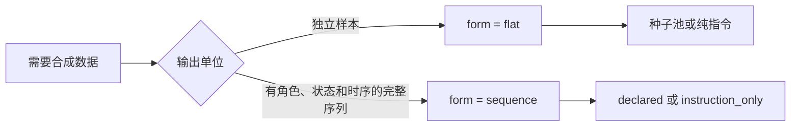

# 第 12 章　生成算子 generate：独立样本与完整序列

> `generate.form` 只有 `flat` 与 `sequence`。两者是不同的产品形态，不共享一套可空参数。

## 12.1 先选生成形式



`flat` 生成一条条相互独立的文本记录。`sequence` 生成完整事件序列，同时交付序列级 main rows 和可重放的
event stream。不要用 sequence 模拟独立样本，也不要用 flat 拼接需要状态一致性的对话。

两种形式都仅支持文本模态。`process` 模式中的 flat 生成以过质量门的记录为种子；`generate_only` 不读取输入。

## 12.2 flat：从种子或纯指令生成独立样本

有种子时，生成样本先经过内置相似度过滤，再从 dedup 起回流下游流水线；生成子批不会再次触发 generate。
每条合成记录通过 `_meta.source.generated_from` 与 `_meta.source.generator` 保留来源。

```toml
[run]
mode = "generate_only"
modality = "text"

[generate]
enabled = true
form = "flat"
llms = ["default"]
seed_examples = ["把会议改到周五下午。"]
num_per_record = 4
num_per_call = 4
```

无种子时使用 `standalone_count` 和明确的 `instruction`：

```toml
[generate]
enabled = true
form = "flat"
llms = ["default"]
standalone_count = 100
instruction = "生成自然、具体、彼此不同的日程安排请求。"
```

`styles`、多 profile mixture、temperature 和 `sample_validator` 都属于 flat。报告中的
`generate.buckets` 用来观察各“类别 × profile × style”桶的调用、产出、验证拒绝与去重存活。

## 12.3 sequence：生成受约束的事件序列

sequence 形式要求：

- `run.mode = "generate_only"`、`run.modality = "text"`；
- `dedup.enabled = true` 且 `dedup.scope = "global"`；
- `classify.enabled = false`、`frame.classify.enabled = false`；
- `output.meta_mode = "inline"`、`output.rejects = "none"`；
- `run.partial_delivery = false`，且不能使用 `--limit`；
- semantic 与 evaluation 使用两个不同的 profile 名，两者都声明正数 `context_window`。

```toml
[generate]
enabled = true
form = "sequence"
mode = "declared"
semantic_llm = "default"
evaluation_llm = "judge"
max_slot_attempts = 4
state_validator = "hooks.py:validate_state"
```

sequence 的详细配置和运行方法见第 27 章。这里先记住它与 flat 的边界：

- flat 的 `seed_examples`、`standalone_count`、`num_per_record`、`seeds_per_call`、`num_per_call`
  不得写进 sequence；
- sequence 的 pattern、counterfactual set、interleaving、timeline、noise 和 instruction-only slot 不得写进 flat；
- 两边混写会在配置期失败，不会猜测用户意图。

## 12.4 declared：一个世界，多条可比较分支

declared 模式先声明 sequence class、frame class 和命名 pattern。pattern 的每个 role 指定 actor、frame class、
读写/发布权限、状态指令、payload binding 与相邻时间间隔。

一个 counterfactual set 共享同一 ScenarioSeed。baseline 先执行，再由确定性结构变换得到声明变体：

| variant kind | 改变什么 | 唯一预期违规 |
|---|---|---|
| `positive` | 不改变 baseline | 空集 |
| `missing` | 删除目标 role | `missing_role` |
| `reordered` | 交换相邻 role | `reordered` |
| `interval_exceeded` | 后移目标 gap 的后缀 | `gap_above_max` |

整组变体经过状态执行、payload 渲染、独立判定、下游处理、双视图校验和 retained-bytes 预算后才提交。
其中任何一步拒绝都会回滚整组，并在同一个 delivery slot 上重试；不会只补某一条变体。

### 交织候选集与命名 pattern

交织配置不要求用户枚举 `A B B A B A A` 这样的事件排列。每个参与的 counterfactual set 只贴一个
`interleaving_candidate_set` 短标签；`[generate.interleaving.pattern.<name>]` 再声明哪个候选集是 trigger、
哪个是 partner，以及这个 pattern 占多少整数票。短标签按精确字符串匹配，不支持 glob、regex、前缀、列表或
表达式，也不需要把 class、日期、tier 和 App 名编码进标签。

```toml
[generate.interleaving]
no_interleaving_weight = 9

[generate.interleaving.pattern.food_with_entertainment]
trigger_candidate_set = "food_dinner"
partner_candidate_set = "entertainment"
trigger_weight = 1
```

当这个 pattern 是当前唯一可用 pattern 且 partner pool 非空时，standalone 占 9 张票，交织占 1 张票。
权重不是配额，也不保证有限数据中恰有 10% 被交织；partner pool 耗尽后，后续机会的分母会改变。只有每个
counterfactual set 的唯一 positive branch 能进入候选集，反事实 variant、hidden baseline、noise 与 replay 都不进入。
trigger 与 partner 必须是不同候选集，同一候选集也不能在不同 pattern 中同时承担两种角色。

Planner 一旦抽中 pattern 和 partner，就冻结两条 branch 的共享 session 布局。若该 pair 无法在 calendar、resource、
session 容量和至少三段 owner runs 的约束下布局，规划直接以 `generation_plan_infeasible` 失败；不会换 partner、
换 pattern、退回 standalone 或在 retry 中重抽。设可见 primary branch 数为 `N`、冻结交织布局数为 `D`，报告中的
`primary_sessions = N - D`，`interleaved_primary_sessions = D`。

## 12.5 instruction-only：自由规划，但仍要完整证明

instruction-only 是独立模式，不是 declared 失败后的 fallback：

```toml
[generate]
enabled = true
form = "sequence"
mode = "instruction_only"
semantic_llm = "default"
evaluation_llm = "judge"

[[generate.instruction_only]]
name = "open_booking"
sequence_class = "ticket_booking"
count = 1
len_range = [3, 4]
instruction = "生成一次完整、自然、状态连续的订票交互。"
state_schema_path = "schemas/state.json"
```

模型在已声明 frame class 的闭集中选择每个事件的 frame class 与 actor。它没有 pattern、variant、
expected violation 或 declared role 权限，也禁止 `interleaving_candidate_set` 与 `[generate.interleaving]`；每条
sequence 仍要通过状态后置验证、语义判定、下游处理和原子提交。

## 12.6 世界状态与隐藏信息

ScenarioSeed 包含 `initial_state`、actors、public/hidden shared facts、style 与 time context。declared 模式下，
role 只能读取 `read_roots`、修改 `write_roots`，并通过 `publish_roots` 把事实发布给 observers。
JSON Patch 只允许 `test`、`add`、`remove`、`replace`；状态和 payload 都必须通过完整 Schema。

隐藏事实只供独立 evaluator 检查泄漏。它不会进入 EventPlanner、FrameRenderer、训练 payload、report、manifest
或错误文本。用户 hook 接收不可变副本，不负责执行 patch，也不能成为第二份状态真值。

### 业务时间、区间与 resource

完整 frame Schema 用 `x-labelkit-business-time = true` 标记业务时间叶子；frame class 的 `time_bindings` 把每条路径
绑定到 event start、end 或 duration。M1 机械派生删除这些叶子的 model Schema，模型只生成非时间字段；每轮候选通过
model Schema 后，generic candidate finalizer 按 Planner 事实注入并执行完整 Schema。`duration_s` 声明事件区间，
`resources` 声明容量为一的互斥资源。Planner 固定使用 1 毫秒 quantum，对同一 resource 执行半开区间不重叠约束；
pattern containment 保证 contained 区间在 container 中至少保留 1 毫秒严格余量。

noise 与 instruction-only 只能选择点 frame class。replay 不复制 source 的时间 payload，而是为整条 source 选择同一个
正、毫秒对齐的 `shift_us`；成员 start delta、duration、resources、role 顺序与非时间 payload 保持不变，业务时间按
replay 起点重新绑定。event ID、dedup、retained bytes 与 delivery digest 都消费重新绑定后的最终内容。

## 12.7 精确交付与失败语义

sequence dry-run 只打印同源计划和调用估算，不读取 API key value，也不创建或替换 main、stream、report、
manifest 或 failed report。正式 run 的成功路径是：

```text
compile plan -> whole-slot attempts -> final downstream rows -> replay projection
             -> main/stream/report fsync + rename -> manifest last
```

尝试耗尽或 commit 前的终局错误不会替换已有成功工件，并写独立的 `*.failed.report.json`。
commit-I/O 失败可能留下固定路径混代，但旧 manifest 不变；消费者必须通过 manifest 中的 SHA-256 拒绝混代集合。

## 12.8 验收生成质量

flat 先看 `generate.buckets` 的 produced、validator rejection 与 survived-dedup。sequence 则先看：

- `report.generate.sequence` 的 planned/delivered sets 与 sequences 是否完全相等；
- `by_pattern` 每个 variant 是否 planned = delivered；
- `rejected_attempts` 是否解释了额外尝试；
- main、stream、report 是否与最后提交的 manifest 摘要一致；
- replay 是否由最终 source rows 派生，并在 process ingest 时通过 descriptor、constant shift、业务时间、ID 与
  provenance 重算。

真实端点可能重试或触发 Schema repair，因此逻辑 family 调用数、provider 物理请求数与 token 用量要分开读。
