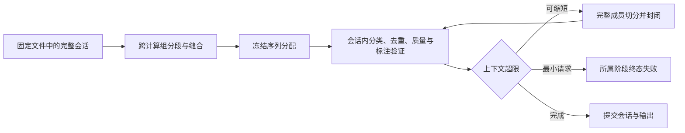

# 第 25 章　流模式 stream：会话化、语义分段与动作摘取

> 本章保留的运行数字、日志和 JSON 节选是容量改造前的历史证据，不代表当前配置的新运行结果。当前容量、全证据与跨计算组示例见 [会话容量示例](../../examples/sequence-context-capacity/README.md)。历史 JSON 中的 session_split 不再是当前输出字段。

> 流模式是 v1.8 新增的一组能力：把**按时间顺序采集的屏幕状态流**（录屏抽帧 + UI 树）
> 先切成一段段「用户在做一件事」的 episode，再逐帧对推断出中间发生的动作，
> 最后以**序列**为单位完成打分、标注与评审。
> 读完本章你应当能回答三个问题：**什么样的数据该开 stream？边界与噪声是怎么判出来的？
> 序列产物的账怎么对？**本章样例全部来自 `examples/stream` 两个工程的真实运行：
> UI 流工程 `project.toml`（本章借它的 s1 会话讲 v1.8 基线，它同时开着 v1.9 的缝合——
> 缝合层的机制与账目整体放在第 26 章）与纯文本流工程 `project-text.toml`；
> 帧粒度小节 25.6 的样例另取自双粒度工程 `examples/mix` 的真实运行
> （UI 控件树主工程，DeepSeek + z.ai 双端点分工）。

## 会话、计算分组和容量边界

输入仍是一组确定的 JSONL 文件或 UI 文件路径；这不是等待数据逐步到达的在线服务。一个已确定的会话
在同次进程运行中跨计算组保留分段、缝合和共享帧状态。进程重启不会恢复状态。
`run.batch_size` 只限制每组叶任务数量，序列可以包含更多帧；key、gap、session_max_len、时间跨度、
EOF 和 limit 仍决定语义会话边界，不允许跨语义会话缝合。



封闭后的序列禁止在 pass1、rescue 和 repass 再次并入或被并入。容量切点限定验证可以回收的帧范围；
共享噪声和后邻帧一直保留到会话统一验证。去重身份、质量统计、结果计数和输出只提交最终尝试，
实际用量、错误、重试和 trace 保留所有尝试。`report.stream.capacity` 给出封闭、拆分、重算、
最小失败数及保留帧数高水位；它不是 RSS 或字节预算。

## 25.1 为什么要分段：时间轴上没有「一条记录」

前面所有章节都默认一件事：输入里的**每一行/每一对就是一条独立记录**，标注单位与采集单位天然重合。但屏幕操作流不是这样采的——录屏抽帧得到的是「首页、搜索页、结果页、详情页、弹窗、购物车……」一长串状态截面，**单帧什么都说明不了**：训练侧要的样本是「用户搜索并下单了一次外卖」这样的完整任务段，而任务的边界、中间混入的通知弹窗、乃至「两帧之间用户到底做了什么」，在原始数据里根本没有字段承载。拿 v1.7 的流水线硬跑这种数据，得到的是逐帧的碎片标注：帧级去重在连续 UI 帧上大面积误伤，质量分打在单帧上毫无意义。（v1.12 起流模式内也有帧粒度产物——但那是 opt-in 的**第二层**产物：以段为单元跑完整条链之后，帧级分类与标注挂在 episode 行内随序列一起交付（25.6），与这里说的「把帧当独立记录逐帧硬跑」是两回事。）

流模式把「原始帧流 → 训练样本」拆成一条新的加工链，四层各管一段：

1. **会话化**（`[stream]`，M2 规则层）：按声明的顺序与断开规则，把帧流粗切成候选会话——纯代码、零 LLM；
2. **语义分段**（`[segment]`，M14 算子）：LLM 滑窗逐帧裁决「这一帧相对进行中的活动是什么角色」，代码按固定规则从关系**演绎**出边界与噪声帧，每段拼装成一个 episode（序列记录）；
3. **动作摘取**（`[extract]`，M15 算子）：对 episode 内每对相邻帧，LLM 推断「两帧之间发生的单个语义动作」，写成结构化步骤序列；
4. **下游序列适配**：去重、打分、标注、评审全部改以 episode 为单位——轨迹 rubric 打结构分、标注看动作序列与完整成员证据、评审带缺陷表并能对成员集做「手术」。

四层接进既有链序，就是流模式的完整加工链（本图作本章与第 26 章共用的地图；缝合默认关，机制在第 26 章）：


一条与真实数据打交道时躲不开的指引：用户常在任务间来回切换——外卖点到一半切去回消息、回来接着下单，这种**穿插**会让分段把同一个任务正确地切成多个碎片（分段的单元本来就是「连续做一件事」）。本章通篇讲的是不缝合的基线形态；要把穿插碎片按任务线索缝回完整记录，开 v1.9 的缝合算子（`[stitch]`，第 26 章）。

这套形态不是发明：从状态对反推动作是 OpenAI VPT 的逆动力学模型与 OS-Genesis 逆向任务合成的既有工序，滑窗 LLM 边界裁决是 2026 年 GUI 轨迹量产管线（Video2GUI 等）仍在用的形态之一，LabelKit 按自己的负边界（不训练本地模型）用运行时 LLM 充当这两个角色。**什么时候开**：输入是按时间排好的操作流（UI 模态的截图 + 树对，或带时间戳的文本事件流）、且你要的样本单位是「活动段」而非单条记录。开关是 `segment.enabled = true`，约束：仅 process 模式、必须开 annotate、与 generate 互斥；`extract` 再要求 UI 模态。默认全关——不开时行为与 v1.7 逐字节一致（输出只多一个恒为 null 的 `_meta.stream` 键）。

**手上没有真实流呢？** sequence form（第 27 章）可以从零生成 main 与逐事件 stream；它在内容调用前冻结
ScenarioPlan，并在成功下游之后才从最终 source rows 派生 replay。生成侧不运行 segment/stitch/extract。
之后可用 `project-replay.toml` 把 stream 作为本章的 process 输入；M2 会先从每行自描述 descriptor 复验业务时间、
duration/resources、constant-shift replay、ID 与全部 generation provenance，再提供 exact-only dedup carrier。

## 25.2 快速上手：examples/stream 全流程

仓库自带的 `examples/stream`（`project.toml`）是一个 53 帧、五个场景子目录的 UI 操作流工程——时序流格式能开的算子全开（分段、缝合、去重、分类、摘取、轨迹打分、序列标注、评审修复；generate 与 stream 互斥）。本章用它的第一个会话 `s1-serial-noise/`（帧 1–14）讲 v1.8 的分段与摘取基线：任务 A「点外卖」帧 1–8（其中帧 5 是突然插入的社交 App 消息屏——预期噪声）、任务 B「打车」帧 9–13 背靠背、帧 14 回到桌面；其余四个会话是穿插与救援场景，属第 26 章缝合的舞台（本次真跑 s1 自己也贡献了一次缝合——见 25.2 与 26.2）。fixture 由 `tools/gen_fixtures.py` 一次性确定性生成（树是唯一语义源，截图为 PIL 程序化绘制），刻意埋了「实体跨屏延续」的线索：餐厅名「川味麻辣烫」跨帧 3/4/6 出现、金额 ¥32 跨帧 4/6/7。逐节看 `project.toml`。

**第一节：会话化与分段。**

```toml
[stream]
order_by = "input_order"          # UI 模态 = pair_index 升序（meta:* 仅文本模态）
key = ["source_dir"]              # 分区键：每个场景子目录一个会话

[segment]
enabled = true                    # stream 模式总开关
strategy = "hybrid"               # 滑窗 LLM 边界精化 + 逐帧噪声标记
window = 16                       # 窗上限，≥ 最长会话（15 帧）：预算装得下整段 ⇒ 每会话恰一窗（25.5）
min_len = 2                       # 仅作用于 LLM 精化切出的段
context = "…"                     # 域上下文声明（本工程为穿插流写了长版，全文与解读见第 26 章）
```

`[stream]` 声明输入顺序与语义会话边界；本例 source_dir 按目录分会话。segment.window 是单次边界判断的帧数上限，实际窗口按每个成员完整证据和已声明上下文贪心装填。窗口重叠与接缝归属保留；完整两帧仍不可装时明确失败。UI 窗口需要支持视觉的 profile，不能通过关图或摘要替代降低预算。context 仍是可选业务背景。

**第二节：摘取与序列打分。**

```toml
[extract]
enabled = true                    # 逐相邻帧对摘取动作，写入 _meta.stream.steps
llm = "default"

[quality]
enabled = true
mode = "pointwise"
rubric = "default:trajectory"     # 轨迹四准则；无 threshold——只打分不筛
```

注意两件事：rubric 用的是 v1.8 新内置的 `default:trajectory`（完成度/连贯性/目的性/噪声残留四准则，附录 B）——事实上流模式下 rubric 留空也会解析到它；**没配 threshold**——序列样本贵，先把分打出来、下游按分后筛（第 8 章的「门控留宽」策略在这里几乎是标配）。

**第三节：序列标注与带手术的评审。**

```toml
[annotate]
enabled = true
llm = "default"
instruction = """
你是移动端操作序列标注员。根据动作序列与完整成员帧，
标注该操作序列的任务标签（用户在做什么）、所属应用与一句话摘要。
被打断后恢复的任务请标注其完整任务（接缝步表示任务曾被打断）。
"""

[verify]
enabled = true
llm = "judge"
policy = "repair"                 # 缺陷表路由：成员手术 + 重摘取 + 重标注
max_repair_rounds = 1

[trace]
enabled = true
channels = ["segment", "stitch", "extract", "classify", "verify", "schema"]
content = "refs"

[output]
meta_mode = "inline"
rejects = "full"                  # 噪声帧 rejects 行携带完整载荷（序列 = 成员清单）
# schema_inline = …               # task_label / app / summary 三字段的输出 Schema，略
```

工程还开着 `[classify]`：episode 使用全部成员的完整证据分类，shopping 类挂了按类标注指令，机制见第 24 章；`[stitch]` 见第 26 章。`"segment"` 与 `"extract"` 都不在默认 trace 订阅集里，审计边界判决时须显式添加。跑起来：

```bash
cd examples/stream && mkdir -p out
set -a && source ../../.env && set +a
uv run labelkit run --config ../config.toml --project project.toml
```

以下两行是旧运行的预算日志。当前启动行使用 minimum_frames=2，仅表示必要帧对；旧 w_min 不能用于当前完整证据的容量推断：

```
INFO  run     batch=0 budget: default=131072/113868 judge=131072/115916
INFO  run     batch=0 segment: w_min=46 window=16 (budget)
```

stderr 尾部的终版摘要（真实运行，退出码 0，全程约 248 秒）：

```
   ── final summary (matches report.counts item by item) ──
   scanned=53  ingested=53  bad_input=0  generated=0
   dropped_dup=0  dropped_lowq=0  dropped_verify=0  failed=1  emitted=8
```

53 帧进来，主输出只有 **8 行**——这不是丢了数据，是换了记账单位：45 帧被吸收进 13 个 episode（状态 `absorbed`，其中 4 个 episode 又被缝合并壳，第 26 章）、8 帧成了噪声（`dropped_noise`）；9 条线索里还有 1 条死在轨迹打分上（`failed=1`——一次打分调用把输出上限写满，按 v1.11 的 `output_truncated` 记录级拒收，25.4），守恒恒等式的完整验算见 25.4。聚焦 s1 会话：14 帧产出 2 行，与人工预期一致——但这次分段把任务 A 切成了 4+3 两段（帧 5 的消息屏被剔为噪声后，帧 6 的「切回购物车」被判成新流程的开始——正是本工程 `context` 声明的口径，第 26 章），缝合层随即按实体延续把两段并回一条线索；任务 B 成一段（5 成员）、帧 14 落进 rejects。

## 25.3 机制四层：从帧流到步骤序列

**第一层：会话化规则层（`[stream]`，纯代码）。**`order_by` 声明顺序来源——`"input_order"`（默认：文本 = 文件名字典序→行号，UI = pair_index 升序）或 `"meta:<字段>"`（仅文本模态，按时间戳字段排序校验；epoch 秒/毫秒与 ISO 字符串怎么解析、输入怎么排布见第 5 章）。会话断开由四组规则任一触发：分区键变化（`key`，如 UI 模态的 `"source_dir"`——一次采集一目录）、时间间隙（`gap_s`）或序号间隙（`gap_steps`）、硬上限（`session_max_len` / `session_max_span_s`）。工具**不做全量重排**，只做流式单调性校验：乱序/时间戳解析失败的记录按 `on_disorder = "skip"`（默认，计 bad_input）或 `"fail"`（退出码 3）处置。每个会话闭合发一条 `segment.session` 事件——本次真跑五条：cause=`key` 四条（子目录切换处断开）+ cause=`eof` 一条。时间戳会话化看姊妹工程 `project-text.toml`（13 行带 `ts` 的输入法请求流，`order_by = "meta:ts"` + `gap_s = 900`）：真跑切出三个会话，cause=`gap` 两条 + `eof` 一条——上午的差旅安排与周报（此后静默约 3 小时）、中午的合同翻译（此后静默约 5.5 小时）、晚间对翻译三连的逐字重发（序列判重的活展品，见本节第四层：`dropped_dup=1`）。

**第二层：segment 的三步演绎滑窗。**`strategy = "hybrid"`（默认）时每窗一次 LLM 调用，但 LLM **不直接回答「这里是不是边界」**——模板固定为三步作业：先通读全窗做双向上下文概括，再对每帧做**封闭词表**的关系分类（M8 enum 硬校验，词表外输出在结构层就被拦下），边界与噪声由代码查表演绎。五个关系值的通俗读法：

| relation | 通俗含义 | 演绎结果（代码查表） |
|---|---|---|
| `continues` | 同一流程的正常推进 | 非边界 |
| `advances` | 屏幕甚至 App 变了，但任务实体（订单号、餐厅名、验证码）跨屏延续——跨 App 的同一任务属此值 | 非边界 |
| `returns_to_entry` | 回到入口/搜索/桌面后开启新流程（同 App 背靠背任务的断点） | **边界**：该帧是新段第一帧 |
| `context_switch` | 交互对象与环境不连续且无实体延续——「相关但无实体延续的新流程」也取此值 | **边界**：该帧是新段第一帧 |
| `interruption` | 与前后活动均无关的短暂插入：通知、弹窗、误触 | noise（剔除出段） |

`advances` 与 `context_switch` 的分界钉死为**实体延续**——这正是 fixture 埋「川味麻辣烫」跨屏线索的原因。本次真跑的 s1 判决：帧 5 弹进社交 App 被判 `interruption`；帧 9 切进打车 App 被判 `context_switch`（无实体延续、开新段）；帧 6 回到购物车**也**被判 `context_switch` 开了新段——不是 `advances`，因为本工程的 `context` 把「切回被搁置任务收尾」显式钉为新流程的开始（为缝合制造碎片，第 26 章逐要点解读），审核员的理由原文正是这么写的（25.5 的 trace 样例）；实体线索也没白埋——它随后成了缝合判定 `entity_overlap` 先验的证据（第 26 章）。三条硬规则：**会话首帧恒为段首**（rel[0] 的边界值不参与判决，noise[0] 照常生效）；接缝帧（前窗末帧 = 后窗首帧）的判决**整帧归后窗**；`min_len`（默认 2）**只作用于 LLM 精化切出的段**——短段帧以 `below_min_len` 的 reason 进 rejects，**≠ `noise`**：它未经噪声判据裁决，不得污染噪声审计口径，计数也独立（`report.stream.below_min_len`）。规则层的孤帧/短会话（含 `strategy="rules"`）不经 min_len、原样成 episode。单窗结构修复耗尽按 `segment.on_error = "keep"`（默认）降级：该会话整体成一个 episode 并在 `_meta.stream.degraded` 留痕，记录存活。

**第三层：extract 的动作词表与 diff 证据。**对每个 episode 的每对相邻成员帧一次调用（转移数恒 = 成员数 − 1），锚定句移植自 OpenCUA：「前一帧是动作发生前最后一个稳定状态，后一帧是动作完成后的首个稳定状态；推断二者之间的**单个语义动作**；连续滚动、连续键入归并为一步」。`action_type` 是 11 值封闭词表（AndroidControl 全集 ∪ UI-TARS-mobile 增量 + 兜底）：

```
click / long_press / drag        点击 / 长按 / 拖拽（target = 控件文本引用，不用坐标）
input_text                       键入文本（value = 所键入内容；聚焦点击不单独记步）
scroll                           滚动（value = up/down/left/right 四向）
open_app / app_switch            打开应用 / 切换到另一已打开应用（value = 应用名）
navigate_back / navigate_home    系统返回 / 回桌面
wait                             无交互，仅等待界面加载
other                            无法归类（语义写进 description）
```

`include_diff = true`（默认）时提示词额外注入 `[树变更摘要]`——两帧 UI 树的**结构化 diff**（增/删/文本变化节点数、变化比例、App 是否变更），零额外调用。这与像素 diff 是两回事：像素 diff 注入在业界报告里是负结果，结构化 diff 则是确定性归并证据，用来缩短视觉推断距离、压幻觉。单步修复耗尽按 `extract.on_error = "fallback"`（默认）写兜底步：`action_type="other"` + `detail` 留痕——**与 LLM 确证的 other 可区分**（看 detail.kind 在场与否），episode 存活。

**第四层：下游算子的序列适配。**episode 是 `kind="sequence"` 的记录（成员帧转入 `absorbed` 状态、不再独立产出——这是 Stage 契约新增的受控例外「分段吸收例外」，spec §4.3；第 4 章），下游全部换序列口径。v1.9 起 segment 与下游之间还有一个可选的缝合算子（`[stitch]`，第 26 章），把同会话内被穿插切开的 episode 碎片并成线索（Stage 契约的缝合改绑例外，spec §4.3），开启后下面各算子看到的单元相应从 episode 升级为线索：

- **dedup**（第 9 章）：序列的判重文本 = 成员配方按序拼接，episode 级重复 = 「同样的操作流程」；pHash 层自动跳过（序列记录无自己的图）。真实展品在 `project-text.toml` 的真跑里：晚间会话对合同翻译三连的逐字重发，episode 判重配方与中午那段逐字一致——`stage="dedup", reason="exact"` 落拒绝通道（`rejects="full"` 档的载荷是成员清单 `{"kind": "sequence", "member_ids": […], "member_sources": […]}`）；
- **quality**（第 10 章）：动作步骤与所有成员的完整文本、可见 UI 树和图片共同构成证据。UI profile 必须支持视觉；比较池为完整会话内同类序列，容量重算会重建整池。
- **annotate**（第 11 章）：动作步骤与每个成员的完整文本、可见 UI 树和截图一起标注。上下文不足触发容量切分及未提交会话重算，不能抽图、裁摘要或遗漏成员。
- **verify**（第 13 章）：完整成员、输出和必要边界证据共同评审，缺陷成员使用出现位置定位。同会话噪声与后邻帧保留到验证；认领不可跨人工容量边界。成功成员手术遵循既有验证流程，容量失败则撤销临时工作成员并从冻结基线重算整个未提交会话。

## 25.4 输出怎么读

**主输出**一行 = 一个 episode（缝合开启时 = 一条线索——单碎片线索就是原样的 episode）。真实运行产物第 1 行（s1 的任务 A，格式化展示；`steps` 的六步全文照录。这条线索由两个碎片缝成——碎片机制在第 26 章，这里先看 `_meta.stream` 的骨架）：

```json
{
  "task_label": "在美食外卖App下单川味麻辣烫招牌麻辣烫×1，合计¥32",
  "app": "com.example.food",
  "summary": "搜索麻辣烫，在川味麻辣烫店下单招牌麻辣烫×1，合计¥32，提交订单成功。",
  "_meta": {
    "id": "adb47af96b0dc69a",
    "run": {…},                              ← 与既有形态一致，从略
    "source": {"file": "s1-serial-noise/uitree_1.jsonl", "pair_index": 1,
                "generated_from": [], "fields": {}, "generator": null},   ← 继承首成员的溯源
    "stream": {
      "episode_id": "adb47af96b0dc69a",      ← 恒等于本行 id（episode 自述）
      "thread_id": "adb47af96b0dc69a",       ← v1.9 键：仅 stitch 开启时在场（第 26 章）
      "session_id": "f00e41052479a460",      ← 所属会话（同会话的段共享此值）
      "order_span": [1, 8],                  ← 首末成员的序键（本例 = pair_index）
      "member_count": 7,
      "member_ids": ["873a403914352fd1", "98a8e0836890fa51", "16ceb575dc626695",
                      "117fda9c33c823fc", "89fccaa682b52227", "e1b72b64b4a7164c",
                      "d565f6f279ebec42"],   ← 成员帧 id，序键升序
      "member_sources": [{"file": "s1-serial-noise/uitree_1.jsonl", "pair_index": 1},
                          {"file": "s1-serial-noise/uitree_2.jsonl", "pair_index": 2},
                          {"file": "s1-serial-noise/uitree_3.jsonl", "pair_index": 3},
                          {"file": "s1-serial-noise/uitree_4.jsonl", "pair_index": 4},
                          {"file": "s1-serial-noise/uitree_6.jsonl", "pair_index": 6},   ← 5 缺席：噪声帧
                          {"file": "s1-serial-noise/uitree_7.jsonl", "pair_index": 7},
                          {"file": "s1-serial-noise/uitree_8.jsonl", "pair_index": 8}],
      "session_split": false,                ← 历史字段；当前删除，人工边界由 capacity 表达
      "repaired": false,                     ← verify 手术改写过成员集吗
      "degraded": null,                      ← segment 失败降级留痕（on_error="keep" 时）
      "fragments": [{"order_span": [1, 4], "member_count": 4, "cause": "origin",
                      "source_episode": "adb47af96b0dc69a"},
                     {"order_span": [6, 8], "member_count": 3, "cause": "resumed",
                      "source_episode": "6b3bd10a0de116ea"}],
                                             ← v1.9 键：碎片装订记录——本行两碎片 = 缝合并回的
                                                任务 A；单碎片 = 没缝过（读法在第 26 章）
      "steps": [                             ← extract 产物；关 extract 时恒 null
        {"index": 0, "action_type": "click", "target": "搜索美食", "value": null,
         "description": "点击首页顶部的搜索框，进入搜索页面", "resumed": false},
        {"index": 1, "action_type": "click", "target": "*麻辣烫", "value": null,
         "description": "在搜索页面的热门搜索中点击\"麻辣烫\"标签，进入麻辣烫搜索结果页", "resumed": false},
        {"index": 2, "action_type": "click", "target": "川味麻辣烫", "value": null,
         "description": "在搜索结果列表中点击\"川味麻辣烫\"进入该餐厅详情页", "resumed": false},
        {"index": 3, "action_type": "click", "target": "加入购物车", "value": null,
         "description": "用户点击了\"加入购物车\"按钮，页面从商品详情切换到购物车页面，显示已添加招牌麻辣烫×1，合计¥32", "resumed": false},
        {"index": 4, "action_type": "click", "target": "去结算", "value": null,
         "description": "点击\"去结算\"按钮，从购物车页面进入确认订单页面", "resumed": false},
        {"index": 5, "action_type": "click", "target": "提交订单", "value": null,
         "description": "点击\"提交订单\"按钮，提交订单后页面跳转至下单成功页面", "resumed": false}]
    },
    "scores": {"coherence": 1.0, "purposefulness": 1.0, "noise_residue": 1.0,
                "completion": 1.0, "__aggregate__": 1.0,
                "mode": "pointwise", "batch_no": 1, "pool": "shopping"},
    "dedup": {"kind": "unique"},
    "classification": {"label": "shopping", "labels": ["shopping"], "source": "llm"},
    "annotation": {"model": "glm-5.2", "attempts": 1},
    "verification": {"verdict": "pass", "rounds": 1, "defects": []}   ← stream 行恒带 defects 键
  }
}
```

逐键读 `_meta.stream`：`member_sources` 是完整成员溯源（每帧来自哪个文件哪个 index——`source` 键只继承首成员），拿它能把 episode 还原回原始帧；`order_span` 与 `member_count` 对不上（跨度 8、成员 7）就说明段内有帧被剔了。v1.12 起这里还可能多一个 `members` 键（`member_sources` 之后、`capacity` 之前）：帧粒度任一开关开启时在场，逐成员给出帧类标签、帧级标注与状态位——本工程没开帧粒度所以缺席，读法与真实样例在 25.6。`thread_id`、`fragments` 与步行内的 `resumed` 是 v1.9 增键，**仅本工程开着 `[stitch]` 才在场**（读法在第 26 章；关掉缝合，这三处消失，主输出与 v1.8 逐字节等价）。留意这行的 `steps` 里**没有**接缝占位步（六步全是真实转移、`resumed` 全 false）：两个碎片的间隙里只有噪声帧 5，按判据不构成接缝——这条辨析在第 26 章展开。顶层三个字段仍是你的 Schema 产物——**输出结构照旧由全局 Schema 管**，stream 改变的只是「一行代表什么」。另两处细节：`verification` 在流模式恒带 `defects` 键（无缺陷 = 空数组）；判分噪声这次落在了别的行上——s4 的新闻浏览线索被打了 `noise_residue` 0.0、`completion` 0.4（聚合 0.55），对一条干净的三帧浏览流来说是个可疑判决，但因为没设 threshold，它只是个随行落盘的分数。**stream 工程默认只打分不筛**的价值就在这：判分的噪声不会变成数据的损失，后筛时你还有机会用 trace 复核。

**拒绝通道**是噪声帧的去向（`rejects = "full"` 档；s1 的两行 `_meta` 逐字如下，`record` 载荷——该帧的树文本与图路径——以 `{…}` 略去）：

```json
{"_meta": {"id": "c51c341656eb8447", "source": {"file": "s1-serial-noise/uitree_5.jsonl", "pair_index": 5, "generated_from": []}, "stage": "segment", "reason": "noise", "errors": [], "label": null}, "record": {…}}
{"_meta": {"id": "47d1c7373d1fa7fb", "source": {"file": "s1-serial-noise/uitree_14.jsonl", "pair_index": 14, "generated_from": []}, "stage": "segment", "reason": "below_min_len", "errors": [], "label": null}, "record": {…}}
```

两个 reason 别混：帧 5 是 LLM 判的 `interruption`（reason=`noise`，社交 App 消息屏）；帧 14 是「`returns_to_entry` 开了新段、但段里只有它自己（1 < min_len=2）」的 `below_min_len`——桌面屏不是噪声，只是不够成段。审计噪声率时只数 `noise`，别把 `below_min_len` 算进去。verify 手术收缩逐出的帧是第三种组合：`stage="verify", reason="off_task_member"`；本次真跑还有第四种——那条死于打分调用输出截断的线索以 `stage="quality", reason="output_truncated"` 落 rejects（v1.11 的记录级错误码，第 8、18 章），它的 `record` 载荷同样是成员清单。

**报告**多了两块。`counts` 增三键（真实产物；`stitched`/`threads` 是 v1.9 键，第 26 章）：

```json
"counts": {
  "scanned": 53, "ingested": 53, "bad_input": 0,
  "dropped_dup": 0, "dropped_lowq": 0, "dropped_verify": 0,
  "failed": 1, "generated": 0, "emitted": 8,
  "episodes": 13, "absorbed": 45, "dropped_noise": 8,
  "stitched": 4, "threads": 9
}
```

v1.8 的守恒恒等式全展开形（第 4 章原式的超集，未启用项恒 0 时退化回原式；`stitched` 为 v1.9 增项）：

```
emitted + dropped_dup + dropped_lowq + dropped_verify + dropped_noise + failed + bad_input + absorbed + stitched
  = scanned + generated + fanout + episodes
```

代入验算：左 = 8 + 0 + 0 + 0 + **8** + 1 + 0 + **45** + **4** = 66；右 = 53 + 0 + 0 + **13** = 66。✓ 直觉读法：右侧 `+ episodes` 是因为每个 episode 都是凭空追加的新信封（与 classify 扇出的 `fanout` 同构），左侧 `absorbed + dropped_noise` 则是原始帧的两种新去向（`stitched` 的壳记账在第 26 章展开；注意 failed 的那条线索的 45 个成员帧照旧记在 `absorbed` 里——信封死了，帧的去向账不变）。新增的 `stream` 节（真实产物，`by_type` 其余 8 个动作类型本次全为 0、以 `…` 略；`stitch` 子块留给第 26 章）：

```json
"stream": {
  "sessions": 5, "episodes": 13, "mean_episode_len": 3.46,
  "absorbed": 45, "dropped_noise": 8, "below_min_len": 2,
  "digest_poor_frames": 0, "segment_failures": 0,
  "windows": 5,
  "stitch": {…},
  "extract": {"transitions": 32, "fallback_steps": 0, "failures": 0,
               "by_type": {"click": 30, "input_text": 1, "scroll": 1, …}},
  "verify": {"membership_repairs": 0, "boundary_flags": 0,
              "defects": {"label_mismatch": 0, "off_task_members": 0,
                           "missing_head": 0, "missing_tail": 0, "missing_members": 0,
                           "wrong_stitch": 0}}
}
```

对账四连：`windows=5`（v1.11 增键）= segment 实际切出的窗数，拿它对账 dry-run 估算的上界（本工程估 5、实 5——预算装得下整段、装填顶格，25.5 成本账）；`transitions=32` = 各线索 Σ(成员数 − 1) = 36 再减去 4 个接缝占位步（占位不计入摘取账，第 26 章）；`dropped_noise=8` 里有 1 条是 `below_min_len`（独立计数拆给你看——`below_min_len=2` 是**发生**计数，另一次命中的帧被缝合救援翻回了 `absorbed`，第 26 章）；`mean_episode_len=3.46` = 45 成员 ÷ 13 段。`fallback_steps` / `segment_failures` / `verify.defects` 全为 0——分段与摘取是一次干净的运行，这些计数器不为零时的读法在 25.5。

## 25.5 调优与审计闭环

**会话边界与请求容量分别配置。**gap/key/session_max_len 决定语义会话，跨这种边界不能恢复任务。segment.window 只限制单次边界判断的最多帧数，实际按完整证据预算装填；计算组大小不改变语义窗口和下游池。context 提供域知识。启动 minimum_frames=2 仅是必要的两帧单位，不再从有界摘要推断任意长帧的安全装填数量。

**边界审计：抽读 `segment.boundary`。**每窗一条事件，`relations` 是逐帧判决、`reason` 是逐帧理由（订阅 segment 通道 + `content="refs"` 起携带）。抽读法：挑判决密度高的窗，把 relations 与你的人工预期逐帧对——本次真跑的 s1 窗（真实 trace 行，格式化展示；`…` 处省略 `run_id`/`batch_no`/`member_ids` 与其余帧的同构内容）：

```json
{"ts": "2026-07-23T04:46:35.435+08:00", …, "stage": "segment", "ev": "segment.boundary",
 "payload": {"session_id": "f00e41052479a460", "window": [0, 14],
   "relations": [{"index": 0, "relation": "continues"}, …,
                 {"index": 4, "relation": "interruption"},
                 {"index": 5, "relation": "context_switch"}, …,
                 {"index": 8, "relation": "context_switch"}, …,
                 {"index": 13, "relation": "returns_to_entry"}],
   "model": "glm-5.2",
   "reason": […, "切到社交App查看消息，与正在进行的麻辣烫点餐流程无关，是短暂的任务中断",
              "从社交消息切回外卖App购物车页面，是切回被搁置的外卖任务收尾，属于新流程的开始", …,
              "外卖任务已完成后切到出行App开始叫车，是全新任务的开始", …,
              "叫车任务完成后回到主屏幕，是回到入口准备开启新流程"]}}
```

index 4（帧 5）的 `interruption`、index 8（帧 9）的 `context_switch` 与 index 13（帧 14）的 `returns_to_entry` 正是 25.3 那张词表的活例；最值得端详的是 index 5（帧 6）：审核员按本工程 `context` 的声明把「切回被搁置任务收尾」判成了 `context_switch`（理由原文照抄了口径），于是外卖任务被切成两段——多图窗口下的这个判决与纯文本时代的真跑（同一帧曾判 `continues` 不切段）方向相反，属于边界口径的漂移带；本工程下游开着缝合，两段随即被并回（第 26 章），漂移没有伤到产物。对边界不满意的调参循环：改 `context` / 调 `window` / 动 gap → 同 seed 重跑 → diff 两次的 boundary 事件。

**extract 的可靠性预算：按 70–80%/步做计划。**LLM zero-shot 动作推断的实测可靠性就在这个区间（Watch & Learn 70.5%、Sharingan 70–80% 且按动作类型不均衡）——每步 20–30% 的错误率会沿 episode 级联，**不要把单步 steps 当真值消费**。工具承诺的是缓解链而非单步正确性：`include_diff` 的树 diff 证据（默认开，可关做 A/B——对照读数就是 `extract.by_type` 分布与 verify 缺陷率）、verify 缺陷路由兜底（步骤↔标签不符会被打 `label_mismatch`）、quality 结构分软门（连贯性/噪声残留压分可疑段）。日常盯两个计数：`by_type.other` 占比异常升高或某类型塌缩 = 系统性劣化信号；`fallback_steps` 持续非零 = 摘取输出结构不稳，先查 trace 的 error 事件。

**完整 UI 证据。**空可见树仍保留截图作为证据；UI 普通流的 segment 与所有实际接收成员图片的阶段都必须使用视觉 profile。不能通过选纯文本 profile 把图片从证据中移除，segment.digest_max_chars 已删除。

**长 episode 的信度注记。**episode 超过 ~20 步后，LLM 对整段的判分信度会衰减（业界同证据）。两个缓解：质量侧改 pairwise（相对比较对长序列比绝对刻度稳）；或对超长段的分数降信任、把裁量交给人工抽检。

**历史运行成本账**：下表保留旧实现的估算与实跑数字；当前不再提供摘要保证的 w_min，实际请求与重算读新运行 trace。

| 来源 | 次数 | 本次真跑 |
|---|---|---|
| segment | Σ ceil((L−1)/(w_eff−1))，w_eff = min(w, w_min)——预算装填下报**上界**（实际每窗装得更满就更少）；L≥2 的会话；rules/孤帧计 0 | 估 5；实际 `stream.windows=5`（w_min=46 ≥ w=16，装填顶格、上界收紧为准确值） |
| extract | Σ(L−1) 报**上界**（剔噪后实际 = Σ(成员数−1)，接缝占位不计） | 估 48、实际 32 |
| quality / annotate / verify | 记录基数变为 episodes/线索（估算以会话数报**下界**） | 9 线索 ×4 准则 = 36；8；8（1 条线索死于打分，没走到后两位） |

`--dry-run` 的估算行无条件打印 `segment_calls` / `extract_calls` / `stitch_calls`（v1.9 增，未启用恒 0），本工程估算 `total=98`。实跑合计 130 次调用（default 122 + judge 8）、约 248 秒——高出估算的部分 = 下游按会话数报下界的口径差 + 缝合判定的实际次数（第 26 章）+ 12 次结构修复环调用（trace 里 41 条 `schema.repair` 事件：29 条在确定性修复层零调用解决、12 条走了 LLM 修复环），估算历来不含修复。`per_stage_s` 里 stitch（89.4 秒，账在第 26 章）与 quality（59.8 秒）是两个大头——第 17 章「quality 是大头」的结论在 stream 下依然成立，extract（41.3 秒）第三，episode 越长它占比越高。

**`--strict` × 噪声帧。**stream 工程的噪声帧是**预期产物**——但它们进 rejects，`--strict` 会因 rejects 非空退出 1。CI 里给 stream 工程挂 strict 前想清楚：要么接受「有噪声帧就红」，要么改为解析 report（比如只在 `failed > 0` 或 `verify.defects` 非零时报警）。

## 25.6 帧级分类与标注（v1.12）

**双粒度动机。**序列级分类、打分和标注回答「这一段是什么」；帧粒度回答各成员在其中的角色与结构化要素。`[frame.classify]` 对成员帧做批量闭集判决，`[frame.annotate]` 在序列级标注之后按帧类逐成员标注。帧产物挂在 episode 行的 `_meta.stream.members[]` 中，出现位置区分相同内容的多次出现。每次调用都保留该请求所需的完整成员证据。

仓库的 `examples/mix` 同时开启两种粒度。UI 主工程包含 17 帧、三个会话子目录，第三个会话是第一个的逐字节复刻。当前配置把 UI 分段、帧分类、质量、序列分类、序列标注、帧标注与评审都交给 `vision`；stitch 的摘要卡判断可使用文本 profile。文本姊妹工程 `project-text.toml` 使用 `default`，输出 `mix-text-labels.jsonl`。

运行 `cd examples/mix && mkdir -p out && uv run labelkit run --config config.toml --project project.toml`，注意使用本目录的 config。下方配置反映当前完整证据要求；后续产物和调用数字是已记录历史结果，不代表当前实现的运行成本。

**配置三节**（摘自 `examples/mix/project.toml`，UI 主工程——帧类表是**屏幕类型**词表）：

```toml
[frame.classify]                  # 帧级闭集分类（默认关；仅流模式）
enabled = true
llm = "vision"                    # 完整成员树与图片证据
fallback_class = "other"          # 修复穷尽/窗口失败的兜底，须 ∈ 帧类表

[[frame.classify.classes]]        # 帧类表：与 [[classify.classes]] 同构，但两张表互相独立（第 24 章）
name = "form_screen"
description = "表单类屏幕：规格选择、日期人数填写、地址备注输入等以字段填写为主的页面"
# list_screen / detail_screen / confirm_screen / transition / other 五类同构，略

[frame.annotate]                  # 帧级标注（默认关；仅流模式）
enabled = true
llm = "vision"                    # UI 模态 frame.annotate 无条件入 vision 必需集——走 z.ai
instruction = """
你是移动端屏幕帧标注员。根据单帧截图与 UI 控件树，标注该屏幕在流程中的
角色（screen_role，一个名词短语）与关键控件列表（key_widgets，字符串数组：
把承载本屏核心信息或核心操作的控件文本逐项列出；没有则给空数组）。
"""
schema_inline = """…"""           # 独立的帧级输出 Schema：{screen_role, key_widgets} 两字段（第 14 章）
# examples = [...]                # 可选 few-shot，形态镜像 annotate.examples

# ── 按帧类覆盖：表单类屏幕单独强调抽取表单字段与取值 ──
[frame.class.form_screen.annotate]
instruction = """
你是移动端屏幕帧标注员。这一帧已被判定为表单类屏幕：标注其在流程中的
角色（screen_role），并把表单字段与当前取值成对抽入关键控件列表
（key_widgets，如「份量：大份」「辣度：微辣」——逐字段一项，空输入框记
其占位提示）。
"""

# ── 按帧类覆盖：过渡屏跳过标注（省成本示范；members[] 呈现 skipped）──
[frame.class.transition.annotate]
enabled = false
```

**组合约束**（全部启动期检查，第 4 章有合订）：process stream 的帧粒度开关要求
`segment.enabled = true` 且 `output.meta_mode != "none"`；frame class 必须来自分类闭集，帧级没有 multi 或
self-consistency。sequence form 则要求两个分类开关都关闭，以 `[frame.class.<name>]` 注册 frame class，
并在 `[frame.class.<name>.generate]` 声明 instruction 与 object Schema。两种形态共用概念，不共用判决路径。

**members 块怎么读。**本次真跑主输出第 1 行（外卖下单的 episode，序列类 food_delivery，6 成员）的 `_meta.stream.members` 全文：

```json
"members": [
  {"index": 0, "id": "7cfb0c25f855b2d7", "label": "list_screen",
   "annotation": {"screen_role": "美食外卖首页",
                  "key_widgets": ["搜索美食", "搜索", "推荐餐厅", "金牌黄焖鸡 4.9 分",
                                  "老面坊牛肉面 4.7 分", "青禾轻食沙拉 4.5 分"]},
   "status": "annotated"},
  {"index": 1, "id": "164b7480ab098de5", "label": "detail_screen",
   "annotation": {"screen_role": "菜品详情页",
                  "key_widgets": ["金牌黄焖鸡", "黄焖鸡米饭 ¥38", "月售 1200+ 好评率 99%",
                                  "招牌黄焖鸡块 配米饭一份", "选规格"]},
   "status": "annotated"},
  {"index": 2, "id": "25ce67ce53d5f1d7", "label": "form_screen",
   "annotation": {"screen_role": "商品规格选择/加入购物车",
                  "key_widgets": ["商品：黄焖鸡米饭 ¥38", "份量：大份", "辣度：微辣",
                                  "米饭：×1", "口味备注（选填）：（空）"]},
   "status": "annotated"},
  {"index": 3, "id": "d77a51064a52f91e", "label": "confirm_screen",
   "annotation": {"screen_role": "订单确认页",
                  "key_widgets": ["确认订单", "金牌黄焖鸡", "黄焖鸡米饭 大份 ×1",
                                  "收货地址：南京市玄武区中山路 18 号", "预计送达 12:40",
                                  "提交订单 ¥38"]},
   "status": "annotated"},
  {"index": 4, "id": "96cb96ed666583b1", "label": "transition", "annotation": null, "status": "skipped"},
  {"index": 5, "id": "347864af1bc54006", "label": "confirm_screen",
   "annotation": {"screen_role": "支付成功结果页",
                  "key_widgets": ["支付成功", "订单号 FD20260812001", "黄焖鸡米饭 大份 ×1 实付 ¥38",
                                  "预计 40 分钟内送达", "查看订单", "返回首页"]},
   "status": "annotated"}
]
```

`index` 0 基、按成员序（与 `member_ids` 对位）；`label` 键仅帧分类开启时在场（segment 降格的 episode 跳过帧粒度两个 pass：全员 label=null、status="skipped"）；`annotation` / `status` 两键仅帧标注开启时在场，`status` 闭集三值——`annotated`（标注在场且过了写前帧 Schema 校验）、`skipped`（该帧类 `enabled = false`，本例 index 4 的支付处理过渡屏：帧类 transition、跳过标注）、`failed`（修复穷尽或写前校验不过，annotation 置 null）。index 2 的规格表单屏吃的是 `form_screen` 的按类覆盖指令——`key_widgets` 按覆盖要求抽成了「份量：大份」「辣度：微辣」这样的字段-取值对。第 2 行（订酒店的 episode）则是四成员全 annotated（form → list → detail → confirm）——s2 那块系统通知插入屏早在 segment 就被剔成噪声（`dropped_noise`），压根没进成员集，自然也没有它的 members 条目。**帧失败不入 rejects、不触发 `--strict`**：成员失败不是信封失败，episode 照常发射，账记在 `report.stream.frame_annotate.failed`（第 8、18 章）；帧分类侧的失败语义同样保守——单窗修复穷尽时全窗成员落 `fallback_class` 并计 `fallback` / `window_failures`，永不使 episode 失败。

文本帧路径长什么样，看姊妹工程 `project-text.toml` 的真跑输出 `out/mix-text-labels.jsonl`（帧类 task_request/followup/chitchat/other + `{intent, entities}` 帧 Schema，全链纯 DeepSeek）——姊妹工程形态（本次真跑，撰写餐厅评价的 episode，节选）：

```json
{"index": 0, "id": "e665eea66d9f0688", "label": "task_request",
 "annotation": {"intent": "撰写餐厅评价", "entities": []}, "status": "annotated"},
{"index": 1, "id": "41984a72fe624e9b", "label": "chitchat", "annotation": null, "status": "skipped"},
{"index": 2, "id": "f9268bd976ca4a4c", "label": "followup",
 "annotation": {"intent": "添加评价内容", "entities": ["蟹粉狮子头"]}, "status": "annotated"}
```

同一套 members 语法，换了词表与 Schema——跳过类在这边是 chitchat（index 1 的天气寒暄行），按类覆盖挂在 task_request 上（抽订单/行程要素）。

**成本账两句。**帧分类住 dedup **之后**、每 episode 一次批量调用：本次真跑 3 个 episode 判重掉 1 个后只付 2 次（`frame_classify.calls=2`——s3 复刻会话一分帧分类钱都没付）；帧标注住 quality 质量门**之后**、逐成员一次调用：被淘汰的记录永不付帧标注费，按类跳过再省（本次真跑 `annotated=9`、`skipped=1`——那个 skipped 就是外卖 episode 的 transition 过渡屏；dry-run 估算行报的上界是预扫描帧总数——本工程 `frame_classify_calls=17` / `frame_annotate_calls=17`，实付 2 + 9，第 15、17 章）。审计走 trace 的 `classify.frame` / `annotate.frame` 两事件（第 16 章）；verify 手术改写成员集时帧产物随行增删（第 13 章）。

**历史双端点成本账。**本节先前记录的 default/vision 各 15 次调用来自摘要与部分纯文本阶段的历史实现。当前 UI 配置已把所有成员证据阶段指向 vision；文本姊妹工程继续使用 default。不能把这份历史调用账当作当前成本，新运行应以对应 report 和 trace 核对。

## 25.7 常见问题

**任务被打断、切成了两段怎么办？**这是分段的正确行为，不是 bug——分段的单元是「连续做一件事的段」，用户中途切去回消息，外卖任务在时间轴上就是两个碎片。想把它们按任务线索缝回一条完整记录（接缝处机械占位一步），开 v1.9 的缝合算子——`[stitch]`，配置、机制与验收全在第 26 章（本工程就开着它，s2–s4 三个会话是缝合的正戏）。要一个纯 v1.8 基线做对照时，把 `[stitch]` 关掉即可：关缝合时主输出/rejects/report 与 v1.8 逐字节一致（唯缺陷词表恒多一行 `wrong_stitch: 0`）——同目录的 `project-text.toml` 就是一个不开缝合的现成工程。

**孤帧会话去哪了？**不会静默消失。`len(session) == 1` 的会话走 rules 退化：原样成一个单帧 episode（零 LLM 调用），**不经 min_len**——min_len 只砍「LLM 精化切出的短段」。所以帧 14 那条 `below_min_len` 的完整因果是：它在 14 帧大会话里被判 `returns_to_entry`（回到桌面开启新流程）、开了一个只有自己的新段，段长 1 < 2 才被丢（本工程开着缝合，它随后还进了救援候选池、被判 `new` 维持原判——救援候选永不开新线索，第 26 章）——假如它自成一个会话（比如配了 `gap_steps` 且序号断开），反而会原样活成 episode。

**UI 普通流哪些阶段需要视觉？**凡实际使用成员证据的 segment、序列及帧分类、extract、quality、序列及帧标注、verify 和相关修复都保留图片证据并要求视觉 profile。stitch 的候选检索仍使用纯文本语义卡片，但卡片可装不等于合并序列可装；合并前还要预览完整下游请求。

**多图请求如何控制容量？**每个相关请求保留全部所需截图，并遵守已配置的固定图片表达和实际 endpoint 限制。声明正值部署上下文，使用完整请求预检；真实长度超限沿成员边界拆分。非长度类 provider 拒绝、单最小成员或固定开销超限按原错误归属失败，不自动抽帧或降清。

**计算组结束会不会切断会话？**不会。batch_size 不再按帧数硬切会话，也没有 session_split 标记。语义会话结束或序列容量封闭才形成边界；容量封闭禁止继续缝合，并且验证不得跨边界回收帧。

运行前确认输入顺序与分区规则、所有实际使用 profile 的正值上下文、UI 视觉能力，以及质量池按完整会话解释。输出的一行是一条最终序列，成员位置和来源分别在 member_positions 与 member_sources；状态只保留在当前进程内。
