# 第 27 章　序列生成：共享世界、反事实与可重放交付

> 本章以 `examples/sequence-generation` 为唯一教学工程。它不依赖任何被删除的旧序列生成配置。

## 27.1 你在生成什么

普通生成把每条文本当独立样本。序列生成把“一个世界里发生的一组事件”作为基本对象：每个事件有 actor、role、
frame class、状态变更、payload 和时间；一组反事实变体共享 ScenarioSeed，因而可以比较“只改变一个因果条件”后的结果。

```mermaid
flowchart LR
    A[GenerationProgram] --> B[ScenarioPlan]
    B --> C[delivery slot]
    C --> D[共享 ScenarioSeed]
    D --> E[baseline 逐事件执行]
    E --> F[positive / missing / reordered / timeout]
    F --> G[独立 pattern/state/semantic 判定]
    G --> H[真实下游处理]
    H --> I[SequenceRows]
    I --> J[replay rows]
    J --> K[main + stream + report]
    K --> L[manifest-last commit]
```



配置、dry-run 与正式 run 都调用同一个 compiler/planner。计划在读取 API key value、打开输出和消耗 attempt 前冻结；
同一个 seed 与配置得到同一个 program digest、slot、session、crossing、noise 与 replay 布局。

## 27.2 教学工程的最小形状

`project.toml` 只声明一个 sequence class：`ticket_booking`。命名 pattern `booking_success` 有三个 role：

| role | actor | frame class | 业务含义 |
|---|---|---|---|
| `request` | requester | `task_request` | 提交尚未受理的请求 |
| `acknowledge` | system | `acknowledgement` | 确认受理但不提前出票 |
| `confirm` | system | `confirmation` | 根据状态给出最终结果 |

相邻 role 都有闭区间 gap，整个 pattern 有 `max_span_s`。每个 role 还声明 RFC 6901 读写/发布 roots、
状态指令、可选 pre-state Schema 和从权威状态机械覆盖 payload 的 bindings。

主例有两个 counterfactual sets，每个 set 共享一行 catalog ScenarioSeed，并产生四个变体：

- `positive`：完整 request → acknowledge → confirm；
- `missing_acknowledgement`：只删除 acknowledge；
- `confirmation_before_acknowledgement`：交换相邻的 acknowledge 与 confirm；
- `confirmation_timeout`：把确认事件移到声明 gap 上限之外。

已验证的 keyless 精确计划是：2 sets、8 primary sequences、22 primary events、2 noise events、
3 replay events，因此 stream 共 `22 + 2 + 3 = 27` 行。八条 primary sequence 各自占一个 session；
同一个 set 的不同 variant 永不共 session。这样 process replay 不需要从非连续交错片段猜线程身份。

## 27.3 declared 配置骨架

```toml
[generate]
enabled = true
form = "sequence"
mode = "declared"
semantic_llm = "default"
evaluation_llm = "judge"
max_slot_attempts = 8
state_validator = "hooks.py:validate_state"

[class.ticket_booking]
description = "一次订票请求与处理结果"

[class.ticket_booking.generate]
instruction = "保持路线、日期、乘客、请求和票号前后一致。"
state_schema_path = "schemas/state.json"
initial_state_source = "catalog"
initial_state_catalog_path = "catalogs/ticket-booking.jsonl"

[generate.pattern.booking_success]
sequence_class = "ticket_booking"
description = "请求、受理与最终结果"
order = ["request", "acknowledge", "confirm"]
max_span_s = 2400

[[generate.counterfactual_sets]]
name = "booking_success_training"
pattern = "booking_success"
count = 2

[[generate.counterfactual_sets.variants]]
name = "positive"
kind = "positive"
outcome_schema_path = "schemas/outcome-positive.json"
```

完整 role、gap、variant、timeline、calendar window 与 noise 配置直接阅读示例文件；删掉任何关键字段后运行
`labelkit validate`，会在内容调用前得到聚合配置错误。

每个会让 LLM 产出 object 的 state、outcome 与 frame Schema 都在根级给出非空 `examples`。这不是 few-shot：
M1 会用完整 Schema 验证它们，再选择 canonical UTF-8 最小的有效 object 作为“该 Schema 至少可实现”的预算 witness。
显式 Schema 没有有效根 example，或最小 example 超过固定 prompt/payload 上限，都会在读取 API key 前失败。

## 27.4 ScenarioSeed、actor knowledge 与状态执行

catalog 每行是完整 ScenarioSeed，而不是 payload 模板：

```json
{
  "initial_state": {},
  "actors": {"requester": {}, "system": {}},
  "shared_facts": {"public": {}, "hidden": {}},
  "style": {},
  "time_context": {}
}
```

同一个 slot 重试时继续使用同一 catalog row，不能通过换世界掩盖失败。EventPlanner 只看到当前 actor 的 ActorView
与 public facts；hidden facts 只进入不可渲染的独立判定。每个 patch 先在不可变候选上完整验证，再原子替换当前状态。

payload binding 把权威 state value 覆盖到模型返回对象，再复验同一完整 frame Schema。模型不能伪造 request_id、
ticket_id 或 status 来绕过状态真值。最终 EventTrace 同时保留执行证据与盲审结果，但 state、patch 和 ActorView
不写进训练工件。

declared 的最后事件在 M8/StateExecutor 边界先用当前 branch 的 outcome Schema 做 production post-validation：
hidden baseline 机械选择 positive outcome，交付 branch 选择当前 variant outcome。送入 L3 的违规只含
value-free outcome-schema pointer/keyword，不含实际或期望状态值。修复成功后，StateEvaluator 仍从初始状态独立
重放并复验 outcome，不能复用 post-validator 的结论冒充独立证据。

## 27.5 反事实为何可比较

baseline 先逐事件生成 EventDraft。只有 baseline 全部成功后，系统才执行结构变换并复用 protected prefix。
CouplingEvaluator 会拒绝本应复用位置上的 ActorView、intent、patch 或 payload 字节变化。

PatternEvaluator 机械验证 role、顺序和 gap；StateEvaluator 验证最终 outcome 与状态；SemanticEvaluator 在看不到
variant、target、expected/actual violation 的条件下独立判断自然性、因果一致性、actor knowledge 和隐藏信息泄漏。
只有机械与语义证据同时通过，系统才组装 EventTrace。

反例的结构异常不等于世界可以自相矛盾。教学工程的 reordered 分支会先给出“未获得受理因而未出票”的
终态，后到 acknowledgement 只表示补充收件，并保留该终态；不能再声称请求进入处理。FrameRenderer 必须把
内部状态翻译成自然业务表达；SemanticEvaluator 则先寻找“终态后重新激活”、内部术语和机械复述这些反例，
不用未提供的隐藏理由替候选补故事。补充确认需说明结果不变时，只引用“先前通知”，不再用新的近义短语
重复描述能否出票。话术必须把“系统收到用户请求”与“系统发出补充确认”分清，不能把系统正在发出的确认写成
它收到的对象。

EventProjector 还会在构造训练 Record 前复验这些 gate：state hash 和三项机械结论、六项 semantic 结论、
instruction-only 不携带 pattern 结论，以及 declared 的精确 role word、frame/actor、event ID、binding 与唯一违规。
因此同步伪造一组“内部看起来一致”的 verdict 也不能进入输出。

## 27.6 instruction-only 是另一种模式

`project-instruction-only.toml` 不声明 pattern 或 counterfactual set：

```toml
[generate]
enabled = true
form = "sequence"
mode = "instruction_only"
semantic_llm = "default"
evaluation_llm = "judge"

[[generate.instruction_only]]
name = "open_booking"
sequence_class = "ticket_booking"
count = 1
len_range = [3, 4]
instruction = "生成一次完整、自然、状态连续的订票交互。"
state_schema_path = "schemas/state.json"
```

它每个 attempt 都生成 ScenarioSeed，再由 EventPlan 在已声明 frame class 与 actor 闭集中做选择。
instruction-only 的 EventPlanRequest 显式携带完整 state Schema，使真实 post-validator/L3 能看到合法枚举；
declared request 的同字段固定为 null，权威 Schema 从冻结 program 解析。输出 truth 只有
`validation_mode = "instruction_only"`、slot、scenario、world branch 与 sequence class；不能伪装出 pattern、
variant 或 expected violation。

### 27.6.1 只做帧标注

`project-frame-only.toml` 用一条三事件 instruction-only sequence 演示独立帧标注。它没有 `[segment]`，明确关闭
sequence annotate 和 frame classify，开启 pointwise quality 与 frame annotate：

```toml
[quality]
enabled = true
mode = "pointwise"
threshold = 0.0
rubric = "default:trajectory"

[annotate]
enabled = false

[frame.classify]
enabled = false

[frame.annotate]
enabled = true
llm = "default"
instruction = "只根据当前成员帧提取请求编号、可见状态与简短摘要。"
schema_path = "schemas/frame-annotation.json"
```

当前总阶段约束仍要求 quality 与 sequence annotate 至少开启一个，因此 frame-only 不能同时关闭 quality。M5 直接
消费生成计划中的成员和 inherited frame class，不发 sequence annotation 调用。任一应标注帧失败会让整个 slot
attempt 失败并重试；只有全部帧标注成功后，main 与 primary stream 才作为同一组提交。

## 27.7 时间线、noise 与 replay

`[generate.timeline]` 精确声明 timestamp start、默认 event gap、primary/crossed session、session 容量、noise 和
replay 数量。declared role 的间隔只来自 pattern gaps；默认 `event_gap_s` 不会暗中收窄 timeout 变体。

noise 是没有 owner、没有 state patch 的精确事件槽。`[generate.noise].topics` 必须按 ordinal 显式声明互不重复的
话题，数量与 `timeline.noise_events` 精确相等；planner 把每一项冻结进对应 `NoiseSlot.topic`。renderer 只能围绕
该话题生成，独立 semantic evaluation 分别证明它与声明任务无关、没有可执行诉求、表达自然且忠实计划话题。
MinHash 仍在四项语义门之后拦截文字近重，但不负责猜测两个语义话题是否相同。
replay 只从已经通过全部下游处理的最终 positive `SequenceRows` 派生；timestamp、event ID、replay sequence ID、
ordinal 和 duplicate provenance 全部重新确定性计算。它不会复制预投影记录或另存第二份世界真值。

## 27.8 两个输出视图与 provenance

main 每行是一条最终 sequence，包含已启用的 classification、quality、sequence/frame annotation、verification，以及
`_meta.generation`。declared truth 至少说明 scenario set/index、scenario/world branch、class、pattern、variant、
expected violation 与 actual violations。

stream 每行固定为 `{"payload": ..., "_meta": ...}`。primary event truth 包含 event/event-key、owner sequence、role、
frame class、actor、logical time 与 timestamp。noise 的 owner 为空；replay 另带 replay sequence ID、ordinal、
source sequence/event ID。process replay 的 M2 ingest 会从同一 stream 文件重算并验证全部 ID 与 provenance，
不把 main 文件当隐式旁输入。

CrossViewReconciler 在写文件前验证 main 与 stream 双向一致。main 内成员按 owner 顺序保留；最终 stream 按 timestamp
全局稳定排序，因此 crossed session 能呈现真实 A-B-A 或 B-A-B。

## 27.9 retained bytes 与原子提交

`record_units` 与 `stream_rows` 上限均为 500000。`retained_content_bytes` 上限为 536870912 bytes；它是最终 main
和 stream 每行 canonical UTF-8 的紧凑核算，包含两个视图中重复的 payload、annotation、generation truth、replay
与元数据，不是预分配 512 MiB 物理内存。

instruction-only 单序列最多 8 个事件。单个完整运行期 prompt value、单项 generation prompt text，以及单轮 L3
新增消息正文集合都以 32768 UTF-8 bytes 为闭上限；恰好上限可以派发，多一 byte 在 provider 调用前拒绝。
系统不会通过截断 ScenarioSeed、ActorView、EventDraft history、patch、payload 或 repair 原输出来“挤进窗口”。

每个 attempt 在 dedup commit 前试算整个提交组。若 source 本身未超限、加入它的 replay 后超限，source、replay、
dedup 和 dataset counters 仍全部回滚。通过后才提交最终 rows，后续不再构造未计费 replay。

成功时依次原子替换 main、stream、report，最后替换 manifest。manifest 是唯一成功提交真值；它记录 run ID、delivery
digest、三个工件的绝对路径、SHA-256 和行数。failed report 是独立诊断文件，不能否定一个摘要有效的成功 manifest。

## 27.10 从 keyless 到真实端点

先运行不读取密钥、不写正式工件的两条命令：

```bash
cd examples/sequence-generation
mkdir -p out
uv run labelkit validate --config config.toml --project project.toml --console plain
uv run labelkit run --config config.toml --project project.toml --dry-run --console plain
```

frame-only 教学工程有自己的同形静态闭环：

```bash
uv run labelkit validate --config config.toml --project project-frame-only.toml --console plain
uv run labelkit run --config config.toml --project project-frame-only.toml --dry-run --console plain
uv run python check_output.py --frame-only --static
```

然后把 `LABELKIT_DEEPSEEK_KEY` 放在仓库根目录的 git-ignored `.env`，只在 shell 环境中加载：

```bash
set -a
source ../../.env
set +a
uv run labelkit validate --config config.toml --project project.toml --probe --console plain
uv run labelkit run --config config.toml --project project.toml --console plain
uv run python check_output.py
uv run labelkit run --config config.toml --project project-replay.toml --console plain
uv run python check_output.py --replay
uv run labelkit run --config config.toml --project project-instruction-only.toml --console plain
uv run python check_output.py --instruction-only
uv run labelkit run --config config.toml --project project-frame-only.toml --console plain
uv run python check_output.py --frame-only
```

两个 DeepSeek profile 都固定为 anthropic route、`deepseek-v4-flash`、`supports_structured_output = false`、
`thinking = "disabled"` 和正数 context window。不要把 key value 放进配置、命令参数、日志或断言文本。

当前证据状态：

- keyless validate/dry-run 与 2/8/22+2+3=27 算术已验证；
- DeepSeek 主例：2 sets、8 sequences、27 stream rows，checker PASS；
- replay：27 scanned、9 episodes、2 noise、1 exact duplicate、8 emitted，checker PASS；
- instruction-only：1 sequence、3 events，checker PASS；
- DeepSeek 核心、双-noise 与两条 failure injection：5 passed in 119.26s；
- z.ai structured output：1 passed in 60.81s。

## 27.11 独立真实感门

最终发布门使用 13 个 counterfactual sets 的 52 条真实 DeepSeek declared 序列。selection seed 20260822 打乱
序列与变体身份；两名评审只看 timestamp、actor、frame class 与 payload，不看内部真值、文件顺序、state、patch、
expected violation 或模型自评。

两名评审各自得到 52 pass / 0 fail；不可能跃迁、提前知情、模板或不自然表达、时间错配和目标点前不一致
全部为零，也没有跨 scenario 的系统性缺陷。因此真实感门通过。发布工件 main SHA-256 为
`d3247306770068be716aabf3c94c133a74a561b0ac87f4e0c5b8be185fdc250f`，逐评审账本在
`docs/dev/evidence/v1.18-sequence-realism-review.jsonl`；账本不保存完整 payload 或 secret。

## 27.12 已验证的非 live 证据

- v1.18 变更前离线基线：2157 tests。
- 当前离线套件：2610 passed、47 deselected。
- 合并覆盖率：line 95.71%、branch 91.30%；1548/1548 个可执行生产函数已进入。
- 完整真实端点 integration suite：47 passed in 438.37s，无 skip。
- 500000 record-unit planner 压测：16.889 秒，peak RSS 839221248 bytes。
- 512 MiB retained limit 是紧凑输出字节核算，不是物理内存分配。

真实端点结果与上述离线证据分开记录；端点 429、5xx、额度耗尽属于环境失败，slot exhaustion 属于产品失败。
