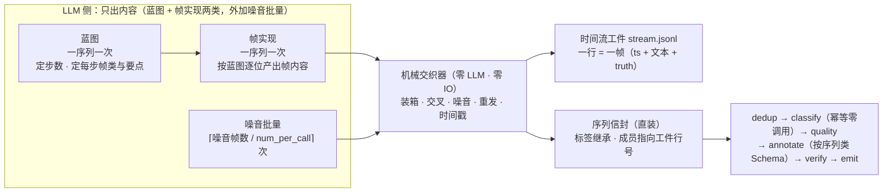
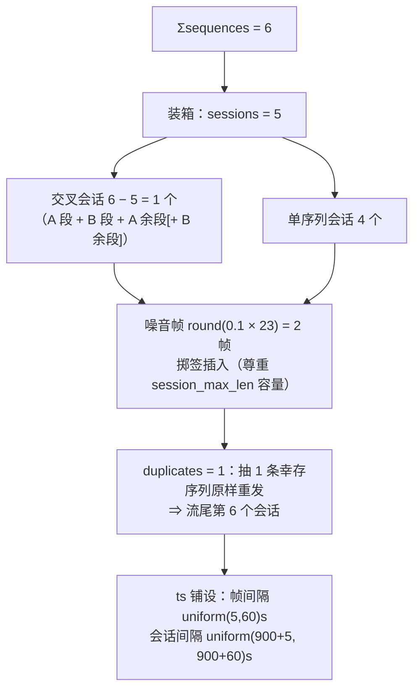

# 第 27 章　时间流生成：从零合成一条带时间戳的多会话流

> 时间流生成是 v1.13 给 `generate_only` 新增的**第三形态**（`[generate.stream]`）：不消费任何输入，
> 从零合成一条**带时间戳的多会话请求流**——LLM 只负责内容（一序列一次蓝图 + 一次帧实现），
> 会话装箱、交叉、噪音插入、重复重发、时间戳铺设全部由零 LLM 的**机械交织器**完成。
> 读完本章你应当能回答三个问题：**什么时候该合成流而不是采集流？两阶段各产出什么？
> 两份产物怎么读、怎么重放？**v1.14 又给这个形态加了两个正交增量：**帧类构成档位**
> （一档 = 一种帧类构成，按权重把类配额零抽签地分到各档，27.4）与**时间字段回填**
> （帧 Schema 里的时间语义字段由时间轴机械算出，LLM 物理上不生成它，27.5）；
> v1.15 再把档位表**按类化**（每个序列类可以自带一张档位表，整表取代全局表，27.4 末尾）。
> 三者默认关闭，全关就与 v1.13 完全一样。本章样例全部来自 `examples/synth-stream`
> 的真实运行（单端点 DeepSeek，退出码 0）。

## 27.1 为什么要合成时间流：要序列样本，但手上没有流

第 25、26 章处理的是**采集来的**真实流：先会话化、再语义分段，把帧流切成 episode、缝成线索。前提是你已经有流。但很多时候没有——新场景还没上线、隐私合规采不到、或者想要的极端形态（任务被打断三次、噪音率 20%）在真实数据里根本凑不齐几条。

第 12 章的平面生成能造数据，但造不出**序列**：它一次调用产出 N 条互不相干的独立文本，没有先后、没有会话、没有「同一条任务的第三步」。把这些独立文本硬拼成流也不行——彼此之间没有语义推进，分段算子一跑就知道那不是一段任务。

两种生成形态的分工：

| | 平面生成（第 12 章） | 时间流生成（本章） |
|---|---|---|
| 一次 LLM 调用产出 | `num_per_call` 条独立文本 | 一条序列的蓝图，或这条序列的全部帧内容 |
| 产出单位 | 一条记录 = 一行 | 一条**序列** = 一行（成员帧另落工件） |
| 时间维度 | 无 | 有：ts 严格递增、会话按 `gap_s` 可切分 |
| 结构维度 | 无 | 会话装箱、两序列交叉、噪音插入、原样重发 |
| 配额载体 | `num_per_record` / `standalone_count` | `[class.<名>.generate].sequences` × `len_range` |
| 产物文件 | 主输出 | 主输出 **+ 时间流工件**（可当输入重放） |
| 下游链 | dedup → (classify) → quality → annotate → verify | 同左，且全部以**序列**为单位 |

心智模型是**两阶段 + 机械交织**：内容交给 LLM（它擅长写一句像人说的话），结构交给代码（它擅长严格、可复现、零成本地摆位置）。



这套分工不是发明：两阶段合成（先出计划、再填内容）是 M2M、Schema-Guided Dialogue、APIGen-MT 一路的既有工序——**计划期就知道每一帧是什么角色，真值因此零再标注**；噪音在计划层注入而非事后掺沙，是过程挖掘一侧（PLG2 及 2025 年的真值方法综述）反复强调的保真值链接做法。LabelKit 把它装进单机流水线：蓝图与实现各一次调用，其余全是确定性代码。

**什么时候开**：`run.mode = "generate_only"` + 要的样本单位是「一段活动」而不是「一条文本」。开关是 `[generate.stream].enabled = true`，它是一组**硬合取**前提（缺一即启动配置错误，退出码 2）：

```
generate_only ∧ modality = "text" ∧ generate.enabled ∧ classify.enabled
              ∧ stream.order_by = "meta:<字段>" ∧ output.meta_mode ≠ "none"
```

后三条各有各的道理：类表是配额与按类条件化的载体（标签在生成期已知，直接继承，**零判决调用**）；`order_by` 声明的字段名就是工件行的时间戳字段名（摄取侧按同一声明重放）；帧类真值只经 `_meta.stream.members[]` 承载，丢了元信息就丢了全部真值。segment / stitch / extract **不参与**本形态——流是造出来的，不需要再切一遍；抽取仅 UI 模态。UI 模态的时间流生成是 v1.13 的明确非目标。

## 27.2 快速上手：examples/synth-stream 全流程

仓库自带的 `examples/synth-stream` 是第五个示例工程，也是本形态的完整展台：**两个序列类**（`ticket_booking` 高铁购票 / `smart_home` 智能家居）各 3 条序列、**三个帧类**（`task_request` / `followup` / `confirmation`）、**两张档位表**（一张全局的、一张 `ticket_booking` 自带的，v1.14 + v1.15，27.4）、5 个会话、10% 噪音、1 条原样重发，外加一处**时间字段绑定**（v1.14，27.5）。它**自含**一份 `config.toml`（不复用 `../config.toml`）——单 profile 纯文本端点：

```toml
[llm.default]
provider = "anthropic"
base_url = "https://api.deepseek.com/anthropic"
model = "deepseek-v4-flash"
api_key_env = "LABELKIT_DEEPSEEK_KEY"
supports_structured_output = false   # 该路由实测硬拒强制工具调用（400）⇒ L0 全关（第 6、14 章）
supports_vision = false              # 时间流生成恒 text 模态，零视觉调用
context_window = 131072
```

`supports_structured_output = false` 意味着**结构化输出层全关**——蓝图与帧实现的结构服从性完全靠提示词内嵌的结构契约撑着，JSON 由结构引擎的确定性修复层解析、校验层把关（27.5 有这条的实测代价）。逐节看 `project.toml`。

**第一节：形态开关与铺设契约。**

```toml
[run]
output = "./out/synth-labels.jsonl"
modality = "text"                 # 时间流生成恒 text 模态
mode = "generate_only"            # 没有 run.input（写了就是配置错误）
batch_size = 8                    # 6 条序列 ⇒ 一批跑完
seed = 20260813                   # 交织器单流抽签的唯一随机源

[input]
text_field = "text"               # 工件行的文本字段名（重放时 M2 按同一声明提取）

[stream]                          # 生成侧的铺设契约（复用摄取侧词汇，故可重放）
order_by = "meta:ts"              # 工件行的时间戳字段名由此声明（此处即 "ts"）
gap_s = 900                       # 会话间隔恒 > 15 分钟

[generate]
enabled = true
llms = ["default"]
num_per_call = 4                  # 本形态下仅噪音批量生成按此装箱
temperature = 0.9                 # 蓝图与帧实现同温

[generate.stream]
enabled = true
sessions = 5                      # 交叉会话数 = Σsequences − sessions = 6 − 5 = 1
noise_ratio = 0.1                 # 噪音帧 / 任务帧 ≈ 10%
noise_instruction = """生成与任何任务都无关的干扰输入：……长度 5–20 字。"""
duplicates = 1                    # 原样重发 1 条序列到流尾新会话
frame_gap_s = [5, 60]             # 会话内帧间隔均匀采样（秒），上界须 < stream.gap_s
ts_start = "2026-01-05T09:00:00+08:00"   # 时间流起点（恒不取墙钟）
```

**第二节：序列类表与按类配额。**类表在这里只是**载体**——生成期就知道每条序列属于哪个类，classify 幂等继承、零调用（所以 `report.classify` 的直方图恒全零是预期，不是 bug）。本形态下类表放宽为 ≥1 类、`fallback_class` 免填：

```toml
[classify]
enabled = true                    # 硬合取要求；标签继承（inherited），零判决调用

[[classify.classes]]
name = "ticket_booking"
description = "高铁购票类会话：查车次、订票、改签退票、选座与票务证件等围绕一次铁路出行的连续请求"

[[classify.classes]]
name = "smart_home"
description = "智能家居指令类会话：控制灯光空调窗帘等设备、设定定时与场景、查询设备状态的连续指令"

[class.ticket_booking.generate]
instruction = """你在为高铁购票场景合成真实用户与语音助手的一次对话序列。序列围绕**同一次出行**
展开：……要求口语化、中文、每帧一句话，前后帧之间信息连贯且有推进（不得原地重复）。"""
sequences = 3                     # 尝试配额（无输出条数保证，作废序列不补齐）
len_range = [3, 5]                # 单序列步数的均匀采样区间
```

**第三节：帧类表、构成档位与帧内容契约。**蓝图逐步在帧类闭集上取值，**帧类即帧级真值**——所以 `frame.classify.enabled` 保持 false（真值已知，无需判决）。每个帧类都必须给出生成指令；声明了 `schema_*` 的帧类产出**结构化帧**：

```toml
[[generate.stream.tiers]]         # v1.14 全局档位表：一档 = 一种帧类构成（27.4）
tier_rank = 1
weight = 2                        # smart_home 吃这张表：sequences = 3、权重 2 : 1 ⇒ 配分 2 + 1
frame_classes = ["task_request", "followup"]

[[generate.stream.tiers]]
tier_rank = 2
weight = 1
frame_classes = ["task_request", "followup", "confirmation"]   # 恰用全三类

[[class.ticket_booking.generate.tiers]]   # v1.15 按类档位表：整表取代全局表
tier_rank = 1
weight = 1                        # 本类权重 1 : 2（与全局方向相反）⇒ 配分 1 + 2
frame_classes = ["task_request", "followup"]

[[class.ticket_booking.generate.tiers]]
tier_rank = 2
weight = 2
frame_classes = ["task_request", "confirmation"]   # 全局表里没有的构成：确认直达、无追问

[[frame.classify.classes]]
name = "task_request"
description = "发起任务的首帧请求：说明诉求并给出已知要素"
# followup / confirmation 两类同构，略

[frame.class.task_request.generate]
instruction = """产出发起任务的首帧：utterance 是用户说出的那一句话（口语、中文），
entities 逐项列出这句话里出现的关键要素……"""
schema_inline = """
{"type": "object",
 "properties": {"utterance": {"type": "string"},
                "entities": {"type": "array", "items": {"type": "string"}},
                "duration": {"type": "number"}},
 "required": ["utterance", "entities", "duration"], "additionalProperties": false}
"""

[frame.class.task_request.generate.time_fields]   # v1.14 时间字段绑定（27.5）
duration = "gap_next_s"           # 值由时间轴机械回填，LLM 面前根本没有这个字段

[frame.class.followup.generate]
instruction = """产出一句追问或修改：……口语、中文、一句话。"""   # 无 schema ⇒ 纯文本帧
```

**第四节：下游治理。**质量门 + 按序列类各一份标注 Schema（27.6 的正戏）+ 判决形评审：

```toml
[quality]
enabled = true
mode = "pointwise"
threshold = 0.3                   # 质量门演示；rubric 留空 ⇒ 自动解析为 default:trajectory

[annotate]
enabled = true
instruction = """你是时间流请求序列的标注员。阅读整段序列……"""

[verify]
enabled = true
policy = "repair"
max_repair_rounds = 1

[output]
meta_mode = "inline"              # 本形态下不得为 "none"
```

跑起来（`out/` 不入库，须先建）：

```bash
cd examples/synth-stream && mkdir -p out
set -a && source ../../.env && set +a
uv run labelkit run --config config.toml --project project.toml
```

先用 `--dry-run` 看账（真实 golden，逐字节）：

```
dry-run: mode=generate_only estimated_records=6 batches=1
dry-run: estimated LLM calls — generate_calls=13 segment_calls=0 stitch_calls=0 classify_calls=0 frame_classify_calls=0 extract_calls=0 quality_calls=24 annotate_calls=6 frame_annotate_calls=0 verify_calls=6 total=49 (excludes retries and repair calls)
dry-run: note: estimated with global config / multi reports a lower bound at label multiplier 1
dry-run: no LLM calls made, no output written (report only)
```

`generate_calls = 13` = 2 × 6 序列 + ⌈2 噪音帧 / 4⌉ = 12 + 1；`classify_calls = 0` 是继承标签的直接体现。**这一行不是上界估算，是精确复演**——估算分支吃的是同一套计划期纯函数（同 `seed` 同配置），序列长度、噪音帧数、会话装箱全部按真实抽签算一遍（27.9 的成本账里有它与实跑的差额分解）。

真跑的终版摘要（与 `report.counts` 逐项一致，退出码 0，全程约 70 秒）：

```
   ── final summary (matches report.counts item by item) ──
   scanned=0  ingested=0  bad_input=0  generated=6
   dropped_dup=0  dropped_lowq=0  dropped_verify=0  failed=0  emitted=6
```

`scanned=0`（没有输入这回事），守恒恒等式取 generate_only 的退化形 `emitted + dropped_* + failed = generated` → `6 + 0 = 6` ✓。**成员帧不成为信封**——它们只活在工件里，既不进主输出也不进拒绝通道，账上不出现 `absorbed` / `episodes`（那是分段算子的记账项，第 25 章）。落盘的产物（本工程 trace 未开，开了就是第五个通道，第 8 章）：

```
out/synth-labels.jsonl          主输出（6 行 = 6 条序列）
out/synth-labels.stream.jsonl   时间流工件（29 行 = 29 帧）   ← v1.13 新增的输出通道
out/synth-labels.rejects.jsonl  拒绝通道（0 行）
out/synth-labels.report.json    运行报告
```

## 27.3 `[generate.stream]` 逐键

| 键 | 默认 | 语义与约束 |
|---|---|---|
| `enabled` | false | 形态总开关；全关时全系统与 v1.12 **字节等价**（含七个既有 dry-run golden） |
| `sessions` | 0 | 会话数，≥ 1。**交叉会话数 = Σsequences − sessions**，故 M1 要求 `sessions ≤ Σsequences ≤ 2 × sessions`（交叉并发度恒 k ∈ {1,2}） |
| `noise_ratio` | 0.0 | 噪音帧 / 任务帧 比例，∈ [0,1)；噪音帧数 = `round(比例 × 任务帧数)`。> 0 时 `noise_instruction` 必填非空 |
| `noise_instruction` | "" | 噪音帧的生成指令（走既有平面生成模板批量产出） |
| `duplicates` | 0 | 原样重发的序列条数，∈ [0, Σsequences]；重发帧逐字节同源，**恒落流尾新会话** |
| `frame_gap_s` | [5, 60] | 会话内帧间隔的均匀采样区间（秒）；`1e-6 ≤ lo ≤ hi < stream.gap_s`——上界越线则会话内间隔自己就触发会话切分，下界那个**微秒地板**是时间戳分辨率的底（亚微秒间隔会被取整成 0，破坏 ts 严格递增，v1.14 起直接拒） |
| `ts_start` | `2026-01-01T00:00:00Z` | 时间流起点（ISO-8601，**恒不取墙钟**——同 seed 双跑工件才可能逐字节一致） |

配额不在这张表里——它按类挂在 `[class.<名>.generate]`（27.4）；`[generate.stream]` 下另有一张可选的子表 `[[generate.stream.tiers]]`（v1.14 的帧类构成档位，三个键；v1.15 起序列类还能用同结构的 `[[class.<名>.generate.tiers]]` 整表覆盖它，都在 27.4）。另有三条**铺设契约**由 M1 静态校验：`stream.key` 必须为空数组、`stream.gap_steps` 必须为 0（会话边界由交织器直接铺设，分区键与序差断开不参与）、`2 × max(各类 len_range 上界) ≤ stream.session_max_len`（交叉会话恒装两条序列）。设了 `session_max_span_s` 还会按最坏帧间隔做一次静态跨度校验。

### 会话账怎么算

本工程的账（Σsequences = 2 类 × 3 = 6，sessions = 5）：



于是工件里共 **6 个会话、29 行** = 23 个任务帧（`report.generate.stream.frames`）+ 2 个噪音帧（`noise_frames`）+ 4 个重发帧（被抽中重发的那条序列恰好 4 帧）。噪音帧数按**任务帧**折算：`round(0.1 × 23) = 2`。注意 `report.generate.stream.sessions = 5` **不含重发尾会话**——它数的是装箱出来的会话数，重发是交织末尾追加的一步。

### 确定性：单流抽签，同 seed 双跑逐字节一致

交织期的全部随机都从 `run.seed` 派生的**单条随机流**顺序消费，顺序是冻结的：计划期先按类名字典序展开配额、逐序列抽长度、逐序列预抽 (模型, 风格)；交织期依次是重复选取 → 装箱洗牌与成对交叉 → 逐交叉会话的切换点 → 逐噪音帧的 (会话, 槽位) → 时间戳铺设。v1.14 的两个新机制与 v1.15 的按类档位都**不插进这条流**：配分是整数纯函数（无论吃全局表还是按类表）、时间字段回填是时间轴算术，一个随机数都不取——所以同一个 `seed` 在开关前后抽出的长度与 (模型, 风格) 序列逐字节相同。本章的时间戳样例正是这条的实证：换用按类档位表之后，工件逐行的 `ts` 与 v1.14 那次真跑一模一样，变的只有内容与档位归属。同 seed 双跑的交织产物逐字节一致——**前提是蓝图与帧实现的 LLM 输出也一致**：某条序列作废会改变交织的输入集，后续抽签随之整体位移（27.9 有这条的实测）。

## 27.4 按类配额与长度：sequences × len_range

配额是**尝试配额**，语义与平面生成的 `standalone_count` 一致：**没有输出条数保证、没有补齐回路**。声明 `sequences = 3` 意味着计划 3 条，作废一条就少一条，工具不会再补生成。

```toml
[class.ticket_booking.generate]
instruction = """……"""   # 参与生成的类必填非空
sequences = 3             # 尝试配额 ≥ 1
len_range = [3, 5]        # 单序列步数的均匀采样闭区间，1 ≤ lo ≤ hi
```

两个键都可以在全局 `[generate]` 里设默认值（`sequences` 默认 0、`len_range` 默认 `[3, 6]`），按类覆盖。M1 只要求**至少一个类的有效 `sequences ≥ 1`**，且参与生成的类有非空指令。

**按类覆盖白名单在本形态下的六个键**：`instruction` / `styles` / `temperature` / `sequences` / `len_range` / `tiers`（最后一个是 v1.15 的按类档位表，见本节末尾；完整白名单表见第 24 章 24.4 与附录 A.9）。反过来，专属**平面形态**的那几个键在本形态下显式书写是**定向配置错误**，不走「未知键仅告警」的前向兼容兜底：`[generate]` 的 `seed_examples` / `standalone_count` / `num_per_record` / `seeds_per_call`，以及 `[class.*.generate]` 的 `num_per_record` / `seeds_per_call`。报错文案会指明替代面（配额改用 `sequences`、长度改用 `len_range`）。

**生成键的效力矩阵**（与平面形态的差异都在这张表里）：

| 键 | 在时间流形态下 |
|---|---|
| `llms` / `mixture` / `weights` | 生效：**每序列预抽一次**，蓝图与帧实现绑定同一 profile（噪音批调用独立预抽） |
| `[[generate.styles]]` | 生效于**帧实现与噪音**调用（每序列预抽一个风格），蓝图不带风格 |
| `temperature` | 生效：蓝图与帧实现同温，可按类覆盖 |
| `num_per_call` | **仅**噪音批量装箱生效（一批几条噪音） |
| `sample_validator` | 生效于**逐帧文本**：任一帧违规 ⇒ **整序列作废**（蓝图定长不可剔单帧，拒绝采样语义），计 `validator_scrapped` |
| `num_per_record` / `seeds_per_call` / `seed_examples` / `standalone_count` | 显式书写 = 定向配置错误（见上） |

**序列级相似度过滤**：交织之前，同一批兄弟序列之间还有一道内置过滤（判重文本 = 成员文本按序拼接，与第 9 章序列判重同一配方；参数取 `[dedup]` 三键）。淘汰以桶统计的 `survived_dedup` 差额呈现——本次真跑两个类各 `produced 3 / survived_dedup 3`，一条没被淘汰：

```json
"buckets": {
  "smart_home×default×null":     {"calls": 6, "produced": 3, "survived_dedup": 3},
  "ticket_booking×default×null": {"calls": 6, "produced": 3, "survived_dedup": 3},
  "default×null":                {"calls": 1, "produced": 4, "survived_dedup": 0}
}
```

三行读法：类桶的 key 是 `<类>×<模型>×<风格>` 三段（第 24 章的既有形态），`calls = 6` = 3 次蓝图 + 3 次帧实现，`produced` 数的是**序列**条数；第三行 `default×null` 是**噪音桶**——噪音不属于任何序列类，key 退化为两段，`produced 4` 是那次批量调用产出的 4 条噪音文本（实际只用掉 2 条），`survived_dedup` 恒为 0：序列级相似度过滤只过序列，噪音帧不参与。

### 按档位生成不同构成的序列（v1.14，v1.15 按类化）

配额只管「这个类生成几条」，管不了「每条长什么样」。可是同一个类的序列，构成粒度往往就该不同：有的只是「请求 + 追问」两类帧，有的还要带上确认收尾。v1.13 里这件事由蓝图自由取值决定——每条序列用到哪些帧类，跑完才知道，也没法按构成分账。

v1.14 的 `[[generate.stream.tiers]]` 把它变成声明式的：**一个档位的定义就是该档序列的帧类构成集合**。先看这张全局表（v1.15 让序列类可以自带一张取代它，本节末尾专讲）：

```toml
[[generate.stream.tiers]]
tier_rank = 1                     # 档位身份（表内唯一、本表连续覆盖 1..N，没有 name 键）
weight = 2                        # 配额权重（整数 ≥ 1）
frame_classes = ["task_request", "followup"]      # 该档序列恰用这两类

[[generate.stream.tiers]]
tier_rank = 2
weight = 1
frame_classes = ["task_request", "followup", "confirmation"]   # 恰用全三类
```

先划清它**不管**什么：档位不携带任何质量指令，也不管帧内部写得好不好——那归各帧类的 `instruction` 与温度。`tier_rank` 只是「第几档的要求」，**工具不赋予序数高低任何质量方向语义**：想让 1 档表示精细、还是让 N 档表示精细，由你自己定义并在下游一致地使用。

**配分是纯函数，不消费随机数。**每个类的 `sequences` 按各档 `weight` 走整数域**最大余额法**分配：基额 = `(sequences × weight) // Σweight`，余额键 = `(sequences × weight) mod Σweight`，按余额键降序（平票按 `tier_rank` 升序）逐档 +1 直到分完。`smart_home` 吃的是上面这张全局表（`sequences = 3`、权重 2 : 1、Σweight = 3）：

```
基额：档 1 = (3 × 2) // 3 = 2      档 2 = (3 × 1) // 3 = 1      合计 3 = 配额 ✓（余额均为 0，无需补位）
⇒ smart_home 出 2 条一档序列、1 条二档序列
```

余额补位长什么样，换个数就看得见：`sequences = 4`、权重仍 2 : 1 时基额是 2 + 1 = 3，差 1 条；余额键 `8 mod 3 = 2` 与 `4 mod 3 = 1`，档 1 的余额大，于是 **档 1 = 3、档 2 = 1**。全程整数运算、没有浮点中间量，因此同一份配置在任何机器上配分结果都一样。

**构成语义是恰等，不是「至多这些类」。**蓝图调用两头夹：帧类 enum 只列档内的类（给「⊆」），再对档内每个类各加一条 `contains` 约束（给「⊇」），合起来就是「档内每类至少出现一次、档外一类都不许出现」。所以 `len_range` 的下界必须 ≥ **该类生效表**里最大档位的构成大小——`smart_home` 的下界 3、全局二档三类，恰好装得下；改成 2 会在启动时报配置错误（M1 逐 (类, 档) 非零配额对硬查），而不是悄悄产出缺类的序列。

**档位序数落在三处，同一个值三个面。**都来自本次真跑，逐字：

```json
// ① 主输出每行的 _meta.source.generator（档位表在场时三键）
"generator": {"llm": "default", "style": null, "tier_rank": 1}

// ② 工件行的 truth.tier_rank——三种形态：任务帧 = 本档序数（第 13 行，购票类二档）
{"ts": "2026-01-05T09:38:10.402679+08:00", "text": {…}, "truth": {"session": 2, "sequence_class": "ticket_booking", "sequence": 2, "tier_rank": 2, "frame_class": "task_request", "noise": false}}
// 噪音帧 = null（第 12 行——噪音不属于任何序列，自然也不属于任何档）
{"ts": "2026-01-05T09:22:20.673020+08:00", "text": "这雨下得真大啊", "truth": {"session": 1, "sequence_class": null, "sequence": null, "tier_rank": null, "frame_class": null, "noise": true}}
// 重发帧 = 承源档（第 26 行——原样重发的是内容，档位是内容属性）
{"ts": "2026-01-05T10:28:43.981411+08:00", "text": {…}, "truth": {"session": 5, "sequence_class": "smart_home", "sequence": null, "tier_rank": 1, "frame_class": "task_request", "noise": false, "duplicate_of": 0}}
```

第三处是 `report.generate.stream.tiers`（counts-only，键位冻结在 `sequences` 之后、`frames` 之前）——它有平面与类嵌套两种形状，取决于有没有按类表，下一小节连着按类档位一起讲。

`truth` 的键序也因此微调：`session, sequence_class, sequence, tier_rank, frame_class, noise[, duplicate_of]`——`tier_rank` 只在档位表在场时出现，位置在序列身份组之后。档位表缺省时这三处一概不在场，产物与 v1.13 逐字节相同。

### 按类档位表：每个序列类一张自己的表（v1.15）

一张全局表管所有类，前提是所有类的「构成粒度谱系」长得一样。可它们往往不一样：购票会话想要一档「问清楚要素、来回追问」和一档「一句话说全、直接确认下单」；智能家居的谱系却是「纯指令」到「指令 + 追问 + 确认」。硬塞进一张表，只能取两者的并集，然后眼睁睁看着一半的档对一半的类没意义。

v1.15 的 `[[class.<名>.generate.tiers]]` 让序列类自带一张表，**整表原子取代**全局表——不是逐行合并（行级合并会让 `tier_rank` 的身份在两张表之间漂移）。本工程给 `ticket_booking` 声明了一张：

```toml
[[class.ticket_booking.generate.tiers]]
tier_rank = 1                     # 类内身份：本表自己连续覆盖 1..2，与全局表的 rank 不可比
weight = 1
frame_classes = ["task_request", "followup"]

[[class.ticket_booking.generate.tiers]]
tier_rank = 2
weight = 2
frame_classes = ["task_request", "confirmation"]   # 全局表里没有的构成：确认直达、不带追问
```

`smart_home` 不声明，回落全局表。于是同一次运行里跑着**两套档位谱系**，四条规则把它们钉住：

1. **表级原子覆盖**：类声明了就整张换掉，一行都不从全局表继承。想让某个类「不分档」，给它一张单档表（`tier_rank = 1` + 任意构成）；写 `tiers = []` 是显式空表，M1 拒收并指引你删键回落。
2. **全局表是锚**：声明按类表要求全局表在场（缺了是启动配置错误）。因此「档位面开没开」永远等价于「全局表非空」——每个参与类恒有一张生效表，`generator` / `truth` / 报表三处的在场性不会逐行漂移。
3. **`tier_rank` 只是类内身份**：每张生效表各自连续覆盖 `1..N`，`N` 逐类可以不同；**跨类的同一个 rank 没有任何工具语义**，跨类撞构成也完全合法（本工程两张表的第 1 档就是同一个构成）。所以读一行的档位必须连着它的类一起读——主输出行携 `_meta.classification.label`、工件行携 `truth.sequence_class`，与 `tier_rank` 同行相邻，行级消歧不花额外代价。
4. **配分逐类各算各的**：`ticket_booking` 的 `sequences = 3` 落在本表的权重 1 : 2 上 ⇒ **1 + 2**，与 `smart_home` 在全局表 2 : 1 上的 **2 + 1** 方向刚好相反。两个类的 `len_range` 下界都是 3，各自 ≥ 自己生效表的最大构成大小（购票两档都是 2 类、智能家居二档 3 类），逐 (类, 档) 的长度硬查照过。

**报表随之两形。**只有全局表时 `tiers` 是平面形 `{"<rank>": {planned, produced}}`（与 v1.14 逐字节相同）；任一按类表在场即切**类嵌套形**——外层是全部声明类按声明序、内层是该类生效表的 rank 升序。本次真跑：

```json
// report.generate.stream.tiers（类嵌套形，因为 ticket_booking 声明了按类表）
"tiers": {
  "ticket_booking": {"1": {"planned": 1, "produced": 1},
                      "2": {"planned": 2, "produced": 2}},
  "smart_home":     {"1": {"planned": 2, "produced": 2},
                      "2": {"planned": 1, "produced": 1}}
}
```

读法是「先按类、再按档」：每个类的内层 `planned` 求和恒等于该类的 `sequences`（1 + 2 = 3、2 + 1 = 3），而外层各类求和回到 `sequences` 子块的那笔账。**内层的键集逐类可以不一样**（一个类三档、另一个类一档是合法配置），所以消费方别写死键名，按类迭代。零配额类与全作废档一律呈现 `0/0`——这块是按声明表**显式装配**出来的，不是从计数器里捡的，所以「一条都没产出的档」不会凭空消失。

**档位身份可以从数据反推，不必信标签。**因为构成是恰等的，每一行的 `members[]` 帧类集合就该等于**它那个类**声明的那个档。本次真跑逐行对账（主输出 6 行）：

| 主输出行 | 序列类 | 生效表 | `generator.tier_rank` | `members[]` 的帧类集合 | 与档声明 |
|---|---|---|:-:|---|:-:|
| 1 | smart_home | 全局 | 1 | {task_request, followup} | ✓ |
| 2 | smart_home | 全局 | 1 | {task_request, followup} | ✓ |
| 3 | smart_home | 全局 | 2 | {task_request, followup, confirmation} | ✓ |
| 4 | ticket_booking | 按类 | 1 | {task_request, followup} | ✓ |
| 5 | ticket_booking | 按类 | 2 | {task_request, confirmation} | ✓ |
| 6 | ticket_booking | 按类 | 2 | {task_request, confirmation} | ✓ |

第 3 行与第 5、6 行并排看，就是按类表存在的理由：**同样叫「第 2 档」，智能家居是全三类、购票是「请求 + 确认」两类**。逐类计数 1/2 与 2/1，与嵌套 `tiers` 的 `produced` 逐键对齐。这是本形态最省事的一条验收——一行 `jq` 就能跑完全量：拿 `_meta.stream.members[].label` 去重排序，用 `_meta.classification.label` 选出该类的生效表，再与该行 `tier_rank` 对应的 `frame_classes` 比集合。

**`produced` 少于 `planned` 时，嵌套账告诉你缺口落在哪个类的哪一档。**同一份配置的另一次真跑（`out-run1/`）有一条序列在帧实现阶段作废（`realize_failures = 1`），报表读出来是这样：

```json
"sequences": {"ticket_booking": {"planned": 3, "produced": 2},
               "smart_home":     {"planned": 3, "produced": 3}},
"tiers": {
  "ticket_booking": {"1": {"planned": 1, "produced": 1},
                      "2": {"planned": 2, "produced": 1}},
  "smart_home":     {"1": {"planned": 2, "produced": 2},
                      "2": {"planned": 1, "produced": 1}}
},
"frames": 19, "noise_frames": 2, "duplicates": 1,
"plan_failures": 0, "realize_failures": 1, "validator_scrapped": 0
```

一眼定位到 `ticket_booking` 的第 2 档：`sequences` 只说「购票类丢了一条」，嵌套 `tiers` 直接指出丢在「确认直达」那一档上。缺口连着两跑都压在同一个 (类, 档) 上，处置就是给那一档减一个帧类、或者给该类放宽 `len_range` 上界；散落在各 (类, 档) 上则是普遍的温度/契约压力（27.9 的调参口诀）。这一跑还顺带演示了 `crossed_sessions` 的退化：5 条幸存序列装不满 5 个会话的交叉位，交叉就没了（`crossed_sessions = 0`），工件 25 行 = 19 任务帧 + 2 噪音帧 + 4 重发帧。

**三条边界提醒。**其一，帧类表里**没被任何生效表收录**的帧类会得到一条启动 WARN——它永远不会被蓝图选中，它的 `[frame.class.<名>.generate]` 整节（含时间字段绑定）都是死配置；相应地，v1.13「每个帧类都必填 `instruction`」的检查域在档位表在场时收窄为**各参与类生效表构成的并集**。注意这个并集是按类算的：全部参与类都声明了按类表时，全局表就沦为纯粹的锚，它独有的帧类照样判死配置。其二，某个 (类, 档) 组合按最大余额法配到 0 条也会 WARN（小配额 + 权重悬殊时的自然结果，不是错误），嵌套 `tiers` 里那一格会如实呈现 `0/0`。其三，`sequences = 0` 的类声明了按类表，结构校验（rank 连续、构成合法、非空）照做，只是配额相关的那两条（长度下界、零额 WARN）豁免——坏配置早报，但不为一条都不会产的组合抬高别的门槛。

最后一条与 `--limit` 的交互：类内序数按**本类生效表**的 `tier_rank` 升序占**连续区间**（低档序数在前），而 `--limit` 在配额层取前缀（类按类名字典序展开、类内按序数升序），所以截断落到哪个类身上，就从那个类的**最高档序数侧**截起。按类表在场时这笔账要逐类算：本工程 `--limit 4` 保住 `smart_home` 全 3 条（一档两条 + 二档一条），`ticket_booking` 只剩一档那一条，它的两条二档序列全没了。小样本试跑因此默认偏向低档构成——想试高档，临时把该类那一档的 `weight` 提上去。

## 27.5 帧类生成面：结构化帧与纯文本帧

帧类表复用 `[[frame.classify.classes]]` 这张表（`frame.classify.enabled` 保持 false——真值已知，帧级判决没有意义；显式开它是定向配置错误，与本形态互斥）。每个帧类**都必须**在 `[frame.class.<名>.generate]` 里给一条非空 `instruction`：蓝图的 enum 覆盖全类表，任一帧类都可能被选中。（开了档位表之后这句话收窄一档——enum 只列档内的类，必填检查域相应缩到各档构成的并集，见 27.4 末尾的两条边界提醒。）

| 声明了 `schema_path` / `schema_inline`（至多其一） | 帧的形态 |
|---|---|
| 是 | **结构化帧**：帧内容是一个对象，按规范化 JSON 落工件行的文本字段 |
| 否 | **纯文本帧**：帧内容直接是一句话 |

本工程只给 `task_request` 配了 Schema，于是工件里两种帧并存（真实产物第 1 行与第 3 行，逐字）：

```json
{"ts": "2026-01-05T09:00:00.000000+08:00", "text": {"utterance": "你好，我想买明天上午从北京到上海的高铁票。", "entities": ["北京", "上海", "明天上午", "高铁"], "duration": 71.053996}, "truth": {"session": 0, "sequence_class": "ticket_booking", "sequence": 0, "tier_rank": 1, "frame_class": "task_request", "noise": false}}
{"ts": "2026-01-05T09:01:11.053996+08:00", "text": "麻烦帮我选二等座，还有我们一共两位乘客。", "truth": {"session": 0, "sequence_class": "ticket_booking", "sequence": 0, "tier_rank": 1, "frame_class": "followup", "noise": false}}
```

（结构化帧里的 `duration` 不是模型写的——它是时间字段回填的产物，本节末尾专讲。）

结构化帧的 `text` 值是**对象**本身（工件是数据文件，不是字符串容器）；重放时 M2 按既有语义把对象投影成规范化 JSON 文本参与去重与打分（第 5 章「text_field 的三种命中形态」的第二种）。帧类 Schema 会被逐位包进实现调用的内部 Schema 当子模式，所以**不要写顶层 `$schema` 声明**。

**L0 关掉的端点上，逐位契约靠提示词。**帧实现调用要求模型一次产出恰好 L 帧、且第 i 帧符合第 i 个帧类的契约。声明了 `supports_structured_output = true` 的端点上这由供应商的结构化输出层（L0）兜着；本工程的端点实测硬拒强制工具调用、profile 因此声明 `false`，**L0 全关**——结构服从性完全由提示词内嵌的结构契约承担（`{"frames": [...]}` 形状句 + 逐位「第 i 帧（帧类）须符合……」）。校验侧不受影响：`prefixItems` 是 draft 2020-12 的正规关键字，jsonschema 校验层原生逐位校验，违约照常进修复环（第 14 章）。实测结论有两面：本次真跑 **6/6 全成**（`realize_failures = 0`、用户 Schema 侧 `resolved_at` 一次修复都没花），但温度 0.9 下**偶发**违约确实存在——同一份配置的另一次真跑就有 1 条序列在这里作废（`out-run1/` 的 `realize_failures = 1`，27.4 末尾按 (类, 档) 拆过那笔账），违约形态是逐位类型错（`/frames/0: type`：该位要的是结构化帧对象，模型给了一句纯文本）。处置是保守的：修复环耗尽 ⇒ **该序列整条作废**，不产 failed 记录、不补生成（成本与调参口径见 27.9）。开了档位表之后，「档内每类至少一次」这条覆盖约束走的是同一条路——L0 关掉时靠提示词里的覆盖句撑着，违约进同一个修复环（修复提示会点名缺了哪个帧类），耗尽同样是整条作废。另一个方向的锐边：个别对结构化输出关键字挑剔的路由会对含 `prefixItems`（或档位表带来的 `allOf` / `contains`）的请求直接 400——处置同样是配置级的，把该 profile 的 `supports_structured_output` 声明为 `false`，走「文本 + 确定性修复层解析」的路径，不需要动任何调用级参数（第 14 章 14.7 有这条的完整读法，包括 400 的失败形态）。

### 时间字段回填（v1.14）

结构化帧的 Schema 里常有「时间语义」的字段——本工程 `task_request` 的 `duration` 就是：这一步花了多久、离下一步多远。问题是 **LLM 没有时间轴**：帧内容在铺时间戳之前就生成好了，模型写出来的秒数纯属编造，与工件里那条真实时间轴对不上。

v1.14 的处置是「绑定即剔除 + 机械回填」：把字段绑给一个时间语义，它就从 LLM 面前消失，值由工具在时间戳铺好之后算出来写回。

```toml
[frame.class.task_request.generate]
instruction = """产出发起任务的首帧：utterance 是用户说出的那一句话（口语、中文），
entities 逐项列出这句话里出现的关键要素……"""
schema_inline = """
{"type": "object",
 "properties": {"utterance": {"type": "string"},
                "entities": {"type": "array", "items": {"type": "string"}},
                "duration": {"type": "number"}},
 "required": ["utterance", "entities", "duration"], "additionalProperties": false}
"""

[frame.class.task_request.generate.time_fields]   # 仅结构化帧合法（纯文本帧带它是配置错误）
duration = "gap_next_s"                # 键 = 生成 Schema 顶层字段名；值 = 语义词表取值
```

注意 `duration` 照旧写在**完整的**生成 Schema 里（含 `required`）——工件里的帧对象要满足它。被剔除的只是 LLM 面向的那份：逐位 Schema 删掉这个键、契约行也不提它。推论有两条：**你不必也不该在 `instruction` 里要求模型产出它**（要求了也没用，模型看不到这个字段）；万一模型自作主张多写一个 `duration`，`additionalProperties: false` 会把它挡下来、修复环要求删掉——语义正确。

语义词表是**闭集四值**：

| 绑定值 | 含义 | 类型必须字面写作 | 边界 |
|---|---|---|---|
| `ts` | 本帧已铺的时间戳（ISO 串） | `"string"` | 任务帧上 = 该行的 ts 字段值；**重发帧上承源值、≠ 自身行的 ts**（同下） |
| `gap_prev_s` | 与本序列**上一帧**的间隔秒 | `"number"` | 首帧恒 `0.0` |
| `gap_next_s` | 与本序列**下一帧**的间隔秒 | `"number"` | 末帧恒 `0.0` |
| `elapsed_s` | 距本序列**首帧**的秒数 | `"number"` | 首帧恒 `0.0` |

数值取 `round(ts 差秒, 6)`（微秒精度，与时间戳的 isoformat 对齐）。类型要求是**字面恰等**：`ts` 的属性 Schema 必须正好写 `"type": "string"`、其余三值必须正好写 `"type": "number"`——联合类型数组、缺 `type`、或经 `$ref` 间接声明都判不匹配，启动即配置错误。还有一条余量规则：绑定完之后至少得给 LLM 留一个可生成的字段（全绑定 = 配置错误）。

**间隔按「本序列相邻成员」计，不是按工件的相邻行。**这条口径最容易看错，而本次真跑正好给了两个铁证。工件第 1 行的 `duration = 71.053996` 秒——**比 `frame_gap_s` 的上界 60 还大**，看着像违约，其实完全对：

```
第 1 行  09:00:00.000000   ticket_booking 序列 0 的 task_request   ← duration 绑 gap_next_s
第 2 行  09:00:56.012563   ticket_booking 序列 1 的 task_request   ← 交叉进来的另一条序列，不计
第 3 行  09:01:11.053996   ticket_booking 序列 0 的 followup       ← 序列 0 的下一帧就是它
                           09:01:11.053996 − 09:00:00.000000 = 71.053996 ✓
```

第 2 行更夸张：`duration = 151.258975`，它那条序列的下一帧要等到第 6 行（09:03:27.271538），中间隔着序列 0 的三帧。所以「一个 duration 大于帧间隔上界」不是 bug，而是这一帧的下一步被交叉序列或噪音帧顶开了——**下游要的正是这个墙钟意义上的真实间隔**，不是相邻行差。`frame_gap_s` 约束的是**相邻行**的铺设间隔，两个量本来就不是一回事。

**重发行承源，不与自己那条时间轴对账。**原样重发的帧与源帧引用的是**同一个载荷对象**，所以 `duration` 与 `tier_rank` 都是源会话的值：

```
第  8 行（源）    09:19:39.035531，duration 45.413886；同序列下一帧 09:20:24.449417，差 45.413886 ✓
第 26 行（重发）  10:28:43.981411，duration 45.413886；本会话下一行 10:29:16.584285，差 32.602874 ✗
```

第 26 行那个「✗」是**预期**：原样重发本就意味着搬运陈旧内容，内容里的时间量当然还是当初那份。对账脚本要跳过 `truth.duplicate_of` 在场的行。

**钩子看不到绑定字段。**`generate.sample_validator` 的逐帧校验与序列级相似度过滤都跑在**回填之前**——时间量是机械量，不该参与内容校验，也不该参与内容判重（两条内容相同、只是时间不同的序列，理应照旧判为近重）。所以你的校验函数拿到的帧对象里没有 `duration` 这个键，别去读它。

最后两句容易踩的：绑定字段上除 `type` 以外的约束关键字（`minimum` / `maximum` / `pattern` …）**既不上行给模型、也不被强制校验**，M1 为此发一条 WARN——**时间量的值域由时间轴决定，不受 Schema 数值约束辖制**，想收紧就去调 `frame_gap_s`。另外，回填发生在**行对象与 id 计算之前**，所以工件重放时成员 id、会话 id 逐字节一致（27.8 有实测）。

> 本次产物里没出现 `gap_next_s = 0.0` 的末帧边界——只有 `task_request` 带 Schema、也只有它绑了时间字段，而本工程里它从不落在序列末位（购票类二档以 `confirmation` 收尾，其余档以 `followup` 收尾）。想看边界值，把绑定加到 `confirmation`（收尾帧）上跑一次即可。

## 27.6 按序列类各用一份标注 Schema（v1.13 新能力）

第 24 章有一句话在本版被改写了：「输出 Schema 全局唯一，所有类的产出行必须长一个样」——**不再是**。`[class.<名>.annotate]` 的白名单增加了 `schema_path` / `schema_inline`（至多其一），语义是**覆盖**：类声明了就用类的，没声明的类回落全局 `output.schema`。

动机在本工程里一眼可见：购票要抽的是行程要素（出发地、目的地、日期、约束），智能家居要抽的是设备动作（设备、动作、位置、定时）——同一个全局 Schema 要么写成两者的并集（每类都填一半空字段），要么退化成一个宽松对象（等于没有结构约束）。

```toml
[class.ticket_booking.annotate]
instruction = """你是高铁购票会话的标注员。……抽出这次出行的意图（intent）、出发地（origin）、
目的地（destination）、出发日期或时段（depart_date）以及其他约束（constraints）。"""
schema_inline = """
{"$schema": "https://json-schema.org/draft/2020-12/schema", "type": "object",
 "properties": {"intent": {"type": "string"}, "origin": {"type": "string"},
                "destination": {"type": "string"}, "depart_date": {"type": "string"},
                "constraints": {"type": "array", "items": {"type": "string"}}},
 "required": ["intent", "origin", "destination", "depart_date", "constraints"],
 "additionalProperties": false}
"""

[class.smart_home.annotate]
instruction = """你是智能家居指令会话的标注员。……抽出意图（intent）、被操作设备（device）、
动作（action）、所在位置（location）与定时或联动条件（schedule）。"""
schema_inline = """…… {intent, device, action, location, schedule} 五字段，略 ……"""
```

真跑主输出的对照（第 4 行与第 1 行的用户字段部分，逐字）：

```json
{"intent": "购买高铁票", "origin": "北京", "destination": "南京", "depart_date": "明天上午",
 "constraints": ["二等座", "两位乘客", "本人身份证购票"]}
{"intent": "开启并设置空调", "device": "客厅空调和卧室空调",
 "action": "打开，设置温度、风速，定时关闭",
 "location": "客厅和卧室", "schedule": "一小时后自动关"}
```

**同一个主输出文件里两种字段集**——这在 v1.12 及以前是做不到的。四条使用规则：

1. **覆盖不是合并**：类 Schema 在场就整份换掉全局 Schema，不做字段级合并；未声明 `schema_*` 的类照常用 `output.schema`；
2. **`output.schema` 仍是必填**：「恰好提供其一」的规则不因按类覆盖而豁免——所有类都自带 Schema 时它只是回落占位（本工程写了一份宽松对象 Schema）；
3. **启动就查全**：每份类 Schema 各自过 draft 2020-12 元校验、`_meta` 禁令与 `$ref` 遍历；该类的 few-shot 示例用**该类的 Schema** 干跑（v1.13 修掉了旧行为里「类示例过全局 Schema」的错配），错误定位精确到 `[class.<类名>.annotate].schema_*`；
4. **落盘前按行终检**：emitter 写每一行之前会拿**该行类的有效 Schema** 再校验一次——非法对象永不落盘。

下游消费方要注意的契约变化与 multi 扇出同级：**主输出的行不再是同构的**，按 `_meta.classification.label` 分流之后再各自解析。三类 Schema 的待遇差别（用户 Schema / 按类 Schema / 帧级 Schema）见第 14 章 14.5——一句话预告：按类 Schema 与全局 Schema **待遇完全相同**（代码回调校验层照常生效、照常计入 `resolved_at`），帧级 Schema 才是那个不走回调、不计账的特例。

## 27.7 两份产物：主输出 + 时间流工件

### 时间流工件：`{输出名}.stream.jsonl`

工件是 v1.13 新增的**第五个输出通道**，与主输出同级：同样先写 `.part`、同样在收尾时 fsync + 原子改名，`--dry-run` 不写它。一行 = 一帧，字段就三样——**时间戳 + 文本 + truth**：

| truth 键 | 类型 | 语义 |
|---|---|---|
| `session` | int | 全流会话序数（0 基，含重发尾会话） |
| `sequence_class` | str \| null | 所属序列类；噪音帧为 null |
| `sequence` | int \| null | 类内序数（0 基）；噪音帧与重发帧为 null |
| `tier_rank` | int \| null | **仅档位表在场时出现**（v1.14）：本行序列在**其类生效表**内的档序数——跨类不可比，须与同行的 `sequence_class` 一起读；噪音帧为 null、重发帧承源档（27.4） |
| `frame_class` | str \| null | 帧类真值；噪音帧为 null |
| `noise` | bool | 是否噪音帧 |
| `duplicate_of` | int | **仅重发序列的帧携带**，值 = 原序列的类内序数 |

噪音帧（真实第 12 行）与重发帧（真实第 26 行）逐字：

```json
{"ts": "2026-01-05T09:22:20.673020+08:00", "text": "这雨下得真大啊", "truth": {"session": 1, "sequence_class": null, "sequence": null, "tier_rank": null, "frame_class": null, "noise": true}}
{"ts": "2026-01-05T10:28:43.981411+08:00", "text": {"utterance": "帮我把客厅的空调打开，调到26度。", "entities": ["客厅空调", "26度"], "duration": 45.413886}, "truth": {"session": 5, "sequence_class": "smart_home", "sequence": null, "tier_rank": 1, "frame_class": "task_request", "noise": false, "duplicate_of": 0}}
```

三个刻意的设计：**truth 不携带装配后的记录 id**（成员 id 由行内容决定、序列 id 由成员 id 决定，携带即循环依赖），序列归属用计划期标识（类 + 类内序数）；**行号即对账口径**——`_meta.stream.member_sources[].line_no` 指的就是工件行号，双向可查；**truth 不参与任何判定**——重放时它只是一个普通字段，需要就用 `output.passthrough_fields` 透传出来做对照。

### 主输出的 `_meta.stream`

一行 = 一条序列。真实运行产物第 1 行的元信息（格式化展示，用户字段见 27.6）：

```json
"_meta": {
  "id": "900693648c71c950",
  "run": {"tool": "labelkit/1.0.0", "started_at": "2026-08-19T19:22:16.549385+08:00",
           "project_file": "project.toml",
           "rubric": "default:trajectory",          ← quality.rubric 留空自动解析（见下）
           "seed": 20260813},
  "source": {"file": "out/synth-labels.stream.jsonl",   ← 溯源指向工件，不是输入文件
              "line_no": 8,                              ← 首成员的工件行号
              "generated_from": [], "fields": {},
              "generator": {"llm": "default", "style": null, "tier_rank": 1}},
                                                         ↑ 合成品的唯一判据；tier_rank 仅档位表在场时，
                                                           读它须连着下面的 classification.label 一起读（27.4）
  "stream": {
    "episode_id": "900693648c71c950",                    ← 恒等于本行 id
    "session_id": "ebc2f0dad882176b",                    ← 所属会话（此处 ≠ id，见下）
    "order_span": ["out/synth-labels.stream.jsonl:8", "out/synth-labels.stream.jsonl:11"],
    "member_count": 4,
    "member_ids": ["15baeee0230af0ce", "8664d27281ee0c99",
                    "d04f7d2baeba1fd0", "5819e8bfd339e563"],
    "member_sources": [{"file": "out/synth-labels.stream.jsonl", "line_no": 8},
                        {"file": "out/synth-labels.stream.jsonl", "line_no": 9},
                        {"file": "out/synth-labels.stream.jsonl", "line_no": 10},
                        {"file": "out/synth-labels.stream.jsonl", "line_no": 11}],
    "members": [{"index": 0, "id": "15baeee0230af0ce", "label": "task_request"},
                 {"index": 1, "id": "8664d27281ee0c99", "label": "followup"},
                 {"index": 2, "id": "d04f7d2baeba1fd0", "label": "followup"},
                 {"index": 3, "id": "5819e8bfd339e563", "label": "followup"}],
                                                         ↑ 帧类集合 = smart_home 生效表（此处 = 全局表）
                                                           一档的构成，与 tier_rank 恰等对账
    "session_split": false, "repaired": false, "degraded": null, "steps": null
  },
  "scores": {"coherence": 1.0, "completion": 0.4, "noise_residue": 1.0,
              "purposefulness": 1.0, "__aggregate__": 0.85,
              "mode": "pointwise", "batch_no": 1, "pool": "smart_home"},
  "dedup": {"kind": "unique"},
  "classification": {"label": "smart_home", "labels": ["smart_home"],
                      "source": "inherited"},                ← 生成期已知，零判决调用
  "annotation": {"model": "deepseek-v4-flash", "attempts": 1},
  "verification": {"verdict": "pass", "rounds": 1}            ← 无 defects 键（见下）
}
```

与第 25 章的流模式 `_meta.stream` 逐点对照：

| 键 | 生成侧（本章） | 采集侧（第 25/26 章） |
|---|---|---|
| `order_span` | `["工件名:首行", "工件名:末行"]` | 首末成员的序键（pair_index / 行号） |
| `members[]` | `{index, id, label}`——label 是**真值**，无 annotation/status 列 | 帧粒度开关决定列（第 25 章 25.6） |
| `steps` | 恒 `null`（extract 不参与） | extract 产物 |
| `thread_id` / `fragments` | **不出现**（stitch 不参与） | 开缝合时在场（第 26 章） |
| `degraded` / `repaired` | 恒 `null` / `false` | 分段降级与手术留痕 |
| `verification` | `{verdict, rounds}`——**没有 defects 键** | 恒带 `defects`（六值缺陷词表） |

最后一行值得展开：直装的序列走的是**判决形评审**——评审只回答「这份标注对不对」，没有缺陷表、没有边界余量段（那些证据在生成侧不存在：段边界是造出来的，讨论「切头切尾」没有意义）。不合格时 `policy = "repair"` 照常按意见重标注（穿按类 Schema），仍不合格则 `dropped_verify`——**淘汰不改真值**，这是拒绝采样，不是修数据。

**`session_id` 与 `episode_id` 的辨析**（对账时容易犯迷糊）：`session_id` 是会话内**全部帧**（含噪音帧、含交叉进来的另一条序列的帧）id 的哈希，`episode_id` 是本序列**成员帧** id 的哈希。所以本次真跑：第 2、3 行两者相等（干净的单序列会话），第 1、6 行不等（会话里混着噪音帧），第 4、5 行共享同一个 `session_id`（`7771cd74bc4142fe`）——那就是**交叉会话**：两条购票序列在同一会话里交错出现（工件第 1、3、4、5 行 vs 第 2、6、7 行），`member_sources` 的行号跳跃处就是对方的帧。这两条序列还分属不同档位（一档 vs 二档，同一张按类表），交叉与档位互不相干。这个跳跃同时解释了 27.5 那个「`duration` 比帧间隔上界还大」的真例——被顶开的正是这两条序列彼此的下一步。

### 报告：三个新读数

```json
"run": {
  "artifact": {"path": "out/synth-labels.stream.jsonl",
                "sha256": "sha256:47580ed8fc1bbf4a09c4491c3777860920c3b88ed0b3a5bf57b75529bccba588",
                "lines": 29}          ← 工件条目（主输出同款形态），仅工件实际写出时在场
},
"generate": {
  "buckets": {…27.4 已解读…},
  "stream": {
    "sessions": 5, "crossed_sessions": 1,
    "sequences": {"ticket_booking": {"planned": 3, "produced": 3},
                   "smart_home":     {"planned": 3, "produced": 3}},
    "tiers": {                                           ← 档位账，仅档位表在场时；
      "ticket_booking": {"1": {"planned": 1, "produced": 1},     本工程有按类表 ⇒ 类嵌套形
                          "2": {"planned": 2, "produced": 2}},
      "smart_home":     {"1": {"planned": 2, "produced": 2},
                          "2": {"planned": 1, "produced": 1}}
    },
    "frames": 23, "noise_frames": 2, "duplicates": 1,
    "plan_calls": 6, "realize_calls": 6, "noise_calls": 1,
    "plan_failures": 0, "realize_failures": 0, "validator_scrapped": 0
  }
}
```

验收这个形态就盯这一块：`planned` vs `produced` 的差额 = 作废序列数（= `plan_failures + realize_failures + validator_scrapped` + 相似度过滤淘汰）；`crossed_sessions` 是交叉演示位还在不在的直接读数（**它依赖足量幸存序列**——作废多了会退化为 0，27.9）；`frames = 23` 只数任务帧，与工件的 29 行差着 2 个噪音帧（`noise_frames`）与 4 个重发帧。工件行数在 `report.run.artifact.lines` 里另有一笔账，两者互为交叉验证。

`tiers` 子块与 `sequences` 是**同一笔配额的两个切法**：前者按档、后者按类，两边的 `planned` 合计恒等于 Σsequences（此处 (1+2) + (2+1) = 3 + 3 = 6），`produced` 亦然。作废时两边一起看就能定位缺口（27.4 有一份真实的缺口读法）。两件事要记住：**形状是条件化的**——只有全局表时是平面形 `{"<rank>": …}`（v1.14 原形），任一序列类声明了按类表就整块切成 `{"<class>": {"<rank>": …}}`，写消费脚本前先探一层；**档位表缺省时这个键整块不在场**。

另外三处按需读数：`report.classify` 的直方图**恒全零**（`{"ticket_booking": 0, "smart_home": 0}`，`fallback_count = 0`）——继承标签不经分拣台，这是预期而非异常；`report.stream` 节**不出现**（那是分段算子的观测面）；`_meta.run.rubric = "default:trajectory"` 是 `quality.rubric` 留空的自动解析结果——本形态与流模式共享这条规则（打的是**序列**的分，不是单条文本的分，第 10 章、附录 B）。

## 27.8 工件重放：把合成流当输入再跑一遍

工件的行格式**就是**摄取侧的输入格式，所以它天然可以当输入。做法三步：把 `synth-labels.stream.jsonl` 拷成某个工程的 `run.input`；`[stream]` 抄同样的 `order_by = "meta:ts"` 与 `gap_s = 900`（交织器铺的会话间隔恒 > `gap_s`，摄取侧就能切出与生成侧一致的会话）；开 `[segment]` 按第 25 章的形态跑。

实测（29 帧、process 模式 + `segment.strategy = "hybrid"` + dedup + annotate、quality 显式关，退出码 0，约 38 秒 / 11 次调用）：

| 读数 | 值 | 读法 |
|---|---|---|
| 会话数 | 6 | = `sessions` 5 + 重发尾会话 1 ✓ 会话切分逐字复演 |
| `episodes` | 6 | 见下（**不是**「六条序列各成一段」） |
| `absorbed` | 27 | 被吸收进 episode 的帧（27 + 2 判噪 = 29 ✓） |
| `dropped_noise` | 2 | 两个噪音帧都被判噪剔除（工件第 12、16 行） |
| `dropped_dup` | 1 | **重发会话与原会话命中判重**——本形态判重演示位就在这里 |
| `emitted` | 5 | 6 段 − 1 段判重；`failed = 0`（rejects 3 行 = 2 噪音帧 + 1 判重段） |

那 6 段的构成值得摊开，它正好复盘了生成侧铺的每一样东西：交叉会话被判成**一整段**（7 个成员，两条购票序列没被切回去）、4 个单序列会话各一段、重发尾会话一段。

**成员 id 全部可推导，段 id 五条对上四条。**重放侧算出的 23 个成员 id 与生成侧 `member_ids` **逐个相同**——成员 id 只由工件行内容决定，而时间字段在写行之前就回填好了（27.5），所以「合成 → 落工件 → 重放摄取」这条链上没有任何一步会动 id。段 id 则要看分段判决：5 条交付行里有 **4 条的 `_meta.id` 与生成侧的序列 id 恰等**（`900693648c71c950` / `64b604e9001c6409` / `4b86326945fe6b6b` / `f29f3afc7db489ba`），对不上的那一条就是交叉会话——它在重放侧是 7 成员的一整段，id 既不等于 `9e1be50f653bc036` 也不等于 `a2ec502192e88476`，而是恰好等于生成侧那个会话的 `session_id`（`7771cd74bc4142fe`）：整会话被吸成一段，两个哈希吃的是同一份成员集合。这是**既有语义**而非缺陷：把交错的两条任务切回去是分段算子的语义判断，不是可保证的恒等式；要评测分段器切交叉的能力，工件的 `truth.sequence` 就是现成的标准答案（`truth.tier_rank` 则是「这一段本该是什么构成」的旁证）。

三个值得记住的细节：

**这一跑判重落 `exact`，另有实测跑落 `near_text`——两个分支都见过。**重发帧与源帧的文本逐字节同源，所以判重档位只取决于**原会话的噪音帧有没有被剔干净**：这一跑两个噪音帧全被判噪（`dropped_noise = 2`），源 episode 与重发 episode 的成员文本完全一致，序列判重配方（成员文本按序拼接）逐字节相同 ⇒ `dedup.exact = 1`；只剔掉一个的那种跑法里源 episode 多带一帧噪音，就落到了近似层 `near_text`。**档位随分段判决浮动是正常的，别把任一档写进验收断言**，判重命中本身两个分支都稳（第 9 章的序列判重口径）。

**降级留痕在重放侧是可能出现的**（生成侧 `degraded` 恒 `null`，27.7 的对照表）：这一跑没有（`report.stream.segment_failures = 0`、5 行 `degraded` 全 `null`），但窗口判决因输出截断拿不到结果的跑法实测存在，那时对应行会带 `_meta.stream.degraded = {"kind": "output_truncated", "windows_failed": 1}`。默认 `segment.on_error = "keep"` 下该会话整体成一段存活——干净的单序列会话上「整段」本就是正确答案，段 id 照样对得上。真要评测分段质量，把这个读数一起盯着，别让降级段混进结论。

**重发序列不在生成那一跑的守恒账里。**重发帧只活在工件（不构造信封），所以生成侧既没有它、也不会出现 `dropped_dup = 0` 以外的值——判重演示位**在重放**，不在生成。重放时加 `--strict` 预期退出码 1（本次 rejects 3 行：两个噪音帧 + 一个判重段），这与第 25 章 stream 工程的 strict 策略是同一件事。另外，重放侧看不到档位账：`tier_rank` 是**生成侧**的计划期真值，重放是普通的 process 运行，`truth` 只是一个透传字段（要拿它对账就用 `output.passthrough_fields`）。

## 27.9 成本账与调优

**成本模型**（设 Σsequences = 幸存前的计划序列数）：

| 来源 | 次数 | 本工程（估算行数值） |
|---|---|---|
| 蓝图 | Σsequences | 6（真跑 `plan_calls = 6`） |
| 帧实现 | Σsequences | 6（真跑 `realize_calls = 6`） |
| 噪音批量 | ⌈噪音帧数 / `num_per_call`⌉ | 1（真跑 `noise_calls = 1`，2 帧一批装下） |
| quality / annotate / verify | 记录基数 = 幸存序列数（× 各自的准则数 / 轮数） | 24 / 6 / 6（真跑另有一轮 repair 的 +1 标注 +1 复审） |

合计估算 `2 × Σsequences + ⌈噪音帧数 / num_per_call⌉` = 13 次生成调用，全链估算 49。实跑 **50 次**（`llm_usage.default.calls`）、约 **70 秒**（`timing.wall_s = 70.311`）。差的那一次是某个**内部 Schema** 调用（蓝图/帧实现/判决三族之一）走了一轮修复：用户 Schema 侧一次修复都没花（`resolved_at = {l0_or_clean: 6, l1: 0, l3_1: 0, l3_2: 0, rejected: 0}`，6 次标注调用全部一次到位），六行的 `verification.rounds` 全是 1（没有评审修复轮），`llm_usage.default.retries = 0` 又排除了传输重试——三面一夹，剩下的只能是它。**估算历来不含修复与重试**（第 15 章），逐次运行这个差额会浮动。

**档位（含按类表）与时间字段绑定都不改调用数**：配分是零抽签的纯函数、回填是零 LLM 的机械操作，蓝图与帧实现依旧各 Σsequences 次。所以打开这些开关，`--dry-run` 那一行**逐字节不变**（八个 dry-run golden 全部字节冻结，本工程那份也在其中）。按类档位表尤其不改：它换的是「每条序列用哪些帧类」，不是「跑几条序列、发几次调用」。

分阶段耗时（本次真跑）：

```json
"per_stage_s": {"generate": 22.198, "dedup": 0.004, "classify": 0.0,
                 "quality": 36.72, "annotate": 4.405, "verify": 6.982}
```

`classify` 恒 0.0 秒是继承标签零调用的直接体现，这条稳定。**其余阶段的排序别当结论看**：这一跑 quality 最久（24 次判决，调用数最多），而同一份配置的另一跑（`out-run1/`）跑了 98.45 秒、`generate` 独大——6 条序列一批并发发出，单次运行的阶段耗时被端点波动与并发窗口支配，两次跑出两个峰是常态。稳定的只有结构性事实：生成调用要写出整条序列的内容，**单次输出 token 远大于下游的判决类调用**，所以按「每次调用的成本」算它最贵；而 quality 的调用**次数**最多（准则数 × 幸存序列数）。控成本先砍次数、再砍单价。

**上下文预算这边也有一笔账**（第 6、16 章）：声明了 `context_window` 的 profile 会在启动时打出预算 INFO 行，M1 另外**静态预检**蓝图与帧实现两段的最坏 prompt（`L_max × max(帧类 Schema 估算) + 类 instruction`）——装不下就是启动配置错误，不会等到跑起来才炸。这条预检不因两个 v1.14 开关而放松：蓝图段照旧按**全帧类表**计量（档内子集恒 ≤ 全表，上界性质因此保持），帧实现段在绑定字段被剔除后只会更小。运行期帧实现调用若真的溢出，降级动作是**序列对半分**（前后半各一次实现调用、Schema 与蓝图概要同步减半，至多两级），计入 `report.budget.degrade_retries`；降级仍失败则该序列作废。本次真跑 `budget = {"profiles": {"default": {"context_window": 131072, "input_budget": 113868}}, "truncations": {}, "overflow_records": 0, "degrade_retries": 0, "escalations": 0}`——13 万的窗对 3–5 帧的短序列绰绰有余，一次降级都没发生。

**温度是这个形态最难拿捏的旋钮**，两头都有代价：

| 方向 | 代价 | 症状 |
|---|---|---|
| 温度太低（如 0.2） | 同类的几条序列彼此近重 | 序列相似度过滤大批淘汰，`survived_dedup ≪ produced` |
| 温度太高（如 1.2） | 帧实现违反逐位契约或写超输出上限 | `realize_failures` 上升，`produced < planned` |

本工程取 0.9（生成侧默认值）——本次真跑 `produced` 与 `planned` 3/3 打平、去重零淘汰。L0 关掉的端点上这条边界更窄一些：结构服从性没有供应商兜底，温度对格式的影响直接传导到作废率，**逐次运行掉 0～1 条是常态**（27.5、27.10）。调参口诀：**先看 `produced/planned`，再看 `survived_dedup/produced`**——前者掉说明温度/契约压不住，后者掉说明温度/指令不够撒开；开了档位表则再往下钻一层，看缺口是不是压在某个 (类, 档) 上。

**规模化三条**：其一，`sessions` 与 `Σsequences` 的比值决定交叉密度（`sessions = Σsequences` 全是单序列会话、`sessions = Σsequences / 2` 全是交叉会话），要多少穿插样本就按这个比例算；其二，噪音率是**训练信号**不是脏数据——它教下游的分段器认弹窗与闲聊，别为了「产物干净」把它调成 0；其三，`--limit` 的单位是**序列**，截断发生在计划期的配额层（按类名字典序取前缀），作废的序列不再生成、也不进交织——所以工件与主输出的覆盖面恒一致，用 `--limit 2` 试跑得到的是一份完整的小号时间流，而不是被砍掉一半的流。开了档位表之后还要多想一层：类内序数按**本类生效表**的 `tier_rank` 升序占连续区间，所以前缀截断是从每个类的**最高档序数侧**截起——小样本试跑默认只看得到低档构成，想试高档就临时把该类那一档的 `weight` 提上去。按类表在场时各类的档数与配分都可能不同，这笔账只能逐类算（27.4 末尾有本工程 `--limit 4` 的实算）。

## 27.10 排障

| 症状 | 先看 | 处置 |
|---|---|---|
| `produced` 明显少于 `planned` | `report.generate.stream` 的三项 failures，再看 `tiers` 里逐 (类, 档) 的 `produced` 缺口 | `plan_failures` 高 ⇒ 蓝图 Schema 对模型偏难或帧类表过大；`realize_failures` 高 ⇒ 降温度、缩 `len_range`、给帧类 Schema 减字段；`validator_scrapped` 高 ⇒ 你的 `sample_validator` 规则对整序列过严（一帧违规就废整条）。**缺口压在哪个 (类, 档)** 是关键分流：连着几跑都压在同一格 ⇒ 给那一档减一个帧类或放宽该类 `len_range` 上界；散落各格 ⇒ 是普遍的温度/契约压力，按上一列治（27.4 有一份真实缺口读法） |
| 某个帧类从来不出现在产物里（v1.14） | 启动 stderr 有没有「帧类未入档」WARN | 档位表在场时蓝图**只在档内取值**：没被任何**生效表**的 `frame_classes` 收录的帧类永远不会被选中，它整节 `[frame.class.<名>.generate]`（含时间字段绑定）都是死配置。把它加进某一档，或确认你本来就不想要它。注意检查域是**各参与类生效表的并集**：全部类都声明了按类表时，只写在全局表里的帧类照样是死配置 |
| `members[]` 的帧类集合与档声明不符（v1.14） | 该行的 `classification.label` **和** `generator.tier_rank`，再核对**那个类**的生效表 | 构成语义是**恰等**（enum 给「⊆」、逐类 `contains` 给「⊇」），正常不该出现不符。九成是拿错了表——`tier_rank` 是**类内**身份，跨类同一个 rank 完全可以是两种构成（本工程的第 2 档就是），先按 label 选出该类的生效表（声明了 `[[class.<名>.generate.tiers]]` 就用它，否则用全局表）再比。确实不符则是覆盖约束被修复环放过了的信号——查该次运行有没有 `realize_failures`/`plan_failures`，并把 profile 的 `supports_structured_output` 与端点能力核一遍（27.5） |
| 报表 `tiers` 的形状与脚本预期不符（v1.15） | 有没有任一类声明了 `[[class.<名>.generate.tiers]]` | 形状是条件化的：全部类回落全局表 ⇒ 平面形 `{"<rank>": …}`；任一按类表在场 ⇒ 类嵌套形 `{"<class>": {"<rank>": …}}`。消费脚本别写死层数，先探一层再迭代；内层键集**逐类可以不同**（各表 `N` 不同是合法配置） |
| 声明了按类表却启动报错（v1.15） | 错误文案里的定位串 | 三种：`[generate.stream].enabled` 不为 true 时写按类表是定向错（档位面只在时间流形态下存在）；全局 `[[generate.stream.tiers]]` 缺省是错（全局表是锚，也是没声明按类表的类的回落表——补上它）；`tiers = []` 显式空表是错（没有「本类不分档」这个态，要么删键回落、要么给一张单档表） |
| 绑定的时间字段（如 `duration`）与相邻行时间差对不上（v1.14） | 那一帧的 `truth`：是不是重发行？下一帧是不是同一序列的？ | 九成是口径误用：间隔按**本序列相邻成员**算，交叉进来的外序列帧与噪音帧夹在中间时，值会大于 `frame_gap_s` 上界——这是对的（27.5 有真例）；`truth.duplicate_of` 在场的重发行**承源值**，本就不与自身时间轴对账，脚本要跳过它 |
| `crossed_sessions = 0`（本该有交叉） | 幸存序列数 vs `sessions` | 交叉会话数 = Σ**幸存** − sessions——作废序列会把它吃掉。先治作废率，再谈交叉 |
| 桶的 `survived_dedup ≪ produced` | 温度与类指令 | 同类序列彼此太像：提温度、把类 instruction 写出更多可变要素（不同城市/设备/时段），或拆成更多类。**别放松 `[dedup]` 阈值**——那是掩耳盗铃 |
| 工件重放时会话对不上 | `[stream]` 的三个键 | 重放工程的 `order_by` 必须是同一个 `meta:<字段>`、`gap_s` 必须与生成侧一致（交织器按 `gap_s + frame_gap_s` 铺会话间隔）；`key` / `gap_steps` 在重放侧别乱设 |
| 按类 Schema 好像没生效 | `_meta.classification.label` 与节名 | 节名必须**逐字**等于类名（`[class.<类名>.annotate]`）；类名拼错的节会被当作未知类报配置错误。确认该行的 label 正是那个类——回落全局 Schema 时字段集自然是全局那份 |
| 整条序列作废率高但看不出原因 | stderr 的 WARN | 作废路径都有 WARN（蓝图/实现/校验钩子各一条），文案带序列序号与类名。想看提示词与响应，把 `trace.channels` 加 `"llm"` 并把 `trace.content` 临时开到 `full`（数据副本，用完即清，第 16 章） |
| 想复现某一次产物 | `report.run.seed` 与两个 digest | 同 seed + 同配置下交织是逐字节确定的，但**蓝图/实现的 LLM 输出不是**——一条序列作废就会改变交织输入、后续抽签整体位移。要逐字节复现，先确认 `produced` 与那次一致 |

最后一份检查清单，开这个形态前过一遍：`generate_only` + text + `generate` + `classify` 四个开关都在位？`stream.order_by` 写成了 `meta:<字段>` 且 `gap_s > frame_gap_s` 上界？每个帧类都写了 `[frame.class.<名>.generate].instruction`（开了档位表则至少各参与类生效表构成的并集都要写）？`sessions ≤ Σsequences ≤ 2 × sessions`？`output.meta_mode` 不是 `"none"`？用了档位表的话，**每张生效表**各自 `tier_rank` 连续覆盖 1..N、**表内**各档构成两两互异（跨表撞车合法）、每个类的 `len_range` 下界 ≥ **该类生效表**最大档位的构成大小？写了按类表的话，全局表在场（它是锚）、且没写成 `tiers = []`？绑了时间字段的话，被绑字段的 `type` 字面写对了（`ts` ⇒ `"string"`、其余 ⇒ `"number"`）、且该帧类确实声明了 Schema、且绑完还剩至少一个字段给 LLM？下游知道一行 = 一条序列、成员在工件里、**不同序列类的行字段集可能不同**、**`tier_rank` 要连着类一起读**了吗？
