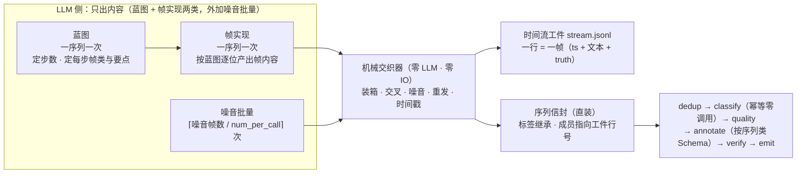
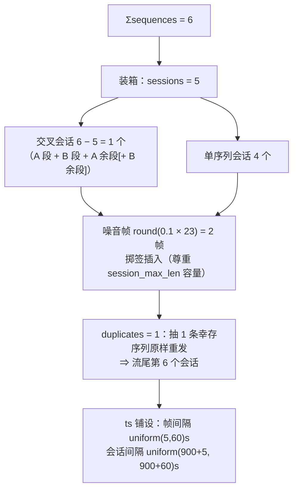

# 第 27 章　时间流生成：从零合成一条带时间戳的多会话流

> 时间流生成是 v1.13 给 `generate_only` 新增的**第三形态**（`[generate.stream]`）：不消费任何输入，
> 从零合成一条**带时间戳的多会话请求流**——LLM 只负责内容（一序列一次蓝图 + 一次帧实现），
> 会话装箱、交叉、噪音插入、重复重发、时间戳铺设全部由零 LLM 的**机械交织器**完成。
> 读完本章你应当能回答三个问题：**什么时候该合成流而不是采集流？两阶段各产出什么？
> 两份产物怎么读、怎么重放？**本章样例全部来自 `examples/synth-stream` 的真实运行
> （单端点 DeepSeek，退出码 0）。

## 27.1 为什么要合成时间流：要序列样本，但手上没有流

第 25、26 章处理的是**采集来的**真实流：先会话化、再语义分段，把帧流切成 episode、缝成线索。前提是你已经有流。但很多时候没有——新场景还没上线、隐私合规采不到、或者想要的极端形态（任务被打断三次、噪音率 20%）在真实数据里根本凑不齐几条。

第 12 章的平面生成能造数据，但造不出**序列**：它一次调用产出 N 条互不相干的独立文本，没有先后、没有会话、没有「同一条任务的第三步」。把这些独立文本硬拼成流也不行——彼此之间没有语义推进，分段算子一跑就知道那不是一段任务。

两种生成形态的分工：

| | 平面生成（第 12 章） | 时间流生成（本章） |
|---|---|---|
| 一次 LLM 调用产出 | `num_per_call` 条独立文本 | 一条序列的蓝图，或这条序列的全部帧内容 |
| 产出单位 | 一条记录 = 一行 | 一条**序列** = 一行（成员帧另落工件） |
| 时间维度 | 无 | 有：ts 严格递增、会话按 `gap_s` 可切分 |
| 结构维度 | 无 | 会话装箱、两序列交叉、噪音插入、原样重发 |
| 配额载体 | `num_per_record` / `standalone_count` | `[class.<名>.generate].sequences` × `len_range` |
| 产物文件 | 主输出 | 主输出 **+ 时间流工件**（可当输入重放） |
| 下游链 | dedup → (classify) → quality → annotate → verify | 同左，且全部以**序列**为单位 |

心智模型是**两阶段 + 机械交织**：内容交给 LLM（它擅长写一句像人说的话），结构交给代码（它擅长严格、可复现、零成本地摆位置）。



这套分工不是发明：两阶段合成（先出计划、再填内容）是 M2M、Schema-Guided Dialogue、APIGen-MT 一路的既有工序——**计划期就知道每一帧是什么角色，真值因此零再标注**；噪音在计划层注入而非事后掺沙，是过程挖掘一侧（PLG2 及 2025 年的真值方法综述）反复强调的保真值链接做法。LabelKit 把它装进单机流水线：蓝图与实现各一次调用，其余全是确定性代码。

**什么时候开**：`run.mode = "generate_only"` + 要的样本单位是「一段活动」而不是「一条文本」。开关是 `[generate.stream].enabled = true`，它是一组**硬合取**前提（缺一即启动配置错误，退出码 2）：

```
generate_only ∧ modality = "text" ∧ generate.enabled ∧ classify.enabled
              ∧ stream.order_by = "meta:<字段>" ∧ output.meta_mode ≠ "none"
```

后三条各有各的道理：类表是配额与按类条件化的载体（标签在生成期已知，直接继承，**零判决调用**）；`order_by` 声明的字段名就是工件行的时间戳字段名（摄取侧按同一声明重放）；帧类真值只经 `_meta.stream.members[]` 承载，丢了元信息就丢了全部真值。segment / stitch / extract **不参与**本形态——流是造出来的，不需要再切一遍；抽取仅 UI 模态。UI 模态的时间流生成是 v1.13 的明确非目标。

## 27.2 快速上手：examples/synth-stream 全流程

仓库自带的 `examples/synth-stream` 是第五个示例工程，也是本形态的完整展台：**两个序列类**（`ticket_booking` 高铁购票 / `smart_home` 智能家居）各 3 条序列、**三个帧类**（`task_request` / `followup` / `confirmation`）、5 个会话、10% 噪音、1 条原样重发。它**自含**一份 `config.toml`（不复用 `../config.toml`）——单 profile 纯文本端点：

```toml
[llm.default]
provider = "anthropic"
base_url = "https://api.deepseek.com/anthropic"
model = "deepseek-v4-flash"
api_key_env = "LABELKIT_DEEPSEEK_KEY"
supports_structured_output = false   # 该路由实测硬拒强制工具调用（400）⇒ L0 全关（第 6、14 章）
supports_vision = false              # 时间流生成恒 text 模态，零视觉调用
context_window = 131072
```

`supports_structured_output = false` 意味着**结构化输出层全关**——蓝图与帧实现的结构服从性完全靠提示词内嵌的结构契约撑着，JSON 由结构引擎的确定性修复层解析、校验层把关（27.5 有这条的实测代价）。逐节看 `project.toml`。

**第一节：形态开关与铺设契约。**

```toml
[run]
output = "./out/synth-labels.jsonl"
modality = "text"                 # 时间流生成恒 text 模态
mode = "generate_only"            # 没有 run.input（写了就是配置错误）
batch_size = 8                    # 6 条序列 ⇒ 一批跑完
seed = 20260813                   # 交织器单流抽签的唯一随机源

[input]
text_field = "text"               # 工件行的文本字段名（重放时 M2 按同一声明提取）

[stream]                          # 生成侧的铺设契约（复用摄取侧词汇，故可重放）
order_by = "meta:ts"              # 工件行的时间戳字段名由此声明（此处即 "ts"）
gap_s = 900                       # 会话间隔恒 > 15 分钟

[generate]
enabled = true
llms = ["default"]
num_per_call = 4                  # 本形态下仅噪音批量生成按此装箱
temperature = 0.9                 # 蓝图与帧实现同温

[generate.stream]
enabled = true
sessions = 5                      # 交叉会话数 = Σsequences − sessions = 6 − 5 = 1
noise_ratio = 0.1                 # 噪音帧 / 任务帧 ≈ 10%
noise_instruction = """生成与任何任务都无关的干扰输入：……长度 5–20 字。"""
duplicates = 1                    # 原样重发 1 条序列到流尾新会话
frame_gap_s = [5, 60]             # 会话内帧间隔均匀采样（秒），上界须 < stream.gap_s
ts_start = "2026-01-05T09:00:00+08:00"   # 时间流起点（恒不取墙钟）
```

**第二节：序列类表与按类配额。**类表在这里只是**载体**——生成期就知道每条序列属于哪个类，classify 幂等继承、零调用（所以 `report.classify` 的直方图恒全零是预期，不是 bug）。本形态下类表放宽为 ≥1 类、`fallback_class` 免填：

```toml
[classify]
enabled = true                    # 硬合取要求；标签继承（inherited），零判决调用

[[classify.classes]]
name = "ticket_booking"
description = "高铁购票类会话：查车次、订票、改签退票、选座与票务证件等围绕一次铁路出行的连续请求"

[[classify.classes]]
name = "smart_home"
description = "智能家居指令类会话：控制灯光空调窗帘等设备、设定定时与场景、查询设备状态的连续指令"

[class.ticket_booking.generate]
instruction = """你在为高铁购票场景合成真实用户与语音助手的一次对话序列。序列围绕**同一次出行**
展开：……要求口语化、中文、每帧一句话，前后帧之间信息连贯且有推进（不得原地重复）。"""
sequences = 3                     # 尝试配额（无输出条数保证，作废序列不补齐）
len_range = [3, 5]                # 单序列步数的均匀采样区间
```

**第三节：帧类表与帧内容契约。**蓝图逐步在帧类闭集上取值，**帧类即帧级真值**——所以 `frame.classify.enabled` 保持 false（真值已知，无需判决）。每个帧类都必须给出生成指令；声明了 `schema_*` 的帧类产出**结构化帧**：

```toml
[[frame.classify.classes]]
name = "task_request"
description = "发起任务的首帧请求：说明诉求并给出已知要素"
# followup / confirmation 两类同构，略

[frame.class.task_request.generate]
instruction = """产出发起任务的首帧：utterance 是用户说出的那一句话（口语、中文），
entities 逐项列出这句话里出现的关键要素……"""
schema_inline = """
{"type": "object",
 "properties": {"utterance": {"type": "string"},
                "entities": {"type": "array", "items": {"type": "string"}}},
 "required": ["utterance", "entities"], "additionalProperties": false}
"""

[frame.class.followup.generate]
instruction = """产出一句追问或修改：……口语、中文、一句话。"""   # 无 schema ⇒ 纯文本帧
```

**第四节：下游治理。**质量门 + 按序列类各一份标注 Schema（27.6 的正戏）+ 判决形评审：

```toml
[quality]
enabled = true
mode = "pointwise"
threshold = 0.3                   # 质量门演示；rubric 留空 ⇒ 自动解析为 default:trajectory

[annotate]
enabled = true
instruction = """你是时间流请求序列的标注员。阅读整段序列……"""

[verify]
enabled = true
policy = "repair"
max_repair_rounds = 1

[output]
meta_mode = "inline"              # 本形态下不得为 "none"
```

跑起来（`out/` 不入库，须先建）：

```bash
cd examples/synth-stream && mkdir -p out
set -a && source ../../.env && set +a
uv run labelkit run --config config.toml --project project.toml
```

先用 `--dry-run` 看账（真实 golden，逐字节）：

```
dry-run: mode=generate_only estimated_records=6 batches=1
dry-run: estimated LLM calls — generate_calls=13 segment_calls=0 stitch_calls=0 classify_calls=0 frame_classify_calls=0 extract_calls=0 quality_calls=24 annotate_calls=6 frame_annotate_calls=0 verify_calls=6 total=49 (excludes retries and repair calls)
dry-run: 注：按全局配置估算 / multi 按标签乘数 1 报下界
dry-run: no LLM calls made, no output written (report only)
```

`generate_calls = 13` = 2 × 6 序列 + ⌈2 噪音帧 / 4⌉ = 12 + 1；`classify_calls = 0` 是继承标签的直接体现。**这一行不是上界估算，是精确复演**——估算分支吃的是同一套计划期纯函数（同 `seed` 同配置），序列长度、噪音帧数、会话装箱全部按真实抽签算一遍（27.9 的成本账里有它与实跑的差额分解）。

真跑的终版摘要（与 `report.counts` 逐项一致，退出码 0，全程约 97 秒）：

```
   ── 终版摘要（与 report.counts 逐项一致）──
   scanned=0  ingested=0  bad_input=0  generated=6
   dropped_dup=0  dropped_lowq=0  dropped_verify=0  failed=0  emitted=6
```

`scanned=0`（没有输入这回事），守恒恒等式取 generate_only 的退化形 `emitted + dropped_* + failed = generated` → `6 + 0 = 6` ✓。**成员帧不成为信封**——它们只活在工件里，既不进主输出也不进拒绝通道，账上不出现 `absorbed` / `episodes`（那是分段算子的记账项，第 25 章）。落盘的产物（本工程 trace 未开，开了就是第五个通道，第 8 章）：

```
out/synth-labels.jsonl          主输出（6 行 = 6 条序列）
out/synth-labels.stream.jsonl   时间流工件（29 行 = 29 帧）   ← v1.13 新增的输出通道
out/synth-labels.rejects.jsonl  拒绝通道（0 行）
out/synth-labels.report.json    运行报告
```

## 27.3 `[generate.stream]` 逐键

| 键 | 默认 | 语义与约束 |
|---|---|---|
| `enabled` | false | 形态总开关；全关时全系统与 v1.12 **字节等价**（含七个既有 dry-run golden） |
| `sessions` | 0 | 会话数，≥ 1。**交叉会话数 = Σsequences − sessions**，故 M1 要求 `sessions ≤ Σsequences ≤ 2 × sessions`（交叉并发度恒 k ∈ {1,2}） |
| `noise_ratio` | 0.0 | 噪音帧 / 任务帧 比例，∈ [0,1)；噪音帧数 = `round(比例 × 任务帧数)`。> 0 时 `noise_instruction` 必填非空 |
| `noise_instruction` | "" | 噪音帧的生成指令（走既有平面生成模板批量产出） |
| `duplicates` | 0 | 原样重发的序列条数，∈ [0, Σsequences]；重发帧逐字节同源，**恒落流尾新会话** |
| `frame_gap_s` | [5, 60] | 会话内帧间隔的均匀采样区间（秒）；`0 < lo ≤ hi < stream.gap_s`——否则会话内间隔自己就触发会话切分 |
| `ts_start` | `2026-01-01T00:00:00Z` | 时间流起点（ISO-8601，**恒不取墙钟**——同 seed 双跑工件才可能逐字节一致） |

配额不在这张表里——它按类挂在 `[class.<名>.generate]`（27.4）。另有三条**铺设契约**由 M1 静态校验：`stream.key` 必须为空数组、`stream.gap_steps` 必须为 0（会话边界由交织器直接铺设，分区键与序差断开不参与）、`2 × max(各类 len_range 上界) ≤ stream.session_max_len`（交叉会话恒装两条序列）。设了 `session_max_span_s` 还会按最坏帧间隔做一次静态跨度校验。

### 会话账怎么算

本工程的账（Σsequences = 2 类 × 3 = 6，sessions = 5）：



于是工件里共 **6 个会话、29 行** = 23 个任务帧（`report.generate.stream.frames`）+ 2 个噪音帧（`noise_frames`）+ 4 个重发帧（被抽中重发的那条序列恰好 4 帧）。噪音帧数按**任务帧**折算：`round(0.1 × 23) = 2`。注意 `report.generate.stream.sessions = 5` **不含重发尾会话**——它数的是装箱出来的会话数，重发是交织末尾追加的一步。

### 确定性：单流抽签，同 seed 双跑逐字节一致

交织期的全部随机都从 `run.seed` 派生的**单条随机流**顺序消费，顺序是冻结的：计划期先按类名字典序展开配额、逐序列抽长度、逐序列预抽 (模型, 风格)；交织期依次是重复选取 → 装箱洗牌与成对交叉 → 逐交叉会话的切换点 → 逐噪音帧的 (会话, 槽位) → 时间戳铺设。同 seed 双跑的交织产物逐字节一致——**前提是蓝图与帧实现的 LLM 输出也一致**：某条序列作废会改变交织的输入集，后续抽签随之整体位移（27.9 有这条的实测）。

## 27.4 按类配额与长度：sequences × len_range

配额是**尝试配额**，语义与平面生成的 `standalone_count` 一致：**没有输出条数保证、没有补齐回路**。声明 `sequences = 3` 意味着计划 3 条，作废一条就少一条，工具不会再补生成。

```toml
[class.ticket_booking.generate]
instruction = """……"""   # 参与生成的类必填非空
sequences = 3             # 尝试配额 ≥ 1
len_range = [3, 5]        # 单序列步数的均匀采样闭区间，1 ≤ lo ≤ hi
```

两个键都可以在全局 `[generate]` 里设默认值（`sequences` 默认 0、`len_range` 默认 `[3, 6]`），按类覆盖。M1 只要求**至少一个类的有效 `sequences ≥ 1`**，且参与生成的类有非空指令。

**按类覆盖白名单在本形态下的五个键**：`instruction` / `styles` / `temperature` / `sequences` / `len_range`（完整白名单表见第 24 章 24.4 与附录 A.9）。反过来，专属**平面形态**的那几个键在本形态下显式书写是**定向配置错误**，不走「未知键仅告警」的前向兼容兜底：`[generate]` 的 `seed_examples` / `standalone_count` / `num_per_record` / `seeds_per_call`，以及 `[class.*.generate]` 的 `num_per_record` / `seeds_per_call`。报错文案会指明替代面（配额改用 `sequences`、长度改用 `len_range`）。

**生成键的效力矩阵**（与平面形态的差异都在这张表里）：

| 键 | 在时间流形态下 |
|---|---|
| `llms` / `mixture` / `weights` | 生效：**每序列预抽一次**，蓝图与帧实现绑定同一 profile（噪音批调用独立预抽） |
| `[[generate.styles]]` | 生效于**帧实现与噪音**调用（每序列预抽一个风格），蓝图不带风格 |
| `temperature` | 生效：蓝图与帧实现同温，可按类覆盖 |
| `num_per_call` | **仅**噪音批量装箱生效（一批几条噪音） |
| `sample_validator` | 生效于**逐帧文本**：任一帧违规 ⇒ **整序列作废**（蓝图定长不可剔单帧，拒绝采样语义），计 `validator_scrapped` |
| `num_per_record` / `seeds_per_call` / `seed_examples` / `standalone_count` | 显式书写 = 定向配置错误（见上） |

**序列级相似度过滤**：交织之前，同一批兄弟序列之间还有一道内置过滤（判重文本 = 成员文本按序拼接，与第 9 章序列判重同一配方；参数取 `[dedup]` 三键）。淘汰以桶统计的 `survived_dedup` 差额呈现——本次真跑两个类各 `produced 3 / survived_dedup 3`，一条没被淘汰：

```json
"buckets": {
  "smart_home×default×null":     {"calls": 6, "produced": 3, "survived_dedup": 3},
  "ticket_booking×default×null": {"calls": 6, "produced": 3, "survived_dedup": 3},
  "default×null":                {"calls": 1, "produced": 4, "survived_dedup": 0}
}
```

三行读法：类桶的 key 是 `<类>×<模型>×<风格>` 三段（第 24 章的既有形态），`calls = 6` = 3 次蓝图 + 3 次帧实现，`produced` 数的是**序列**条数；第三行 `default×null` 是**噪音桶**——噪音不属于任何序列类，key 退化为两段，`produced 4` 是那次批量调用产出的 4 条噪音文本（实际只用掉 2 条），`survived_dedup` 恒为 0：序列级相似度过滤只过序列，噪音帧不参与。

## 27.5 帧类生成面：结构化帧与纯文本帧

帧类表复用 `[[frame.classify.classes]]` 这张表（`frame.classify.enabled` 保持 false——真值已知，帧级判决没有意义；显式开它是定向配置错误，与本形态互斥）。每个帧类**都必须**在 `[frame.class.<名>.generate]` 里给一条非空 `instruction`：蓝图的 enum 覆盖全类表，任一帧类都可能被选中。

| 声明了 `schema_path` / `schema_inline`（至多其一） | 帧的形态 |
|---|---|
| 是 | **结构化帧**：帧内容是一个对象，按规范化 JSON 落工件行的文本字段 |
| 否 | **纯文本帧**：帧内容直接是一句话 |

本工程只给 `task_request` 配了 Schema，于是工件里两种帧并存（真实产物第 1 行与第 3 行，逐字）：

```json
{"ts": "2026-01-05T09:00:00.000000+08:00", "text": {"utterance": "我想订明天早上从北京到上海的高铁票，二等座就行。", "entities": ["北京", "上海", "明天早上", "二等座"]}, "truth": {"session": 0, "sequence_class": "ticket_booking", "sequence": 0, "frame_class": "task_request", "noise": false}}
{"ts": "2026-01-05T09:01:11.053996+08:00", "text": "出发时间改到下午两点以后吧，有合适车次推荐吗？", "truth": {"session": 0, "sequence_class": "ticket_booking", "sequence": 0, "frame_class": "followup", "noise": false}}
```

结构化帧的 `text` 值是**对象**本身（工件是数据文件，不是字符串容器）；重放时 M2 按既有语义把对象投影成规范化 JSON 文本参与去重与打分（第 5 章「text_field 的三种命中形态」的第二种）。帧类 Schema 会被逐位包进实现调用的内部 Schema 当子模式，所以**不要写顶层 `$schema` 声明**。

**L0 关掉的端点上，逐位契约靠提示词。**帧实现调用要求模型一次产出恰好 L 帧、且第 i 帧符合第 i 个帧类的契约。声明了 `supports_structured_output = true` 的端点上这由供应商的结构化输出层（L0）兜着；本工程的端点实测硬拒强制工具调用、profile 因此声明 `false`，**L0 全关**——结构服从性完全由提示词内嵌的结构契约承担（`{"frames": [...]}` 形状句 + 逐位「第 i 帧（帧类）须符合……」）。校验侧不受影响：`prefixItems` 是 draft 2020-12 的正规关键字，jsonschema 校验层原生逐位校验，违约照常进修复环（第 14 章）。实测结论有两面：本次真跑 **6/6 全成**（`realize_failures = 0`、用户 Schema 侧 `resolved_at` 一次修复都没花），但温度 0.9 下**偶发**违约确实存在——处置是保守的：修复环耗尽 ⇒ **该序列整条作废**（计 `realize_failures`），不产 failed 记录、不补生成（成本与调参口径见 27.9）。另一个方向的锐边：个别对结构化输出关键字挑剔的路由会对含 `prefixItems` 的请求直接 400——处置同样是配置级的，把该 profile 的 `supports_structured_output` 声明为 `false`，走「文本 + 确定性修复层解析」的路径，不需要动任何调用级参数。

## 27.6 按序列类各用一份标注 Schema（v1.13 新能力）

第 24 章有一句话在本版被改写了：「输出 Schema 全局唯一，所有类的产出行必须长一个样」——**不再是**。`[class.<名>.annotate]` 的白名单增加了 `schema_path` / `schema_inline`（至多其一），语义是**覆盖**：类声明了就用类的，没声明的类回落全局 `output.schema`。

动机在本工程里一眼可见：购票要抽的是行程要素（出发地、目的地、日期、约束），智能家居要抽的是设备动作（设备、动作、位置、定时）——同一个全局 Schema 要么写成两者的并集（每类都填一半空字段），要么退化成一个宽松对象（等于没有结构约束）。

```toml
[class.ticket_booking.annotate]
instruction = """你是高铁购票会话的标注员。……抽出这次出行的意图（intent）、出发地（origin）、
目的地（destination）、出发日期或时段（depart_date）以及其他约束（constraints）。"""
schema_inline = """
{"$schema": "https://json-schema.org/draft/2020-12/schema", "type": "object",
 "properties": {"intent": {"type": "string"}, "origin": {"type": "string"},
                "destination": {"type": "string"}, "depart_date": {"type": "string"},
                "constraints": {"type": "array", "items": {"type": "string"}}},
 "required": ["intent", "origin", "destination", "depart_date", "constraints"],
 "additionalProperties": false}
"""

[class.smart_home.annotate]
instruction = """你是智能家居指令会话的标注员。……抽出意图（intent）、被操作设备（device）、
动作（action）、所在位置（location）与定时或联动条件（schedule）。"""
schema_inline = """…… {intent, device, action, location, schedule} 五字段，略 ……"""
```

真跑主输出的对照（第 4 行与第 1 行的用户字段部分，逐字）：

```json
{"intent": "购买高铁票", "origin": "北京", "destination": "上海", "depart_date": "明天下午两点以后",
 "constraints": ["二等座", "同行人", "使用我的身份证号一起买票"]}
{"intent": "控制客厅空调和加湿器", "device": "客厅空调和加湿器",
 "action": "打开空调并调节温度到26度、降低风速、设定一小时后关闭，同时打开加湿器",
 "location": "客厅", "schedule": "一个小时后自动关掉"}
```

**同一个主输出文件里两种字段集**——这在 v1.12 及以前是做不到的。四条使用规则：

1. **覆盖不是合并**：类 Schema 在场就整份换掉全局 Schema，不做字段级合并；未声明 `schema_*` 的类照常用 `output.schema`；
2. **`output.schema` 仍是必填**：「恰好提供其一」的规则不因按类覆盖而豁免——所有类都自带 Schema 时它只是回落占位（本工程写了一份宽松对象 Schema）；
3. **启动就查全**：每份类 Schema 各自过 draft 2020-12 元校验、`_meta` 禁令与 `$ref` 遍历；该类的 few-shot 示例用**该类的 Schema** 干跑（v1.13 修掉了旧行为里「类示例过全局 Schema」的错配），错误定位精确到 `[class.<类名>.annotate].schema_*`；
4. **落盘前按行终检**：emitter 写每一行之前会拿**该行类的有效 Schema** 再校验一次——非法对象永不落盘。

下游消费方要注意的契约变化与 multi 扇出同级：**主输出的行不再是同构的**，按 `_meta.classification.label` 分流之后再各自解析。三类 Schema 的待遇差别（用户 Schema / 按类 Schema / 帧级 Schema）见第 14 章 14.5——一句话预告：按类 Schema 与全局 Schema **待遇完全相同**（代码回调校验层照常生效、照常计入 `resolved_at`），帧级 Schema 才是那个不走回调、不计账的特例。

## 27.7 两份产物：主输出 + 时间流工件

### 时间流工件：`{输出名}.stream.jsonl`

工件是 v1.13 新增的**第五个输出通道**，与主输出同级：同样先写 `.part`、同样在收尾时 fsync + 原子改名，`--dry-run` 不写它。一行 = 一帧，字段就三样——**时间戳 + 文本 + truth**：

| truth 键 | 类型 | 语义 |
|---|---|---|
| `session` | int | 全流会话序数（0 基，含重发尾会话） |
| `sequence_class` | str \| null | 所属序列类；噪音帧为 null |
| `sequence` | int \| null | 类内序数（0 基）；噪音帧与重发帧为 null |
| `frame_class` | str \| null | 帧类真值；噪音帧为 null |
| `noise` | bool | 是否噪音帧 |
| `duplicate_of` | int | **仅重发序列的帧携带**，值 = 原序列的类内序数 |

噪音帧（真实第 12 行）与重发帧（真实第 26 行）逐字：

```json
{"ts": "2026-01-05T09:22:20.673020+08:00", "text": "哎呀这雨下得没完没了啊", "truth": {"session": 1, "sequence_class": null, "sequence": null, "frame_class": null, "noise": true}}
{"ts": "2026-01-05T10:28:43.981411+08:00", "text": {"utterance": "帮我把客厅空调打开", "entities": ["客厅空调", "客厅", "空调"]}, "truth": {"session": 5, "sequence_class": "smart_home", "sequence": null, "frame_class": "task_request", "noise": false, "duplicate_of": 0}}
```

三个刻意的设计：**truth 不携带装配后的记录 id**（成员 id 由行内容决定、序列 id 由成员 id 决定，携带即循环依赖），序列归属用计划期标识（类 + 类内序数）；**行号即对账口径**——`_meta.stream.member_sources[].line_no` 指的就是工件行号，双向可查；**truth 不参与任何判定**——重放时它只是一个普通字段，需要就用 `output.passthrough_fields` 透传出来做对照。

### 主输出的 `_meta.stream`

一行 = 一条序列。真实运行产物第 1 行的元信息（格式化展示，用户字段见 27.6）：

```json
"_meta": {
  "id": "dca32faee082d938",
  "run": {"tool": "labelkit/1.0.0", "started_at": "2026-08-13T22:47:20.063046+08:00",
           "project_file": "project.toml",
           "rubric": "default:trajectory",          ← quality.rubric 留空自动解析（见下）
           "seed": 20260813},
  "source": {"file": "out/synth-labels.stream.jsonl",   ← 溯源指向工件，不是输入文件
              "line_no": 8,                              ← 首成员的工件行号
              "generated_from": [], "fields": {},
              "generator": {"llm": "default", "style": null}},   ← 合成品的唯一判据
  "stream": {
    "episode_id": "dca32faee082d938",                    ← 恒等于本行 id
    "session_id": "6a83d9760c7f5194",                    ← 所属会话（此处 ≠ id，见下）
    "order_span": ["out/synth-labels.stream.jsonl:8", "out/synth-labels.stream.jsonl:11"],
    "member_count": 4,
    "member_ids": ["0b70aaa3d93519fa", "b80f10ebf46cf54f",
                    "27728a4084747378", "37e2d24d2fbf7990"],
    "member_sources": [{"file": "out/synth-labels.stream.jsonl", "line_no": 8},
                        {"file": "out/synth-labels.stream.jsonl", "line_no": 9},
                        {"file": "out/synth-labels.stream.jsonl", "line_no": 10},
                        {"file": "out/synth-labels.stream.jsonl", "line_no": 11}],
    "members": [{"index": 0, "id": "0b70aaa3d93519fa", "label": "task_request"},
                 {"index": 1, "id": "b80f10ebf46cf54f", "label": "followup"},
                 {"index": 2, "id": "27728a4084747378", "label": "followup"},
                 {"index": 3, "id": "37e2d24d2fbf7990", "label": "confirmation"}],
    "session_split": false, "repaired": false, "degraded": null, "steps": null
  },
  "scores": {"noise_residue": 1.0, "coherence": 1.0, "purposefulness": 1.0,
              "completion": 0.4, "__aggregate__": 0.85,
              "mode": "pointwise", "batch_no": 1, "pool": "smart_home"},
  "dedup": {"kind": "unique"},
  "classification": {"label": "smart_home", "labels": ["smart_home"],
                      "source": "inherited"},                ← 生成期已知，零判决调用
  "annotation": {"model": "deepseek-v4-flash", "attempts": 1},
  "verification": {"verdict": "pass", "rounds": 1}            ← 无 defects 键（见下）
}
```

与第 25 章的流模式 `_meta.stream` 逐点对照：

| 键 | 生成侧（本章） | 采集侧（第 25/26 章） |
|---|---|---|
| `order_span` | `["工件名:首行", "工件名:末行"]` | 首末成员的序键（pair_index / 行号） |
| `members[]` | `{index, id, label}`——label 是**真值**，无 annotation/status 列 | 帧粒度开关决定列（第 25 章 25.6） |
| `steps` | 恒 `null`（extract 不参与） | extract 产物 |
| `thread_id` / `fragments` | **不出现**（stitch 不参与） | 开缝合时在场（第 26 章） |
| `degraded` / `repaired` | 恒 `null` / `false` | 分段降级与手术留痕 |
| `verification` | `{verdict, rounds}`——**没有 defects 键** | 恒带 `defects`（六值缺陷词表） |

最后一行值得展开：直装的序列走的是**判决形评审**——评审只回答「这份标注对不对」，没有缺陷表、没有边界余量段（那些证据在生成侧不存在：段边界是造出来的，讨论「切头切尾」没有意义）。不合格时 `policy = "repair"` 照常按意见重标注（穿按类 Schema），仍不合格则 `dropped_verify`——**淘汰不改真值**，这是拒绝采样，不是修数据。

**`session_id` 与 `episode_id` 的辨析**（对账时容易犯迷糊）：`session_id` 是会话内**全部帧**（含噪音帧、含交叉进来的另一条序列的帧）id 的哈希，`episode_id` 是本序列**成员帧** id 的哈希。所以本次真跑：第 2、3 行两者相等（干净的单序列会话），第 1、6 行不等（会话里混着噪音帧），第 4、5 行共享同一个 `session_id`（`0069b867c9bc188f`）——那就是**交叉会话**：两条购票序列在同一会话里交错出现（工件第 1、3、4、5 行 vs 第 2、6、7 行），`member_sources` 的行号跳跃处就是对方的帧。

### 报告：三个新读数

```json
"run": {
  "artifact": {"path": "out/synth-labels.stream.jsonl",
                "sha256": "sha256:3b4449359e273ccd5a3319b6d5e066334bd7d75123e07b5cd5535f6d1063e039",
                "lines": 29}          ← 工件条目（主输出同款形态），仅工件实际写出时在场
},
"generate": {
  "buckets": {…27.4 已解读…},
  "stream": {
    "sessions": 5, "crossed_sessions": 1,
    "sequences": {"ticket_booking": {"planned": 3, "produced": 3},
                   "smart_home":     {"planned": 3, "produced": 3}},
    "frames": 23, "noise_frames": 2, "duplicates": 1,
    "plan_calls": 6, "realize_calls": 6, "noise_calls": 1,
    "plan_failures": 0, "realize_failures": 0, "validator_scrapped": 0
  }
}
```

验收这个形态就盯这一块：`planned` vs `produced` 的差额 = 作废序列数（= `plan_failures + realize_failures + validator_scrapped` + 相似度过滤淘汰）；`crossed_sessions` 是交叉演示位还在不在的直接读数（**它依赖足量幸存序列**——作废多了会退化为 0，27.9）；`frames = 23` 只数任务帧，与工件的 29 行差着 2 个噪音帧（`noise_frames`）与 4 个重发帧。工件行数在 `report.run.artifact.lines` 里另有一笔账，两者互为交叉验证。

另外三处按需读数：`report.classify` 的直方图**恒全零**（`{"ticket_booking": 0, "smart_home": 0}`，`fallback_count = 0`）——继承标签不经分拣台，这是预期而非异常；`report.stream` 节**不出现**（那是分段算子的观测面）；`_meta.run.rubric = "default:trajectory"` 是 `quality.rubric` 留空的自动解析结果——本形态与流模式共享这条规则（打的是**序列**的分，不是单条文本的分，第 10 章、附录 B）。

## 27.8 工件重放：把合成流当输入再跑一遍

工件的行格式**就是**摄取侧的输入格式，所以它天然可以当输入。做法三步：把 `synth-labels.stream.jsonl` 拷成某个工程的 `run.input`；`[stream]` 抄同样的 `order_by = "meta:ts"` 与 `gap_s = 900`（交织器铺的会话间隔恒 > `gap_s`，摄取侧就能切出与生成侧一致的会话）；开 `[segment]` 按第 25 章的形态跑。

实测（29 帧、process 模式 + segment，退出码 0）：

| 读数 | 值 | 读法 |
|---|---|---|
| 会话数 | 6 | = `sessions` 5 + 重发尾会话 1 ✓ 会话切分逐字复演 |
| episodes | 6 | 六条序列各成一段 |
| `absorbed` | 28 | 被吸收进 episode 的帧 |
| `dropped_noise` | 1 | 分段判噪剔除的帧 |
| `dropped_dup` | 1 | **重发会话与原会话命中判重**——本形态判重演示位就在这里 |

两个值得记住的细节：

**判重档位是 `near_text` 而不是 `exact`。**重发帧与原帧逐字节同源，但原会话里还混着一个噪音帧——它这次被 segment **吸收**进了 episode（29 帧里只有 1 帧被判噪，另一个噪音帧没被剔），于是原 episode 比重发 episode 多一帧成员，序列判重配方（成员文本按序拼接）不再逐字节相同，落到近似层。噪音帧若被剔干净则两侧成员文本完全一致、走 `exact`。**档位随分段判决浮动是正常的**，判重命中本身不受影响（第 9 章的序列判重口径）。

**重发序列不在本次运行的守恒账里。**重发帧只活在工件（不构造信封），所以生成那一跑既没有它、也不会出现 `dropped_dup = 0` 以外的值——判重演示位**在重放**，不在生成。重放时加 `--strict` 预期退出码 1（有 rejects：判重行 + 噪音帧行），这与第 25 章 stream 工程的 strict 策略是同一件事。

## 27.9 成本账与调优

**成本模型**（设 Σsequences = 幸存前的计划序列数）：

| 来源 | 次数 | 本工程（估算行数值） |
|---|---|---|
| 蓝图 | Σsequences | 6（真跑 `plan_calls = 6`） |
| 帧实现 | Σsequences | 6（真跑 `realize_calls = 6`） |
| 噪音批量 | ⌈噪音帧数 / `num_per_call`⌉ | 1（真跑 `noise_calls = 1`，2 帧一批装下） |
| quality / annotate / verify | 记录基数 = 幸存序列数（× 各自的准则数 / 轮数） | 24 / 6 / 6（真跑另有一轮 repair 的 +1 标注 +1 复审） |

合计估算 `2 × Σsequences + ⌈噪音帧数 / num_per_call⌉` = 13 次生成调用，全链估算 49。实跑 **52 次**（`llm_usage.default.calls`）、约 **97 秒**（`timing.wall_s = 96.972`）。差额三次的分解：主输出第 4 行的 `verification.rounds = 2` 说明它走了一轮修复（1 次重标注 + 1 次复审）；余下 1 次落在内部结构的修复环上——用户 Schema 侧一次修复都没花（`resolved_at` 的 `l1` / `l3_*` 全为 0、7 次调用全部一次到位），`llm_usage.default.retries = 0` 又排除了重试。**估算历来不含修复与重试**（第 15 章）。分阶段耗时：

```json
"per_stage_s": {"generate": 38.362, "dedup": 0.003, "classify": 0.0,
                 "quality": 26.244, "annotate": 16.973, "verify": 15.387}
```

`classify` 恒 0.0 秒（继承标签零调用），生成阶段反倒成了大头——13 次调用里有 12 次要写出整条序列的内容，单次输出 token 远大于下游的判决类调用。第 17 章「quality 是大头」的结论在本形态下不成立。

**上下文预算这边也有一笔账**（第 6、16 章）：声明了 `context_window` 的 profile 会在启动时打出预算 INFO 行，M1 另外**静态预检**蓝图与帧实现两段的最坏 prompt（`L_max × max(帧类 Schema 估算) + 类 instruction`）——装不下就是启动配置错误，不会等到跑起来才炸。运行期帧实现调用若真的溢出，降级动作是**序列对半分**（前后半各一次实现调用、Schema 与蓝图概要同步减半，至多两级），计入 `report.budget.degrade_retries`；降级仍失败则该序列作废。本次真跑 `budget = {"profiles": {"default": {"context_window": 131072, "input_budget": 113868}}, "truncations": {}, "overflow_records": 0, "degrade_retries": 0, "escalations": 0}`——13 万的窗对 3–5 帧的短序列绰绰有余，一次降级都没发生。

**温度是这个形态最难拿捏的旋钮**，两头都有代价：

| 方向 | 代价 | 症状 |
|---|---|---|
| 温度太低（如 0.2） | 同类的几条序列彼此近重 | 序列相似度过滤大批淘汰，`survived_dedup ≪ produced` |
| 温度太高（如 1.2） | 帧实现违反逐位契约或写超输出上限 | `realize_failures` 上升，`produced < planned` |

本工程取 0.9（生成侧默认值）——`produced` 与 `planned` 3/3 打平、去重零淘汰。L0 关掉的端点上这条边界更窄一些：结构服从性没有供应商兜底，温度对格式的影响直接传导到作废率。调参口诀：**先看 `produced/planned`，再看 `survived_dedup/produced`**——前者掉说明温度/契约压不住，后者掉说明温度/指令不够撒开。

**规模化三条**：其一，`sessions` 与 `Σsequences` 的比值决定交叉密度（`sessions = Σsequences` 全是单序列会话、`sessions = Σsequences / 2` 全是交叉会话），要多少穿插样本就按这个比例算；其二，噪音率是**训练信号**不是脏数据——它教下游的分段器认弹窗与闲聊，别为了「产物干净」把它调成 0；其三，`--limit` 的单位是**序列**，截断发生在计划期的配额层（按类名字典序取前缀），作废的序列不再生成、也不进交织——所以工件与主输出的覆盖面恒一致，用 `--limit 2` 试跑得到的是一份完整的小号时间流，而不是被砍掉一半的流。

## 27.10 排障

| 症状 | 先看 | 处置 |
|---|---|---|
| `produced` 明显少于 `planned` | `report.generate.stream` 的三项 failures | `plan_failures` 高 ⇒ 蓝图 Schema 对模型偏难或帧类表过大；`realize_failures` 高 ⇒ 降温度、缩 `len_range`、给帧类 Schema 减字段；`validator_scrapped` 高 ⇒ 你的 `sample_validator` 规则对整序列过严（一帧违规就废整条） |
| `crossed_sessions = 0`（本该有交叉） | 幸存序列数 vs `sessions` | 交叉会话数 = Σ**幸存** − sessions——作废序列会把它吃掉。先治作废率，再谈交叉 |
| 桶的 `survived_dedup ≪ produced` | 温度与类指令 | 同类序列彼此太像：提温度、把类 instruction 写出更多可变要素（不同城市/设备/时段），或拆成更多类。**别放松 `[dedup]` 阈值**——那是掩耳盗铃 |
| 工件重放时会话对不上 | `[stream]` 的三个键 | 重放工程的 `order_by` 必须是同一个 `meta:<字段>`、`gap_s` 必须与生成侧一致（交织器按 `gap_s + frame_gap_s` 铺会话间隔）；`key` / `gap_steps` 在重放侧别乱设 |
| 按类 Schema 好像没生效 | `_meta.classification.label` 与节名 | 节名必须**逐字**等于类名（`[class.<类名>.annotate]`）；类名拼错的节会被当作未知类报配置错误。确认该行的 label 正是那个类——回落全局 Schema 时字段集自然是全局那份 |
| 整条序列作废率高但看不出原因 | stderr 的 WARN | 作废路径都有 WARN（蓝图/实现/校验钩子各一条），文案带序列序号与类名。想看提示词与响应，把 `trace.channels` 加 `"llm"` 并把 `trace.content` 临时开到 `full`（数据副本，用完即清，第 16 章） |
| 想复现某一次产物 | `report.run.seed` 与两个 digest | 同 seed + 同配置下交织是逐字节确定的，但**蓝图/实现的 LLM 输出不是**——一条序列作废就会改变交织输入、后续抽签整体位移。要逐字节复现，先确认 `produced` 与那次一致 |

最后一份检查清单，开这个形态前过一遍：`generate_only` + text + `generate` + `classify` 四个开关都在位？`stream.order_by` 写成了 `meta:<字段>` 且 `gap_s > frame_gap_s` 上界？每个帧类都写了 `[frame.class.<名>.generate].instruction`？`sessions ≤ Σsequences ≤ 2 × sessions`？`output.meta_mode` 不是 `"none"`？下游知道一行 = 一条序列、成员在工件里、**不同序列类的行字段集可能不同**了吗？
