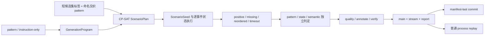

# Sequence generation examples

本目录是 v1.21 序列生成的完整教学工程。旧的 blueprint、tier、sequence rule、用户 session 计数和机械 weaver
配置已经删除；主例先演示交织关闭时的反事实序列，随后说明如何用短候选集与命名 pattern 开启交织。
v1.21 没有改变 generation stream envelope 或 ID 公式，工件编码域仍显示为 `labelkit:v1.20`。



## 工程入口

| project | 学习目标 | checker |
|---|---|---|
| `project.toml` | 显式 pattern、共享世界、四种反事实、交织关闭、双噪声与 replay | `check_output.py` |
| `project-instruction-only.toml` | 不声明 role/order/gap，由完整 instruction 与世界状态约束序列 | `check_output.py --instruction-only` |
| `project-frame-only.toml` | 关闭 sequence annotation，只保留逐帧 annotation | `check_output.py --frame-only` |
| `project-replay.toml` | 把最终 stream 当普通输入，验证 segment/noise/dedup | `check_output.py --replay` |

`config.toml` 只保存 DeepSeek profile 和密钥环境变量名。所有工程使用 Anthropic 兼容入口、
`deepseek-v4-flash`、`supports_structured_output = false` 和 `thinking = "disabled"`。

## 先做不读取密钥的计划验证

从本目录运行：

```bash
mkdir -p out
uv run labelkit validate --config config.toml --project project.toml --console plain
uv run labelkit run --config config.toml --project project.toml --dry-run --console plain
```

这两条命令会编译正式运行使用的同一份 `GenerationProgram` 和 `ScenarioPlan`，但不会读取 API key value、
消耗 slot attempt 或替换正式产物。主例的冻结算术是：

| 对象 | 数量 |
|---|---:|
| counterfactual sets | 2 |
| variants per set | 4 |
| primary sequences | 8 |
| primary events | 22 |
| noise events | 2 |
| replay events | 3 |
| stream rows | 27 |

交织不改变上述数量。若可见 primary branch 数为 `N`、冻结交织布局数为 `D`，则报告派生
`primary_sessions = N - D` 与 `interleaved_primary_sessions = D`；实际 `D` 由同一 seed 的 ScenarioPlan 冻结，
在 dry-run 中即可核对。主例的 `D = 0`，所以派生出 8 个 primary sessions、0 个 interleaved primary sessions。

## 阅读 declared 主例

`project.toml` 的阅读顺序是：

- `[class.ticket_booking.generate]` 声明完整 state Schema、ScenarioSeed catalog 与世界构建指令；
- `[generate.pattern.booking_success]` 声明 role 顺序和最大总跨度；
- 每个 `[generate.pattern.booking_success.role.*]` 声明 actor、frame class、状态读写/发布权限与 payload binding；
- role gap 显式声明相邻事件的时间区间；
- `[[generate.counterfactual_sets.variants]]` 声明 positive、missing、reordered 与 interval-exceeded；
- `[generate.timeline]` 冻结 timestamp、session 容量、noise 与 replay 布局；
- `[generate.noise].topics` 按 ordinal 一对一声明两个不同话题。

## 阅读交织配置

主例让 `[generate.interleaving]` 与全部 `interleaving_candidate_set` 同时不存在，这是关闭交织的唯一方式；
`report.generate.sequence` 因而给出零 opportunity、零 interleaved session 与空 pattern map。要在自己的 declared
工程开启交织，候选集标签只负责把 positive branch 分组，使用 `food_dinner` 这类短名称即可；不要把 class、日期、
tier、App 名拼进标签。命名交织 pattern 才负责说明哪个候选集接受 trigger 抽取、从哪个 partner pool 不放回取一条，
以及这个 pattern 的权重。`no_interleaving_weight = 9` 与唯一可用 pattern 的 `trigger_weight = 1` 表示每次机会里
standalone 和交织分别占 9 张票与 1 张票，不保证最终恰好 9:1。

用户不枚举 `A B B A B A A` 这样的 owner word。Planner 只整体平移两条已冻结 branch，在保持各自事件顺序、gap、
duration、resource 与 calendar 的前提下求出至少三段 owner runs。pattern 和 partner 一旦抽中就不会替换；该 pair
无合法布局时，validate/dry-run 直接以 `generation_plan_infeasible` 失败，不退回 standalone，也不等真实运行 retry
重新抽取。

主例中的 noise 话题固定为“夜空中的月相观察”和“手工面包出炉时的香气”。renderer 只能表达当前
`NoiseSlot.topic`；独立 evaluator 必须同时确认与任务无关、没有可执行诉求、表达自然、忠实计划话题。
文字 MinHash 只作为后置近重门，不替代语义话题判定。

四个变体作为一个 attempt transaction 交付。任一变体、状态重放、独立判定或下游处理失败，整个 set 都不进入
main、stream、dedup index 或 dataset counters；下一次 attempt 从共享世界重新生成完整四分支。

## 运行真实主例与回放

把 `LABELKIT_DEEPSEEK_KEY` 放在仓库根目录 git-ignored 的 `.env`，只加载到当前 shell：

```bash
set -a
source ../../.env
set +a
uv run labelkit run --config config.toml --project project.toml --console plain
uv run python check_output.py
uv run labelkit run --config config.toml --project project-replay.toml --console plain
uv run python check_output.py --replay
```

主 checker 从用户可见工件证明八条 sequence、四种目标违规、main/stream 双向 owner 对账、交织关闭的零值统计、
派生 session 算术、hidden sentinel 不泄漏、三事件 replay provenance、report/manifest digest 和 27 行精确组成。
它不声称从产物读取未公开的 state patch；patch 重放由真实集成测试从内存 `EventTrace` 独立验证。

replay checker 要求同一 27 行 stream 精确得到 9 个 episode、25 个 absorbed primary frame、2 个
`dropped_noise`、1 个 exact duplicate 和 8 个 emitted sequence。噪声误入 episode 或 replay 未被普通 M3 命中都会失败。

## 学习 instruction-only

`project-instruction-only.toml` 不声明 pattern、role、order、gap 或 variant。它仍显式声明 state Schema、actor、
frame class、长度和世界构建 instruction；LLM 在这些边界内选择事件内容与顺序，状态执行和独立语义门仍然存在。

```bash
uv run labelkit validate --config config.toml --project project-instruction-only.toml --console plain
uv run labelkit run --config config.toml --project project-instruction-only.toml --console plain
uv run python check_output.py --instruction-only
```

checker 要求一条三事件序列，并证明公开 truth 不伪造 declared pattern、variant 或 expected violation。

## 学习 frame-only

`project-frame-only.toml` 关闭 segment 和 sequence annotation，开启 pointwise quality 与 `frame.annotate`。
先验证静态调用预算，再运行真实端点：

```bash
uv run labelkit validate --config config.toml --project project-frame-only.toml --console plain
uv run labelkit run --config config.toml --project project-frame-only.toml --dry-run --console plain
uv run python check_output.py --frame-only --static
uv run labelkit run --config config.toml --project project-frame-only.toml --console plain
uv run python check_output.py --frame-only
```

checker 要求一条三帧 sequence 精确交付，main 的 sequence annotation 为 null、sequence resolved-at 计数为零，
每个 main member 与对应 primary stream 行的 frame annotation 相同且通过
`schemas/frame-annotation.json`。任一帧缺失、失败或 Schema 非法都会使整个 slot attempt 失败。

## 产物真值

成功运行先原子替换 main、stream 与 report，最后写 manifest。只有 manifest 中的 run ID、delivery digest、
路径、SHA-256 和行数都与正式文件一致，消费者才应把这一代视为完整提交。`*.failed.report.json` 是失败诊断，
不能覆盖或否定上一代仍由 manifest 指向的成功四件套。
