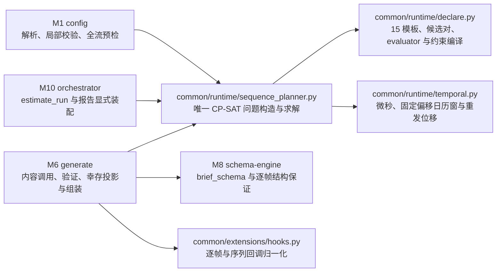
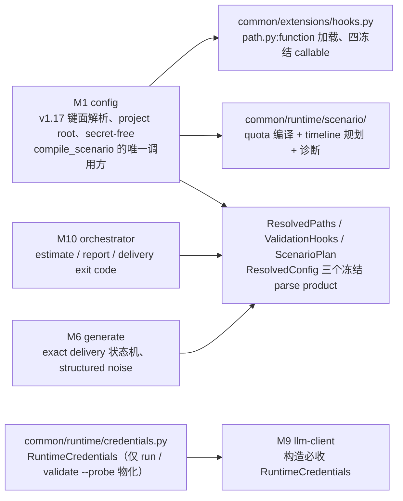

# 3. 模块详细设计

本章每个模块按统一模板描述：**职责与边界 → 输入/输出 → 数据结构与 API → 算法与流程 → 配置项 → 错误处理 → 背书**。所有代码签名为 Python 3.11+，公共数据结构（`Record`、`PipelineItem` 等）的完整定义集中在第 4 章。

## 3.0 v1.16 时间流序列规则的跨模块落点

v1.16 不增加新的流水线 Stage 或模块编号。它在时间流生成的既有 M1/M6/M8/M10 接缝上增加共享 common 运行时算法；M11、M12、CLI、M9 与其他算子不增加行为分支。约束路径的单一依赖方向如下：

| 责任面 | 规范落点 | 强制边界 |
|---|---|---|
| M1 配置 | 3.1：解析全局/按类 rules/windows 与 `sequence_validator`，校验 15 模板、correlation Schema、每个候选长度、全配额前缀和 planner 状态 | 用同 seed 独立 RNG 副本，不推进运行期随机源；UNKNOWN 不得伪报不可满足 |
| M6 生成 | 3.6：实际前缀重放联合计划；约束路径生成 brief/frames，依次执行逐帧回调、声明式 evaluator、序列回调、相似度、幸存投影、噪音过滤、回填、重发与组装 | 首个 LLM 调用前冻结 word/session/timestamps/noise slots；失败后不重解、不重织、不补齐 |
| M8 结构引擎 | 3.8：新增 `brief_schema(length)`；既有 `plan_schema` 完整保留给 v1.15 默认路径 | brief Schema 只允许逐位置 `brief`，不让约束路径 LLM 决定 frame class |
| M10 编排 | 3.10：`estimate_run` 复用同一 planner；按固定键位显式装配 rules、回调 scrap 与 windows 报告块 | 不自行推导另一套计划；显式零值块不依赖计数器首触 |
| common 配置/契约/扩展 | 第 4–5 章：冻结 `SequenceRuleSpec`、`CorrelationSpec`、`SequenceWindowSpec`、`SequenceValidationInput`、三态 effective helpers 与 hook 契约 | common 不导入 operators/orchestration；回调拿 JSON-compatible 深拷贝，突变不回写 |
| M11 与 M12 | 第 6–7 章：沿用既有工件、报告交付、trace 与日志纪律 | 工件行形和 truth/generator 键序不变；零新 trace 通道、事件或错误 kind |

联合规划器不是一个新算子：它在 M1、`estimate_run` 与 M6 之间共享同一个问题构造与求解入口。生产依赖精确锁定 `ortools==9.15.6755`，模型固定单线程与确定性预算；不提供自研替代实现、运行时版本替换或失败后的 fallback。没有实际生效 rules/windows 且没有 `sequence_validator` 时，调用链必须直接落回 v1.15 原分支并保持逐字节等价。

## 3.0.1 v1.17 场景规划与精确交付的跨模块落点

v1.17 同样不增加新的流水线 Stage 或模块编号。它在 M1/M6/M9/M10/M11/CLI 的接缝上重构时间流生成的规划、路径、凭据与交付面；共享运行时算法落新的 canonical 包 `labelkit/common/runtime/scenario/`，**取代并删除** v1.16 的 `common/runtime/sequence_planner.py`、`declare.py`、`temporal.py`（仍需逻辑先迁入新属主再删旧文件，不留 re-export、无平行实现）；`orchestration/profile_usage.py` 同批删除，引用收集器下沉 common 层。依赖方向与强制边界：

| 责任面 | 规范落点 | 强制边界 |
|---|---|---|
| M1 配置 | 3.1：v1.17 键面（quotas / schedule / crossed_sessions / noise / sequence_rules / frame_rules / frame_windows / duration / resources，5.2.2）、project-root 相对路径与 `ResolvedPaths` 派生、四个 hook 的 `spec_from_file_location` 加载与 synthetic probe、`derive_stream_bounds` 一次性派生检查、`compile_scenario` 单次调用 | 静态校验不读任何环境变量 value reader；time-stream 形态无法生成完整计划时 load 不返回半成品；不再触发 `check_local_candidates` / `check_question` 旧调用面 |
| scenario 包 | `scenario/model.py`（frozen dataclass 族，4 章）、`quota.py`（period 展开、exact cohort、largest remainder、quota model 与逐类 target）、`calendar.py`（fixed-offset schedule、frame window、period bucket）、`rules.py`（frame rule 与 sequence rule 解析后的纯语义/evaluator）、`planner.py`（`compile_scenario`、model assembly、solve、decode、digest）、`sessions.py`（owner permutation、session/crossing/noise reserve builder）、`diagnostics.py`（bounds、family stats、assumptions 与 exception）、`noise.py`（frozen layout 上的 deterministic noise allocation） | common 不导入 operators/orchestration；删除 v1.16 三个旧 planner 文件与 `orchestration/profile_usage.py`，不创建同名 shim、re-export 或 compatibility module |
| 凭据 | `common/runtime/credentials.py`：`RuntimeCredentials` 仅 run 与 `validate --probe` 经 `resolve_credentials` 物化；common 层唯一 `referenced_profiles(config)` 收集器（static validation、credential resolution、probe、runtime 与 estimate 共用） | 删除 `LLMProfile` / `EmbeddingProfile` 的 `api_key` 字段（profile 只保存环境变量名）；LLMClient 构造必收 `RuntimeCredentials`，删除内部 env fallback 与 profile secret fallback；credentials 不进 repr、日志、trace、report、exception 或 deepcopy |
| M6 生成 | 3.6：只读消费 `ScenarioPlan`——stable slot 交付状态机（brief / realize / validate × `max_attempts_per_slot`）、structured noise、幸存者投影（duplicate source 未交付只计 shortfall） | 不重新规划、不改 frame word / timestamps / session / quota / noise slot；slot 顺序 acceptance 与 similarity commit（并发调用可乱序完成，提交回 slot 序）；删除 M6 侧 `select_feasible_plan` |
| M10 编排 | 3.10：dry-run 顶层 `report.estimate` 直接引用 estimate 对象（console 与 JSON 同源）；`report.run.paths`、`report.generate.stream` 新四键与 quota row 装配；delivery 耗尽 exit 1 | 不再触发 planner（plan 由 M1 冻结在 `ResolvedConfig.scenario_plan`）；estimate 不重复求解 |
| M11 发射 | 3.11：只消费 `ResolvedPaths`；partial exact delivery 原子交付（已成功部分照常写主输出 / 工件 / rejects） | 不从字符串重新推导 cwd-relative 路径；report 文件名后缀不按命令模式追加 |
| M8 / hooks | 3.8 与第 4 章：`ResolvedHook` / `ValidationHooks` 冻结 callable 载体；`ScenarioSequence` / `ScenarioValidationInput` 新冻结输入 | M6 与 schema engine 不再按字符串二次 resolve hook；序列化面只允许 reference，绝不遍历或输出 target |

`ScenarioPlan` 在 M1 创建一次（`ResolvedConfig.scenario_plan`），validate console、dry-run report、live report 与 M6 消费同一对象并回显同一 `plan_digest`（相同配置字节、CLI override、seed、LabelKit/OR-Tools 版本必须得到相同 digest）。不新增第三方依赖：整数与时间规划继续使用已锁定的 `ortools==9.15.6755`，hook 文件加载使用 stdlib `importlib`，fixed-offset calendar 使用 stdlib `datetime`。RNG 侧自 v1.17 起分立五个具名、互不借位的随机流（`scenario.preference` / `scenario.noise` / `delivery.profile` / `delivery.content` / `artifact.duplicate`，各 `Random(f"{seed}:<name>")` 独立构造）——某 slot 多一次 content retry 不得改变其他 slot 的 length、timestamp、noise、profile 或 duplicate 抽签。
