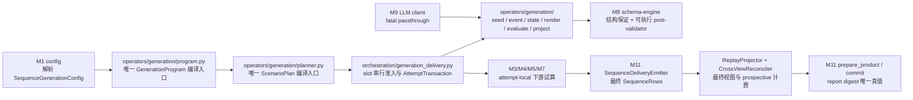

# 3. 模块详细设计

本章每个模块按统一模板描述：**职责与边界 → 输入/输出 → 数据结构与 API → 算法与流程 → 配置项 → 错误处理 → 背书**。所有代码签名为 Python 3.11+，公共数据结构（`Record`、`PipelineItem` 与 v1.18 generation 契约）集中在第 4 章。

## 3.0 v1.18 序列生成内核的跨模块落点

v1.18 不增加 Stage 编号。flat generate 继续由 M6 的 `GenerateStage` 进入既有回流链；sequence generate_only 由 M10 的专用交付控制器驱动，不把全仓 Stage 协议改造成事务框架。

| 责任面 | 规范落点 | 强制边界 |
|---|---|---|
| M1 配置 | 3.1、5.2：解析互斥的 declared / instruction-only 形状，冻结 `SequenceGenerationConfig`、ClassView 与六个绝对输出路径 | 旧 sequence-generation 键定向拒绝；不读取密钥值、不调用 LLM、不反向导入 operators；M1 后同一 compiler/model 供 validate、dry-run、run |
| planner | 3.6：按完整 primary session 分 block，用固定单线程 CP-SAT 冻结 role/position、逻辑时间、投影时间、session、noise 与 replay | 只接受 OPTIMAL；INFEASIBLE 为 exit 2，FEASIBLE/UNKNOWN 与 MODEL_INVALID 为 exit 4；无 greedy fallback |
| generation operators | 3.6、3.8：逐事件以 `EventExecutionContext` 为唯一根，按 ActorView → EventPlan → 原子 StateExecutor → Schema/hook → publish → FrameRenderer → 无 role EventDraft 执行；PatternEvaluator 绑定 actual role 后才构造 EventTruth；另有独立 state/blind semantic/noise evaluator 与 pre-downstream 投影 | declared 不暴露 hidden state；EventDraft 是唯一逐事件 history carrier；instruction-only 不声称机械 actor knowledge；semantic request 不携带 evaluator truth；反例只从目标点起重规划 causal suffix，protected prefix 只复用 draft 语义字段并重派生分支 ID/工件时间 |
| delivery | 3.10：一个 counterfactual set 是一个 slot attempt；prospective dedup → pointwise quality → annotate → verify → M11 装配 `SequenceRows` → replay 投影 → CrossViewReconciler → retained-content check → group commit | `AttemptTransaction.items` 是唯一可变 item 真值；slot 与 variant 按声明序准入；失败丢弃全部 attempt-local 数据和 dataset counter delta，usage/resolved-at/trace 不回滚；fatal、熔断、取消原样穿透且不消耗 attempt |
| M11 发射 | 3.11：`assemble_sequence` 以最终 item 装配零 I/O `SequenceRows`；`prepare_product` 唯一计算 digest 并构造 `GenerationProduct(main_rows, stream_rows, report)`；全部 sequence/noise/replay 接受后才打开正式通道 | `commit` 只读 report 的同一 digest；main、stream、report 各自 `.part` + fsync + replace，manifest 最后替换；commit-I/O 可留下固定路径混代，旧 manifest 保持；failed report 不能否定有效 manifest |
| common 契约 | 第 4 章：冻结含 `EventDraft` 的 generation dataclass、request/result 与 `DedupProbeToken`；Mapping 构造时复制为只读视图 | `EventDraft` 不含 role，`EventTruth` 不得用作逐事件 history；删除旧 `GenerateStreamConfig`、`ScenarioConfig`、旧 `ScenarioPlan`、`SequencePlan`、`StreamPlan` 与序列 hook 输入，不留 alias 或 wrapper |

依赖方向保持 `cli → orchestration → operators → common`。新增 `jsonpatch` 用于 RFC 6902 原子状态执行；既有 `ortools==9.15.6755` 保持精确锁定。sequence 生产代码落 `labelkit/operators/generation/` 与 `labelkit/orchestration/generation_delivery.py`，旧 `labelkit/common/runtime/scenario/`、`labelkit/operators/generate_stream.py` 和 `labelkit/common/config/_generate_stream_constraints.py` 整体删除，不保留并行实现。
