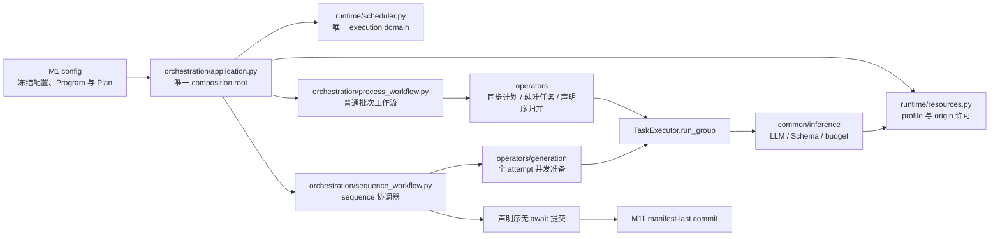

# 3. 模块详细设计

本章每个模块按统一模板描述：**职责与边界 → 输入/输出 → 数据结构与 API → 算法与流程 → 配置项 →
错误处理 → 背书**。所有代码签名为 Python 3.11+，公共数据结构集中在第 4 章。

## 3.0 v1.19 统一执行运行时的跨模块落点

v1.19 不增加 Stage 编号。flat generate 继续由 M6 的 `GenerateStage` 进入既有回流链；sequence
generate_only 由 M10 的 `SequenceWorkflow` 驱动。两条路径共享 Application 创建的唯一
`ExecutionRuntime`、`TaskExecutor`、`ResourceManager` 与 `LLMClient`，但业务阶段、重试、去重、
CrossView、retained-content 和工件提交仍由工作流与 operator 拥有。

| 责任面 | 规范落点 | 强制边界 |
|---|---|---|
| M1 配置 | 配置章节解析普通与 sequence 形状，冻结 `ResolvedConfig`、`GenerationProgram`、`ScenarioPlan` 与输出路径 | 不新增 `[runtime]`、workers、queue 或 HTTP pool 配置；现有 profile `max_concurrency` 是唯一容量真值 |
| 执行运行时 | `labelkit/runtime/` 按 `ResourceKey` 有界接纳叶任务，以 `asyncio.TaskGroup` 管理寿命并按请求输入序返回结果 | 不执行业务 retry，不认识 PipelineItem、slot、dedup 或工件；域外、嵌套或叶任务内 `run_group()` fail closed |
| 资源管理 | `ResourceManager` 持有 LLM/embedding profile 许可、HTTP origin 许可与显式连接池容量 | 逻辑调用许可覆盖 retry/backoff/parking；不同 profile 独立；repair 与 probe 复用同一资源根 |
| 普通工作流 | `ProcessWorkflow` 保持一个活动批和固定阶段屏障；operator 统一执行“同步计划 → 纯叶任务组 → 冻结 ordinal 归并” | 叶任务不得修改 PipelineItem、quality pool、claim table、DedupIndex 或 emitter；不跨 batch overlap |
| generation operators | `operators/generation/` 继续以 `EventExecutionContext` 为事件执行根，完成生成、状态执行、独立评估与投影 | 同一 branch 的 state_after 依赖保持串行；不同交付槽和 declared suffix 可并发准备 |
| sequence 工作流 | `SequenceWorkflow` 以连续候选缓冲推进 slot coordinator，完成 generation → evaluation → dedup reservation → quality → annotate → verify → candidate-local CrossView | 高 ordinal 只准备冻结候选；只有当前 head 可按声明序重验证并提交。去重、frontier、retained 与 DeliveryState 的提交临界区无 `await` |
| M11 发射 | `assemble_sequence` 从最终 item 组装 `SequenceRows`；全部 primary/noise/replay 接受并完成最终 full CrossView 后 manifest-last | failed report 必须等待 coordinator、叶任务和 cleanup 全部结束后冻结；失败不替换旧成功 manifest |
| common 契约 | `common/contracts/execution.py` 冻结 `TaskSpec`、`TaskGroupRequest`、`TaskExecutor` 与 `ResourceLimiter`；generation 契约冻结 reservation、prepared candidate 与 frontier carrier | `RunContext`、`RunServices`、`GenerationServices` 显式共享同一 TaskExecutor，不提供默认 executor、兼容构造或隐式任务身份 |

依赖方向冻结为 `cli → orchestration → operators → common`，同时 `orchestration → runtime → common`。
operators 只依赖 `common/contracts/execution.py` 的协议，不导入 runtime 实现；common 不导入 runtime、operators
或 orchestration。LLM、Schema、预算与凭据唯一位于 `labelkit/common/inference/`。

旧 `labelkit/common/runtime/`、`labelkit/orchestration/runtime.py`、
`labelkit/orchestration/orchestrator.py` 与 `labelkit/orchestration/generation_delivery.py` 全部删除；不保留
import shim、包装函数、alias、migration 或 fallback。执行运行时不新增生产依赖，继续使用 Python
`asyncio` 与现有 HTTPX。
